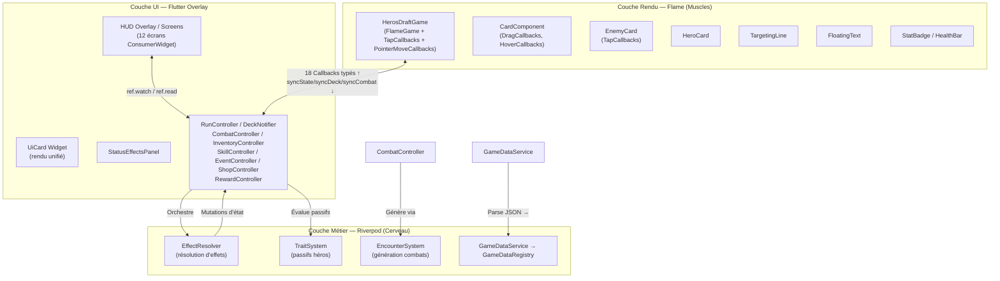
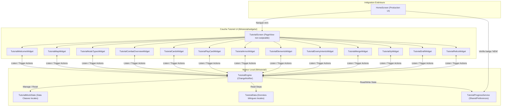
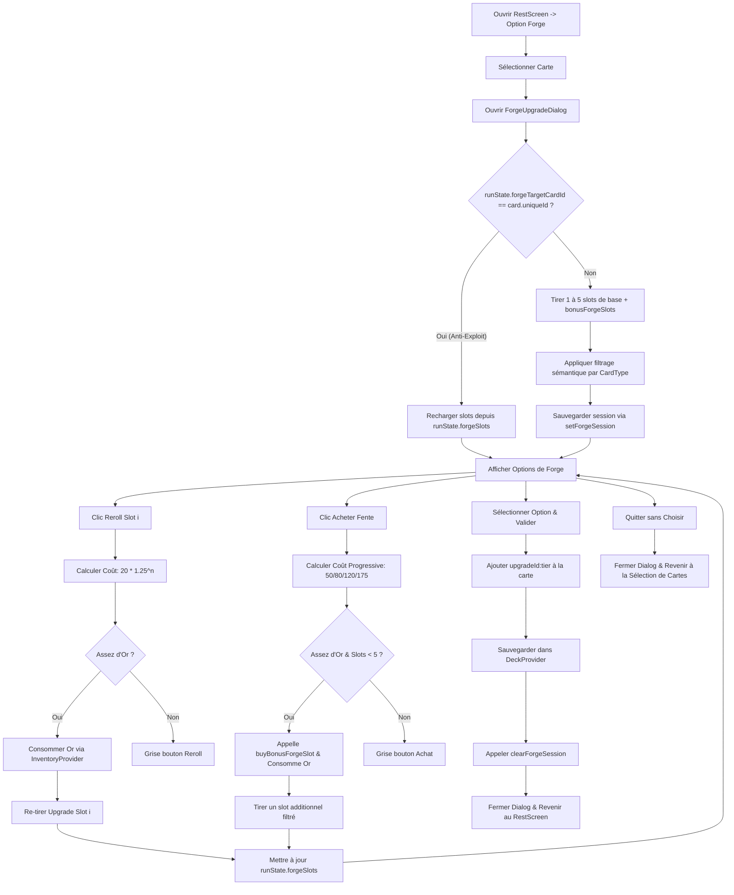
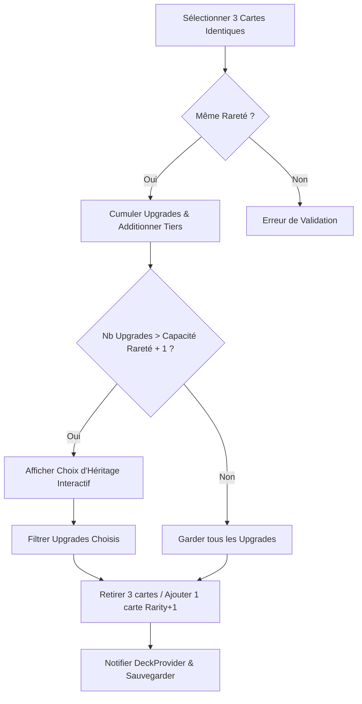
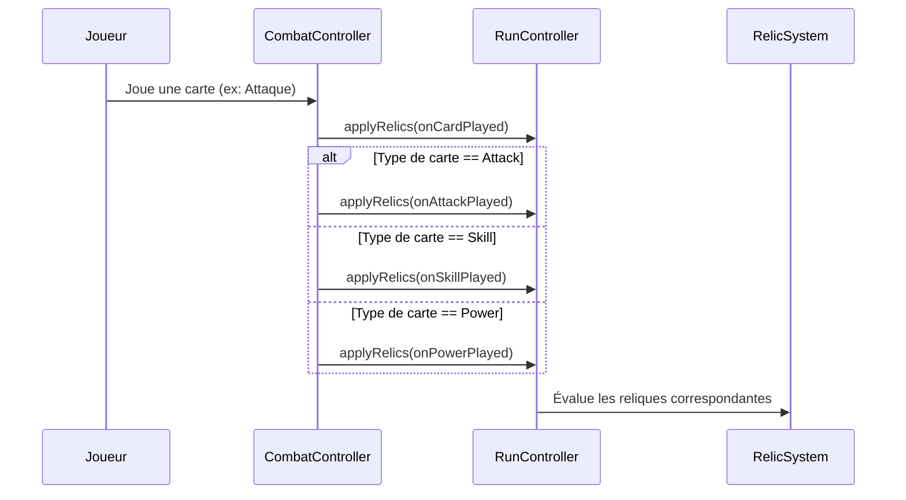
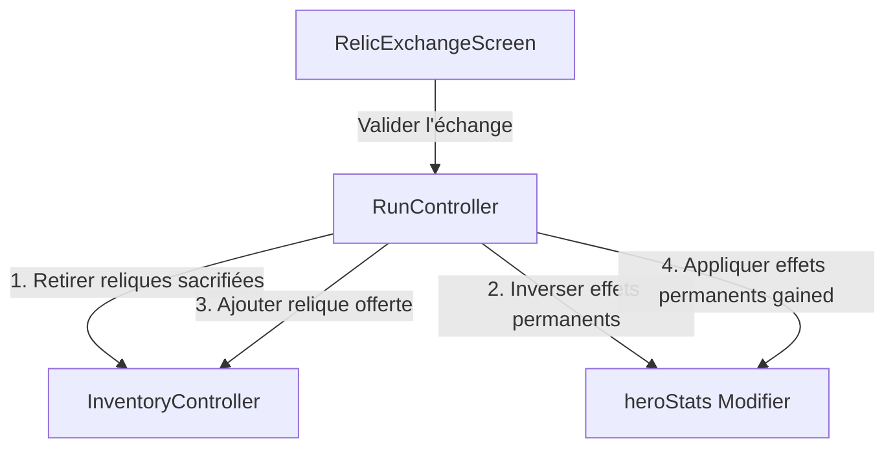

# 🏗️ Architecture & Conception (System Patterns)

Ce document décrit l'architecture globale, les patrons de conception, la stratégie de gestion d'état, les composants d'interface et les conventions de codage appliqués dans le projet **Hero's Draft**.

---

## 1. Architecture Globale — Séparation Triangulaire

Le projet **Hero's Draft** repose sur une **séparation triangulaire stricte des responsabilités (SOC)** entre trois couches distinctes : la **Logique Métier (Riverpod)**, le **Rendu Interactif (Flame Engine)** et l'**Interface Utilisateur HUD (Flutter Widgets)**.



### 1.1. Inventaire des fichiers source

| Couche | Répertoire | Fichiers clés | ~Lignes |
|:---|:---|:---|:---|
| Entrée | `lib/main.dart` | `HerosDraftApp` (ConsumerWidget, ProviderScope, MaterialApp) | ~40 |
| Rendu Flame | `lib/game/heros_draft_game.dart` | `HerosDraftGame` — orchestrateur Flame, s'appuie sur 4 systèmes de rendu | ~400 |
| Rendu Flame | `lib/game/components/` | `card_component.dart` (~150), `targeting_line.dart`, `entities/combat_entity.dart` (nouveau), `entities/` (5 fichiers), `visual_effects/base_visual_effect.dart` (nouveau), `widgets/` | ~2600 |
| Constantes | `lib/game/game_constants.dart` | `GameConstants` — z-index, tailles, badges, délais de combat, config textes flottants | ~60 |
| Contrôleurs | `lib/game/controllers/` | `run_controller.dart` et `combat_controller.dart` (façades), `deck_controller.dart`, `inventory_controller.dart`, `skill_controller.dart`, `event_controller.dart`, `shop_controller.dart`, `reward_controller.dart`, `checkpoint_controller.dart` (nouveau v3.2.0 — `checkpointProvider`/`autosaveOrchestratorProvider`), plus les sous-dossiers `run/` (3 fichiers, `run_persistence_manager.dart` supprimé v3.2.0) et `combat/` (2 fichiers) | ~2300 |
| Systèmes | `lib/game/systems/` | `encounter_system.dart`, `trait_system.dart`, et les 4 systèmes Flame (`state_sync_system.dart`, `card_animation_system.dart`, `combat_visual_system.dart`, `layout_system.dart`) | ~800 |
| Services (jeu) | `lib/game/services/` | `effect_resolver.dart` (~100), `effects/` (Strategy interfaces et 6 stratégies - nouveau), `combat_debug_logger.dart` (~120), `damage_pipeline.dart` (~60) | ~600 |
| Services (app) | `lib/services/` | `game_data_service.dart`, `map_generator_service.dart`, `map/` (4 sous-services - nouveau), `save_service.dart` (nouveau v3.2.0 — `SaveService`, autosave à checkpoint carte) | ~450 |
| Modèles Data | `lib/models/data/` | 9 fichiers (`card_data.dart`, `enemy_data.dart`, `hero_data.dart`, `skill_data.dart`, `event_data.dart`, `passive_data.dart`, `relic_data.dart`, `forge_upgrade_data.dart`, `game_data_registry.dart`) | ~850 |
| Modèles Runtime | `lib/models/` | 11 fichiers (instances, états, status) | ~600 |
| UI Écrans | `lib/ui/screens/` | 11 écrans (`home_screen`, `hero_selection_screen`, `starter_deck_draft_screen`, `map_screen`, `game_screen`, `shop_screen`, `event_screen`, `campfire_screen`, `draft_screen`, `dictionary_screen`, `forge_fusion_screen`) | ~5700 |
| UI Widgets | `lib/ui/widgets/` | `ui_card.dart`, `status_effects_panel.dart`, et le sous-dossier `ui_card/` (5 fichiers) | ~1100 |
| Système Tutoriel | `lib/tutorial/` | `tutorial_engine.dart`, `tutorial_screen.dart`, widgets d'étapes (18 fichiers) | ~2000 |
| **Total estimé** | | **~79 fichiers** | **~11600** |

---

## 2. Rôle des Contrôleurs et Architecture Modulaire (`lib/game/controllers/`)

Tous les contrôleurs héritent de `Notifier<T>` (Riverpod 2.x) et exposent des états immuables (pattern `copyWith`). Ils constituent la **source unique de vérité** du jeu. Les contrôleurs sont découplés : plutôt que de recevoir des références à d'autres contrôleurs via leur constructeur, ils accèdent à l'état global et aux autres contrôleurs via la propriété `ref` (ex: `ref.read(inventoryProvider.notifier)`) en interne. Cela élimine les constructeurs complexes et évite les dépendances circulaires au démarrage.

Dans le cadre du refactoring de la Phase 2, les contrôleurs les plus monolithiques (`RunController` et `CombatController`) ont été transformés en **façades légères**. Ils délèguent leurs responsabilités à des gestionnaires spécifiques isolés dans des sous-dossiers dédiés afin de respecter le principe de responsabilité unique (SRP).

### 2.1. `RunController` (`runProvider`) — Superviseur Global (Façade)

**Provider** : `NotifierProvider<RunController, RunState>`

**État `RunState`** : `currentLevel`, `act`, `heroStats` (EntityStats), `heroClassId`, `mapNodes` (List\<MapNode\>), `currentNodeId`, `passiveTrait`, `activePassive` (PassiveData?), `pendingDrafts` (int), `bonusForgeSlots` (int), `forgeSlots` (List\<String\>), `forgeTargetCardId` (String?).

**Organisation Modulaire** :
`RunController` délègue l'ensemble de ses traitements logiques à quatre gestionnaires spécialisés instanciés à sa création :
- **`PlayerStatsManager`** (`lib/game/controllers/run/player_stats_manager.dart`) :
  - Gère les points de vie, le mana, l'armure et les altérations d'état temporaires du héros.
  - Traite l'application des soins (`heal`), des dégâts directs (`takeDamage`) et l'application des modificateurs de statistiques permanents (`applyHeroStatModifier`).
  - Gère le système d'Expérience (XP) et les montées de niveau : accumule l'XP de victoire, calcule le seuil requis ($100 \times 1.5^{\text{level} - 1}$), traite la montée en niveau en cascade (multi-levels) et gère le report du reste d'expérience (`carry-over`) sans perte tout en incrémentant `pendingDrafts`.
- **`MapProgressionManager`** (`lib/game/controllers/run/map_progression_manager.dart`) :
  - Gère le déplacement vers un nœud de la carte stratégique (`travelToNode`) et valide son accessibilité.
  - Gère la complétion du nœud actuel (`completeCurrentNode`) : réinitialise l'armure à 0, nettoie les statuts temporaires, et gère le passage à l'acte suivant (en déclenchant la génération d'une nouvelle carte via `MapGeneratorService`).
- **`GoldManager`** (`lib/game/controllers/run/gold_manager.dart`) :
  - Gère les transactions d'or (gains, dépenses, validation de solde).
  - Gère la facturation progressive pour l'achat de fentes bonus de forge ($50 \rightarrow 80 \rightarrow 120 \rightarrow 175$ Or).

**Tour de combat** : `startCombat()` (initialise le combat, applique les reliques `startOfCombat` et les passifs) → `startTurn()` (réinitialise l'armure à 0 → restaure le mana → applique les reliques et statuts de début de tour, ex: `armor_regen`, `strength_regen` → décrémente les durées de statuts et cooldowns de compétences).

**Système de reliques** : Délègue à `PlayerStatsManager` l'application des effets de reliques selon le trigger (`applyRelics`, `applyRelicEffect`).

**Interactions** : Lit `inventoryProvider` (reliques), `skillProvider.notifier` (cooldowns). Muté par `CombatController`, `EventController`, `ShopController`, `TraitSystem`, `EffectResolver`.

**Réhydratation (`hydrate(RunState)`)** : Depuis la v3.2.0 (Système de Sauvegarde), `RunController` expose `hydrate(RunState savedState)` qui remplace intégralement `state` par une sauvegarde chargée. Appelée exclusivement par `SaveService.load()`, jamais par un flux de jeu normal.

---

### 2.1.bis Persistance de Run — `SaveService`, Checkpoints et Réhydratation (v3.2.0)

Le stub historique `RunPersistenceManager` (ancien 3ᵉ sous-gestionnaire de `RunController`, voir §2.1) a été **supprimé** (code mort une fois `SaveService` câblé directement). La persistance de run est désormais un service transversal indépendant, découplé des écrans et des contrôleurs métier :

- **`SaveService`** (`lib/services/save_service.dart`) : Classe statique (miroir du pattern déjà utilisé par `TutorialProgressService`) sans dépendance Riverpod propre. Sérialise `RunState`, `DeckState`, `InventoryState`, `SkillState` en un unique blob JSON versionné (`schemaVersion`) écrit sous une seule clé `shared_preferences`. Expose `save(RefReader)`, `load(RefReader) -> Future<SaveLoadResult>`, `clear()`, `hasSave()`.
  - **Typedef `RefReader`** : `T Function<T>(ProviderListenable<T> provider)`. Introduit car `Ref` (Notifier) et `WidgetRef` (widget) ne partagent aucun supertype commun sous Riverpod 2.6.1, et `ProviderContainer` (tests) n'implémente ni l'un ni l'autre — mais les trois exposent la même signature `.read`. Tous les appelants passent un tear-off (`ref.read`, `container.read`), jamais l'objet `ref`/`container` lui-même.
  - **`SaveLoadResult({success, missingItems})`** : `missingItems` est une `List<MissingSaveItem>` (`lib/models/missing_save_item.dart`) — instantané `{id, nameFr, nameEn, category}` capturé au moment du `save()` pour rester affichable même si l'ID ne se résout plus au chargement.
- **`checkpointProvider` / `autosaveOrchestratorProvider`** (`lib/game/controllers/checkpoint_controller.dart`) : `checkpointProvider` expose un simple `bump()`. `autosaveOrchestratorProvider` écoute ces `bump()` via `ref.listen` et déclenche `SaveService.save(ref.read)`. Le `bump()` est appelé depuis exactement 2 points du code — `MapProgressionManager.completeCurrentNode()` et `PlayerStatsManager.decrementPendingDrafts()` — plutôt que depuis chacun des 7 écrans de résolution de nœud, car ces 2 méthodes de manager sont déjà le point de passage obligé de tous ces écrans.
- **`hydrate()` sur chaque Notifier concerné** : `RunController.hydrate()`, `DeckNotifier.hydrate()`, `InventoryController.hydrate()`, `SkillController.hydrate()` remplacent intégralement `state` par les données chargées. Chaque état gagne en parallèle un `toJson()`/`fromJsonWithReport()` (ou `fromJson()` pour `SkillState`, sans référence catalogue).
- **Résolution de contenu par ID, jamais par valeur embarquée** : `CardData.getById()`, `RelicData.getById()`, `PassiveData.getById()` (ajoutés à leurs modèles respectifs) et `ForgeUpgradeData.filterValidRefs()` re-résolvent systématiquement le contenu catalogué depuis `GameDataRegistry` au chargement — la donnée sérialisée dans la sauvegarde n'est jamais une source de vérité, seul l'ID l'est.
- **Granularité de sauvegarde = checkpoint carte** : `CombatState` n'est jamais sérialisé. L'autosave n'est déclenché qu'à la résolution d'un nœud (retour sur `MapScreen`), jamais pendant le combat lui-même ni à chaque mutation interne à un nœud (ex : pas de save à chaque achat en boutique, seulement à la sortie).

Détail complet des arbitrages de conception dans `decisionLog.md` (ADR-069) et de la spécification d'origine dans `docs/superpowers/specs/2026-07-23-save-system-design.md`.

---

### 2.2. `CombatController` (`combatProvider`) — Pilote de Combat (Façade)

**Provider** : `NotifierProvider<CombatController, CombatState>`

**État `CombatState`** : `enemies` (List\<EnemyInstance\> actifs, max 5 slots), `pendingEnemies` (List\<EnemyInstance\> en réserve), `defeatedEnemies` (List\<EnemyInstance\> éliminés), `turnPhase` (TurnPhase: player/enemy), `turnCount`, `selectedEnemyId`, `isCombatEnded`, `isVictory`.

**Organisation Modulaire** :
`CombatController` délègue ses principales étapes de traitement logique à deux processeurs spécialisés :
- **`StatusEffectProcessor`** (`lib/game/controllers/combat/status_effect_processor.dart`) :
  - Centralise le calcul et le traitement autonome des altérations d'état (Poison, Brûlure, Régénération de Force, Régénération d'Armure) appliquées à la fois au joueur et à l'ensemble des ennemis actifs de manière unifiée en début de phase de tour.
- **`TurnPhaseManager`** (`lib/game/controllers/combat/turn_phase_manager.dart`) :
  - Gère la transition entre les phases (Joueur ⇄ Ennemi), l'orchestration séquentielle des actions de riposte ennemie et la fin de tour.

**Responsabilités directes** :
- **Initialisation** : `initializeCombat(...)` — Génère la liste totale des ennemis via `EncounterSystem.generateEnemiesForLevel()`. Instancie les stats des ennemis en appliquant le multiplicateur de niveau (+6% HP/lvl, +4% ATK/lvl) et le **facteur d'Acte en escalier géométrique** (`getHpActFactor`/`getDamageActFactor`, palier de 5 actes — voir §3.1), ainsi que les modificateurs de nœuds (3x HP/2x ATK pour boss, 1.5x pour élite). Les 5 premiers ennemis sont placés dans `enemies` (câblés avec une intention de départ), les suivants sont placés dans `pendingEnemies`.

  > [!IMPORTANT]
  > **Séparation stricte Niveau ↔ Acte (branche `feature/combat_scaling`, mergée vers `main` — voir ADR-070)** : `EncounterSystem.getEnemyLevel()` ne dépend plus jamais de l'Acte (uniquement du niveau du joueur et du type de nœud). L'Acte n'agit plus que via `getHpActFactor`/`getDamageActFactor`, ce qui rend structurellement impossible le double comptage qui existait auparavant (l'Acte apparaissant à la fois dans `enemyLevel` et dans un terme linéaire direct des multiplicateurs).
  
  Le calcul pour déterminer si le combat est un boss s'appuie sur la correction de garde `isBoss` :
  ```dart
  final bool isBoss = nodeType == MapNodeType.boss || (nodeType == null && level > 0 && level % 10 == 0);
  ```
  Cela évite de classifier faussement un combat standard se trouvant à un étage multiple de 10 comme un boss (le test `level % 10 == 0` n'est activé en secours que si le `nodeType` est non défini).
- **Pipeline de jeu de carte** : `applyPlayerCardPlay(card, RunController, DeckNotifier)` — `EffectResolver.resolveCard()` → `deck.playCard()` → `TraitSystem.onCardPlayed()` → reliques `onCardPlayed` → `_cleanDeadEnemies()`.
- **Intentions ennemies** : `resolveEnemyIntent(enemyId, RunController)` — switch sur IntentType : attack → `runController.takeDamage`, defend → armure, buff → strength(99 tours), debuffDeck → no-op. Les dégâts d'intentions affichés tiennent compte des réductions du gel (50% de réduction cumulable).
- **Nettoyage et Renforcement** : `_cleanDeadEnemies(RunController)` — Filtre les ennemis actifs décédés (HP ≤ 0) et les déplace dans `defeatedEnemies` en appelant `RunController.onEnemyKilled()` (déclencheurs de reliques). Pour chaque ennemi mort, si `enemies.length < 5` et que `pendingEnemies` n'est pas vide, transfère le premier ennemi en attente de la réserve vers le board actif (et lance `_rollIntent` sur lui). Met à jour la sélection de cible et prononce la victoire uniquement si les listes active (`enemies`) et de réserve (`pendingEnemies`) sont toutes deux vides.

**Logique de roll d'intentions** (`_rollIntent`) :
- Si l'ennemi a des `intents` prédéfinis : cycle séquentiel (modulo length, via `intentStep`).
- Sinon aléatoire : 60% attack (baseDamage), 25% defend (5-10 armure), 15% buff (+2 strength).

---

### 2.3. `DeckNotifier` (`deckProvider`) — Maître du Deck

**Provider** : `NotifierProvider<DeckNotifier, DeckState>`

**État `DeckState`** : `masterDeck`, `drawPile`, `hand`, `discardPile`, `exhaustPile` (toutes `List<CardInstance>`).

**Responsabilités** :
- **Immuabilité stricte de `CardInstance`** : Le modèle `CardInstance` est garanti immuable (tous les attributs sont `final`, et `forgeUpgrades` est verrouillé dans `List<String>.unmodifiable`). Toutes les mutations temporaires ou permanentes se font via son pattern `copyWith` pour assurer l'intégrité de l'état.
- **Cycle de vie** : `clearDeck()`, `initializeStarterDeck(cards)`, `initializeCombat()` (masterDeck → drawPile shuffle, clear piles).
- **Mécanique de pioche** : `drawCards(amount)` — pioche min(amount, drawPile.length). **Pas de reshuffle automatique** : `shuffleDiscardIntoDraw()` doit être appelé séparément.
- **Jeu de carte** : `playCard(card)` — retire de la main. Cartes Power ou `isExhaust` → exhaustPile; autres → discardPile.
- **Gestion du deck** : `addCardToMasterDeck()`, `removeCardById()`, `upgradeCard(uniqueId)` (level+1 permanent).
- **Auto-Merge** : `mergeCards(cardId, level)` — cherche 3 copies (même baseCardId + level), supprime les 3, ajoute 1 copie à level+1.
- **Défausse/Main** : `discardHand()` (main → défausse), `addCardToDiscardPile()` (pour debuff deck ennemi).

### 2.4. `EventController` (`eventProvider`)

**Provider** : `NotifierProvider<EventController, EventState>`

**Responsabilités** : `initializeEvent(events)` (pick aléatoire), `selectChoice(choice, RunController, InventoryController, allRelics)` — résout les actions séquentiellement : `gain_gold`, `spend_gold`, `take_damage`, `heal`, `gain_max_hp`, `gain_strength`, `gain_relic`.

**Roll de rareté de relique** (influencé par luck) : Legendary $1\% + \text{luck} \times 0.5\%$, Epic $5\% + \text{luck} \times 1\%$, Rare $14\% + \text{luck} \times 2\%$, Uncommon $20\% + \text{luck} \times 3\%$, Common = reste. Fallback vers common si aucune relique de la rareté tirée.

#### 🛠️ Architecture Technique et Validation d'Éligibilité
La refonte du système d'événements repose sur un découplage strict entre la structure de données declarative, la logique métier de validation, et le rendu d'interface réactif :

1. **Structure de Données Déclarative et Bilingue (`EventData` / `EventChoice` / `EventAction`)** :
   - Les événements sont sérialisés dans `assets/data/events.json` avec des clés bilingues strictes (`title_en`/`title_fr`, `description_en`/`description_fr`, `text_en`/`text_fr`, `result_text_en`/`result_text_fr`).
   - Le modèle `EventData` résout les textes dynamiquement en fonction du code de langue actif (`locale`).
   - La classe `EventAction` encapsule de manière générique le type d'action et sa valeur numérique (`value` typé `dynamic` pour supporter à la fois des entiers de dégâts/or ou des identifiants/quantités de reliques).

2. **Validation Métier Encapsulée dans le Modèle (`isSelectable`)** :
   - Plutôt que d'éparpiller les conditions de validation dans l'UI ou les contrôleurs, la logique d'éligibilité d'un choix est centralisée dans la méthode `isSelectable(currentHp, currentGold, currentMaxHp)` de `EventChoice` :
     ```dart
     bool isSelectable(int currentHp, int currentGold, int currentMaxHp) {
       for (final action in actions) {
         if (action.type == 'take_damage') {
           final damage = action.value as int;
           if (currentHp <= damage) return false; // Protection anti-mort subite
         } else if (action.type == 'spend_gold') {
           final cost = action.value as int;
           if (currentGold < cost) return false; // Protection financière
         } else if (action.type == 'gain_max_hp') {
           final val = action.value as int;
           if (val < 0 && currentMaxHp <= -val) return false; // Protection de vitalité
         }
       }
       return true;
     }
     ```
   - Cette centralisation assure que la règle est facilement testable de manière unitaire et cohérente sur toutes les plateformes.

3. **Verrouillage UI Réactif dans l'Écran (`EventScreen`)** :
   - Dans `EventScreen`, la construction des boutons de choix évalue dynamiquement cette éligibilité à chaque rendu, en observant l'état du héros (`runProvider`) et de l'inventaire (`inventoryProvider`) :
     ```dart
     final isSelectable = choice.isSelectable(currentPv, gold, maxPv);
     ```
   - Les boutons d'option (`_EventOptionButton`) adaptent leur comportement et leur style visuel en conséquence :
     - Si `isSelectable` est faux, `onPressed` reçoit `null`, ce qui désactive nativement le bouton Flutter (ignorant les interactions tactiles/souris).
     - L'opacité globale du bouton est réduite à `0.55`, son arrière-plan devient translucide (`Colors.black.withValues(alpha: 0.2)`), sa bordure s'estompe, et les badges d'actions compacts qu'il contient héritent d'une opacité réduite, signalant clairement le verrouillage à l'utilisateur.

4. **Rendu Visuel des Badges d'Actions (Composants Réutilisables)** :
   - **Badges Compacts (`_buildCompactActionBadge`)** : Utilisés directement dans les boutons de choix pour lister succinctement les effets (ex: `-15 PV`, `+50 Or`). Ils ont des dimensions réduites (hauteur 14, taille police 12) pour éviter tout débordement (RenderFlex overflow) dans les boutons multi-lignes.
   - **Badges de Résolution (`_buildActionBadge`)** : Grands badges détaillés affichés après la validation du choix dans un volet récapitulatif avec un effet d'échelle élastique via un `TweenAnimationBuilder` (500ms). Ils affichent des libellés localisés via `AppLocalizations` (ex: `eventLoseHp`, `eventGainGold`).

### 2.5. `ShopController` (`shopProvider`)

**Provider** : `NotifierProvider<ShopController, ShopState>`

**État (`ShopState`)** :
- `cardsForSale` : `List<CardInstance>` — Liste des instances de cartes actuellement en vente dans la boutique.
- `hasBoughtHeal` : `bool` — Indique si le joueur a déjà acheté le soin unique de cette visite.
- `cloneOptions` : `List<CardInstance>` — Cache persistant anti-exploit contenant les 3 choix de cartes du deck éligibles au clonage.
- `clonePurchasedCount` : `int` — Nombre d'utilisations du Miroir Magique lors de la session courante.
- Getter `clonePrice` : Calcul du coût dynamique cumulatif du clonage ($150 \ll \text{clonePurchasedCount}$ soit $150 \rightarrow 300 \rightarrow 600 \rightarrow 1200 \dots$ Or).

**Responsabilités & Logique métier** :
- `initializeShop(allCards, bonusShopCards, act, rng)` : Filtre les cartes de type `status` et de rareté `unique`, puis génère un assortiment de `3 + bonusShopCards` instances de cartes (`CardInstance`) adaptées au scaling de l'Acte en cours. Réinitialise le compteur `clonePurchasedCount` à 0 et vide le cache `cloneOptions`.
- `_generateShopCardInstance(data, act, rng)` (privé) : Détermine procéduralement la rareté finale de la carte et ses améliorations de forge initiales :
  - *Rareté* : Probabilité accrue de raretés élevées (Rare, Épique, Légendaire) selon l'Acte.
  - *Améliorations* : À partir de l'Acte 2, applique des upgrades de forge aléatoires compatibles (via `_rollRandomUpgrade`) selon l'Acte.
- `_rollRandomUpgrade(card, existingUpgrades, rng)` (privé) : Tire des améliorations de forge adaptées au type de la carte (Pool d'upgrades offensifs/statuts pour les attaques, utilitaires pour les compétences/pouvoirs).
- `buyCard(cardInstance)` : Retire la `CardInstance` spécifique de la liste des cartes en vente, consomme l'or via `inventoryProvider` et ajoute l'instance exacte au deck du joueur.
- `cloneCard()` : Duplique la carte sélectionnée parmi les `cloneOptions` (avec les mêmes runes et niveau), débite `clonePrice` de l'or et incrémente `clonePurchasedCount` dans l'état de la boutique.
- `clearCloneOptions()` : Appelé en quittant la boutique, vide le cache `cloneOptions` et réinitialise `clonePurchasedCount` à 0 (réinitialisant le prix du Miroir Magique à sa valeur de base de 150 Or).
- `buyHeal()` : Restaure 30% des PV Max du héros, débite l'or et marque `hasBoughtHeal = true`.
- `expandShop()` : Augmente de manière permanente le nombre de cartes en vente, débitant l'or.
- `rerollCards(allCards, act, rng)` : Régénère un ensemble complet de `CardInstance` scalées pour l'Acte en cours, pour un coût d'or progressif.
- `purgeCard(card)` : Supprime définitivement une carte du deck en échange d'un coût fixe en or.

**Tarification dynamique (`getCardPrice(CardInstance card)`)** :
Calculé à la volée pour chaque carte exposée :
$$\text{Prix} = \text{BaseRareté} + (20 \times \text{nombre d'upgrades de forge})$$
- Base par Rareté : Commun (25 Or), Peu Commun (50 Or), Rare (100 Or), Épique (150 Or), Légendaire (200 Or).
- Surcoût de Forge : +20 Or par rune d'amélioration présente dans l'instance.

### 2.6. `InventoryController` (`inventoryProvider`)

**Provider** : `NotifierProvider<InventoryController, InventoryState>`

**État** : `gold`, `relics` (List\<RelicData\>), `bonusShopCards`.

**Responsabilités** : `gainGold()`, `spendGold()` (validation), `addRelic()` (si trigger `startOfRun` → application immédiate via runProvider), `buyShopExpansion()`, `reset(initialGold: 50)`.

### 2.7. `SkillController` (`skillProvider`)

**Provider** : `NotifierProvider<SkillController, SkillState>`

**État** : `skill1Cooldown`, `skill2Cooldown` (int).

**Responsabilités** : `tickCooldowns()` (décrémente de 1, min 0), `triggerSkill1(cd, {mana, hpPercent})` / `triggerSkill2()` — vérifie cooldown, consomme ressources via runProvider, active le cooldown. `resetCooldowns()`.

### 2.8. `RewardController` (`rewardProvider`) — Pilote des Récompenses de Combat

**Provider** : `NotifierProvider<RewardController, RewardState>`

**État `RewardState`** : `goldGained` (int), `xpGained` (int), `rolledRelic` (RelicData?), `rolledCards` (List\<CardData\>), `isGoldXpCollected` (bool), `isRelicCollected` (bool), `isRelicSkipped` (bool), `isCardsProcessed` (bool), `selectedCards` (List\<CardData\>), `isResolved` (bool).

**Responsabilités** :
- **Initialisation** : `handleVictory(...)` — Déclenché lors de la victoire. 
  - Somme l'XP de base de chaque ennemi battu, indexé sur son niveau : `(enemy.data.xp * levelMultiplier).round()` où `levelMultiplier = 1.0 + 0.10 * (enemy.stats.level - 1)`. Triple (x3) le gain total d'XP si le nœud est de type boss central (`bossRewardType == BossRewardType.doubleXp`), et attribue en plus une carte aléatoire du jeu hors uniques et statuts.
  - Somme l'or de base de chaque ennemi battu (`enemies.json`) avec le même coefficient de niveau : `(enemy.data.gold * levelMultiplier).round()`. Triple (x3) le gain total d'Or si le nœud est de type boss central (`bossRewardType == BossRewardType.doubleXp`).
  - **Tirage de Reliques Boss 3 (`improvedRelic`)** : Effectue le tirage de Reliques si combat de type Élite ou Boss. Si le nœud présente `bossRewardType == BossRewardType.improvedRelic`, les probabilités de drop sont dynamiques et calculées par Act :
    - La chance Légendaire de base est fixée à **10.0%** (augmentable via la chance `luck` du joueur : `legChance = 10.0 + luck * 0.5`).
    - La chance Commune de base démarre à **40.0%** et diminue de **10% par acte** : `commonChance = max(0.0, 40.0 - (act - 1) * 10.0)`.
    - Si `commonChance > 0.0` (Actes 1 à 4) : la portion de probabilité restante (90.0 - `commonChance`) est répartie proportionnellement entre Atypique (Uncommon), Rare et Épique :
      - `uncommonChance = (20.0 / 85.0) * baseRemaining + luck * 3.0`
      - `rareChance = (35.0 / 85.0) * baseRemaining + luck * 2.0`
      - `epicChance = (30.0 / 85.0) * baseRemaining + luck * 1.0`
    - Si `commonChance == 0.0` (Acte 5+) : la chance d'Atypique de base commence à décroître de **10% par acte** à partir de sa base max théorique : `baseUncommonChance = max(0.0, maxUncommonBase - (act - 5) * 10.0)` où `maxUncommonBase = (20.0 / 85.0) * 90.0`.
      - Si `baseUncommonChance > 0.0` (Actes 5 à 7), la portion restante (90.0 - `baseUncommonChance`) est répartie entre Rare et Épique :
        - `rareChance = (35.0 / 65.0) * baseRemaining + luck * 2.0`
        - `epicChance = (30.0 / 65.0) * baseRemaining + luck * 1.0`
        - `uncommonChance = baseUncommonChance + luck * 3.0`
      - Si `baseUncommonChance == 0.0` (Acte 8+) : Uncommon tombe à 0%, et la totalité des chances restantes (90.0%) est partagée entre Rare et Épique :
        - `rareChance = (35.0 / 65.0) * 90.0 + luck * 2.0`
        - `epicChance = (30.0 / 65.0) * 90.0 + luck * 1.0`
        - `uncommonChance = 0.0`
  - **Tirage de Cartes Boss 1 (`cards`)** : Propose 5 cartes aléatoires du deck actuel du joueur, lui permettant de choisir 2 d'entre elles pour les cloner (copier).
- **Collecte & Résolution** :
  - `collectGoldAndXp()` : Crédite l'or accumulé à `InventoryController` et l'XP à `RunController` (détermine si le héros monte de niveau).
  - `collectRelic()` / `skipRelic()` : Ajoute ou ignore la relique de l'inventaire.
  - `chooseCards(cards)` / `skipCards()` : Ajoute les cartes choisies dans le master deck via `DeckNotifier` ou ignore le tirage.
  - La méthode interne `_checkResolution()` marque l'état global `isResolved` à vrai une fois que toutes les récompenses valides ont été collectées ou sautées.

### 2.5. Immutabilité Stricte des Modèles d'État
Afin de garantir la robustesse du flux de données unidirectionnel imposé par Riverpod, les modèles d'état de combat essentiels (`EntityStats`, `CombatState`, `EnemyInstance`) sont explicitement marqués avec l'annotation `@immutable` (importée de `package:meta/meta.dart`).

De plus, pour empêcher toute altération accidentelle par référence directe (mutation latérale de listes de statuts ou d'instances d'ennemis), leurs listes internes sont encapsulées dans des instances de `List.unmodifiable` lors de l'instanciation et au sein de la méthode `copyWith`. Toute tentative d'altération directe lève immédiatement une exception à l'exécution, forçant le passage exclusif par les Notifiers et `copyWith`.

---

## 3. Systèmes Transversaux (`lib/game/systems/`)

### 3.1. `EncounterSystem` — Générateur de Combats & Courbes d'Équilibrage

**Type** : Classe statique utilitaire (sans état, appelée lors de l'initialisation du combat).

**Méthode** :
```dart
static List<EnemyData> generateEnemiesForLevel(
  int level,
  List<EnemyData> availableEnemies, {
  MapNodeType? nodeType,
  int playerLevel = 1,
  int act = 1,
  int playerMaxHp = 100,
  int playerAttaque = 0,
  int playerMaxMana = 3,
  int playerRelicsCount = 0,
  int playerCardsCount = 0,
})
```

**Logique de Dimensionnement et Algorithme d'Équilibrage** :
1. **Évaluation de la Puissance Réelle du Joueur (`PlayerPower`)** :
   $$\text{PlayerPower} = \text{playerMaxHp} + (\text{playerAttaque} \times 10.0) + (\text{playerMaxMana} \times 15.0) + (\text{playerRelicsCount} \times 5.0) + (\text{playerCardsCount} \times 2.0)$$
2. **Puissance Théorique Attendue (`ExpectedPower`)** :
   $$\text{ExpectedPower} = 145.0 + ((\text{playerLevel} - 1) \times 15.0) + ((\text{act} - 1) \times 20.0)$$
3. **Budget de Base théorique (`BaseBudget`)** :
   $$\text{BaseBudget} = 40.0 + ((\text{playerLevel} - 1) \times 10.0) + ((\text{act} - 1) \times 25.0)$$
4. **Calcul du Budget Final (`FinalBudget`)** :
   Le ratio de puissance est pondéré par un facteur d'amortissement de $0.5$ pour stabiliser la courbe, et un bonus fixe de $+10.0$ par acte supplémentaire au-delà de l'acte 1 est appliqué :
   $$\text{PowerRatio} = \frac{\text{PlayerPower}}{\text{ExpectedPower}}$$
   $$\text{PowerModifier} = 1.0 + (\text{PowerRatio} - 1.0) \times 0.5$$
   $$\text{FinalBudget} = (\text{BaseBudget} \times \text{PowerModifier} \times \text{NodeMultiplier}) + ((\text{act} - 1) \times 10.0)$$
   *(Avec `NodeMultiplier` = 1.0 pour normal, 1.5 pour élite, 2.0 pour boss)*

5. **Formule du Niveau Ennemi (`getEnemyLevel`)** — *branche `feature/combat_scaling`, mergée vers `main` (voir ADR-070)* :
   $$EnemyLevel = \max(1, PlayerLevel + NodeModifier)$$
   *(Avec `NodeModifier` = 2 pour boss, 1 pour élite, 0 sinon). L'Acte n'apparaît plus dans cette formule — voir point 5bis.*

   La classification de Boss suit la règle unifiée :
   ```dart
   final bool isBoss = nodeType == MapNodeType.boss || (nodeType == null && level > 0 && level % 10 == 0);
   ```
   Si `isBoss` est vrai, `NodeModifier` est de `2` et `NodeMultiplier` de `2.0` (pour le budget) ou `3.0` (pour HP de base) et `2.0` (pour l'attaque de base). Si `isElite` est vrai (`nodeType == MapNodeType.elite`), `NodeModifier` est de `1` et `NodeMultiplier` de `1.5`. Sinon, ils valent respectivement `0` et `1.0`.

5bis. **Facteur d'Acte en Escalier Géométrique (`getHpActFactor`/`getDamageActFactor`)** — remplace l'ancien terme linéaire direct qui, combiné à l'Acte déjà présent dans `enemyLevel`, provoquait un double comptage (ADR-070) :
   ```dart
   static int getActBracket(int act) => ((act - 1) / 5).floor();
   static int getActPositionInBracket(int act) => (act - 1) % 5;
   static double getHpActFactor(int act) =>
       pow(1.35, getActBracket(act)) * (1.0 + getActPositionInBracket(act) * 0.05);
   static double getDamageActFactor(int act) =>
       pow(1.25, getActBracket(act)) * (1.0 + getActPositionInBracket(act) * 0.03);
   ```
   Chaque palier de 5 actes multiplie géométriquement (x1.35 HP / x1.25 Dégâts, composé), la rampe intra-palier restant douce (max +20% HP / +12% Dégâts en fin de palier) et se réinitialisant à chaque nouveau palier.

5ter. **Déblocage de Tier d'Ennemi (`getUnlockedTier`)** — tous les 10 actes, plafonné à `maxTierAuthored = 3` :
   ```dart
   static int getUnlockedTier(int act) {
     final unlocked = 1 + ((act - 1) / 10).floor();
     return unlocked > maxTierAuthored ? maxTierAuthored : unlocked;
   }
   ```
   `generateEnemiesForLevel` filtre `availableEnemies` à `tier <= unlockedTier` avant la sélection par budget (repli sur le pool complet non filtré si ce filtre viderait la liste de candidats). **Gating strict** : le Squelette (tier 2) n'est plus sélectionnable avant l'Acte 11 (tier 3 avant l'Acte 21).

6. **Formule du CombatRating de l'Ennemi** :
   Le coût de menace de chaque type d'ennemi est évalué à l'aide de ses statistiques simulées mises à l'échelle pour le niveau de combat, en atténuant l'impact des PV bruts (divisé par 4) et en augmentant l'impact des dégâts (multiplié par 2) pour favoriser l'apparition de groupes d'ennemis :
   $$\text{CombatRating} = (\text{tier} \times 15.0) + \frac{\text{HP\_Scalé}}{4.0} + (\text{Dégâts\_Scalés} \times 2.0) \times \left(1.0 + \frac{\text{critChance}}{100.0}\right)$$
   Où :
   - $$\text{HP\_Scalé} = \text{round}(\text{maxHp} \times \text{HpMultiplier})$$ avec $\text{HpMultiplier} = (1.0 + 0.06 \times (EnemyLevel - 1)) \times ActFactor_{HP} \times NodeMultiplier$
   - $$\text{Dégâts\_Scalés} = \text{round}(\text{baseDamage} \times \text{DamageMultiplier})$$ avec $\text{DamageMultiplier} = (1.0 + 0.04 \times (EnemyLevel - 1)) \times ActFactor_{Dmg} \times NodeMultiplier$
   - $ActFactor_{HP}$/$ActFactor_{Dmg}$ = `getHpActFactor(act)`/`getDamageActFactor(act)` du point 5bis.

7. **Sélection Procédurale par Budget** :
   - Filtre d'abord le pool d'ennemis candidats par tier débloqué (point 5ter).
   - Initialise `remainingBudget = FinalBudget`.
   - Boucle tant que le budget est positif et que la limite de 10 monstres (actifs + réserve) n'est pas atteinte.
   - Filtre les candidats dont le `CombatRating` individuel est inférieur ou égal à `remainingBudget`.
   - Si des candidats existent, tire aléatoirement l'un d'eux, l'ajoute au combat et déduit sa valeur du budget.
   - **Fallback** : Si aucun monstre ne rentre (budget insuffisant pour le plus petit monstre), ajoute d'office le monstre au plus petit `CombatRating` pour garantir au moins une menace.

### 3.2. `MapGeneratorService` — Générateur de Graphe de Carte du Monde (DAG World Map)

**Type** : Service statique utilitaire (`lib/services/map_generator_service.dart`).

**Responsabilités** :
1. **Génération de la topologie en DAG** (`generateMap`) :
   - Génère un graphe acyclique dirigé de 10 étages (`floors = 10`), avec une largeur fluctuant de 2 à 5 nœuds (`maxWidth = 5`).
   - Câble séquentiellement les connexions de l'étage `y` vers l'étage `y+1` avec des offsets indexés de $-1$, $0$, $+1$.
   - **Passe de correction d'orphelins** : Parcourt tous les nœuds de l'étage suivant et connecte de force une source s'ils ne sont pas ciblés.
2. **Contraintes structurelles forcées** :
   - Étage 0 : Forced to standard combat.
   - Étage du milieu (`middleFloor = floors ~/ 2`) : Forced to exactly 1 node (chokepoint) of type Élite, enabling dynamic map sizing support.
   - Étage `floors-2` (repos garanti) : All nodes are forced to type Repos (Rest).
   - Étage `floors-1` (Boss) : Generates exactly 3 boss nodes depending on the final act requirements.
   - **Forge de Fusion** : `MapContentPlacer` place un nœud `MapNodeType.forgeFusion` avec 25% de probabilité par carte/map, choisi de façon aléatoire sur un étage intermédiaire entre les étages 3 et 7.
3. **Solver de Quotas (`_balanceQuotas`)** :
   - Itère sur les nœuds de la carte pour réallouer les types de nœuds afin de respecter les limites globales configurées dans `GameConstants.nodeQuotas` (Combat: 12-22, Elite: 3-6, Rest: 3-6, Shop: 2-5, Event: 4-9).
4. **Algorithme Anti-Répétition de Chemin (`_hasThreeConsecutive` / `_getChainOfThree`)** :
   - Parcourt récursivement tous les chemins valides menant de l'étage d'entrée (0) aux boss (étage 9).
   - Détecte toute chaîne de 3 nœuds consécutifs du type Élite ou Repos.
   - Corrige les violations en convertissant le 3ème nœud de la suite en Combat, Shop ou Event, et répète la validation jusqu'à ce que plus aucun chemin ne contrevienne à la règle.

### 3.3. `TraitSystem` — Passifs de Héros

**Type** : Classe statique utilitaire.

**Méthodes** :
| Méthode | Trigger | Logique |
|:---|:---|:---|
| `onTurnStart(RunController)` | `startOfTurn` | `berserker_armor` : X armure par tranche de 10 HP manquants (+armorMastery). `gain_armor` : armure fixe (+armorMastery). |
| `onTurnEnd(RunController)` | `endOfTurn` | `gain_armor` : armure fixe (+armorMastery). |
| `onCardPlayed(RunController, CardInstance)` | `onCardPlayed` | `spell_armor` : gain d'armure quand une carte de type Skill est jouée. |

**Couplage** : Tous les gains d'armure incluent systématiquement le bonus `armorMastery`.

### 3.4. `EffectResolver` — Résolution d'Effets de Cartes

**Type** : Classe statique utilitaire (`lib/game/services/effect_resolver.dart`).

**Méthodes principales** :

#### `canPlayCard(CardInstance, RunState, String? selectedEnemyId) → bool`
- Vérifie : mana suffisant (≥ `currentCost`), carte non-status, carte ciblée → `selectedEnemyId` requis.

#### `resolveCard(CardInstance, RunController, DeckNotifier, CombatController, String?) → bool`
1. Déduit le coût en mana de la carte.
2. Itère sur la liste des effets `cardData.effects` (List\<CardEffect\>).
3. Calcule la valeur mise à l'échelle pour chaque effet selon le niveau de la carte :
   $$scaledValue = baseValue \times (1 + (level - 1) \times 0.5)$$
4. Délègue l'exécution de l'effet à la stratégie correspondante enregistrée dans l' **`EffectRegistry`** sous `lib/game/services/effects/` :
   - **Strategy Pattern (Extensibilité)** : Au lieu d'un switch/case monolithique, le système instancie des classes implémentant l'interface `EffectStrategy`.
   - **6 Stratégies Spécifiques** :
     - `DamageEffectStrategy` : Gère le calcul des dégâts physiques/magiques (via `DamagePipeline`), l'application aux cibles (mono ou multi-ennemis) et les statuts associés.
     - `HealEffectStrategy` : Gère les soins prodigués avec prise en compte des chances critiques.
     - `ArmorEffectStrategy` : Traite la génération d'armure intégrant la Maîtrise d'Armure effective.
     - `GainManaEffectStrategy` : Gère les gains de mana (restauration ou surcapacité temporaire).
     - `DrawEffectStrategy` : Déclenche la pioche de cartes dans le deck.
     - `ApplyStatusEffectStrategy` : Gère l'application d'effets de statut (buffs/debuffs) sur soi ou sur la cible.

#### `DamagePipeline.calculate`
Le calcul des dégâts physiques, magiques et des intentions d'attaques ennemies est entièrement délégué à la méthode statique unifiée `DamagePipeline.calculate(int initialDamage, EntityStats attackerStats, EntityStats defenderStats)` dans `lib/game/services/damage_pipeline.dart`. 

Le calcul s'exécute selon les étapes logiques strictes suivantes :
1. **Faiblesse (Attaquant)** : Dégâts réduits de 25% (multiplication par `0.75` puis arrondi) si le statut `weakness` est présent sur l'attaquant.
2. **Coup Critique** : Jet probabiliste basé sur `effectiveCritChance` de l'attaquant. En cas de succès, dégâts multipliés par `critMultiplier` de l'attaquant et assignation à `true` de `lastActionWasCrit` sur l'attaquant pour guider le rendu des tremblements, flashs et particules de la couche Flame.
3. **Choc (Défenseur)** : Ajout de la valeur brute cumulée du statut `shock` sur le défenseur.
4. **Vulnérabilité (Défenseur)** : Dégâts augmentés de 50% (multiplication par `1.5` puis arrondi) si le statut `vulnerable` est présent sur le défenseur.

Il retourne un tuple `(int finalDamage, bool isCrit)`.

**Statuts créables et gérés** : `poison`, `strength`, `weakness`, `strength_regen`, `armor_regen`, `burn` (Brûlure), `freeze` (Gel), `shock` (Électrocution), `vulnerable` (Vulnérable), `crit_chance` (Chance de critique temporaire).

### 3.5. `CombatDebugLogger` — Service de Journalisation Mathématique du Combat

**Type** : Service de journalisation dédié (`lib/game/services/combat_debug_logger.dart`).

**Responsabilités** :
- **Séparation des Responsabilités (SRP)** : Centraliser le formatage et l'affichage des logs détaillés d'initialisation de combat (DDA, calculs de budgets, modificateurs et ennemis générés), déchargeant ainsi `CombatController` de toute logique d'affichage textuelle.
- **Journalisation Conditionnelle** : Encapsuler les appels de log dans un wrapper `kDebugMode` (de `package:flutter/foundation.dart`) pour garantir qu'aucun traitement de journalisation ni de surcharge de StringBuffer ne s'exécute ou ne consomme de ressources en production (mode release).
- **Stylisation ANSI et Structure Visuelle** : Structurer les sorties de log sous forme d'un tableau délimité par des bordures en boîte ANSI (`┌`, `│`, `└`) avec des codes de couleurs ANSI (vert pour les calculs réussis, jaune pour les en-têtes de sections, magenta pour les ennemis scalés, rouge pour le titre de combat, cyan pour les bordures) pour une lisibilité maximale dans les consoles de débogage.

**Structure de Log d'Initialisation** :
1. **👤 Statistiques Joueur** : Level, Act, type de nœud, HP, Attaque, Mana, nombre de Reliques.
2. **📊 Formules et Calculs (DDA)** : Formule et évaluation de `PlayerPower`, `ExpectedPower`, `BaseBudget`, `PowerRatio`, `PowerModifier` et `FinalBudget`.
3. **⚙️ Détails du Scaling** : Niveau calculé des ennemis, multiplicateurs de HP et de dégâts appliqués.
4. **👾 Liste des Ennemis Générés** : Nom (EN), Tier, HP finaux après scaling, Dégâts finaux après scaling, et `CombatRating` calculé.

### 3.6. Systèmes de Jeu et Rendu Flame (`lib/game/systems/`)

Afin de décomposer la classe monolithique de rendu `HerosDraftGame`, ses tâches de synchronisation et de gestion d'animations/visuels de combat ont été isolées dans des composants de systèmes autonomes enregistrés auprès de Flame :

- **`StateSyncSystem`** (`state_sync_system.dart`) :
  - Composant gérant la réception et l'application synchrone séquentielle des états Riverpod (`RunState`, `DeckState`, `CombatState`) sur le thread Flame.
  - Évite les collisions d'états graphiques en sérialisant l'application des données Riverpod pendant les phases critiques d'animations ou de transitions.
- **`CardAnimationSystem`** (`card_animation_system.dart`) :
  - Gère les animations physiques et graphiques des cartes en main (effets visuels de zoom, d'inclinaison dynamique/tilt au drag, de translation de pioche, de tremblements de mana insuffisant).
  - Centralise l'état visuel du survol (`hover`) et de focalisation.
- **`CombatVisualSystem`** (`combat_visual_system.dart`) :
  - Gère le tracé des effets graphiques de combat, notamment la ligne de ciblage Bézier quadratique réactive et texturée (`TargetingLine`).
  - Gère l'apparition d'effets visuels lors des résolutions de dégâts ou d'utilisation de compétences (flashes sprite, explosions de particules Canvas, dômes de bouclier).
- **`LayoutSystem`** (`layout_system.dart`) :
  - Calcule dynamiquement l'agencement géométrique des cartes dans la main du joueur en arc de cercle (`layoutHand`).
  - Gère le repositionnement automatique et adaptatif des ennemis actifs sur le board (`repositionEnemies`) selon leur nombre (de 1 à 5).

### 3.7. Logique de Forge Data-Driven & Forge de Fusion

#### 3.7.1. Gestion des Données de Forge
- **Déclaration JSON (`forge_upgrades.json`)** : Les améliorations, descriptions, types de cartes éligibles, poids de tirage par rareté et multiplicateurs de tier sont externalisés.
- **Modèle et Registre (`ForgeUpgradeData`)** : Parser JSON avec registre d'accès statique `getById(id)` pour résoudre les données d'upgrades depuis n'importe quel point de rendu graphique sans avoir à passer par le state.
- **Chargement asynchrone** : Pris en charge par `GameDataService` lors de la phase de chargement initial et mis à la disposition du jeu dans l'instance globale de `GameDataRegistry`.

#### 3.7.2. Logique Métier de Fusion (`ForgeFusionScreen`)
- **Éligibilité** : Filtrage du deck principal pour identifier les cartes possédant au moins 2 runes identiques (même ID).
- **Calcul du Coût** : Géré dans l'interface métier de l'écran par la formule $80 \times (N - 1)$ Or.
- **Rendu Visuel et Légende** : Le nœud est rendu graphiquement par l'icône `layers_rounded` fuchsia sur la carte (`MapNodeWidget`) et est explicitement listé avec son libellé traduit dans le panneau de légende de la carte (`MapLegend`).
- **Routage et Navigation** : `MapScreen` intercepte l'entrée du joueur dans le nœud `MapNodeType.forgeFusion` et le redirige vers `ForgeFusionScreen`.
- **Application des Changements** :
  1. Le joueur choisit les runes à fusionner.
  2. L'or est débité via `inventoryProvider.notifier.spendGold(...)`.
  3. Les améliorations de la carte sont remplacées dans l'état immuable du deck via `deckProvider.notifier.setForgeUpgrades(uniqueId, upgrades)`.

#### 3.7.3. Logique de Tirage et Affichage de Forge
- **Logique de non-épuisement** : Les dialogues de forge classique (`ForgeUpgradeDialog`) et les générateurs de boutique (`ShopController`) n'excluent plus les upgrades possédés via `alreadyHas` pour autoriser le cumul de runes identiques.
- **Sélection Pondérée** : Le choix probabiliste des slots utilise une sélection pondérée basée sur les poids déclarés dans le JSON en fonction de la rareté de la carte.
- **Rendu Dynamique et Traduction** : `ForgeSlotRow`, `CardTextRenderer` et `DeckScreen` résolvent dynamiquement les icônes, les libellés localisés et les cumuls d'effets en combat à partir du registre `ForgeUpgradeData.getById`.

---

## 4. Synchronisation Bidirectionnelle Flame ⇄ Riverpod

Le mécanisme de synchronisation repose sur un **pattern de double-buffering** :

### 4.1. Descente d'État (Riverpod → Flame)

Les widgets Flutter (via `WidgetRef`) appellent trois setters :
- `game.syncState(RunState)` → écrit dans `_nextState`
- `game.syncDeck(DeckState)` → écrit dans `_nextDeckState`
- `game.syncCombat(CombatState)` → écrit dans `_nextCombatState`

Dans `HerosDraftGame.update(dt)`, si `hasLayout == true` et qu'un buffer est non-null :
1. `_applyState(_nextState!)` → crée/met à jour `HeroCard`, rafraîchit les visuels de cartes en main.
2. `_applyDeckState(_nextDeckState!)` → diff les cartes en main (ajout/suppression), recalcule le layout en arc.
3. `_applyCombatState(_nextCombatState!)` → diff les ennemis (ajout avec fade/scale, suppression), repositionne, synchronise la sélection visuelle, met à jour la phase.

### 4.2. Remontée d'Événements (Flame → Riverpod)

**18 callbacks fortement typés** injectés via le constructeur de `HerosDraftGame` :
| Callback | Déclencheur |
|:---|:---|
| `onPlayCard` | Carte jouée (drop sur ennemi valide) |
| `onSelectEnemy` / `onUpdateEnemyStats` | Clic/tap sur ennemi |
| `onTurnEnded` / `onPhaseChanged` | Fin de tour joueur / changement de phase |
| `onStartEnemyTurn` / `onEndEnemyTurn` | Début/fin de phase ennemie |
| `onResolveEnemyIntent` | Résolution séquentielle d'intention |
| `onPlayerTakeDamage` / `onPlayerHeal` / `onPlayerGainArmor` | Modifications stats héros |
| `onEnemiesDead` / `onEnemyKilled` | Nettoyage d'ennemis |
| `onEnemyDebuffDeck` | Action debuff du deck par ennemi |
| `onEnemiesSpawned` | Spawn initial |
| `onShowTooltip` / `onHideTooltip` | Tooltips contextuels |

### 4.3. Phase de Riposte Ennemie (`_enemyRipostePhase`)

Flux asynchrone séquentiel avec animations :
1. `onPhaseChanged(TurnPhase.enemy)` + délai 600ms
2. `onStartEnemyTurn()` → `CombatController.startEnemyTurn()` (ticks poison, traitement statuts)
3. Délai 400ms pour animations de tick
4. **Boucle** sur chaque ennemi : animation d'attaque/buff → `onResolveEnemyIntent(enemyId)` → délai 400ms
5. `onEndEnemyTurn()` → re-roll intentions, retour phase joueur

### 4.4. Système de Mort et de Stats Différé Z-Sync (Delayed Entity Destruction & Visual Stats Synchronization)

Pour éliminer la condition de concurrence visuelle (race condition) où l'état logique de Riverpod met à jour les statistiques (points de vie, armure, statuts) ou supprime instantanément un ennemi alors que l'animation de la carte Flame est encore en route, le jeu implémente le patron Z-Sync étendu aux attributs visuels :

1. **Drapeaux et Buffers de Verrouillage** :
   - `game.isCardAnimating` (booléen global) : Flag de verrouillage positionné à `true` dès qu'une carte jouée initie sa phase d'attaque ou de lancer d'effet.
   - `enemyCard.isPendingDeath` (booléen local) : Flag indiquant que l'ennemi a été tué logiquement mais que sa suppression visuelle est mise en attente.
   - `enemyCard._pendingVisualInstance` (modèle `EnemyInstance?` local) : Buffer stockant l'état des statistiques logiques reçues durant le trajet de la carte afin d'en différer l'affichage HUD.

2. **Diffèrement des Statistiques HUD & Effets d'Impact (`updateStats`)** :
   - Lors de la réception de nouvelles statistiques dans `EnemyCard.updateStats(newInstance)` :
     - Si `game.isCardAnimating == true`, la mise à jour de la barre de vie (`HealthBar`), du badge d'armure (`StatBadge`), de la liste des icônes de buffs/debuffs ainsi que **l'intégralité des effets visuels d'impact** (secousses `Curves.elasticOut`, flashes sprite `ColorEffect`, `FloatingText` de dégâts, et éjection de particules `spawnDamageParticles`) sont **différés** et stockés dans `_pendingVisualInstance`.
     - Si `game.isCardAnimating == false` (dégâts passifs comme le poison ou la brûlure), les indicateurs et effets d'impact physiques sont appliqués et déclenchés immédiatement.

3. **Interception du Nettoyage Visuel (`_applyCombatState`)** :
   Dans `_applyCombatState`, lors de l'application du delta des ennemis :
   - Si un ennemi visuel Flame n'est plus présent dans la liste des ennemis logiques (Riverpod) :
     - Si `game.isCardAnimating == true`, le composant n'est **PAS** supprimé immédiatement. Il est marqué `isPendingDeath = true` et reste pleinement dessiné sur le board.
     - Si faux, il est supprimé ou anime sa disparition immédiatement (mort passive de début de tour, ex: poison).

4. **Libération et Résolution Synchrone à l'Impact (`resolvePendingDeaths`)** :
   - Lorsque l'effet visuel de la carte se termine et impacte sa cible (physiquement ou magiquement) :
     - Le callback d'impact est déclenché sur la cible.
     - Il appelle `card.resolvePendingVisualStats()` : cela applique le `_pendingVisualInstance` mis en réserve, actualise de façon synchrone les barres de vie, l'armure, les icônes de statuts, **ET** déclenche à cet instant précis les effets visuels physiques d'impact (secousses, flashes, particules, et damage numbers).
     - Le callback de fin de mouvement de la carte appelle `game.resolvePendingDeaths()`.
     - Cette méthode bascule `game.isCardAnimating = false`.
     - Elle lance simultanément l'animation de mort (réduction de taille via `ScaleEffect` et fondu d'opacité via `OpacityEffect` de Flame) pour toutes les `EnemyCard` ayant `isPendingDeath == true`.
     - Les réactions dupliquées ont été nettoyées de `CardAnimator` pour prévenir tout double déclenchement visuel.

---

## 5. UI et Composants Graphiques

### 5.1. Écrans Flutter (`lib/ui/screens/`)

| Écran | Classe | Pattern | Responsabilité |
|:---|:---|:---|:---|
| `HomeScreen` | `ConsumerWidget` | `ref.watch(gameDataLoaderProvider)`, `FutureProvider` sur `SaveService.hasSave()` | Écran d'accueil, chargement données, boutons "New Game" / "Dictionary" et (depuis v3.2.0) "Continuer" conditionnel + dialogues de confirmation d'écrasement et de contenu manquant au chargement |
| `ClassSelectionScreen` | `ConsumerWidget` | `ref.watch(gameDataLoaderProvider)` | Affiche 3 héros sous `ScreenScaffold` (mode sombre) et `PageHeader`, déclenche `startNewRun()` |
| `StarterDeckDraftScreen` | `ConsumerStatefulWidget` | `ref.watch(gameDataLoaderProvider)`, `ref.read(deckProvider.notifier)` | Choix initial de 5 cartes globales parmi le catalogue complet via `CardDraftLayout` et `UiCard.fromData` + cartes de classe uniques résolues via compétences |
| `MapScreen` | `ConsumerStatefulWidget` | `ref.watch(runProvider)`, `ref.watch(inventoryProvider)` | **God Class (2471 lignes)** — CustomPainter, pan/zoom, navigation sous `ScreenScaffold` (mode parchemin) et `GoldIndicator` (mode parchemin), overlay bloquant « LEVEL UP ! ». |
| `GameScreen` | `ConsumerStatefulWidget` | Tous les providers | **God Class (1667 lignes)** — embed `GameWidget<HerosDraftGame>`, overlays privés (sans draft), orchestration combat, sortie directe sur level up. |
| `ShopScreen` | `ConsumerWidget` | `ref.watch(inventoryProvider)` | Achat/purge de cartes et reliques thématiques sous `ScreenScaffold` (mode sombre), `PageHeader`, `GoldIndicator` et `UiCard.fromData`/`fromInstance`. |
| `EventScreen` | `ConsumerWidget` | `ref.watch(runProvider)` | Événements narratifs à choix branchus affichés sous `ScreenScaffold` (mode sombre) et `PageHeader`. |
| `RestScreen` | `ConsumerWidget` | `ref.watch(runProvider)`, `ref.watch(deckProvider)` | Feu de camp sous `ScreenScaffold` (mode sombre) et `PageHeader` : Soin (30%), Forge (upgrade via `ForgeUpgradeDialog`), Oubli. |
| `DraftScreen` | `ConsumerStatefulWidget` | `ref.read(deckProvider.notifier)` | Draft post-combat : 3 choix de cartes (utilise `ScreenScaffold` et `PageHeader`). |
| `BossCardDraftScreen` | `ConsumerStatefulWidget` | `ref.read(rewardProvider.notifier)` | Écran de sélection post-boss de gauche (x=0) sous `CardDraftLayout` et `UiCard.fromData` : affiche 5 cartes aléatoires du deck du joueur pour en cloner 2. |
| `DictionaryScreen` | `ConsumerWidget` | `ref.watch(gameDataLoaderProvider)` | Catalogue filtrable de toutes les cartes et reliques affiché sous `ScreenScaffold` (mode sombre), `PageHeader` et `UiCard.fromData`. |

**Pattern de navigation** : 100% via `Navigator.of(context).push(MaterialPageRoute(...))` — aucun routeur centralisé.

### 5.2. Widget `UiCard` (`lib/ui/widgets/ui_card.dart`)

**Composant UI maître unifié et décomposé (v0.2.01)** — remplace 6 implémentations dupliquées et applique le principe de responsabilité unique (SRP).

Pour éviter le pattern anti-pattern de la God Class et structurer proprement le code, le composant `UiCard` (initialement >1100 lignes) a été divisé en sous-widgets et utilitaires spécialisés sous le dossier `lib/ui/widgets/ui_card/` :
- **`UiCard`** : Classe façade principale, qui assemble le layout global et gère les interactions (`GestureDetector`, `Tooltip`).
- **`ui_card_helpers.dart`** : Module purement logique regroupant l'analyse des cibles (`resolveTarget`), l'analyse élémentaire (`determineDamageType`), la configuration visuelle des effets (`getEffectVisuals`), le code couleur du type de carte et du fond (`getCardTypeColor`, `getCardBackgroundColor`), les couleurs et indices de rareté, et la construction verbeuse des descriptions bilingues des infobulles (`buildDetailedDescription`).
- **`polychromatic_border.dart`** : Widget stateful (`PolychromaticBorder` et son painter) prenant en charge l'animation d'effet foil polychromatique au survol de la souris.
- **`card_mana_medallion.dart`** : Widget autonome layout-agnostique dessinant le médaillon circulaire flottant affichant le coût en mana.
- **`card_rune_sockets.dart`** : Widget de rendu et d'agencement multi-lignes (Wrapping) pour les fentes d'upgrades de la forge.
- **`card_compact_description.dart`** : Widget de mise en forme des badges d'effets visuels et des modificateurs de forge sur la face avant de la carte.

Le comportement et les caractéristiques visuelles restent inchangés :

- **Ratio d'aspect** : `70 / 110` constant.
- **Style Glassmorphic** : Utilise un `BackdropFilter` (flou gaussien de 10px) avec un arrière-plan semi-transparent (dégradé linéaire vertical d'opacité `0.6` à `0.2`) et une bordure fine de `1.5` (`2.5` si sélectionné, opacité `0.5` de typeColor) pour un rendu moderne et épuré. Le motif en filigrane (watermark) en arrière-plan a été retiré.
- **Médaillon de Coût Standard** : Un cercle flottant noir (`Color(0xFF0D1B2A)`) de rayon 12px (centré à offset `[-6, -6]` par rapport au coin supérieur gauche) affichant le coût en mana avec un liseré et un halo de lueur cyan. Câblé à l'identique entre Flutter et Flame.
- **Fentes de Runes (Rune Sockets) avec Multi-Row Wrapping** : Remplace les anciennes étoiles par des réceptacles circulaires représentant la capacité de forge (`baseMaxForgeUpgrades + rarityIndex`). Les upgrades actifs affichent leur emoji rune (⚔️, 🛡️, 🪶, 💎, 🔥, ❄️, ⚡, ⏳), tandis que les vides apparaissent sous forme de cercles blancs translucides (opacité `0.05`). Pour accommoder un grand nombre d'upgrades sans dépasser la largeur de la carte, les fentes sont agencées en multi-lignes de 5 éléments maximum.
  - **Dans Flutter (`UiCard`)** : Utilisation d'un widget `Wrap` (`spacing: 2.0`, `runSpacing: 2.0`) confiné dans un conteneur `SizedBox` de largeur `45.0` pixels, provoquant le retour automatique à la ligne au-delà de 5 fentes.
  - **Dans Flame (`CardTextRenderer`)** : Calcul manuel de grille sur Canvas via `numRows = (totalSlots + 4) ~/ 5` et `maxSlotsPerRow = 5`, recentrant chaque ligne horizontalement et les empilant verticalement en décalant l'ordonnée Y de `16.0` pixels (diamètre 14.0 + espacement 2.0) par ligne.
- **Suppression du Ciblage Textuel** : Les badges textuels de ciblage (Single target, All enemies, Self) ont été supprimés pour réduire le bruit visuel.
- **Doublement d'icônes Multicibles (Raffiné)** : Pour signifier graphiquement la portée multicible (`CardTarget.allEnemies`), l'icône des effets destinés aux ennemis (ex: dégâts ⚔️, débuffs) est affichée deux fois consécutivement (⚔️⚔️) dans la ligne d'effets compacte. Les effets bénéfiques ciblant le joueur (ex: armure, soin, gain de mana, pioche, force) ne sont pas doublés et restent représentés par une seule icône afin d'éviter une surcharge visuelle incorrecte.
- **Suppression du label de rareté & Identification visuelle par Couleur/Halo** : Retrait total de l'affichage textuel de la rareté sur la face avant de la carte. La couleur de la rareté (`rarityColor`) est récupérée de façon dynamique via l'extension `.color` sur l'enum de rareté (`CardRarity`) et sert à teinter la bordure fine de la carte (`rarityColor.withValues(alpha: 0.5)`), à appliquer un halo radial de surbrillance (`rarityColor.withValues(alpha: 0.4)` de rayon de flou 15px et de diffusion 4px) en cas de sélection (`isSelected == true`), et à colorer le contour de son infobulle (`Border.all(color: rarityColor, width: 1.5)`).
- **`buildDetailedDescription()`** : Concatène de manière verbeuse et formatée les détails de la carte en tête de l'infobulle (type de cible écrit explicitement pour éviter toute ambiguïté visuelle, rareté, type de carte et coût en mana), parse la liste d'effets, remplace les placeholders dynamiques selon le niveau et les améliorations de forge, et enrichit systématiquement les statuts d'explications mécaniques détaillées, claires et localisées entre parenthèses :
  - **poison** : `(Subit des dégâts égaux au Poison au début de son tour, puis la durée diminue)` en FR / `(Takes damage equal to Poison at turn start, then duration decreases)` en EN.
  - **burn** : `(Subit des dégâts de feu égaux à la Brûlure au début de son tour, puis la valeur diminue de 1)` en FR / `(Takes fire damage equal to Burn at turn start, then the value decreases by 1)` en EN.
  - **freeze** : `(Réduit les dégâts de la prochaine attaque de l'ennemi de 50%)` en FR / `(Reduces next enemy attack damage by 50%)` en EN.
  - **shock** : `(Subit des dégâts supplémentaires égaux à l'Électrocution à chaque coup reçu)` en FR / `(Takes extra damage equal to Shock on every hit)` en EN.
  - **weakness** : `(Réduit les dégâts infligés par l'ennemi de 25%)` en FR / `(Reduces damage dealt by the enemy by 25%)` en EN.
  - **vulnerable** : `(L'ennemi subit 50% de dégâts supplémentaires)` en FR / `(Enemy takes 50% more damage from attacks)` en EN.
- **Mappage HUD & Emojis** : Pour préserver la cohérence visuelle absolue :
  - Les statuts joueurs et ennemis utilisent des émojis unifiés dans `status_indicator.dart` (`burn` 🔥, `freeze` ❄️, `shock` ⚡, `strength_regen` ✊ pour éviter la collision visuelle avec burn).
  - Les labels linguistiques sont câblés dynamiquement à la volée dans `status_effects_panel.dart`.

### 5.3. Composants Flame (`lib/game/components/`)

| Composant | Héritage | Rôle | Priorité Z |
|:---|:---|:---|:---|
| `CardComponent` | `PositionComponent` + `DragCallbacks` + `HoverCallbacks` | Carte en main : façade déléguant son rendu à `CardRenderer` et ses gestes à `CardInteractionHandler` | base=10+index, hover=100, focused=150, dragging=500 |
| `TargetingLine` | `PositionComponent` | Arc de ciblage : gradient vert→rouge, pattern pointillé animé, cercles pulsants sur cibles valides | 300 |
| `EnemyCard` | `CombatEntity` + `TapCallbacks` | Entité ennemie : barre de vie, badges stats, indicateur d'intention, bordure pulsante si ciblé, hérite des animations de combat communes | 20 |
| `HeroCard` | `CombatEntity` | Entité héros : portrait, `HealthBar`, `StatBadge` (armure/mana), icônes de statuts, hérite des animations de combat communes | 10 |
| `FloatingText` | `PositionComponent` | Texte flottant de dégâts/soins : `MoveEffect` ascendant + `OpacityEffect` fade, auto-suppression ~1.5s | — |
| `HealthBar` | `PositionComponent` | Barre HP horizontale : interpolation green→yellow→red, transition animée | — |
| `StatBadge` | `PositionComponent` | Badge vectoriel custom : icône bouclier/cristal, valeur numérique, pulse de scale au changement | — |
| `SlashEffect` | `BaseVisualEffect` | Effet visuel d'entaille à l'impact physique, durée et suppression automatique | — |

**Décomposition de `CardComponent`** :
Afin de nettoyer la classe `CardComponent` de ses centaines de lignes de dessin 2D et de gestion bas niveau des gestes, elle a été divisée en trois responsabilités :
- **`CardComponent`** (`card_component.dart`) :
  - Classe façade principale qui coordonne les initialisations et les interactions de haut niveau (callbacks de jeu, effets de shake).
- **`CardRenderer`** (`widgets/card_renderer.dart`) :
  - Encapsule tout le dessin 2D de la face avant de la carte (fond avec coins arrondis, dégradés selon le type de carte, liseré et halo de rareté de carte, effet foil polychromatique rotatif pour la rareté `unique`, et dessin des fentes de runes de forge avec wrapping Canvas).
  - Délègue le dessin des textes à `CardTextRenderer`.
- **`CardInteractionHandler`** (`widgets/card_interaction_handler.dart`) :
  - Centralise la gestion des gestes du pointeur : détection du survol (`hover`), calcul du glissement (`drag`), détection d'entrée dans la zone d'annulation (`cancel zone`) et détection de survol d'un ennemi pour ciblage.

### 5.3.1. Abstractions Graphiques Communes (CombatEntity & BaseVisualEffect)

Pour éliminer la duplication de code d'animation et normaliser le cycle de vie des effets visuels Flame, deux classes de base ont été introduites :
- **`CombatEntity`** (`lib/game/components/entities/combat_entity.dart` - `abstract class CombatEntity extends PositionComponent`) :
  - Centralise les animations communes aux entités de combat (`HeroCard` et `EnemyCard`).
  - Gère : secousses de dégâts (`shakeAndFlashAnimation`), flash coloré sur sprite (rouge pour dégâts, vert pour soins, jaune pour critiques), jet de particules de sang ou d'éther (`spawnDamageParticles`), animation de ruée offensive (`dashAnimation`), et animation d'impact de bouclier (`shieldHitAnimation`).
  - Centralise la détection des changements de statistiques (HP, armure) et le déclenchement des retours visuels (floating text orienté haut/bas, secousses, particules) via `triggerHitReactions(EntityStats oldStats, EntityStats newStats, {bool suppressArmorChange = false})` et `spawnFloatingText`.
  - Élimine la duplication de code résiduelle dans le code de rendu d'entité en permettant à `HeroCard` et `EnemyCard` de déléguer leur méthode `updateStats` à `triggerHitReactions`.
- **`BaseVisualEffect`** (`lib/game/components/visual_effects/base_visual_effect.dart` - `class BaseVisualEffect extends PositionComponent`) :
  - Centralise la gestion du cycle de vie des effets visuels.
  - Exécute un auto-nettoyage via `RemoveEffect(delay: duration)` et expose un callback optionnel `onComplete` appelé à la fin de la transition.
  - Sert de classe parente pour `SlashEffect` et `ShieldDome` (dans `card_animator.dart`), assurant un nettoyage systématique du canvas de rendu.

### 5.4. Constantes de Z-Indexing (`GameConstants`)

| Constante | Valeur | Usage |
|:---|:---|:---|
| `priorityBackground` | -100 | Fond d'arène |
| `priorityCardBase` | 10 | Cartes en main (+ index) |
| `priorityHero` | 10 | HeroCard |
| `priorityEnemy` | 20 | EnemyCards |
| `priorityCardHovered` | 100 | Carte survolée |
| `priorityCardFocused` | 150 | Carte sélectionnée/ciblée |
| `priorityCardTrail` | 200 | Effets de traînée |
| `priorityTargetingLine` | 300 | Ligne de ciblage |
| `priorityCardDraggingMax` | 500 | Carte en cours de drag |

### 5.5. Dimensions de Carte

- **Taille compacte (Réduction de 25%)** :
  - `cardWidth = 140.0`, `cardHeight = 196.0` → `cardSize = Vector2(140, 196)`.
  - Rapport hauteur/largeur plus dense, offrant une meilleure ergonomie et libérant de l'espace écran pour les scènes de combat et menus.
  - Badges de caractéristiques : `badgeHpSize = Vector2(130, 16)`, `badgeStandardSize = Vector2(48, 22)`, `badgeCircleSize = Vector2(36, 36)`.

### 5.6. Layout de Main en Arc

Les cartes sont distribuées en arc circulaire au bas du viewport :
```dart
radius = size.y * 1.5
angleStep = max(0.08, (0.4 / count).clamp(0.04, 0.08))  // réduit pour >4 cartes
center = (width/2, height + radius - height*0.23)
```

### 5.7. Courbes de Ciblage Réactives en Bézier Quadratique

La ligne de ciblage rectiligne rigide a été remplacée par une courbe dynamique fluide dans `targeting_line.dart` :

1. **Interpolation Quadratique de Bézier** :
   La courbe est tracée à l'aide d'un point de départ $P_0$ (la carte sélectionnée), un point d'arrivée $P_2$ (la position actuelle de la souris ou la cible), et un point de contrôle $P_1$ calculé dynamiquement pour générer une cambrure organique :
   ```dart
   // Point de contrôle au milieu avec décalage vertical proportionnel
   final controlPoint = Vector2((start.x + end.x) / 2, min(start.y, end.y) - 180.0);
   ```

2. **Détail des Pointillés Défilants (Scrolling Dots)** :
   Au lieu de points fixes, la courbe échantillonne des points le long de $t \in [0.0, 1.0]$. Un offset temporel incrémenté à chaque frame fait défiler des disques pointillés le long des points interpolés. Un fondu d'opacité (fade-in / fade-out) est appliqué aux limites ($t < 0.15$ et $t > 0.85$) pour éviter toute coupure nette des cercles.

3. **Orientation Dynamique de la Flèche (Derivative Tangent)** :
   Pour que la tête de flèche pointe parfaitement dans la direction de la cible à l'extrémité, l'orientation (angle de rotation) est calculée en dérivant l'équation de Bézier quadratique à $t = 1.0$ (tangente d'arrivée) :
   $$B'(t) = 2(1-t)(P_1 - P_0) + 2t(P_2 - P_1)$$
   À $t = 1.0$, le vecteur de direction tangent est exactement $2(P_2 - P_1)$. On en déduit l'angle avec `atan2`.

4. **Couleurs Élémentaires Réactives** :
   Le tracé de la ligne s'accorde dynamiquement aux éléments des effets de la carte jouée :
   - Feu (`fire`) : Orange vibrant.
   - Froid (`ice`) : Cyan électrique.
   - Poison (`poison`) : Vert émeraude.
   - Électrique (`lightning`) : Jaune foudre.
   - Mêlée (`melee`) / Physique : Rouge et blanc classique.

### 5.8. Rendu Vectoriel direct sur Canvas & Auras Sensoriels

1. **Icônes Vectorielles (Canvas Drawing)** :
   Pour éliminer les émojis texte basse résolution, la classe `EffectIcon` (`lib/ui/widgets/effect_icon.dart`) redessine ses icônes à la main via les fonctions graphiques de l'API Canvas (`Path`, `drawPath`, `drawCircle`) de Flutter, enrichies d'un effet de lueur floutée (`MaskFilter.blur(BlurStyle.normal, 3.5)`) :
   - **Écu d'Armure** : Un blason métallique avec des contours à double trait et une face interne brillante.
   - **Épées Croisées** : Deux lames d'acier croisées en diagonale avec des gardes et pommeaux dorés.
   - **Goutte de Poison** : Une larme vert menthe dessinée avec un chemin de Bézier fluide, dotée d'une double bordure contrastée.
   - **Étoile de Force** : Une étoile dorée parfaite à cinq branches calculée par trigonométrie radiale.
   - **Brûlure (`burn`)** : Une flamme rouge/orange dynamique et dansante avec des vagues de chaleur ascendantes.
   - **Gel (`freeze`)** : Un flocon de neige bleu turquoise symétrique à six branches avec des motifs de ramification délicats.
   - **Électrocution (`shock`)** : Un éclair jaune électrique angulaire, vif et acéré.

2. **Auras de Compétences (Spiritual Auras & Trails)** :
   - **Aura de Soin (Heal Aura)** : Jouer une carte de soin émet 20 particules en forme de croix dorées et vertes (`CrossParticle`) éjectées vers le haut depuis le centre du héros avec un fondu d'opacité linéaire.
   - **Dôme de Protection (Shield Dome)** : Jouer un effet défensif majeur fait apparaître un demi-dôme cyan translucide et pulsant (`ShieldDome`) centré sur la carte, strié de scanlines techniques horizontales pour donner une impression de champ de force actif.
   - **Embers & Ribbon Trails** : Le glissement des cartes génère une traînée d'étincelles élémentaires (`Embers`) assortie à la couleur de l'élément de la carte, doublée d'un ruban tactile translucide (`RibbonTrail`) qui suit le tracé du curseur pour un "game feel" Balatro-esque extrêmement satisfaisant.

3. **Carrousel de Récompenses Interactif (Relic Carousel & Particle Celebration)** :
   - **Pattern Slot-Machine PageView (Option B - Picker 3 Cartes)** : La classe `RelicRewardCarouselOverlay` implémente un carrousel à 3 cartes simultanées en exploitant un `PageView` Flutter configuré avec un `viewportFraction` réduit (~0.7). L'effet de profondeur est obtenu dynamiquement en calculant l'écart d'index entre la page active et la page courante :
     - Échelle : $1.0 - (\text{écart} \times 0.15)$, avec un plancher à `0.85x` pour les cartes latérales.
     - Opacité : $1.0 - (\text{écart} \times 0.6)$, avec un plancher à `0.4` pour les cartes latérales.
     - Un effet de flou dynamique (`ImageFiltered` avec `ImageFilter.blur`) est appliqué aux cartes non focalisées pour accentuer la profondeur de champ.
   - **Décélération Cubique Physique** : Le défilement automatique rapide de type machine à sous décélère de manière progressive en appliquant une transition `animateToPage` guidée par `Curves.easeOutCubic` sur 4,0 secondes. Les callbacks `onTick` (à chaque franchissement d'index visuel) et `onLand` (à la stabilisation finale sur la relique cible) découplent proprement les animations visuelles des futurs effets sonores (Sound Hooks).
   - **Peintre de Confettis Célébration (`RelicParticlePainter`)** : Un composant `CustomPainter` dessine directement sur Canvas une explosion radiale de particules (confettis rectangulaires rotatifs et étoiles dorées trigonométriques) s'éjectant à haute vélocité depuis le centre lors de l'arrêt du carrousel. Les particules intègrent des forces de gravité, de traînée aérodynamique et de fondu d'opacité graduel pour un rendu organique premium.
   - **Bouton de Collecte Sécurisé (Option A - Confirmation Pattern)** : Afin d'éviter les violations de l'état métier (Riverpod) et les incohérences de données, l'écriture dans l'inventaire via `addRelic` et le déblocage du bouton de validation « Récupérer » ne sont autorisés que lorsque le carrousel s'est immobilisé de façon stable sur sa cible (`isSpinning == false`), respectant le principe de transaction métier propre.
   - **Protection Anti-Spoil & Masquage de Rareté** : Lors du spin du carrousel (`isWon == false`), toutes les cartes masquent leurs véritables visuels, affichant des bordures et fonds gris neutres. Les badges techniques de rareté et de déclencheurs indiquent « ??? ». Le sous-titre de rareté dans l'en-tête supérieur est également masqué. À l'arrêt, le basculement à `isWon == true` révèle les couleurs d'origine, le nom coloré, les déclencheurs et déclenche une lueur thématique avec animation de l'en-tête.

### 5.9. Pattern de Draft Card Reels Staggered et 3D Flip (Interactive Reels Reveal)

Pour augmenter la sensation d'excitation et de "butin" lors de l'acquisition de nouvelles cartes (draft initial ou récompense de victoire), le jeu implémente un spinner interactif type machine à sous :

1. **Structure de Widgets Autonomes (`DraftCardReel`)** :
   - Le draft instancie 3 widgets `DraftCardReel` autonomes disposés horizontalement.
   - Chaque rouleau simule un défilement vertical rapide de dos de cartes en boucle.

2. **Révélation Séquentielle Échelonnée (Staggered Stops)** :
   - Pour créer une tension et rythmer la découverte des cartes, l'arrêt des rouleaux est asynchrone et échelonné :
     - **Rouleau 1** : Arrêt et flip à **0.8 seconde**.
     - **Rouleau 2** : Arrêt et flip à **1.4 seconde**.
     - **Rouleau 3** : Arrêt et flip à **2.0 secondes**.
   - À la frame exacte de l'arrêt, le dos de carte effectue un flip 3D de 180° sur l'axe Y pour révéler son identité visuelle unifiée (`UiCard`) :
     ```dart
     transform: Matrix4.identity()
       ..setEntry(3, 2, 0.002) // Perspective 3D
       ..rotateY(angleAnimationValue);
     ```

3. **Célébration Temporelle des Cartes Rares/Légendaires** :
   - Si la carte tirée est de rareté **Épique** ou **Légendaire** :
     - Le temps de défilement est prolongé de **+0.8s** pour maximiser le suspense.
     - L'arrêt déclenche un effet de secousse de l'écran (`screen-shake`), une explosion de particules d'étoiles dorées sur Canvas et un halo de lumière blanche et dorée en arrière-plan.

4. **Découplage Audio via Callbacks** :
   - Les callbacks de sound hooks `onTick` (à chaque franchissement d'index de carte) et `onLand` (lors de la stabilisation finale) permettent de câbler proprement le moteur sonore de l'application sans couple visuel.

### 5.10. Optimisations de Rendu GPU/CPU & Effet Physique de Pioche

Afin de garantir un framerate stable de 60 FPS sur mobile et d'assurer un "game feel" fluide, les optimisations suivantes ont été intégrées :

1. **Élimination de saveLayer GPU** :
   - Les appels à `canvas.saveLayer()` sont extrêmement coûteux en GPU car ils allouent des tampons off-screen.
   - Les composants `FloatingText` et `EffectIcon` ont été restructurés pour dessiner directement sur le canvas principal sans faire d'appels à `saveLayer` redondants.

2. **Mise en cache CPU (Text Painters) dans CardComponent** :
   - Les calculs de disposition (`TextPainter.layout`) consomment du CPU de façon significative.
   - Le texte des cartes est mis en cache sous forme de layout stable dans `CardComponent`. Pendant les animations de transition d'opacité, le texte n'est pas ré-aligné ni ré-agencé.
   - L'opacité est gérée via `canvas.saveLayer()` uniquement de manière conditionnelle si l'opacité est strictement inférieure à 1.0 (`opacity < 1.0`). Si la carte est pleinement opaque, le texte est dessiné sans aucun buffer off-screen.

3. **Transition Physique Organique de la Pioche** :
   - Lors du tirage d'une carte, celle-ci apparaît physiquement au niveau des coordonnées de la pile de pioche (`Vector2(40, size.y - 40)`).
   - Une série de Flame Effects asynchrones (déplacement `MoveEffect`, redimensionnement `ScaleEffect`, rotation `RotateEffect`) déplace et oriente dynamiquement la carte vers son slot assigné dans la main en arc de cercle, évitant l'apparition instantanée et statique.

### 5.11. Unification UI et Composants Communs (v0.2.2)

Pour éradiquer la duplication massive de code UI et uniformiser l'expérience visuelle, la Phase 3 a introduit un ensemble de composants d'infrastructure réutilisables :

1. **`ScreenScaffold` (`lib/ui/widgets/screen_scaffold.dart`)** :
   - Encapsule le widget `Scaffold` standard.
   - Propose un enum `ScreenBackgroundType` (`dark` pour les ambiances de combat/menus avec un dégradé subtil, `parchment` pour une texture papier de la carte/autels, `none` pour la transparence).
   - Intègre de manière transparente la gestion de `SafeArea` et de `PopScope` (cycle de vie des retours arrière sur mobile) de manière paramétrable.

2. **`PageHeader` (`lib/ui/widgets/page_header.dart`)** :
   - Implémente `PreferredSizeWidget` pour s'insérer en tant qu'appBar ou s'utiliser directement dans le corps d'une page.
   - Gère un bouton de retour arrière stylisé et standardisé (`Icons.arrow_back_ios_new`), un titre soigné, et une liste d'actions (boutons ou indicateurs).
   - Ajuste dynamiquement sa couleur d'accent (texte et boutons de retour) selon le type de fond (parchemin foncé vs dégradé sombre).

3. **`GoldIndicator` (`lib/ui/widgets/gold_indicator.dart`)** :
   - Badge d'affichage de l'or connecté à l'état global du run via Riverpod (`inventoryProvider`).
   - Adapte ses couleurs et contrastes selon qu'il est rendu sur fond parchemin ou sur fond sombre.

4. **`CardDraftLayout` (`lib/ui/widgets/draft/card_draft_layout.dart`)** :
   - Structure de mise en page commune pour les phases de draft de cartes.
   - Gère le titre principal, les compteurs de sélection (ex: "Sélectionné : X / Y"), les boutons de validation désactivables et une grille adaptative pour les cartes.

5. **Découpage de la Forge (`lib/ui/widgets/forge/`)** :
   - La boîte de dialogue de forge monolithique a été scindée en sous-composants unitaires pour respecter SRP :
     - `ForgeCardPreview` : Rendu de la carte en cours d'amélioration et de sa jauge de slots de runes.
     - `ForgeSlotRow` : Ligne d'amélioration individuelle avec bouton d'achat ("Forger") et reroll.
     - `ForgeBuySlotButton` : Bouton d'achat de slots d'améliorations supplémentaires.

---

## 6. Stratégie de State Management (Riverpod v2.5.1)

### 6.1. Inventaire Complet des Providers

| Provider | Type | État | Auto-Dispose | Rôle |
|:---|:---|:---|:---|:---|
| `runProvider` | `NotifierProvider<RunController, RunState>` | `RunState` | Non | Progression globale, stats héros, carte, reliques |
| `deckProvider` | `NotifierProvider<DeckNotifier, DeckState>` | `DeckState` | Non | 5 piles de cartes, merge, upgrade |
| `combatProvider` | `NotifierProvider<CombatController, CombatState>` | `CombatState` | Non | Combat actif, ennemis, phases, intentions |
| `inventoryProvider` | `NotifierProvider<InventoryController, InventoryState>` | `InventoryState` | Non | Or, reliques, bonus boutique |
| `skillProvider` | `NotifierProvider<SkillController, SkillState>` | `SkillState` | Non | Cooldowns des 2 compétences héroïques |
| `eventProvider` | `NotifierProvider<EventController, EventState>` | `EventState` | Non | Événement narratif actif, choix sélectionné |
| `shopProvider` | `NotifierProvider<ShopController, ShopState>` | `ShopState` | Non | Cartes en vente, état d'achat heal |
| `rewardProvider` | `NotifierProvider<RewardController, RewardState>` | `RewardState` | Non | Butins post-combat (or, XP, reliques, cartes) |
| `effectRegistryProvider` | `Provider<EffectRegistry>` | `EffectRegistry` | Non | Registre d'effets Riverpodisé instanciant les 6 stratégies concrètes d'effets |
| `gameDataLoaderProvider` | `FutureProvider<GameDataRegistry>` | `GameDataRegistry` | Non | Chargement asynchrone des 8 JSON d'assets |

### 6.2. Principes Appliqués

1. **Immuabilité d'état** : Tous les contrôleurs `Notifier` émettent de nouveaux objets d'état via `state = state.copyWith(...)`. Les listes et collections internes sont recréées à chaque modification (pas de mutation directe in-place) afin de garantir la réactivité de Riverpod et d'éviter les bugs de cache d'état.
2. **Découplage Interne et ref.read** : Au lieu d'injecter des dépendances via des paramètres de constructeur, les contrôleurs accèdent les uns aux autres à l'aide de `ref.read` en interne (par exemple, `ref.read(runProvider.notifier)` au sein de `CombatController`). Cela résout les problèmes de dépendances circulaires lors de l'initialisation des providers et allège considérablement la signature des contrôleurs.
3. **Immuabilité Stricte de `CardInstance`** : Les instances de cartes sont garanties 100% immuables. Tous les attributs sont marqués `final`. Les listes d'améliorations de la forge (`forgeUpgrades`) sont converties en listes non modifiables (`List<String>.unmodifiable`) lors de l'instanciation de `CardInstance`. Toute mutation donne obligatoirement lieu à une nouvelle carte via l'appel à `copyWith`.
4. **Pas de logique dans les vues** : Les widgets et écrans UI observent l'état via `ref.watch(provider)` pour reconstruire l'interface de manière réactive, et délèguent toutes les actions logiques en invoquant les méthodes des contrôleurs via `ref.read(provider.notifier).method()`.
5. **Providers persistants** : Tous les providers de run et de combat sont configurés sans `autoDispose` pour maintenir l'état du jeu à travers les transitions d'écrans du cycle de vie de l'application.
6. **Riverpodisation de l'EffectRegistry** : Pour supprimer l'état statique global mutable d'`EffectRegistry`, celui-ci est désormais instancié de manière immutable et exposé par le provider `effectRegistryProvider`. Ce registre de stratégies concrètes d'effets est dynamiquement passé à `EffectResolver.resolveCard` à chaque exécution de carte.
7. **Suppression des Callbacks Obsolètes** : Les callbacks orphelins de `HerosDraftGame` (`onPlayerTakeDamage`, `onPlayerHeal`, `onPlayerGainArmor`) ont été entièrement nettoyés de l'instanciation de `HerosDraftGame` dans `GameScreen` pour respecter les principes de découplage de Riverpod.


### 6.3. Sérialisation

| Modèle | `fromJson`/`toJson` | Statut |
|:---|:---|:---|
| `CombatState`, `EnemyInstance`, `EnemyIntent`, `EntityStats`, `StatusEffect`, `MapNode` | ✅ Oui | Round-trip complet |
| `CardInstance`, `EventState`, `InventoryState`, `ShopState`, `SkillState` | ❌ Non | Runtime uniquement |

---

## 7. Flux Complet d'un Tour de Combat

```
1. DÉBUT TOUR JOUEUR
   └→ RunController.startTurn()
       ├→ Restore mana = maxMana
       ├→ applyRelics(startOfTurn)
       ├→ Process statuts: poison (dégâts), strength_regen (→strength), armor_regen (→armure)
       ├→ tickStatuses() (décrémente durées, supprime expirés)
       ├→ tickCooldowns() (skill1/skill2 -1)
       └→ TraitSystem.onTurnStart(runController)

2. JOUEUR JOUE UNE CARTE
   └→ CombatController.applyPlayerCardPlay(card, runCtrl, deckNotif)
       ├→ EffectResolver.resolveCard() → consomme mana, applique effets (dégâts augmentés par shock/vulnerable, jet de coup critique pour dégâts/soins)
       ├→ DeckNotifier.playCard() → main → défausse (ou exhaust)
       ├→ TraitSystem.onCardPlayed(runCtrl, card)
       ├→ applyRelics(onCardPlayed)
       └→ _cleanDeadEnemies() → onEnemyKilled() → si ennemis actifs < 5 et réserve non vide, transfère le premier ennemi de pendingEnemies vers enemies et roule son intention.

3. FIN DE TOUR JOUEUR
   └→ Clic sur le bouton de fin de tour (GameScreen)
       ├→ Validation de confirmation (s'il reste du mana et que `_showRemainingManaWarning` est à false, l'avertissement de mana restant est affiché et le clic est intercepté)
       └→ Validation finale (si le mana est égal à 0 ou qu'il s'agit du second clic consécutif confirmant la fin de tour) :
           ├→ TraitSystem.onTurnEnd(ref.read(runProvider.notifier))
           ├→ ref.read(runProvider.notifier).applyRelics(RelicTrigger.endOfTurn)
           ├→ ref.read(deckProvider.notifier).discardHand()
           └→ HerosDraftGame.executeTurn()
               └→ _enemyRipostePhase()

4. PHASE ENNEMIE
   ├→ CombatController.startEnemyTurn()
   │   ├→ Pour chaque ennemi: process poison/regen/burn (Brûlure), tick statuts
   │   └→ _cleanDeadEnemies() (morts par poison ou brûlure, avec transfert de réserve si nécessaire)
   ├→ Pour chaque ennemi actif vivant:
   │   ├→ Animation (dash/buff)
   │   └→ resolveEnemyIntent() → dégâts héros (divisés par 2 si gelé, augmentés par vulnerable, jet de coup critique) / armure / strength
   └→ CombatController.endEnemyTurn()
       ├→ Re-roll toutes les intentions pour les ennemis actifs
       ├→ Phase → player
       └→ turnCount++

5. FIN DE COMBAT & TRANSITION DE VICTOIRE
   └→ _cleanDeadEnemies() détecte 0 ennemis
       ├→ isCombatEnded = true, isVictory = true
       └→ onEnemiesDead callback → UI (GameScreen) délègue la gestion des récompenses à RewardController :
           ├→ RewardController.handleVictory() : calcule l'XP et l'or de façon unifiée (scaling par niveau de monstre de +10% par niveau), et résout les tirages de reliques ou de cartes selon bossRewardType.
           ├→ Le joueur clique pour récupérer l'XP et l'or : RewardController.collectGoldAndXp()
           ├→ SI LEVEL UP : Déclenche l'affichage en plein écran de la bannière festive « LEVEL UP ! »
           │   └→ Redirection du joueur vers l'écran DraftScreen amélioré (sélection de récompense de niveau)
           ├→ SI BOSS/ELITE : Affichage séquentiel du carrousel de relique (collecte/skip gérés par RewardController)
           ├→ SI BOSS (type cards) : Affichage séquentiel du dialogue de draft de cartes (choix/skip gérés par RewardController)
           └→ Une fois isResolved = true : Déblocage du voyage et retour sur la carte du monde
```

---

## 8. Conventions de Code & Standards Techniques

### 8.1. Analyse Statique

**`analysis_options.yaml`** :
```yaml
include: package:flutter_lints/flutter.yaml
```
Configuration minimaliste utilisant les règles standard de `flutter_lints` (v6.0.0). Aucune règle custom ajoutée.

### 8.2. Typage Fort par Énumérations

Le codebase utilise exhaustivement des enums pour éliminer les typos et optimiser les branchements `switch` :

| Enum | Fichier | Valeurs |
|:---|:---|:---|
| `CardType` | `card_data.dart` | `attack`, `skill`, `power`, `status` |
| `CardCategory` | `card_data.dart` | `global`, `characterSpecific` |
| `CardRarity` | `card_data.dart` | `common`, `uncommon`, `rare`, `epic`, `legendary`, `unique` |
| `CardTarget` | `card_data.dart` | `singleEnemy`, `allEnemies`, `self`, `none` |
| `MapNodeType` | `map_node.dart` | `combat`, `elite`, `shop`, `rest`, `event`, `boss` |
| `IntentType` | `enemy_intent.dart` | `attack`, `defend`, `buff`, `debuffDeck` |
| `StatusType` | `status_effect.dart` | `buff`, `debuff` |
| `TurnPhase` | `combat_state.dart` | `player`, `enemy` |
| `RelicTrigger` | `relic_data.dart` | `startOfRun`, `startOfCombat`, `startOfTurn`, `endOfTurn`, `onCardPlayed`, `onAttackPlayed`, `onSkillPlayed`, `onPowerPlayed`, `onEnemyKilled` |
| `RelicRarity` | `relic_data.dart` | `common`, `uncommon`, `rare`, `epic`, `legendary` |

### 8.3. Principes de Code Documentés

- **Zéro logique métier dans les vues** : toutes les mutations d'état sont déléguées aux contrôleurs Riverpod.
- **Validation obligatoire** : `dart analyze` / `flutter analyze` doit retourner 0 erreur et 0 avertissement à chaque fin de phase.
- **Constructeurs `const`** : Utilisation systématique pour optimiser le rebuild de l'arbre de widgets Flutter.
- **Proscription du `dynamic`** : Typage fort partout où possible (exception : `EventAction.value` qui accepte int ou String).

### 8.4. Responsivité Dynamique

Le projet applique deux grandes stratégies complémentaires de responsivité pour gérer les variations de résolutions (mobiles étroits, tablettes, formats de bureau, orientations portrait/paysage) :

#### 8.4.1. Échelonnement Global Flame (ScaleFactor)
Pour l'arène de combat principale Flame, le redimensionnement utilise une formule dynamique basée sur la hauteur réelle du viewport :
```dart
double get scaleFactor => (size.y / 800).clamp(0.85, 2.5);
```
- **Hauteur de référence** : 800px (résolution portrait mobile standard).
- **Clamp** : de 0.85 (plancher mobile étroit) à 2.5 (plafond 4K).
- Tous les composants Flame (cartes, espacements, rayons d'arc de main, positions) sont multipliés par ce coefficient.

#### 8.4.2. Stratégies de Responsivité de l'UI Flutter (Patrons Unifiés)
Pour l'UI Flutter (notamment le système de tutoriel), quatre patrons majeurs de responsivité sont standardisés et doivent être appliqués :

1. **FittedBox Canvas Scaling Pattern** :
   - *Problématique* : Les illustrations complexes comportant du positionnement absolu ou des animations vectorielles fines (`Map`, `Combat Overview`, `Play Card`, etc.) subissent des chevauchements ou des yellow-black overflow stripes sur les petits écrans.
   - *Solution* : Définir l'illustration dans un conteneur rigide `SizedBox` de dimensions de référence (ex. `360x260`) et l'envelopper dans un widget `FittedBox` avec `fit: BoxFit.contain`.
   - *Code type* :
     ```dart
     Widget build(BuildContext context) {
       return Center(
         child: FittedBox(
           fit: BoxFit.contain,
           child: SizedBox(
             width: 360,
             height: 260,
             child: Stack(
               children: [ /* composants absolus */ ],
             ),
           ),
         ),
       );
     }
     ```

2. **LayoutBuilder Orientation Split Pattern** :
   - *Problématique* : Les affichages empilant verticalement des illustrations et des panneaux textuels (comme `TutorialScreen`) provoquent des écrasements verticaux critiques en orientation mobile paysage (hauteur verticale utile < 500px).
   - *Solution* : Utiliser `LayoutBuilder` pour détecter les dimensions utiles et commuter la structure d'affichage.
     - *Portrait* (ou largeur < 600px) : Structure `Column` (illustration en haut flex 6, description en bas flex 4).
     - *Paysage* (largeur > hauteur et hauteur < 500px, ou largeur >= 720px) : Structure `Row` (illustration à gauche flex 5, description à droite flex 5).

3. **Scrollable Container Pattern** :
   - *Problématique* : Les textes explicatifs dynamiques ou les grilles d'éléments débordent verticalement sur les petits écrans si le défilement est interdit.
   - *Solution* : Remplacer `NeverScrollableScrollPhysics` par `BouncingScrollPhysics` ou encapsuler les éléments extensibles dans des conteneurs `SingleChildScrollView`.

4. **Wrap and Grid Adaptation Pattern** :
   - *Problématique* : Les rangées horizontales d'éléments larges (badges de raretés, listes de cartes) causent des débordements horizontaux.
   - *Solution* : Utiliser `Wrap` (au lieu de `Row`) pour les flux de badges, des scrollviews horizontaux pour les rangées de cartes en main, et réorganiser les grilles d'éléments denses en layouts compacts (ex. grille 3x2 pour les types de nœuds).


---

## 9. Architecture du Système de Tutoriel Autonome (Tutorial System Technical Design)

Le système de tutoriel a été conçu avec un objectif d'**isolation totale** pour garantir qu'aucune instabilité ou modification de la logique du jeu de base ne puisse survenir à la suite d'ajouts dans le tutoriel.



### 9.1. Moteur et Gestion d'État

- **`TutorialEngine` (`ChangeNotifier`)** : Le cœur logique. Il maintient l'index de l'étape courante, fournit les transitions (`nextStep()`, `previousStep()`), et gère un `TutorialMockState` encapsulant l'état du combat/jeu simulé.
- **`TutorialMockState`** : Contient :
  - `heroHp`, `maxHeroHp` (80/80)
  - `heroMana`, `maxHeroMana` (3/3)
  - `heroArmor`
  - `enemy` (`TutorialEnemy?`)
  - `hand`, `deck`, `discardPile` (`List<TutorialCard>`)
- **Isolation d'État** : À chaque changement d'étape, l'engine exécute `resetMockState()` pour configurer l'état spécifique nécessaire à l'étape suivante (ex: spawn d'un Slime de 20 PV à l'étape 6, distribution de cartes spécifiques, etc.).

### 9.2. Modèles de Données et i18n Découplée

- **`TutorialCard`** : Classe modèle simplifiée contenant les attributs essentiels pour l'affichage (cost, damage, armor, statusId, isExhaust). Elle n'importe pas les structures de données lourdes de production.
- **`TutorialEnemy`** : Modèle simplifié d'ennemi détenant son HP, maxHP, et une intention simulée.
- **`TutorialData`** : Répertoire statique contenant les 13 étapes du tutoriel (`TutorialStepData`). Chaque étape est définie par un titre et un contenu textuel bilingues (`titleEn`/`titleFr`, `bodyEn`/`bodyFr`), traduits à la volée selon la locale active sans passer par `AppLocalizations`.

### 9.3. Persistance et Intégration

- **`TutorialProgressService`** : Fournit une interface asynchrone statique pour lire et écrire le drapeau `tutorial_completed` dans les SharedPreferences de l'appareil.
- **Badge 'NEW' (Notification Visuelle)** : L'écran `HomeScreen` utilise un `FutureBuilder` appelant `TutorialProgressService.isCompleted()` pour conditionner l'affichage du badge d'alerte rouge et pulsant "NEW" sur le bouton d'accès au tutoriel.

### 9.4. Poli Visuel de Draft (Hover & Glow Effects)

La classe `TutorialDraftWidget` sert d'implémentation de référence pour le feedback de draft, s'appuyant sur :
- **`MouseRegion`** : Détecte les entrées/sorties de souris pour mettre à jour l'index survolé.
- **`AnimatedScale`** : Applique une transition d'échelle fluide de `1.05x` sur le survol (durée de 200ms).
- **`AnimatedContainer`** : Met à jour la décoration de bordure et de l'ombre en cas de sélection. Si la carte est sélectionnée, elle scale à `1.12x` et applique un `BoxShadow` doré intense (`Colors.amber` avec un rayon de flou de 16px).

### 9.5. Refonte Responsive et Ciblage Avancé

Dans le cadre des améliorations de la branche `feat/tutorial`, le module de tutoriel a été refactorisé :
- **Application des Patrons de Responsivité** : Les 13 widgets d'étapes de tutoriel ont été convertis pour utiliser les patrons unifiés de responsivité Flutter UI (FittedBox Canvas pour les illustrations, Wrap pour la légende de reliques, grille compacte 3x2 pour les types de nœuds, et défilement adaptatif avec des scrollviews).
- **Ciblage Interactif en Deux Phases** : À l'étape 6 (`TutorialPlayCardWidget`), la logique de jeu de cartes impose au joueur de réaliser successivement une action offensive (glisser/déposer la carte d'attaque sur le Slime) puis une action défensive (glisser la carte d'armure sur le Héros). Ce comportement est géré via une machine à états simple (`_targetingPhase`) intégrée au widget.
- **Info-bulles (Tooltips) de Cartes (Étape 5)** : Le widget `TutorialCardsWidget` utilise de vrais rendus de cartes vectorielles sur Canvas et affiche des infobulles descriptives et localisées (`TutorialTooltip`) lors du survol ou du toucher, évitant ainsi d'encombrer le layout principal tout en clarifiant les règles.

---

## 10. Architecture du Système de Forge et de Fusion de Cartes (Forge & Card Merge Technical Design)

Le système de Forge et de Fusion offre une progression non-linéaire des cartes en séparant proprement la logique métier (calculs de probabilités, relances et consolidation) du rendu visuel de l'interface utilisateur.

### 10.1. Modélisation et Résolution de la Forge (`ForgeUpgradeDialog` v2)

Le dialogue de forge `ForgeUpgradeDialog` (affiché via `RestScreen`) a été refactorisé sous forme d'écran complet pour intégrer une persistance anti-exploit, un filtrage sémantique des upgrades et l'achat progressif de slots supplémentaires :

1. **Représentation et Persistance de Session (`RunState`)** :
   Les choix générés pour une carte et les achats de slots sont persistés de manière immuable au niveau du state global Riverpod :
   - `RunState.forgeSlots` (List\<String\>) : Liste des upgrades générés pour la session active sous le format `"upgradeId:tier"`.
   - `RunState.forgeTargetCardId` (String?) : Identifiant unique de la carte concernée par la forge active.
   - `RunState.bonusForgeSlots` (int) : Nombre de fentes bonus achetées (initialement 0, capé à 4).
   - `RunNotifier.setForgeSession(String cardId, List<String> slots)` : Persiste la session en cours.
   - `RunNotifier.clearForgeSession()` : Réinitialise la session.
   - `RunNotifier.buyBonusForgeSlot()` : Gère l'achat progressif (dépense $50 \rightarrow 80 \rightarrow 120 \rightarrow 175$ Or, incrémente `bonusForgeSlots`, retourne un booléen de statut).

2. **Logique d'Anti-Exploit (`initState`)** :
   Pour éviter que le joueur ne réinitialise les options proposées gratuitement en fermant et rouvrant la forge, le cycle de chargement effectue une vérification :
   - Au lancement du dialogue, si `runState.forgeTargetCardId == card.uniqueId`, le widget charge les fentes stockées dans `runState.forgeSlots` sans effectuer de nouveau tirage.
   - Sinon, le widget génère une nouvelle liste d'upgrades (avec $1\text{ à }5$ slots de base + `bonusForgeSlots` slots déjà achetés) et appelle immédiatement `RunNotifier.setForgeSession()` pour verrouiller le tirage.
   - L'effacement de la session (`clearForgeSession()`) n'est déclenché que lors d'un choix d'upgrade réussi, ou lors de la sortie définitive du camp de repos via `RestScreen._leave()`.
   - **Navigation d'Annulation** : Si le joueur ferme le dialogue de forge sans effectuer de choix, il retourne à l'écran de sélection des cartes du repos (pour lui permettre de choisir une autre carte à forger) au lieu d'être renvoyé directement au menu principal du feu de camp.

3. **Filtrage Intelligent des Upgrades par Type de Carte** :
   Pour éliminer les upgrades incohérents, la méthode `_getEligibleUpgradesForPool()` filtre le catalogue d'upgrades :
   - `CardType.skill` : Exclut tous les upgrades offensifs physiques (`sharp`) ou élémentaires (`burning`, `freezing`, `shocking`).
   - `CardType.power` : Filtre le pool pour ne conserver que les upgrades utilitaires (`eco`, `quick`, `enduring`).
   - `CardType.attack` : Donne accès au pool complet sans restriction.

4. **Achat de Fentes Progressives (Buy Slots)** :
   Le bouton d'achat en bas du `ListView` permet d'acquérir de nouvelles fentes d'upgrades en cours de session :
   - Le coût progressif ($50 \rightarrow 80 \rightarrow 120 \rightarrow 175$ Or) est lu depuis `bonusForgeSlots`.
   - En cas d'achat valide (or suffisant et `bonusForgeSlots < 4`), le widget appelle `buyBonusForgeSlot()`, tire une nouvelle option filtrée, et l'ajoute dynamiquement à la liste active via `setForgeSession()`.

5. **Design Plein Écran Responsive** :
   L'interface utilise `Dialog.fullscreen` pour s'adapter à toutes les résolutions :
   - **Desktop Layout (`Row`)** : Colonne de gauche affichant le visuel de la carte sélectionnée avec ses étoiles d'upgrade dorées. Colonne de droite affichant une liste scrollable (`ListView`) des slots d'upgrades disposés verticalement.
   - **Mobile Layout (`Column`)** : Empilement vertical fluide avec le visuel de la carte en haut et la liste scrollable des slots en bas, évitant tout overflow.



### 10.2. Fusion Interactive et Consolidation des Upgrades (`DeckNotifier.mergeCards`)

La fusion interactive permet au joueur de fusionner 3 exemplaires d'une carte à la même rareté vers la rareté supérieure tout en préservant leurs améliorations :

1. **Validation 3→1** :
   La méthode `mergeCards` de `DeckNotifier` reçoit les identifiants uniques des 3 cartes sélectionnées. Elle valide que ces 3 cartes existent dans le deck, partagent le même `baseCardId` et ont la même rareté courante.

2. **Consolidation des Upgrades** :
   Le système rassemble toutes les améliorations de forge des 3 cartes consommées. Si plusieurs cartes possèdent la même amélioration (même ID d'upgrade), leurs Tiers sont cumulés (ex: `sharp:1` + `sharp:2` = `sharp:3`). Les améliorations uniques sont simplement copiées.

3. **Capacité Limite par Rareté** :
   Chaque palier de rareté possède une capacité d'amélioration maximale :
   $$\text{Capacité} = baseMaxForgeUpgrades + rarityIndex$$
   - Commune ($rarityIndex=0$) : 2 upgrades max.
   - Légendaire ($rarityIndex=4$) : 6 upgrades max.
   
   Si la liste des améliorations consolidées dépasse la capacité de la rareté supérieure ciblée par la fusion, l'interface utilisateur impose un choix d'héritage interactif pour sélectionner précisément les upgrades à conserver.

4. **Modificateurs de Rareté** :
   Lors de la résolution d'une carte en combat (`EffectResolver`), les valeurs de base (dégâts, blocage) sont multipliées par un coefficient lié à sa rareté active, remplaçant la progression par niveau numérique. Les upgrades de forge (ex. ajouter +X dégâts par Tier de `sharp`) s'additionnent ensuite au résultat mis à l'échelle.



---

## 11. Système de Reliques Avancé : Déclencheurs de Cartes Spécifiques et Charges

Le système de reliques a été étendu pour prendre en charge deux nouveaux mécanismes de gameplay : le déclenchement par type de carte spécifique (Attaque, Compétence, Pouvoir) et les reliques à compteurs/charges persistants ou temporaires.

### 11.1. Déclencheurs par Type de Carte

Lorsqu'une carte est jouée par le joueur, la propagation des événements de déclenchement s'effectue dans `CombatController.applyPlayerCardPlay` :
1. Les reliques génériques `onCardPlayed` sont déclenchées en premier.
2. Le type de carte (`CardType`) est ensuite évalué afin de propager le déclencheur spécifique approprié :
   - `CardType.attack` → Déclenche `RelicTrigger.onAttackPlayed`.
   - `CardType.skill` → Déclenche `RelicTrigger.onSkillPlayed`.
   - `CardType.power` → Déclenche `RelicTrigger.onPowerPlayed`.
3. Le contrôleur `RunController.applyRelics` est notifié et applique l'effet de chaque relique possédée qui correspond à ce déclencheur.



### 11.2. Mécanique de Charges et Compteurs Visuels

Les reliques inspirées des deckbuilders classiques accumulent des charges représentées sous forme de `StatusEffect` sur l'entité héro. Ces charges sont visibles en combat dans le panneau des effets de statut.

1. **Stockage et Incrémentation** :
   Les charges sont des effets de statut empilables (`isStackable: true`) rattachés à `state.heroStats.statuses`. Lors du déclenchement, la méthode `applyRelicEffect` vérifie l'existence du statut de charge correspondant :
   - Si présent, la valeur du statut est incrémentée de +1.
   - Si absent, le statut est créé avec une valeur initiale de 1.

2. **Évaluation du Seuil (Trigger & Reset)** :
   Une fois la charge incrémentée, sa nouvelle valeur est comparée au seuil requis par la relique :
   - Si la valeur atteint le seuil (ex: 3 pour Kunaï), le statut de charge est supprimé de la liste des statuts et l'effet bénéfique final est appliqué.
   - Sinon, le statut de charge persiste dans les effets actifs.

3. **Persistance et Décomposition (Duration)** :
   La durée (`duration`) du statut de charge régit sa persistance :
   - **Charges de tour (durée = 1)** : Utilisées pour des contraintes au sein d'un même tour (ex: Kunaï/Shuriken). Si le seuil n'est pas atteint avant la fin du tour, le tick de début de tour décrémente et détruit automatiquement les charges.
   - **Charges persistantes (durée = 99)** : Utilisées pour des compteurs accumulables d'un tour à l'autre (ex: Plume de Scribe/Encensoir). Ces charges ne expirent pas à la fin du tour et persistent jusqu'au déclenchement ou la fin du combat.

| Relique | ID Statut de Charge | Seuil | Durée | Effet Déclenché |
|:---|:---|:---:|:---:|:---|
| **Croc Kunaï** (`kunai`) | `kunai_charge` | 3 | 1 (par tour) | +1 Maîtrise d'Armure permanente pour le combat |
| **Shuriken** (`shuriken`) | `shuriken_charge` | 3 | 1 (par tour) | +1 Force pour le combat (durée 99) |
| **Plume de scribe** (`pen_nib`) | `pen_nib_charge` | 5 | 99 (persistant) | +3 Force temporaire pour le tour en cours (durée 1) |
| **Encensoir** (`incense_burner`) | `incense_charge` | 4 | 99 (persistant) | +8 points d'Armure |

---

## 12. Autel d'Échange de Reliques (`RelicExchangeScreen`)

L'Autel d'Échange de Reliques permet au joueur d'échanger trois reliques d'une rareté donnée contre une relique de la rareté directement supérieure.

### 12.1. Topologie et Règles de Génération du Nœud
- **Identifiant technique** : `MapNodeType.relicExchange` (emoji `🔄`).
- **Génération** : Le nœud n'est généré qu'à partir de l'**Acte 5**.
  - **100% garanti** à chaque acte multiple de 5 (Acte 5, 10, 15, etc.).
  - **10% de chances** d'apparaître pour les autres actes ($\ge 5$).
- **Positionnement** : Un seul nœud d'échange maximum par acte. Placé sur un étage intermédiaire aléatoire (étages 2, 3, 4, 6 ou 7) afin de ne pas bloquer les nœuds obligatoires (repos, élites de milieu d'acte, boss, départ).

### 12.2. Algorithme d'Offre Déterministe (Seeded Random)
Pour assurer la cohérence de l'état sans surcharge de persistance, la relique offerte est déterminée de manière pseudo-aléatoire mais déterministe en combinant l'ID unique du nœud et le numéro de l'acte :
```dart
final seed = (node.id.hashCode ^ act).abs();
final random = Random(seed);
```
La rareté de la relique proposée exclut la rareté `Common` et suit la distribution suivante :
- **Uncommon** : 40%
- **Rare** : 35%
- **Epic** : 20%
- **Legendary** : 5%

### 12.3. Logique de Transaction et Inversion d'Effets (3-pour-1)
Pour obtenir la relique offerte de rareté $R$, le joueur doit fournir exactement 3 reliques de rareté $R-1$.
La méthode `runController.exchangeRelics(sacrificed, gained)` gère la transaction :
1. Les 3 reliques sacrifiées sont retirées de l'inventaire via `inventoryController.removeRelics()`.
2. Si les reliques sacrifiées appliquaient des modificateurs permanents de run (au trigger `startOfRun`), ces effets sont inversés en soustrayant leurs valeurs respectives (Force, Chance, Mana, PV max) de `heroStats`.
3. La nouvelle relique est ajoutée à l'inventaire via `inventoryController.addRelic()`. Si son trigger est `startOfRun`, ses effets statistiques permanents sont appliqués immédiatement.



### 12.4. Composant d'Interface Utilisateur
- **Classe** : `RelicExchangeScreen` (ConsumerStatefulWidget).
- **Règles métier visuelles** :
  - Affiche les détails de la relique proposée (gradient selon sa rareté).
  - Liste les reliques de l'inventaire possédant la rareté requise pour le sacrifice.
  - Permet la sélection interactive de 3 reliques avec retour visuel (glow doré pour les reliques sélectionnées).
  - Le bouton de transaction n'est cliquable qu'une fois 3 reliques sélectionnées.
  - Le bouton "Quitter" permet de continuer la run sans faire d'échange.

---

## 13. Système de Design Centralisé & Tokens UI (Design System, v0.0.99)

Le sprint v0.0.99 a introduit un **système de design centralisé** dans le module `lib/ui/theme/`, éliminant les magic constants dispersées dans les 15+ fichiers de widgets et standardisant l'identité visuelle du jeu.

### 13.1. Module `lib/ui/theme/`

Le module regroupe trois fichiers complémentaires :

| Fichier | Classe | Responsabilité |
|:---|:---|:---|
| `app_colors.dart` | `AppColors` | Toutes les couleurs du jeu (Neon Dark, Parchemin, stats sémantiques, raretés cartes/reliques) |
| `app_spacing.dart` | `AppSpacing` | Helpers d'`EdgeInsets` et de padding standardisés |
| `app_theme.dart` | `AppTheme` | Factory de `ThemeData` Flutter complet (dark/light, polices, couleurs primaires, styles de texte) |

### 13.2. Palettes de Couleurs (`AppColors`)

`AppColors` structure les couleurs en domaines sémantiques distincts :
- **Neon Dark** : Couleurs de base de l'interface sombre (fond, surface, texte, accents neon).
- **Parchemin** : Couleurs de l'ambiance carte/parchemin médiéval (fond brun, dorure, texte sépia).
- **Stats sémantiques** : Couleurs HP, Mana, Armure, Critique (identiques dans tout le jeu).
- **Raretés de cartes** : Chaque `CardRarity` (Common, Uncommon, Rare, Epic, Legendary) possède une couleur canonique.
- **Raretés de reliques** : Chaque `RelicRarity` possède une couleur canonique distincte des cartes.

### 13.3. Extensions Dart sur les Enums de Rareté

Pour supprimer les `switch` redondants, des **extensions Dart** ajoutent un getter `.color` sur les deux enums de rareté :

```dart
// Sur CardRarity
extension CardRarityColor on CardRarity {
  Color get color => AppColors.cardRarityColors[this]!;
}

// Sur RelicRarity
extension RelicRarityColor on RelicRarity {
  Color get color => AppColors.relicRarityColors[this]!;
}
```

**Avant (pattern à bannir)** :
```dart
Color _getRelicColor(RelicRarity rarity) {
  switch (rarity) {
    case RelicRarity.common: return Colors.grey;
    case RelicRarity.uncommon: return Colors.green;
    case RelicRarity.rare: return Colors.blue;
    case RelicRarity.epic: return Colors.purple;
    case RelicRarity.legendary: return Colors.orange;
  }
}
```

**Après (pattern à adopter)** :
```dart
// Directement dans le widget :
color: relic.rarity.color
```

### 13.4. Extension de Thème Flutter (GameThemeExtension)

Pour permettre l'accès typé et centralisé aux jetons visuels spécifiques au gameplay via le `BuildContext` standard de Flutter (ex: `Theme.of(context).extension<GameThemeExtension>()`), une extension de thème a été introduite :
- **`game_theme_extension.dart`** (`lib/ui/theme/game_theme_extension.dart`) :
  - Contient les couleurs des raretés de cartes, les couleurs des statistiques de combat (HP, Mana, Armure, Force, etc.) et les lueurs néon de l'interface.
  - Implémente les méthodes `copyWith` et `lerp` requises par la classe de base `ThemeExtension` de Flutter pour des transitions de thèmes fluides.
  - Enregistrée au sein d' `AppTheme` dans les thèmes clairs (`ThemeData.light()`) et sombres (`ThemeData.dark()`), garantissant que ces jetons graphiques s'adaptent et s'harmonisent avec le mode graphique sélectionné.

### 13.5. Règles de Contribution

- **Aucune magic constant** dans les widgets. Toute couleur, espacement ou style de texte doit provenir de `AppColors`, `AppSpacing` ou `AppTheme`.
- **Toute nouvelle rareté** (de carte ou de relique) doit être ajoutée simultanément dans les maps de `AppColors` et dans les extensions d'enum correspondantes.
- **Les tokens de design ne dépendent d'aucun provider Riverpod**. Ils sont purement statiques et instanciables sans contexte d'application.

---

## 14. Architecture d'Amélioration de l'Interface & Cartes (UX Combat) (v0.1.00)

Le sprint v0.1.00 introduit de nouveaux patrons d'interaction et de rendu pour l'interface de combat (Flame et Flutter).

### 14.1. Verrouillage Tactile Temporaire lors du Dealing (Input Blocking)

Pour éviter les race conditions d'interactions (comme le fait de survoler, cliquer ou glisser une carte en train d'être distribuée depuis la pioche, ce qui provoquait des sauts physiques ou des désalignements de l'arc de la main), un patron de verrouillage a été mis en œuvre :
1. **Drapeau d'état** : `CardComponent` possède le drapeau public `isEnteringHand`.
2. **Garde d'interaction** : Les méthodes d'entrée de `CardComponent` (`onTapDown`, `onDragStart`, `onHoverEnter`, `onHoverExit`, `onDragUpdate`) effectuent une garde directe :
   ```dart
   if (isEnteringHand || isPlayed) return;
   ```
3. **Orchestration de la Pioche** : Lors de la pioche dans `HerosDraftGame._applyDeckState()`, les nouvelles cartes sont instanciées avec `isEnteringHand = true`.
4. **Ralentissement de Transition** : Dans `_layoutHand()`, la durée du `MoveEffect` est portée à `0.7s` (au lieu de `0.35s` pour le tri standard) pour donner une impression de distribution fluide et majestueuse. Un callback `onComplete` réinitialise `card.isEnteringHand = false` lorsque le glissement se termine, rendant la carte de nouveau interactive.

### 14.2. Affichage Ciblé des Infobulles de Combat (Focused Tooltips)

Afin d'éviter l'encombrement de l'écran par des infobulles intempestives lors du simple glissement de la souris, le système de tooltips a été restreint :
- **Sélection Active uniquement** : Les rappels `onShowTooltip`/`onHideTooltip` ne sont plus déclenchés au simple survol de la souris en combat. Ils sont uniquement lancés lorsque le joueur clique activement sur une carte pour la focaliser ou initier un ciblage.
- **Auto-masquage** : Le tooltip est automatiquement masqué lorsque la carte est jouée, désélectionnée (clic dans le vide), ou lorsque la phase du combat change.
- **Formatage des Upgrades** : Le descriptif de l'infobulle appelle `_buildDetailedDescription()` qui concatène proprement la liste des améliorations de forge sous la forme d'une liste à puces en bas du texte.

### 14.3. Rendu d'Étoiles de Forge (Upgrade Progress Stars)

Pour matérialiser visuellement le niveau de forge de chaque carte sans surcharger son illustration :
- **Calcul du Ratio** : La carte affiche un nombre d'étoiles proportionnel à sa capacité maximale :
  - Nombre d'étoiles total = $\text{Capacité} = baseMaxForgeUpgrades + rarityIndex$
  - Nombre d'étoiles dorées pleines = `card.forgeUpgrades.length`
  - Le reliquat de la capacité est dessiné sous forme d'étoiles vides.
- **Rendu Unifié (Flame & Flutter)** :
  - Dans `card_text_renderer.dart` (Flame) : Une boucle dessine des étoiles dorées vectorielles via l'API Canvas sous le label de rareté.
  - Dans `ui_card.dart` (Flutter) : Une rangée d'icônes `Icons.star` / `Icons.star_border` dorées est insérée de manière dynamique dans l'arbre de widgets.

### 14.4. Double Jauge de Transition et Décélération (HP Dual-Bar Animation & Deceleration) (v0.1.7)

Pour fournir un feedback d'impact clair tout en conservant une traînée persistante sous les dégâts subis :
- **Modèle Double-Jauge** : La barre de vie comporte une jauge avant-plan (verte/jaune/rouge représentant la vie instantanée) et une jauge arrière-plan (rouge/orange représentant la vie précédente avant transition).
- **Interpolation lagging de Dégâts (Ralentie à 1200ms)** :
  - La jauge verte d'avant-plan chute instantanément pour donner une sensation d'impact immédiate.
  - La jauge rouge de catch-up d'arrière-plan descend plus lentement via une animation d'une durée portée à **1200ms** (au lieu de 500ms initialement) avec la courbe de décélération progressive `Curves.easeOut`. Cette décélération prolongée permet au joueur de mieux ressentir et quantifier la violence des dégâts reçus.
- **Alignement instantané de Soin (Snappy)** :
  - La jauge verte d'avant-plan augmente de manière animée et progressive en **500ms** pour signifier la guérison.
  - La jauge rouge d'arrière-plan s'aligne immédiatement sur le nouveau montant de PV pour éviter tout effet de traînée inverse inesthétique.
- **Gestion d'État** : `PlayerHealthBar` est un `StatefulWidget` qui écoute les modifications de `currentPv` et de `maxPv`. Elle reconfigure dynamiquement la durée de l'animation lors du `didUpdateWidget` selon que la valeur de PV augmente (soin) ou diminue (dégâts), et anime les ratios calculés via un `AnimatedBuilder`.

### 14.5. Textes Flottants Premium & Effets Néon (Premium Neon Floating Text) (v0.1.7)

Les textes flottants de dégâts et d'effets de combat (`FloatingText`) ont été restructurés et enrichis pour améliorer le jus visuel (visual juice) en combat :
1. **Ombres Néon Colorées Thématiques** : Chaque type d'effet applique un ensemble de filtres d'ombres néon cumulés via l'attribut `shadows` du `TextStyle` (dessinés sans `saveLayer` pour de meilleures performances CPU/GPU) :
   - *Coup Critique* : Lueur néon intense orange et rouge (`Colors.orangeAccent` blur 8, `Colors.redAccent` blur 16, ainsi qu'une ombre noire portée blur 4).
   - *Poison* : Lueur toxique verte et vert clair (`Colors.greenAccent` blur 6, `Colors.lightGreenAccent` blur 12).
   - *Bouclier/Armure* : Lueur de barrière cyan et bleue (`Colors.cyanAccent` blur 6, `Colors.blueAccent` blur 12).
2. **Signalétique Symbolique & Sizing** :
   - Les coups critiques prépendent le symbole `"💥 CRIT "` et affichent un corps de texte agrandi à 36 (contre 26 pour les dégâts normaux).
   - Le poison prépende l'icône de fiole `"🧪 "` et affiche un corps de texte de 22.
   - Les gains d'armure prépendent le bouclier `"🛡️ "` et affichent un corps de texte de 26.
3. **Trajectoire Organique & Rotation Aléatoire** :
   - À sa naissance (`onLoad`), chaque texte flottant subit un effet de rotation aléatoire (`RotateEffect.to`) de faible amplitude (entre -0.15 et +0.15 radians) sur 150ms pour casser la rigidité de l'affichage.
   - Il subit un déplacement en arc de cercle (`MoveEffect.by`) incluant un balayage latéral aléatoire (drift) et une dérive verticale.
   - Pour le poison, une oscillation sinusoïdale horizontale additionnelle (`sin(time * 10) * 0.8`) est injectée dans la méthode `update` pour simuler une traînée toxique gazeuse flottante.
4. **Cinématique de Pop d'Échelle de Critique (Elastic Animation Sequence)** :
   - Contrairement aux textes standard qui effectuent un pop de rebond classique (`Curves.bounceOut`), les critiques subissent une séquence complexe d'effets d'échelle (`SequenceEffect`) :
     1. Un gonflement rapide et surdimensionné à 1.5x via `Curves.elasticOut` (durée 350ms) pour l'effet de punch.
     2. Un amortissement léger ramenant l'échelle à 1.15x via `Curves.easeOut` (durée 150ms).
     3. Une animation de pulsation infinie alternée (`alternate: true`, `infinite: true`) oscillant entre 1.15x et 1.3x toutes les 300ms pour maintenir le focus visuel sur le critique.
5. **Cycle de Vie & Fondu** :
   - L'ensemble du composant s'estompe via un fondu de transparence (`OpacityEffect.fadeOut` en 1.2s via `Curves.easeIn`) et est retiré automatiquement de l'arène de jeu Flame via un `RemoveEffect(delay: 1.2)`.

### 14.6. Attribut floor Explicite de MapNode (v0.2.4)

Afin de sécuriser l'évaluation de l'étage actuel d'un nœud et d'éradiquer les expressions fragiles basées sur le découpage de son ID de type chaîne (`id.split('_')[1]`), l'attribut `floor` a été introduit :
- **Attribut Explicite** : `final int floor;` a été ajouté au modèle `MapNode` sous `lib/models/map_node.dart`.
- **Désérialisation Rétrocompatible** : Le constructeur `fromJson` récupère `json['floor'] ?? int.parse(id.split('_')[1])` pour garantir le fonctionnement avec d'anciennes sauvegardes persistantes sérialisées ne comportant pas encore ce champ.
- **Sécurisation de la Logique de Navigation** : Les fichiers `MapContentPlacer`, `MapValidator`, `MapScreen` et `MapNodeGenerator` ont été modifiés pour utiliser directement `node.floor` au lieu de parser l'identifiant.

### 14.7. Harmonisation Post-Refactoring de l'Architecture (v0.2.4)

L'étape d'harmonisation a permis d'unifier l'expérience UI, de découpler les registries et d'éliminer la duplication logique restante :
1. **Harmonisation UI** : Migration complète de `ClassSelectionScreen` vers les composants unifiés de la charte graphique (`ScreenScaffold` et `PageHeader`), éliminant l'ancien Scaffold et l'AppBar dupliqués.
2. **Déduplication Graphique dans Flame** : Déplacement et centralisation de la détection de changement de statistiques (`updateStats`), d'affichage des textes flottants (`spawnFloatingText`) et des secousses dans `CombatEntity`, nettoyant `HeroCard` et `EnemyCard`.
3. **Riverpodisation d'EffectRegistry** : Migration d'`EffectRegistry` pour être fourni par `effectRegistryProvider`. La méthode `EffectResolver.resolveCard` prend maintenant l'instance fournie en paramètre. Nettoyage de tous les callbacks orphelins inutilisés dans `HerosDraftGame`.

