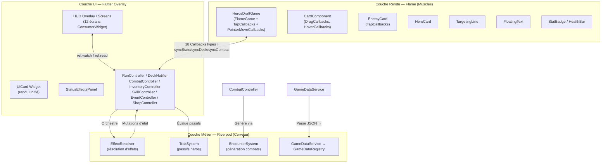
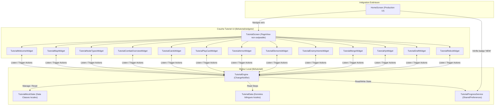
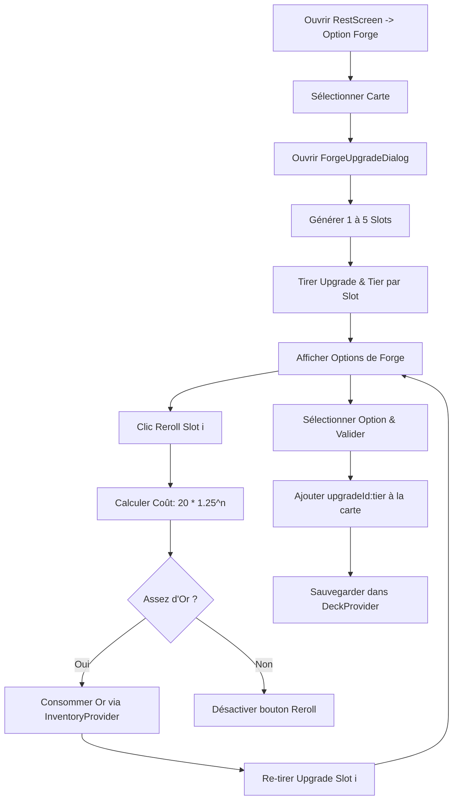
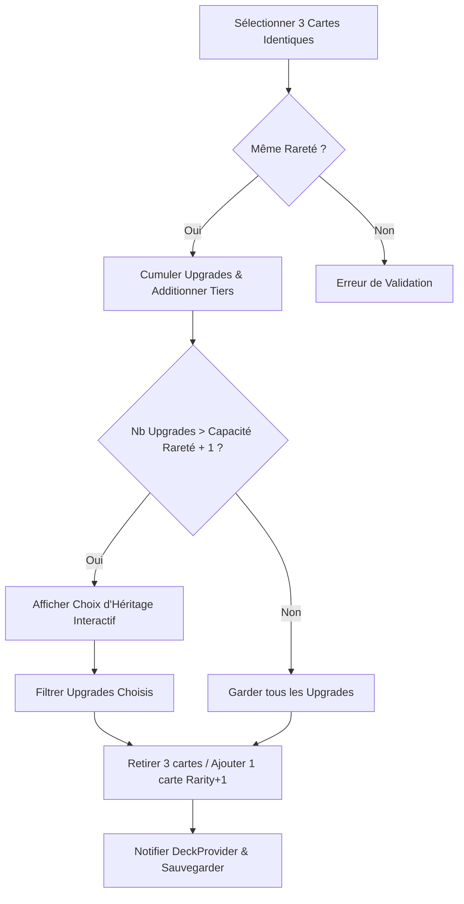

# 🏗️ Architecture & Conception (System Patterns)

Ce document décrit l'architecture globale, les patrons de conception, la stratégie de gestion d'état, les composants d'interface et les conventions de codage appliqués dans le projet **Hero's Draft**.

---

## 1. Architecture Globale — Séparation Triangulaire

Le projet **Hero's Draft** repose sur une **séparation triangulaire stricte des responsabilités (SOC)** entre trois couches distinctes : la **Logique Métier (Riverpod)**, le **Rendu Interactif (Flame Engine)** et l'**Interface Utilisateur HUD (Flutter Widgets)**.



### 1.1. Inventaire des fichiers source

| Couche | Répertoire | Fichiers clés | ~Lignes |
|:---|:---|:---|:---|
| Entrée | `lib/main.dart` | `HerosDraftApp` (ConsumerWidget, ProviderScope, MaterialApp) | ~40 |
| Rendu Flame | `lib/game/heros_draft_game.dart` | `HerosDraftGame` — orchestrateur Flame | ~775 |
| Rendu Flame | `lib/game/components/` | `card_component.dart` (~1031), `targeting_line.dart`, `entities/` (5 fichiers) | ~2500 |
| Constantes | `lib/game/game_constants.dart` | `GameConstants` — z-index, tailles, badges | ~30 |
| Contrôleurs | `lib/game/controllers/` | `run_controller.dart`, `combat_controller.dart`, `deck_controller.dart`, `inventory_controller.dart`, `skill_controller.dart`, `event_controller.dart`, `shop_controller.dart` | ~2000 |
| Systèmes | `lib/game/systems/` | `encounter_system.dart`, `trait_system.dart` | ~200 |
| Services (jeu) | `lib/game/services/` | `effect_resolver.dart` | ~250 |
| Services (app) | `lib/services/` | `game_data_service.dart`, `map_generator_service.dart` | ~250 |
| Modèles Data | `lib/models/data/` | 8 fichiers (`card_data.dart`, `enemy_data.dart`, `hero_data.dart`, `skill_data.dart`, `event_data.dart`, `passive_data.dart`, `relic_data.dart`, `game_data_registry.dart`) | ~800 |
| Modèles Runtime | `lib/models/` | 11 fichiers (instances, états, status) | ~600 |
| UI Écrans | `lib/ui/screens/` | 10 écrans (`home_screen`, `hero_selection_screen`, `starter_deck_draft_screen`, `map_screen`, `game_screen`, `shop_screen`, `event_screen`, `campfire_screen`, `draft_screen`, `dictionary_screen`) | ~5500 |
| UI Widgets | `lib/ui/widgets/` | `ui_card.dart`, `status_effects_panel.dart` | ~400 |
| Système Tutoriel | `lib/tutorial/` | `tutorial_engine.dart`, `tutorial_screen.dart`, widgets d'étapes (18 fichiers) | ~2000 |
| **Total estimé** | | **~63 fichiers** | **~10200** |

---

## 2. Rôle des Contrôleurs (`lib/game/controllers/`)

Tous les contrôleurs héritent de `StateNotifier<T>` et exposent des états immuables (pattern `copyWith`). Ils constituent la **source unique de vérité** du jeu.

### 2.1. `RunController` (`runProvider`) — Superviseur Global

**Provider** : `StateNotifierProvider<RunController, RunState>` — détient `Ref ref`.

**État `RunState`** : `currentLevel`, `act`, `heroStats` (EntityStats), `heroClassId`, `mapNodes` (List\<MapNode\>), `currentNodeId`, `passiveTrait`, `activePassive` (PassiveData?).

**Responsabilités** :
- **Cycle de vie de la run** : `startNewRun(HeroData, PassiveData?)` — génère la carte via `MapGeneratorService`, initialise les stats depuis les données héros, reset l'inventaire (50 or), reset les cooldowns.
- **Progression** : `travelToNode(nodeId)`, `completeCurrentNode()` (reset armure, clear statuts, avance acte si boss), `advanceToNextWorld()`, `nextLevel()`.
- **Gestion des ressources** : `consumeResource({mana, hpPercent})` — validation + déduction. `heal(amount)`, `takeDamage(amount)` (délègue à `EntityStats.takeDamage`), `setHeroStats(...)`.
- **Gestion de l'Expérience (XP)** : `gainXp(int xp)` accumule l'XP de victoire. Calcule le seuil requis via la formule $100 \times 1.5^{\text{level} - 1}$. Gère la cascade de multi-niveaux et conserve le reste d'expérience (`carry-over`) sans perte.
- **Statistiques permanentes** : `applyHeroStatModifier({maxPvAcc, attackAcc, armorAcc, maxManaAcc, luckAcc})` — modifie les stats permanentes (maxPv soigne le delta).
- **Statuts** : `addStatus(StatusEffect)`.
- **Tour de combat** : `startCombat()` (clear statuts, restore mana, reliques `startOfCombat`, TraitSystem) → `startTurn()` (**logique centrale** : restore mana → reliques `startOfTurn` → processing poison/strength_regen/armor_regen → tick durations → tick cooldowns → `TraitSystem.onTurnStart`).
- **Système de reliques** : `applyRelics(RelicTrigger)` — lit l'inventaire, applique les reliques matchant le trigger. `applyRelicEffect(RelicData)` — switch sur effectType : `gain_mana`, `gain_armor` (+armorMastery), `gain_strength`, `gain_luck`, `heal`.
- **Buffs de compétences** : `applyAttackBuff(duration)` — ajoute strength = 15% de maxPv. `applyLifestealBuff(duration)`.

**Interactions** : Lit `inventoryProvider` (reliques), `skillProvider.notifier` (cooldowns). Muté par `CombatController`, `EventController`, `ShopController`, `TraitSystem`, `EffectResolver`.

### 2.2. `CombatController` (`combatProvider`) — Pilote de Combat

**Provider** : `StateNotifierProvider<CombatController, CombatState>` — standalone (pas de Ref).

**État `CombatState`** : `enemies` (List\<EnemyInstance\>), `turnPhase` (TurnPhase: player/enemy), `turnCount`, `selectedEnemyId`, `isCombatEnded`, `isVictory`.

**Responsabilités** :
- **Initialisation** : `initializeCombat(level, nodeType, availableEnemies)` — calcule le combat level dynamique $EnemyLevel = PlayerLevel + (Act - 1) \times 2 + NodeModifier$, applique multiplicateurs de scaling de caractéristiques (+12% HP/lvl, +8% ATK/lvl), et applique les coefficients boss (3x HP)/élite (1.5x) avant de roll les intentions initiales.
- **Pipeline de jeu de carte** : `applyPlayerCardPlay(card, RunController, DeckNotifier)` — `EffectResolver.resolveCard()` → `deck.playCard()` → `TraitSystem.onCardPlayed()` → reliques `onCardPlayed` → `_cleanDeadEnemies()`.
- **Intentions ennemies** : `resolveEnemyIntent(enemyId, RunController)` — switch sur IntentType : attack → `runController.takeDamage`, defend → armure, buff → strength(99 tours), debuffDeck → no-op.
- **Phases** : `startEnemyTurn(RunController)` — phase enemy, processing poison/regen sur chaque ennemi, tick statuts, clean morts. `endEnemyTurn()` — re-roll toutes les intentions, phase player, incrémente turnCount.
- **Nettoyage** : `_cleanDeadEnemies()` — filtre HP ≤ 0, `runController.onEnemyKilled()` par kill (→ reliques), auto-sélection du prochain ennemi, flags `isCombatEnded`/`isVictory`.

**Logique de roll d'intentions** (`_rollIntent`) :
- Si l'ennemi a des `intents` prédéfinis : cycle séquentiel (modulo length, via `intentStep`).
- Sinon aléatoire : 60% attack (baseDamage), 25% defend (5-10 armure), 15% buff (+2 strength).

### 2.3. `DeckNotifier` (`deckProvider`) — Maître du Deck

**Provider** : `StateNotifierProvider<DeckNotifier, DeckState>` — standalone.

**État `DeckState`** : `masterDeck`, `drawPile`, `hand`, `discardPile`, `exhaustPile` (toutes `List<CardInstance>`).

**Responsabilités** :
- **Cycle de vie** : `clearDeck()`, `initializeStarterDeck(cards)`, `initializeCombat()` (masterDeck → drawPile shuffle, clear piles).
- **Mécanique de pioche** : `drawCards(amount)` — pioche min(amount, drawPile.length). **Pas de reshuffle automatique** : `shuffleDiscardIntoDraw()` doit être appelé séparément.
- **Jeu de carte** : `playCard(card)` — retire de la main. Cartes Power ou `isExhaust` → exhaustPile; autres → discardPile.
- **Gestion du deck** : `addCardToMasterDeck()`, `removeCardById()`, `upgradeCard(uniqueId)` (level+1 permanent).
- **Auto-Merge** : `mergeCards(cardId, level)` — cherche 3 copies (même baseCardId + level), supprime les 3, ajoute 1 copie à level+1.
- **Défausse/Main** : `discardHand()` (main → défausse), `addCardToDiscardPile()` (pour debuff deck ennemi).

### 2.4. `EventController` (`eventProvider`)

**Provider** : `StateNotifierProvider<EventController, EventState>` — standalone.

**Responsabilités** : `initializeEvent(events)` (pick aléatoire), `selectChoice(choice, RunController, InventoryController, allRelics)` — résout les actions séquentiellement : `gain_gold`, `spend_gold`, `take_damage`, `heal`, `gain_max_hp`, `gain_strength`, `gain_relic`.

**Roll de rareté de relique** (influencé par luck) : Legendary 1%+luck×0.5%, Epic 5%+luck×1%, Rare 14%+luck×2%, Uncommon 20%+luck×3%, Common = reste. Fallback vers common si aucune relique de la rareté tirée.

### 2.5. `ShopController` (`shopProvider`)

**Provider** : `StateNotifierProvider<ShopController, ShopState>` — standalone.

**Responsabilités** : `initializeShop(allCards, bonusShopCards)` (filtre cartes status, shuffle, prend 3+bonus), `buyCard()`, `buyHeal()` (une seule fois par visite), `expandShop()` (bonus permanent via inventaire), `rerollCards()`, `purgeCard()` (suppression permanente), `cloneCard()` (duplication même level).

**Tarification** (`getCardPrice` static) : Common=25, Uncommon=50, Rare/Epic/Legendary=100.

### 2.6. `InventoryController` (`inventoryProvider`)

**Provider** : `StateNotifierProvider<InventoryController, InventoryState>` — détient `Ref ref`.

**État** : `gold`, `relics` (List\<RelicData\>), `bonusShopCards`.

**Responsabilités** : `gainGold()`, `spendGold()` (validation), `addRelic()` (si trigger `startOfRun` → application immédiate via runProvider), `buyShopExpansion()`, `reset(initialGold: 50)`.

### 2.7. `SkillController` (`skillProvider`)

**Provider** : `StateNotifierProvider<SkillController, SkillState>` — détient `Ref ref`.

**État** : `skill1Cooldown`, `skill2Cooldown` (int).

**Responsabilités** : `tickCooldowns()` (décrémente de 1, min 0), `triggerSkill1(cd, {mana, hpPercent})` / `triggerSkill2()` — vérifie cooldown, consomme ressources via runProvider, active le cooldown. `resetCooldowns()`.

---

## 3. Systèmes Transversaux (`lib/game/systems/`)

### 3.1. `EncounterSystem` — Générateur de Combats

**Type** : Classe statique utilitaire (pas de provider, pas d'état).

**Méthode** : `static generateEnemiesForLevel(int level, List<EnemyData> availableEnemies, {MapNodeType? nodeType}) → List<EnemyData>`

**Logique de dimensionnement** :
| Type de nœud | Nombre d'ennemis | Multiplicateur Stats |
|:---|:---|:---|
| Boss | Toujours 1 | 3.0× HP, 2.0× attack |
| Élite | 2-3 | 1.5× HP, 1.5× attack |
| Combat (level ≤5) | 1-2 | 1.0× (base) |
| Combat (level >5) | 1-3 | 1.0× (base) |

Les ennemis sont piochés aléatoirement dans le pool disponible (doublons possibles). Le scaling par level est appliqué dans `CombatController.initializeCombat()`.

### 3.2. `TraitSystem` — Passifs de Héros

**Type** : Classe statique utilitaire.

**Méthodes** :
| Méthode | Trigger | Logique |
|:---|:---|:---|
| `onTurnStart(RunController)` | `startOfTurn` | `berserker_armor` : X armure par tranche de 10 HP manquants (+armorMastery). `gain_armor` : armure fixe (+armorMastery). |
| `onTurnEnd(RunController)` | `endOfTurn` | `gain_armor` : armure fixe (+armorMastery). |
| `onCardPlayed(RunController, CardInstance)` | `onCardPlayed` | `spell_armor` : gain d'armure quand une carte de type Skill est jouée. |

**Couplage** : Tous les gains d'armure incluent systématiquement le bonus `armorMastery`.

### 3.3. `EffectResolver` — Résolution d'Effets de Cartes

**Type** : Classe statique utilitaire (`lib/game/services/effect_resolver.dart`).

**Méthodes principales** :

#### `canPlayCard(CardInstance, RunState, String? selectedEnemyId) → bool`
- Vérifie : mana suffisant (≥ `currentCost`), carte non-status, carte ciblée → `selectedEnemyId` requis.

#### `resolveCard(CardInstance, RunController, DeckNotifier, CombatController, String?) → bool`
1. Déduit le coût en mana.
2. Itère sur `cardData.effects` (List\<CardEffect\>).
3. Pour chaque effet, calcule la valeur mise à l'échelle :
   ```
   scaledValue = baseValue * (1 + (level - 1) * 0.5)
   ```
   | Level | Multiplicateur |
   |:---|:---|
   | 1 | ×1.0 |
   | 2 | ×1.5 |
   | 3 | ×2.0 |
4. Dispatch par type d'effet : `damage`, `heal`, `armor`, `gain_mana`, `draw`, `apply_status`.

#### `_calculateDamage(int baseDamage, EntityStats attackerStats) → int`
```dart
totalDamage = baseDamage + attackerStats.effectiveAttaque
if weakness status: totalDamage *= 0.75  // Réduction de 25%
```
> **⚠️ Absence notable** : Le statut `vulnerable` n'est PAS pris en compte dans ce calcul malgré sa déclaration dans le système de types.

**Statuts créables et gérés** : `poison`, `strength`, `weakness`, `strength_regen`, `armor_regen`, `burn` (Brûlure), `freeze` (Gel), `shock` (Électrocution).
**Statut NON géré** : `vulnerable` (déclaré et créable, mais absent de la formule de calcul effectif de `_calculateDamage()`).

---

## 4. Synchronisation Bidirectionnelle Flame ⇄ Riverpod

Le mécanisme de synchronisation repose sur un **pattern de double-buffering** :

### 4.1. Descente d'État (Riverpod → Flame)

Les widgets Flutter (via `WidgetRef`) appellent trois setters :
- `game.syncState(RunState)` → écrit dans `_nextState`
- `game.syncDeck(DeckState)` → écrit dans `_nextDeckState`
- `game.syncCombat(CombatState)` → écrit dans `_nextCombatState`

Dans `HerosDraftGame.update(dt)`, si `hasLayout == true` et qu'un buffer est non-null :
1. `_applyState(_nextState!)` → crée/met à jour `HeroCard`, rafraîchit les visuels de cartes en main.
2. `_applyDeckState(_nextDeckState!)` → diff les cartes en main (ajout/suppression), recalcule le layout en arc.
3. `_applyCombatState(_nextCombatState!)` → diff les ennemis (ajout avec fade/scale, suppression), repositionne, synchronise la sélection visuelle, met à jour la phase.

### 4.2. Remontée d'Événements (Flame → Riverpod)

**18 callbacks fortement typés** injectés via le constructeur de `HerosDraftGame` :
| Callback | Déclencheur |
|:---|:---|
| `onPlayCard` | Carte jouée (drop sur ennemi valide) |
| `onSelectEnemy` / `onUpdateEnemyStats` | Clic/tap sur ennemi |
| `onTurnEnded` / `onPhaseChanged` | Fin de tour joueur / changement de phase |
| `onStartEnemyTurn` / `onEndEnemyTurn` | Début/fin de phase ennemie |
| `onResolveEnemyIntent` | Résolution séquentielle d'intention |
| `onPlayerTakeDamage` / `onPlayerHeal` / `onPlayerGainArmor` | Modifications stats héros |
| `onEnemiesDead` / `onEnemyKilled` | Nettoyage d'ennemis |
| `onEnemyDebuffDeck` | Action debuff du deck par ennemi |
| `onEnemiesSpawned` | Spawn initial |
| `onShowTooltip` / `onHideTooltip` | Tooltips contextuels |

### 4.3. Phase de Riposte Ennemie (`_enemyRipostePhase`)

Flux asynchrone séquentiel avec animations :
1. `onPhaseChanged(TurnPhase.enemy)` + délai 600ms
2. `onStartEnemyTurn()` → `CombatController.startEnemyTurn()` (ticks poison, traitement statuts)
3. Délai 400ms pour animations de tick
4. **Boucle** sur chaque ennemi : animation d'attaque/buff → `onResolveEnemyIntent(enemyId)` → délai 400ms
5. `onEndEnemyTurn()` → re-roll intentions, retour phase joueur

### 4.4. Système de Mort et de Stats Différé Z-Sync (Delayed Entity Destruction & Visual Stats Synchronization)

Pour éliminer la condition de concurrence visuelle (race condition) où l'état logique de Riverpod met à jour les statistiques (points de vie, armure, statuts) ou supprime instantanément un ennemi alors que l'animation de la carte Flame est encore en route, le jeu implémente le patron Z-Sync étendu aux attributs visuels :

1. **Drapeaux et Buffers de Verrouillage** :
   - `game.isCardAnimating` (booléen global) : Flag de verrouillage positionné à `true` dès qu'une carte jouée initie sa phase d'attaque ou de lancer d'effet.
   - `enemyCard.isPendingDeath` (booléen local) : Flag indiquant que l'ennemi a été tué logiquement mais que sa suppression visuelle est mise en attente.
   - `enemyCard._pendingVisualInstance` (modèle `EnemyInstance?` local) : Buffer stockant l'état des statistiques logiques reçues durant le trajet de la carte afin d'en différer l'affichage HUD.

2. **Diffèrement des Statistiques HUD réactives (`updateStats`)** :
   - Lors de la réception de nouvelles statistiques dans `EnemyCard.updateStats(newInstance)` :
     - Les effets visuels physiques d'impact (secousses `Curves.elasticOut`, flashes sprite `ColorEffect`, FloatingText, particules de dégâts) sont déclenchés **immédiatement** pour un ressenti dynamique instantané.
     - Si `game.isCardAnimating == true`, la mise à jour de la barre de vie (`HealthBar`), du badge d'armure (`StatBadge`), et de la liste des icônes de buffs/debuffs est **bloquée** et stockée dans `_pendingVisualInstance`.
     - Si faux, les badges et jauges sont actualisés de suite.

3. **Interception du Nettoyage Visuel (`_applyCombatState`)** :
   Dans `_applyCombatState`, lors de l'application du delta des ennemis :
   - Si un ennemi visuel Flame n'est plus présent dans la liste des ennemis logiques (Riverpod) :
     - Si `game.isCardAnimating == true`, le composant n'est **PAS** supprimé immédiatement. Il est marqué `isPendingDeath = true` et reste pleinement dessiné sur le board.
     - Si faux, il est supprimé ou anime sa disparition immédiatement (mort passive de début de tour, ex: poison).

4. **Libération et Résolution Synchrone (`resolvePendingDeaths`)** :
   - Lorsque l'effet visuel de la carte se termine et impacte sa cible (physiquement ou magiquement) :
     - Le callback `onComplete` ou de fin de mouvement est déclenché.
     - Il appelle `game.resolvePendingDeaths()`.
     - Cette méthode bascule `game.isCardAnimating = false`.
     - Elle parcourt toutes les `EnemyCard` pour appeler `card.resolvePendingVisualStats()` afin d'appliquer l'instance stockée dans `_pendingVisualInstance`, actualiser de façon synchrone les barres de vie, l'armure et les indicateurs à la frame exacte de l'impact visuel.
     - Elle lance simultanément l'animation de mort (réduction de taille via `ScaleEffect` et fondu d'opacité via `OpacityEffect` de Flame) pour toutes les `EnemyCard` ayant `isPendingDeath == true`.

---

## 5. UI et Composants Graphiques

### 5.1. Écrans Flutter (`lib/ui/screens/`)

| Écran | Classe | Pattern | Responsabilité |
|:---|:---|:---|:---|
| `HomeScreen` | `ConsumerWidget` | `ref.watch(gameDataLoaderProvider)` | Écran d'accueil, chargement données, boutons "New Game" / "Dictionary" |
| `HeroSelectionScreen` | `ConsumerWidget` | `ref.watch(gameDataLoaderProvider)` | Affiche 3 héros, déclenche `startNewRun()` |
| `StarterDeckDraftScreen` | `ConsumerStatefulWidget` | `ref.read(deckProvider.notifier)` | Vagues de 3 cartes, construction du deck initial via `UiCard` |
| `MapScreen` | `ConsumerStatefulWidget` | `ref.watch(runProvider)`, `ref.watch(inventoryProvider)` | **God Class (2471 lignes)** — CustomPainter, pan/zoom, tooltips, légende, validation, navigation |
| `GameScreen` | `ConsumerStatefulWidget` | Tous les providers | **God Class (1667 lignes)** — embed `GameWidget<HerosDraftGame>`, 5 overlays privés, orchestration combat |
| `ShopScreen` | `ConsumerWidget` | `ref.watch(inventoryProvider)` | Achat cartes/reliques via `UiCard` |
| `EventScreen` | `ConsumerWidget` | `ref.watch(runProvider)` | Événements narratifs à choix branchus |
| `CampfireScreen` | `ConsumerWidget` | `ref.watch(runProvider)`, `ref.watch(deckProvider)` | Repos (heal 30%), Forge (level up), Oubli (suppression) |
| `DraftScreen` | `ConsumerStatefulWidget` | `ref.read(deckProvider.notifier)` | Draft post-combat : 3 choix de cartes |
| `DictionaryScreen` | `ConsumerWidget` | `ref.watch(gameDataLoaderProvider)` | Catalogue filtrable de toutes les cartes |

**Pattern de navigation** : 100% via `Navigator.of(context).push(MaterialPageRoute(...))` — aucun routeur centralisé.

### 5.2. Widget `UiCard` (`lib/ui/widgets/ui_card.dart`)

**Composant UI maître unifié** — remplace 6 implémentations dupliquées.

- **Ratio d'aspect** : `70 / 110` constant.
- **Design** : Gradient de fond basé sur la rareté (grey/green/blue/purple/gold), cristal de mana (haut-gauche), icône de type (haut-droit), barre de nom colorée, badge de level.
- **`_buildDetailedDescription()`** : Parse la liste d'effets, remplace les placeholders dynamiques selon le niveau, et enrichit systématiquement les statuts d'explications mécaniques détaillées, claires et localisées entre parenthèses :
  - **poison** : `(Subit des dégâts égaux au Poison au début de son tour, puis la durée diminue)` en FR / `(Takes damage equal to Poison at turn start, then duration decreases)` en EN.
  - **burn** : `(Subit des dégâts de feu égaux à la Brûlure au début de son tour, puis la valeur diminue de 1)` en FR / `(Takes fire damage equal to Burn at turn start, then the value decreases by 1)` en EN.
  - **freeze** : `(Réduit les dégâts de la prochaine attaque de l'ennemi de 50%)` en FR / `(Reduces next enemy attack damage by 50%)` en EN.
  - **shock** : `(Subit des dégâts supplémentaires égaux à l'Électrocution à chaque coup reçu)` en FR / `(Takes extra damage equal to Shock on every hit)` en EN.
  - **weakness** : `(Réduit les dégâts infligés par l'ennemi de 25%)` en FR / `(Reduces damage dealt by the enemy by 25%)` en EN.
  - **vulnerable** : `(L'ennemi subit 50% de dégâts supplémentaires)` en FR / `(Enemy takes 50% more damage from attacks)` en EN.
- **Mappage HUD & Emojis** : Pour préserver la cohérence visuelle absolue :
  - Les statuts joueurs et ennemis utilisent des émojis unifiés dans `status_indicator.dart` (`burn` 🔥, `freeze` ❄️, `shock` ⚡, `strength_regen` ✊ pour éviter la collision visuelle avec burn).
  - Les labels linguistiques sont câblés dynamiquement à la volée dans `status_effects_panel.dart`.

### 5.3. Composants Flame (`lib/game/components/`)

| Composant | Héritage | Rôle | Priorité Z |
|:---|:---|:---|:---|
| `CardComponent` | `PositionComponent` + `DragCallbacks` + `HoverCallbacks` | Carte en main : tilt organique au drag, `TargetingLine` réactive, shake si mana insuffisant | base=10+index, hover=100, focused=150, dragging=500 |
| `TargetingLine` | `PositionComponent` | Arc de ciblage : gradient vert→rouge, pattern pointillé animé, cercles pulsants sur cibles valides | 300 |
| `EnemyCard` | `PositionComponent` + `TapCallbacks` | Entité ennemie : barre de vie, badges stats, indicateur d'intention, bordure pulsante si ciblé, `dashAnimation()` | 20 |
| `HeroCard` | `PositionComponent` | Entité héros : portrait, `HealthBar`, `StatBadge` (armure/mana), icônes de statuts | 10 |
| `FloatingText` | `PositionComponent` | Texte flottant de dégâts/soins : `MoveEffect` ascendant + `OpacityEffect` fade, auto-suppression ~1.5s | — |
| `HealthBar` | `PositionComponent` | Barre HP horizontale : interpolation green→yellow→red, transition animée | — |
| `StatBadge` | `PositionComponent` | Badge vectoriel custom : icône bouclier/cristal, valeur numérique, pulse de scale au changement | — |

### 5.4. Constantes de Z-Indexing (`GameConstants`)

| Constante | Valeur | Usage |
|:---|:---|:---|
| `priorityBackground` | -100 | Fond d'arène |
| `priorityCardBase` | 10 | Cartes en main (+ index) |
| `priorityHero` | 10 | HeroCard |
| `priorityEnemy` | 20 | EnemyCards |
| `priorityCardHovered` | 100 | Carte survolée |
| `priorityCardFocused` | 150 | Carte sélectionnée/ciblée |
| `priorityCardTrail` | 200 | Effets de traînée |
| `priorityTargetingLine` | 300 | Ligne de ciblage |
| `priorityCardDraggingMax` | 500 | Carte en cours de drag |

### 5.5. Dimensions de Carte

`cardWidth = 140.0`, `cardHeight = 196.0` → `cardSize = Vector2(140, 196)`.
Badges : `badgeHpSize = Vector2(130, 16)`, `badgeStandardSize = Vector2(48, 22)`, `badgeCircleSize = Vector2(36, 36)`.

### 5.6. Layout de Main en Arc

Les cartes sont distribuées en arc circulaire au bas du viewport :
```dart
radius = size.y * 1.5
angleStep = max(0.08, (0.4 / count).clamp(0.04, 0.08))  // réduit pour >4 cartes
center = (width/2, height + radius - height*0.23)
```

### 5.7. Courbes de Ciblage Réactives en Bézier Quadratique

La ligne de ciblage rectiligne rigide a été remplacée par une courbe dynamique fluide dans `targeting_line.dart` :

1. **Interpolation Quadratique de Bézier** :
   La courbe est tracée à l'aide d'un point de départ $P_0$ (la carte sélectionnée), un point d'arrivée $P_2$ (la position actuelle de la souris ou la cible), et un point de contrôle $P_1$ calculé dynamiquement pour générer une cambrure organique :
   ```dart
   // Point de contrôle au milieu avec décalage vertical proportionnel
   final controlPoint = Vector2((start.x + end.x) / 2, min(start.y, end.y) - 180.0);
   ```

2. **Détail des Pointillés Défilants (Scrolling Dots)** :
   Au lieu de points fixes, la courbe échantillonne des points le long de $t \in [0.0, 1.0]$. Un offset temporel incrémenté à chaque frame fait défiler des disques pointillés le long des points interpolés. Un fondu d'opacité (fade-in / fade-out) est appliqué aux limites ($t < 0.15$ et $t > 0.85$) pour éviter toute coupure nette des cercles.

3. **Orientation Dynamique de la Flèche (Derivative Tangent)** :
   Pour que la tête de flèche pointe parfaitement dans la direction de la cible à l'extrémité, l'orientation (angle de rotation) est calculée en dérivant l'équation de Bézier quadratique à $t = 1.0$ (tangente d'arrivée) :
   $$B'(t) = 2(1-t)(P_1 - P_0) + 2t(P_2 - P_1)$$
   À $t = 1.0$, le vecteur de direction tangent est exactement $2(P_2 - P_1)$. On en déduit l'angle avec `atan2`.

4. **Couleurs Élémentaires Réactives** :
   Le tracé de la ligne s'accorde dynamiquement aux éléments des effets de la carte jouée :
   - Feu (`fire`) : Orange vibrant.
   - Froid (`ice`) : Cyan électrique.
   - Poison (`poison`) : Vert émeraude.
   - Électrique (`lightning`) : Jaune foudre.
   - Mêlée (`melee`) / Physique : Rouge et blanc classique.

### 5.8. Rendu Vectoriel direct sur Canvas & Auras Sensoriels

1. **Icônes Vectorielles (Canvas Drawing)** :
   Pour éliminer les émojis texte basse résolution, la classe `EffectIcon` (`lib/ui/widgets/effect_icon.dart`) redessine ses icônes à la main via les fonctions graphiques de l'API Canvas (`Path`, `drawPath`, `drawCircle`) de Flutter, enrichies d'un effet de lueur floutée (`MaskFilter.blur(BlurStyle.normal, 3.5)`) :
   - **Écu d'Armure** : Un blason métallique avec des contours à double trait et une face interne brillante.
   - **Épées Croisées** : Deux lames d'acier croisées en diagonale avec des gardes et pommeaux dorés.
   - **Goutte de Poison** : Une larme vert menthe dessinée avec un chemin de Bézier fluide, dotée d'une double bordure contrastée.
   - **Étoile de Force** : Une étoile dorée parfaite à cinq branches calculée par trigonométrie radiale.
   - **Brûlure (`burn`)** : Une flamme rouge/orange dynamique et dansante avec des vagues de chaleur ascendantes.
   - **Gel (`freeze`)** : Un flocon de neige bleu turquoise symétrique à six branches avec des motifs de ramification délicats.
   - **Électrocution (`shock`)** : Un éclair jaune électrique angulaire, vif et acéré.

2. **Auras de Compétences (Spiritual Auras & Trails)** :
   - **Aura de Soin (Heal Aura)** : Jouer une carte de soin émet 20 particules en forme de croix dorées et vertes (`CrossParticle`) éjectées vers le haut depuis le centre du héros avec un fondu d'opacité linéaire.
   - **Dôme de Protection (Shield Dome)** : Jouer un effet défensif majeur fait apparaître un demi-dôme cyan translucide et pulsant (`ShieldDome`) centré sur la carte, strié de scanlines techniques horizontales pour donner une impression de champ de force actif.
   - **Embers & Ribbon Trails** : Le glissement des cartes génère une traînée d'étincelles élémentaires (`Embers`) assortie à la couleur de l'élément de la carte, doublée d'un ruban tactile translucide (`RibbonTrail`) qui suit le tracé du curseur pour un "game feel" Balatro-esque extrêmement satisfaisant.

3. **Carrousel de Récompenses Interactif (Relic Carousel & Particle Celebration)** :
   - **Pattern Slot-Machine PageView (Option B - Picker 3 Cartes)** : La classe `RelicRewardCarouselOverlay` implémente un carrousel à 3 cartes simultanées en exploitant un `PageView` Flutter configuré avec un `viewportFraction` réduit (~0.7). L'effet de profondeur est obtenu dynamiquement en calculant l'écart d'index entre la page active et la page courante :
     - Échelle : $1.0 - (\text{écart} \times 0.15)$, avec un plancher à `0.85x` pour les cartes latérales.
     - Opacité : $1.0 - (\text{écart} \times 0.6)$, avec un plancher à `0.4` pour les cartes latérales.
     - Un effet de flou dynamique (`ImageFiltered` avec `ImageFilter.blur`) est appliqué aux cartes non focalisées pour accentuer la profondeur de champ.
   - **Décélération Cubique Physique** : Le défilement automatique rapide de type machine à sous décélère de manière progressive en appliquant une transition `animateToPage` guidée par `Curves.easeOutCubic` sur 4,0 secondes. Les callbacks `onTick` (à chaque franchissement d'index visuel) et `onLand` (à la stabilisation finale sur la relique cible) découplent proprement les animations visuelles des futurs effets sonores (Sound Hooks).
   - **Peintre de Confettis Célébration (`RelicParticlePainter`)** : Un composant `CustomPainter` dessine directement sur Canvas une explosion radiale de particules (confettis rectangulaires rotatifs et étoiles dorées trigonométriques) s'éjectant à haute vélocité depuis le centre lors de l'arrêt du carrousel. Les particules intègrent des forces de gravité, de traînée aérodynamique et de fondu d'opacité graduel pour un rendu organique premium.
   - **Bouton de Collecte Sécurisé (Option A - Confirmation Pattern)** : Afin d'éviter les violations de l'état métier (Riverpod) et les incohérences de données, l'écriture dans l'inventaire via `addRelic` et le déblocage du bouton de validation « Récupérer » ne sont autorisés que lorsque le carrousel s'est immobilisé de façon stable sur sa cible (`isSpinning == false`), respectant le principe de transaction métier propre.

### 5.9. Pattern de Draft Card Reels Staggered et 3D Flip (Interactive Reels Reveal)

Pour augmenter la sensation d'excitation et de "butin" lors de l'acquisition de nouvelles cartes (draft initial ou récompense de victoire), le jeu implémente un spinner interactif type machine à sous :

1. **Structure de Widgets Autonomes (`DraftCardReel`)** :
   - Le draft instancie 3 widgets `DraftCardReel` autonomes disposés horizontalement.
   - Chaque rouleau simule un défilement vertical rapide de dos de cartes en boucle.

2. **Révélation Séquentielle Échelonnée (Staggered Stops)** :
   - Pour créer une tension et rythmer la découverte des cartes, l'arrêt des rouleaux est asynchrone et échelonné :
     - **Rouleau 1** : Arrêt et flip à **0.8 seconde**.
     - **Rouleau 2** : Arrêt et flip à **1.4 seconde**.
     - **Rouleau 3** : Arrêt et flip à **2.0 secondes**.
   - À la frame exacte de l'arrêt, le dos de carte effectue un flip 3D de 180° sur l'axe Y pour révéler son identité visuelle unifiée (`UiCard`) :
     ```dart
     transform: Matrix4.identity()
       ..setEntry(3, 2, 0.002) // Perspective 3D
       ..rotateY(angleAnimationValue);
     ```

3. **Célébration Temporelle des Cartes Rares/Légendaires** :
   - Si la carte tirée est de rareté **Épique** ou **Légendaire** :
     - Le temps de défilement est prolongé de **+0.8s** pour maximiser le suspense.
     - L'arrêt déclenche un effet de secousse de l'écran (`screen-shake`), une explosion de particules d'étoiles dorées sur Canvas et un halo de lumière blanche et dorée en arrière-plan.

4. **Découplage Audio via Callbacks** :
   - Les callbacks de sound hooks `onTick` (à chaque franchissement d'index de carte) et `onLand` (lors de la stabilisation finale) permettent de câbler proprement le moteur sonore de l'application sans couple visuel.

---

## 6. Stratégie de State Management (Riverpod v2.5.1)

### 6.1. Inventaire Complet des Providers

| Provider | Type | État | Auto-Dispose | Rôle |
|:---|:---|:---|:---|:---|
| `runProvider` | `StateNotifierProvider<RunController, RunState>` | `RunState` | Non | Progression globale, stats héros, carte, reliques |
| `deckProvider` | `StateNotifierProvider<DeckNotifier, DeckState>` | `DeckState` | Non | 5 piles de cartes, merge, upgrade |
| `combatProvider` | `StateNotifierProvider<CombatController, CombatState>` | `CombatState` | Non | Combat actif, ennemis, phases, intentions |
| `inventoryProvider` | `StateNotifierProvider<InventoryController, InventoryState>` | `InventoryState` | Non | Or, reliques, bonus boutique |
| `skillProvider` | `StateNotifierProvider<SkillController, SkillState>` | `SkillState` | Non | Cooldowns des 2 compétences héroïques |
| `eventProvider` | `StateNotifierProvider<EventController, EventState>` | `EventState` | Non | Événement narratif actif, choix sélectionné |
| `shopProvider` | `StateNotifierProvider<ShopController, ShopState>` | `ShopState` | Non | Cartes en vente, état d'achat heal |
| `gameDataLoaderProvider` | `FutureProvider<GameDataRegistry>` | `GameDataRegistry` | Non | Chargement asynchrone des 7 JSON d'assets |

### 6.2. Principes Appliqués

1. **Immuabilité d'état** : Tous les `StateNotifier` émettent de nouveaux objets state via `copyWith()`. Les listes sont recréées (pas de mutation in-place).
2. **Pas de logique dans les vues** : Les écrans UI consomment l'état via `ref.watch()` et déclenchent les mutations via `ref.read(provider.notifier).method()`.
3. **Providers non auto-disposed** : Tous les providers persistent entre les écrans pour conserver la progression de la run.

### 6.3. Sérialisation

| Modèle | `fromJson`/`toJson` | Statut |
|:---|:---|:---|
| `CombatState`, `EnemyInstance`, `EnemyIntent`, `EntityStats`, `StatusEffect`, `MapNode` | ✅ Oui | Round-trip complet |
| `CardInstance`, `EventState`, `InventoryState`, `ShopState`, `SkillState` | ❌ Non | Runtime uniquement |

---

## 7. Flux Complet d'un Tour de Combat

```
1. DÉBUT TOUR JOUEUR
   └→ RunController.startTurn()
       ├→ Restore mana = maxMana
       ├→ applyRelics(startOfTurn)
       ├→ Process statuts: poison (dégâts), strength_regen (→strength), armor_regen (→armure)
       ├→ tickStatuses() (décrémente durées, supprime expirés)
       ├→ tickCooldowns() (skill1/skill2 -1)
       └→ TraitSystem.onTurnStart(runController)

2. JOUEUR JOUE UNE CARTE
   └→ CombatController.applyPlayerCardPlay(card, runCtrl, deckNotif)
       ├→ EffectResolver.resolveCard() → consomme mana, applique effets (dégâts augmentés par le statut `shock` de l'ennemi)
       ├→ DeckNotifier.playCard() → main → défausse (ou exhaust)
       ├→ TraitSystem.onCardPlayed(runCtrl, card)
       ├→ applyRelics(onCardPlayed)
       └→ _cleanDeadEnemies() → onEnemyKilled() → reliques

3. FIN DE TOUR JOUEUR
   └→ HerosDraftGame.executeTurn()
       └→ _enemyRipostePhase()

4. PHASE ENNEMIE
   ├→ CombatController.startEnemyTurn()
   │   ├→ Pour chaque ennemi: process poison/regen/burn (Brûlure), tick statuts
   │   └→ _cleanDeadEnemies() (morts par poison ou brûlure)
   ├→ Pour chaque ennemi vivant:
   │   ├→ Animation (dash/buff)
   │   └→ resolveEnemyIntent() → dégâts héros (divisés par 2 si l'ennemi est sous statut `freeze`) / armure / strength
   └→ CombatController.endEnemyTurn()
       ├→ Re-roll toutes les intentions
       ├→ Phase → player
       └→ turnCount++

5. FIN DE COMBAT & TRANSITION DE VICTOIRE
   └→ _cleanDeadEnemies() détecte 0 ennemis
       ├→ isCombatEnded = true, isVictory = true
       └→ onEnemiesDead callback → UI affiche RewardOverlay / Pipeline de Victoire :
           ├→ Accumule et additionne l'XP gagnée de tous les ennemis (+10% d'XP par niveau de monstre au-dessus du lvl 1)
           ├→ RunController.gainXp(totalXp)
           ├→ SI LEVEL UP : Déclenche l'affichage en plein écran de la bannière festive « LEVEL UP ! »
           │   └→ Redirection du joueur vers l'écran DraftScreen amélioré (cartes proposées de raretés supérieures)
           └→ SINON : Attribution de l'or de victoire standard et déblocage du voyage sur la carte du monde
```

---

## 8. Conventions de Code & Standards Techniques

### 8.1. Analyse Statique

**`analysis_options.yaml`** :
```yaml
include: package:flutter_lints/flutter.yaml
```
Configuration minimaliste utilisant les règles standard de `flutter_lints` (v6.0.0). Aucune règle custom ajoutée.

### 8.2. Typage Fort par Énumérations

Le codebase utilise exhaustivement des enums pour éliminer les typos et optimiser les branchements `switch` :

| Enum | Fichier | Valeurs |
|:---|:---|:---|
| `CardType` | `card_data.dart` | `attack`, `skill`, `power`, `status` |
| `CardCategory` | `card_data.dart` | `global`, `characterSpecific` |
| `CardRarity` | `card_data.dart` | `common`, `uncommon`, `rare`, `epic`, `legendary` |
| `CardTarget` | `card_data.dart` | `singleEnemy`, `allEnemies`, `self`, `none` |
| `MapNodeType` | `map_node.dart` | `combat`, `elite`, `shop`, `rest`, `event`, `boss` |
| `IntentType` | `enemy_intent.dart` | `attack`, `defend`, `buff`, `debuffDeck` |
| `StatusType` | `status_effect.dart` | `buff`, `debuff` |
| `TurnPhase` | `combat_state.dart` | `player`, `enemy` |
| `RelicTrigger` | `relic_data.dart` | `startOfRun`, `startOfCombat`, `startOfTurn`, `endOfTurn`, `onCardPlayed`, `onEnemyKilled` |
| `RelicRarity` | `relic_data.dart` | `common`, `uncommon`, `rare`, `epic`, `legendary` |

### 8.3. Principes de Code Documentés

- **Zéro logique métier dans les vues** : toutes les mutations d'état sont déléguées aux contrôleurs Riverpod.
- **Validation obligatoire** : `dart analyze` / `flutter analyze` doit retourner 0 erreur et 0 avertissement à chaque fin de phase.
- **Constructeurs `const`** : Utilisation systématique pour optimiser le rebuild de l'arbre de widgets Flutter.
- **Proscription du `dynamic`** : Typage fort partout où possible (exception : `EventAction.value` qui accepte int ou String).

### 8.4. Responsivité Dynamique

Le projet applique deux grandes stratégies complémentaires de responsivité pour gérer les variations de résolutions (mobiles étroits, tablettes, formats de bureau, orientations portrait/paysage) :

#### 8.4.1. Échelonnement Global Flame (ScaleFactor)
Pour l'arène de combat principale Flame, le redimensionnement utilise une formule dynamique basée sur la hauteur réelle du viewport :
```dart
double get scaleFactor => (size.y / 800).clamp(0.85, 2.5);
```
- **Hauteur de référence** : 800px (résolution portrait mobile standard).
- **Clamp** : de 0.85 (plancher mobile étroit) à 2.5 (plafond 4K).
- Tous les composants Flame (cartes, espacements, rayons d'arc de main, positions) sont multipliés par ce coefficient.

#### 8.4.2. Stratégies de Responsivité de l'UI Flutter (Patrons Unifiés)
Pour l'UI Flutter (notamment le système de tutoriel), quatre patrons majeurs de responsivité sont standardisés et doivent être appliqués :

1. **FittedBox Canvas Scaling Pattern** :
   - *Problématique* : Les illustrations complexes comportant du positionnement absolu ou des animations vectorielles fines (`Map`, `Combat Overview`, `Play Card`, etc.) subissent des chevauchements ou des yellow-black overflow stripes sur les petits écrans.
   - *Solution* : Définir l'illustration dans un conteneur rigide `SizedBox` de dimensions de référence (ex. `360x260`) et l'envelopper dans un widget `FittedBox` avec `fit: BoxFit.contain`.
   - *Code type* :
     ```dart
     Widget build(BuildContext context) {
       return Center(
         child: FittedBox(
           fit: BoxFit.contain,
           child: SizedBox(
             width: 360,
             height: 260,
             child: Stack(
               children: [ /* composants absolus */ ],
             ),
           ),
         ),
       );
     }
     ```

2. **LayoutBuilder Orientation Split Pattern** :
   - *Problématique* : Les affichages empilant verticalement des illustrations et des panneaux textuels (comme `TutorialScreen`) provoquent des écrasements verticaux critiques en orientation mobile paysage (hauteur verticale utile < 500px).
   - *Solution* : Utiliser `LayoutBuilder` pour détecter les dimensions utiles et commuter la structure d'affichage.
     - *Portrait* (ou largeur < 600px) : Structure `Column` (illustration en haut flex 6, description en bas flex 4).
     - *Paysage* (largeur > hauteur et hauteur < 500px, ou largeur >= 720px) : Structure `Row` (illustration à gauche flex 5, description à droite flex 5).

3. **Scrollable Container Pattern** :
   - *Problématique* : Les textes explicatifs dynamiques ou les grilles d'éléments débordent verticalement sur les petits écrans si le défilement est interdit.
   - *Solution* : Remplacer `NeverScrollableScrollPhysics` par `BouncingScrollPhysics` ou encapsuler les éléments extensibles dans des conteneurs `SingleChildScrollView`.

4. **Wrap and Grid Adaptation Pattern** :
   - *Problématique* : Les rangées horizontales d'éléments larges (badges de raretés, listes de cartes) causent des débordements horizontaux.
   - *Solution* : Utiliser `Wrap` (au lieu de `Row`) pour les flux de badges, des scrollviews horizontaux pour les rangées de cartes en main, et réorganiser les grilles d'éléments denses en layouts compacts (ex. grille 3x2 pour les types de nœuds).


---

## 9. Architecture du Système de Tutoriel Autonome (Tutorial System Technical Design)

Le système de tutoriel a été conçu avec un objectif d'**isolation totale** pour garantir qu'aucune instabilité ou modification de la logique du jeu de base ne puisse survenir à la suite d'ajouts dans le tutoriel.



### 9.1. Moteur et Gestion d'État

- **`TutorialEngine` (`ChangeNotifier`)** : Le cœur logique. Il maintient l'index de l'étape courante, fournit les transitions (`nextStep()`, `previousStep()`), et gère un `TutorialMockState` encapsulant l'état du combat/jeu simulé.
- **`TutorialMockState`** : Contient :
  - `heroHp`, `maxHeroHp` (80/80)
  - `heroMana`, `maxHeroMana` (3/3)
  - `heroArmor`
  - `enemy` (`TutorialEnemy?`)
  - `hand`, `deck`, `discardPile` (`List<TutorialCard>`)
- **Isolation d'État** : À chaque changement d'étape, l'engine exécute `resetMockState()` pour configurer l'état spécifique nécessaire à l'étape suivante (ex: spawn d'un Slime de 20 PV à l'étape 6, distribution de cartes spécifiques, etc.).

### 9.2. Modèles de Données et i18n Découplée

- **`TutorialCard`** : Classe modèle simplifiée contenant les attributs essentiels pour l'affichage (cost, damage, armor, statusId, isExhaust). Elle n'importe pas les structures de données lourdes de production.
- **`TutorialEnemy`** : Modèle simplifié d'ennemi détenant son HP, maxHP, et une intention simulée.
- **`TutorialData`** : Répertoire statique contenant les 13 étapes du tutoriel (`TutorialStepData`). Chaque étape est définie par un titre et un contenu textuel bilingues (`titleEn`/`titleFr`, `bodyEn`/`bodyFr`), traduits à la volée selon la locale active sans passer par `AppLocalizations`.

### 9.3. Persistance et Intégration

- **`TutorialProgressService`** : Fournit une interface asynchrone statique pour lire et écrire le drapeau `tutorial_completed` dans les SharedPreferences de l'appareil.
- **Badge 'NEW' (Notification Visuelle)** : L'écran `HomeScreen` utilise un `FutureBuilder` appelant `TutorialProgressService.isCompleted()` pour conditionner l'affichage du badge d'alerte rouge et pulsant "NEW" sur le bouton d'accès au tutoriel.

### 9.4. Poli Visuel de Draft (Hover & Glow Effects)

La classe `TutorialDraftWidget` sert d'implémentation de référence pour le feedback de draft, s'appuyant sur :
- **`MouseRegion`** : Détecte les entrées/sorties de souris pour mettre à jour l'index survolé.
- **`AnimatedScale`** : Applique une transition d'échelle fluide de `1.05x` sur le survol (durée de 200ms).
- **`AnimatedContainer`** : Met à jour la décoration de bordure et de l'ombre en cas de sélection. Si la carte est sélectionnée, elle scale à `1.12x` et applique un `BoxShadow` doré intense (`Colors.amber` avec un rayon de flou de 16px).

### 9.5. Refonte Responsive et Ciblage Avancé

Dans le cadre des améliorations de la branche `feat/tutorial`, le module de tutoriel a été refactorisé :
- **Application des Patrons de Responsivité** : Les 13 widgets d'étapes de tutoriel ont été convertis pour utiliser les patrons unifiés de responsivité Flutter UI (FittedBox Canvas pour les illustrations, Wrap pour la légende de reliques, grille compacte 3x2 pour les types de nœuds, et défilement adaptatif avec des scrollviews).
- **Ciblage Interactif en Deux Phases** : À l'étape 6 (`TutorialPlayCardWidget`), la logique de jeu de cartes impose au joueur de réaliser successivement une action offensive (glisser/déposer la carte d'attaque sur le Slime) puis une action défensive (glisser la carte d'armure sur le Héros). Ce comportement est géré via une machine à états simple (`_targetingPhase`) intégrée au widget.
- **Info-bulles (Tooltips) de Cartes (Étape 5)** : Le widget `TutorialCardsWidget` utilise de vrais rendus de cartes vectorielles sur Canvas et affiche des infobulles descriptives et localisées (`TutorialTooltip`) lors du survol ou du toucher, évitant ainsi d'encombrer le layout principal tout en clarifiant les règles.

---

## 10. Architecture du Système de Forge et de Fusion de Cartes (Forge & Card Merge Technical Design)

Le système de Forge et de Fusion offre une progression non-linéaire des cartes en séparant proprement la logique métier (calculs de probabilités, relances et consolidation) du rendu visuel de l'interface utilisateur.

### 10.1. Modélisation et Résolution de la Forge (`ForgeUpgradeDialog`)

Le dialogue de forge `ForgeUpgradeDialog` (affiché via `RestScreen`) manipule des structures éphémères représentant les choix d'améliorations avant validation finale :

1. **Représentation des Améliorations** :
   Les améliorations de forge sont représentées sous forme de chaînes formatées `"upgradeId:tier"` stockées dans la liste `CardInstance.forgeUpgrades` (ex: `["sharp:2", "quick:1"]`).
   
2. **Génération Probabiliste des Options** :
   À l'initialisation de la forge pour une carte donnée, la classe `ForgeSlot` génère de 1 à 5 options indépendantes (tirages de Bernoulli successifs) :
   - Slot 1 : $100\%$ (Garanti)
   - Slot 2 : $50\%$
   - Slot 3 : $25\%$
   - Slot 4 : $10\%$
   - Slot 5 : $2\%$

3. **Filtrage des Pools par Rareté (Clamping)** :
   Chaque slot valide tire une amélioration depuis l'un des trois pools exclusifs de rareté :
   - **Pool Commun (`common`)** : Statuts offensifs de base (brûlure `burning`, gel `freezing`, électrocution `shocking` limités aux cartes de type `attack`) ou bonus statistiques simples (`sharp` pour dégâts, `hardened` pour armure).
   - **Pool Atypique (`uncommon`)** : Amélioration de pioche (`quick`).
   - **Pool Rare (`rare`)** : Réduction permanente de coût mana (`eco`) ou effet persistant `enduring` (qui désactive `isExhaust: true`), réservé aux cartes non-pouvoir exhaustibles.
   
   Le tirage probabiliste d'un pool dépend de la rareté de la carte :
   - Carte Commune : $100\%$ Commun.
   - Carte Atypique : $80\%$ Commun, $20\%$ Atypique.
   - Carte Rare : $60\%$ Commun, $30\%$ Atypique, $10\%$ Rare.
   - Carte Épique : $40\%$ Commun, $40\%$ Atypique, $20\%$ Rare.
   - Carte Légendaire : $20\%$ Commun, $50\%$ Atypique, $30\%$ Rare.

4. **Résolution du Tier** :
   Chaque amélioration se voit attribuer un Tier (I, II ou III) selon une distribution de probabilité pondérée :
   - Tier I : $80\%$
   - Tier II : $15\%$
   - Tier III : $5\%$

5. **Coût exponentiel et Reroll individuel** :
   Le joueur peut relancer individuellement les options proposées pour chaque slot en dépensant de l'or de l'inventaire via `InventoryController`. Le coût en or d'une relance est exponentiel et calculé localement sur chaque slot :
   $$\text{Coût Reroll} = \text{round}(20 \times 1.25^n)$$
   où $n$ représente le nombre total de relances appliquées sur ce slot spécifique.



### 10.2. Fusion Interactive et Consolidation des Upgrades (`DeckNotifier.mergeCards`)

La fusion interactive permet au joueur de fusionner 3 exemplaires d'une carte à la même rareté vers la rareté supérieure tout en préservant leurs améliorations :

1. **Validation 3→1** :
   La méthode `mergeCards` de `DeckNotifier` reçoit les identifiants uniques des 3 cartes sélectionnées. Elle valide que ces 3 cartes existent dans le deck, partagent le même `baseCardId` et ont la même rareté courante.

2. **Consolidation des Upgrades** :
   Le système rassemble toutes les améliorations de forge des 3 cartes consommées. Si plusieurs cartes possèdent la même amélioration (même ID d'upgrade), leurs Tiers sont cumulés (ex: `sharp:1` + `sharp:2` = `sharp:3`). Les améliorations uniques sont simplement copiées.

3. **Capacité Limite par Rareté** :
   Chaque palier de rareté possède une capacité d'amélioration maximale :
   $$\text{Capacité} = baseMaxForgeUpgrades + rarityIndex$$
   - Commune ($rarityIndex=0$) : 2 upgrades max.
   - Légendaire ($rarityIndex=4$) : 6 upgrades max.
   
   Si la liste des améliorations consolidées dépasse la capacité de la rareté supérieure ciblée par la fusion, l'interface utilisateur impose un choix d'héritage interactif pour sélectionner précisément les upgrades à conserver.

4. **Modificateurs de Rareté** :
   Lors de la résolution d'une carte en combat (`EffectResolver`), les valeurs de base (dégâts, blocage) sont multipliées par un coefficient lié à sa rareté active, remplaçant la progression par niveau numérique. Les upgrades de forge (ex. ajouter +X dégâts par Tier de `sharp`) s'additionnent ensuite au résultat mis à l'échelle.


