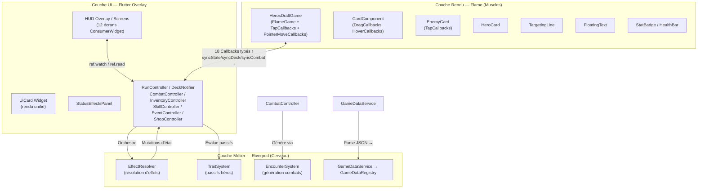

# 🏗️ Architecture & Conception (System Patterns)

Ce document décrit l'architecture globale, les patrons de conception, la stratégie de gestion d'état, les composants d'interface et les conventions de codage appliqués dans le projet **Hero's Draft**.

---

## 1. Architecture Globale — Séparation Triangulaire

Le projet **Hero's Draft** repose sur une **séparation triangulaire stricte des responsabilités (SOC)** entre trois couches distinctes : la **Logique Métier (Riverpod)**, le **Rendu Interactif (Flame Engine)** et l'**Interface Utilisateur HUD (Flutter Widgets)**.



### 1.1. Inventaire des fichiers source

| Couche | Répertoire | Fichiers clés | ~Lignes |
|:---|:---|:---|:---|
| Entrée | `lib/main.dart` | `HerosDraftApp` (ConsumerWidget, ProviderScope, MaterialApp) | ~40 |
| Rendu Flame | `lib/game/heros_draft_game.dart` | `HerosDraftGame` — orchestrateur Flame | ~775 |
| Rendu Flame | `lib/game/components/` | `card_component.dart` (~1031), `targeting_line.dart`, `entities/` (5 fichiers) | ~2500 |
| Constantes | `lib/game/game_constants.dart` | `GameConstants` — z-index, tailles, badges | ~30 |
| Contrôleurs | `lib/game/controllers/` | `run_controller.dart`, `combat_controller.dart`, `deck_controller.dart`, `inventory_controller.dart`, `skill_controller.dart`, `event_controller.dart`, `shop_controller.dart` | ~2000 |
| Systèmes | `lib/game/systems/` | `encounter_system.dart`, `trait_system.dart` | ~200 |
| Services (jeu) | `lib/game/services/` | `effect_resolver.dart` | ~250 |
| Services (app) | `lib/services/` | `game_data_service.dart`, `map_generator_service.dart` | ~250 |
| Modèles Data | `lib/models/data/` | 8 fichiers (`card_data.dart`, `enemy_data.dart`, `hero_data.dart`, `skill_data.dart`, `event_data.dart`, `passive_data.dart`, `relic_data.dart`, `game_data_registry.dart`) | ~800 |
| Modèles Runtime | `lib/models/` | 11 fichiers (instances, états, status) | ~600 |
| UI Écrans | `lib/ui/screens/` | 10 écrans (`home_screen`, `hero_selection_screen`, `starter_deck_draft_screen`, `map_screen`, `game_screen`, `shop_screen`, `event_screen`, `campfire_screen`, `draft_screen`, `dictionary_screen`) | ~5500 |
| UI Widgets | `lib/ui/widgets/` | `ui_card.dart`, `status_effects_panel.dart` | ~400 |
| **Total estimé** | | **~45 fichiers** | **~8200** |

---

## 2. Rôle des Contrôleurs (`lib/game/controllers/`)

Tous les contrôleurs héritent de `StateNotifier<T>` et exposent des états immuables (pattern `copyWith`). Ils constituent la **source unique de vérité** du jeu.

### 2.1. `RunController` (`runProvider`) — Superviseur Global

**Provider** : `StateNotifierProvider<RunController, RunState>` — détient `Ref ref`.

**État `RunState`** : `currentLevel`, `act`, `heroStats` (EntityStats), `heroClassId`, `mapNodes` (List\<MapNode\>), `currentNodeId`, `passiveTrait`, `activePassive` (PassiveData?).

**Responsabilités** :
- **Cycle de vie de la run** : `startNewRun(HeroData, PassiveData?)` — génère la carte via `MapGeneratorService`, initialise les stats depuis les données héros, reset l'inventaire (50 or), reset les cooldowns.
- **Progression** : `travelToNode(nodeId)`, `completeCurrentNode()` (reset armure, clear statuts, avance acte si boss), `advanceToNextWorld()`, `nextLevel()`.
- **Gestion des ressources** : `consumeResource({mana, hpPercent})` — validation + déduction. `heal(amount)`, `takeDamage(amount)` (délègue à `EntityStats.takeDamage`), `setHeroStats(...)`.
- **Statistiques permanentes** : `applyHeroStatModifier({maxPvAcc, attackAcc, armorAcc, maxManaAcc, luckAcc})` — modifie les stats permanentes (maxPv soigne le delta).
- **Statuts** : `addStatus(StatusEffect)`.
- **Tour de combat** : `startCombat()` (clear statuts, restore mana, reliques `startOfCombat`, TraitSystem) → `startTurn()` (**logique centrale** : restore mana → reliques `startOfTurn` → processing poison/strength_regen/armor_regen → tick durations → tick cooldowns → `TraitSystem.onTurnStart`).
- **Système de reliques** : `applyRelics(RelicTrigger)` — lit l'inventaire, applique les reliques matchant le trigger. `applyRelicEffect(RelicData)` — switch sur effectType : `gain_mana`, `gain_armor` (+armorMastery), `gain_strength`, `gain_luck`, `heal`.
- **Buffs de compétences** : `applyAttackBuff(duration)` — ajoute strength = 15% de maxPv. `applyLifestealBuff(duration)`.

**Interactions** : Lit `inventoryProvider` (reliques), `skillProvider.notifier` (cooldowns). Muté par `CombatController`, `EventController`, `ShopController`, `TraitSystem`, `EffectResolver`.

### 2.2. `CombatController` (`combatProvider`) — Pilote de Combat

**Provider** : `StateNotifierProvider<CombatController, CombatState>` — standalone (pas de Ref).

**État `CombatState`** : `enemies` (List\<EnemyInstance\>), `turnPhase` (TurnPhase: player/enemy), `turnCount`, `selectedEnemyId`, `isCombatEnded`, `isVictory`.

**Responsabilités** :
- **Initialisation** : `initializeCombat(level, nodeType, availableEnemies)` — utilise `EncounterSystem.generateEnemiesForLevel()`, applique multiplicateurs boss (3x HP)/élite (1.5x), roll les intentions initiales.
- **Pipeline de jeu de carte** : `applyPlayerCardPlay(card, RunController, DeckNotifier)` — `EffectResolver.resolveCard()` → `deck.playCard()` → `TraitSystem.onCardPlayed()` → reliques `onCardPlayed` → `_cleanDeadEnemies()`.
- **Intentions ennemies** : `resolveEnemyIntent(enemyId, RunController)` — switch sur IntentType : attack → `runController.takeDamage`, defend → armure, buff → strength(99 tours), debuffDeck → no-op.
- **Phases** : `startEnemyTurn(RunController)` — phase enemy, processing poison/regen sur chaque ennemi, tick statuts, clean morts. `endEnemyTurn()` — re-roll toutes les intentions, phase player, incrémente turnCount.
- **Nettoyage** : `_cleanDeadEnemies()` — filtre HP ≤ 0, `runController.onEnemyKilled()` par kill (→ reliques), auto-sélection du prochain ennemi, flags `isCombatEnded`/`isVictory`.

**Logique de roll d'intentions** (`_rollIntent`) :
- Si l'ennemi a des `intents` prédéfinis : cycle séquentiel (modulo length, via `intentStep`).
- Sinon aléatoire : 60% attack (baseDamage), 25% defend (5-10 armure), 15% buff (+2 strength).

### 2.3. `DeckNotifier` (`deckProvider`) — Maître du Deck

**Provider** : `StateNotifierProvider<DeckNotifier, DeckState>` — standalone.

**État `DeckState`** : `masterDeck`, `drawPile`, `hand`, `discardPile`, `exhaustPile` (toutes `List<CardInstance>`).

**Responsabilités** :
- **Cycle de vie** : `clearDeck()`, `initializeStarterDeck(cards)`, `initializeCombat()` (masterDeck → drawPile shuffle, clear piles).
- **Mécanique de pioche** : `drawCards(amount)` — pioche min(amount, drawPile.length). **Pas de reshuffle automatique** : `shuffleDiscardIntoDraw()` doit être appelé séparément.
- **Jeu de carte** : `playCard(card)` — retire de la main. Cartes Power ou `isExhaust` → exhaustPile; autres → discardPile.
- **Gestion du deck** : `addCardToMasterDeck()`, `removeCardById()`, `upgradeCard(uniqueId)` (level+1 permanent).
- **Auto-Merge** : `mergeCards(cardId, level)` — cherche 3 copies (même baseCardId + level), supprime les 3, ajoute 1 copie à level+1.
- **Défausse/Main** : `discardHand()` (main → défausse), `addCardToDiscardPile()` (pour debuff deck ennemi).

### 2.4. `EventController` (`eventProvider`)

**Provider** : `StateNotifierProvider<EventController, EventState>` — standalone.

**Responsabilités** : `initializeEvent(events)` (pick aléatoire), `selectChoice(choice, RunController, InventoryController, allRelics)` — résout les actions séquentiellement : `gain_gold`, `spend_gold`, `take_damage`, `heal`, `gain_max_hp`, `gain_strength`, `gain_relic`.

**Roll de rareté de relique** (influencé par luck) : Legendary 1%+luck×0.5%, Epic 5%+luck×1%, Rare 14%+luck×2%, Uncommon 20%+luck×3%, Common = reste. Fallback vers common si aucune relique de la rareté tirée.

### 2.5. `ShopController` (`shopProvider`)

**Provider** : `StateNotifierProvider<ShopController, ShopState>` — standalone.

**Responsabilités** : `initializeShop(allCards, bonusShopCards)` (filtre cartes status, shuffle, prend 3+bonus), `buyCard()`, `buyHeal()` (une seule fois par visite), `expandShop()` (bonus permanent via inventaire), `rerollCards()`, `purgeCard()` (suppression permanente), `cloneCard()` (duplication même level).

**Tarification** (`getCardPrice` static) : Common=25, Uncommon=50, Rare/Epic/Legendary=100.

### 2.6. `InventoryController` (`inventoryProvider`)

**Provider** : `StateNotifierProvider<InventoryController, InventoryState>` — détient `Ref ref`.

**État** : `gold`, `relics` (List\<RelicData\>), `bonusShopCards`.

**Responsabilités** : `gainGold()`, `spendGold()` (validation), `addRelic()` (si trigger `startOfRun` → application immédiate via runProvider), `buyShopExpansion()`, `reset(initialGold: 50)`.

### 2.7. `SkillController` (`skillProvider`)

**Provider** : `StateNotifierProvider<SkillController, SkillState>` — détient `Ref ref`.

**État** : `skill1Cooldown`, `skill2Cooldown` (int).

**Responsabilités** : `tickCooldowns()` (décrémente de 1, min 0), `triggerSkill1(cd, {mana, hpPercent})` / `triggerSkill2()` — vérifie cooldown, consomme ressources via runProvider, active le cooldown. `resetCooldowns()`.

---

## 3. Systèmes Transversaux (`lib/game/systems/`)

### 3.1. `EncounterSystem` — Générateur de Combats

**Type** : Classe statique utilitaire (pas de provider, pas d'état).

**Méthode** : `static generateEnemiesForLevel(int level, List<EnemyData> availableEnemies, {MapNodeType? nodeType}) → List<EnemyData>`

**Logique de dimensionnement** :
| Type de nœud | Nombre d'ennemis | Multiplicateur Stats |
|:---|:---|:---|
| Boss | Toujours 1 | 3.0× HP, 2.0× attack |
| Élite | 2-3 | 1.5× HP, 1.5× attack |
| Combat (level ≤5) | 1-2 | 1.0× (base) |
| Combat (level >5) | 1-3 | 1.0× (base) |

Les ennemis sont piochés aléatoirement dans le pool disponible (doublons possibles). Le scaling par level est appliqué dans `CombatController.initializeCombat()`.

### 3.2. `TraitSystem` — Passifs de Héros

**Type** : Classe statique utilitaire.

**Méthodes** :
| Méthode | Trigger | Logique |
|:---|:---|:---|
| `onTurnStart(RunController)` | `startOfTurn` | `berserker_armor` : X armure par tranche de 10 HP manquants (+armorMastery). `gain_armor` : armure fixe (+armorMastery). |
| `onTurnEnd(RunController)` | `endOfTurn` | `gain_armor` : armure fixe (+armorMastery). |
| `onCardPlayed(RunController, CardInstance)` | `onCardPlayed` | `spell_armor` : gain d'armure quand une carte de type Skill est jouée. |

**Couplage** : Tous les gains d'armure incluent systématiquement le bonus `armorMastery`.

### 3.3. `EffectResolver` — Résolution d'Effets de Cartes

**Type** : Classe statique utilitaire (`lib/game/services/effect_resolver.dart`).

**Méthodes principales** :

#### `canPlayCard(CardInstance, RunState, String? selectedEnemyId) → bool`
- Vérifie : mana suffisant (≥ `currentCost`), carte non-status, carte ciblée → `selectedEnemyId` requis.

#### `resolveCard(CardInstance, RunController, DeckNotifier, CombatController, String?) → bool`
1. Déduit le coût en mana.
2. Itère sur `cardData.effects` (List\<CardEffect\>).
3. Pour chaque effet, calcule la valeur mise à l'échelle :
   ```
   scaledValue = baseValue * (1 + (level - 1) * 0.5)
   ```
   | Level | Multiplicateur |
   |:---|:---|
   | 1 | ×1.0 |
   | 2 | ×1.5 |
   | 3 | ×2.0 |
4. Dispatch par type d'effet : `damage`, `heal`, `armor`, `gain_mana`, `draw`, `apply_status`.

#### `_calculateDamage(int baseDamage, EntityStats attackerStats) → int`
```dart
totalDamage = baseDamage + attackerStats.effectiveAttaque
if weakness status: totalDamage *= 0.75  // Réduction de 25%
```
> **⚠️ Absence notable** : Le statut `vulnerable` n'est PAS pris en compte dans ce calcul malgré sa déclaration dans le système de types.

**Statuts créables** : `poison`, `strength`, `weakness`, `vulnerable`, `strength_regen`, `armor_regen`.
**Statuts NON gérés** : `burn`, `freeze`, `shock` (absents de `EffectResolver`).

---

## 4. Synchronisation Bidirectionnelle Flame ⇄ Riverpod

Le mécanisme de synchronisation repose sur un **pattern de double-buffering** :

### 4.1. Descente d'État (Riverpod → Flame)

Les widgets Flutter (via `WidgetRef`) appellent trois setters :
- `game.syncState(RunState)` → écrit dans `_nextState`
- `game.syncDeck(DeckState)` → écrit dans `_nextDeckState`
- `game.syncCombat(CombatState)` → écrit dans `_nextCombatState`

Dans `HerosDraftGame.update(dt)`, si `hasLayout == true` et qu'un buffer est non-null :
1. `_applyState(_nextState!)` → crée/met à jour `HeroCard`, rafraîchit les visuels de cartes en main.
2. `_applyDeckState(_nextDeckState!)` → diff les cartes en main (ajout/suppression), recalcule le layout en arc.
3. `_applyCombatState(_nextCombatState!)` → diff les ennemis (ajout avec fade/scale, suppression), repositionne, synchronise la sélection visuelle, met à jour la phase.

### 4.2. Remontée d'Événements (Flame → Riverpod)

**18 callbacks fortement typés** injectés via le constructeur de `HerosDraftGame` :
| Callback | Déclencheur |
|:---|:---|
| `onPlayCard` | Carte jouée (drop sur ennemi valide) |
| `onSelectEnemy` / `onUpdateEnemyStats` | Clic/tap sur ennemi |
| `onTurnEnded` / `onPhaseChanged` | Fin de tour joueur / changement de phase |
| `onStartEnemyTurn` / `onEndEnemyTurn` | Début/fin de phase ennemie |
| `onResolveEnemyIntent` | Résolution séquentielle d'intention |
| `onPlayerTakeDamage` / `onPlayerHeal` / `onPlayerGainArmor` | Modifications stats héros |
| `onEnemiesDead` / `onEnemyKilled` | Nettoyage d'ennemis |
| `onEnemyDebuffDeck` | Action debuff du deck par ennemi |
| `onEnemiesSpawned` | Spawn initial |
| `onShowTooltip` / `onHideTooltip` | Tooltips contextuels |

### 4.3. Phase de Riposte Ennemie (`_enemyRipostePhase`)

Flux asynchrone séquentiel avec animations :
1. `onPhaseChanged(TurnPhase.enemy)` + délai 600ms
2. `onStartEnemyTurn()` → `CombatController.startEnemyTurn()` (ticks poison, traitement statuts)
3. Délai 400ms pour animations de tick
4. **Boucle** sur chaque ennemi : animation d'attaque/buff → `onResolveEnemyIntent(enemyId)` → délai 400ms
5. `onEndEnemyTurn()` → re-roll intentions, retour phase joueur

---

## 5. UI et Composants Graphiques

### 5.1. Écrans Flutter (`lib/ui/screens/`)

| Écran | Classe | Pattern | Responsabilité |
|:---|:---|:---|:---|
| `HomeScreen` | `ConsumerWidget` | `ref.watch(gameDataLoaderProvider)` | Écran d'accueil, chargement données, boutons "New Game" / "Dictionary" |
| `HeroSelectionScreen` | `ConsumerWidget` | `ref.watch(gameDataLoaderProvider)` | Affiche 3 héros, déclenche `startNewRun()` |
| `StarterDeckDraftScreen` | `ConsumerStatefulWidget` | `ref.read(deckProvider.notifier)` | Vagues de 3 cartes, construction du deck initial via `UiCard` |
| `MapScreen` | `ConsumerStatefulWidget` | `ref.watch(runProvider)`, `ref.watch(inventoryProvider)` | **God Class (2471 lignes)** — CustomPainter, pan/zoom, tooltips, légende, validation, navigation |
| `GameScreen` | `ConsumerStatefulWidget` | Tous les providers | **God Class (1667 lignes)** — embed `GameWidget<HerosDraftGame>`, 5 overlays privés, orchestration combat |
| `ShopScreen` | `ConsumerWidget` | `ref.watch(inventoryProvider)` | Achat cartes/reliques via `UiCard` |
| `EventScreen` | `ConsumerWidget` | `ref.watch(runProvider)` | Événements narratifs à choix branchus |
| `CampfireScreen` | `ConsumerWidget` | `ref.watch(runProvider)`, `ref.watch(deckProvider)` | Repos (heal 30%), Forge (level up), Oubli (suppression) |
| `DraftScreen` | `ConsumerStatefulWidget` | `ref.read(deckProvider.notifier)` | Draft post-combat : 3 choix de cartes |
| `DictionaryScreen` | `ConsumerWidget` | `ref.watch(gameDataLoaderProvider)` | Catalogue filtrable de toutes les cartes |

**Pattern de navigation** : 100% via `Navigator.of(context).push(MaterialPageRoute(...))` — aucun routeur centralisé.

### 5.2. Widget `UiCard` (`lib/ui/widgets/ui_card.dart`)

**Composant UI maître unifié** — remplace 6 implémentations dupliquées.

- **Ratio d'aspect** : `70 / 110` constant.
- **Design** : Gradient de fond basé sur la rareté (grey/green/blue/purple/gold), cristal de mana (haut-gauche), icône de type (haut-droit), barre de nom colorée, badge de level.
- **`_buildDescription()`** : Parse la liste d'effets et produit une description localisée avec valeurs calculées dynamiquement :
  ```
  scaledValue = (baseValue * (1 + (level - 1) * 0.5)).round()
  ```
  Gère l'affichage de `burn`, `freeze`, `shock` (même si non implémentés en logique).

### 5.3. Composants Flame (`lib/game/components/`)

| Composant | Héritage | Rôle | Priorité Z |
|:---|:---|:---|:---|
| `CardComponent` | `PositionComponent` + `DragCallbacks` + `HoverCallbacks` | Carte en main : tilt organique au drag, `TargetingLine` réactive, shake si mana insuffisant | base=10+index, hover=100, focused=150, dragging=500 |
| `TargetingLine` | `PositionComponent` | Arc de ciblage : gradient vert→rouge, pattern pointillé animé, cercles pulsants sur cibles valides | 300 |
| `EnemyCard` | `PositionComponent` + `TapCallbacks` | Entité ennemie : barre de vie, badges stats, indicateur d'intention, bordure pulsante si ciblé, `dashAnimation()` | 20 |
| `HeroCard` | `PositionComponent` | Entité héros : portrait, `HealthBar`, `StatBadge` (armure/mana), icônes de statuts | 10 |
| `FloatingText` | `PositionComponent` | Texte flottant de dégâts/soins : `MoveEffect` ascendant + `OpacityEffect` fade, auto-suppression ~1.5s | — |
| `HealthBar` | `PositionComponent` | Barre HP horizontale : interpolation green→yellow→red, transition animée | — |
| `StatBadge` | `PositionComponent` | Badge vectoriel custom : icône bouclier/cristal, valeur numérique, pulse de scale au changement | — |

### 5.4. Constantes de Z-Indexing (`GameConstants`)

| Constante | Valeur | Usage |
|:---|:---|:---|
| `priorityBackground` | -100 | Fond d'arène |
| `priorityCardBase` | 10 | Cartes en main (+ index) |
| `priorityHero` | 10 | HeroCard |
| `priorityEnemy` | 20 | EnemyCards |
| `priorityCardHovered` | 100 | Carte survolée |
| `priorityCardFocused` | 150 | Carte sélectionnée/ciblée |
| `priorityCardTrail` | 200 | Effets de traînée |
| `priorityTargetingLine` | 300 | Ligne de ciblage |
| `priorityCardDraggingMax` | 500 | Carte en cours de drag |

### 5.5. Dimensions de Carte

`cardWidth = 140.0`, `cardHeight = 196.0` → `cardSize = Vector2(140, 196)`.
Badges : `badgeHpSize = Vector2(130, 16)`, `badgeStandardSize = Vector2(48, 22)`, `badgeCircleSize = Vector2(36, 36)`.

### 5.6. Layout de Main en Arc

Les cartes sont distribuées en arc circulaire au bas du viewport :
```dart
radius = size.y * 1.5
angleStep = max(0.08, (0.4 / count).clamp(0.04, 0.08))  // réduit pour >4 cartes
center = (width/2, height + radius - height*0.23)
```

---

## 6. Stratégie de State Management (Riverpod v2.5.1)

### 6.1. Inventaire Complet des Providers

| Provider | Type | État | Auto-Dispose | Rôle |
|:---|:---|:---|:---|:---|
| `runProvider` | `StateNotifierProvider<RunController, RunState>` | `RunState` | Non | Progression globale, stats héros, carte, reliques |
| `deckProvider` | `StateNotifierProvider<DeckNotifier, DeckState>` | `DeckState` | Non | 5 piles de cartes, merge, upgrade |
| `combatProvider` | `StateNotifierProvider<CombatController, CombatState>` | `CombatState` | Non | Combat actif, ennemis, phases, intentions |
| `inventoryProvider` | `StateNotifierProvider<InventoryController, InventoryState>` | `InventoryState` | Non | Or, reliques, bonus boutique |
| `skillProvider` | `StateNotifierProvider<SkillController, SkillState>` | `SkillState` | Non | Cooldowns des 2 compétences héroïques |
| `eventProvider` | `StateNotifierProvider<EventController, EventState>` | `EventState` | Non | Événement narratif actif, choix sélectionné |
| `shopProvider` | `StateNotifierProvider<ShopController, ShopState>` | `ShopState` | Non | Cartes en vente, état d'achat heal |
| `gameDataLoaderProvider` | `FutureProvider<GameDataRegistry>` | `GameDataRegistry` | Non | Chargement asynchrone des 7 JSON d'assets |

### 6.2. Principes Appliqués

1. **Immuabilité d'état** : Tous les `StateNotifier` émettent de nouveaux objets state via `copyWith()`. Les listes sont recréées (pas de mutation in-place).
2. **Pas de logique dans les vues** : Les écrans UI consomment l'état via `ref.watch()` et déclenchent les mutations via `ref.read(provider.notifier).method()`.
3. **Providers non auto-disposed** : Tous les providers persistent entre les écrans pour conserver la progression de la run.

### 6.3. Sérialisation

| Modèle | `fromJson`/`toJson` | Statut |
|:---|:---|:---|
| `CombatState`, `EnemyInstance`, `EnemyIntent`, `EntityStats`, `StatusEffect`, `MapNode` | ✅ Oui | Round-trip complet |
| `CardInstance`, `EventState`, `InventoryState`, `ShopState`, `SkillState` | ❌ Non | Runtime uniquement |

---

## 7. Flux Complet d'un Tour de Combat

```
1. DÉBUT TOUR JOUEUR
   └→ RunController.startTurn()
       ├→ Restore mana = maxMana
       ├→ applyRelics(startOfTurn)
       ├→ Process statuts: poison (dégâts), strength_regen (→strength), armor_regen (→armure)
       ├→ tickStatuses() (décrémente durées, supprime expirés)
       ├→ tickCooldowns() (skill1/skill2 -1)
       └→ TraitSystem.onTurnStart(runController)

2. JOUEUR JOUE UNE CARTE
   └→ CombatController.applyPlayerCardPlay(card, runCtrl, deckNotif)
       ├→ EffectResolver.resolveCard() → consomme mana, applique effets
       ├→ DeckNotifier.playCard() → main → défausse (ou exhaust)
       ├→ TraitSystem.onCardPlayed(runCtrl, card)
       ├→ applyRelics(onCardPlayed)
       └→ _cleanDeadEnemies() → onEnemyKilled() → reliques

3. FIN DE TOUR JOUEUR
   └→ HerosDraftGame.executeTurn()
       └→ _enemyRipostePhase()

4. PHASE ENNEMIE
   ├→ CombatController.startEnemyTurn()
   │   ├→ Pour chaque ennemi: process poison/regen, tick statuts
   │   └→ _cleanDeadEnemies() (morts par poison)
   ├→ Pour chaque ennemi vivant:
   │   ├→ Animation (dash/buff)
   │   └→ resolveEnemyIntent() → dégâts héros / armure / strength
   └→ CombatController.endEnemyTurn()
       ├→ Re-roll toutes les intentions
       ├→ Phase → player
       └→ turnCount++

5. FIN DE COMBAT
   └→ _cleanDeadEnemies() détecte 0 ennemis
       ├→ isCombatEnded = true, isVictory = true
       └→ onEnemiesDead callback → UI affiche RewardOverlay
```

---

## 8. Conventions de Code & Standards Techniques

### 8.1. Analyse Statique

**`analysis_options.yaml`** :
```yaml
include: package:flutter_lints/flutter.yaml
```
Configuration minimaliste utilisant les règles standard de `flutter_lints` (v6.0.0). Aucune règle custom ajoutée.

### 8.2. Typage Fort par Énumérations

Le codebase utilise exhaustivement des enums pour éliminer les typos et optimiser les branchements `switch` :

| Enum | Fichier | Valeurs |
|:---|:---|:---|
| `CardType` | `card_data.dart` | `attack`, `skill`, `power`, `status` |
| `CardCategory` | `card_data.dart` | `global`, `characterSpecific` |
| `CardRarity` | `card_data.dart` | `common`, `uncommon`, `rare`, `epic`, `legendary` |
| `CardTarget` | `card_data.dart` | `singleEnemy`, `allEnemies`, `self`, `none` |
| `MapNodeType` | `map_node.dart` | `combat`, `elite`, `shop`, `rest`, `event`, `boss` |
| `IntentType` | `enemy_intent.dart` | `attack`, `defend`, `buff`, `debuffDeck` |
| `StatusType` | `status_effect.dart` | `buff`, `debuff` |
| `TurnPhase` | `combat_state.dart` | `player`, `enemy` |
| `RelicTrigger` | `relic_data.dart` | `startOfRun`, `startOfCombat`, `startOfTurn`, `endOfTurn`, `onCardPlayed`, `onEnemyKilled` |
| `RelicRarity` | `relic_data.dart` | `common`, `uncommon`, `rare`, `epic`, `legendary` |

### 8.3. Principes de Code Documentés

- **Zéro logique métier dans les vues** : toutes les mutations d'état sont déléguées aux contrôleurs Riverpod.
- **Validation obligatoire** : `dart analyze` / `flutter analyze` doit retourner 0 erreur et 0 avertissement à chaque fin de phase.
- **Constructeurs `const`** : Utilisation systématique pour optimiser le rebuild de l'arbre de widgets Flutter.
- **Proscription du `dynamic`** : Typage fort partout où possible (exception : `EventAction.value` qui accepte int ou String).

### 8.4. Responsivité Dynamique

Formule de mise à l'échelle basée sur la hauteur du viewport :
```dart
double get scaleFactor => (size.y / 800).clamp(0.85, 2.5);
```
Tous les composants Flame (cartes 140×196, espacements, arcs) sont multipliés par ce coefficient.
