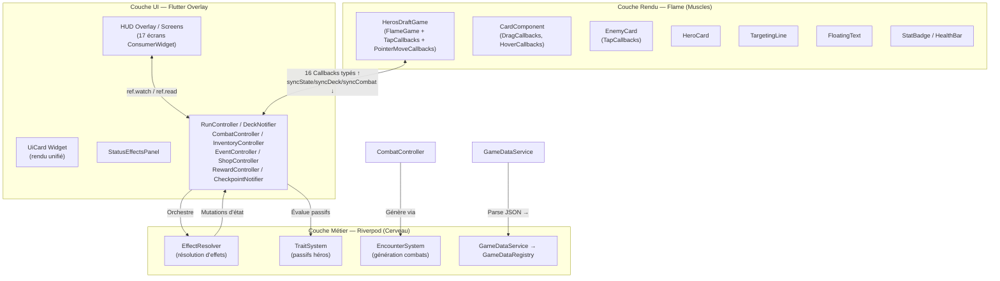

## 1. Architecture Globale — Séparation Triangulaire

Le projet **Hero's Draft** repose sur une **séparation triangulaire stricte des responsabilités (SOC)** entre trois couches distinctes : la **Logique Métier (Riverpod)**, le **Rendu Interactif (Flame Engine)** et l'**Interface Utilisateur HUD (Flutter Widgets)**.

### 1.1. Inventaire des fichiers source

| Couche | Répertoire | Fichiers clés | ~Lignes |
|:---|:---|:---|:---|
| Entrée | `lib/main.dart` | `HerosDraftApp` (ConsumerWidget, ProviderScope, MaterialApp) | ~40 |
| Rendu Flame | `lib/game/heros_draft_game.dart` | `HerosDraftGame` — orchestrateur Flame, s'appuie sur 4 systèmes de rendu | ~400 |
| Rendu Flame | `lib/game/components/` | `card_component.dart` (633), `effect_icon.dart`, `floating_text.dart`, `entities/` (6 fichiers dont `combat_entity.dart`), `visual_effects/` (5 fichiers dont `base_visual_effect.dart`, `targeting_line.dart`), `widgets/` (7 fichiers dont `card_renderer.dart`, `card_interaction_handler.dart`) | ~4900 |
| Constantes | `lib/game/game_constants.dart` | `GameConstants` — z-index, tailles, badges, délais de combat, config textes flottants | ~100 |
| Contrôleurs | `lib/game/controllers/` | `run_controller.dart` et `combat_controller.dart` (façades), `deck_controller.dart`, `inventory_controller.dart`, `event_controller.dart`, `shop_controller.dart`, `reward_controller.dart`, `checkpoint_controller.dart` (nouveau v3.2.0 — `checkpointProvider`/`autosaveOrchestratorProvider`), plus les sous-dossiers `run/` (3 fichiers, `run_persistence_manager.dart` supprimé v3.2.0) et `combat/` (2 fichiers) | ~2900 |
| Systèmes | `lib/game/systems/` | `encounter_system.dart`, `trait_system.dart`, et les 4 systèmes Flame (`state_sync_system.dart`, `card_animation_system.dart`, `combat_visual_system.dart`, `layout_system.dart`) | ~800 |
| Services (jeu) | `lib/game/services/` | `effect_resolver.dart` (245), `effects/` (interface + 6 stratégies, 208 l.), `combat_debug_logger.dart` (125), `damage_pipeline.dart` (58), `level_up_reward_service.dart`, `map_path_highlighter.dart` | ~930 |
| Services (app) | `lib/services/` | `game_data_service.dart`, `game_data_loader.dart` (chargeur générique, P-48), `map_generator_service.dart`, `map/` (4 sous-services), `save_service.dart` (`SaveService`, autosave à checkpoint carte), `settings_service.dart`, `audio/` | ~680 |
| Modèles Data | `lib/models/data/` | 11 fichiers (`card_data.dart`, `enemy_data.dart`, `hero_data.dart`, `audio_data.dart`, `event_data.dart`, `passive_data.dart`, `relic_data.dart`, `forge_upgrade_data.dart`, `game_data_registry.dart`, `hero_skills_link.dart`, `model_extensions.dart`) | ~925 |
| Modèles Runtime | `lib/models/` | 12 fichiers (instances, états, status, dont `missing_save_item.dart` — voir §2.1.bis) | ~855 |
| UI Écrans | `lib/ui/screens/` | 17 écrans (`home_screen`, `splash_screen`, `class_selection_screen`, `starter_deck_draft_screen`, `map_screen`, `game_screen`, `shop_screen`, `event_screen`, `rest_screen`, `rest_card_selection_screen`, `draft_screen`, `boss_card_draft_screen`, `card_dictionary_screen`, `forge_fusion_screen`, `deck_screen`, `relic_exchange_screen`, `patch_notes_screen`) | ~6850 |
| UI Widgets | `lib/ui/widgets/` | 46 fichiers : `ui_card.dart` + sous-dossiers `ui_card/` (5), `hud/` (dont `status_effects_panel.dart`), `draft/`, `forge/`, `map/`, `relic_carousel/` | ~8400 |
| Système Tutoriel | `lib/tutorial/` | `tutorial_engine.dart`, `tutorial_screen.dart`, widgets d'étapes (13 fichiers), soit 18 fichiers au total | ~5150 |
| **Total estimé** | | **~169 fichiers** | **~36 300** |
