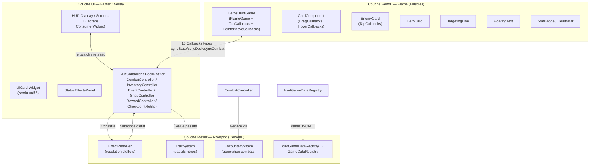

## 1. Architecture Globale — Séparation Triangulaire

Le projet **Hero's Draft** repose sur une **séparation triangulaire stricte des responsabilités (SOC)** entre trois couches distinctes : la **Logique Métier (Riverpod)**, le **Rendu Interactif (Flame Engine)** et l'**Interface Utilisateur HUD (Flutter Widgets)**.

### 1.1. Inventaire des fichiers source

**Vérifié le 2026-09-05** — chaque ligne re-mesurée par `find <rep> -name '*.dart' | wc -l` et `-exec cat {} + | wc -l`. Le total est celui de `_memory_bank/progress.md` §Métriques ; la somme des lignes en diffère de 3, artefact des fichiers sans saut de ligne final concaténés séparément.

| Couche | Répertoire | Fichiers clés | Fichiers | Lignes |
|:---|:---|:---|---:|---:|
| Entrée | `lib/main.dart` | `HerosDraftApp` (ConsumerWidget, ProviderScope, MaterialApp) | 1 | 67 |
| Rendu Flame | `lib/game/heros_draft_game.dart` | `HerosDraftGame` — orchestrateur Flame, s'appuie sur 4 systèmes de rendu | 1 | 366 |
| Rendu Flame | `lib/game/components/` | `card_component.dart`, `effect_icon.dart`, `floating_text.dart`, `entities/`, `visual_effects/`, `widgets/` | 21 | 5015 |
| Constantes | `lib/game/game_constants.dart` | `GameConstants` — z-index, tailles, badges, délais de combat, config textes flottants | 1 | 102 |
| Contrôleurs | `lib/game/controllers/` | `run_controller.dart` et `combat_controller.dart` (façades), `deck_controller.dart`, `inventory_controller.dart`, `event_controller.dart`, `shop_controller.dart`, `reward_controller.dart`, `checkpoint_controller.dart`, plus `run/` (3) et `combat/` (2) | 13 | 2958 |
| Systèmes | `lib/game/systems/` | `encounter_system.dart`, `trait_system.dart`, et les 4 systèmes Flame | 6 | 805 |
| Services (jeu) | `lib/game/services/` | `effect_resolver.dart`, `effects/` (interface + 6 stratégies), `combat_debug_logger.dart`, `damage_pipeline.dart`, `level_up_reward_service.dart`, `map_path_highlighter.dart` | 7 | 969 |
| Services (app) | `lib/services/` | `game_data_service.dart`, `game_data_loader.dart` (chargeur générique, P-48), `map_generator_service.dart`, `map/`, `save_service.dart`, `settings_service.dart`, `audio/` | 19 | 1869 |
| Modèles Data | `lib/models/data/` | `card_data.dart`, `enemy_data.dart`, `hero_data.dart`, `audio_data.dart`, `event_data.dart`, `passive_data.dart`, `relic_data.dart`, `forge_upgrade_data.dart`, `game_data_registry.dart`, `hero_skills_link.dart`, `model_extensions.dart` | 11 | 1001 |
| Modèles Runtime | `lib/models/` | instances, états, status, dont `missing_save_item.dart` — voir §2.1.bis | 11 | 826 |
| UI Écrans | `lib/ui/screens/` | 18 écrans, `settings_screen.dart` inclus (P-03) | 18 | 7067 |
| UI Widgets | `lib/ui/widgets/` | `ui_card.dart` + `ui_card/`, `hud/`, `draft/`, `forge/`, `map/`, `relic_carousel/` | 47 | 8524 |
| UI Thème | `lib/ui/theme/` | `app_theme.dart`, `AppColors`, `AppSpacing` | 4 | 333 |
| Système Tutoriel | `lib/tutorial/` | `tutorial_engine.dart`, `tutorial_screen.dart`, `tutorial_loader.dart`, `widgets/` | 22 | 6231 |
| Localisation | `lib/l10n/` | ARB générés — `app_localizations*.dart` | 3 | 3150 |
| **Total** | | | **185** | **39 280** |
