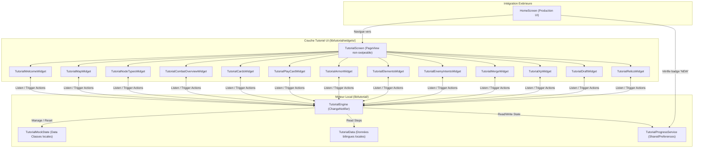

## 9. Architecture du Système de Tutoriel Autonome (Tutorial System Technical Design)

Le système de tutoriel a été conçu avec un objectif d'**isolation totale** pour garantir qu'aucune instabilité ou modification de la logique du jeu de base ne puisse survenir à la suite d'ajouts dans le tutoriel.

### 9.1. Moteur et Gestion d'État

- **`TutorialEngine` (`ChangeNotifier`)** : Le cœur logique. Il maintient l'index de l'étape courante, fournit les transitions (`nextStep()`, `previousStep()`), et gère un `TutorialMockState` encapsulant l'état du combat/jeu simulé.
- **`TutorialMockState`** : Contient :
  - `heroHp`, `maxHeroHp` (80/80)
  - `heroMana`, `maxHeroMana` (3/3)
  - `heroArmor`
  - `enemy` (`TutorialEnemy?`)
  - `hand`, `deck`, `discardPile` (`List<TutorialCard>`)
- **Isolation d'État** : À chaque changement d'étape, l'engine exécute `resetMockState()` pour configurer l'état spécifique nécessaire à l'étape suivante (ex: spawn d'un Slime de 20 PV à l'étape 6, distribution de cartes spécifiques, etc.).

### 9.2. Modèles de Données et i18n Découplée

- **`TutorialCard`** : Classe modèle simplifiée contenant les attributs essentiels pour l'affichage (cost, damage, armor, statusId, isExhaust). Elle n'importe pas les structures de données lourdes de production.
- **`TutorialEnemy`** : Modèle simplifié d'ennemi détenant son HP, maxHP, et une intention simulée.
- **`TutorialData`** : Répertoire statique contenant les 13 étapes du tutoriel (`TutorialStepData`). Chaque étape est définie par un titre et un contenu textuel bilingues (`titleEn`/`titleFr`, `bodyEn`/`bodyFr`), traduits à la volée selon la locale active sans passer par `AppLocalizations`.

### 9.3. Persistance et Intégration

- **`TutorialProgressService`** : Fournit une interface asynchrone statique pour lire et écrire le drapeau `tutorial_completed` dans les SharedPreferences de l'appareil.
- **Badge 'NEW' (Notification Visuelle)** : L'écran `HomeScreen` utilise un `FutureBuilder` appelant `TutorialProgressService.isCompleted()` pour conditionner l'affichage du badge d'alerte rouge et pulsant "NEW" sur le bouton d'accès au tutoriel.

### 9.4. Poli Visuel de Draft (Hover & Glow Effects)

La classe `TutorialDraftWidget` sert d'implémentation de référence pour le feedback de draft, s'appuyant sur :
- **`MouseRegion`** : Détecte les entrées/sorties de souris pour mettre à jour l'index survolé.
- **`AnimatedScale`** : Applique une transition d'échelle fluide de `1.05x` sur le survol (durée de 200ms).
- **`AnimatedContainer`** : Met à jour la décoration de bordure et de l'ombre en cas de sélection. Si la carte est sélectionnée, elle scale à `1.12x` et applique un `BoxShadow` doré intense (`Colors.amber` avec un rayon de flou de 16px).

### 9.5. Refonte Responsive et Ciblage Avancé

Dans le cadre des améliorations de la branche `feat/tutorial`, le module de tutoriel a été refactorisé :
- **Application des Patrons de Responsivité** : Les 13 widgets d'étapes de tutoriel ont été convertis pour utiliser les patrons unifiés de responsivité Flutter UI (FittedBox Canvas pour les illustrations, Wrap pour la légende de reliques, grille compacte 3x2 pour les types de nœuds, et défilement adaptatif avec des scrollviews).
- **Ciblage Interactif en Deux Phases** : À l'étape 6 (`TutorialPlayCardWidget`), la logique de jeu de cartes impose au joueur de réaliser successivement une action offensive (glisser/déposer la carte d'attaque sur le Slime) puis une action défensive (glisser la carte d'armure sur le Héros). Ce comportement est géré via une machine à états simple (`_targetingPhase`) intégrée au widget.
- **Info-bulles (Tooltips) de Cartes (Étape 5)** : Le widget `TutorialCardsWidget` utilise de vrais rendus de cartes vectorielles sur Canvas et affiche des infobulles descriptives et localisées (`TutorialTooltip`) lors du survol ou du toucher, évitant ainsi d'encombrer le layout principal tout en clarifiant les règles.
