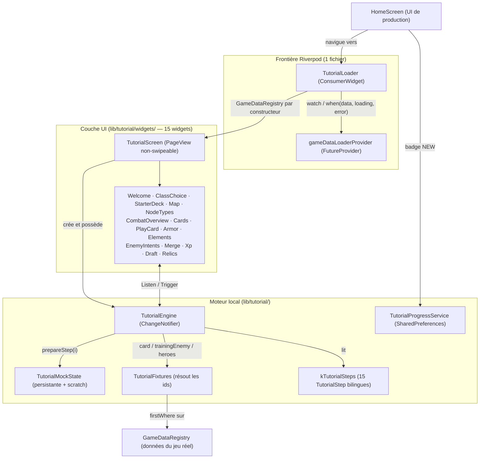

## 9. Architecture du Système de Tutoriel Autonome (Tutorial System Technical Design)

Le tutoriel est un module autonome sous `lib/tutorial/` : il enseigne la boucle de jeu sans
jamais pouvoir toucher une run en cours. Son autonomie porte sur l'**état**, jamais sur la
**donnée** — la distinction est posée par
[ADR-081](../_adr/ADR-081-amendement-autonomie-tutoriel-zero-provider-etat.md), qui amende
[ADR-019](../_adr/ADR-019-systeme-de-tutoriel-autonome-isolant-la-boucle-pri.md). La règle
tient en une phrase : *le tutoriel n'invente jamais une donnée ni un visuel que le jeu sait
déjà produire.* Règles de parcours et contenu pédagogique :
[`_rules/08-00`](../_rules/08-00-systeme-de-tutoriel-autonome.md).

> [!IMPORTANT]
> **Zéro provider d'état, un seul provider de données.** Les neuf providers de run
> (`runProvider`, `deckProvider`, `combatProvider`, `inventoryProvider`, `skillProvider`,
> `rewardProvider`, `shopProvider`, `eventProvider`, `checkpointProvider`) sont interdits
> dans tout `lib/tutorial/`. `gameDataLoaderProvider`, qui ne lit que de la donnée
> immuable, est autorisé **en un point unique** : `tutorial_loader.dart`. Ce n'est pas une
> affaire de discipline mais de test : `test/tutorial/tutorial_isolation_test.dart` balaie
> le dossier et échoue sur tout import de Riverpod hors du loader, comme sur toute mention
> des neuf symboles interdits.

### 9.1. Frontière Riverpod — `TutorialLoader`

`TutorialLoader` est un `ConsumerWidget`, et le **seul** fichier du dossier à importer
`flutter_riverpod`. Il résout le `FutureProvider`, rend lui-même les états `loading` et
`error` — l'erreur offre un retour plutôt que d'enfermer le joueur dans le tutoriel — puis
passe le `GameDataRegistry` à `TutorialScreen` **par constructeur**. Tout ce qui est en aval
est du Flutter ordinaire : ni `ref`, ni `ProviderScope`, ni `ConsumerState`.

### 9.2. Moteur — `TutorialEngine` et l'état en deux tranches

`TutorialEngine extends ChangeNotifier` détient l'index courant, les transitions
(`nextStep()`, `prevStep()`) et un `TutorialMockState`. Cet état est coupé en deux, et cette
coupure est ce qui rend le parcours cohérent d'une étape à l'autre :

| Tranche | Champs | Durée de vie |
|:---|:---|:---|
| **Persistante** | `chosenHero`, `activePassive`, `masterDeck` | Écrite par les étapes 02 et 03, conservée jusqu'à la fin |
| **Scratch** | `heroStats`, `hand`, `enemy`, `playerXp`, `playerLevel`, `pendingDrafts`, `hasDrafted` | Remise à zéro par `resetScratch()` à chaque changement d'étape |

`prepareStep(int index)` branche sur le **type** de l'étape, jamais sur son indice : insérer
une étape ne décale pas le câblage. `baseStatsForHero()` dérive les statistiques de départ de
la classe choisie (`maxHp`, `maxMana`, `armorMastery`, `luck`) et ne retombe sur les valeurs
de repli 80 PV / 3 mana que tant que l'étape 02 n'a pas été franchie.

> [!NOTE]
> **Tout drapeau d'étape vit dans `TutorialMockState`, pas dans le moteur.** Trois fois
> pendant P-45, un drapeau porté par `TutorialEngine` a été oublié à la réinitialisation et
> a bloqué le joueur. Le placer dans la tranche scratch fait que `resetScratch()` le remet à
> zéro par construction, sans qu'on ait à y penser.

### 9.3. Fixtures — seuls les identifiants sont écrits en dur

`TutorialFixtureIds` ne liste que des **identifiants** (`strike_basic`, `defend_basic`,
`fireball`, `slime`, `gobelin`, `iron_talisman`, les trois classes). `TutorialFixtures` les
résout contre le `GameDataRegistry` par `firstWhere` **sans `orElse`** : renommer une carte
dans `assets/data/` fait échouer le tutoriel bruyamment, au lieu de le laisser afficher une
valeur périmée. Le tutoriel manipule ensuite les vrais modèles du jeu — `CardInstance`,
`EnemyInstance`, `EntityStats` — et fait passer ses dégâts par `DamagePipeline`.

Les POJOs `TutorialCard` et `TutorialEnemy`, qui recopiaient ces données à la main, sont
supprimés : c'est leur dérive silencieuse qui avait produit les 50 écarts corrigés par P-45.

### 9.4. Parcours — 15 étapes et verrou d'amont

`kTutorialSteps` porte 15 `TutorialStep` typés par `TutorialStepType` (`welcome`,
`classChoice`, `starterDeck`, `map`, `nodeTypes`, `combatOverview`, `cards`, `playCard`,
`armorDamage`, `elements`, `enemies`, `merge`, `xp`, `draft`, `relics`). Les deux premières
étapes interactives — choix de classe, draft du deck de départ — alimentent la tranche
persistante dont dépend tout l'aval.

D'où le **verrou d'amont** : une fois l'indice 3 (« La Carte du Monde ») atteint,
`_upstreamLocked` passe à `true` et `minReachableStep` remonte de 0 à 3. Revenir en deçà
invaliderait la classe et le deck déjà consommés en aval. Le test de bord est `>=` et non
`>` : atteindre le plancher suffit à armer le verrou.

### 9.5. Textes et i18n découplée

`TutorialData` porte les 15 étapes en paires bilingues (`titleFr`/`titleEn`,
`bodyFr`/`bodyEn`), traduites à la volée selon la locale active **sans passer par
`AppLocalizations`** — le module reste greffable sans toucher aux ARB. Le corps des étapes
accepte `**gras**`, rendu par `parseBoldSegments` + `Text.rich` dans `TutorialScreen`. En
revanche les libellés de jeu (raretés, récompenses de draft, types de nœuds) ne sont pas
réécrits : ils sont partagés avec les écrans de production.

### 9.6. Interaction, poli visuel et persistance

- **Ciblage en deux phases** (`TutorialPlayCardWidget`) : le joueur doit enchaîner une action
  offensive puis une action défensive. Chaque phase ne filtre que la carte qu'elle sait
  présente — l'attaque en phase 1, la compétence en phase 2, l'attaque ayant alors quitté la
  main. Une carte à la fois offensive et défensive court-circuiterait la leçon, et est donc
  écartée du filtre.
- **Draft** (`TutorialDraftWidget`) : `MouseRegion` + `AnimatedScale` + `AnimatedContainer`,
  survol à `1.05x`, sélection à `1.12x` avec lueur ambre.
- **Info-bulles** (`TutorialCardsWidget`) : vrais rendus vectoriels sur Canvas, et
  `TutorialTooltip` localisée au survol ou au toucher.
- **Persistance** : `TutorialProgressService` lit et écrit le drapeau `tutorial_completed` en
  `SharedPreferences` ; `HomeScreen` s'en sert via un `FutureBuilder` pour conditionner le
  badge rouge pulsant « NEW ».
