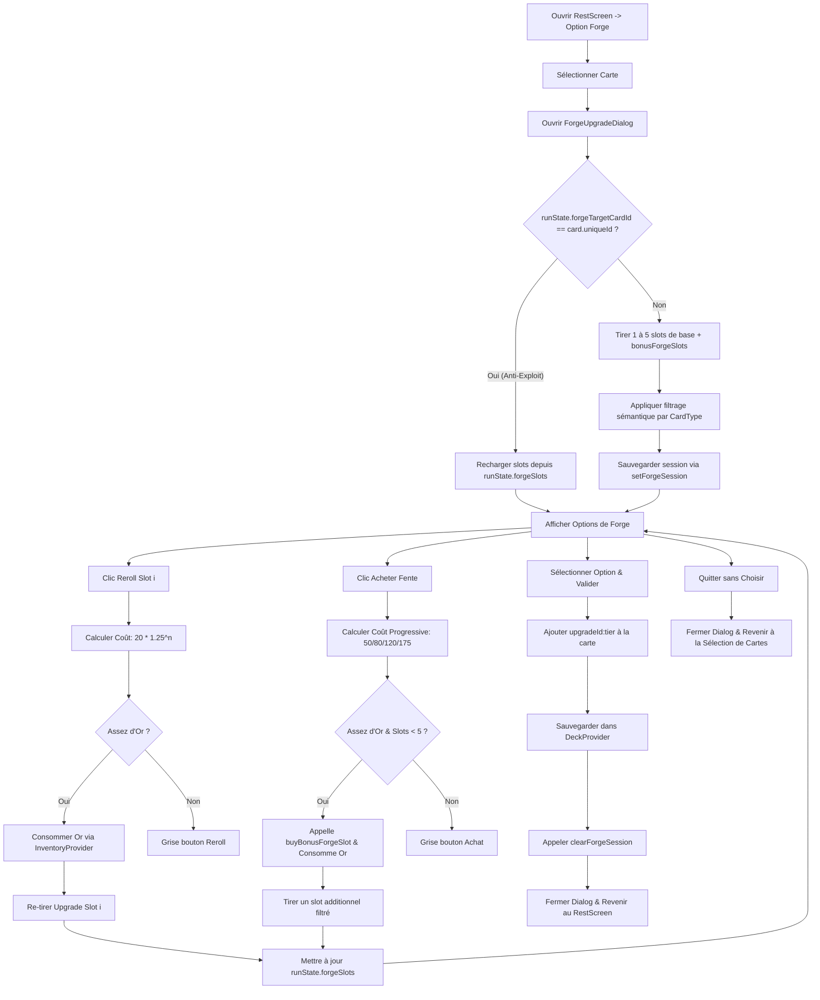
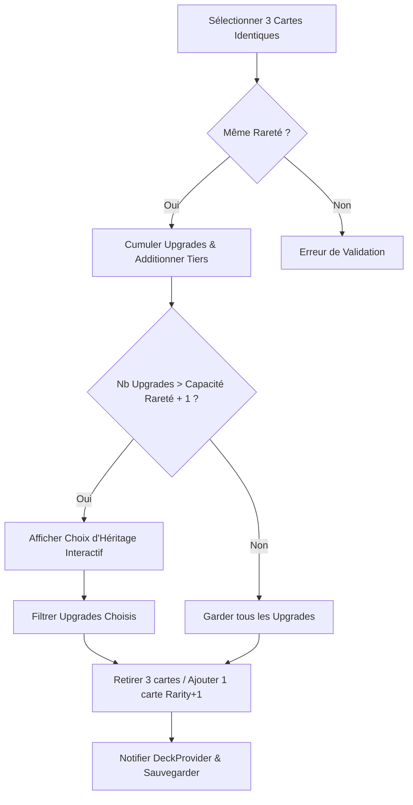

## 10. Architecture du Système de Forge et de Fusion de Cartes (Forge & Card Merge Technical Design)

Le système de Forge et de Fusion offre une progression non-linéaire des cartes en séparant proprement la logique métier (calculs de probabilités, relances et consolidation) du rendu visuel de l'interface utilisateur.

### 10.1. Modélisation et Résolution de la Forge (`ForgeUpgradeDialog` v2)

Le dialogue de forge `ForgeUpgradeDialog` (affiché via `RestScreen`) a été refactorisé sous forme d'écran complet pour intégrer une persistance anti-exploit, un filtrage sémantique des upgrades et l'achat progressif de slots supplémentaires :

1. **Représentation et Persistance de Session (`RunState`)** :
   Les choix générés pour une carte et les achats de slots sont persistés de manière immuable au niveau du state global Riverpod :
   - `RunState.forgeSlots` (List\<String\>) : Liste des upgrades générés pour la session active sous le format `"upgradeId:tier"`.
   - `RunState.forgeTargetCardId` (String?) : Identifiant unique de la carte concernée par la forge active.
   - `RunState.bonusForgeSlots` (int) : Nombre de fentes bonus achetées (initialement 0, capé à 4).
   - `RunNotifier.setForgeSession(String cardId, List<String> slots)` : Persiste la session en cours.
   - `RunNotifier.clearForgeSession()` : Réinitialise la session.
   - `RunNotifier.buyBonusForgeSlot()` : Gère l'achat progressif (dépense $50 \rightarrow 80 \rightarrow 120 \rightarrow 175$ Or, incrémente `bonusForgeSlots`, retourne un booléen de statut).

2. **Logique d'Anti-Exploit (`initState`)** :
   Pour éviter que le joueur ne réinitialise les options proposées gratuitement en fermant et rouvrant la forge, le cycle de chargement effectue une vérification :
   - Au lancement du dialogue, si `runState.forgeTargetCardId == card.uniqueId`, le widget charge les fentes stockées dans `runState.forgeSlots` sans effectuer de nouveau tirage.
   - Sinon, le widget génère une nouvelle liste d'upgrades (avec $1\text{ à }5$ slots de base + `bonusForgeSlots` slots déjà achetés) et appelle immédiatement `RunNotifier.setForgeSession()` pour verrouiller le tirage.
   - L'effacement de la session (`clearForgeSession()`) n'est déclenché que lors d'un choix d'upgrade réussi, ou lors de la sortie définitive du camp de repos via `RestScreen._leave()`.
   - **Navigation d'Annulation** : Si le joueur ferme le dialogue de forge sans effectuer de choix, il retourne à l'écran de sélection des cartes du repos (pour lui permettre de choisir une autre carte à forger) au lieu d'être renvoyé directement au menu principal du feu de camp.

3. **Filtrage Intelligent des Upgrades par Type de Carte** :
   Pour éliminer les upgrades incohérents, la méthode `_getEligibleUpgradesForPool()` filtre le catalogue d'upgrades :
   - `CardType.skill` : Exclut tous les upgrades offensifs physiques (`sharp`) ou élémentaires (`burning`, `freezing`, `shocking`).
   - `CardType.power` : Filtre le pool pour ne conserver que les upgrades utilitaires (`eco`, `quick`, `enduring`).
   - `CardType.attack` : Donne accès au pool complet sans restriction.

4. **Achat de Fentes Progressives (Buy Slots)** :
   Le bouton d'achat en bas du `ListView` permet d'acquérir de nouvelles fentes d'upgrades en cours de session :
   - Le coût progressif ($50 \rightarrow 80 \rightarrow 120 \rightarrow 175$ Or) est lu depuis `bonusForgeSlots`.
   - En cas d'achat valide (or suffisant et `bonusForgeSlots < 4`), le widget appelle `buyBonusForgeSlot()`, tire une nouvelle option filtrée, et l'ajoute dynamiquement à la liste active via `setForgeSession()`.

5. **Design Plein Écran Responsive** :
   L'interface utilise `Dialog.fullscreen` pour s'adapter à toutes les résolutions :
   - **Desktop Layout (`Row`)** : Colonne de gauche affichant le visuel de la carte sélectionnée avec ses étoiles d'upgrade dorées. Colonne de droite affichant une liste scrollable (`ListView`) des slots d'upgrades disposés verticalement.
   - **Mobile Layout (`Column`)** : Empilement vertical fluide avec le visuel de la carte en haut et la liste scrollable des slots en bas, évitant tout overflow.

### 10.2. Fusion Interactive et Consolidation des Upgrades (`DeckNotifier.mergeCards`)

La fusion interactive permet au joueur de fusionner 3 exemplaires d'une carte à la même rareté vers la rareté supérieure tout en préservant leurs améliorations :

1. **Validation 3→1** :
   La méthode `mergeCards` de `DeckNotifier` reçoit les identifiants uniques des 3 cartes sélectionnées. Elle valide que ces 3 cartes existent dans le deck, partagent le même `baseCardId` et ont la même rareté courante.

2. **Consolidation des Upgrades** :
   Le système rassemble toutes les améliorations de forge des 3 cartes consommées. Si plusieurs cartes possèdent la même amélioration (même ID d'upgrade), leurs Tiers sont cumulés (ex: `sharp:1` + `sharp:2` = `sharp:3`). Les améliorations uniques sont simplement copiées.

3. **Capacité Limite par Rareté** :
   Chaque palier de rareté possède une capacité d'amélioration maximale :
   $$\text{Capacité} = baseMaxForgeUpgrades + rarityIndex$$
   - Commune ($rarityIndex=0$) : 2 upgrades max.
   - Légendaire ($rarityIndex=4$) : 6 upgrades max.
   
   Si la liste des améliorations consolidées dépasse la capacité de la rareté supérieure ciblée par la fusion, l'interface utilisateur impose un choix d'héritage interactif pour sélectionner précisément les upgrades à conserver.

4. **Modificateurs de Rareté** :
   Lors de la résolution d'une carte en combat (`EffectResolver`), les valeurs de base (dégâts, blocage) sont multipliées par un coefficient lié à sa rareté active, remplaçant la progression par niveau numérique. Les upgrades de forge (ex. ajouter +X dégâts par Tier de `sharp`) s'additionnent ensuite au résultat mis à l'échelle.

