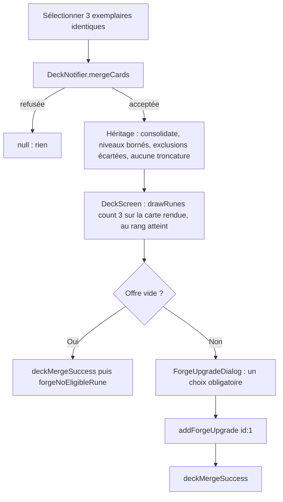

## 10. Architecture du Système de Runes et de Fusion de Cartes (Runes & Card Merge Technical Design)

Le système de runes sépare la logique — fonctions pures de `ForgeRuneRules` et applicateur
`EffectiveCard` —, l'état — `DeckNotifier`, `GoldManager` — et le rendu des écrans. Depuis le lot
E2 de P-43 ([ADR-106](../_adr/ADR-106-fusion-egale-forge.md), branche de la vague 2, en attente du
propriétaire), **la fusion donne la rune, le feu l'affûte, le Puits l'échange** ; la forge du feu,
sa session dans `RunState`, la capacité de runes d'une carte, `pools` et `stackable` ont disparu.
Règles de jeu : [`_rules/03-8`](../_rules/03-8-systeme-de-forge-forge-de-fusion.md).

> [!IMPORTANT]
> **Une règle, une fonction pure.** `lib/game/services/forge_rune_rules.dart` porte le prédicat
> (`isEligible`), le tirage (`drawRunes`), l'héritage (`consolidate`), l'affûtage (`sharpenCost`,
> `canSharpen`, `hasSharpenableRune`, `replaceRune`) et le Puits (`wellCost`, `wellLevel`,
> `wellOptions`). Aucune ne lit ni n'écrit d'état : les écrans et le tutoriel les appellent sur
> leurs entrées ; l'état ne change que par `DeckNotifier` (`mergeCards`, `addForgeUpgrade`,
> `setForgeUpgrades`) et par `GoldManager` pour ce qui se paie. **Un seul analyseur de niveau**,
> au modèle : `ForgeUpgradeData.parseRef` lit une référence `id:niveau`, `levelsOf` additionne les
> niveaux par id ; une référence mal formée ou de niveau nul est ignorée partout —
> [ADR-094](../_adr/ADR-094-echelle-de-rarete-explicite-et-runes-non-cumulables.md) D5, amendé par
> [ADR-105](../_adr/ADR-105-moteur-de-runes-data-driven.md) puis ADR-106.

### 10.1. Le prédicat et le tirage

1. **`ForgeRuneRules.isEligible(rune, carte, catalogue)`** — le prédicat unique, sur le modèle de
   `CardData.isOfferableTo`. Il lit les champs du fichier de rune : `eligibleCardTypes`,
   `eligibleEffects` et `excludesEffects` sur les effets **propres** de la carte, `requiresExhaust`,
   `requiresMinCost` sur le **coût courant calculé par l'applicateur sur le catalogue reçu** —
   jamais sur le registre global, le tutoriel jugeant sur le sien (A15) —, `excludesRunes` dans les
   deux sens, **`minFusionRank` ≤ `card.rarity.fusionRank`**, et **la carte ne porte pas déjà la
   rune** (D3), dont la condition du plafond d'E1 est devenue un cas. **Aucun `case` par id ni par
   type de carte** : la règle est un champ.
2. **`ForgeRuneRules.drawRunes(carte, catalogue, rng, count:)`** — jusqu'à `count` ids distincts,
   pondérés par `weight`, sans remise, parmi les runes que le prédicat accepte ; moins s'il y en a
   moins, aucun s'il n'y en a pas (D65) ; un poids nul ne pèse rien, mais des runes éligibles qui ne
   pèsent rien se tirent encore, à parts égales. **Trois lecteurs** : l'offre de fusion
   (`count: 3`, sur la carte fusionnée au rang atteint) ; les pré-forgées de la boutique
   (`count: 1` par rune, sur la carte avec les runes déjà posées —
   [`_patterns/02-5`](02-5-shopcontroller.md)) ; l'étape de fusion du tutoriel, sur son registre.
3. **La borne `ForgeUpgradeData.boundLevel`** (D72) sert les quatre endroits qui écrivent un
   niveau : `consolidate`, le niveau tiré des pré-forgées (80 · 15 · 5 %), `canSharpen` et
   `wellLevel`. Le prédicat ne la lit plus.

### 10.2. La fusion de cartes (`DeckNotifier.mergeCards`, `DeckScreen`)

1. **Validation 3→1** : `mergeCards(selectedIds)` exige trois exemplaires existants d'une même
   carte à une même rareté qui a une suivante (`CardRarity.next`, nul pour `legendary` et
   `unique`), les remplace par une carte de la rareté suivante et **la rend** — `null` si la fusion
   est refusée.
2. **L'héritage se calcule dedans, une fois** : `ForgeRuneRules.consolidate` sur les runes des
   trois exemplaires — niveaux de même id additionnés, bornés par `boundLevel` (trois `eco:1` →
   `eco:1`), une rune exclue par une rune **gardée avant elle** écartée, la première arrivée gardée
   ([ADR-105](../_adr/ADR-105-moteur-de-runes-data-driven.md) D10). **Aucune troncature** : la
   capacité et le dialogue d'héritage ont disparu (D13).
3. **L'offre** est tirée par l'écran, pas par le Notifier : `DeckScreen._confirmMerge` reçoit le
   `context` stable de l'écran — la case de la grille qui a lancé la fusion peut disparaître pendant
   le dialogue —, appelle `drawRunes(carte, registre.forgeUpgrades, Random(), count: 3)` sur la carte
   rendue, puis ouvre `ForgeUpgradeDialog(card, offer)`. Le dialogue montre `ForgeCardPreview` et
   une `ForgeSlotRow` par rune offerte, au niveau 1 ; il **ne se ferme que par un choix** (ni
   annulation, ni relance, ni fente achetée), que `addForgeUpgrade` écrit `id:1`. Offre vide : pas
   de dialogue ; `deckMergeSuccess`, puis `forgeNoEligibleRune`. Le gabarit plein écran d'ADR-039 D4
   reste.

```mermaid
graph TD
    SelectMerge[Sélectionner 3 exemplaires identiques] --> Merge[DeckNotifier.mergeCards]
    Merge -- refusée --> Stop[null : rien]
    Merge -- acceptée --> Consolidate[Héritage : consolidate, niveaux bornés, exclusions écartées, aucune troncature]
    Consolidate --> Draw[DeckScreen : drawRunes count 3 sur la carte rendue, au rang atteint]
    Draw --> Empty{Offre vide ?}
    Empty -- Oui --> Notify[deckMergeSuccess puis forgeNoEligibleRune]
    Empty -- Non --> Dialog[ForgeUpgradeDialog : un choix obligatoire]
    Dialog --> Add[addForgeUpgrade id:1]
    Add --> Success[deckMergeSuccess]
```

### 10.3. L'affûtage et le Puits (`GoldManager`)

Les deux services payants vivent dans `GoldManager` (`lib/game/controllers/run/gold_manager.dart`),
exposés par `RunController.sharpenRune` et `RunController.exchangeRune` : **« payer et écrire, ou
rien »** est de la logique métier, que l'écran ne porte pas (A16). Chacun relit la carte dans le
deck, refuse sans rien toucher, puis dépense par `InventoryController.spendGold` et réécrit la
référence **à sa place** par `ForgeRuneRules.replaceRune` et `DeckNotifier.setForgeUpgrades`.

| Opération | Refuse si | Coût | Écrit |
|:---|:---|:---|:---|
| `sharpenRune(cardId, runeId)` | carte ou rune absente, rune hors registre, `!canSharpen`, or insuffisant | `sharpenCost(n) = 50 × n` | `id:n` → `id:n+1` |
| `exchangeRune(cardId, givenId, receivedId)` | carte ou rune donnée absente, rune reçue hors de `wellOptions`, or insuffisant | `wellCost(n) = 50 × n` (base distincte) | `givenId:n` → `receivedId:wellLevel(reçue, n)` |

- **`wellOptions(carte, givenId, catalogue)`** juge le prédicat sur une copie de la carte **sans**
  la rune donnée, et exclut celle-ci : une exclusion que l'échange défait ne refuse rien.
  `wellLevel = boundLevel((2n + 1) ~/ 3)` — les deux tiers arrondis, au moins 1 dès n = 1.
- **L'état de visite reste local aux écrans** — `_actionTaken` au feu, `_exchanged` au Puits — : un
  état de déroulé d'écran, qui ne survit pas à l'écran et n'est partagé avec personne (A4, A5).
  Une action faite, le retour système appelle le même `_leave` que le bouton de sortie, qui résout
  le nœud (`canPop` et `onPopInvokedWithResult` de `ScreenScaffold`).
- **Les écrans** : `RestScreen` → `RestCardSelectionScreen` en mode affûtage (refus d'une carte
  sans rune affûtable, `hasSharpenableRune`) → `SharpenRuneDialog` ; le Puits réécrit
  `ForgeFusionScreen` en place — une colonne défilante : les cartes, la rune à donner, les
  remplaçantes. `MapNodeType.forgeFusion`, `ForgeFusionScreen` et `ForgeUpgradeDialog` gardent leur
  nom (A17).

### 10.4. La carte telle qu'elle se joue : l'applicateur `EffectiveCard`

`lib/models/effective_card.dart` ([ADR-105](../_adr/ADR-105-moteur-de-runes-data-driven.md)) : une
fonction pure, `EffectiveCard.apply(data, rarity, paires (delta, niveau))`, seul endroit où la
rareté et les runes se calculent — pour `EffectResolver.resolveCard`, les rendus de carte (Flame et
Flutter : pastilles, descriptions, infobulles, badge), le prédicat et le tutoriel.
`CardInstance.effective` l'appelle sur le catalogue du registre ; `UiCard` porte la `CardData` et la
`CardRarity`.

1. **Les effets propres** prennent leur valeur à la rareté : `CardRarity.scaleValue` (G1 : au moins
   +1 par palier), sauf `draw` et `gain_mana`, gelés (G2). `effects` garde la longueur et l'ordre de
   `CardData.effects`.
2. **Les deltas** des runes (`CardDelta`, **six sortes** depuis ADR-106) :
   - `percentBonus` ajoute `max((p × L × B + 50) ~/ 100, L)` à chaque effet propre visé, B pris à
     l'étape 1 — deux pourcentages sur un même effet s'additionnent, sans se composer ;
   - `addEffect` remplit `addedEffects`, résolus avant les effets propres par les stratégies du
     registre (ADR-061) ;
   - `removeExhaust` lève `removesExhaust` ; `addExhaust` lève `addsExhaust`, qui l'emporte ;
   - `reduceCost` retire `valuePerLevel × L` du coût de la donnée, plancher 0 → `cost`, que lit
     `CardInstance.currentCost` ;
   - `critBonus` s'additionne dans `critChanceBonus`, que `DamageEffectStrategy` passe à
     `DamagePipeline.calculate`.
3. **`CardInstance.exhaustsOnPlay`** = pouvoir ‖ `addsExhaust` ‖ (`isExhaust` ∧ ¬`removesExhaust`) :
   un seul prédicat, que lisent le moteur, le badge « Usage unique » (Flame et Flutter) et les
   particules d'épuisement (A13).

`EffectiveCard.runeDeltas` traduit les runes d'une carte en paires, exemplaires d'un même id
additionnés. C'est la couture que les évolutions de signature reprendront : leurs données se
traduiront en paires, sans lire une rune.
