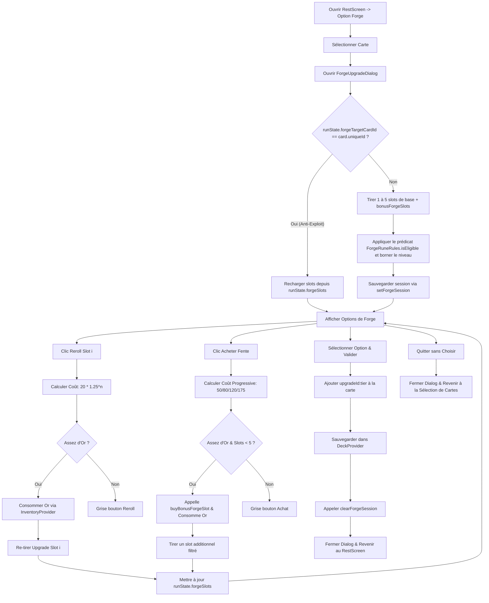
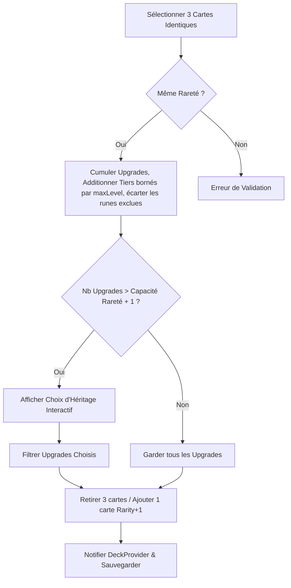

## 10. Architecture du Système de Forge et de Fusion de Cartes (Forge & Card Merge Technical Design)

Le système de Forge et de Fusion offre une progression non-linéaire des cartes en séparant proprement la logique métier (calculs de probabilités, relances et consolidation) du rendu visuel de l'interface utilisateur.

### 10.1. Modélisation et Résolution de la Forge (`ForgeUpgradeDialog` v2)

Le dialogue de forge `ForgeUpgradeDialog` (affiché via `RestScreen`) a été refactorisé sous forme d'écran complet pour intégrer une persistance anti-exploit, un filtrage sémantique des upgrades et l'achat progressif de slots supplémentaires :

1. **Représentation et Persistance de Session (`RunState`)** :
   Les choix générés pour une carte et les achats de slots sont persistés de manière immuable au niveau du state global Riverpod :
   - `RunState.forgeSlots` (List\<String\>) : Liste des upgrades générés pour la session active sous le format `"upgradeId:tier"`.
   - `RunState.forgeTargetCardId` (String?) : Identifiant unique de la carte concernée par la forge active.
   - `RunState.bonusForgeSlots` (int) : Nombre de fentes bonus achetées (initialement 0, capé à 4).
   - `RunNotifier.setForgeSession(String cardId, List<String> slots)` : Persiste la session en cours.
   - `RunNotifier.clearForgeSession()` : Réinitialise la session.
   - `RunNotifier.buyBonusForgeSlot()` : Gère l'achat progressif (dépense $50 \rightarrow 80 \rightarrow 120 \rightarrow 175$ Or, incrémente `bonusForgeSlots`, retourne un booléen de statut).

2. **Logique d'Anti-Exploit (`initState`)** :
   Pour éviter que le joueur ne réinitialise les options proposées gratuitement en fermant et rouvrant la forge, le cycle de chargement effectue une vérification :
   - Au lancement du dialogue, si `runState.forgeTargetCardId == card.uniqueId`, le widget charge les fentes stockées dans `runState.forgeSlots` sans effectuer de nouveau tirage.
   - Sinon, le widget génère une nouvelle liste d'upgrades (avec $1\text{ à }5$ slots de base + `bonusForgeSlots` slots déjà achetés) et appelle immédiatement `RunNotifier.setForgeSession()` pour verrouiller le tirage.
   - L'effacement de la session (`clearForgeSession()`) n'est déclenché que lors d'un choix d'upgrade réussi, ou lors de la sortie définitive du camp de repos via `RestScreen._leave()`.
   - **Navigation d'Annulation** : Si le joueur ferme le dialogue de forge sans effectuer de choix, il retourne à l'écran de sélection des cartes du repos (pour lui permettre de choisir une autre carte à forger) au lieu d'être renvoyé directement au menu principal du feu de camp.

3. **Éligibilité par un prédicat unique, lu dans la donnée** ([ADR-105](../_adr/ADR-105-moteur-de-runes-data-driven.md)) :
   `_getEligibleUpgradesForPool()` ne garde du catalogue que les runes dont `pools` contient le pool
   tiré **et** que `ForgeRuneRules.isEligible(rune, card, catalog)` accepte — fonction pure, sur le
   modèle de `CardData.isOfferableTo`, qui lit les champs du fichier de rune (`eligibleCardTypes`,
   `eligibleEffects` et `excludesEffects` sur les effets **propres** de la carte, `requiresExhaust`,
   `requiresMinCost` sur `currentCost`, `excludesRunes` dans les deux sens) et le plafond
   (`boundLevel(1, carried: …) ≥ 1`). **Aucun `case` par id ni par type de carte** : la règle est un
   champ. Ses trois lecteurs sont ce dialogue, la boutique (`ShopController._getEligibleUpgradesForPool`,
   sur la carte **avec les runes déjà tirées**) et `RestCardSelectionScreen`, qui **refuse une carte
   sans aucune rune éligible** avant d'ouvrir le dialogue (`forgeNoEligibleRune`). Le repli sur
   `'sharp'` des deux tirages a disparu : le dialogue rend `null` quand rien ne s'offre, la boutique
   pose une rune de moins.
   **Le niveau tiré est borné** — 1, 2 ou 3 à 80/15/5 % pour une rune cumulable, puis
   `boundLevel(niveau, carried: ce que la carte porte de cet id)` : la fente affiche ce que la carte
   recevra.

4. **Achat de Fentes Progressives (Buy Slots)** :
   Le bouton d'achat en bas du `ListView` permet d'acquérir de nouvelles fentes d'upgrades en cours de session :
   - Le coût progressif ($50 \rightarrow 80 \rightarrow 120 \rightarrow 175$ Or) est lu depuis `bonusForgeSlots`.
   - En cas d'achat valide (or suffisant et `bonusForgeSlots < 4`), le widget appelle `buyBonusForgeSlot()`, tire une nouvelle option filtrée, et l'ajoute dynamiquement à la liste active via `setForgeSession()`.

5. **Design Plein Écran Responsive** :
   L'interface utilise `Dialog.fullscreen` pour s'adapter à toutes les résolutions :
   - **Desktop Layout (`Row`)** : Colonne de gauche affichant le visuel de la carte sélectionnée avec ses étoiles d'upgrade dorées. Colonne de droite affichant une liste scrollable (`ListView`) des slots d'upgrades disposés verticalement.
   - **Mobile Layout (`Column`)** : Empilement vertical fluide avec le visuel de la carte en haut et la liste scrollable des slots en bas, évitant tout overflow.

```mermaid
graph TD
    Start[Ouvrir RestScreen -> Option Forge] --> SelectCard[Sélectionner Carte]
    SelectCard --> Dialog[Ouvrir ForgeUpgradeDialog]
    Dialog --> CheckExploit{runState.forgeTargetCardId == card.uniqueId ?}
    CheckExploit -- Oui (Anti-Exploit) --> LoadSession[Recharger slots depuis runState.forgeSlots]
    CheckExploit -- Non --> GenBase[Tirer 1 à 5 slots de base + bonusForgeSlots]
    GenBase --> FilterTypes[Appliquer le prédicat ForgeRuneRules.isEligible et borner le niveau]
    FilterTypes --> SaveSession[Sauvegarder session via setForgeSession]
    LoadSession --> Loop[Afficher Options de Forge]
    SaveSession --> Loop
    Loop --> Reroll[Clic Reroll Slot i]
    Reroll --> CostReroll[Calculer Coût: 20 * 1.25^n]
    CostReroll --> CheckGoldReroll{Assez d'Or ?}
    CheckGoldReroll -- Oui --> SpendGoldR[Consommer Or via InventoryProvider]
    SpendGoldR --> RollAgain[Re-tirer Upgrade Slot i]
    RollAgain --> UpdateSession[Mettre à jour runState.forgeSlots]
    UpdateSession --> Loop
    CheckGoldReroll -- Non --> DisableReroll[Grise bouton Reroll]
    Loop --> BuySlot[Clic Acheter Fente]
    BuySlot --> CostSlot[Calculer Coût Progressive: 50/80/120/175]
    CostSlot --> CheckGoldSlot{Assez d'Or & Slots < 5 ?}
    CheckGoldSlot -- Oui --> BuySuccess[Appelle buyBonusForgeSlot & Consomme Or]
    BuySuccess --> RollNewSlot[Tirer un slot additionnel filtré]
    RollNewSlot --> UpdateSession
    CheckGoldSlot -- Non --> DisableBuySlot[Grise bouton Achat]
    Loop --> SelectUpgrade[Sélectionner Option & Valider]
    SelectUpgrade --> Apply[Ajouter upgradeId:tier à la carte]
    Apply --> SaveDeck[Sauvegarder dans DeckProvider]
    SaveDeck --> ClearSession[Appeler clearForgeSession]
    ClearSession --> End[Fermer Dialog & Revenir au RestScreen]
    Loop --> CloseDialog[Quitter sans Choisir]
    CloseDialog --> EndDialog[Fermer Dialog & Revenir à la Sélection de Cartes]
```

### 10.2. Fusion Interactive et Consolidation des Upgrades (`DeckNotifier.mergeCards`)

La fusion interactive permet au joueur de fusionner 3 exemplaires d'une carte à la même rareté vers la rareté supérieure tout en préservant leurs améliorations :

1. **Validation 3→1** :
   La méthode `mergeCards` de `DeckNotifier` reçoit les identifiants uniques des 3 cartes sélectionnées. Elle valide que ces 3 cartes existent dans le deck, partagent le même id de carte et la même rareté courante, et que cette rareté a une suivante (`CardRarity.next`, nul pour `legendary` et `unique`) — validation complète depuis le 2026-09-15.

2. **Consolidation des Upgrades (`ForgeRuneRules`)** :
   Le système rassemble toutes les améliorations de forge des 3 cartes consommées. Si plusieurs cartes possèdent la même amélioration (même ID d'upgrade), leurs Tiers sont cumulés (ex: `sharp:1` + `sharp:2` = `sharp:3`), **sauf une rune non cumulable** (`ForgeUpgradeData.stackable` faux), gardée une fois au tier 1. Les améliorations uniques sont simplement copiées. **Deux bornes** ([ADR-105](../_adr/ADR-105-moteur-de-runes-data-driven.md)) : la somme passe par `boundLevel` — le surplus au-delà du `maxLevel` se perd (trois `eco:1` → `eco:1`) ; et une rune exclue par une rune **gardée avant elle** (`excludesRunes`, lu dans la donnée, symétrique) est écartée — la première arrivée est gardée, dans l'ordre de première apparition. Sans cette seconde borne, la fusion réunissait *Persistant* et *Économe*, que le prédicat interdit ensemble ; l'héritage de la vague suivante du programme devra suivre la même règle.

   > [!IMPORTANT]
   > **Un seul algorithme de cumul.** `lib/game/services/forge_rune_rules.dart` sert la fusion 3→1 (`consolidate`), son dialogue d'héritage (le même `consolidate`) et la Forge de Fusion (`fusionOptionsFor`, qui ne propose une fusion que si la somme tient sous le plafond). **Un seul analyseur de niveau**, au modèle : `ForgeUpgradeData.parseRef` lit une référence `id:niveau`, `levelsOf` additionne les niveaux par id ; une référence mal formée ou de niveau nul est ignorée partout — [ADR-094](../_adr/ADR-094-echelle-de-rarete-explicite-et-runes-non-cumulables.md) D5, amendé par ADR-105.

3. **Capacité Limite par Rareté** :
   Chaque palier de rareté possède une capacité d'amélioration maximale (`CardData.forgeCapacityAt`) :
   $$\text{Capacité} = baseMaxForgeUpgrades + fusionRank$$
   `CardRarity.fusionRank` (renommé depuis `forgeSlotBonus`, mêmes valeurs) compte les fusions qu'il a fallu pour atteindre la rareté : 0 à 4 de `common` à `legendary`, 0 pour `unique`.
   - Carte globale (`baseMaxForgeUpgrades: 1`) : 1 emplacement en commune, 5 en légendaire.
   - Carte de classe (`baseMaxForgeUpgrades: 5`) : 5, la rareté `unique` n'ajoutant rien.
   
   Si la liste des améliorations consolidées dépasse la capacité de la rareté supérieure ciblée par la fusion, l'interface utilisateur impose un choix d'héritage interactif pour sélectionner précisément les upgrades à conserver.

4. **La carte telle qu'elle se joue : l'applicateur `EffectiveCard`** (`lib/models/effective_card.dart`, [ADR-105](../_adr/ADR-105-moteur-de-runes-data-driven.md)) :
   une fonction pure, `EffectiveCard.apply(data, rarity, paires (delta, niveau))`, seul endroit où la
   rareté et les runes se calculent — pour `EffectResolver.resolveCard`, les rendus de carte
   (Flame et Flutter : pastilles, descriptions, infobulles) et le tutoriel. `CardInstance.effective`
   l'appelle sur le catalogue du registre ; `CardInstance.rarityMultiplier` n'existe plus, et
   `UiCard` porte la `CardData` et la `CardRarity` à la place d'un multiplicateur.
   1. **Les effets propres** prennent leur valeur à la rareté : `CardRarity.scaleValue` (G1 : au moins
      +1 par palier), sauf `draw` et `gain_mana`, gelés (G2). `effects` garde la longueur et l'ordre de
      `CardData.effects`.
   2. **Les deltas** des runes (`CardDelta`, trois sortes) : `percentBonus` ajoute
      `max((p × L × B + 50) ~/ 100, L)` à chaque effet propre visé, B pris à l'étape 1 ; `addEffect`
      remplit `addedEffects`, résolus avant les effets propres par les stratégies du registre
      (ADR-061) ; `removeExhaust` lève `removesExhaust`, que lit `exhaustsOnPlay`.
   `EffectiveCard.runeDeltas` traduit les runes d'une carte en paires, exemplaires d'un même id
   additionnés. C'est la couture que les évolutions de signature reprendront : leurs données se
   traduiront en paires, sans lire une rune.

```mermaid
graph TD
    SelectMerge[Sélectionner 3 Cartes Identiques] --> CheckRarity{Même Rareté ?}
    CheckRarity -- Oui --> Consolidate[Cumuler Upgrades, Additionner Tiers bornés par maxLevel, écarter les runes exclues]
    CheckRarity -- Non --> Fail[Erreur de Validation]
    Consolidate --> CheckCap{Nb Upgrades > Capacité Rareté + 1 ?}
    CheckCap -- Oui --> UIInherit[Afficher Choix d'Héritage Interactif]
    UIInherit --> Clamped[Filtrer Upgrades Choisis]
    CheckCap -- Non --> Save[Garder tous les Upgrades]
    Clamped --> AddMerged[Retirer 3 cartes / Ajouter 1 carte Rarity+1]
    Save --> AddMerged
    AddMerged --> DeckUpdate[Notifier DeckProvider & Sauvegarder]
```
