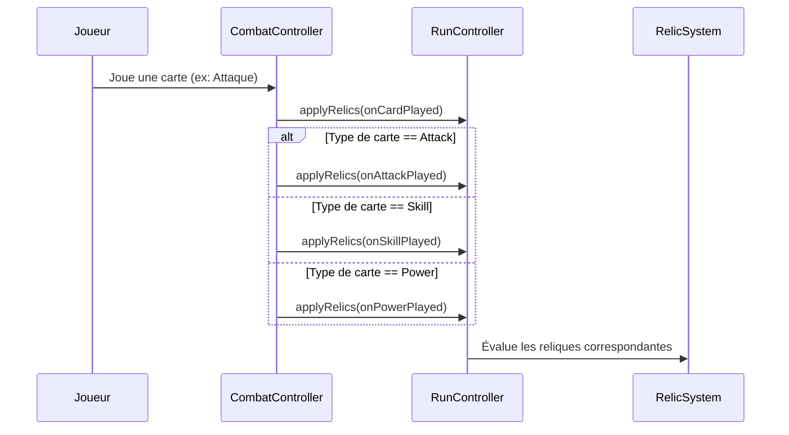

## 11. Système de Reliques Avancé : Déclencheurs de Cartes Spécifiques et Charges

Le système de reliques a été étendu pour prendre en charge deux nouveaux mécanismes de gameplay : le déclenchement par type de carte spécifique (Attaque, Compétence, Pouvoir) et les reliques à compteurs/charges persistants ou temporaires.

### 11.1. Déclencheurs par Type de Carte

Lorsqu'une carte est jouée par le joueur, la propagation des événements de déclenchement s'effectue dans `CombatController.applyPlayerCardPlay` :
1. Les reliques génériques `onCardPlayed` sont déclenchées en premier.
2. Le type de carte (`CardType`) est ensuite évalué afin de propager le déclencheur spécifique approprié :
   - `CardType.attack` → Déclenche `RelicTrigger.onAttackPlayed`.
   - `CardType.skill` → Déclenche `RelicTrigger.onSkillPlayed`.
   - `CardType.power` → Déclenche `RelicTrigger.onPowerPlayed`.
3. Le contrôleur `RunController.applyRelics` est notifié et applique l'effet de chaque relique possédée qui correspond à ce déclencheur.

### 11.2. Mécanique de Charges et Compteurs Visuels

Les reliques inspirées des deckbuilders classiques accumulent des charges représentées sous forme de `StatusEffect` sur l'entité héro. Ces charges sont visibles en combat dans le panneau des effets de statut.

1. **Stockage et Incrémentation** :
   Les charges sont des effets de statut empilables (`isStackable: true`) rattachés à `state.heroStats.statuses`. Lors du déclenchement, la méthode `applyRelicEffect` vérifie l'existence du statut de charge correspondant :
   - Si présent, la valeur du statut est incrémentée de +1.
   - Si absent, le statut est créé avec une valeur initiale de 1.

2. **Évaluation du Seuil (Trigger & Reset)** :
   Une fois la charge incrémentée, sa nouvelle valeur est comparée au seuil requis par la relique :
   - Si la valeur atteint le seuil (ex: 3 pour Kunaï), le statut de charge est supprimé de la liste des statuts et l'effet bénéfique final est appliqué.
   - Sinon, le statut de charge persiste dans les effets actifs.

3. **Persistance et Décomposition (Duration)** :
   La durée (`duration`) du statut de charge régit sa persistance :
   - **Charges de tour (durée = 1)** : Utilisées pour des contraintes au sein d'un même tour (ex: Kunaï/Shuriken). Si le seuil n'est pas atteint avant la fin du tour, le tick de début de tour décrémente et détruit automatiquement les charges.
   - **Charges persistantes (durée = 99)** : Utilisées pour des compteurs accumulables d'un tour à l'autre (ex: Plume de Scribe/Encensoir). Ces charges ne expirent pas à la fin du tour et persistent jusqu'au déclenchement ou la fin du combat.

| Relique | ID Statut de Charge | Seuil | Durée | Effet Déclenché |
|:---|:---|:---:|:---:|:---|
| **Croc Kunaï** (`kunai`) | `kunai_charge` | 3 | 1 (par tour) | +1 Maîtrise d'Armure permanente pour le combat |
| **Shuriken** (`shuriken`) | `shuriken_charge` | 3 | 1 (par tour) | +1 Force pour le combat (durée 99) |
| **Plume de scribe** (`pen_nib`) | `pen_nib_charge` | 5 | 99 (persistant) | +3 Force temporaire pour le tour en cours (durée 1) |
| **Encensoir** (`incense_burner`) | `incense_charge` | 4 | 99 (persistant) | +8 points d'Armure |
