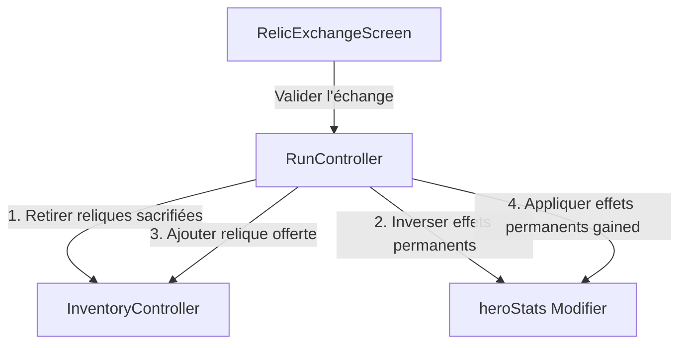

## 12. Autel d'Échange de Reliques (`RelicExchangeScreen`)

L'Autel d'Échange de Reliques permet au joueur d'échanger trois reliques d'une rareté donnée contre une relique de la rareté directement supérieure.

### 12.1. Topologie et Règles de Génération du Nœud
- **Identifiant technique** : `MapNodeType.relicExchange` (emoji `🔄`).
- **Génération** : Le nœud n'est généré qu'à partir de l'**Acte 5**.
  - **100% garanti** à chaque acte multiple de 5 (Acte 5, 10, 15, etc.).
  - **10% de chances** d'apparaître pour les autres actes ($\ge 5$).
- **Positionnement** : Un seul nœud d'échange maximum par acte. Placé sur un étage intermédiaire aléatoire (étages 2, 3, 4, 6 ou 7) afin de ne pas bloquer les nœuds obligatoires (repos, élites de milieu d'acte, boss, départ).

### 12.2. Algorithme d'Offre Déterministe (Seeded Random)
Pour assurer la cohérence de l'état sans surcharge de persistance, la relique offerte est déterminée de manière pseudo-aléatoire mais déterministe en combinant l'ID unique du nœud et le numéro de l'acte :
```dart
final seed = (node.id.hashCode ^ act).abs();
final random = Random(seed);
```
La rareté de la relique proposée exclut la rareté `Common` et suit la distribution suivante :
- **Uncommon** : 40%
- **Rare** : 35%
- **Epic** : 20%
- **Legendary** : 5%

### 12.3. Logique de Transaction et Inversion d'Effets (3-pour-1)
Pour obtenir la relique offerte de rareté $R$, le joueur doit fournir exactement 3 reliques de rareté $R-1$.
La méthode `runController.exchangeRelics(sacrificed, gained)` gère la transaction :
1. Les 3 reliques sacrifiées sont retirées de l'inventaire via `inventoryController.removeRelics()`.
2. Si les reliques sacrifiées appliquaient des modificateurs permanents de run (au trigger `startOfRun`), ces effets sont inversés en soustrayant leurs valeurs respectives (Force, Chance, Mana, PV max) de `heroStats`.
3. La nouvelle relique est ajoutée à l'inventaire via `inventoryController.addRelic()`. Si son trigger est `startOfRun`, ses effets statistiques permanents sont appliqués immédiatement.



### 12.4. Composant d'Interface Utilisateur
- **Classe** : `RelicExchangeScreen` (ConsumerStatefulWidget).
- **Règles métier visuelles** :
  - Affiche les détails de la relique proposée (gradient selon sa rareté).
  - Liste les reliques de l'inventaire possédant la rareté requise pour le sacrifice.
  - Permet la sélection interactive de 3 reliques avec retour visuel (glow doré pour les reliques sélectionnées).
  - Le bouton de transaction n'est cliquable qu'une fois 3 reliques sélectionnées.
  - Le bouton "Quitter" permet de continuer la run sans faire d'échange.
