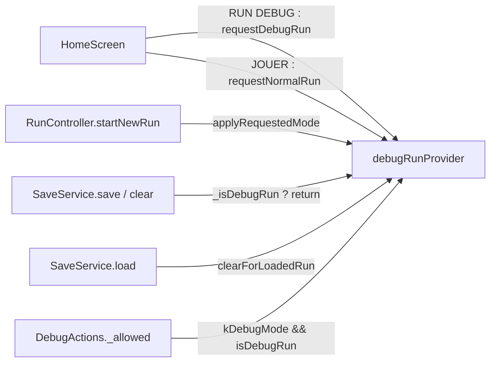

## 18. Menu de Debug — Run Déclarée et Tiroir Ancré (P-30, lot 1)

> [!IMPORTANT]
> **Une run debug ne persiste rien, et le verrou est dans `SaveService`.** Ni `save()` ni
> `clear()` n'agissent pendant une run debug : l'effacement est aussi destructeur que l'écriture.
> Voir [ADR-087](../_adr/ADR-087-run-debug-declaree-au-lancement-et-verrou-de-persis.md).

Le lot 1 manipule l'**état vivant** d'une run (providers Riverpod), jamais le disque. L'outil
d'écriture est le lot 2 — [`_patterns/19-00`](19-00-editeur-de-contenu-seam-disque-validation-ecriture.md).

### 18.1. Le mode, déclaré au lancement

| Élément | Emplacement | Rôle |
|:---|:---|:---|
| `DebugRunState {isDebugRun, requested}` | `lib/game/controllers/debug_run_controller.dart` | `requested` = la prochaine run ; `isDebugRun` = la run en cours |
| `requestDebugRun()` / `requestNormalRun()` | `DebugRunNotifier` | Posés par « RUN DEBUG » et « JOUER » : **chaque départ déclare son mode** |
| `applyRequestedMode()` | appelé par `RunController.startNewRun`, sous `kDebugMode` | La run ne naît qu'après le choix de classe et le draft de départ |
| `clearForLoadedRun()` | 1ʳᵉ ligne de `SaveService.load` | Une partie chargée n'est jamais une run debug |

« RUN DEBUG » ne passe **ni** par la confirmation d'écrasement **ni** par `clear()` : une run qui
ne persiste rien n'a rien à écraser.

### 18.2. `DebugActions` — composer, ne rien ajouter

`lib/game/services/debug_actions.dart` : classe **statique** prenant un `RefReader`, qui compose
les méthodes **déjà publiques** des contrôleurs (`hydrate`, `gainXp`, `advanceToNextWorld`,
`cleanDeadEnemies`…). **Aucune méthode n'a été ajoutée à un contrôleur** : `SaveService.load()`
avait déjà rendu cette surface publique. Chaque méthode sort d'emblée si `_allowed` est faux.

### 18.3. Le tiroir — aucune route poussée

> [!IMPORTANT]
> **Rien ne s'empile au-dessus du combat.** Une route de dialogue se fait fermer à la place de
> l'écran quand une action navigue. Et le combat sort par **sa propre route**
> (`popUntil(route == combatRoute)` puis `pop()`), jamais par le sommet de pile — voir
> [ADR-088](../_adr/ADR-088-tiroir-de-debug-ancre-et-sortie-de-combat-par-sa-pr.md).

`DebugDrawer` (`lib/ui/widgets/debug/debug_drawer.dart`) est un enfant du `Stack` de l'écran : une
poignée « DEBUG » au bord gauche ouvre un panneau.

| Contexte | Insertion | Onglets (`lib/ui/widgets/debug/tabs/`) |
|:---|:---|:---|
| Carte | `map_screen.dart` — `DebugDrawer(inCombat: false)` | Héros, Run, Deck, Reliques |
| Combat | `game_screen.dart` — `DebugDrawer(inCombat: true)`, masqué à la mort ou pendant le draft | Combat **seul**, sans barre d'onglets |

Contenu des onglets : **Héros** — PV/mana max, attaque, chance, critique, niveau, XP, « Gagner un
niveau » ; **Run** — or, acte (sans régénérer la carte), niveau, drafts en attente, cartes par
tour, forges bonus, « Acte suivant » ; **Deck** — piocher 1, défausser la main, ajouter/retirer
une carte ; **Reliques** — ajouter/retirer ; **Combat** — PV/mana/armure du héros, soin et mana
complets, PV par ennemi ou « 0 PV », tous les ennemis à 0, gagner/perdre, sauter la phase ennemie.

### 18.4. Exclusion du build release

Tous les points d'entrée sont gardés par `kDebugMode`, constante de compilation élaguée au
tree-shaking : `home_screen.dart`, `map_screen.dart`, `game_screen.dart`, `run_controller.dart`.
Le seul signe visible hors tiroir : le sous-titre « RUN DEBUG — aucune sauvegarde » du menu de
pause.

> [!NOTE]
> **Vérifié à la main le 2026-09-14** sur un build release, après la réécriture en tiroir : aucun
> menu de debug n'y est atteignable. La preuve reste manuelle, sans script ni test ; la procédure
> `grep -a` sur l'instantané AOT (spec lot 1 §7.1) est antérieure au tiroir.

### 18.5. Conventions propres au dossier

- **Libellés français en dur, sans clé ARB** — exception bornée à `lib/ui/widgets/debug/` et à
  l'éditeur de contenu : aucun joueur ne les verra.
- **Ciblage dans le tiroir, pas sur les sprites** : la logique reste hors de Flame.
- Pas de génération d'ennemis choisis : exposer le scaling d'`EncounterSystem` serait requis.

### 18.6. Tests

| Fichier | Couvre |
|:---|:---|
| `test/unit/debug_run_test.dart` | Verrou de `save`/`clear`, intention qui traîne, mode rabaissé au chargement |
| `test/unit/debug_actions_test.dart` | Chaque action, et le refus hors run debug |
| `test/widget/debug_drawer_test.dart` | Poignée seule fermée, onglet Combat seul en combat, tiroir ouvert après « 0 PV » |

La correction de sortie de combat n'a **pas** de test automatisé (`GameScreen` exige Flame).
