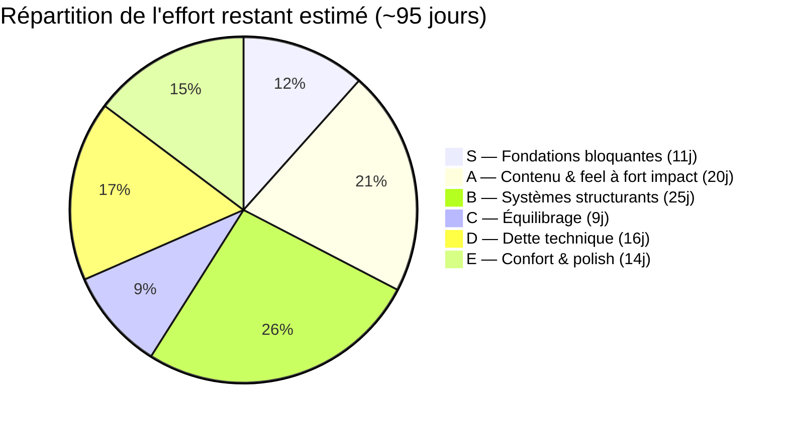
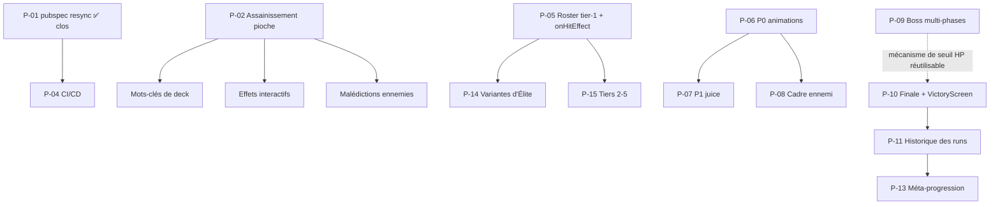
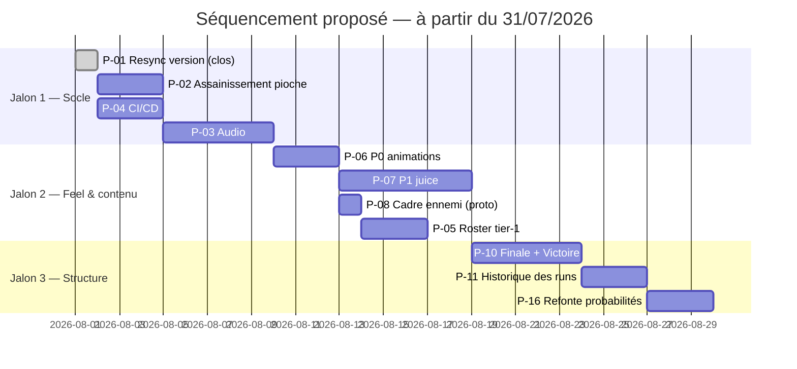

# 🗺️ Roadmap Priorisée — Hero's Draft

**Date de rédaction** : 31 juillet 2026
**Version du projet au moment de la rédaction** : v3.5.1 (ADR-073) — branche `main`, arbre propre
**Périmètre** : consolidation de **toutes** les améliorations documentées à ce jour (8 brainstorms de `docs/possible_upgrades/`, `backlog_and_roadmap_report_22072026.md`, `progress.md` §3-§5, `upgrade_ideas.md`, audit de dette non documentée du 24/07)
**Nature du document** : document de pilotage réutilisable — **source unique du « reste à faire »**. Il remplace `backlog_and_roadmap_report_22072026.md` (archivé), ainsi que les anciens §3 et §4 de `progress.md` (archivés). Maintenu par le skill `memory-bank-sync` : tout chantier livré y est coché dans la même passe.

---

## 0. Comment lire ce document

### Échelle d'effort
`1 jour` ≈ une session de travail focalisée complète (spec → plan TDD → implémentation → revue → `dart analyze` propre), au rythme réellement observé sur ADR-069 → ADR-073. Les estimations **excluent la production d'assets** (sprites, illustrations, sons), qui est signalée séparément quand elle existe — c'est presque toujours le vrai chemin critique.

### Échelle de difficulté
| Note | Signification |
|:---:|:---|
| ★☆☆☆☆ | Édition de données ou correctif localisé, aucun risque architectural |
| ★★☆☆☆ | Code isolé, patterns existants réutilisés tels quels |
| ★★★☆☆ | Touche plusieurs couches, ou demande une décision de design non tranchée |
| ★★★★☆ | Modifie un chemin critique existant, ou introduit un système nouveau |
| ★★★★★ | Nouvelle architecture transverse, calibration longue, risque de régression étendu |

### Échelle d'apport
🔥🔥🔥 = transforme l'expérience ou débloque plusieurs chantiers · 🔥🔥 = gain net et visible · 🔥 = confort, polish ou hygiène

---

## 1. Vue d'ensemble

**Dépendances structurantes** (ce qui bloque quoi) :

---

## 2. Tier S — Fondations bloquantes *(≈ 11 jours)*

*Ce qui débloque le reste, corrige des règles cassées, ou comble le trou le plus criant. À faire avant tout ajout de contenu.*

| ID | Chantier | Effort | Difficulté | Apport |
|:---|:---|:---:|:---:|:---:|
| ~~**P-01**~~ | ~~**Resynchroniser `pubspec.yaml`** (`0.1.0+1` → `0.4.7+1`) sur `patch_notes.json`~~ ✅ **Livré le 2026-08-03** — désormais maintenu automatiquement par le skill `patch-notes-writer` | — | — | — |
| **P-02** | **Assainissement du système de pioche** (doc 31/07) | **2-3 j** | ★★★★☆ | 🔥🔥🔥 |
| **P-03** | **Système audio** (`flame_audio` + `SfxService`, ~15 événements) | **3-5 j** | ★★★☆☆ | 🔥🔥🔥 |
| **P-04** | **CI/CD GitHub Actions** (`ci.yml` + `release.yml`, 7 jobs) | **1,5-2 j** *(+0,5 j de config externe)* | ★★★☆☆ | 🔥🔥 |

### P-01 — Resync de version
> [!NOTE]
> ✅ **Clos le 2026-08-03.** La resynchronisation a été faite, et la propriété du numéro de version est désormais portée par le skill `.claude/skills/patch-notes-writer/SKILL.md`, qui l'écrit simultanément dans `patch_notes.json` et `pubspec.yaml`. L'écart ne peut plus se recreuser.

*Diagnostic du 31/07/2026, conservé tel quel pour mémoire — le chantier est clos depuis (voir la note ci-dessus) :* « Cinq minutes de travail, mais **prérequis bloquant strict** de P-04 : le job `verify-version` compare le tag git à `pubspec.yaml` et échoue systématiquement tant que l'écart `0.1.0` / `0.4.7` subsiste. À faire immédiatement, indépendamment du reste. »

### P-02 — Assainissement de la pioche
**Ce que ça corrige** : `drawCards()` ne remélange jamais la défausse — une carte « Piocher 2 » avec pioche vide ne fait *rien*, silencieusement. Trois cartes du pool et la rune `quick` sont donc non fiables aujourd'hui. S'ajoutent : le seuil de remélange `< 5` qui détruit la capacité à compter son deck (compétence centrale du genre), l'absence de limite de main, un mélange non déterministe qui rend les tests de séquence inécrivables, `_turnCount` dupliqué (bug d'affichage « Tour 1 » sur une partie rechargée), et 4 blocs de code mort (`temporaryCost`, `IntentType.debuffDeck`, `onEnemyDebuffDeck`, deck de secours codé en dur).
**Pourquoi si haut** : c'est le socle de tous les axes de profondeur futurs (mots-clés de deck, effets interactifs, malédictions ennemies) — les construire sur les règles actuelles reviendrait à empiler sur du bancal.
**Risque** : ★★★★☆ car le chantier déplace la pioche hors de `game_screen.dart`, soit le chemin le plus emprunté du jeu. L'ordre relatif `runController.startTurn()` / pioche doit être préservé à l'identique sous peine de décaler les reliques d'un tour. Effet de bord assumé : **la difficulté ressentie change** (remélange à sec) — à re-playtester.
**Livrable annexe** : 6 tests aujourd'hui inécrivables + une première relique interagissant avec le deck (`maxHandSize`).

### P-03 — Audio
**Le plus gros gain de game feel par heure investie du projet**, et la recommandation n°1 de l'audit du 25/07, très loin devant toutes les autres. État vérifié le 31/07 : aucune dépendance audio dans `pubspec.yaml`, aucun `AudioService`, aucun fichier son — seulement des `// TODO: Audio Hook` disséminés. Chantier identifié depuis la Phase 4 de la roadmap de dette technique et jamais entamé.
**Difficulté technique modeste** (★★★☆☆) : `flame_audio` + un service central, les points d'accroche existent déjà (`onTick`/`onLand` du carrousel de reliques, hooks du draft). **Le vrai coût est le sourcing** : ~15 bruitages + 4 musiques (menu, carte, combat, boss) à trouver, licencier et calibrer. Prévoir cette part en parallèle du code.

### P-04 — CI/CD
Automatise deux workflows manuels chronophages **déjà en place** (déploiement web sur VPS perso, zip Windows partagé aux testeurs) — il n'y a donc pas de coût d'amorçage « canal de distribution à créer ». Applique en prime automatiquement la règle `CLAUDE.md` (`dart analyze` propre) sur chaque push/PR, ce qui prend de la valeur à mesure que du contenu est généré par sub-agents.
**Attention** : la fragilité est entièrement dans la config externe (4 secrets GitHub, 1 clé SSH dédiée, 1 modification nginx pour le symlink `latest`, 1 webhook Discord), pas dans la logique du pipeline. Valider la clé SSH manuellement **avant** d'en dépendre.

---

## 3. Tier A — Contenu & feel à fort impact *(≈ 20 jours)*

*Ce que le joueur voit et ressent immédiatement.*

| ID | Chantier | Effort | Difficulté | Apport |
|:---|:---|:---:|:---:|:---:|
| **P-05** | **Roster tier-1 étendu + mécaniques `onHitEffect`** (5 ennemis) | **2-3 j** *(+ 5 sprites)* | ★★☆☆☆ | 🔥🔥🔥 |
| **P-06** | **Lot P0 de l'audit animations** (12 correctifs : tokens VFX, perf, z-order, bugs) | **2-3 j** | ★★☆☆☆ | 🔥🔥 |
| **P-07** | **Lot P1 « juice »** (hit-stop, screenshake, héros qui attaque, impacts, idle, mort) | **4-6 j** | ★★★☆☆ | 🔥🔥🔥 |
| **P-08** | **Cadre d'ennemi** — prototyper puis trancher PNG vs procédural | **0,5 j** *(proto)* **+ 1-3 j** | ★★★☆☆ | 🔥🔥 |
| **P-09** | **Boss multi-phases** (changement de comportement au seuil 50 % HP) | **3-4 j** | ★★★★☆ | 🔥🔥 |

### P-05 — Roster tier-1
**Le brainstorm le plus abouti du dossier** : stats calibrées, formule `combatRating` étendue (`utilityThreat`), spread de rating vérifié (27,9 → 35,4 à l'Acte 1, comparable à l'écart Slime/Gobelin existant). Prêt à passer en spec sans travail de design supplémentaire.
**Double apport** : résout le backlog ADR-070/072 (fenêtre tier-1-only resserrée aux Actes 1-5 avec seulement Slime et Gobelin), **et** investit pour toute la run endless — les tier-1 restent piochés comme remplissage budgétaire bon marché à tous les actes, puisque `getMaxEnemiesForNormalCombat(act)` croît indéfiniment.
**Bonus architectural** : introduit `onHitEffect` (`applyStatus`/`lifesteal`/`stealGold`) et `evadeChance`, réutilisés tels quels par P-14 et P-15. Aujourd'hui aucune intention ennemie n'applique le moindre statut.
**Chemin critique réel** : les 5 sprites, à coordonner avec la décision P-08.

### P-06 — Lot P0 animations
Douze actions cadrées, dont **3 points chauds de performance** (`TextPaint` reconstruit à chaque frame, particules non throttlées à 60 Hz pendant le drag, ~18 `MaskFilter.blur` par frame pendant le ciblage) et **un bug visible** (échelle absolue dans la zone d'annulation). Crée `vfx_tokens.dart` — palette élémentaire unique (elle existe aujourd'hui en 3 versions divergentes), durées, courbes, priorités z. C'est la fondation de P-07 et P-08 : à faire avant, pas après.

### P-07 — Lot P1 juice
Hit-stop et screenshake pilotés par la magnitude `dégâts / PV max`, le héros qui participe visuellement à ses propres attaques (aujourd'hui il ne bouge jamais), impacts réels pour `magic`/`buff`/`status`, idle breathing déphasé, mort d'ennemi mise en scène, rythme du tour ennemi maîtrisé. **Meilleur ratio impact/effort après l'audio**, et se combine avec lui (un hit-stop sans son ne rend que la moitié de l'effet — envisager de livrer P-03 et P-07 dans la même fenêtre).

### P-08 — Cadre d'ennemi
**Une décision, deux documents concurrents.** Option PNG (cadre par tier, compositing 3 couches, `windowRect`) : plus fidèle à l'identité visuelle actuelle, mais risque d'alignement du détourage. Option procédurale (bordure Canvas + 4 icônes vectorielles réutilisées d'`EffectIcon`) : zéro asset, aucun problème d'alignement, mais rendu « UI systémique » plutôt que « portrait peint », et risque de perf sur 5 `EnemyCard` animées simultanément.
**Recommandation** : 0,5 jour de prototype sur un seul ennemi avant d'investir — c'est ce que les deux documents préconisent, et la décision conditionne la production des sprites de P-05.

### P-09 — Boss multi-phases
Marqué **priorité haute** dans le rapport du 22/07 et jamais traité. Difficulté ★★★★☆ parce que `EntityStats`/`EnemyInstance` n'ont aujourd'hui **aucune notion de changement de comportement conditionné aux PV restants** — c'est un mécanisme à créer. Bonne nouvelle : ce même mécanisme sert ensuite au « Dragon Juvénile » (seuil d'enrage, tier 5) et potentiellement au Boss de Cycle de P-10.

---

## 4. Tier B — Systèmes structurants *(≈ 25 jours)*

*Ce qui change la forme du jeu plutôt que son contenu. Chantiers plus lourds, à séquencer.*

| ID | Chantier | Effort | Difficulté | Apport |
|:---|:---|:---:|:---:|:---:|
| **P-10** | **Finale de Séquence + `VictoryScreen`** — première condition de victoire du jeu | **3-5 j** | ★★★☆☆ | 🔥🔥🔥 |
| **P-11** | **Historique des runs** (`RunHistoryService`, `RunSummary`, écran dédié) | **2-3 j** | ★★☆☆☆ | 🔥🔥 |
| **P-12** | **Biomes** (5 séquences × 3 variantes, filtre de pool d'ennemis + fond de carte) | **2-3 j** *(+ 15 illustrations)* | ★★☆☆☆ | 🔥🔥 |
| **P-13** | **Méta-progression** : monnaie persistante inter-runs + boutique de méta-upgrades | **3-5 j** | ★★★☆☆ | 🔥🔥 |
| **P-14** | **Variantes d'Élite adaptatives** (5 affixes, triggers côté ennemi) | **5-8 j** | ★★★★★ | 🔥🔥🔥 |
| **P-15** | **Ennemis tiers 2-5** (20 concepts restants) | **3-5 j** *(+ sprites)* | ★★★☆☆ | 🔥🔥 |

### P-10 — Finale de Séquence
**Le jeu n'a aujourd'hui aucune condition de victoire** : les actes continuent indéfiniment et seule la mort termine une run. Le Portail Final (4ᵉ nœud optionnel à l'étage boss des Actes 5, 10, 15…, inspiré du téléporteur de Risk of Rain 2) donne enfin une sortie propre, sans supprimer l'endless pour qui veut continuer. C'est probablement **le manque de design le plus structurel du jeu actuel**.
Demande un « Boss de Cycle » dédié avec sa formule de scaling par boucle — non chiffré à ce jour, à faire en spec.

### P-11 — Historique des runs
Dépend de P-10 (il lui faut un état de Victoire à enregistrer, en plus de la Défaite existante). Mirroring direct du pattern `SaveService` déjà établi, donc peu risqué. **Réserve connue et assumée** : `shared_preferences` n'est pas taillé pour une liste illimitée ; migration vers `sqlite`/`drift`/`hive` comme échappatoire si la taille devient un problème réel.

### P-12 — Biomes
Côté code, c'est petit : un `biomes.json`, un champ `biomes` sur `EnemyData`, un filtre parallèle à celui du tier dans `generateEnemiesForLevel`, un fond conditionnel sur `MapScreen` avec repli sur le dégradé actuel. **Le goulot est artistique** : 15 illustrations, et ce serait la première image de fond du projet (rupture assumée avec le rendu 100 % procédural actuel). Le scope V1 se limite volontairement à `MapScreen` pour ne pas doubler le besoin à 30 illustrations.

### P-13 — Méta-progression
Rien n'existe hors-run aujourd'hui. Gain d'une monnaie à la fin de chaque run proportionnel à la progression, dépensable en améliorations permanentes. Conceptuellement adossé à P-11 (qui produit déjà les données de fin de run). Chantier de **rétention**, pas de contenu : à faire quand la boucle de jeu est jugée bonne, pas avant.

### P-14 — Variantes d'Élite
**Le chantier le plus ambitieux de tout le backlog.** Cinq affixes (Ardent, Foudroyant, Glacial, Vampirique, Parfait) applicables à n'importe quel ennemi dans n'importe quel combat, s'additionnant aux multiplicateurs de nœud existants. Nécessite un **système de triggers côté ennemi** (`onAttackLanded`/`onDamageTaken`/`onTurnStart`) calqué sur celui des reliques — architecture nouvelle. Chaque affixe « riche » (Foudroyant et sa charge conditionnelle en particulier) est une mini-mécanique à concevoir et tester séparément.
**À faire après P-05**, qui pose déjà la moitié du socle (`onHitEffect`). Livrer les 4 affixes communs d'abord, Parfait en itération 2.

### P-15 — Tiers 2-5
Réutilise `onHitEffect`/`evadeChance` de P-05 sans nouveau champ. Trois concepts demandent chacun une mécanique inédite et sont à isoler : Chaman Orc (première interaction ennemi → ennemi), Dragon Juvénile (seuil d'enrage — mutualisable avec P-09), Cavalier de la Mort (dégâts différés). Les tiers 4-5 exigent en plus de relever `maxTierAuthored` au-delà de 3.

---

## 5. Tier C — Équilibrage *(≈ 9 jours + playtests)*

*Techniquement légers, coûteux en validation. Difficulté sous-estimée si on ne compte que le code.*

| ID | Chantier | Effort | Difficulté | Apport |
|:---|:---|:---:|:---:|:---:|
| **P-16** | **Refonte globale des probabilités & récompenses** (le mana n'est plus une ressource rare) | **2-3 j** | ★★★★☆ | 🔥🔥🔥 |
| **P-17** | **Les 5 problèmes d'équilibrage documentés** (mana, Paladin, HP sbires, `Attaque Rapide`, heal) | **1-2 j** | ★★★☆☆ | 🔥🔥 |
| **P-18** | **Contraintes de deckbuilding** : limite de 15 cartes + coût de merge +1 mana + restrictions par classe | **2-3 j** | ★★★☆☆ | 🔥🔥 |
| **P-19** | **Intentions ennemies cachées** en late game | **1 j** | ★★☆☆☆ | 🔥 |
| **P-20** | **Scaling de `mastery` par classe** | **1-2 j** | ★★☆☆☆ | 🔥 |

### P-16 — Le sujet le plus important de ce tier
Les runes de forge `eco` et `quick` (regain de mana / pioche à la lecture d'une carte) rendent le mana quasi illimité, alors que c'est la ressource la plus importante du jeu. Cumulé avec la récompense de mana au Level Up disponible jusqu'en légendaire, le joueur perd toute sensation de contrainte. Le chantier consiste à revoir **l'ensemble** des tables de probabilité et le poids des récompenses par rareté — donc à re-calibrer plusieurs systèmes en même temps, d'où ★★★★☆ malgré un code trivial.
**Interaction connue** : P-02 change déjà la difficulté ressentie via le remélange à sec. Faire P-02 **avant** P-16 et re-mesurer, sinon on calibre sur une base qui va bouger.

### P-17 — Les cinq classiques
Documentés depuis `6_analyse_game_balance.md`, jamais corrigés : économie de mana permissive, Paladin quasi invulnérable au début (20 armure de base), HP des sbires trop bas, `Attaque Rapide` gratuite (0 mana → 3 dégâts + 1 pioche), soin répétable. Chacun est une ligne de JSON ; **c'est le playtest de validation qui coûte**. À traiter dans la même passe que P-16 pour ne calibrer qu'une fois.

---

## 6. Tier D — Dette technique *(≈ 16 jours)*

*Aucun apport joueur direct. À intercaler entre les chantiers de contenu, pas à empiler.*

| ID | Chantier | Effort | Difficulté | Apport |
|:---|:---|:---:|:---:|:---:|
| **P-21** | **Couverture de tests → ≥ 50 %** (dont `RewardController`, aujourd'hui à zéro test) | **3-5 j** | ★★★☆☆ | 🔥🔥 |
| **P-22** | **Typage des modèles** : `==`/`hashCode` sur 12 modèles, `toJson` manquants (`CardInstance`, `EventState`, `ShopState`) | **2-3 j** | ★★★☆☆ | 🔥🔥 |
| **P-23** | **`draft_screen.dart`** : ids techniques + logique de tirage vers un controller | **1 j** | ★★☆☆☆ | 🔥🔥 |
| **P-24** | **Routage centralisé** (`GoRouter`, 20+ `Navigator.push` en dur) | **2-3 j** | ★★★★☆ | 🔥 |
| **P-25** | **7 blocs `catch` silencieux** → logging | **0,5 j** | ★☆☆☆☆ | 🔥 |
| **P-26** | **Lot d'hygiène** : `GameDataRegistry` en `Map` O(1), `MapNode` découplé de `Vector2`, `SkillData` bilingue | **1 j** | ★★☆☆☆ | 🔥 |
| **P-27** | **Event Bus** (remplace les callbacks de constructeur de `HerosDraftGame`) | **2-3 j** | ★★★★☆ | 🔥 |
| **P-28** | **Validation des entrées** (`gainGold(-50)` passe, HP peut dépasser `maxHp`) | **1 j** | ★★☆☆☆ | 🔥 |

### P-23 — Le plus urgent de ce tier malgré sa petite taille
`draft_screen.dart` utilise des **chaînes littérales françaises comme clés de dispatch i18n** (`if (choice.title == 'Vitalité') return l10n.draftChoiceVitality;`). Une simple correction de faute de frappe fait basculer silencieusement tous les joueurs anglophones sur du texte français brut — sans erreur `dart analyze`, sans test qui casse (le fichier n'est couvert par aucun test). Le fichier réimplémente en prime tout un système de tirage pondéré par la `luck` déjà présent dans `RewardController`, avec risque de divergence silencieuse au prochain rééquilibrage. Une journée pour supprimer une bombe à retardement.

### P-21 — Note de méthode
`RewardController` est combat-critique (or, XP, triplement boss, tirage de relique pondéré, exclusion des cartes uniques) et n'a **aucun** test, alors que tous les autres controllers en ont. À traiter en premier dans ce lot. Note : P-02 apporte déjà 6 tests et rend testable la règle de tour, aujourd'hui inécrivable.

---

## 7. Tier E — Confort, polish & petits correctifs *(≈ 14 jours)*

*À piocher opportunément entre deux gros chantiers, ou quand un playtest les fait remonter.*

| ID | Chantier | Effort | Difficulté | Apport |
|:---|:---|:---:|:---:|:---:|
| **P-29** | **Lot P2 animations** : signature VFX des 6 cartes de classe + différenciation réelle feu/glace/foudre/poison | **4-6 j** | ★★★☆☆ | 🔥🔥 |
| **P-30** | Menu de **debug** (`add_gold`, `spawn_relic`, `jump_to_floor`…) | **1-2 j** | ★★☆☆☆ | 🔥🔥 |
| **P-31** | **Nœuds Trésor 💎 & Mystère ❓** sur la carte | **1-2 j** | ★★☆☆☆ | 🔥 |
| **P-32** | **Historique de notifications** (panneau consultable, type chat) | **1-2 j** | ★★☆☆☆ | 🔥 |
| **P-33** | **Système d'achievements / trophées** | **2-3 j** | ★★★☆☆ | 🔥 |
| **P-34** | **Animation de fusion 3→1** (mise en scène de la fusion de cartes) | **1 j** | ★★☆☆☆ | 🔥 |
| **P-35** | **Onglet Reliques** dans le dictionnaire | **0,5-1 j** | ★☆☆☆☆ | 🔥 |
| **P-36** | **Focus souris sur un ennemi** → panneau de stats détaillé | **0,5-1 j** | ★★☆☆☆ | 🔥 |
| **P-37** | **Icônes de type de dégâts** dans les descriptions de cartes | **0,5 j** | ★☆☆☆☆ | 🔥 |
| **P-38** | **Dashboard de perf** (FPS, drops) dans les logs de debug | **1 j** | ★★☆☆☆ | 🔥 |
| **P-39** | **Skins de héros** débloquables | **3 j+** *(art)* | ★★☆☆☆ | 🔥 |

### Correctifs ponctuels signalés dans `upgrade_ideas.md` (non estimés séparément, ≈ 1,5 j au total)
- Exclure les cartes de rareté `unique` du menu de draft post-boss (elles ne devraient jamais avoir de copie) — **c'est un bug**, pas une évolution.
- Vérifier que la règle anti-répétition de nœuds fonctionne réellement, et que les quotas par acte sont respectés.
- Repositionner la popup d'aperçu des améliorations d'une carte (forge et tous les autres écrans concernés).
- Mettre `docs/animations/card_animations_system.md` en conformité avec le code (documentation fausse sur 4 points).

---

## 8. Corrections à apporter à la documentation existante

Constats faits en consolidant ce document — **à traiter avant de se fier aux anciens rapports** :

| # | Constat | Vérifié le 31/07 | Action |
|:---:|:---|:---|:---|
| 1 | `backlog_and_roadmap_report_22072026.md` présente « Persistance / Sauvegarde » comme le Jalon 1 immédiat | Livré en v3.2.0 (ADR-069) le 24/07 | Marquer le rapport comme superseded par ce document |
| 2 | `progress.md` §4 liste `map_screen.dart` (2 471 lignes) et `game_screen.dart` (1 667 lignes) comme chantiers **critiques** | **418** et **555 lignes** réellement | Retirer de la roadmap de dette — chantier clos le 24/07 |
| 3 | Métriques de tests contradictoires selon les documents | `progress.md` en-tête : « 145+ » · `progress.md` §Fiabilité : « 106 » · `activeContext.md` : « 211/211 » | Aligner sur une seule source de vérité (P-04 la produira automatiquement) |
| 4 | `pubspec.yaml` à `0.1.0+1` vs `patch_notes.json` à `0.4.7` | Confirmé | → **P-01** — ✅ clos le 2026-08-03 |
| 5 | Taux de complétion divergents | Rapport 22/07 : « ~86 % de 146 items » · `progress.md` §3 : « ~60 % de 95 items » | Recompter sur la base de ce document |
| 6 | Aucun `.github/workflows/` | Confirmé | → **P-04** |

---

## 9. Séquencement proposé

Trois jalons, pensés pour que chaque bloc se termine sur quelque chose de jouable et mesurable.

### Jalon 1 — Socle *(≈ 11 j)* → ~~P-01~~ ✅, P-02, P-04, P-03
Corrige les règles cassées, comble le trou audio, automatise la distribution. **Rien de nouveau n'est ajouté** — c'est délibéré : tout ajout de contenu posé sur la pioche actuelle devra être re-testé après P-02.

### Jalon 2 — Feel & contenu *(≈ 14 j)* → P-06, P-08 (proto), P-07, P-05
L'ordre compte : P-06 crée `vfx_tokens.dart` dont P-07 dépend ; le prototype de P-08 tranche le pipeline d'assets dont dépendent les sprites de P-05, à lancer en production dès la décision prise. À la sortie de ce jalon, le jeu devrait être nettement plus agréable à jouer sans qu'aucun système n'ait changé de forme.

### Jalon 3 — Structure *(≈ 11 j)* → P-10, P-11, P-16
Donne une fin à une run, archive les résultats, puis recalibre l'économie **une fois** que P-02 et le nouveau contenu ont stabilisé la base. Intercaler P-23 et P-25 (1,5 j de dette à faible risque) selon l'humeur.

**Au-delà** : P-14 (Variantes d'Élite) et P-13 (méta-progression) sont les deux gros morceaux suivants ; P-12 (Biomes) est prêt côté code mais attend 15 illustrations — c'est le seul chantier qu'il est rationnel de lancer *maintenant* côté art, en parallèle de tout le reste.

---

## 10. Ce qu'il faut retenir

1. **Quatre chantiers font l'essentiel de la valeur** : audio (P-03), pioche (P-02), juice (P-07), et une condition de victoire (P-10). Le reste est de l'accumulation.
2. **Le chemin critique n'est presque jamais le code** — c'est le son (P-03), les sprites (P-05, P-15), les illustrations (P-12) et le playtest de calibration (P-16, P-17). Lancer ces productions en parallèle du développement, pas après.
3. **P-02 avant tout ajout de contenu**, et **P-16 après P-02**, sinon on calibre deux fois.
4. La dette technique restante est réelle mais **plus faible que ne le disent les anciens documents** : les deux god classes UI sont déjà résolues et la persistance est livrée.

---

*Document à relire et re-prioriser après chaque jalon. Les identifiants `P-xx` sont stables : les réutiliser dans les specs, les plans d'implémentation et les entrées de `decisionLog.md` pour garder la traçabilité.*
