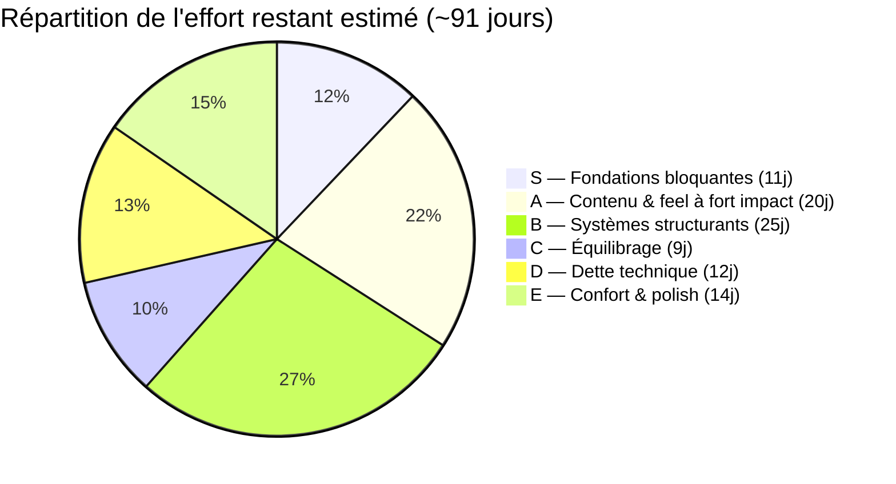
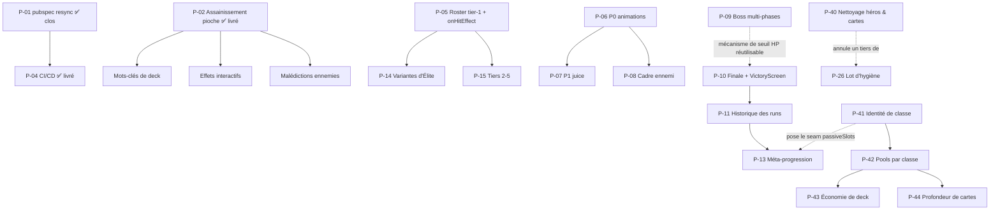
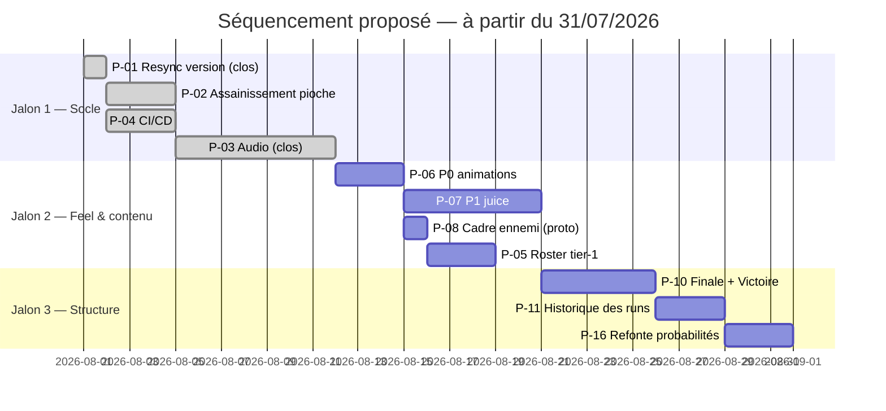

# 🗺️ Roadmap Priorisée — Hero's Draft

**Date de rédaction** : 31 juillet 2026
**Version du projet au moment de la rédaction** : v3.5.1 (ADR-073) — branche `main`, arbre propre
**Périmètre** : consolidation de **toutes** les améliorations documentées à ce jour (8 brainstorms de `docs/possible_upgrades/`, `backlog_and_roadmap_report_22072026.md`, `progress.md` §3-§5, `upgrade_ideas.md`, audit de dette non documentée du 24/07)
**Nature du document** : document de pilotage réutilisable — **source unique du « reste à faire »**. Il remplace `backlog_and_roadmap_report_22072026.md` (archivé), ainsi que les anciens §3 et §4 de `progress.md` (archivés). Maintenu par le skill `memory-bank-sync` : tout chantier livré y est coché dans la même passe.

---

## 0. Comment lire ce document

### Échelle d'effort
`1 jour` ≈ une session de travail focalisée complète (spec → plan TDD → implémentation → revue → `dart analyze` propre), au rythme réellement observé sur ADR-069 → ADR-073. Les estimations **excluent la production d'assets** (sprites, illustrations, sons), qui est signalée séparément quand elle existe — c'est presque toujours le vrai chemin critique.

### Échelle de difficulté
| Note | Signification |
|:---:|:---|
| ★☆☆☆☆ | Édition de données ou correctif localisé, aucun risque architectural |
| ★★☆☆☆ | Code isolé, patterns existants réutilisés tels quels |
| ★★★☆☆ | Touche plusieurs couches, ou demande une décision de design non tranchée |
| ★★★★☆ | Modifie un chemin critique existant, ou introduit un système nouveau |
| ★★★★★ | Nouvelle architecture transverse, calibration longue, risque de régression étendu |

### Échelle d'apport
🔥🔥🔥 = transforme l'expérience ou débloque plusieurs chantiers · 🔥🔥 = gain net et visible · 🔥 = confort, polish ou hygiène

---

## 1. Vue d'ensemble

> [!NOTE]
> Seul le **Tier D** a été re-vérifié contre le code (le 2026-08-04) ; il est passé de 16 à
> 12 jours. Les cinq autres tiers portent encore les estimations du 31/07, non re-mesurées.
> Le Tier S a été ponctuellement recontrôlé à cette date et s'est révélé exact.

> [!WARNING]
> **Le camembert et le total de ~91 jours sont antérieurs au programme P-40→P-44** (ajouté le
> 2026-08-07) et ne l'incluent pas. Le solde net n'est pas calculable en l'état : P-41 est chiffré
> (5-7 j) et P-40 aussi (1-1,5 j à l'origine, **~0,75-1 j restant** depuis la livraison de son bloc 1), mais **P-42, P-43 et P-44 attendent leur spec**, tandis que P-18
> et P-20 sortent du Tier C par redistribution. Recalculer l'ensemble à la prochaine passe de
> re-priorisation, pas avant — un total partiellement mis à jour serait plus trompeur que celui-ci.

**Dépendances structurantes** (ce qui bloque quoi) :

---

## 2. Tier S — Fondations bloquantes *(≈ 11 jours)*

*Ce qui débloque le reste, corrige des règles cassées, ou comble le trou le plus criant. À faire avant tout ajout de contenu.*

| ID | Chantier | Effort | Difficulté | Apport |
|:---|:---|:---:|:---:|:---:|
| ~~**P-01**~~ | ~~**Resynchroniser `pubspec.yaml`** (`0.1.0+1` → `0.4.7+1`) sur `patch_notes.json`~~ ✅ **Livré le 2026-08-03** — désormais maintenu automatiquement par le skill `patch-notes-writer` | — | — | — |
| ~~**P-02**~~ | ~~**Assainissement du système de pioche**~~ ✅ **Livré et validé le 2026-08-06** (code + playtest) — voir [ADR-078](../.obsidian_vault/_adr/ADR-078-assainissement-du-systeme-de-pioche-remelange-a-sec.md) | — | — | — |
| ~~**P-03**~~ | ~~**Système audio**~~ ✅ **Livré le 2026-08-25, publié en `0.5.0`** — moteur data-driven complet (directeur central, chaîne de repli à 4 niveaux, musique par scène, réglages persistés) et **31 bruitages sur 31** posés ; les 4 musiques sortent vers **P-46** — voir [ADR-082](../.obsidian_vault/_adr/ADR-082-directeur-audio-central-et-mapping-par-donnees.md) | — | — | — |
| ~~**P-04**~~ | ~~**CI/CD GitHub Actions**~~ ✅ **Livré le 2026-08-20** en deux lots (chaîne CI/CD puis site vitrine), publié en `0.4.8` — voir [ADR-079](../.obsidian_vault/_adr/ADR-079-chaine-de-release-declenchee-par-tag-et-garde-fou.md) et [ADR-080](../.obsidian_vault/_adr/ADR-080-site-vitrine-pilote-par-la-donnee-et-jointure-decl.md) | — | — | — |

### P-01 — Resync de version
> [!NOTE]
> ✅ **Clos le 2026-08-03.** La resynchronisation a été faite, et la propriété du numéro de version est désormais portée par le skill `.claude/skills/patch-notes-writer/SKILL.md`, qui l'écrit simultanément dans `patch_notes.json`, `pubspec.yaml` et `site/_site/versions.json`. L'écart ne peut plus se recreuser.

*Diagnostic du 31/07/2026, conservé tel quel pour mémoire — le chantier est clos depuis (voir la note ci-dessus) :* « Cinq minutes de travail, mais **prérequis bloquant strict** de P-04 : le job `verify-version` compare le tag git à `pubspec.yaml` et échoue systématiquement tant que l'écart `0.1.0` / `0.4.7` subsiste. À faire immédiatement, indépendamment du reste. »

### P-02 — Assainissement de la pioche
> [!NOTE]
> ✅ **Livré le 2026-08-06** (branche `feat/p02-assainissement-pioche`, 8 commits TDD,
> 230/230 tests au vert, `dart analyze` propre). Conception et arbitrages :
> [ADR-078](../.obsidian_vault/_adr/ADR-078-assainissement-du-systeme-de-pioche-remelange-a-sec.md).
> Deux écarts au diagnostic ci-dessous, tranchés en conception :
> `maxHandSize` est devenue une **constante** (`GameConstants.maxHandSize = 10`) et non une
> statistique, l'arithmétique du deck actuel rendant une relique dessus statistiquement
> invisible — la relique livrée (`scholars_satchel`) cible donc `RunState.cardsPerTurn` ;
> et le chantier a produit **18 tests neufs plus 2 réécrits**, non 6.
>
> ✅ **Playtest de validation passé le 2026-08-06.** Le chantier est clos : la base de
> difficulté est désormais stable et **P-16 peut démarrer dessus**.

*Diagnostic du 31/07/2026, conservé tel quel pour mémoire — le chantier est livré depuis (voir la note ci-dessus) :*

**Ce que ça corrige** : `drawCards()` ne remélange jamais la défausse — une carte « Piocher 2 » avec pioche vide ne fait *rien*, silencieusement. Trois cartes du pool et la rune `quick` sont donc non fiables aujourd'hui. S'ajoutent : le seuil de remélange `< 5` qui détruit la capacité à compter son deck (compétence centrale du genre), l'absence de limite de main, un mélange non déterministe qui rend les tests de séquence inécrivables, `_turnCount` dupliqué (bug d'affichage « Tour 1 » sur une partie rechargée), et 4 blocs de code mort (`temporaryCost`, `IntentType.debuffDeck`, `onEnemyDebuffDeck`, deck de secours codé en dur).
**Pourquoi si haut** : c'est le socle de tous les axes de profondeur futurs (mots-clés de deck, effets interactifs, malédictions ennemies) — les construire sur les règles actuelles reviendrait à empiler sur du bancal.
**Risque** : ★★★★☆ car le chantier déplace la pioche hors de `game_screen.dart`, soit le chemin le plus emprunté du jeu. L'ordre relatif `runController.startTurn()` / pioche doit être préservé à l'identique sous peine de décaler les reliques d'un tour. Effet de bord assumé : **la difficulté ressentie change** (remélange à sec) — à re-playtester.
**Livrable annexe** : 6 tests aujourd'hui inécrivables + une première relique interagissant avec le deck (`maxHandSize`).

### P-03 — Audio
> [!NOTE]
> ✅ **Livré le 2026-08-25, publié en `0.5.0` le 2026-09-01**, branche `feat/p03-systeme-audio`
> **fusionnée dans `main`** par la PR #30 — **37 commits**, re-comptés le 2026-08-25 après la fusion
> (`git log --no-merges da5bc34^1..da5bc34^2`). Conception et
> arbitrages : [ADR-082](../.obsidian_vault/_adr/ADR-082-directeur-audio-central-et-mapping-par-donnees.md).
> Catalogue des moments et chaîne de repli : [`_rules/09-00`](../.obsidian_vault/_rules/09-00-systeme-audio.md).
> Architecture : [`_patterns/16-00`](../.obsidian_vault/_patterns/16-00-architecture-du-systeme-audio.md).
>
> **L'estimation d'origine (3-5 j) était sous-chiffrée : le chantier a réellement demandé
> 6-9 j hors sourcing.** L'écart tient à trois postes absents du chiffrage du 31/07 : la
> **musique** (le diagnostic ne portait que sur les bruitages, pas les 4 pistes par scène),
> l'**écran de réglages** (créé de zéro — aucun n'existait avant ce chantier), et le
> **mapping par données** (`assets/data/audio.json` piloté par une chaîne de repli à 4
> niveaux, plutôt que le catalogue codé en dur envisagé au 31/07). Détail du chiffrage par
> poste : `docs/superpowers/specs/2026-08-24-p03-systeme-audio-design.md` §14.
>
> **Le sourcing des bruitages est clos** : **31 posés sur 31** au 2026-08-29, chacun des
> 22 `GameMoment` a son son, le jeu n'est plus muet. Les bruitages sont passés en WAV, la
> musique reste en MP3 — motif dans
> [`_rules/09-00`](../.obsidian_vault/_rules/09-00-systeme-audio.md) §9.3, qu'ADR-082 déléguait
> déjà à cette fiche. État courant à la demande :
> `flutter test test/unit/audio/audio_sourcing_report_test.dart --reporter expanded`.
>
> **Une seconde passe a suivi la première écoute**, le moteur n'ayant jamais été entendu avant
> d'avoir des fichiers : latence de lecture, piste manquante bruyante, premier son de session
> perdu, et son de conséquence désynchronisé de son animation — voir
> [ADR-083](../.obsidian_vault/_adr/ADR-083-latence-et-synchronisation-du-chemin-de-lecture.md).
>
> **Chantier clos.** `v0.5.0` est taguée sur `main` et déployée — les neuf jobs de
> `release.yml` au vert, web en ligne et zip Windows publié. Les 4 musiques sortent vers
> **P-46** (§3, Tier A) et la seconde passe de couverture et de mixage vers **P-47** (§7,
> Tier E), pour ne pas retenir la publication des bruitages. Le silence sur les scènes musicales reste
> le comportement voulu (ADR-082, D5), pas une régression.
>
> **Les bruitages sont en WAV, les musiques en MP3** depuis le 2026-08-28 — bascule décidée
> après que les 7 premiers bruitages ont été livrés en WAV. Motif et arbitrage :
> [`_rules/09-00`](../.obsidian_vault/_rules/09-00-systeme-audio.md) §9.3.
>
> Le **Jalon 1 « Socle »** (§9) est clos avec cette livraison.

*Diagnostic du 31/07/2026, conservé tel quel pour mémoire — le chantier est livré depuis (voir
la note ci-dessus) :* « Le plus gros gain de game feel par heure investie du projet », et la
recommandation n°1 de l'audit du 25/07, très loin devant toutes les autres. État vérifié le
31/07 : aucune dépendance audio dans `pubspec.yaml`, aucun `AudioService`, aucun fichier son —
seulement des `// TODO: Audio Hook` disséminés. Chantier identifié depuis la Phase 4 de la
roadmap de dette technique et jamais entamé. **Difficulté technique modeste** (★★★☆☆) :
`flame_audio` + un service central, les points d'accroche existent déjà (`onTick`/`onLand` du
carrousel de reliques, hooks du draft). **Le vrai coût est le sourcing** : ~15 bruitages + 4
musiques (menu, carte, combat, boss) à trouver, licencier et calibrer. Prévoir cette part en
parallèle du code.

### P-04 — CI/CD
> [!NOTE]
> ✅ **Clos le 2026-08-20.** Livré en deux lots : la chaîne CI/CD (trois workflows, garde-fou de version à trois fichiers, smoke test, annonce Discord) puis le site vitrine, publié en `0.4.8`. **Le périmètre a dépassé le chiffrage initial** : remplacer la page de sélection des versions maintenue à la main par un site piloté par la donnée n'était pas prévu au 31/07.

*Diagnostic du 31/07/2026, conservé tel quel pour mémoire — le chantier est clos depuis (voir la note ci-dessus) :* « Automatise deux workflows manuels chronophages **déjà en place** (déploiement web sur VPS perso, zip Windows partagé aux testeurs) — il n'y a donc pas de coût d'amorçage « canal de distribution à créer ». Applique en prime automatiquement la règle `CLAUDE.md` (`dart analyze` propre) sur chaque push/PR, ce qui prend de la valeur à mesure que du contenu est généré par sub-agents. **Attention** : la fragilité est entièrement dans la config externe (4 secrets GitHub, 1 clé SSH dédiée, 1 modification nginx pour le symlink `latest`, 1 webhook Discord), pas dans la logique du pipeline. Valider la clé SSH manuellement **avant** d'en dépendre. »

> [!WARNING]
> **Deux prérequis de ce diagnostic sont périmés.** Le symlink `latest` a été abandonné au profit de dossiers versionnés explicites listés dans `site/_site/versions.json`, et le webhook Discord a été créé le 2026-08-20. Ne pas les rouvrir en relisant le diagnostic.

---

## 3. Tier A — Contenu & feel à fort impact *(≈ 20 jours)*

*Ce que le joueur voit et ressent immédiatement.*

| ID | Chantier | Effort | Difficulté | Apport |
|:---|:---|:---:|:---:|:---:|
| **P-05** | **Roster tier-1 étendu + mécaniques `onHitEffect`** (5 ennemis) | **2-3 j** *(+ 5 sprites)* | ★★☆☆☆ | 🔥🔥🔥 |
| **P-06** | **Lot P0 de l'audit animations** (12 correctifs : tokens VFX, perf, z-order, bugs) | **2-3 j** | ★★☆☆☆ | 🔥🔥 |
| **P-07** | **Lot P1 « juice »** (hit-stop, screenshake, héros qui attaque, impacts, idle, mort) | **4-6 j** | ★★★☆☆ | 🔥🔥🔥 |
| **P-08** | **Cadre d'ennemi** — prototyper puis trancher PNG vs procédural | **0,5 j** *(proto)* **+ 1-3 j** | ★★★☆☆ | 🔥🔥 |
| **P-09** | **Boss multi-phases** (changement de comportement au seuil 50 % HP) | **3-4 j** | ★★★★☆ | 🔥🔥 |
| **P-46** | **Sourcing des 4 musiques** (menu, carte, combat, boss) — le moteur est livré, seuls les fichiers manquent | **0,5 j** *(+ 4 pistes)* | ★☆☆☆☆ | 🔥🔥 |
| ~~**P-45**~~ | ~~**Fidélité du tutoriel**~~ ✅ **Livré le 2026-08-23**, publié en `0.4.9` — 50 écarts corrigés entre `lib/tutorial/` et le jeu réel, tutoriel étendu de 13 à 15 étapes — voir [ADR-081](../.obsidian_vault/_adr/ADR-081-amendement-autonomie-tutoriel-zero-provider-etat.md) | — | — | — |

### P-05 — Roster tier-1
**Le brainstorm le plus abouti du dossier** : stats calibrées, formule `combatRating` étendue (`utilityThreat`), spread de rating vérifié (27,9 → 35,4 à l'Acte 1, comparable à l'écart Slime/Gobelin existant). Prêt à passer en spec sans travail de design supplémentaire.
**Double apport** : résout le backlog ADR-070/072 (fenêtre tier-1-only resserrée aux Actes 1-5 avec seulement Slime et Gobelin), **et** investit pour toute la run endless — les tier-1 restent piochés comme remplissage budgétaire bon marché à tous les actes, puisque `getMaxEnemiesForNormalCombat(act)` croît indéfiniment.
**Bonus architectural** : introduit `onHitEffect` (`applyStatus`/`lifesteal`/`stealGold`) et `evadeChance`, réutilisés tels quels par P-14 et P-15. Aujourd'hui aucune intention ennemie n'applique le moindre statut.
**Chemin critique réel** : les 5 sprites, à coordonner avec la décision P-08.

### P-06 — Lot P0 animations
Douze actions cadrées, dont **3 points chauds de performance** (`TextPaint` reconstruit à chaque frame, particules non throttlées à 60 Hz pendant le drag, ~18 `MaskFilter.blur` par frame pendant le ciblage) et **un bug visible** (échelle absolue dans la zone d'annulation). Crée `vfx_tokens.dart` — palette élémentaire unique (elle existe aujourd'hui en 3 versions divergentes), durées, courbes, priorités z. C'est la fondation de P-07 et P-08 : à faire avant, pas après.

### P-07 — Lot P1 juice
Hit-stop et screenshake pilotés par la magnitude `dégâts / PV max`, le héros qui participe visuellement à ses propres attaques (aujourd'hui il ne bouge jamais), impacts réels pour `magic`/`buff`/`status`, idle breathing déphasé, mort d'ennemi mise en scène, rythme du tour ennemi maîtrisé. **Meilleur ratio impact/effort après l'audio**, et se combine avec lui (un hit-stop sans son ne rend que la moitié de l'effet — envisager de livrer P-03 et P-07 dans la même fenêtre).

### P-08 — Cadre d'ennemi
**Une décision, deux documents concurrents.** Option PNG (cadre par tier, compositing 3 couches, `windowRect`) : plus fidèle à l'identité visuelle actuelle, mais risque d'alignement du détourage. Option procédurale (bordure Canvas + 4 icônes vectorielles réutilisées d'`EffectIcon`) : zéro asset, aucun problème d'alignement, mais rendu « UI systémique » plutôt que « portrait peint », et risque de perf sur 5 `EnemyCard` animées simultanément.
**Recommandation** : 0,5 jour de prototype sur un seul ennemi avant d'investir — c'est ce que les deux documents préconisent, et la décision conditionne la production des sprites de P-05.

### P-09 — Boss multi-phases
Marqué **priorité haute** dans le rapport du 22/07 et jamais traité. Difficulté ★★★★☆ parce que `EntityStats`/`EnemyInstance` n'ont aujourd'hui **aucune notion de changement de comportement conditionné aux PV restants** — c'est un mécanisme à créer. Bonne nouvelle : ce même mécanisme sert ensuite au « Dragon Juvénile » (seuil d'enrage, tier 5) et potentiellement au Boss de Cycle de P-10.

### P-46 — Sourcing des musiques
**Aucun code à écrire.** `MusicConductor` est livré, testé et branché : chaque écran déclare déjà sa `MusicScene` (`menu`, `map`, `combat`, `boss`) et le déverrouillage autoplay web est en place. Il manque quatre fichiers, et rien d'autre — c'est le reliquat de **P-03**, sorti dans son propre chantier le 2026-08-28 pour ne pas retenir la publication des bruitages.
**Format** : MP3 stéréo 44,1 kHz, bouclables proprement. La musique reste en MP3 quand les bruitages sont passés en WAV — motif et arbitrage dans [`_rules/09-00`](../.obsidian_vault/_rules/09-00-systeme-audio.md) §9.3. Les poser sous `assets/audio/music/` aux noms exacts déclarés dans `assets/data/audio.json`, puis vérifier avec `flutter test test/unit/audio/audio_sourcing_report_test.dart --reporter expanded`.

> [!WARNING]
> **`variants` n'est pas honoré pour la musique** : `MusicConductor.onScene()` lit `track.file`
> directement, sans passer par `SoundData.expectedFiles`. Une piste par scène, aucune rotation
> aléatoire — limitation connue et assumée, voir
> [`_patterns/16-00`](../.obsidian_vault/_patterns/16-00-architecture-du-systeme-audio.md) §16.4.

**Un effet de bord à trancher dans le même geste** : l'écran de Réglages expose un curseur « Musique » (`lib/ui/screens/settings_screen.dart`) qui ne contrôle rien tant qu'aucune piste n'existe. Le masquer jusqu'à la livraison, ou l'assumer — c'est la seule promesse visible que le jeu ne tient pas depuis `0.5.0`.

### P-45 — Fidélité du tutoriel
> [!NOTE]
> ✅ **Livré le 2026-08-23, publié en `0.4.9`** (branche `docs/p45-fidelite-tutoriel`, 31 commits
> TDD, **278 tests** au vert, `dart analyze` propre). Un audit avait relevé **50 écarts** entre `lib/tutorial/` et
> le jeu réel, nés d'une règle d'autonomie qui interdisait au tutoriel de lire même les données
> immuables du jeu, forçant une recopie manuelle qui a dérivé avec le temps. La règle est
> amendée en « zéro provider d'*état* » plutôt que « zéro Riverpod » —
> [ADR-081](../.obsidian_vault/_adr/ADR-081-amendement-autonomie-tutoriel-zero-provider-etat.md)
> — et le parcours passe de 13 à **15 étapes**, les deux nouvelles (choix de classe, draft du
> deck de départ) précédant désormais le premier combat, verrouillées une fois franchies.
> Détail du système : [`_rules/08-00`](../.obsidian_vault/_rules/08-00-systeme-de-tutoriel-autonome.md).
>
> **Effet de bord découvert en cours de route** : la légende de la carte du monde annonçait
> « Boss (XP & Or x2) » alors que `reward_controller.dart` applique `×3`. Corrigé dans le même
> chantier — l'affichage s'aligne sur le code, aucun rééquilibrage.

---

## 4. Tier B — Systèmes structurants *(≈ 25 jours)*

*Ce qui change la forme du jeu plutôt que son contenu. Chantiers plus lourds, à séquencer.*

| ID | Chantier | Effort | Difficulté | Apport |
|:---|:---|:---:|:---:|:---:|
| **P-10** | **Finale de Séquence + `VictoryScreen`** — première condition de victoire du jeu | **3-5 j** | ★★★☆☆ | 🔥🔥🔥 |
| **P-11** | **Historique des runs** (`RunHistoryService`, `RunSummary`, écran dédié) | **2-3 j** | ★★☆☆☆ | 🔥🔥 |
| **P-12** | **Biomes** (5 séquences × 3 variantes, filtre de pool d'ennemis + fond de carte) | **2-3 j** *(+ 15 illustrations)* | ★★☆☆☆ | 🔥🔥 |
| **P-13** | **Méta-progression** : monnaie persistante inter-runs + boutique de méta-upgrades | **3-5 j** | ★★★☆☆ | 🔥🔥 |
| **P-14** | **Variantes d'Élite adaptatives** (5 affixes, triggers côté ennemi) | **5-8 j** | ★★★★★ | 🔥🔥🔥 |
| **P-15** | **Ennemis tiers 2-5** (20 concepts restants) | **3-5 j** *(+ sprites)* | ★★★☆☆ | 🔥🔥 |
| **P-41** | **Identité de classe** — `statRules`, split des 3 puissances, 9 passifs sélectionnables · [spec](superpowers/specs/2026-08-07-s2-identite-de-classe-design.md) | **5-7 j** | ★★★★☆ | 🔥🔥🔥 |
| **P-42** | **Pools de cartes par classe** — séparation `unique`/`heroClass`, ~25-30 cartes | *à chiffrer en spec* | ★★★★☆ | 🔥🔥🔥 |
| **P-43** | **Économie de deck** — récompense de carte, limite de taille, rééquilibrage fusion | *à chiffrer en spec* | ★★★☆☆ | 🔥🔥 |
| **P-44** | **Profondeur de cartes** — coût 3, `scaleWith`, génération, cible `none`, malédictions | *à chiffrer en spec* | ★★★★☆ | 🔥🔥 |
| ~~**P-48**~~ | ~~**Réorganisation des données** — un fichier par entité, dossiers auto-suffisants, chargeur générique~~ ✅ **Livré le 2026-09-05** — 8 catalogues monolithiques éclatés en 71 fichiers d'entité, lus par un chargeur générique piloté par des motifs de chemin · [spec](superpowers/specs/2026-09-04-reorganisation-donnees-un-fichier-par-entite-design.md) | — | — | — |

### P-10 — Finale de Séquence
**Le jeu n'a aujourd'hui aucune condition de victoire** : les actes continuent indéfiniment et seule la mort termine une run. Le Portail Final (4ᵉ nœud optionnel à l'étage boss des Actes 5, 10, 15…, inspiré du téléporteur de Risk of Rain 2) donne enfin une sortie propre, sans supprimer l'endless pour qui veut continuer. C'est probablement **le manque de design le plus structurel du jeu actuel**.
Demande un « Boss de Cycle » dédié avec sa formule de scaling par boucle — non chiffré à ce jour, à faire en spec.

### P-11 — Historique des runs
Dépend de P-10 (il lui faut un état de Victoire à enregistrer, en plus de la Défaite existante). Mirroring direct du pattern `SaveService` déjà établi, donc peu risqué. **Réserve connue et assumée** : `shared_preferences` n'est pas taillé pour une liste illimitée ; migration vers `sqlite`/`drift`/`hive` comme échappatoire si la taille devient un problème réel.

### P-12 — Biomes
Côté code, c'est petit : un `biomes.json`, un champ `biomes` sur `EnemyData`, un filtre parallèle à celui du tier dans `generateEnemiesForLevel`, un fond conditionnel sur `MapScreen` avec repli sur le dégradé actuel. **Le goulot est artistique** : 15 illustrations, et ce serait la première image de fond du projet (rupture assumée avec le rendu 100 % procédural actuel). Le scope V1 se limite volontairement à `MapScreen` pour ne pas doubler le besoin à 30 illustrations.

### P-13 — Méta-progression
Rien n'existe hors-run aujourd'hui. Gain d'une monnaie à la fin de chaque run proportionnel à la progression, dépensable en améliorations permanentes. Conceptuellement adossé à P-11 (qui produit déjà les données de fin de run). Chantier de **rétention**, pas de contenu : à faire quand la boucle de jeu est jugée bonne, pas avant.

### P-14 — Variantes d'Élite
**Le chantier le plus ambitieux de tout le backlog.** Cinq affixes (Ardent, Foudroyant, Glacial, Vampirique, Parfait) applicables à n'importe quel ennemi dans n'importe quel combat, s'additionnant aux multiplicateurs de nœud existants. Nécessite un **système de triggers côté ennemi** (`onAttackLanded`/`onDamageTaken`/`onTurnStart`) calqué sur celui des reliques — architecture nouvelle. Chaque affixe « riche » (Foudroyant et sa charge conditionnelle en particulier) est une mini-mécanique à concevoir et tester séparément.
**À faire après P-05**, qui pose déjà la moitié du socle (`onHitEffect`). Livrer les 4 affixes communs d'abord, Parfait en itération 2.

### P-15 — Tiers 2-5
Réutilise `onHitEffect`/`evadeChance` de P-05 sans nouveau champ. Trois concepts demandent chacun une mécanique inédite et sont à isoler : Chaman Orc (première interaction ennemi → ennemi), Dragon Juvénile (seuil d'enrage — mutualisable avec P-09), Cavalier de la Mort (dégâts différés). Les tiers 4-5 exigent en plus de relever `maxTierAuthored` au-delà de 3.

### P-48 — Réorganisation des données : un fichier par entité

> ✅ **Livré le 2026-09-05.** Les 8 catalogues JSON monolithiques sont éclatés en **71 fichiers
> d'entité**, dans des dossiers auto-suffisants par classe et par ennemi, lus par un chargeur
> générique piloté par des motifs de chemin. Le répertoire fait autorité sur l'appartenance : une
> carte rangée dans `classes/paladin/cards/` *est* une carte du paladin, et un JSON qui prétendrait
> le contraire échoue au chargement.

Éclater les catalogues JSON monolithiques en un fichier par entité, avec des dossiers auto-suffisants
par classe et par ennemi, chargés par un mécanisme générique piloté par des motifs de chemin.
Débloque le devtool d'édition de contenu, et l'écriture des ~25-30 cartes de P-42 sans doubler le
travail de relecture.

[Spec](superpowers/specs/2026-09-04-reorganisation-donnees-un-fichier-par-entite-design.md) ·
[Plan des lots 1 et 2](superpowers/plans/2026-09-04-reorganisation-donnees-lots-1-2.md) ·
[Plan du lot 3](superpowers/plans/2026-09-04-reorganisation-donnees-lot-3.md)

| Lot | Contenu | État |
|:---|:---|:---|
| 1 | Supprimer les quatre replis codés en dur | ✅ **livré le 2026-09-04** |
| 2 | Rendre explicite tout ordre d'affichage, renommer les ids de passifs, `displayOrder` | ✅ **livré le 2026-09-04** |
| 3 | La migration : découpage, chargeur générique, dossiers, pubspec généré | ✅ **livré le 2026-09-05** |

**Prérequis** : P-40 bloc 1, livré.

**Conséquence pour P-42.** Les ~25-30 cartes de classe s'écrivent désormais **directement dans
`assets/data/classes/<id>/cards/`**, un fichier par carte, nommé par l'`id`. Elles ne portent
**ni `heroClass` ni `category`** : le répertoire les injecte, et les déclarer fait échouer le
chargement. Chaque nouveau dossier impose un `dart run tool/sync_assets.dart`.

**P-42 porte aussi la publication.** La note `0.5.1`, écrite le 2026-09-05, attend ses cartes : c'est le premier lot depuis `0.5.0` qui donnera quelque chose à voir au joueur. **Tranché le 2026-09-05** : ses cartes **rejoindront l'entrée `0.5.1` existante**, rouverte et complétée en place par `patch-notes-writer`. Le numéro ne bouge pas, les trois fichiers porteurs non plus — c'est la seconde réouverture du projet, après `0.5.0`, et pour la même raison : la note n'a jamais été publiée.

**Conséquence pour P-41.** Sa spec est la seule non implémentée à contenir des **instructions
d'édition de données** ; elle a été rebasée le 2026-09-05. Un champ ajouté à une classe
(table de redirection de passifs, retrait de `baseDamage`) se pose désormais dans **chacun**
des trois `assets/data/classes/<id>/class.json`, et non plus en un point d'un catalogue
unique — il n'existe plus d'endroit où écrire une valeur « pour toutes les classes à la fois ».

#### Vault synchronisé le 2026-09-05

La commande de travail de `memory-bank-sync` est exécutée. ADR-003 n'a **pas** été amendé : la
Garantie 5 de la skill interdit de réécrire un ADR publié, son statut renvoie donc vers ses
successeurs et son corps reste gelé. Livré : [ADR-085](../.obsidian_vault/_adr/ADR-085-regle-de-partage-catalogue-configuration.md)
(règle de partage catalogue / configuration), [ADR-086](../.obsidian_vault/_adr/ADR-086-autorite-du-repertoire-avec-expiration-de-la-toler.md)
(autorité du répertoire, avec D4 et D-P3), la fiche
[`_patterns/17-00`](../.obsidian_vault/_patterns/17-00-chargeur-de-donnees-generique-et-motifs-de-che.md)
et la refonte de [`_rules/07-00`](../.obsidian_vault/_rules/07-00-architecture-des-donnees.md).

**Note de version écrite le 2026-09-05** (spec §11) : un PATCH. Ce que le joueur voit vient
entièrement des lots 1-2 — les réordonnancements du dictionnaire (cartes *et* reliques), du
pool de draft de départ et de la sélection de classe, **plus la casse du passif des
sauvegardes antérieures** que le passage des ids en `snake_case` (`7da5db2`) entraîne, clé et
`schemaVersion` étant inchangés. Le lot 3 est invisible et ne casse aucune sauvegarde.
**Publication différée** — décision du propriétaire, le 2026-09-05. Ce lot n'a rien à montrer
au joueur : la note attend les cartes de **P-42** et sera taguée avec elles. Poser le tag reste
le seul geste déclenchant `release.yml`, et il suppose `main` poussé.

---

### P-40 à P-44 — Programme « Identité de classe & catalogue »

> [!IMPORTANT]
> **Un seul programme en cinq lots, à ne pas ré-ordonner.** Il naît du diagnostic du 05/08
> ([état des lieux](analysis_reports/05082026_etat_des_lieux_heros_et_cartes_Opus5.md),
> [brainstorm](analysis_reports/05082026_brainstorm_heros_et_cartes_Opus5.md)), dont le constat
> central est que *les trois classes ne se distinguent que par les PV et un passif, et que toute
> « progression » de carte est l'inflation numérique de l'une des 17 communes*. Seul **P-41** est
> conçu à ce jour ; les trois suivants attendent leur spec.

| Lot | ID | Dépend de |
|:---|:---|:---|
| S1 — Nettoyage | **P-40** *(Tier D)* | — |
| S2 — Identité de classe | **P-41** | — |
| S3 — Pools de cartes | **P-42** | **P-41** |
| S4 — Économie de deck | **P-43** | P-42 |
| S5 — Profondeur de cartes | **P-44** | P-42 |

**Pourquoi P-41 d'abord, et pas P-42.** Ce n'est pas une préférence, c'est une contrainte : une
seule ligne de `statRules` décide si `iron_wall` et `defend_basic` restent ou non dans le pool du
Berserker. On ne peut pas écrire les pools de P-42 avant. La réciproque ne tient pas — les neuf
passifs se conçoivent sans connaître la liste des cartes, et **P-41 se teste seul**, avec le
catalogue actuel de 23 cartes. Le raisonnement complet est en préambule de la
[spec de P-41](superpowers/specs/2026-08-07-s2-identite-de-classe-design.md).

**Ce que le programme referme ailleurs dans ce document** — à ne pas traiter deux fois :

| Chantier existant | Effet |
|:---|:---|
| **P-18** | Sa moitié « restrictions par classe » devient une conséquence de **P-42** |
| **P-20** | « Scaling de `mastery` par classe » est absorbé par **P-41** (stats de départ différenciées) |
| **P-26** | Son tiers « `SkillData` bilingue » est **annulé** par P-40, qui supprime le modèle. ⚠️ Ne pas ouvrir P-26 avant P-40, sous peine de localiser en deux langues un modèle destiné à la suppression |
| **P-13** | P-41 pose le seam `passiveSlots` que la méta-progression alimentera — mais **P-41 n'en dépend pas** |
| §7, correctif `unique` | Sa cause exacte et ses trois voies de duplication sont couvertes par P-40 |

**Ce que le programme laisse explicitement à P-16** : le rééquilibrage des valeurs et des paliers
de rareté des récompenses. P-41 hérite des paliers existants sans en inventer.

**Réserve honnête sur P-42** : c'est le chantier le plus lourd en **contenu** du dépôt — ~25-30
cartes à écrire, équilibrer, localiser en deux langues et playtester. Le code y est trivial (trois
prédicats de filtrage), le design ne l'est pas. À assumer comme un engagement de plusieurs sessions.

---

## 5. Tier C — Équilibrage *(≈ 9 jours + playtests)*

*Techniquement légers, coûteux en validation. Difficulté sous-estimée si on ne compte que le code.*

| ID | Chantier | Effort | Difficulté | Apport |
|:---|:---|:---:|:---:|:---:|
| **P-16** | **Refonte globale des probabilités & récompenses** (le mana n'est plus une ressource rare) | **2-3 j** | ★★★★☆ | 🔥🔥🔥 |
| **P-17** | **Problèmes d'équilibrage documentés** — ⚠️ **3 constats sur 5**, aucun re-mesuré *(2 sont faux, voir ci-dessous)* | *à re-chiffrer* | ★★★☆☆ | 🔥🔥 |
| **P-18** | **Contraintes de deckbuilding** : limite de 15 cartes + coût de merge +1 mana + restrictions par classe — ⚠️ **entièrement redistribué** sur P-42 et P-43 *(voir §4)* | — | — | — |
| **P-19** | **Intentions ennemies cachées** en late game | **1 j** | ★★☆☆☆ | 🔥 |
| **P-20** | **Scaling de `mastery` par classe** — ⚠️ **absorbé par P-41** *(voir §4)* | — | — | — |

### P-16 — Le sujet le plus important de ce tier
Les runes de forge `eco` et `quick` (regain de mana / pioche à la lecture d'une carte) rendent le mana quasi illimité, alors que c'est la ressource la plus importante du jeu. Cumulé avec la récompense de mana au Level Up disponible jusqu'en légendaire, le joueur perd toute sensation de contrainte. Le chantier consiste à revoir **l'ensemble** des tables de probabilité et le poids des récompenses par rareté — donc à re-calibrer plusieurs systèmes en même temps, d'où ★★★★☆ malgré un code trivial.
**Interaction connue** : P-02 change la difficulté ressentie via le remélange à sec. ✅ **Levée le 2026-08-06** — P-02 est livré et son playtest validé, la base ne bougera donc plus sous P-16. Calibrer sur l'état actuel, pas sur les chiffres antérieurs au 2026-08-06.

### P-17 — Trois constats, pas cinq

> [!WARNING]
> **Deux des cinq constats d'origine sont faux.** Re-vérifiés contre les données le 2026-08-11 :
> `quick_attack` porte `"cost": 1` (aujourd'hui `assets/data/cards/quick_attack.json`), et les
> `assets/data/classes/<id>/class.json` ne contiennent **aucun champ d'armure** — les trois classes
> n'ont, côté statistiques, que `maxHp`, `maxMana`, `baseDamage`, `luck`, `passiveTrait` et
> `skills`. Les deux entrées viennent de `6_analyse_game_balance.md`,
> reprises sans re-mesure. Détail en Partie III.C de l'[état des
> lieux](analysis_reports/05082026_etat_des_lieux_heros_et_cartes_Opus5.md), points 8 et 9.

| # | Constat d'origine | Statut au 2026-08-11 |
|:---:|:---|:---|
| 1 | Économie de mana permissive | ⚠️ non re-mesuré — **recouvre P-16**, ne pas traiter deux fois |
| 2 | ~~Paladin quasi invulnérable (20 armure de base)~~ | ❌ **faux** — aucune armure dans `classes/paladin/class.json` ; son passif donne +2/tour |
| 3 | HP des sbires trop bas | ⚠️ non re-mesuré |
| 4 | ~~`Attaque Rapide` gratuite (0 mana → 3 dégâts + 1 pioche)~~ | ❌ **faux** — `"cost": 1` |
| 5 | Soin répétable | ⚠️ non re-mesuré |

**Périmètre réel : trois constats, dont aucun n'a été re-mesuré.** Les re-vérifier avant d'ouvrir le chantier, comme l'impose le §10.4 — c'est exactement le motif qui a fait tomber deux des cinq. Chacun reste une ligne de JSON ; **c'est le playtest de validation qui coûte**. À traiter dans la même passe que P-16 pour ne calibrer qu'une fois.

### P-18 et P-20 — Redistribués sur le programme P-40→P-44
> [!NOTE]
> **Aucun des deux n'est annulé — les deux sont déplacés**, et ne doivent plus être ouverts
> comme chantiers autonomes sous peine de traiter deux fois le même sujet.
>
> - **P-18** se scinde : « restrictions par classe » devient une conséquence de **P-42** (les pools
>   de classe *sont* la restriction) ; « limite de 15 cartes » et « coût de merge +1 mana » relèvent
>   de **P-43**, qui traite l'économie de deck d'un bloc.
> - **P-20** est absorbé par **P-41**, dont les stats de départ différenciées (`armorMastery` pour
>   le Paladin, `critChance` pour le Berserker) sont exactement ce que ce chantier demandait.

---

## 6. Tier D — Dette technique *(≈ 12 jours)*

*Aucun apport joueur direct. À intercaler entre les chantiers de contenu, pas à empiler.*

> [!IMPORTANT]
> **Tier re-vérifié contre le code le 2026-08-04.** La rédaction du 31/07 avait consolidé
> ce tier depuis `technical_debt_report_Opus4.6.md` sans re-mesurer : **six des huit fiches
> énonçaient des faits périmés**, dont deux chantiers déjà livrés le 24/07 — soit une
> semaine *avant* la rédaction. L'ordre interne ci-dessous est celui qui découle des
> constats re-mesurés, pas de celui du 31/07. Chaque fiche corrigée cite désormais le
> `fichier:ligne` ou le commit qui l'établit, de sorte que la prochaine relecture puisse
> la réfuter en une commande.

| ID | Chantier | Effort | Difficulté | Apport |
|:---|:---|:---:|:---:|:---:|
| **P-40** | **Nettoyage héros & cartes** : ~~suppression de la chaîne `skills.json`~~ *(livré, `ced306e`)*, 3 bugs confirmés, dérives documentaires — *lot S1 du programme P-40→P-44* | **~0,75-1 j** *(restant)* | ★★☆☆☆ | 🔥🔥 |
| **P-26** | **Lot d'hygiène** : `GameDataRegistry` en `Map` O(1), `MapNode` découplé de `Vector2`, ~~`SkillData` bilingue~~ *(annulé par P-40)* | **1 j** | ★★☆☆☆ | 🔥🔥 |
| **P-22** | **Typage des modèles** : `==`/`hashCode` sur les 12 modèles suivis, sérialisation d'`EventState` | **1,5-2 j** | ★★★☆☆ | 🔥🔥 |
| **P-27** | **Event Bus** (remplace les 13 callbacks de constructeur de `HerosDraftGame`) | **2-3 j** | ★★★★☆ | 🔥 |
| **P-21** | **Couverture de tests → ≥ 50 %** — *mesurer avant de chiffrer* | **2-4 j** | ★★★☆☆ | 🔥🔥 |
| **P-24** | **Routage centralisé** (`GoRouter`, 15 `Navigator.push` en dur) | **2-3 j** | ★★★★☆ | 🔥 |
| **P-23** | **`draft_screen.dart`** : découpe des 691 lignes | **1 j** | ★★☆☆☆ | 🔥 |
| **P-28** | **Validation des entrées** (`gainGold(-50)` passe silencieusement) | **0,5 j** | ★★☆☆☆ | 🔥 |
| **P-25** | **1 bloc `catch` totalement muet** + 8 muets en build release | **0,1 j** *(ou 0,5 j si élargi)* | ★☆☆☆☆ | 🔥 |

### P-40 — Nettoyage héros & cartes *(lot S1 du programme P-40→P-44)*
Trois blocs sans aucune décision de design à prendre, donc exécutable immédiatement et indépendamment de P-41.

> [!NOTE]
> **Bloc 1 livré le 2026-09-04** (`ced306e`). Restent ouverts les blocs 2 et 3, soit ~0,75-1 j.

1. ~~**Supprimer la chaîne `skills.json`**~~ — ✅ **livré** — 6 entrées de données, `SkillData`, `SkillController`, `SkillState`, les deux `executeSkill` et le champ de sauvegarde. Le système était **inatteignable** : aucun appelant de `_game.executeSkill(...)`, aucun bouton de compétence dans `lib/ui/`. Conception et conséquences — [ADR-084](../.obsidian_vault/_adr/ADR-084-suppression-de-la-chaine-de-competences-heroiques.md). ⚠️ **`applyLifestealBuff()`** a été conservée en paire : c'est la **façade** `RunController.applyLifestealBuff` (`run_controller.dart:438`) qui n'a plus d'appelant, l'implémentation (`run/player_stats_manager.dart:475`) restant appelée par elle. Elle vit dans `RunController`, pas dans le système de compétences ; P-41 doit reprendre ou supprimer les deux.
2. **Trois bugs confirmés** — la rune `enduring` cassée dès le tier 2 (`'enduring:1'` codé en dur, `deck_controller.dart:188`, alors que la fusion de runes *et* la fusion 3→1 produisent des tiers supérieurs) ; la duplication des cartes `unique` par trois voies de clonage non filtrées ; l'écart de capacité de forge 1 ↔ 10 entre carte commune et carte de classe, où le code contredit `_rules/03-8`.
3. **Dix dérives documentaires** entre les fiches du vault et le code, listées en Partie III.C de l'[état des lieux](analysis_reports/05082026_etat_des_lieux_heros_et_cartes_Opus5.md) — dont deux entrées **de ce document** (§5, P-17 : « `Attaque Rapide` gratuite » et « Paladin 20 armure de base ») héritées sans re-mesure et fausses. C'est exactement le motif documenté au §10.4 pour le Tier D ; le Tier C n'a pas encore subi ce contrôle.
4. **Le corpus de formation `docs/formation-heros-draft/`** *(relevé le 2026-09-05)* : **13 de ses 21 chapitres** documentent la chaîne de compétences supprimée comme du code vivant, listings de source à l'appui — `grep -lE 'SkillController|SkillData|SkillState|executeSkill|skillProvider|skills\.json' docs/formation-heros-draft/ch*.html | wc -l`. Il n'est indexé nulle part dans `docs/INDEX.md` : décider s'il devient un instantané daté ou s'il est mis à jour.

**Double débloquage** : annule le tiers `SkillData` de P-26, et referme le correctif `unique` du §7.

### P-26 — Devenu le meilleur rapport de ce tier
> [!NOTE]
> **Périmètre réduit d'un tiers depuis le 2026-08-07.** Le volet « `SkillData` bilingue » est
> **annulé par P-40**, qui supprime le modèle au lieu de le localiser. Ne pas ouvrir P-26 avant
> P-40. Restent deux dettes sur trois.

Seule fiche du tier dont **les trois constats se vérifiaient encore intégralement** au 2026-08-04, et la seule qui contînt une **violation d'une règle explicite du projet** : `SkillData` n'exposait qu'un `final String name` alors que `CLAUDE.md` impose `_fr`/`_en` sur toute entrée à texte visible — **ce constat est clos depuis le 2026-09-04**, P-40 ayant supprimé le modèle avec son fichier. S'y ajoutent `MapNode.position` typé `Vector2` — un modèle de données couplé à un type Flame, contraire à la séparation de couches du même document — et un `GameDataRegistry` composé de **sept** `List<>` (re-mesuré le 2026-09-05, huit avant la suppression de `SkillData`) parcourues linéairement à chaque lookup. Deux dettes réelles restantes, un risque nul.

### P-22 — Périmètre réduit de moitié
Le constat `==`/`hashCode` tient intégralement : **aucun des 12 modèles suivis** n'en possède. En revanche la fiche du 31/07 réclamait un `toJson` pour `CardInstance` et `ShopState` : **les deux en ont un depuis le commit `3b2365c` du 24/06**, plus d'un mois avant la rédaction. Le seul modèle réellement dépourvu de sérialisation est **`EventState`** — ni `toJson` ni `fromJson`. Comme l'autosave se déclenche à la résolution d'un nœud et non pendant un événement, l'absence n'est pas exploitée aujourd'hui ; elle le deviendrait au premier événement multi-étapes.

> [!NOTE]
> Le tableau colonne par colonne vit dans `.obsidian_vault/_memory_bank/progress.md` §2
> (« Sérialisation Partielle des Modèles »), re-vérifié le 2026-08-04 — il portait les
> deux mêmes erreurs et a été corrigé dans la même passe. Ne pas le recopier ici.

### P-21 — La justification d'origine est tombée
La fiche du 31/07 plaçait ce chantier en tête au motif que `RewardController` n'avait **aucun** test. C'est faux : `test/unit/reward_controller_test.dart` existe, fait 434 lignes, et a été créé par `ec719af` le **24/07**. L'objectif « ≥ 50 % » reste légitime, mais il n'est plus chiffrable sans mesure : lancer `flutter test --coverage` **avant** d'ouvrir le chantier, et re-trancher l'effort à partir du taux réel. Note conservée : P-02 rend testable la règle de tour, alors inécrivable. ✅ **Fait le 2026-08-06** — le chantier a livré **18 tests neufs et 2 réécrits** (212 → 230), non 6 : le total de départ de ce chantier de couverture est donc à re-mesurer, pas à reprendre d'ici.

### P-23 — Rétrogradé : sa « bombe à retardement » a été désamorcée le 24/07
La fiche du 31/07 en faisait « le plus urgent de ce tier ». Ses trois justifications sont périmées : les clés de dispatch i18n en français ont disparu (le `switch` porte sur l'enum `LevelUpRewardType`), le fichier **est** couvert par `test/widget/draft_screen_test.dart`, et le tirage pondéré par la `luck` a été extrait dans `LevelUpRewardService` par le commit `b5ca823` — daté du **24/07**, lui aussi antérieur à la rédaction. Ne subsiste qu'un fichier de **691 lignes** à découper : utile, sans urgence.

### P-25 — Le chiffre « 7 » ne correspond à aucune lecture
Sur les 14 blocs `catch` de `lib/`, **un seul est totalement muet** : `lib/ui/screens/game_screen.dart:438` (`} catch (_) {}`). Deux relancent une `Exception` explicite, trois appliquent un repli documenté, et **huit journalisent via `debugPrint` sous garde `kDebugMode`** — donc muets en build release uniquement. D'où les deux chiffrages : 0,1 j pour la seule ligne réellement fautive, 0,5 j si l'on décide de traiter l'observabilité en release comme un chantier à part entière (ce qui est un autre sujet, à trancher avec P-04).

### P-28 — Une moitié du constat est fausse
`InventoryController.gainGold(int amount)` fait `state.gold + amount` sans aucune validation : `gainGold(-50)` retire bien 50 or silencieusement. **Confirmé.** En revanche « HP peut dépasser `maxHp` » ne tient pas : `PlayerStatsManager.heal()` applique `.clamp(0, maxPv)` (`lib/game/controllers/run/player_stats_manager.dart:112`). Périmètre restant : la validation des montants d'or.

---

## 7. Tier E — Confort, polish & petits correctifs *(≈ 14 jours)*

*À piocher opportunément entre deux gros chantiers, ou quand un playtest les fait remonter.*

| ID | Chantier | Effort | Difficulté | Apport |
|:---|:---|:---:|:---:|:---:|
| **P-29** | **Lot P2 animations** : signature VFX des 6 cartes de classe + différenciation réelle feu/glace/foudre/poison | **4-6 j** | ★★★☆☆ | 🔥🔥 |
| **P-30** | Menu de **debug** (`add_gold`, `spawn_relic`, `jump_to_floor`…) | **1-2 j** | ★★☆☆☆ | 🔥🔥 |
| **P-31** | **Nœuds Trésor 💎 & Mystère ❓** sur la carte — ⚠️ **prérequis de rendu**, voir ci-dessous | **1-2 j** *(hors prérequis)* | ★★☆☆☆ | 🔥 |
| **P-32** | **Historique de notifications** (panneau consultable, type chat) | **1-2 j** | ★★☆☆☆ | 🔥 |
| **P-33** | **Système d'achievements / trophées** | **2-3 j** | ★★★☆☆ | 🔥 |
| **P-34** | **Animation de fusion 3→1** (mise en scène de la fusion de cartes) | **1 j** | ★★☆☆☆ | 🔥 |
| **P-35** | **Onglet Reliques** dans le dictionnaire | **0,5-1 j** | ★☆☆☆☆ | 🔥 |
| **P-36** | **Focus souris sur un ennemi** → panneau de stats détaillé | **0,5-1 j** | ★★☆☆☆ | 🔥 |
| **P-37** | **Icônes de type de dégâts** dans les descriptions de cartes | **0,5 j** | ★☆☆☆☆ | 🔥 |
| **P-38** | **Dashboard de perf** (FPS, drops) dans les logs de debug | **1 j** | ★★☆☆☆ | 🔥 |
| **P-39** | **Skins de héros** débloquables | **3 j+** *(art)* | ★★☆☆☆ | 🔥 |
| **P-47** | **Seconde passe audio** — sonoriser l'économie et la fin de partie, réveiller le niveau 1 de la chaîne de repli, revoir le mixage | **1-2 j** *(+ ~10 bruitages)* | ★☆☆☆☆ | 🔥🔥 |

### P-31 — Ne pas ouvrir sans lire le prérequis

> [!WARNING]
> **L'identité visuelle d'un nœud (icône + couleur + libellé) est écrite à quatre endroits**, dont
> deux `switch` distincts dans le seul `map_node_widget.dart`. Ajouter Trésor et Mystère revient
> donc à modifier quatre fichiers et à maintenir quatre listes synchronisées à la main.
>
> Aggravant, vérifié le 2026-08-11 : `map_legend.dart` **ne référence jamais `MapNodeType`** — il
> code en dur `Icons.flash_on` / `Colors.white` et consorts. Les widgets de tutoriel
> (`tutorial_map_widget.dart`, `tutorial_node_types_widget.dart`) font de même. Il n'existe donc
> **aucun lien de type** entre l'enum et trois de ses quatre rendus : le compilateur ne signalera
> rien, et un nœud neuf apparaîtra simplement absent de la légende et du tutoriel.
>
> Le chiffrage « 1-2 j » de P-31 suppose ce prérequis déjà traité. Analyse complète et pistes de
> correction : [brainstorm du 11/08](possible_upgrades/11-08-2026_systeme_carte_visuel_et_noeuds_Opus5.md).
> Le même prérequis conditionne le volet visuel de **P-12** (Biomes).

### Correctifs ponctuels signalés dans `upgrade_ideas.md` (non estimés séparément, ≈ 1,5 j au total)
- ~~Exclure les cartes de rareté `unique` du menu de draft post-boss~~ → **repris par P-40**, qui en identifie la cause exacte (le pool source du draft post-boss est devenu *le deck du joueur*, ADR-051 n'a donc pas été supprimé mais contourné) et **deux voies de duplication supplémentaires** : le Miroir Magique de boutique et la récompense « Miroir » de level-up.
- Vérifier que la règle anti-répétition de nœuds fonctionne réellement, et que les quotas par acte sont respectés.
- Repositionner la popup d'aperçu des améliorations d'une carte (forge et tous les autres écrans concernés).
- Mettre `docs/animations/card_animations_system.md` en conformité avec le code (documentation fausse sur 4 points).

---

### P-47 — Seconde passe audio
Le moteur est livré, éprouvé en production depuis `0.5.0`, et **il reste sous-exploité**. Rien ici n'est bloquant ni structurant : c'est de la couverture et du mixage, à piocher quand l'envie d'entendre le jeu revient. À faire de préférence avec **P-46** (§3, Tier A), pour n'avoir qu'une seule campagne d'écoute.

**Ce qui n'a toujours pas de son.** Les écrans ont leur retour de bouton via `uiTap`, mais **aucun n'a de son pour son action propre** : achat en boutique, fusion à la forge, échange de relique, repos, résolution d'événement, gain d'or, montée de niveau. Et la fin de partie — victoire comme défaite — est muette. S'y ajoute le dernier `// TODO: Audio Hook` du dépôt, `floating_text.dart:166`, seul rescapé de P-03.

> [!IMPORTANT]
> **Le niveau 1 de la chaîne de repli n'est utilisé nulle part.** Aucune entité de
> `assets/data/*.json` ne déclare de `sfx` propre : le mécanisme qui permet à *une* carte ou
> *un* ennemi d'avoir sa signature sonore est construit, testé, et dort. Le donner à quelques
> cartes de classe et aux boss coûte une clé JSON par entité, sans une ligne de Dart —
> voir [`_rules/09-00`](../.obsidian_vault/_rules/09-00-systeme-audio.md) §9.4.
>
> Cas à part : **`RelicData.sfx` est parsé mais mort**, faute de moment de relique. C'est le
> seul des trois modèles porteurs de `sfx` dans ce cas, et le combler demande un `GameMoment`
> plus un site d'appel, donc du code.

**Ce qui mérite d'être retouché.** Le mixage n'a jamais été passé en revue d'ensemble : les volumes ont été posés un par un. Deux points connus — trois `DraftCardReel` émettent leur `reelTick` **simultanément** sur l'écran de niveau, et `_poolMinPlayers` vaut 1, si bien que la première superposition d'un son donné garde encore l'ancienne latence d'allocation ([ADR-083](../.obsidian_vault/_adr/ADR-083-latence-et-synchronisation-du-chemin-de-lecture.md)). Le fondu enchaîné de la musique est accepté mais **jamais honoré** (`fadeMs`), limitation assumée décrite dans [`_patterns/16-00`](../.obsidian_vault/_patterns/16-00-architecture-du-systeme-audio.md) §16.4.

> [!WARNING]
> **Le build Windows n'est compilé qu'au moment du tag.** `ci.yml` ne tourne que sur
> `ubuntu-latest` ; c'est ce qui a transformé une dérive de toolchain MSVC en release cassée
> plutôt qu'en PR rouge, lors de la publication de `0.5.0`. Le correctif en place
> (`_SILENCE_EXPERIMENTAL_COROUTINE_DEPRECATION_WARNINGS`, `windows/CMakeLists.txt`) est une
> **suppression** : l'en-tête `<experimental/coroutine>` est annoncé pour disparaître, donc un
> futur MSVC recassera le build — au tag, encore. Arbitré le 2026-09-01 : on n'ajoute pas de
> job Windows au CI. À rouvrir si le cas se reproduit.

---

## 8. Corrections à apporter à la documentation existante

Constats faits en consolidant ce document — **à traiter avant de se fier aux anciens rapports** :

| # | Constat | Vérifié le 31/07 | Action |
|:---:|:---|:---|:---|
| 1 | `backlog_and_roadmap_report_22072026.md` présente « Persistance / Sauvegarde » comme le Jalon 1 immédiat | Livré en v3.2.0 (ADR-069) le 24/07 | Marquer le rapport comme superseded par ce document |
| 2 | `progress.md` §4 liste `map_screen.dart` (2 471 lignes) et `game_screen.dart` (1 667 lignes) comme chantiers **critiques** | **418** et **555 lignes** réellement | Retirer de la roadmap de dette — chantier clos le 24/07 |
| 3 | Métriques de tests contradictoires selon les documents | `progress.md` en-tête : « 145+ » · `progress.md` §Fiabilité : « 106 » · `activeContext.md` : « 211/211 » | ✅ **Fait le 2026-08-20** — `progress.md` porte la mesure unique, re-mesurée à chaque passe, et `ci.yml` la vérifie à chaque push |
| 4 | `pubspec.yaml` à `0.1.0+1` vs `patch_notes.json` à `0.4.7` | Confirmé | → **P-01** — ✅ clos le 2026-08-03 |
| 5 | Taux de complétion divergents | Rapport 22/07 : « ~86 % de 146 items » · `progress.md` §3 : « ~60 % de 95 items » | Recompter sur la base de ce document |
| 6 | Aucun `.github/workflows/` | Confirmé | → **P-04** — ✅ clos le 2026-08-20 (trois workflows) |
| 7 | `systemPatterns.md` : `## 2.` porte un `### 2.1.bis` et **deux** sous-sections `### 2.5` (`ShopController` et Immutabilité Stricte des Modèles d'État) | Constaté le 2026-08-20 | Slugs distincts → aucune collision de nom de fichier, mais la numérotation reste à trancher |

---

## 9. Séquencement proposé

Trois jalons, pensés pour que chaque bloc se termine sur quelque chose de jouable et mesurable.

### Jalon 1 — Socle *(≈ 11 j annoncés)* → ~~P-01~~ ✅, ~~P-02~~ ✅, ~~P-04~~ ✅, ~~P-03~~ ✅
> [!NOTE]
> ✅ **Jalon clos le 2026-08-25**, avec la livraison de P-03. Son estimation réelle (6-9 j hors
> sourcing) dépasse celle annoncée ci-dessus — voir le détail dans sa propre section §2.

Corrige les règles cassées, comble le trou audio, automatise la distribution. **Rien de nouveau n'est ajouté** — c'est délibéré : tout ajout de contenu posé sur l'ancienne pioche aurait dû être re-testé après P-02, désormais livré.

### Jalon 2 — Feel & contenu *(≈ 14 j)* → P-06, P-08 (proto), P-07, P-05
L'ordre compte : P-06 crée `vfx_tokens.dart` dont P-07 dépend ; le prototype de P-08 tranche le pipeline d'assets dont dépendent les sprites de P-05, à lancer en production dès la décision prise. À la sortie de ce jalon, le jeu devrait être nettement plus agréable à jouer sans qu'aucun système n'ait changé de forme.

### Jalon 3 — Structure *(≈ 11 j)* → P-10, P-11, P-16
Donne une fin à une run, archive les résultats, puis recalibre l'économie **une fois** que P-02 et le nouveau contenu ont stabilisé la base. Intercaler **P-26 et P-25** (1,1 j de dette à faible risque, dont la violation bilingue de `SkillData`) selon l'humeur — c'est le couple qui remplace l'ancienne recommandation « P-23 et P-25 », P-23 ayant été rétrogradé après re-vérification.

**Au-delà** : P-14 (Variantes d'Élite) et P-13 (méta-progression) sont les deux gros morceaux suivants ; P-12 (Biomes) est prêt côté code mais attend 15 illustrations — c'est le seul chantier qu'il est rationnel de lancer *maintenant* côté art, en parallèle de tout le reste.

---

## 10. Ce qu'il faut retenir

1. **Quatre chantiers font l'essentiel de la valeur** : audio (P-03), pioche (~~P-02~~ ✅), juice (P-07), et une condition de victoire (P-10). Le reste est de l'accumulation.
2. **Le chemin critique n'est presque jamais le code** — c'est le son (~~P-03~~ ✅ bruitages, P-46 musiques, P-47 couverture), les sprites (P-05, P-15), les illustrations (P-12) et le playtest de calibration (P-16, P-17). Lancer ces productions en parallèle du développement, pas après.
3. **P-02 avant tout ajout de contenu**, et **P-16 après P-02** — ✅ *les deux conditions sont remplies depuis le 2026-08-06 (code livré, playtest validé)*. P-16 peut désormais s'ouvrir sans risque de calibrer deux fois.
4. La dette technique restante est réelle mais **nettement plus faible que ne le disent les anciens documents** : les deux god classes UI sont résolues, la persistance est livrée, et la re-vérification du Tier D le 2026-08-04 a montré que **six de ses huit fiches énonçaient des faits périmés** — deux chantiers y étaient même déjà livrés. Corollaire de méthode : **une fiche de dette non re-mesurée depuis plus d'une semaine doit être re-vérifiée contre le code avant d'être ouverte**, jamais crue sur parole. Les tiers A, B, C et E n'ont pas encore subi ce contrôle.

---

*Document à relire et re-prioriser après chaque jalon. Les identifiants `P-xx` sont stables : les réutiliser dans les specs, les plans d'implémentation et les entrées de `decisionLog.md` pour garder la traçabilité.*
