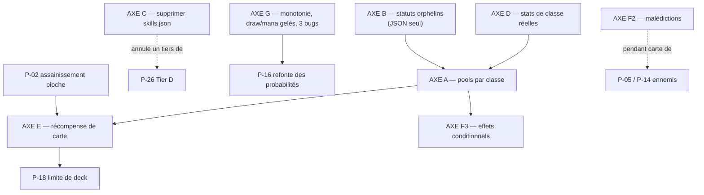

# Brainstorm — Évolution du Roster de Héros & du Catalogue de Cartes

**Date** : 05/08/2026
**Prérequis de lecture** : `05-08-2026_etat_des_lieux_heros_et_cartes_Opus5.md` (même dossier). Ce document n'en répète pas les constats — il en tire les conséquences.
**Statut** : Brainstorm. Concepts, formes mécaniques et recommandations de séquencement. Pas de stats chiffrées d'équilibrage — celles-ci relèveraient d'une spec.
**Convention** : les chantiers `P-xx` renvoient à `docs/ROADMAP.md`. Quand une proposition modifie, absorbe ou annule un `P-xx` existant, c'est signalé explicitement.

---

## 1. Le point de départ, en cinq lignes

L'état des lieux a établi trois choses :

1. **Les trois classes ne se distinguent que par les PV et un passif** — tout le reste est commun, y compris 5 des 7 cartes de départ.
2. **Le catalogue plafonne à 17 communes**, et toute « progression » de carte est une inflation numérique de l'une d'elles. Rien n'élargit, tout amplifie.
3. **Le moteur est en avance sur le contenu** : 3 statuts sur 9, un type de carte sur 4, deux triggers de relique sur neuf et un système de compétences entier sont construits… et vides.

> **Le diagnostic central** : *Hero's Draft* est un deckbuilder dont on ne construit presque pas le deck, joué par des classes qui ne jouent presque pas différemment. Les deux piliers annoncés par le titre sont les deux plus minces.

## 2. Le principe directeur que je propose

**Ne pas ajouter de contenu tant que le contenu existant ne porte pas de décision.**

Une 4ᵉ classe ajoutée aujourd'hui serait une 4ᵉ classe indifférenciée : elle multiplierait le problème au lieu de le résoudre. De même, 20 cartes communes de plus dans un pool partagé n'élargissent pas le deckbuilding — elles diluent le draft.

Les propositions ci-dessous sont donc ordonnées par **ratio décision-créée / coût**, pas par volume de contenu.

---

## 3. AXE A — Donner une identité de classe par le pool de cartes

**C'est la proposition structurante du document. Tout le reste s'y adosse.**

### 3.1. L'idée

Aujourd'hui : `17 cartes globales partagées` + `2 cartes uniques par classe`.
Proposé : `un noyau neutre restreint` + `un pool propre à chaque classe`.

```
                    AUJOURD'HUI                      PROPOSÉ
                 ┌──────────────┐              ┌──────────────┐
   Draft,        │  17 communes │              │ ~8 neutres   │  ← le socle : Frappe,
   boutique,     │   partagées  │              │  (le socle)  │    Défense, utilitaires
   récompenses   └──────┬───────┘              └──────┬───────┘
                        │                             │
                   ┌────┴────┐              ┌─────────┼─────────┐
                   │ 2 cartes│              │ Paladin │ Bersk.  │ Mage
                   │ uniques │              │ ~8-10   │ ~8-10   │ ~8-10
                   └─────────┘              └─────────┴─────────┘
                                             + 2 uniques de signature chacun
```

### 3.2. Pourquoi c'est le meilleur rapport du document

**L'infrastructure existe déjà en totalité.** `CardData.heroClass` est un champ vivant, `CardCategory.characterSpecific` est un enum vivant, et les trois points de filtrage sont des one-liners :

| Point de filtrage | Aujourd'hui | Proposé |
|:---|:---|:---|
| `starter_deck_draft_screen.dart:51-55` | `category == global` | `category == global \|\| heroClass == run.heroClassId` |
| `shop_controller.dart:44-50` | `rarity != unique` | idem + filtre de classe |
| `reward_controller.dart:189-191` | `rarity != unique` | idem + filtre de classe |

**Aucun système nouveau. Aucun modèle modifié. Trois prédicats et du JSON.**

### 3.3. Le point d'architecture à trancher d'abord

⚠️ Aujourd'hui, la rareté `unique` porte **deux sens confondus** :

- « cette carte appartient à une classe » ;
- « cette carte est non-fusionnable, non-achetable, non-tirable ».

Si l'on ajoute des cartes de classe **normales** (fusionnables, achetables, montant en rareté), les deux sens doivent être séparés :

- **`heroClass`** devient le seul porteur de l'appartenance de classe → c'est lui qui filtre les pools.
- **`unique`** reste réservé aux **2 cartes de signature** de chaque classe : celles du deck de départ, non-fusionnables, jamais tirées.

C'est une clarification à faire **avant** d'écrire la première carte de classe, sinon la dette se recreuse immédiatement.

### 3.4. Ce que ça débloque en cascade

- Le draft de départ devient une **décision de classe**, pas un buffet commun.
- La boutique et les récompenses deviennent **thématiques**.
- Les archétypes deviennent possibles : on peut enfin *construire* vers un plan.
- **Absorbe la moitié de P-18** (« restrictions par classe »), qui devient une conséquence de l'axe A plutôt qu'un chantier séparé.

### 3.5. Réserve honnête

C'est **le chantier le plus coûteux en contenu** du document : ~25-30 cartes à écrire, équilibrer, localiser en deux langues et playtester. Le code est trivial ; le design ne l'est pas. C'est un chantier de plusieurs sessions, pas d'une.

---

## 4. AXE B — Les trois statuts orphelins comme signature de classe

**Le meilleur rapport impact / effort de tout le document.**

L'état des lieux a montré que `vulnerable`, `weakness` et `strength_regen` sont **entièrement implémentés** — calcul de dégâts, tick, icône, couleur, panneau HUD, rendu Flame *et* Flutter — et que **rien ne les applique**.

Or ils s'alignent presque parfaitement sur les trois identités déjà écrites dans `heroes.json` :

| Statut orphelin | Effet mécanique existant | Classe | Description `heroes.json` |
|:---|:---|:---|:---|
| `weakness` | −25 % de dégâts infligés par la cible | **Paladin** | « Orienté Survie » |
| `strength_regen` | +Force au début de chaque tour | **Berserker** | « Orienté Dégâts » |
| `vulnerable` | +50 % de dégâts subis par la cible | **Mage** | « Orienté Altération » |

**Coût moteur : zéro.** Ce sont des entrées `apply_status` dans le JSON, exactement comme `poison_stab` aujourd'hui.

Trois observations qui renforcent l'idée :

1. C'est la **seule** façon d'ajouter trois mécaniques ressenties comme neuves sans écrire une ligne de Dart.
2. Le Mage est aujourd'hui « Orienté Altération » **sans posséder une seule carte de classe posant un statut** — `vulnerable` corrige exactement ça.
3. `weakness` est le premier outil **défensif non-armure** du jeu. Les trois passifs produisent de l'armure ; le Paladin n'a aujourd'hui aucun autre levier de survie.

**Recommandation : à faire en premier**, indépendamment de l'axe A, et même si l'axe A n'est jamais fait.

---

## 5. AXE C — Trancher le sort de `skills.json`

Un système mort dans les données coûte plus cher que pas de système : il fausse la lecture, il apparaît dans les sauvegardes, et il attire des chantiers de maintenance sur un cadavre.

### Option 1 — Supprimer *(recommandée)*

Retirer `skills.json`, `SkillData`, `SkillController`, `SkillState`, les deux `executeSkill` et le champ `skills` de la sauvegarde.

- **Gain immédiat** : ~150 lignes de logique morte, un fichier d'assets, un champ de save, un modèle.
- ⚠️ **Effet de bord sur la roadmap** : **P-26 (Tier D) comprend « `SkillData` bilingue »** — c'est même la violation de règle qui justifie la fiche. La suppression **annule ce tiers de P-26** au lieu de le réparer. Ne pas faire P-26 avant d'avoir tranché cet axe, sinon on localise en deux langues un modèle qu'on va supprimer.
- **Risque** : nul. Rien ne l'appelle.

### Option 2 — Ressusciter en « Ultime de classe »

Si l'envie de compétences actives subsiste, **ne pas rebrancher le système tel quel** : il est cassé par conception (dégâts en % d'une attaque qui vaut 0).

La forme que je proposerais à la place : **une capacité de classe chargée par le jeu, pas payée en mana.**

- Une jauge de charge qui monte quand on joue des cartes **de l'affinité de sa classe** (attaques pour le Berserker, compétences pour le Mage — ce qui réutilise le déclencheur de `spellArmor` — cartes défensives pour le Paladin).
- À pleine charge, un effet spectaculaire, une fois par combat.

**Pourquoi pas en mana** : le mana est déjà la ressource la plus fragile de l'équilibrage (**P-16** : « le mana n'est plus une ressource rare »). Ajouter un second consommateur de mana libre aggraverait exactement le problème que P-16 doit corriger.

**Recommandation** : **Option 1 maintenant**, Option 2 comme chantier neuf plus tard s'il est désiré. Ne pas laisser le code actuel en l'état — c'est le pire des trois états.

---

## 6. AXE D — Des stats de classe que le moteur lit vraiment

L'écran de sélection affiche « Attaque 5 / 15 / 10 ». Le moteur démarre à 0. Deux façons de fermer l'écart :

### ❌ Ce que je **ne** recommande pas : rendre `baseDamage` réel

`effectiveAttaque` est ajouté à **chaque** effet `damage`, et **par cible** sur les AoE (`strategies.dart:29, :42`). Un Berserker démarrant à 15 ferait de `sweep` (1 mana, 3 dégâts) une carte à **18 dégâts par ennemi**. C'est très probablement la raison pour laquelle le champ a été neutralisé. Le rétablir casserait le jeu au premier combat.

### ✅ Ce que je recommande : différencier sur les champs déjà câblés

`HeroData` porte déjà `maxMana`, `luck` et `armorMastery` — **tous les trois lus par `startNewRun()`, tous les trois à 0 ou identiques aujourd'hui**. Les utiliser ne coûte que du JSON.

| Classe | Levier proposé | Pourquoi |
|:---|:---|:---|
| **Paladin** | `armorMastery` > 0 | Amplifie son propre passif à chaque fin de tour. Identité « mur » immédiatement lisible. |
| **Mage** | `maxMana` supérieur | Compense structurellement ses 60 PV, permet plus de cartes/tour donc plus de déclenchements de `spellArmor`. **Le seul vrai contrepoids à sa fragilité.** |
| **Berserker** | `critChance` de départ | Champ à ajouter à `HeroData` (`EntityStats.critChance` existe déjà). Colle à « Orienté Dégâts » sans toucher à `attaque`. |

Et **remplacer la colonne « Attaque » de l'écran de sélection** par les stats qui diffèrent réellement. Aujourd'hui cet écran ment au joueur au moment le plus structurant de la run.

> Interaction : **P-20 (« Scaling de `mastery` par classe »)** devient une extension naturelle de cet axe plutôt qu'un chantier isolé.

---

## 7. AXE E — Faire grossir le deck

Aucune récompense de carte après un combat normal. C'est le trou en forme de deckbuilder du jeu : le deck ne bouge quasiment pas entre le draft de départ et la fin de la run.

**Proposition** : un draft de carte post-victoire (3 propositions, refus autorisé) — le standard du genre, et le pendant naturel du `DraftScreen` de stats qui existe déjà.

⚠️ **Deux dépendances strictes** :

1. **P-02 (assainissement de la pioche) d'abord.** `drawCards()` ne remélange jamais la défausse ; un deck plus gros aggrave mécaniquement ce défaut. Ajouter des cartes avant P-02 rendrait le bug plus visible, pas moins.
2. **P-18 (limite de deck) en même temps ou juste après.** Sans plafond, la récompense de carte transforme la run en accumulation, et le taux de pioche des cartes clés s'effondre.

**Le trio A + E + P-18 se tient ou tombe ensemble** : des pools de classe (A) donnent des choix qui valent la peine, la récompense (E) donne l'occasion de choisir, et la limite (P-18) rend le choix coûteux. Livrer E seul, sans A ni P-18, produirait juste des decks gonflés de communes neutres.

---

## 8. AXE F — Élargir l'espace de design des cartes

Le moteur autorise des choses que le catalogue n'utilise pas. Par coût croissant.

### F1 — Le coût 3 *(coût : zéro)*
Aucune carte à 3 mana n'existe, alors que la courbe s'arrête à 2 et que le héros a 3 mana/tour. Une carte à 3 mana est une **carte-tour** : elle crée une décision « tout ou rien » que le catalogue ne propose jamais. Rien à coder.

### F2 — Les cartes `status` (malédictions) *(coût : faible)*
`CardType.status` existe, `canPlayCard()` les bloque déjà à l'usage (`effect_resolver.dart:101`), et `addCardToDiscardPile()` existe pour les injecter. **L'infrastructure est complète, le contenu est nul.**

Une malédiction infligée par un ennemi donne :
- de vrais crocs aux ennemis (aucune intention n'applique quoi que ce soit aujourd'hui) ;
- une raison d'exister à la suppression de carte (feu de camp, purge en boutique), aujourd'hui peu attractive ;
- un levier de difficulté qui ne passe pas par l'inflation de PV.

> Se combine directement avec **P-05** (`onHitEffect`) et **P-14** (variantes d'Élite) côté ennemis. Les malédictions sont le pendant « carte » de ces deux chantiers.

### F3 — Les effets conditionnels et variables *(coût : moyen — travail moteur)*
C'est le levier de profondeur le plus important, et le seul qui demande du Dart.

Aujourd'hui, `CardEffect` est `{type, value, statusId?, duration?}` : une constante. Aucune carte ne peut dire « dégâts égaux à ton armure », « +2 dégâts par PV manquant », « coûte 1 de moins si… ».

**Forme proposée** : un champ optionnel `scaleWith` sur `CardEffect`, résolu par les stratégies existantes.

```jsonc
{ "type": "damage", "value": 0, "scaleWith": "armor",       "ratio": 1.0 }  // Paladin
{ "type": "damage", "value": 4, "scaleWith": "missingHp",   "ratio": 0.2 }  // Berserker
{ "type": "damage", "value": 2, "scaleWith": "targetBurn",  "ratio": 2.0 }  // Mage
```

Pourquoi c'est le bon investissement moteur :
- Il **respecte l'architecture Strategy** existante (ADR-061) : chaque stratégie lit `scaleWith`, aucune n'est réécrite.
- Il donne aux trois classes un axe de scaling **qui leur est propre** — le Berserker qui frappe plus fort en mourant boucle enfin avec `berserkerArmor`, son propre passif.
- Il rend le catalogue **combinatoire** au lieu d'additif : c'est ce qui sépare un deckbuilder d'une liste de cartes.

---

## 9. AXE G — Corrections structurelles

Petites, mais elles faussent les décisions du joueur tant qu'elles sont là.

### G1 — Garantir la monotonie stricte des raretés
Sur 7 des 12 cartes scalables, **une montée de rareté sur deux ne change aucun chiffre** (collisions d'arrondi). Le joueur paie une fusion et ne voit rien.

Correctif proposé, sans toucher aux multiplicateurs ni au JSON :

```dart
// à chaque palier : au minimum +1 par rapport au palier précédent
v = max(round(base * mult[i]), v_precedent + 1);
```

| Base | Aujourd'hui | Corrigé |
|:---:|:---|:---|
| 3 | 3 · **4** · **4** · 5 · 6 | 3 · 4 · 5 · 6 · 7 |
| 4 | 4 · 5 · **6** · **6** · 8 | 4 · 5 · 6 · 7 · 8 |
| 12 | 12 · 14 · 17 · 19 · 24 | *inchangé* |

### G2 — Geler `draw` et `gain_mana` sur la rareté
Le multiplicateur s'applique **à tous les effets** (`effect_resolver.dart:216`). Conséquence : `focus` (0 mana, épuise) devient **+2 mana dès l'épique** — une carte qui rend le double de son coût.

`draw` et `gain_mana` sont les deux effets où « +1 » est un saut de puissance, pas un incrément. **Proposition : restreindre le scaling de rareté à `damage`, `armor`, `heal` et la valeur des statuts.** Une ligne de condition — et une contribution directe à **P-16**, dont c'est précisément le sujet.

### G3 — Les trois bugs de l'état des lieux
- **`enduring` cassée au tier 2+** : `contains('enduring:1')` codé en dur (`deck_controller.dart:188`) → `any((u) => u.startsWith('enduring'))`. Correctif d'une ligne.
- **Duplication des cartes `unique`** : filtrer les trois chemins de clonage (draft post-boss, Miroir de boutique, Miroir de level-up). Déjà signalé `ROADMAP.md:255`.
- **Capacité de forge 1 ↔ 10** : décision à prendre. Si l'axe A est retenu, les cartes de classe cessent d'être un cas particulier et la formule doit être revue globalement.

---

## 10. Si tu ne fais que trois choses

| # | Chantier | Coût | Ce que ça change |
|:---:|:---|:---|:---|
| 1 | **Axe B** — les 3 statuts orphelins comme signature de classe | JSON seul, **zéro Dart** | Trois mécaniques neuves, une identité par classe, immédiatement |
| 2 | **Axe C** — supprimer `skills.json` et sa chaîne morte | ~½ journée | Le dépôt cesse de mentir ; annule un tiers de P-26 |
| 3 | **Axe A** — pools de cartes par classe | **Le gros morceau** | Fait exister le deckbuilding *et* les classes, en même temps |

Les axes B et C peuvent être livrés cette semaine. L'axe A est un engagement de contenu à assumer comme tel.

---

## 11. Séquencement proposé



**Trois vagues :**

1. **Nettoyage et gains gratuits** — B, C, G, D. Que du JSON et des correctifs localisés. Aucune dépendance. Le jeu gagne trois statuts, trois identités de stats et cesse de porter un système mort.
2. **Le chantier de fond** — A, puis E une fois P-02 livré, puis P-18. C'est là que le jeu change de nature.
3. **Profondeur** — F1, F2, F3. F3 est le seul investissement moteur du document ; il n'a de sens qu'une fois A livré, sinon il n'y a pas de cartes à qui donner ces effets.

---

## 12. Ce que je ne recommande pas, et pourquoi

| Idée | Pourquoi non |
|:---|:---|
| **Une 4ᵉ classe** | Tant que les trois existantes ne se distinguent que par les PV, une quatrième serait une quatrième classe indifférenciée. Multiplie le problème au lieu de le résoudre. Après l'axe A, c'est une autre conversation. |
| **Rendre `baseDamage` réel** | `effectiveAttaque` s'ajoute par cible sur les AoE. Un Berserker à 15 ferait de `sweep` une carte à 18 dégâts par ennemi pour 1 mana (§6). |
| **Rebrancher `skills.json` tel quel** | Les dégâts sont un pourcentage d'une attaque qui vaut 0 : le système livrerait des compétences à 0 dégât. Ce n'est pas un branchement, c'est une reconception (§5). |
| **Ajouter des communes neutres au pool actuel** | Diluerait le draft sans créer de décision. Le problème n'est pas le volume du pool, c'est qu'il est partagé et plat. |
| **Faire P-26 avant l'axe C** | Reviendrait à localiser en deux langues un modèle destiné à la suppression. |
| **Livrer l'axe E seul** | Sans pools de classe ni limite de deck, la récompense de carte produit des decks gonflés de communes neutres — elle aggrave la dilution au lieu de la corriger. |

---

*Brainstorm. Aucune stat d'équilibrage chiffrée : elles relèvent d'une spec, après arbitrage sur les axes retenus.*
