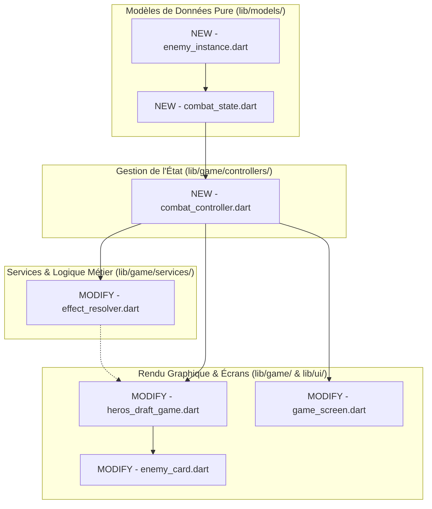

# Plan d'Implémentation - Phase 1 : Refactoring de l'Architecture de Combat (Riverpod & Flame)

Ce plan décrit l'approche technique pour extraire la logique de combat (gestion des ennemis, calculs d'effets de cartes, déroulement des tours) de la couche visuelle de Flame pour la centraliser au sein d'un nouveau contrôleur Riverpod pur.

---

## Objectif de la Phase 1
- **Découpler la Logique du Rendu :** L'état de combat (statistiques des ennemis, intentions, phase de jeu, ciblage) doit être porté de manière exclusive par un contrôleur d'état Riverpod.
- **Rendre les Combats Testables :** Rendre possible l'écriture de tests unitaires purs pour simuler la résolution de cartes et le comportement des ennemis sans instancier Flame.
- **Rendre Flame "Passif" :** Flame doit consommer l'état fourni par Riverpod et réagir aux changements de valeurs en jouant des animations et en mettant à jour ses badges d'interface.

---

## User Review Required

> [!IMPORTANT]
> **Décision de Flux Synchrone/Asynchrone :** 
> Bien que la logique de calcul de dégâts et d'effets soit déplacée dans Riverpod (calculs instantanés), le déclenchement séquentiel des attaques ennemies (la riposte) comporte des animations graphiques cadencées (délai de 400ms par action ennemie).
> 
> *Solution proposée :* L'orchestration temporelle des animations de la riposte reste gérée par Flame (qui effectue la boucle asynchrone `await Future.delayed`), mais à chaque étape de la boucle, Flame invoque la méthode de calcul du contrôleur Riverpod `ref.read(combatProvider.notifier).resolveEnemyIntent(enemyId, ...)` pour appliquer l'effet dans l'état global de manière synchronisée.

---

## Open Questions

> [!NOTE]
> **Persistance :** Souhaitez-vous que l'état de combat Riverpod intègre des fonctions de sérialisation JSON en prévision d'une future sauvegarde/reprise de partie mi-combat (Phase ultérieure) ?
> *Recommandation :* Nous allons inclure les méthodes `toJson()` et `fromJson()` de base dans les nouveaux modèles `EnemyInstance` et `CombatState` pour faciliter cela le moment venu.

---

## Proposed Changes



---

### 1. Couche des Modèles de Données

#### [NEW] [enemy_instance.dart](file:///c:/Users/Gpdac/OneDrive/Documents/GameDev%20and%20Godot/Roguelike%20Card%20Game/roguelike_card_game/lib/models/enemy_instance.dart)
Création d'un modèle purement logique pour représenter un ennemi en combat.
- **Propriétés :**
  - `final String id;` (UUID unique pour l'arène de combat)
  - `final EnemyData data;` (Accès au fichier JSON : nom, sprite, intentions fixes)
  - `final EntityStats stats;` (PV, armure, statuts actifs)
  - `final EnemyIntent? currentIntent;` (L'intention active calculée pour ce tour)
  - `final int intentStep;` (Index pour suivre la liste cyclique d'intentions)
  - `final bool isBoss;`
- **Méthodes :**
  - Constructeur avec UUID automatique.
  - `copyWith(...)` standard.
  - Méthodes `toJson()` et `fromJson()`.

#### [NEW] [combat_state.dart](file:///c:/Users/Gpdac/OneDrive/Documents/GameDev%20and%20Godot/Roguelike%20Card%20Game/roguelike_card_game/lib/models/combat_state.dart)
Modèle représentant l'état global d'un combat en cours.
- **Propriétés :**
  - `final List<EnemyInstance> enemies;` (Liste des ennemis en vie dans le combat)
  - `final TurnPhase turnPhase;` (Enum : `player` ou `enemy`)
  - `final int turnCount;` (Compteur de tours actifs)
  - `final String? selectedEnemyId;` (ID de l'ennemi ciblé par le joueur)
  - `final bool isCombatEnded;`
  - `final bool isVictory;`
- **Méthodes :**
  - Constructeur avec valeurs par défaut.
  - `copyWith(...)` standard.

---

### 2. Couche Gestion de l'État (State Management)

#### [NEW] [combat_controller.dart](file:///c:/Users/Gpdac/OneDrive/Documents/GameDev%20and%20Godot/Roguelike%20Card%20Game/roguelike_card_game/lib/game/controllers/combat_controller.dart)
Définition du `CombatController` étendant `StateNotifier<CombatState>`.
- **Méthodes Principales :**
  - `void initializeCombat(int level, MapNodeType? nodeType, List<EnemyData> availableEnemies)` : Génère les ennemis via `EncounterSystem` et les convertit en `EnemyInstance` avec multiplicateur de niveau appliqué. Calcule la première intention de chaque ennemi.
  - `void selectEnemy(String? enemyId)` : Modifie la cible sélectionnée par le joueur.
  - `void applyPlayerCardPlay(CardInstance card, RunController runController, DeckNotifier deckController)` : Applique le coût en mana, résout les effets de la carte (via `EffectResolver`), décaisse les ennemis morts et met à jour l'état.
  - `void resolveEnemyIntent(String enemyId, RunController runController)` : Applique l'effet de l'intention de l'ennemi ciblé (Dégâts au joueur via `runController.takeDamage`, armure pour l'ennemi lui-même, buffs de force en statut).
  - `void startEnemyTurn()` : Déclenche les statuts de début de tour (Poison, Métallisation) pour *tous les ennemis* d'un coup et applique les modifications de vie dans le state, puis nettoie les morts éventuels.
  - `void endEnemyTurn()` : Réinitialise la phase du combat à `TurnPhase.player`, incrémente le nombre de tours de combat.
  - `void tickEnemyStatuses(String enemyId)` : Décrémente la durée des statuts de l'ennemi.
  - `void rollIntentForEnemy(String enemyId)` : Calcule la prochaine intention de l'ennemi (cyclique ou aléatoire).
- **Fournisseur Riverpod global :**
  - `final combatProvider = StateNotifierProvider<CombatController, CombatState>((ref) => CombatController());`

---

### 3. Services & Logique Métier

#### [MODIFY] [effect_resolver.dart](file:///c:/Users/Gpdac/OneDrive/Documents/GameDev%20and%20Godot/Roguelike%20Card%20Game/roguelike_card_game/lib/game/services/effect_resolver.dart)
Découplage complet de `EffectResolver` vis-à-vis des composants Flame.
- **Changements :**
  - Remplacer le paramètre `List<EnemyCard> enemyCards` par `CombatController combatController` (ou passer une copie mutable des `EnemyInstance` d'un combat).
  - Remplacer le paramètre `EnemyCard? selectedEnemy` par `String? selectedEnemyId`.
  - Effectuer les opérations arithmétiques de dégâts/statuts sur des copies de modèles `EnemyInstance` puis enregistrer les nouvelles valeurs via le `combatController` (ou une méthode utilitaire `combatController.updateEnemyStats(...)`).
  - *Avantage :* Rend la classe `EffectResolver` 100% exécutable dans les tests unitaires.

---

### 4. Interface Utilisateur (Flutter HUD & Flame)

#### [MODIFY] [game_screen.dart](file:///c:/Users/Gpdac/OneDrive/Documents/GameDev%20and%20Godot/Roguelike%20Card%20Game/roguelike_card_game/lib/ui/screens/game_screen.dart)
Adaptation du conteneur de combat Flutter aux nouveaux fournisseurs Riverpod.
- **Changements :**
  - Utiliser `ref.watch(combatProvider)` pour récupérer la liste des ennemis en vie et leurs statistiques afin de générer dynamiquement le panneau HUD des intentions ennemies en bas à droite de l'écran.
  - Adapter les callbacks passés au moteur Flame `HerosDraftGame` : relier l'action de jouer une carte à `combatController.applyPlayerCardPlay(...)`.
  - Gérer l'affichage de l'écran de draft de fin de combat ou de défaite en réagissant directement aux propriétés `isCombatEnded` et `isVictory` de `CombatState`.

#### [MODIFY] [heros_draft_game.dart](file:///c:/Users/Gpdac/OneDrive/Documents/GameDev%20and%20Godot/Roguelike%20Card%20Game/roguelike_card_game/lib/game/heros_draft_game.dart)
Refactoring du moteur Flame pour synchroniser passivement son arène de rendu visuel avec l'état purement Riverpod.
- **Changements :**
  - Réécrire `syncState(RunState)` et y ajouter une méthode `syncCombat(CombatState)`.
  - Dans `update(dt)`, synchroniser la liste `enemyCards` avec `combatState.enemies` :
    - Si un ID d'ennemi présent dans le State n'a pas de composant `EnemyCard` associé -> L'instancier et l'ajouter à l'arène graphique.
    - Si un ID d'ennemi du State a disparu -> Déclencher une animation de mort visuelle et le retirer de l'arène.
  - Dans `_enemyRipostePhase()` : conserver la cinématique asynchrone séquentielle (délai visuel) mais déléguer l'évaluation et l'application des dégâts à Riverpod :
    ```dart
    for (var enemyCard in enemyCards) {
      if (enemyCard.effectiveIntent == null) continue;
      // Jouer l'animation graphique
      enemyCard.dashAnimation(); 
      await Future.delayed(const Duration(milliseconds: 200));
      // Appliquer les calculs dans l'état global Riverpod pur
      ref.read(combatProvider.notifier).resolveEnemyIntent(enemyCard.id, ref.read(runProvider.notifier));
      await Future.delayed(const Duration(milliseconds: 400));
    }
    ```

#### [MODIFY] [enemy_card.dart](file:///c:/Users/Gpdac/OneDrive/Documents/GameDev%20and%20Godot/Roguelike%20Card%20Game/roguelike_card_game/lib/game/components/entities/enemy_card.dart)
Adaptation du composant visuel d'ennemi.
- **Changements :**
  - Retirer le constructeur prenant des `stats` mutables. Passer un identifiant ou directement l'objet immuable `EnemyInstance` extrait du State.
  - Retirer les méthodes de calculs internes comme `startTurn()`, `rollIntent()`, ou `_determineNextIntent()`.
  - Conserver les fonctions de tremblement et flash (`shakeAndFlashAnimation()`) ainsi que les badges d'affichage de texte flottant (`_spawnFloatingText`).
  - Lors de l'appel de `updateStats(EnemyInstance newInstance)`, comparer l'ancien niveau de PV et d'armure avec les nouveaux : si les PV ont diminué -> Invoquer automatiquement `shakeAndFlashAnimation()` et le flottant de dégâts rouge. Si l'armure a diminué -> Lancer le flottant d'armure bleu.

---

## Verification Plan

### Automated Tests
Nous allons enrichir les tests unitaires pour valider les comportements métiers complexes sans charger Flame.
1. **Créer un test unitaire `test/unit/combat_controller_test.dart` :**
   - Inscrire un scénario simulant le début d'un combat avec 2 ennemis.
   - Simuler le jeu d'une carte d'attaque simple (ex: "Strike") sur l'ennemi 1 et vérifier que ses PV diminuent exactement dans le State selon la formule de force globale.
   - Simuler le jeu d'une carte "Poison Stab" et vérifier que le statut Poison est bien cumulé dans `EnemyInstance.stats.statuses`.
   - Simuler la fin de tour et vérifier que le Poison inflige des dégâts autonomes aux PV de l'ennemi lors du déclenchement du début de tour ennemi.
2. **Exécuter la suite complète de tests de l'application :**
   - Lancer la commande de tests de Flutter : `flutter test`
3. **Validation statique :**
   - Lancer `dart analyze` pour valider l'absence de lints ou d'erreurs de syntaxe.

### Manual Verification
1. Lancer le jeu en mode débogage local.
2. Naviguer sur la carte et engager un combat normal.
3. Vérifier que les ennemis apparaissent correctement dans l'arène graphique Flame avec leurs points de vie, armure et intentions de début de combat.
4. Jouer des cartes de types différents (Attaque, Compétence de blocage, Relique active, Effets de Poison/Faiblesse) :
   - Valider que les animations de dégâts (secousses, flash blanc, textes flottants rouges) se déclenchent parfaitement lors des frappes.
   - Valider que le joueur récupère son armure au propre dans le HUD Flutter.
5. Terminer le tour et surveiller le bon déroulement de la riposte ennemie séquentielle (délai fluide, application propre des dégâts sur le joueur).
6. Tuer tous les ennemis et valider la transition automatique vers l'écran de draft ou la carte.
