# Plan d'Implémentation - Phase 2 : Découpage des Écrans Monolithiques (UI Flutter)

Ce plan décrit l'approche technique pour alléger la couche de présentation de **Hero's Draft** en découpant les fichiers monolithiques géants `map_screen.dart` (2300+ lignes) et `game_screen.dart` (1350+ lignes) en sous-composants Flutter modulaires, réutilisables, et testables.

---

## Objectif de la Phase 2
- **Améliorer la Lisibilité :** Diviser les fichiers massifs pour que les interfaces principales fassent moins de 400 lignes de code et respectent le principe de responsabilité unique (SRP).
- **Faciliter la Maintenance :** Isoler les différents panneaux (légende, barre de vie, cristaux de mana, inventaires, probabilités) afin de pouvoir les modifier séparément sans risquer de casser l'écran parent.
- **Optimiser les Rebuilds :** Des widgets isolés et spécialisés permettent à Flutter de reconstruire uniquement les portions d'écran qui changent (ex : mettre à jour le mana sans reconstruire tout l'arrière-plan de l'arène).

---

## User Review Required

> [!IMPORTANT]
> **Consistance Graphique et Partage de Styles :**
> Lors de l'extraction, tous les widgets utiliseront des thèmes harmonieux et des polices premium (comme défini dans `GEMINI.md`). Les widgets de HUD partagent des gradients HSL premiums (comme le dégradé vert-forêt pour les PV ou bleu-cyan pour l'armure).
> 
> *Précision Technique :* Afin d'éviter la duplication de code et d'assurer une parfaite cohésion esthétique, nous utiliserons les icônes existantes (ex : [SwordIcon](file:///c:/Users/Gpdac/OneDrive/Documents/GameDev%20and%20Godot/Roguelike%20Card%20Game/roguelike_card_game/lib/ui/widgets/sword_icon.dart)) au sein de nos nouveaux widgets autonomes.

---

## Open Questions

> [!NOTE]
> **Compatibilité Web :**
> L'écran de la carte utilise un effet de flou dynamique via `BackdropFilter` pour les arrière-plans de modaux. Cette fonction possède un repli automatique (`kIsWeb`) qui bascule sur un fond uni sombre translucide. Nous préserverons cette encapsulation intelligente dans nos nouveaux widgets de dialogue.

---

## Proposed Changes

```mermaid
graph TD
    subgraph "Nouveaux Composants de Carte (lib/ui/widgets/map/)"
        W_MC[NEW - map_connection_painter.dart]
        W_ML[NEW - map_legend.dart]
        W_MN[NEW - map_node_widget.dart]
        W_PP[NEW - player_pawn.dart]
    end

    subgraph "Nouveaux Dialogues de Carte (lib/ui/widgets/map/dialogs/)"
        D_ST[NEW - stats_dialog.dart]
        D_RE[NEW - relics_dialog.dart]
        D_PR[NEW - probabilities_dialog.dart]
    end

    subgraph "Nouveaux Composants HUD Combat (lib/ui/widgets/hud/)"
        H_HB[NEW - player_health_bar.dart]
        H_MI[NEW - mana_indicator.dart]
        H_SE[NEW - status_effects_panel.dart]
        H_EI[NEW - enemy_intents_panel.dart]
        H_PD[NEW - dialogs/pause_dialog.dart]
    end

    subgraph "Écrans Principaux Épurés (lib/ui/screens/)"
        S_MAP[MODIFY - map_screen.dart]
        S_GAME[MODIFY - game_screen.dart]
    end

    W_MC --> S_MAP
    W_ML --> S_MAP
    W_MN --> S_MAP
    W_PP --> S_MAP
    D_ST --> S_MAP
    D_RE --> S_MAP
    D_PR --> S_MAP

    H_HB --> S_GAME
    H_MI --> S_GAME
    H_SE --> S_GAME
    H_EI --> S_GAME
    H_PD --> S_GAME
```

---

### Etape 1 : Refactoring de `map_screen.dart` (Écran de la Carte)

Nous allons diviser `map_screen.dart` en extrayant ses composants internes.

#### [NEW] [map_connection_painter.dart](file:///c:/Users/Gpdac/OneDrive/Documents/GameDev%20and%20Godot/Roguelike%20Card%20Game/roguelike_card_game/lib/ui/widgets/map/map_connection_painter.dart)
Extraction de la classe `MapConnectionPainter` (CustomPainter) qui dessine les lignes en pointillés.
- **Rôle :** Dessiner le graphe de liaisons entre nœuds avec animation de défilement (phase) et surbrillance du chemin choisi.

#### [NEW] [map_legend.dart](file:///c:/Users/Gpdac/OneDrive/Documents/GameDev%20and%20Godot/Roguelike%20Card%20Game/roguelike_card_game/lib/ui/widgets/map/map_legend.dart)
Widget autonome affichant la légende cartographique (icônes et libellés).
- **Rôle :** Affiche le panneau flottant en bas à gauche de la carte de manière modulaire.

#### [NEW] [map_node_widget.dart](file:///c:/Users/Gpdac/OneDrive/Documents/GameDev%20and%20Godot/Roguelike%20Card%20Game/roguelike_card_game/lib/ui/widgets/map/map_node_widget.dart)
Extraction de la classe `_MapNodeWidget` en un widget public réutilisable.
- **Rôle :** Rendre un nœud individuel (icône, couleur animée au survol, état complété, tooltip au clic prolongé).

#### [NEW] [player_pawn.dart](file:///c:/Users/Gpdac/OneDrive/Documents/GameDev%20and%20Godot/Roguelike%20Card%20Game/roguelike_card_game/lib/ui/widgets/map/player_pawn.dart)
Extraction du pion animé du joueur (`_PlayerPawn` et son petit indicateur vectoriel).
- **Rôle :** Rendre le pion joueur glissant de nœud en nœud via un `AnimatedPositioned` avec amortissement élastique.

#### [NEW] [stats_dialog.dart](file:///c:/Users/Gpdac/OneDrive/Documents/GameDev%20and%20Godot/Roguelike%20Card%20Game/roguelike_card_game/lib/ui/widgets/map/dialogs/stats_dialog.dart)
Extraction du panneau modal de statistiques complexes du héros.
- **Rôle :** Rendre les jauges de PV interactives, le mana, les cartes de statistiques (Attaque, Maîtrise, Chance) et la description de l'effet passif actif dans une fenêtre floutée premium.

#### [NEW] [relics_dialog.dart](file:///c:/Users/Gpdac/OneDrive/Documents/GameDev%20and%20Godot/Roguelike%20Card%20Game/roguelike_card_game/lib/ui/widgets/map/dialogs/relics_dialog.dart)
Extraction du modal de gestion d'inventaire de reliques.
- **Rôle :** Rendre une grille adaptative affichant les icônes magiques, descriptions déroulantes, décomptes de stacks et déclencheurs de reliques.

#### [NEW] [probabilities_dialog.dart](file:///c:/Users/Gpdac/OneDrive/Documents/GameDev%20and%20Godot/Roguelike%20Card%20Game/roguelike_card_game/lib/ui/widgets/map/dialogs/probabilities_dialog.dart)
Extraction du modal de probabilités influencé par la statistique Chance.
- **Rôle :** Calculer et afficher sous forme de barres de progression lumineuses comparatives (taux de base vs taux actuel bonifié) les chances de draft, reliques et trésors.

#### [MODIFY] [map_screen.dart](file:///c:/Users/Gpdac/OneDrive/Documents/GameDev%20and%20Godot/Roguelike%20Card%20Game/roguelike_card_game/lib/ui/screens/map_screen.dart)
- **Nettoyage :** Suppression de 2000 lignes de codes inutiles.
- **Changements :** Intégration des widgets extraits. L'écran de la carte devient un simple squelette à base d'`InteractiveViewer` structurant les positions absolues des nœuds et affichant les panneaux flottants.

---

### Etape 2 : Refactoring de `game_screen.dart` (Écran de Combat)

Nous allons diviser le HUD de combat Flutter en widgets spécialisés.

#### [NEW] [player_health_bar.dart](file:///c:/Users/Gpdac/OneDrive/Documents/GameDev%20and%20Godot/Roguelike%20Card%20Game/roguelike_card_game/lib/ui/widgets/hud/player_health_bar.dart)
Extraction de la barre de PV progressive avec superposition d'armure.
- **Rôle :** Affiche la statistique de vie restante (dégradé vert), l'armure superposée (dégradé bleu transparent avec liseré cyan brillant) et le texte dynamique d'affichage. Affiche également à sa gauche les statistiques d'attaque et de défense sous forme d'icônes à masques de dégradés premium.

#### [NEW] [mana_indicator.dart](file:///c:/Users/Gpdac/OneDrive/Documents/GameDev%20and%20Godot/Roguelike%20Card%20Game/roguelike_card_game/lib/ui/widgets/hud/mana_indicator.dart)
Extraction des cristaux de mana diamantés.
- **Rôle :** Rend la ligne de losanges cyan brillants (mana disponible) et blancs translucides (mana consommé) avec ombrages de lueurs néon.

#### [NEW] [status_effects_panel.dart](file:///c:/Users/Gpdac/OneDrive/Documents/GameDev%20and%20Godot/Roguelike%20Card%20Game/roguelike_card_game/lib/ui/widgets/hud/status_effects_panel.dart)
Panneau d'affichage des modificateurs de statut appliqués au héros.
- **Rôle :** Affiche la liste ordonnée des statuts actifs (Poison, Force, Métallisation) avec leurs icônes représentatives et indicateurs de tours restants.

#### [NEW] [enemy_intents_panel.dart](file:///c:/Users/Gpdac/OneDrive/Documents/GameDev%20and%20Godot/Roguelike%20Card%20Game/roguelike_card_game/lib/ui/widgets/hud/enemy_intents_panel.dart)
Panneau listant les ennemis et leurs intentions de combat au propre.
- **Rôle :** Récupère les données d'intention des ennemis (attaques lourdes, blocages, buffs, malédictions) et génère une liste esthétique avec bordures lumineuses adaptées au type d'intention.

#### [NEW] [pause_dialog.dart](file:///c:/Users/Gpdac/OneDrive/Documents/GameDev%20and%20Godot/Roguelike%20Card%20Game/roguelike_card_game/lib/ui/widgets/hud/dialogs/pause_dialog.dart)
Extraction du menu de pause interactif.
- **Rôle :** Modal de pause (mise en pause automatique de Flame, retour au menu ou reprise immédiate).

#### [MODIFY] [game_screen.dart](file:///c:/Users/Gpdac/OneDrive/Documents/GameDev%20and%20Godot/Roguelike%20Card%20Game/roguelike_card_game/lib/ui/screens/game_screen.dart)
- **Nettoyage :** Suppression de 1000 lignes de codes inutiles.
- **Changements :** Importation et déclaration des nouveaux widgets HUD autonomes. Allègement du constructeur `HerosDraftGame` et réorganisation des overlays.

---

## Verification Plan

### Automated Tests
Nous écrirons des tests de widgets Flutter (`flutter_test`) pour valider le bon rendu visuel en isolation complète des écrans monolithiques.
1. **Créer un test de widget `test/widget/player_health_bar_test.dart` :**
   - Instancier le widget `PlayerHealthBar` avec des valeurs figées (ex : 50 PV / 100 Max PV, 20 Armure, 5 Attaque).
   - Vérifier que le texte `"50 / 100 PV"` est correctement rendu à l'écran.
   - Vérifier que la statistique d'attaque affiche `"5"` et l'armure `"20"`.
2. **Créer un test de widget `test/widget/mana_indicator_test.dart` :**
   - Instancier le widget `ManaIndicator` avec 3 cristaux max et 2 cristaux actuels.
   - Compter et valider la présence de 3 icônes `Icons.diamond`.
3. **Exécuter la suite complète de tests de l'application :**
   - Lancer la commande de tests de Flutter : `flutter test`
4. **Validation statique :**
   - Lancer `dart analyze` pour valider l'absence de lints ou d'erreurs de syntaxe sur les nouveaux fichiers de widgets.

### Manual Verification
1. Lancer l'application sur émulateur ou appareil de test.
2. Ouvrir l'écran de la carte (`MapScreen`) :
   - Ouvrir successivement les modaux de **Statistiques**, **Reliques**, et **Probabilités** : vérifier l'intégrité visuelle, les flous d'arrière-plan, et la réactivité au clic.
   - Vérifier que le survol des nœuds de la carte met bien le chemin d'accès en surbrillance sienne fluide.
   - Déplacer le personnage et s'assurer que le pion glisse fidèlement sans saccades.
3. Engager un combat (`GameScreen`) :
   - Vérifier que les cristaux de mana s'éteignent au fur et à mesure que les cartes sont jouées.
   - Vérifier que la jauge de vie verte et la jauge d'armure bleue réagissent en temps réel avec des transitions douces lors des dégâts ou des blocages.
   - Vérifier que le panneau d'intentions ennemies en bas à droite affiche correctement les icônes de sabliers, épées ou boucliers en accord avec les actions prévues.
4. Ouvrir le menu de pause et valider sa fermeture fluide.
