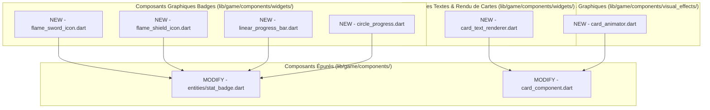

# Plan d'Implémentation - Phase 3 : Modularisation des Composants Flame (UI Flame)

Ce plan décrit l'approche technique pour assainir la couche de rendu graphique **Flame** de **Hero's Draft** en démembrant deux composants géants congestionnés : `stat_badge.dart` (720 lignes) et `card_component.dart` (1030 lignes). Nous allons extraire leurs sous-composants graphiques, leur logique de calcul typographique et leurs générateurs d'effets visuels dans des fichiers isolés et spécialisés.

---

## Objectif de la Phase 3
- **Séparer Rendu et Logique de Dessin :** Désencombrer les composants principaux des calculs trigonométriques, des tracés de chemins vectoriels complexes (Canvas) et de la manipulation brute d'instances de `TextPainter`.
- **Créer des Composants Flame Réutilisables :** Extraire les icônes vectorielles d'épée et de bouclier, ainsi que les barres de vie linéaires ou circulaires, pour pouvoir les réemployer partout dans le jeu (ex : au-dessus des héros, des ennemis ou dans le HUD).
- **Isoler la Gestion des Particules et des Tracés :** Encapsuler la physique des particules (traînées, explosion d'épuisement, lueurs) hors de la classe de carte principale.

---

## User Review Required

> [!WARNING]
> **Sensibilité aux Coordonnées Fixes de Rendu :**
> Dans Flame, le rendu manuel par Canvas (`TextPainter` et `Path`) repose sur des coordonnées géométriques fixes mesurées pixel par pixel (ex : [card_component.dart:L506-568](file:///c:/Users/Gpdac/OneDrive/Documents/GameDev%20and%20Godot/Roguelike%20Card%20Game/roguelike_card_game/lib/game/components/card_component.dart#L506-L568)).
> 
> *Garantie Technique :* Lors de l'extraction de la logique typographique, nous préserverons scrupuleusement ces dimensions physiques et rapports d'ancrage (Anchor) d'origine afin d'éviter tout décalage visuel, distorsion de texte ou chevauchement dans la main ou sur les ennemis.

---

## Open Questions

> [!NOTE]
> **Compatibilité avec le scaleFactor :**
> Les badges de statistiques réagissent dynamiquement au redimensionnement de l'écran via la propriété globale `game.scaleFactor`. Les nouveaux sous-widgets extraits (comme les icônes d'épée ou bouclier) hériteront nativement du système de transformation Flame pour conserver leur taille relative par rapport à l'entité mère.

---

## Proposed Changes

---

### Etape 1 : Modularisation du Badge de Statistiques (`stat_badge.dart`)

Nous allons diviser `stat_badge.dart` en extrayant ses composants internes.

#### [NEW] [flame_sword_icon.dart](file:///c:/Users/Gpdac/OneDrive/Documents/GameDev%20and%20Godot/Roguelike%20Card%20Game/roguelike_card_game/lib/game/components/widgets/flame_sword_icon.dart)
Extraction de la classe `FlameSwordIcon` (PositionComponent).
- **Rôle :** Effectue le tracé vectoriel d'une épée 3D biseautée avec garde incurvée, poignée segmentée en cuir et pommeau circulaire orné d'un joyau.

#### [NEW] [flame_shield_icon.dart](file:///c:/Users/Gpdac/OneDrive/Documents/GameDev%20and%20Godot/Roguelike%20Card%20Game/roguelike_card_game/lib/game/components/widgets/flame_shield_icon.dart)
Extraction de la classe `FlameShieldIcon` (PositionComponent).
- **Rôle :** Effectue le tracé vectoriel d'un bouclier de guerrier biseauté aux couleurs cyan brillant translucides.

#### [NEW] [linear_progress_bar.dart](file:///c:/Users/Gpdac/OneDrive/Documents/GameDev%20and%20Godot/Roguelike%20Card%20Game/roguelike_card_game/lib/game/components/widgets/linear_progress_bar.dart)
Extraction de la classe `LinearProgressBarComponent` (PositionComponent).
- **Rôle :** Dessine la barre de vie horizontale rouge dotée d'un dégradé et superpose la jauge d'armure bleue brillante (avec liseré cyan accent) selon les pourcentages donnés.

#### [NEW] [circle_progress.dart](file:///c:/Users/Gpdac/OneDrive/Documents/GameDev%20and%20Godot/Roguelike%20Card%20Game/roguelike_card_game/lib/game/components/widgets/circle_progress.dart)
Extraction de la classe `CircleProgressComponent` (PositionComponent).
- **Rôle :** Dessine un arc de progression circulaire à partir du haut de l'entité (-90 degrés) pour le rendu des jauges de vie rondes du héros.

#### [MODIFY] [stat_badge.dart](file:///c:/Users/Gpdac/OneDrive/Documents/GameDev%20and%20Godot/Roguelike%20Card%20Game/roguelike_card_game/lib/game/components/entities/stat_badge.dart)
- **Nettoyage :** Suppression de 400 lignes de codes inutiles.
- **Changements :** Le badge devient un simple coordinateur de mise en page. Il mesure les largeurs de textes dynamiques de bonus `Total (Base + Bonus)` avec `TextPainter`, écoute les événements de tap prolongé pour afficher les tooltips et instancie les sous-widgets extraits.

---

### Etape 2 : Modularisation de la Carte de Jeu (`card_component.dart`)

Nous allons alléger `card_component.dart` en externalisant le rendu textuel et l'animation.

#### [NEW] [card_text_renderer.dart](file:///c:/Users/Gpdac/OneDrive/Documents/GameDev%20and%20Godot/Roguelike%20Card%20Game/roguelike_card_game/lib/game/components/widgets/card_text_renderer.dart)
Création d'une classe utilitaire ou d'un composant de rendu spécialisé.
- **Rôle :** Encapsuler la configuration et la peinture des 6 instances de `TextPainter` (Titre, Rareté, Mana, Description, Type, Bandeau "Usage Unique").
- **Fonctionnalités :** 
  - Centraliser les polices, styles d'ombrages, gradients de couleurs selon le type de carte, et espacements.
  - Calculer de manière isolée la mise en page de la description dynamique (qui dépend de la force effective calculée).

#### [NEW] [card_animator.dart](file:///c:/Users/Gpdac/OneDrive/Documents/GameDev%20and%20Godot/Roguelike%20Card%20Game/roguelike_card_game/lib/game/components/visual_effects/card_animator.dart)
Extraction du moteur d'animation cinématique des cartes.
- **Rôle :** Orchestrer les effets visuels de lancers, trajectoires de cartes, explosions de particules et mouvements élastiques.
- **Fonctionnalités :**
  - Gérer l'effet de tremblement de carte impossible à jouer (`shakeAnimation()`).
  - Gérer l'animation spectaculaire de lancer (`playAnimation()`) selon le type (corps-à-corps, projectiles, sorts).
  - Générer les traînées cinématiques (`_spawnTrailParticles()`) et les particules de désintégration par épuisement (`_spawnExhaustParticles()`).
  - Coordonner le retour élastique de la carte en main en cas d'annulation du glissement (`_returnToHand()`).

#### [MODIFY] [card_component.dart](file:///c:/Users/Gpdac/OneDrive/Documents/GameDev%20and%20Godot/Roguelike%20Card%20Game/roguelike_card_game/lib/game/components/card_component.dart)
- **Nettoyage :** Suppression de 600 lignes de codes inutiles.
- **Changements :** `CardComponent` est épuré pour se concentrer uniquement sur les dimensions physiques, les événements de glissement (`DragCallbacks`), de survol (`HoverCallbacks`), de clic (`TapCallbacks`), et délègue les tâches de dessin textuel à `CardTextRenderer` et la cinématique à `CardAnimator`.

---

## Verification Plan

### Automated Tests
Nous allons exécuter la commande de validation statique pour garantir que la modularisation n'introduit aucun problème de couplage ou d'importation manquante.
1. **Validation Statique :**
   - Lancer la commande : `dart analyze` pour valider l'absence de lints ou d'erreurs de syntaxe sur les 6 nouveaux fichiers de widgets et effets Flame.
2. **Exécuter la suite complète de tests de l'application :**
   - Lancer la commande de tests de Flutter : `flutter test` (pour vérifier que les tests unitaires existants sur les cartes et les effets continuent de passer).

### Manual Verification
1. Lancer le jeu en mode débogage.
2. Ouvrir l'écran de combat (`GameScreen`) :
   - Vérifier que les cartes apparaissent en main avec un rendu textuel impeccable (titre, coût, description, rareté bien cadrés et sans décalage géométrique).
   - Prendre une carte d'attaque : la glisser vers le haut, vérifier que la traînée de ruban et la traînée de particules colorées pulsent de manière identique.
   - Glisser la carte vers le bas (zone d'annulation) et la lâcher : valider que l'animation de retour élastique en main se fait en douceur.
   - Tenter de jouer une carte sans avoir assez de mana : vérifier que l'animation de tremblement (shake) se lance sans glitch graphique.
   - Jouer une carte sur un ennemi : valider l'animation de lancer cinématique et, si la carte est à usage unique, vérifier l'animation de désintégration par particules d'épuisement.
3. Vérifier les ennemis et les héros dans l'arène :
   - S'assurer que les barres de vie (linéaires pour les ennemis, circulaires pour le héros) affichent des pourcentages fidèles.
   - S'assurer que les icônes d'épées rouges et de boucliers bleus au-dessus des PV des ennemis se dessinent de manière premium sans pixelisation.
