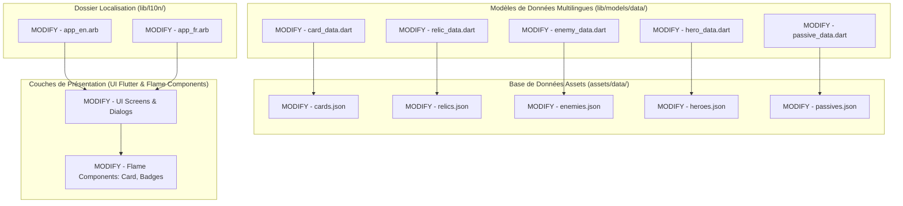

# Plan d'Implémentation - Phase 4 : Remplacement des Chaînes en dur par la Traduction (Localisation)

Ce plan décrit l'approche technique pour internationaliser complètement **Hero's Draft** en éliminant toutes les chaînes de caractères codées en dur, en complétant le support d'internationalisation de Flutter (l10n), en mettant en place un accès dynamique à la traduction dans le moteur Flame, et en structurant les fichiers de données JSON de manière bilingue.

---

## Objectif de la Phase 4
- **Support Bilingue Intégral :** L'interface utilisateur, le plateau de jeu et la base de données du jeu doivent être traduits de manière transparente en français et en anglais selon les paramètres système ou le choix de l'utilisateur.
- **Zéro Chaîne en dur :** Éliminer la totalité des textes codés en dur dans les écrans Flutter, modaux, overlays et indicateurs HUD.
- **Internationalisation Graphique (Flame) :** Mettre en œuvre un système robuste permettant aux composants passifs de Flame d'accéder aux ressources de traduction (`AppLocalizations`) à l'aide de leur référence de contexte de rendu.
- **Base de Données JSON Extensible :** Mettre en place un système de clés multilingues dans les fichiers JSON (cartes, reliques, passifs, ennemis) pour préserver le "Single Source of Truth" (clé mécanique unique pour les calculs de stats mais textes traduits).

---

## User Review Required

> [!IMPORTANT]
> **Choix d'Architecture pour les Fichiers de Données JSON (Cartes & Reliques) :**
> *Approche retenue (Multi-Language JSON Keys) :* Au lieu de dupliquer les fichiers de configuration de cartes et de reliques (ce qui créerait un risque majeur de désynchronisation de l'équilibrage du jeu), nous modifions la structure JSON pour y intégrer des clés localisées au sein du même bloc de données :
> ```json
> {
>   "id": "strike_basic",
>   "name_en": "Strike",
>   "name_fr": "Frappe",
>   "description_en": "Deal 6 damage.",
>   "description_fr": "Inflige 6 dégâts.",
>   "cost": 1,
>   "type": "attack",
>   "effects": [...]
> }
> ```
> *Avantage :* L'équilibrage mécanique (coût, type d'effet, valeur) est unique et centralisé, évitant ainsi toute divergence entre les langues.

---

## Proposed Changes



---

### Etape 1 : Remplissage des Fichiers de Ressources Localisées (ARB)

Nous allons centraliser toutes les chaînes textuelles UI Flutter manquantes dans les fichiers ARB existants.

#### [MODIFY] [app_en.arb](file:///c:/Users/Gpdac/OneDrive/Documents/GameDev%20and%20Godot/Roguelike%20Card%20Game/roguelike_card_game/lib/l10n/app_en.arb) & [app_fr.arb](file:///c:/Users/Gpdac/OneDrive/Documents/GameDev%20and%20Godot/Roguelike%20Card%20Game/roguelike_card_game/lib/l10n/app_fr.arb)
Ajout des clés de traduction manquantes pour :
1. **Écran de la Carte (MapScreen) :**
   - `myDeck` (Mon Deck), `stats` (Stats), `relics` (Reliques), `chances` (Chances), `goldCount` (Compte d'Or).
   - Dialogues : `heroStatsTitle` (Statistiques du Héros), `classPassive` (Effet Passif), `relicInventory` (Inventaire des Reliques), `emptyInventory` (Votre inventaire est vide), `luckPercentageTitle` (Taux d'obtention des Raretés), `currentLuck` (Votre Chance : {luck}).
   - Légendes de carte : `legendTitle` (LÉGENDE), `legendCombat`, `legendElite`, `legendShop`, `legendRest`, `legendEvent`, `legendBoss`.
   - Tooltips de nœuds : `tooltipCombatTitle`, `tooltipCombatDesc`, `tooltipEliteTitle`, `tooltipEliteDesc`, `tooltipShopTitle`, `tooltipShopDesc`, `tooltipRestTitle`, `tooltipRestDesc`, `tooltipEventTitle`, `tooltipEventDesc`, `tooltipBossTitle`, `tooltipBossDesc`.
2. **Écran de Combat (GameScreen) :**
   - `actLevel` (Acte {act} - Niveau : {level}), `playerEffects` (Effets du Joueur), `enemyIntents` (Intentions Ennemies), `noStatusActive` (Aucun effet actif), `waitingIntents` (En attente...), `manaWarning` (Plus de mana.\nTerminer le tour ?), `turnCount` (Tour {count}).
   - Dialogue de pause : `pauseTitle` (PAUSE), `backToMainMenu` (Retour au Menu Principal), `resumeCombat` (Reprendre le Combat).
3. **Badges et types (Moteur Flame) :**
   - `relicTriggerRun` (Début Run), `relicTriggerCombat` (Début Combat), `relicTriggerTurnStart` (Début Tour), `relicTriggerTurnEnd` (Fin Tour), `relicTriggerCardPlayed` (Carte Jouée), `relicTriggerEnemyKilled` (Ennemi Tué).
   - Raretés : `rarityCommon` (Commun), `rarityUncommon` (Peu Commun), `rarityRare` (Rare), `rarityEpic` (Épique), `rarityLegendary` (Légendaire).
   - Tooltips de statistiques : `tooltipHpTitle`, `tooltipHpDesc`, `tooltipArmorTitle`, `tooltipArmorDesc`, `tooltipAttackTitle`, `tooltipAttackDesc`, `tooltipManaTitle`, `tooltipManaDesc`.

---

### Etape 2 : Structuration des Modèles et JSON Bilingues

Nous allons modifier les modèles d'analyse et les fichiers de configuration JSON pour le multilinguisme.

#### [MODIFY] Fichiers JSON (`assets/data/`)
- Mettre à jour `cards.json`, `relics.json`, `enemies.json`, `heroes.json`, et `passives.json`.
- Remplacer les champs `"name"` et `"description"` par `"name_en"`, `"name_fr"`, `"description_en"`, et `"description_fr"`.

#### [MODIFY] Modèles de Données (`lib/models/data/`)
- Mettre à jour `CardData`, `RelicData`, `EnemyData`, `HeroData`, et `PassiveData`.
- **Changements de structure :**
  - Remplacer les champs `final String name;` et `final String description;` par :
    ```dart
    final String nameEn;
    final String nameFr;
    final String descriptionEn;
    final String descriptionFr;
    ```
  - Ajouter des getters helper pratiques :
    ```dart
    String name(String locale) => locale == 'fr' ? nameFr : nameEn;
    String description(String locale) => locale == 'fr' ? descriptionFr : descriptionEn;
    ```
  - Mettre à jour les méthodes `fromJson(...)` pour charger fidèlement les clés suffixées.

---

### Etape 3 : Remplacement des Chaînes dans les Écrans et Dialogues (UI Flutter)

Allègement de la couche UI Flutter en éliminant les textes codés en dur.
- **Changements :**
  - Remplacer toutes les occurrences de textes français ou anglais fixes par `AppLocalizations.of(context)!.nomDeLaCle`.
  - Mettre à jour le formatage à paramètres dynamiques (ex : `AppLocalizations.of(context)!.drawPile(deckState.drawPile.length)`).

---

### Etape 4 : Localisation dans la Couche Graphique (Flame Components)

Mettre en place la traduction dynamique dans les entités autonomes de Flame.
- **Changements :**
  - Dans `CardComponent`, `StatBadge` et `EnemyCard`, utiliser la référence `game` de `HasGameReference<HerosDraftGame>` pour localiser les chaînes.
  - **Méthode d'accès propre :**
    ```dart
    String get activeLocale {
      final context = game.buildContext;
      if (context != null) {
        return Localizations.localeOf(context).languageCode;
      }
      return 'fr'; // Langue par défaut en secours
    }

    String getTranslation(String Function(AppLocalizations) select) {
      final context = game.buildContext;
      if (context != null) {
        final localizations = AppLocalizations.of(context);
        if (localizations != null) {
          return select(localizations);
        }
      }
      return ''; // Chute si non monté
    }
    ```
  - Remplacer les chaînes littérales des tooltips dans `stat_badge.dart` (ex: L400-L428) :
    ```dart
    (String, String) _getTooltipData() {
      if (_customTooltipTitle != null && _customTooltipDescription != null) {
        return (_customTooltipTitle!, _customTooltipDescription!);
      }
      switch (type) {
        case StatType.hp:
          return (
            getTranslation((l) => l.tooltipHpTitle),
            getTranslation((l) => l.tooltipHpDesc)
          );
        ...
    ```
  - Remplacer les descriptifs dynamiques des cartes dans `card_component.dart` pour qu'ils lisent `card.data.description(activeLocale)` à la place du descriptif fixe en français ou en anglais.

---

## Verification Plan

### Automated Tests
Nous enrichirons nos tests unitaires existants pour valider la cohésion de l'analyse multilingue.
1. **Créer un test unitaire `test/unit/localization_test.dart` :**
   - Instancier manuellement une classe `CardData` à partir d'un fragment JSON de test bilingue.
   - Vérifier que `cardData.name('fr')` renvoie fidèlement le titre français (ex: "Frappe") et `cardData.name('en')` le titre anglais ("Strike").
   - Valider la cohérence des descriptions dynamiques selon la langue choisie.
2. **Exécuter la suite complète de tests de l'application :**
   - Lancer la commande : `flutter test`
3. **Validation Statique et Régénération :**
   - Exécuter la commande de génération de Flutter l10n pour régénérer la classe `AppLocalizations` : `flutter gen-l10n`
   - Lancer la commande : `dart analyze` pour valider l'absence de lints ou d'erreurs de syntaxe.

### Manual Verification
1. Lancer l'application.
2. **Test 1 : Langue Système Française**
   - Naviguer sur l'interface : valider que l'intégralité du HUD de combat, les infobulles, les modaux de pause, les noms et descriptifs de reliques/cartes s'affichent impeccablement en **Français**.
   - Ouvrir les tooltips des statistiques des ennemis et valider la traduction française.
3. **Test 2 : Bascule de Langue (Anglais)**
   - Modifier la langue de l'appareil/émulateur en **Anglais** (ou basculer la locale active du projet).
   - Revenir sur le jeu : s'assurer que toutes les chaînes de l'AppBar, la légende, les statistiques, les boutons, les cristaux, les modaux et l'intégralité des cartes et de leurs descriptions dynamiques de combat sont passés de manière fluide et automatique en **Anglais**.
4. Valider l'absence d'erreurs de rendu graphique liées aux différences de longueurs de mots entre le français et l'anglais.
