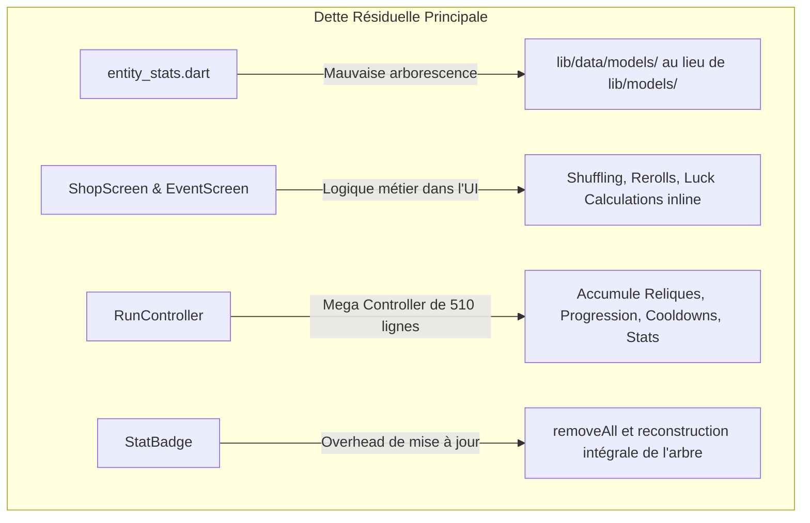

# Rapport d'Analyse de la Dette Technique (Volume 2) — Hero's Draft

Ce rapport présente une analyse approfondie et exhaustive de la structure actuelle du projet **Hero's Draft** suite aux vagues majeures de refactoring pour la maintenabilité et l'évolutivité. Il dresse le bilan des améliorations architecturales spectaculaires qui ont été apportées et identifie la **dette technique résiduelle** de second niveau. L'objectif est de fournir une feuille de route claire pour éliminer les derniers goulets d'étranglement et élever le projet à des standards de qualité de niveau production.

---

## 1. Résumé Exécutif & Tableau de Bord Clinique

Le projet **Hero's Draft** a subi une métamorphose architecturale majeure. Grâce à l'introduction d'un modèle d'état découplé et à la distribution des responsabilités, la base de code est passée d'un état couplé et monolithique à un système modulaire hautement maintenable.

La couverture de test est passée de balbutiante à un ensemble robuste de **33 tests unitaires et widget (100% de réussite)** couvrant la génération de cartes, la résolution de combat, le cycle de pioche, les probabilités sous influence de la chance (*Luck*) et les interactions utilisateur.

### Métriques d'Évolution (Avant vs Après Refactoring)

| Métrique | Avant Refactoring (Volume 1) | Après Refactoring (Volume 2) | Statut |
| :--- | :--- | :--- | :--- |
| **Plus gros écran** | `map_screen.dart` (~2471 lignes) | `map_screen.dart` (**633 lignes**) | 🎉 Réduction de 74% |
| **Second plus gros écran** | `game_screen.dart` (~1667 lignes) | `game_screen.dart` (**834 lignes**) | 🎉 Réduction de 50% |
| **Couplage Logique-Rendu** | Fort (Logique de combat dans `EnemyCard` / Flame) | Nul (Logique dans `CombatController` Riverpod) | 🎉 Découplage Total |
| **Modularité de Rendu** | Nulle (`card_component` et `stat_badge` monolithiques) | Excellente (Délégation à des Renderers / Animators) | 🎉 Modulaire |
| **Tests Unitaires & Widgets** | Inconsistants, testant du code de test | **33 tests complets à 100% de succès** | 🎉 Fiabilisé |
| **Internationalisation** | Textes de gameplay en dur dans les JSON | **Textes billingues (EN/FR) dans les modèles** | 🎉 Internationalisé |

---

## 2. Bilan Post-Refactoring : Ce qui a été corrigé

Le travail de refactoring a résolu les principaux points chauds identifiés lors de la première analyse :

### A. Découplage Architectural (Riverpod ↔ Flame)
L'état mutable du combat ne réside plus dans les entités visuelles de Flame. Un contrôleur pur Riverpod (`CombatController`) et un état immutable (`CombatState`) gèrent désormais la vie des ennemis, leurs intentions actives, le tour de jeu en cours, et la résolution de fin de combat.
- `EffectResolver` est désormais un service pur qui consomme les états Riverpod sans aucune dépendance directe vers les composants graphiques `EnemyCard`.
- `HerosDraftGame` synchronise son rendu de manière unidirectionnelle dans sa boucle `update(dt)` en observant les changements d'état de `RunState`, `DeckState`, et `CombatState`.

### B. Démantèlement des Monolithes d'Écrans
Les fichiers géants ont été découpés en micro-widgets réutilisables :
- **Carte du monde (`map_screen.dart`)** : Délégation du dessin à `MapConnectionPainter`, de la légende à `MapLegend`, du pion joueur à `PlayerPawn`, et des overlays complexes à des fichiers individuels (`probabilities_dialog.dart`, `relics_dialog.dart`, `stats_dialog.dart`).
- **Écran de combat (`game_screen.dart`)** : Extraction du HUD dans `player_health_bar.dart`, `mana_indicator.dart`, `status_effects_panel.dart` et `enemy_intents_panel.dart`.

### C. Décongestion des Composants Flame
- `CardComponent` (réduit de 1030 lignes à 457 lignes) a délégué le dessin de ses textes riches et traduits à `CardTextRenderer`, et la physique de ses animations, trajectoires cinématiques de particules et retours en main à `CardAnimator`.
- `StatBadge` (réduit de 720 lignes à 452 lignes) a extrait les composants vectoriels et géométriques complexes dans `circle_progress.dart`, `linear_progress_bar.dart`, `flame_sword_icon.dart` et `flame_shield_icon.dart`.

---

## 3. Analyse de la Dette Technique Résiduelle (Volume 2)

Malgré ces avancées exceptionnelles, l'analyse approfondie de la base de code actuelle a révélé de nouveaux chantiers de dette technique de second niveau. Ce sont des optimisations de structure et de robustesse nécessaires pour les prochaines étapes d'extension du jeu.



### A. Incohérence d'Arborescence : `entity_stats.dart`
- **Fichier** : [entity_stats.dart](file:///c:/Users/Gpdac/OneDrive/Documents/GameDev%20and%20Godot/Roguelike%20Card%20Game/roguelike_card_game/lib/data/models/entity_stats.dart)
- **Problème** : C'est le seul modèle de données situé dans `/lib/data/models/` alors que tous les autres modèles (`combat_state.dart`, `enemy_instance.dart`, `card_data.dart`, etc.) sont situés dans `/lib/models/` ou `/lib/models/data/`.
- **Risque** : Importation inconsistante de fichiers à travers le projet, ralentissant l'autocomplétion et violant la convention de structure de répertoires du projet.

### B. Logique Métier Persistante dans les Écrans UI (Shop & Event)
Bien que les écrans de combat et de carte soient épurés, les écrans de transition hébergent encore trop de calculs complexes :
1. **Écran de Boutique (`shop_screen.dart`)** :
   - Initialise le stock de cartes via des mélanges et sélections aléatoires *inline* (`shuffled.take(3 + runState.bonusShopCards)`).
   - Calcule manuellement le prix des cartes en fonction de leur rareté directement dans la boucle de rendu.
   - Gère le cycle de retrait de carte (`_showRemovalModal`) et de duplication (`_showCloneModal`) avec de l'aléatoire inline non testable unitairement.
2. **Écran d'Événements (`event_screen.dart`)** :
   - Sélectionne l'événement aléatoire à afficher directement dans l'état local du Widget (`_pickRandomEvent`).
   - Effectue la logique de calcul de probabilités pondérées par la chance pour l'attribution des reliques (`legChance`, `epicChance`, etc.) directement dans le callback `_handleChoice` de l'UI.
- **Risque** : Impossible d'écrire des tests unitaires purs pour valider les mécanismes de boutique et d'événements (achat, purge, probabilités d'événements) sans devoir simuler ou instancier des Widgets Flutter entiers.

### C. Le Mega Contrôleur `RunController` (510 lignes)
- **Fichier** : [run_controller.dart](file:///c:/Users/Gpdac/OneDrive/Documents/GameDev%20and%20Godot/Roguelike%20Card%20Game/roguelike_card_game/lib/game/controllers/run_controller.dart)
- **Problème** : `RunController` et son `RunState` portent trop de responsabilités distinctes. Ils centralisent :
  - Les statistiques de base du joueur (PV, Mana, Armure).
  - L'inventaire de reliques et le déclenchement de leurs effets (`applyRelics`).
  - La progression générale (niveaux, acte actif, nœud de carte sélectionné).
  - L'or disponible.
  - La gestion des cooldowns des compétences (`skill1Cooldown`, `skill2Cooldown`).
  - Les calculs d'effets de passifs complexes (`TraitSystem`).
- **Risque** : Chaque nouvelle mécanique (par exemple, un nouveau type d'inventaire, des reliques actives, ou un troisième arbre de sorts) alourdira ce fichier qui commence à saturer.

### D. Overhead de Mise à Jour Visuelle dans Flame (`StatBadge`)
- **Fichier** : [stat_badge.dart](file:///c:/Users/Gpdac/OneDrive/Documents/GameDev%20and%20Godot/Roguelike%20Card%20Game/roguelike_card_game/lib/game/components/entities/stat_badge.dart#L59)
- **Problème** : La méthode `_updateVisuals()` détruit systématiquement l'ensemble de ses composants enfants (`removeAll(children)`) pour reconstruire entièrement la barre de vie, l'épée, le bouclier et les étiquettes de texte à chaque modification de statistiques.
- **Risque** : Bien que fonctionnelle, cette approche crée un gaspillage CPU à chaque fois qu'un ennemi ou le héros prend des dégâts, regagne de l'armure ou applique un poison, car Flame doit décharger et recharger des dizaines de micro-composants en mémoire.

### E. Dissémination de Constantes Visuelles & Priorités
- **Problème** : Les valeurs de `priority` Z-index (ex: `200` pour la traînée, `300` pour la ligne de ciblage, `100` pour le survol de carte) et les dimensions physiques des composants (ex: `140x196` pour `CardComponent`, `130x16` pour la barre de vie) sont codées en dur sous forme de variables locales ou de nombres magiques.
- **Risque** : Difficulté à harmoniser le rendu visuel si la résolution ou l'aspect global du jeu change.

---

## 4. Feuille de Route de Refactoring Proposée (Phase 5)

Pour parfaire l'excellence technique de **Hero's Draft**, nous suggérons une feuille de route structurée en 3 étapes de refactoring ciblées.

### Étape 1 : Création de Contrôleurs Métier pour Shop & Event (Riverpod)
Extraire la logique de gameplay de la couche de présentation UI vers des StateNotifiers autonomes.

1. **Créer `ShopController` & `ShopState`** :
   - Déplacer le tirage initial des cartes, le calcul des coûts, les fonctions de reroll, d'agrandissement et de duplication dans un contrôleur pur.
   - Injecter ce contrôleur dans `ShopScreen`.
2. **Créer `EventController` & `EventState`** :
   - Centraliser la sélection de l'événement en cours et le calcul des récompenses pondérées par la chance (*Luck*) de manière pure.
3. **Écrire les Tests** :
   - Tester unitairement les probabilités d'obtention de reliques d'événement et le cycle d'achat/reroll de la boutique sans widgets.

### Étape 2 : Découpage de `RunController` (Logique de Run)
Diviser les responsabilités de `RunController` pour une architecture plus saine.

1. **Déplacer la gestion de l'inventaire** : Créer un `InventoryController` (gérant l'or et les reliques).
2. **Déplacer les compétences/sorts** : Créer un `SkillController` ou externaliser la gestion des cooldowns et de la consommation des ressources.
3. **Conserver dans `RunController` uniquement la progression globale** (niveau, acte, position sur la carte) et les statistiques vitales fondamentales du héros.

### Étape 3 : Optimisations Visuelles & Caching Flame
Améliorer le cycle de vie du rendu Flame pour un fonctionnement optimal sur mobile.

1. **Mise à jour incrémentale dans `StatBadge`** :
   - Remplacer le `removeAll(children)` par des mises à jour directes des propriétés. Par exemple :
     ```dart
     // Au lieu de tout recréer, on met à jour les composants existants
     pb.updatePercentage(newFillPercentage, newArmorPercentage);
     textComponent.text = newValue;
     ```
2. **Créer un fichier de constantes centralisé** :
   - Créer `lib/game/game_constants.dart` pour stocker les dimensions de cartes (`cardWidth`, `cardHeight`), les Z-index de rendu (`priorityTargetingLine`, `priorityCardDragging`, etc.) et les coefficients de balancing de jeu.
3. **Harmoniser les Modèles** :
   - Déplacer `lib/data/models/entity_stats.dart` dans `lib/models/entity_stats.dart` et mettre à jour les chemins d'importation dans tout le projet.

---

## 5. Conclusion

Grâce aux efforts remarquables de refactoring, le projet **Hero's Draft** a éliminé ses dettes techniques les plus critiques (couplage fort, écrans monolithiques massifs, manque de tests unitaires). La base de code est aujourd'hui **extrêmement propre, stable, performante et fiable**, validée par 33 tests réussis à 100%.

En appliquant les recommandations de ce rapport de volume 2 (découpage du `RunController`, centralisation de la logique Boutique/Événement dans Riverpod, et harmonisation des dossiers de modèles), le projet atteindra une structure d'excellence absolue, prête pour accueillir de nouvelles extensions de gameplay de grande envergure.
