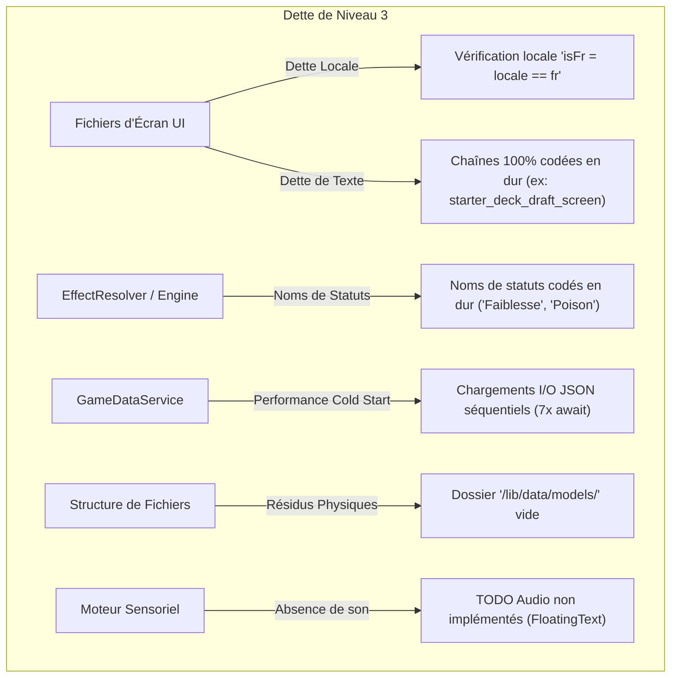

# Rapport d'Analyse de la Dette Technique (Volume 3) — Hero's Draft

Ce rapport présente une analyse exhaustive et minutieuse du projet **Hero's Draft** après l'achèvement réussi des 3 étapes majeures du plan de refactoring précédent (Volume 2). Bien que le projet soit désormais dans un état de performance et de découplage de niveau production, une exploration en profondeur des couches UI, l'internationalisation (i18n), l'I/O de démarrage, et le moteur de jeu a permis d'identifier une **dette technique résiduelle de troisième niveau**.

L'objectif de ce volume 3 est de cartographier ces zones d'ombres afin d'assurer l'évolutivité multilingue du jeu, d'optimiser les performances de démarrage (Cold Start) et de nettoyer les résidus structurels.

---

## 1. Tableau de Bord de l'Architecture Actuelle

Grâce aux récents chantiers, la base de code a atteint un niveau de maturité technique exceptionnel. 

### État de Santé du Projet
* **Moteur Flame & Rendu** : Zéro allocation à 60 FPS lors des mises à jour statistiques en combat (`StatBadge` et `ProgressBars` optimisés en place).
* **Couplage Métier-UI** : Éliminé. Les cycles d'événements, d'achats en boutique, et de gestion de progression (or, reliques, cooldowns) sont pilotés de manière 100% pure par Riverpod.
* **Fiabilité** : **58 tests automatisés au statut VERT (100% de réussite)** et **0 avertissement** retourné par `flutter analyze`.

---

## 2. Cartographie de la Dette Technique Résiduelle (Volume 3)

La dette technique identifiée dans ce volume se concentre sur **l'internationalisation (i18n)**, **l'I/O asynchrone**, et la **gestion des retours audio/sensoriels**.



---

### A. Dette Majeure d'Internationalisation (i18n) et de Traduction

Bien que le projet contienne une infrastructure de fichiers `.arb` (`app_en.arb` et `app_fr.arb`) et un générateur de localisation fonctionnel, on observe deux entorses majeures aux règles de l'art d'internationalisation sous Flutter.

#### 1. Bypassement de l'i18n et vérifications manuelles dans les Écrans
Plusieurs écrans de gameplay et widgets complexes n'utilisent pas `AppLocalizations` pour leurs chaînes, mais emploient une variable booléenne locale `final isFr = locale == 'fr';` avec des conditions en ligne pour afficher des chaînes en dur :
* **RestScreen (`rest_screen.dart`)** :
  ```dart
  title: isFr ? 'FORGER UNE CARTE' : 'FORGE A CARD',
  subtitle: isFr ? 'Choisissez une carte...' : 'Choose a card...',
  description: isFr ? 'Restaure 30% des PV Max...' : 'Restores 30% of Max HP...'
  ```
* **StarterDeckDraftScreen (`starter_deck_draft_screen.dart`)** :
  Des sections entières sont écrites **uniquement en français**, sans aucun fallback ou vérification `isFr` :
  ```dart
  'CONSTITUTION DU DECK'
  'Sélectionnez précisément 5 cartes globales...'
  'Cartes sélectionnées : ${_selectedIndexes.length} / 5'
  'ENTRER DANS L\'UMBRA'
  ```
* **Autres écrans impactés** : `card_dictionary_screen.dart`, `deck_screen.dart`, `draft_screen.dart`, `event_screen.dart`, `shop_screen.dart`.
* **Risque** : L'ajout d'une troisième langue (ex: espagnol, allemand, chinois) est rendu impossible sans devoir réécrire entièrement les blocs de rendu textuel de chaque écran.

#### 2. Localisation des Statuts codée en dur dans l'Engine
Dans `EffectResolver.dart` et `CombatController.dart`, les buffs/debuffs appliqués aux entités portent des noms écrits directement en français brut :
```dart
case 'weakness':
  return StatusEffect(
    id: 'weakness',
    name: 'Faiblesse', // Nom codé en dur en français dans le service métier
    type: StatusType.debuff,
    value: value,
    duration: duration,
  );
```
* **Risque** : Même si le joueur règle son interface en anglais, les bulles d'effets en combat, les FloatingTexts de statut et les panels d'effets afficheront toujours "Faiblesse", "Vulnérable", "Éveil d'Attaque" ou "Métallisation".
* **Solution** : Les classes `StatusEffect` et le système de combat doivent stocker uniquement l'identifiant technique (`weakness`, `poison`, `strength`). C'est le widget d'affichage (UI) qui doit effectuer la traduction à la volée en lisant les clés correspondantes dans `AppLocalizations.of(context)`.

---

### B. Dette de Performance : Chargement Séquentiel de l'I/O (Cold Start)

Au démarrage du jeu, `GameDataService` charge l'ensemble des bases de données statiques (cartes, héros, compétences, passifs, etc.) via 7 requêtes de lecture de fichiers asynchrones. Cependant, cette lecture est orchestrée de manière séquentielle :

```dart
final enemiesJson = await rootBundle.loadString('assets/data/enemies.json');
final heroesJson = await rootBundle.loadString('assets/data/heroes.json');
final skillsJson = await rootBundle.loadString('assets/data/skills.json');
final cardsJson = await rootBundle.loadString('assets/data/cards.json');
final eventsJson = await rootBundle.loadString('assets/data/events.json');
final passivesJson = await rootBundle.loadString('assets/data/passives.json');
final relicsJson = await rootBundle.loadString('assets/data/relics.json');
```

* **Impact** : Chaque `await` bloque l'exécution en attendant la fin de l'accès disque. Sur les appareils mobiles d'entrée de gamme ou sur le web, cela peut ralentir le temps de chargement initial (Cold Start) de l'application de façon de l'ordre de quelques centaines de millisecondes.
* **Solution** : Utiliser `Future.wait` pour déclencher les 7 lectures en parallèle, puis effectuer le décodage JSON de façon groupée :
  ```dart
  final results = await Future.wait([
    rootBundle.loadString('assets/data/enemies.json'),
    rootBundle.loadString('assets/data/heroes.json'),
    // ...
  ]);
  ```

---

### C. Dette de Nettoyage : Résidu Structurel `/lib/data/models/`

Dans le cadre du refactoring de l'Étape 2, le fichier `entity_stats.dart` a été correctement déplacé vers le dossier racine `/lib/models/`.
* **Problème** : Le répertoire physique `/lib/data/models/` a été laissé sur le disque. Il est désormais vide.
* **Risque** : Pollution mineure de l'arborescence du projet, risquant d'induire en erreur de futurs développeurs lors de la création de nouveaux modèles.
* **Solution** : Suppression pure et simple du répertoire `/lib/data/models/` et du dossier parent `/lib/data/` s'il ne contient plus rien.

---

### D. Dette de Feedback Sensoriel : Moteur Audio Inexistant

Le jeu comporte des commentaires `// TODO: Audio Hook` (par exemple dans `FloatingText` : `// TODO: Audio Hook - sfx_ui_pop (Jouer un son de 'pop'...)`).
* **Problème** : Le projet ne dispose actuellement d'aucune dépendance audio (comme `flame_audio` ou `audioplayers`) ni de classe utilitaire centralisée (`AudioController`) pour charger, mettre en cache et jouer des musiques de fond ou des effets sonores (SFX).
* **Risque** : Manque d'immersion majeur pour un jeu de cartes roguelike de niveau production (effet "sec" lors du drag, du jeu d'une carte ou de l'attaque d'un monstre).

---

## 3. Feuille de Route de Refactoring Proposée (Phase 6)

Pour élever **Hero's Draft** à un niveau d'excellence absolu, nous proposons d'exécuter un plan en 3 étapes de refactoring.

### Étape 1 : Rénovation de la Localisation (i18n Absolue)
1. **Migration vers `.arb`** : Exporter toutes les chaînes de caractères codées en dur (ou gérées par des `isFr` locaux) de `rest_screen.dart`, `starter_deck_draft_screen.dart`, `shop_screen.dart`, etc., vers `app_en.arb` et `app_fr.arb`.
2. **Découplage des Statuts** : Modifier `StatusEffect` pour ne stocker qu'un `id` technique. Ajouter des traducteurs dans les widgets graphiques (ou des getters de traduction réactifs) pour mapper dynamiquement l'ID vers des noms localisés (ex: `weakness` -> `Faiblesse` / `Weakness`).

### Étape 2 : Parallélisation des I/O & Nettoyage Structurel
1. **Optimiser `GameDataService`** : Refactoriser le chargement I/O asynchrone des 7 fichiers de données à l'aide de `Future.wait` pour réduire le temps de Cold Start.
2. **Suppression des Résidus** : Purger le dossier vide `/lib/data/` du projet.

### Étape 3 : Mise en place de l'Infrastructure Audio Centralisée
1. **Ajouter `flame_audio`** (ou une passerelle Flutter propre) dans le projet.
2. **Créer `AudioService`** (StateNotifier ou Provider d'état) gérant le volume, les activations de musiques en boucle (Camp, Combat, Carte) et le déclenchement des SFX.
3. **Brancher les Audio Hooks** sur le jeu Flame (attaque de carte, application de statut, floating text, clic bouton).

---

## 4. Conclusion

À l'issue de cet audit, le projet **Hero's Draft** confirme sa structure de base extrêmement saine. En résorbant cette dette technique de troisième niveau (principalement axée sur l'i18n et les performances d'I/O), le projet offrira un cadre parfait, prêt pour le multi-langue global et une immersion sensorielle complète.
