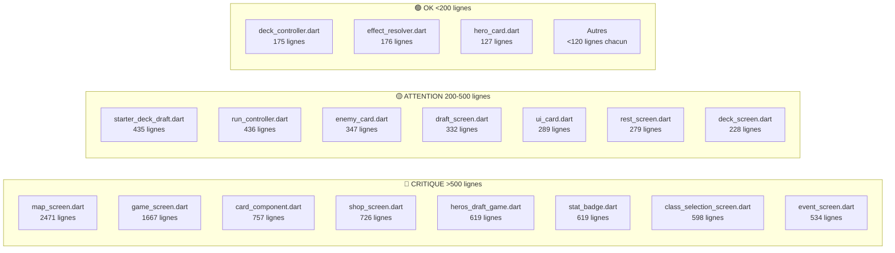
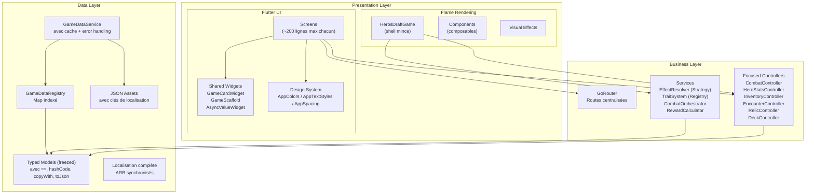

# 🔍 Rapport de Dette Technique — Hero's Draft

> **Projet** : Hero's Draft — Roguelike Card Game  
> **Stack** : Flutter + Flame + Riverpod  
> **Date** : 25 Mai 2026  
> **Fichiers analysés** : 45 fichiers source, 8 fichiers de test, 7 fichiers JSON  
> **Résultat `dart analyze`** : ✅ 0 erreurs statiques

---

## 📊 Vue d'ensemble du projet

| Métrique | Valeur |
|---|---|
| **Lignes de code totales (lib/)** | ~8 200 lignes |
| **Plus gros fichier** | `map_screen.dart` — **2 471 lignes** |
| **2ème plus gros fichier** | `game_screen.dart` — **1 667 lignes** |
| **Fichiers sans tests** | 9 écrans sur 12, 0 composant Flame testé |
| **Couverture estimée** | **~15-20%** de la logique métier |
| **Nombre de God Classes** | 5 identifiées (critique) |
| **Nombre de constantes magiques** | **100+** réparties dans tout le projet |

### Cartographie des fichiers par taille



---

## 🏗️ Section 1 : Architecture & God Classes

> [!CAUTION]
> 5 fichiers constituent des « God Classes » qui concentrent trop de responsabilités. Leur refactoring est la priorité n°1.

### 1.1 `map_screen.dart` — 2 471 lignes 🔴

**Fichier** : [map_screen.dart](file:///c:/Users/Gpdac/OneDrive/Documents/GameDev%20and%20Godot/Roguelike%20Card%20Game/roguelike_card_game/lib/ui/screens/map_screen.dart)

**Responsabilités actuelles (devrait être 1, en a 10+) :**
- Rendu de la carte complète
- Widgets de nœuds (combat, boutique, événement, repos, boss)
- Dessin des connexions/chemins entre nœuds
- Indicateurs d'étage
- Gestion du scroll et zoom
- 6 `AnimationController` manuels (`_pulseController`, `_pathController`, `_nodeRevealController`, `_fogController`, `_tooltipController`, `_heroMarkerController`)
- Tooltips overlay
- Panneau légende
- Modal de prévisualisation d'encounter
- Validation de la traversée de carte
- Vérification d'accessibilité des nœuds
- Logique de progression d'étage

**Problèmes identifiés :**

| Problème | Sévérité | Détails |
|---|---|---|
| Multiples classes dans un seul fichier | 🔴 Critique | `MapScreen`, `_MapScreenState`, `_MapNode`, `_MapConnection`, `_NodeTooltip`, `_FloorIndicator`, `_MapLegend` et d'autres, tous dans un fichier |
| Logique métier dans l'UI | 🔴 Critique | Validation de traversée, accessibilité des nœuds, path finding, setup d'encounter (~L800-950, ~L1200-1400) |
| Méthode `build()` géante | 🔴 Critique | ~150 lignes de widgets imbriqués |
| Positionnement absolu | 🟡 Important | Utilise `Positioned` avec des offsets hardcodés — cassera sur différentes tailles d'écran |
| Navigation couplée | 🟡 Important | `Navigator.pushReplacement` direct en ~5 endroits |
| Duplication du rendu de nœuds | 🟡 Important | Logique de rendu répétée pour chaque type de nœud avec des variations mineures (~L600-800) |
| 6 AnimationControllers | 🟡 Important | Gestion de lifecycle manuelle extrêmement fragile |

**Refactoring proposé :**
```
map_screen.dart (2471 lignes) → 
├── map_screen.dart (~150 lignes - shell)
├── map_controller.dart (~200 lignes - logique métier)
├── widgets/
│   ├── map_node_widget.dart (~150 lignes)
│   ├── map_connection_painter.dart (~100 lignes)
│   ├── map_legend.dart (~80 lignes)
│   ├── map_tooltip.dart (~80 lignes)
│   ├── floor_indicator.dart (~60 lignes)
│   └── encounter_preview.dart (~100 lignes)
└── map_animations_mixin.dart (~150 lignes)
```

---

### 1.2 `game_screen.dart` — 1 667 lignes 🔴

**Fichier** : [game_screen.dart](file:///c:/Users/Gpdac/OneDrive/Documents/GameDev%20and%20Godot/Roguelike%20Card%20Game/roguelike_card_game/lib/ui/screens/game_screen.dart)

**Responsabilités actuelles :**
- Embedding du jeu Flame
- HUD de combat complet
- Indicateurs de tour
- Overlay de pause
- Overlay de récompenses
- Overlay de mort
- Feedback de jeu de cartes
- Affichage des intentions ennemies
- Indicateurs de buffs/debuffs
- Affichage du mana et de la santé
- Log de combat

**Problèmes identifiés :**

| Problème | Sévérité | Détails |
|---|---|---|
| 5+ overlays privés dans le fichier | 🔴 Critique | `_PauseOverlay`, `_RewardOverlay`, `_DeathOverlay`, `_CardRewardOverlay`, `_TurnBanner` — chacun devrait être un fichier séparé |
| `ConsumerStatefulWidget` surchargé | 🔴 Critique | Gère la phase de tour, l'état des récompenses, la pause, la sélection de cartes, le ciblage ennemi, les transitions d'overlay |
| Anti-patterns Riverpod | 🟡 Important | Multiples `ref.watch` + `ref.listen` sur le même provider (~L150-200), abus de `ref.read` dans les callbacks |
| Logique métier dans l'UI | 🟡 Important | Logique de fin de tour (~L350-400), calcul et distribution des récompenses (~L950-1050), vérification de mort (~L1100-1150) |
| 4+ AnimationControllers | 🟡 Important | Bannières de tour, animations de récompense, effets d'écran de mort |
| `const` manquants | 🟢 Mineur | De nombreux sous-arbres de widgets qui pourraient être `const` ne le sont pas (~L300-500) |

**Refactoring proposé :**
```
game_screen.dart (1667 lignes) →
├── game_screen.dart (~200 lignes - shell)
├── widgets/
│   ├── combat_hud.dart (~200 lignes)
│   ├── pause_overlay.dart (~100 lignes)
│   ├── reward_overlay.dart (~150 lignes)
│   ├── death_overlay.dart (~100 lignes)
│   ├── card_reward_overlay.dart (~150 lignes)
│   ├── turn_banner.dart (~80 lignes)
│   └── combat_log.dart (~80 lignes)
└── game_screen_controller.dart (~150 lignes)
```

---

### 1.3 `heros_draft_game.dart` — 775 lignes 🔴

**Fichier** : [heros_draft_game.dart](file:///c:/Users/Gpdac/OneDrive/Documents/GameDev%20and%20Godot/Roguelike%20Card%20Game/roguelike_card_game/lib/game/heros_draft_game.dart)

**Responsabilités actuelles (10+) :**
- UI Input (hover/focus/drag coordination) — L82-175
- Asset loading & JSON parsing — L227-281
- Entity spawning — L477-526
- Layout/positioning — L383-436, L528-541
- Turn execution & combat logic — L575-768
- 12 callback functions bridging Flame → Riverpod (L54-66)
- Orchestration du combat
- Logique de récompenses
- IA ennemie
- Effets visuels
- Ciblage
- Setup d'encounter

**Méthodes critiques trop longues :**

| Méthode | Lignes | Responsabilité |
|---|---|---|
| `executeSkill()` | 88 lignes (L595-683) | Logique métier pure (calcul de dégâts) dans une classe Flame — **viole les règles du GEMINI.md** |
| `_enemyRipostePhase()` | 84 lignes (L685-769) | Animation + combat + status effects + turn state mélangés |
| `syncState` | ~90 lignes (~L132-220) | Sync bidirectionnelle Riverpod |

**Problèmes :**

| Problème | Sévérité |
|---|---|
| **12 callbacks dans le constructeur** (`onPlayerTakeDamage`, `onPlayerHeal`, `onPlayerGainArmor`, `onEnemiesDead`, etc.) — extrême couplage | 🔴 |
| Couplage fort avec Riverpod — `ref` accédé directement en 20+ endroits | 🔴 |
| ~40 occurrences de nombres magiques (voir tableau détaillé Section 9.2) | 🔴 |
| `_enemyRipostePhase` utilise 5× `Future.delayed` séquentiels totalisant **1500ms de délais hardcodés** par ennemi | 🟡 |
| Boss HP/ATK multiplié par `3.0` (L494), Elite par `1.5` (L496) — constantes de balancing inline | 🟡 |
| Recherche du background par itération de TOUS les children (L296-298) — devrait être une référence directe | 🟡 |
| Code commenté/mort aux lignes ~580-595 avec marqueur `// TODO: remove` | 🟡 |
| Zéro `try/catch` dans toutes les méthodes `async` | 🔴 |
| Fuite mémoire potentielle — `removeAll` sans vérification de `onRemove`, pas de cleanup `onDetach`/`onGameResize` | 🟡 |

**Refactoring proposé :**
```
heros_draft_game.dart (775 lignes) →
├── heros_draft_game.dart (~100 lignes - shell)
├── combat_system.dart (~150 lignes - combat + damage calculation)
├── hand_layout_manager.dart (~80 lignes)
├── entity_spawner.dart (~80 lignes)
├── asset_preloader.dart (~50 lignes)
└── event_bus.dart (~50 lignes - remplace les 12 callbacks)
```

---

### 1.4 `card_component.dart` — 1 031 lignes 🔴

**Fichier** : [card_component.dart](file:///c:/Users/Gpdac/OneDrive/Documents/GameDev%20and%20Godot/Roguelike%20Card%20Game/roguelike_card_game/lib/game/components/card_component.dart)

| Problème | Sévérité | Détails |
|---|---|---|
| God Component | 🔴 | Gère rendu, drag/drop, ciblage, animation hover, glow, ombre, tooltip, logique de jeu de carte, vérification mana, dispatch d'effet, son |
| `refreshVisuals()` — 123 lignes (L113-236) | 🔴 | Recrée les 7 `TextPainter` à chaque appel. Appelé sur hover enter/exit, drag start/update/end, tap, changement d'opacité, resize |
| `render()` — 116 lignes (L456-572) | 🔴 | Dessin Canvas entièrement manuel |
| `_buildDescription()` — 55 lignes (L398-453) | 🟡 | Chaînes françaises hardcodées avec switch/if géant pour chaque type d'effet |
| Spam de particules pendant le drag | 🟡 | `_spawnTrailParticles()` appelé **chaque frame** pendant le drag (depuis `update()`), créant 3 `ParticleSystemComponent` par frame = **180 systèmes de particules/seconde** à 60fps |
| `borderPaint` — **Dead state** | 🟡 | Champ `Paint` muté dans les animations (L836, 915, 948, 969, 729) mais **jamais lu dans `render()`** qui crée son propre `bPaint` local (L487) |
| Accès Riverpod direct | 🟡 | `game.currentRunState` accédé directement (L54, L400) |
| 5 types d'animations différents | 🟡 | melee, magic, buff, poison/fire/ice/lightning, status — tous inline (L787-965) |
| Nombres magiques | 🟡 | Dimensions `140×196` (L282-283), offsets `14`/`20`/`32`/`42`/`62`/`150`/`175`, cancel zone `0.68` (L632), card priority `200`/`790` |

**Refactoring proposé :**
```
card_component.dart (1031 lignes) →
├── card_component.dart (~150 lignes - shell)
├── card_renderer.dart (~200 lignes)
├── card_animation_controller.dart (~200 lignes)
├── card_description_builder.dart (~80 lignes - data-driven)
└── card_interaction_handler.dart (~150 lignes - drag/drop/hover)
```

---

### 1.5 `stat_badge.dart` — 720 lignes (5 classes dans 1 fichier) 🔴

**Fichier** : [stat_badge.dart](file:///c:/Users/Gpdac/OneDrive/Documents/GameDev%20and%20Godot/Roguelike%20Card%20Game/roguelike_card_game/lib/game/components/entities/stat_badge.dart)

**Classes contenues :**
- `StatBadge` (L8-428) — Composant principal
- `CircleProgressComponent` (L430-456)
- `LinearProgressBarComponent` (L458-556)
- `FlameSwordIcon` (L558-651) — 93 lignes de dessin vectoriel d'épée
- `FlameShieldIcon` (L654-719) — 65 lignes de dessin vectoriel de bouclier

| Problème | Sévérité | Détails |
|---|---|---|
| Monolithe — 5 classes dans 1 fichier | 🔴 | Chaque classe devrait être un fichier séparé |
| `_updateVisuals()` — **281 lignes** God method (L54-335) | 🔴 | Utilise `removeAll(children)` à chaque update, détruisant et recréant l'arbre de composants entier — **extrêmement coûteux** pour un simple changement de valeur texte |
| Interpolation de chaînes par frame | 🟡 | `render()` fait `'$currentHp / $maxHp'` chaque frame — devrait être caché |
| Angles hardcodés au lieu de constantes `pi` | 🟡 | `-1.5708`, `6.28319` (L450-451) au lieu de `pi/2`, `2*pi` de `dart:math` |
| Nombres magiques | 🟡 | `36`, `130`, `16`, `48`, `22` — dimensions de badge dispersées |

---

## 🧠 Section 2 : State Management

> [!WARNING]
> L'état mutable et les structures non-typées (`Map<String, dynamic>`) représentent un risque majeur de bugs silencieux.

### 2.1 `run_controller.dart` — 436 lignes 🔴

**Fichier** : [run_controller.dart](file:///c:/Users/Gpdac/OneDrive/Documents/GameDev%20and%20Godot/Roguelike%20Card%20Game/roguelike_card_game/lib/game/controllers/run_controller.dart)

| Problème | Sévérité | Détails |
|---|---|---|
| **God Controller** | 🔴 Critique | Gère HP, armure, mana, or, XP, niveau, force, chance, maîtrise, progression d'étage, état ennemi (multiples ennemis avec HP/armure/intention), effets de statut, déclencheurs de reliques, traits passifs, effets secondaires de cartes, tables de loot, détection de mort, et cycle de tour |
| **`RunState` est une mega-classe** | 🔴 Critique | ~25 champs incluant `List<Map<String, dynamic>>` pour les ennemis |
| **État ennemi en `Map<String, dynamic>`** | 🔴 Critique | Accès via clés strings (`'hp'`, `'maxHp'`, `'armor'`, `'intent'`, `'id'`) — zéro sécurité de type, zéro autocomplétion IDE |
| **Listes mutables dans état "immutable"** | 🔴 Critique | `enemies`, `relics`, `heroStatusEffects`, `enemyStatusEffects` sont des `List` mutées en place — casse la détection de changement d'état de Riverpod |
| **Pas de validation d'entrée** | 🟡 Important | `takeDamage`, `heal`, `spendGold`, `gainGold` acceptent n'importe quel `int` sans vérification de bornes |
| **Pas de persistance** | 🟡 Important | Aucune sérialisation/désérialisation pour `RunState` — si l'app est tuée, la run entière est perdue |
| **Code mort** | 🟢 Mineur | `_debugLogState()` défini mais jamais appelé (~L420) |

**Refactoring proposé :**
```
run_controller.dart (436 lignes) →
├── controllers/
│   ├── combat_controller.dart (~100 lignes)
│   ├── hero_stats_controller.dart (~80 lignes)
│   ├── inventory_controller.dart (~60 lignes)
│   ├── encounter_controller.dart (~60 lignes)
│   └── relic_controller.dart (~80 lignes)
└── models/
    └── enemy_battle_state.dart (nouveau - voir Section 3)
```

---

### 2.2 `deck_controller.dart` — 175 lignes 🟡

**Fichier** : [deck_controller.dart](file:///c:/Users/Gpdac/OneDrive/Documents/GameDev%20and%20Godot/Roguelike%20Card%20Game/roguelike_card_game/lib/game/controllers/deck_controller.dart)

| Problème | Sévérité | Détails |
|---|---|---|
| État mutable | 🟡 | `drawPile`, `hand`, `discardPile` mutés en place dans `drawCard()`, `playCard()`, `discardHand()` |
| Fuite de shuffle | 🟡 | `reshuffleDiscardIntoDraw()` appelle `.shuffle()` sur la liste existante — mute l'ancienne référence d'état |
| Pas de taille max de main | 🟢 | `drawCard` pioche sans vérifier la taille de main |
| Méthode `removeCard` manquante | 🟢 | Pas de moyen de retirer une carte du deck (nécessaire pour événements/boutique) |

---

### 2.3 `effect_resolver.dart` — 176 lignes 🟡

**Fichier** : [effect_resolver.dart](file:///c:/Users/Gpdac/OneDrive/Documents/GameDev%20and%20Godot/Roguelike%20Card%20Game/roguelike_card_game/lib/game/services/effect_resolver.dart)

| Problème | Sévérité | Détails |
|---|---|---|
| Switch géant | 🟡 | `resolve()` est un seul `switch` de 12 branches (~L20-160) — devrait utiliser un pattern Strategy/Command |
| Mutation d'état directe | 🟡 | Appelle `ref.read(runControllerProvider.notifier).takeDamage(...)` directement |
| Pas de cas d'erreur | 🟢 | Types d'effets inconnus tombent dans `default` avec un simple `debugPrint` |
| Formule de dégâts hardcodée | 🟢 | Bonus de force (`+ state.strength`) calculé inline (~L55) |

---

### 2.4 `trait_system.dart` & `encounter_system.dart`

**Fichiers** : [trait_system.dart](file:///c:/Users/Gpdac/OneDrive/Documents/GameDev%20and%20Godot/Roguelike%20Card%20Game/roguelike_card_game/lib/game/systems/trait_system.dart), [encounter_system.dart](file:///c:/Users/Gpdac/OneDrive/Documents/GameDev%20and%20Godot/Roguelike%20Card%20Game/roguelike_card_game/lib/game/systems/encounter_system.dart)

| Problème | Sévérité | Détails |
|---|---|---|
| Violation Open/Closed | 🟡 | Chaque trait est une branche dans un `switch` — ajouter un trait = modifier le fichier |
| Duplication | 🟢 | Filtrage par tier dupliqué dans `RunController` |

---

## 📦 Section 3 : Couche de Données (Modèles)

> [!IMPORTANT]
> Aucun modèle n'est véritablement immutable. La plupart manquent d'opérateurs d'égalité, de sérialisation, et utilisent des strings au lieu d'enums.

### Tableau récapitulatif des modèles

| Fichier | Lignes | `==`/`hashCode` | `toJson()` | `copyWith()` | Immutable | Enums utilisées |
|---|---|---|---|---|---|---|
| [card_data.dart](file:///c:/Users/Gpdac/OneDrive/Documents/GameDev%20and%20Godot/Roguelike%20Card%20Game/roguelike_card_game/lib/models/data/card_data.dart) | 75 | ❌ | ❌ | ❌ | ❌ | ❌ `type`, `rarity`, `target`, `animation`, `category` sont des Strings |
| [enemy_data.dart](file:///c:/Users/Gpdac/OneDrive/Documents/GameDev%20and%20Godot/Roguelike%20Card%20Game/roguelike_card_game/lib/models/data/enemy_data.dart) | 29 | ❌ | ❌ | ❌ | ❌ | ❌ |
| [event_data.dart](file:///c:/Users/Gpdac/OneDrive/Documents/GameDev%20and%20Godot/Roguelike%20Card%20Game/roguelike_card_game/lib/models/data/event_data.dart) | 45 | ❌ | ❌ | ❌ | ❌ | ❌ Actions = `List<Map<String, dynamic>>` |
| [hero_data.dart](file:///c:/Users/Gpdac/OneDrive/Documents/GameDev%20and%20Godot/Roguelike%20Card%20Game/roguelike_card_game/lib/models/data/hero_data.dart) | 31 | ❌ | ❌ | ❌ | ❌ | ❌ `passiveTrait` est un string |
| [passive_data.dart](file:///c:/Users/Gpdac/OneDrive/Documents/GameDev%20and%20Godot/Roguelike%20Card%20Game/roguelike_card_game/lib/models/data/passive_data.dart) | 65 | ❌ | ❌ | ❌ | ❌ | ❌ |
| [relic_data.dart](file:///c:/Users/Gpdac/OneDrive/Documents/GameDev%20and%20Godot/Roguelike%20Card%20Game/roguelike_card_game/lib/models/data/relic_data.dart) | 37 | ❌ | ❌ | ❌ | ❌ | ❌ `trigger`, `effectType` sont des strings |
| [skill_data.dart](file:///c:/Users/Gpdac/OneDrive/Documents/GameDev%20and%20Godot/Roguelike%20Card%20Game/roguelike_card_game/lib/models/data/skill_data.dart) | 16 | ❌ | ❌ | ❌ | ❌ | ❌ |
| [card_instance.dart](file:///c:/Users/Gpdac/OneDrive/Documents/GameDev%20and%20Godot/Roguelike%20Card%20Game/roguelike_card_game/lib/models/card_instance.dart) | 20 | ❌ | ❌ | ❌ | ❌ | N/A |
| [enemy_intent.dart](file:///c:/Users/Gpdac/OneDrive/Documents/GameDev%20and%20Godot/Roguelike%20Card%20Game/roguelike_card_game/lib/models/enemy_intent.dart) | 17 | ❌ | ❌ | ❌ | ❌ | ❌ |
| [map_node.dart](file:///c:/Users/Gpdac/OneDrive/Documents/GameDev%20and%20Godot/Roguelike%20Card%20Game/roguelike_card_game/lib/models/map_node.dart) | 30 | ❌ | ❌ | ❌ | ❌ Champs `isVisited`/`isAccessible` mutables | ❌ |
| [status_effect.dart](file:///c:/Users/Gpdac/OneDrive/Documents/GameDev%20and%20Godot/Roguelike%20Card%20Game/roguelike_card_game/lib/models/status_effect.dart) | 42 | ❌ | ❌ | ❌ | ❌ `duration` mutable décrémenté en place | ❌ |
| [entity_stats.dart](file:///c:/Users/Gpdac/OneDrive/Documents/GameDev%20and%20Godot/Roguelike%20Card%20Game/roguelike_card_game/lib/data/models/entity_stats.dart) | 82 | ❌ | ❌ | ❌ | ❌ | N/A |

> [!WARNING]
> **`entity_stats.dart`** est localisé sous `lib/data/models/` alors que tous les autres modèles sont sous `lib/models/`. Structure de dossiers incohérente.

### Problèmes transversaux des modèles

1. **Aucun `==` / `hashCode`** → Les comparaisons d'objets ne fonctionnent pas, les `Set` et `Map` sont inutilisables
2. **Aucun `toJson()`** → Impossible de sérialiser l'état pour la sauvegarde/persistance
3. **Aucun `copyWith()`** → Impossible de créer des copies modifiées de manière immutable
4. **Strings au lieu d'Enums** → Zéro sécurité de type à la compilation pour `type`, `rarity`, `target`, `trigger`, `effectType`, `animation`, `category`
5. **`Map<String, dynamic>` pour les données structurées** → `event_data.actions` et l'état ennemi dans `RunState`

**Recommandation** : Adopter le package `freezed` pour générer automatiquement `==`, `hashCode`, `copyWith`, `toJson`/`fromJson` pour tous les modèles.

---

### 3.1 `game_data_registry.dart` — 20 lignes

**Fichier** : [game_data_registry.dart](file:///c:/Users/Gpdac/OneDrive/Documents/GameDev%20and%20Godot/Roguelike%20Card%20Game/roguelike_card_game/lib/models/data/game_data_registry.dart)

| Problème | Sévérité | Détails |
|---|---|---|
| Stockage en `List` | 🟡 | Contient des listes. Les lookups par ID nécessitent `firstWhere` — O(n) à chaque fois |
| **Recommandation** | | Convertir en `Map<String, T>` indexé par ID pour des lookups O(1) |

---

### 3.2 `game_data_service.dart` — 66 lignes

**Fichier** : [game_data_service.dart](file:///c:/Users/Gpdac/OneDrive/Documents/GameDev%20and%20Godot/Roguelike%20Card%20Game/roguelike_card_game/lib/services/game_data_service.dart)

| Problème | Sévérité | Détails |
|---|---|---|
| Zéro gestion d'erreurs | 🔴 | `loadAll()` charge 7 fichiers JSON via `rootBundle.loadString()` sans aucun `try/catch` |
| Pas de cache | 🟡 | Chaque appel re-charge et re-parse le JSON |
| Pas de validation de schéma | 🟡 | Clés inconnues, champs manquants, mauvais types — fail silencieux ou crash runtime |

---

### 3.3 `map_generator_service.dart` — 117 lignes

**Fichier** : [map_generator_service.dart](file:///c:/Users/Gpdac/OneDrive/Documents/GameDev%20and%20Godot/Roguelike%20Card%20Game/roguelike_card_game/lib/services/map_generator_service.dart)

| Problème | Sévérité | Détails |
|---|---|---|
| Fonction pure en tant que classe | 🟢 | Pas d'état, tout pourrait être statique |
| Nombres magiques | 🟡 | `5` étages, `3` nœuds par étage, probabilités `0.3`/`0.6`/`0.1` — tout hardcodé |
| Pas de seed | 🟡 | `Random()` sans seed — runs non reproductibles, inutilisable pour les tests |
| Pas de validation | 🟢 | Les cartes générées peuvent avoir des nœuds inaccessibles |

---

## 🎨 Section 4 : Couche UI

### 4.1 Absence totale de Design System 🔴

> [!CAUTION]
> Il n'existe **aucun** système de design partagé. Chaque écran définit indépendamment ses couleurs, tailles de police, espacements, et rayons de bordure.

**Ce qui manque :**

| Composant manquant | Impact |
|---|---|
| `AppColors` / `AppTheme` | Couleurs hardcodées dans 10+ fichiers : `Color(0xFF1A1A2E)`, `Color(0xFF16213E)`, `Color(0xFF0F3460)`, `Color(0xFFE94560)`, `Color(0xFF533483)` |
| `AppTextStyles` | Tailles de police `10`, `12`, `14`, `16`, `18`, `20`, `24` dispersées dans tout le code |
| `AppSpacing` | Padding/margin `4`, `8`, `12`, `16`, `20`, `24`, `32` en inline |
| `AppBorderRadius` | Rayons de coin hardcodés partout |

---

### 4.2 Rendu de carte × 6 (Duplication majeure) 🔴

La représentation visuelle d'une carte est implémentée **indépendamment** dans 6 fichiers différents :

| Fichier | Layer | Type |
|---|---|---|
| [card_component.dart](file:///c:/Users/Gpdac/OneDrive/Documents/GameDev%20and%20Godot/Roguelike%20Card%20Game/roguelike_card_game/lib/game/components/card_component.dart) | Flame | Composant de jeu |
| [ui_card.dart](file:///c:/Users/Gpdac/OneDrive/Documents/GameDev%20and%20Godot/Roguelike%20Card%20Game/roguelike_card_game/lib/ui/widgets/ui_card.dart) | Flutter | Widget partagé (mais pas utilisé partout) |
| [shop_screen.dart](file:///c:/Users/Gpdac/OneDrive/Documents/GameDev%20and%20Godot/Roguelike%20Card%20Game/roguelike_card_game/lib/ui/screens/shop_screen.dart) | Flutter | Rendu de carte inline |
| [draft_screen.dart](file:///c:/Users/Gpdac/OneDrive/Documents/GameDev%20and%20Godot/Roguelike%20Card%20Game/roguelike_card_game/lib/ui/screens/draft_screen.dart) | Flutter | Rendu de carte inline |
| [starter_deck_draft_screen.dart](file:///c:/Users/Gpdac/OneDrive/Documents/GameDev%20and%20Godot/Roguelike%20Card%20Game/roguelike_card_game/lib/ui/screens/starter_deck_draft_screen.dart) | Flutter | Rendu de carte inline |
| [deck_screen.dart](file:///c:/Users/Gpdac/OneDrive/Documents/GameDev%20and%20Godot/Roguelike%20Card%20Game/roguelike_card_game/lib/ui/screens/deck_screen.dart) | Flutter | Rendu de carte inline |

Le même mapping couleur-rareté est codé **au moins 4 fois**.

**Recommandation** : Créer un `GameCardWidget` unifié et configurable qui remplace les 5 implémentations Flutter.

---

### 4.3 Duplication entités Flame 🟡

[enemy_card.dart](file:///c:/Users/Gpdac/OneDrive/Documents/GameDev%20and%20Godot/Roguelike%20Card%20Game/roguelike_card_game/lib/game/components/entities/enemy_card.dart) et [hero_card.dart](file:///c:/Users/Gpdac/OneDrive/Documents/GameDev%20and%20Godot/Roguelike%20Card%20Game/roguelike_card_game/lib/game/components/entities/hero_card.dart) partagent ~120 lignes de code copié-collé :
- Rendu de barre de vie
- Spawn de nombres de dégâts
- Animation de bump
- Séquence d'animation de mort

**Recommandation** : Extraire dans une classe de base `BattleEntityComponent`.

---

### 4.4 Absence de système de navigation 🟡

| Problème | Détails |
|---|---|
| Pas de routing centralisé | `Navigator.push`/`pushReplacement` avec `MaterialPageRoute` inline en 20+ endroits |
| Pas de routes nommées | Chaque navigation duplique la construction de route |
| Pas de `GoRouter` | Ni de solution de routing équivalente |

**Recommandation** : Implémenter `GoRouter` avec un fichier de routes centralisé.

---

### 4.5 Autres écrans

| Écran | Lignes | Problèmes principaux |
|---|---|---|
| [shop_screen.dart](file:///c:/Users/Gpdac/OneDrive/Documents/GameDev%20and%20Godot/Roguelike%20Card%20Game/roguelike_card_game/lib/ui/screens/shop_screen.dart) | 726 | Logique d'achat dans l'UI, prix hardcodés (`25`, `50`), strings non localisées |
| [class_selection_screen.dart](file:///c:/Users/Gpdac/OneDrive/Documents/GameDev%20and%20Godot/Roguelike%20Card%20Game/roguelike_card_game/lib/ui/screens/class_selection_screen.dart) | 598 | Couleurs de classe hardcodées inline, duplication d'affichage de stats |
| [event_screen.dart](file:///c:/Users/Gpdac/OneDrive/Documents/GameDev%20and%20Godot/Roguelike%20Card%20Game/roguelike_card_game/lib/ui/screens/event_screen.dart) | 534 | Résolution d'actions dans `onTap`, dispatch `switch` non typé (`action['type']`), pas de validation d'or insuffisant |
| [starter_deck_draft_screen.dart](file:///c:/Users/Gpdac/OneDrive/Documents/GameDev%20and%20Godot/Roguelike%20Card%20Game/roguelike_card_game/lib/ui/screens/starter_deck_draft_screen.dart) | 435 | Duplication de rendu de carte, état local avec `setState` au lieu d'un `StateNotifier` |
| [draft_screen.dart](file:///c:/Users/Gpdac/OneDrive/Documents/GameDev%20and%20Godot/Roguelike%20Card%20Game/roguelike_card_game/lib/ui/screens/draft_screen.dart) | 332 | Taille de pool de draft hardcodée (`3`) |
| [rest_screen.dart](file:///c:/Users/Gpdac/OneDrive/Documents/GameDev%20and%20Godot/Roguelike%20Card%20Game/roguelike_card_game/lib/ui/screens/rest_screen.dart) | 279 | Montant de soin hardcodé (`30`), calcul de soin dans le widget |
| [deck_screen.dart](file:///c:/Users/Gpdac/OneDrive/Documents/GameDev%20and%20Godot/Roguelike%20Card%20Game/roguelike_card_game/lib/ui/screens/deck_screen.dart) | 228 | Utilise son propre layout de carte au lieu de `UiCard` |

---

## 🌐 Section 5 : Localisation & Données

### 5.1 Texte français hardcodé dans les JSON 🔴

> [!WARNING]
> Tous les fichiers JSON de données contiennent du texte en français hardcodé, contournant complètement le système de localisation.

| Fichier | Champs affectés |
|---|---|
| `cards.json` | `name`, `description` — 23 cartes en français |
| `enemies.json` | `name` — 4 ennemis en français |
| `heroes.json` | `name`, `description` — 3 héros en français |
| `relics.json` | `name`, `description` — 12 reliques en français |
| `passives.json` | `name`, `description` — 3 passifs en français |
| `events.json` | `title`, `description`, `choices.text`, `choices.resultText` — tout en français |
| `skills.json` | `name` — 6 compétences partiellement en français |

**Exemples concrets :**
```json
// cards.json - Texte français hardcodé
{"name": "Frappe", "description": "Inflige 6 dégâts."}
{"name": "Défense", "description": "Gagne 5 d'Armure."}
{"name": "Boule de Feu", "description": "Inflige 8 dégâts. Applique 2 Brûlure."}
```

**Impact** : Le jeu est **non-localisable** pour les données de gameplay. Seule l'UI chrome (menus, boutons) utilise le système ARB.

### 5.2 Localisation incomplète 🟡

| Fichier ARB | Clés |
|---|---|
| `app_en.arb` | 29 clés (avec descriptions) |
| `app_fr.arb` | 22 clés (sans descriptions `@`) |

**7 clés présentes en anglais mais manquantes en français.**

---

## 🧪 Section 6 : Tests

### 6.1 Couverture actuelle

| Catégorie | Fichiers de test | Tests | Couverture estimée |
|---|---|---|---|
| **Unit — Controllers** | 3 fichiers | 12 tests | ~20% |
| **Unit — Services** | 2 fichiers | 7 tests | ~30% |
| **Widget — Screens** | 3 fichiers | 10 tests | ~5% |
| **Flame — Components** | 0 fichiers | 0 tests | **0%** |
| **Integration** | 0 fichiers | 0 tests | **0%** |
| **Total** | **8 fichiers** | **29 tests** | **~15-20%** |

### 6.2 Ce qui est testé vs ce qui ne l'est pas

````carousel
### ✅ Testé (partiellement)
```
Unit:
├── deck_controller: draw, play, discard, reshuffle (4 tests)
├── effect_resolver: damage, armor, heal, draw, status (7 tests)
├── run_controller: init, damage, armor, gold (5 tests)
├── map_generator: structure valide (3 tests)
└── probabilities: distributions (4 tests)

Widget:
├── map_screen: render, nodes affichés (2 tests)
├── shop_screen: render, achat, or insuffisant (4 tests)
└── starter_deck_draft: render, sélection (4 tests)
```
<!-- slide -->
### ❌ Non testé (critique)
```
Unit manquants:
├── Gestion d'état ennemi dans RunController
├── Déclencheurs de reliques
├── Traits passifs
├── Tick-down d'effets de statut
├── Level-up et progression
├── Setup d'encounter
├── Détection de mort
├── Cartes exhaustibles
├── Taille max de main
├── Cas d'edge: overkill, soin au max, or négatif

Screens non testés (9/12):
├── game_screen.dart (CRITIQUE - combat entier)
├── event_screen.dart
├── rest_screen.dart
├── draft_screen.dart
├── deck_screen.dart
├── class_selection_screen.dart
├── home_screen.dart
├── splash_screen.dart
└── card_dictionary_screen.dart

Flame (0% couverture):
├── heros_draft_game.dart
├── card_component.dart
├── enemy_card.dart / hero_card.dart
├── stat_badge.dart
├── effect_resolver.dart
└── Tous les effets visuels
```
````

---

## ⚡ Section 7 : Performance

| # | Problème | Fichier | Lignes | Impact |
|---|---|---|---|---|
| PERF-1 | `StatBadge._updateVisuals()` détruit TOUS les children à chaque update via `removeAll(children)` | `stat_badge.dart` | L55 | 🔴 Recrée 6-10 composants par update par ennemi |
| PERF-2 | `CardComponent.refreshVisuals()` recrée 7 `TextPainter` à chaque appel | `card_component.dart` | L113-236 | 🔴 Appelé sur chaque interaction |
| PERF-3 | `_spawnTrailParticles()` crée 3 `ParticleSystemComponent` par frame pendant le drag | `card_component.dart` | L328-375 | 🟡 180 systèmes de particules/seconde à 60fps |
| PERF-4 | Recherche du background par itération de tous les children | `heros_draft_game.dart` | L296-298 | 🟡 `children.whereType<SpriteComponent>()` chaque resize |
| PERF-5 | `_enemyRipostePhase` utilise 5× `Future.delayed` séquentiels | `heros_draft_game.dart` | L687-764 | 🟡 1500ms de délais hardcodés par ennemi, game loop figée |
| PERF-6 | Interpolation de strings chaque frame | `stat_badge.dart` | divers | 🟢 `'$hp / $maxHp'` par frame |
| PERF-7 | `RunState` relu intégralement chaque frame dans `update()` | `stat_badge.dart` | divers | 🟡 Pas de diffing d'état |
| PERF-8 | Lookups O(n) dans `GameDataRegistry` | `game_data_registry.dart` | divers | 🟡 Impacte au scale |
| PERF-9 | Pas de `const` constructors sur widgets statiques | Multiples écrans | divers | 🟢 Rebuilds inutiles |
| PERF-10 | Chargement séquentiel des JSON au lieu de `Future.wait()` | `game_data_service.dart` | L14-20 | 🟡 7 fichiers chargés l'un après l'autre |

---

## 🔐 Section 8 : Sécurité & Robustesse

| Problème | Localisation | Impact |
|---|---|---|
| Zéro `try/catch` dans les méthodes `async` de `HerosDraftGame` | `heros_draft_game.dart` | Un seul `Future.delayed` qui échoue peut silencieusement abandonner le reste du tour |
| Zéro gestion d'erreurs dans `GameDataService.loadAll()` | `game_data_service.dart` L14-20 | JSON manquant ou malformé = crash silencieux |
| Pas de validation d'entrée dans les contrôleurs | `run_controller.dart` — `gainGold(-50)` fonctionne, `heal` sans borne | Or négatif, HP > maxHP, dégâts négatifs possibles |
| `Map<String, dynamic>` pour état ennemi | `run_controller.dart` L30-35 | Clé typo = crash runtime, pas d'autocomplétion |
| `selectedEnemy!` force-unwrap après check conditionnel | `heros_draft_game.dart` L637 | Race condition potentielle dans le flux async |
| Chargement d'image sans try-catch | `enemy_card.dart` L75 | `game.images.load(spriteName)` crash si image manquante |
| `EventAction.value` est `dynamic` | `event_data.dart` L50 | Peut être `int`, `String`, ou n'importe quoi — type-unsafe |
| Pas de validation du schéma JSON | Tous les modèles `fromJson` | Champs manquants ou de mauvais type = crash ou bug silencieux |

---

## 🔄 Section 9 : Code Dupliqué (Inventaire détaillé)

> [!WARNING]
> 7 duplications significatives identifiées dans la couche Flame seule, plus la duplication massive de rendu de carte dans la couche UI (voir Section 4.2).

| # | Duplication | Fichier A | Fichier B | Lignes dupliquées | Action |
|---|---|---|---|---|---|
| DUP-1 | **Card Type → Color mapping** : même `switch` statement, mêmes couleurs | `card_component.dart` L58-72 `_getTypeColor()` | `heros_draft_game.dart` L177-188 `_getCardTypeColor()` | ~15 | Utilitaire statique sur `CardType` |
| DUP-2 | **`dashAnimation()`** : même code, seule la direction diffère (`(0,50)` vs `(0,-50)`) | `enemy_card.dart` L368-381 | `hero_card.dart` L159-171 | ~14 | Mixin/base class avec paramètre de direction |
| DUP-3 | **`_spawnFloatingText()`** : signature et body identiques | `enemy_card.dart` L290-298 | `hero_card.dart` L154-157 | ~9 | Mixin ou méthode de base class |
| DUP-4 | **`setHighlight()` + glow pulsant** : oscillation sinusoïdale + `MaskFilter.blur` identiques | `enemy_card.dart` L315-366 | `hero_card.dart` L30-65 | ~50 | `HighlightableMixin` |
| DUP-5 | **`buffAnimation()`** : pattern identique | `enemy_card.dart` L383-390 | `hero_card.dart` L174-181 | ~8 | Mixin partagé |
| DUP-6 | **Opacity render workaround** : pattern `saveLayer`/`restore` identique | `floating_text.dart` L33-44 | `effect_icon.dart` L60-69 | ~12 | Mixin partagé |
| DUP-7 | **`scaleFactor * 0.88`** : expression magique répétée 8 fois | `card_component.dart` L381,394,620,748 | `heros_draft_game.dart` L94,112,139,166 | 8 occ. | Constante nommée `cardBaseScale` |

**Total** : ~116 lignes de code strictement dupliqué dans la couche Flame + 6× le rendu de carte dans la couche UI.

---

## 💀 Section 10 : Dead Code (Inventaire)

| # | Type | Localisation | Détails |
|---|---|---|---|
| DEAD-1 | **Objet créé mais jamais utilisé** | `enemy_card.dart` L324-327 | `_glowAnimation = SequenceEffect([...])` construit mais **jamais `add()`** au component tree. Le commentaire L329-331 le reconnaît. Le pulsing réel est fait par formule sinusoïdale dans `update()` |
| DEAD-2 | **Variable initialisée mais toujours écrasée** | `enemy_card.dart` L312 | `double _glowOpacity = 1.0` — immédiatement écrasé par la formule sinusoïdale dans `update()` |
| DEAD-3 | **Fichier potentiellement inutilisé** | `health_bar.dart` (79 lignes) | `HealthBarComponent` semble non importé — l'affichage réel est fait par `StatBadge` + `LinearProgressBarComponent` |
| DEAD-4 | **Champ `Paint` muté mais jamais lu** | `card_component.dart` L285-288 | `borderPaint` muté dans 5 animations (L836, 915, 948, 969, 729) mais **jamais utilisé dans `render()`** qui crée son propre `bPaint` local |
| DEAD-5 | **Méthode définie mais jamais appelée** | `run_controller.dart` ~L420 | `_debugLogState()` — debug method jamais invoquée |
| DEAD-6 | **Méthode proxy obsolète** | `run_controller.dart` L425-427 | `tickCooldown()` — commenté comme « kept for backwards compatibility », simple proxy vers `startTurn()` |
| DEAD-7 | **Donnée de modèle inutilisée** | `hero_data.dart` L8 | `HeroData.baseDamage` défini mais jamais utilisé dans `RunController.startNewRun()` — `attaque` est toujours mis à `0` |
| DEAD-8 | **Getter redondant** | `run_controller.dart` L95 | `get currentState => state` — redondant puisque `state` est déjà accessible |
| DEAD-9 | **TODO markers** | `floating_text.dart` L50, `enemy_card.dart` L219 | `// TODO: Audio Hook - sfx_ui_pop`, `// TODO: Audio Hook - sfx_impact_heavy` |
| DEAD-10 | **Tests qui testent du code inline** | `probabilities_test.dart` (130 lignes) | Teste des fonctions définies **dans le fichier de test lui-même**, pas le code de production |

---

## 🏛 Section 11 : Violations d'Architecture

> [!IMPORTANT]
> Le GEMINI.md du projet spécifie : *"Business logic (cooldowns, damage calculation, resource consumption) should reside in StateNotifier controllers."* Plusieurs violations directes sont identifiées.

### ARCH-1 : Logique métier dans la couche de rendu Flame

`HerosDraftGame.executeSkill()` (L595-683) contient le calcul de dégâts complet :
```dart
// heros_draft_game.dart L620-623
int dmg = (_currentState!.effectiveAttaque * (skill.effectValue / 100.0)).round();
```
→ **Viole la règle GEMINI.md**. Devrait être dans `RunController` ou `EffectResolver`.

### ARCH-2 : EffectResolver couplé au rendu

`EffectResolver` (service/logique) importe directement `EnemyCard` (composant Flame) et appelle `enemy.updateStats()` (L121, 127, 159, 163). Un service ne devrait jamais dépendre d'un composant visuel.

### ARCH-3 : 3 systèmes de calcul de dégâts incohérents

| Localisation | Applique la faiblesse ? | Applique la force ? |
|---|---|---|
| `EffectResolver._calculateDamage()` (L179-190) | ✅ Oui | ✅ Oui |
| `HerosDraftGame.executeSkill()` (L620-623) | ❌ Non | ✅ Oui |
| `CardComponent._buildDescription()` (L404-406) | ❌ Non | ✅ Oui |

→ Résultats **incohérents** selon le code path emprunté.

### ARCH-4 : `EnemyCard.startTurn()` contient de la logique de jeu

`EnemyCard.startTurn()` (L248-288) calcule les dégâts de poison, gain de force, gain d'armure, et tick des status — tout ça dans un `PositionComponent` Flame.

### ARCH-5 : Logique métier dans les écrans UI

| Écran | Logique métier inline |
|---|---|
| `shop_screen.dart` L250-350 | Validation d'achat, déduction d'or, mutation d'inventaire |
| `event_screen.dart` L300-400 | Résolution d'actions d'événement (damage, gold, heal, relic) |
| `rest_screen.dart` L120 | Calcul de soin : `min(state.maxHp - state.hp, 30)` |
| `game_screen.dart` L350-400 | Logique de fin de tour |
| `game_screen.dart` L950-1050 | Calcul et distribution des récompenses |

---

## 🔗 Section 12 : Problèmes de Couplage

### COUP-1 : Surface de callbacks massive (heros_draft_game.dart L54-66)

Le constructeur `HerosDraftGame` requiert **12 fonctions callback** :
```dart
onPlayerTakeDamage, onPlayerHeal, onPlayerGainArmor, onEnemiesDead,
onEnemyDebuffDeck, onTurnEnded, onPhaseChanged, onShowTooltip,
onHideTooltip, onPlayCard, onEnemiesSpawned, onEnemyKilled
```
→ Ajouter un nouvel événement = modifier le constructeur + le widget parent + tous les intermédiaires.
**Solution** : Event bus / Stream.

### COUP-2 : CardComponent accède à l'état global à travers le game
```dart
// card_component.dart L54
final currentMana = game.currentRunState?.heroStats.currentMana ?? 0;
// card_component.dart L400
final heroAttack = game.heroCard?.stats.effectiveAttaque ?? 0;
```
Un composant de rendu atteint l'état Riverpod via `game.currentRunState`.

### COUP-3 : HeroCard orchestre le gameplay
`HeroCard` (L72-85) appelle directement `game.focusedCard`, `game.setFocusedCard`, `game.tryPlayCard` — mélange input handling et logique de jeu.

### COUP-4 : `PassiveData` réutilise `RelicTrigger` enum
`PassiveData.trigger` utilise `RelicTrigger` de `relic_data.dart` (L7). Les passifs ne sont pas des reliques — couplage sémantique incorrect.

### COUP-5 : `MapNode` dépend de `Vector2` de Flame
`map_node.dart` L1 importe `flame` pour `Vector2`. Un modèle de données ne devrait pas dépendre du moteur de rendu.

### COUP-6 : Providers non auto-disposed
`runProvider` et `deckProvider` sont des singletons globaux non auto-disposed. L'état persiste entre les runs si pas manuellement reset.

---

## 📋 Plan d'Action Priorisé

### Phase 1 : Critique (Fondations) — Semaine 1-2

| # | Action | Fichiers impactés | Effort estimé |
|---|---|---|---|
| 1.1 | **Créer un Design System** : `AppColors`, `AppTextStyles`, `AppSpacing`, `AppTheme` | Nouveau + tous les screens | ⏱️ 1 jour |
| 1.2 | **Typer les modèles** : Ajouter enums (`CardType`, `Rarity`, `TargetType`, etc.), `==`/`hashCode`, `copyWith`, `toJson` — considérer `freezed` | 12 fichiers modèles | ⏱️ 2 jours |
| 1.3 | **Créer `EnemyBattleState`** : Remplacer `Map<String, dynamic>` par un modèle typé | `run_controller.dart` + modèles | ⏱️ 1 jour |
| 1.4 | **Rendre l'état immutable** : Toujours créer de nouveaux objets state, utiliser `List.unmodifiable()` | `run_controller.dart`, `deck_controller.dart` | ⏱️ 1 jour |
| 1.5 | **Ajouter gestion d'erreurs** : `try/catch` dans `GameDataService`, `HerosDraftGame`, contrôleurs | 5+ fichiers | ⏱️ 0.5 jour |

---

### Phase 2 : Important (Décomposition) — Semaine 3-4

| # | Action | Fichiers impactés | Effort estimé |
|---|---|---|---|
| 2.1 | **Splitter `map_screen.dart`** en 7-8 fichiers | `map_screen.dart` → 8 fichiers | ⏱️ 2 jours |
| 2.2 | **Splitter `game_screen.dart`** en 7 fichiers | `game_screen.dart` → 7 fichiers | ⏱️ 2 jours |
| 2.3 | **Splitter `RunController`** en 5 contrôleurs focalisés | `run_controller.dart` → 5 fichiers | ⏱️ 2 jours |
| 2.4 | **Créer un `GameCardWidget` unifié** et remplacer les 5 rendus dupliqués | 6 fichiers | ⏱️ 1 jour |
| 2.5 | **Extraire `BattleEntityComponent`** base class pour hero/enemy | `enemy_card.dart`, `hero_card.dart` | ⏱️ 0.5 jour |
| 2.6 | **Implémenter un routing centralisé** (GoRouter) | Tous les screens | ⏱️ 1 jour |

---

### Phase 3 : Qualité — Semaine 5-6

| # | Action | Fichiers impactés | Effort estimé |
|---|---|---|---|
| 3.1 | **Augmenter la couverture de tests** à ≥50% | Nouveau : 15+ fichiers de tests | ⏱️ 3 jours |
| 3.2 | **Extraire les constantes magiques** dans `GameConstants` | 20+ fichiers | ⏱️ 1 jour |
| 3.3 | **Refactorer `effect_resolver.dart`** : Pattern Strategy/Command | `effect_resolver.dart`, `trait_system.dart` | ⏱️ 1 jour |
| 3.4 | **Refactorer `card_component.dart`** : Séparer rendu, interaction, logique de jeu | `card_component.dart` | ⏱️ 1 jour |
| 3.5 | **Refactorer `stat_badge.dart`** : Un composant par stat, caching | `stat_badge.dart` | ⏱️ 0.5 jour |
| 3.6 | **Déplacer la logique métier hors de l'UI** | `shop_screen`, `event_screen`, `rest_screen`, etc. | ⏱️ 1 jour |

---

### Phase 4 : Long terme — Semaine 7+

| # | Action | Fichiers impactés | Effort estimé |
|---|---|---|---|
| 4.1 | **Localiser les données JSON** : Système de clés de traduction pour cartes/ennemis/événements | 7 fichiers JSON + ARB | ⏱️ 2 jours |
| 4.2 | **Compléter les ARB** : Synchroniser `app_fr.arb` avec `app_en.arb` | 2 fichiers ARB | ⏱️ 0.5 jour |
| 4.3 | **Ajouter la persistance de run** : Sérialisation/désérialisation de `RunState` | Contrôleurs + modèles | ⏱️ 2 jours |
| 4.4 | **Ajouter l'accessibilité** : `Semantics`, navigation clavier | Tous les screens | ⏱️ 2 jours |
| 4.5 | **Cacher les `Paint`/`TextPaint`** dans les composants Flame | `card_component.dart`, `stat_badge.dart` | ⏱️ 0.5 jour |
| 4.6 | **Convertir `GameDataRegistry` en Map indexé** | `game_data_registry.dart` + usages | ⏱️ 0.5 jour |
| 4.7 | **Ajouter un seed au `MapGeneratorService`** | `map_generator_service.dart` | ⏱️ 0.5 jour |
| 4.8 | **Créer un scaffold partagé** : `GameScaffold`, `AsyncValueWidget` | Nouveau + screens | ⏱️ 1 jour |
| 4.9 | **Responsive design** : Remplacer positionnement absolu dans la map | `map_screen.dart` (post-split) | ⏱️ 1 jour |
| 4.10 | **Renforcer la configuration de lint** : Ajouter des règles custom dans `analysis_options.yaml` | `analysis_options.yaml` | ⏱️ 0.5 jour |

---

## 📐 Architecture cible recommandée



---

> [!TIP]
> **Pour débuter** : Commencez par la Phase 1 (fondations). Le Design System et le typage des modèles sont les deux investissements les plus rentables car ils réduisent immédiatement la duplication et préviennent les bugs futurs. Le splitting des God Files (Phase 2) devient ensuite beaucoup plus facile une fois les fondations posées.
