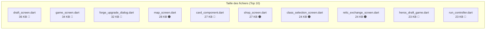

# 🔍 Analyse de Refactoring — Hero's Draft

> Audit complet du codebase pour identifier les opportunités de refactoring, améliorer l'évolutivité et la maintenabilité, et prévenir la dette technique future.

---

## 📊 Vue d'Ensemble

| Couche | Fichiers analysés | Taille totale | Problèmes critiques | Problèmes hauts | Problèmes moyens |
|--------|-------------------|---------------|---------------------|-----------------|------------------|
| Controllers | 8 | ~71 KB | 2 | 4 | 4 |
| Game/Flame | ~15+ | ~100 KB | 2 | 4 | 4 |
| UI Screens | 16 | ~330 KB | 3 | 4 | 4 |
| Models/Services/Widgets | ~30+ | ~120 KB | 3 | 4 | 5 |
| **Total** | **~70+** | **~620 KB** | **10** | **16** | **17** |

---

## 🔴 Problèmes Critiques (10)

> Ces problèmes représentent les risques les plus élevés pour l'évolutivité et la maintenabilité du projet. Ils doivent être adressés en priorité.

---

### C1. God Classes — Contrôleurs monolithiques

> [!CAUTION]
> Les deux contrôleurs principaux concentrent trop de responsabilités, rendant toute modification risquée et les tests unitaires quasi impossibles.

#### [run_controller.dart](file:///c:/Users/Gpdac/OneDrive/Documents/GameDev%20and%20Godot/Roguelike%20Card%20Game/roguelike_card_game/lib/game/controllers/run_controller.dart) — 23 KB (~600 lignes)

Gère simultanément : santé, mana, armure, buffs/debuffs, carte/map, progression, reliques, sauvegarde/persistance, récompenses, résolution de passifs, calcul de dégâts, gestion de l'or, initialisation de run.

**Recommandation** : Découper en sous-contrôleurs spécialisés :
- `PlayerStatsController` → santé, mana, armure, buffs
- `MapProgressionController` → position, nœuds, progression
- `RunPersistenceController` → sauvegarde/chargement
- `GoldController` → or, transactions

#### [combat_controller.dart](file:///c:/Users/Gpdac/OneDrive/Documents/GameDev%20and%20Godot/Roguelike%20Card%20Game/roguelike_card_game/lib/game/controllers/combat_controller.dart) — 18 KB (~470 lignes)

Gère simultanément : tour du joueur et de l'ennemi, résolution des dégâts, intentions ennemies, effets de statut, logique de mort, animations, calcul critique, gestion du mana. Les méthodes `_resolvePlayerTurn` (~90 lignes) et `_executeEnemyTurn` (~100 lignes) sont particulièrement denses.

**Recommandation** : Extraire :
- `StatusEffectProcessor` → logique des buffs/debuffs
- `DamageCalculator` → centralisation des calculs de dégâts
- `TurnPhaseManager` → orchestration des phases de tour

---

### C2. God Classes — Couche Game (Flame)

> [!CAUTION]
> Les deux composants Flame principaux sont devenus des monolithes qui rendent l'ajout de nouvelles fonctionnalités très coûteux.

#### [heros_draft_game.dart](file:///c:/Users/Gpdac/OneDrive/Documents/GameDev%20and%20Godot/Roguelike%20Card%20Game/roguelike_card_game/lib/game/heros_draft_game.dart) — 23 KB (~570 lignes)

Gère : initialisation de tous les composants, bridge Riverpod ↔ Flame (`syncState()` ~150 lignes), animations, layout/positionnement, overlays, cycle de vie du combat, mise à jour visuelle des barres.

**Recommandation** : Découper en systèmes Flame dédiés :
- `StateSyncSystem` → pont Riverpod ↔ Flame
- `CardAnimationSystem` → animations de cartes
- `CombatVisualSystem` → floating text, effets visuels
- `LayoutSystem` → calcul des positions

#### [card_component.dart](file:///c:/Users/Gpdac/OneDrive/Documents/GameDev%20and%20Godot/Roguelike%20Card%20Game/roguelike_card_game/lib/game/components/card_component.dart) — 27 KB (~680 lignes)

Le **fichier le plus lourd** du projet. Gère : rendu (fond, bordure, icônes, texte), interactions (tap, drag, hover), animations, validation de jouabilité, positionnement dans la main, tooltips.

**Recommandation** : Extraire :
- `CardRenderer` → uniquement le dessin de la carte
- `CardInteractionHandler` → gestion du tap/drag/hover
- `CardAnimator` → animations de mouvement/sélection
- `CardComponent` reste comme orchestrateur léger

---

### C3. God Widget — Dialog de Forge

> [!CAUTION]
> Le dialog de forge est le 2e plus gros fichier du projet et viole le principe de responsabilité unique.

#### [forge_upgrade_dialog.dart](file:///c:/Users/Gpdac/OneDrive/Documents/GameDev%20and%20Godot/Roguelike%20Card%20Game/roguelike_card_game/lib/ui/widgets/forge_upgrade_dialog.dart) — 32 KB (~800 lignes)

Contient : logique de forge/amélioration (calculs, validation, application), affichage complet (comparaison avant/après, sélection de niveaux), animations complexes, logique de transaction.

**Recommandation** : Extraire :
- `ForgeCalculator` → calcul des coûts et validations (service)
- `ForgeCardComparison` → widget comparatif
- `ForgeLevelSelector` → widget de sélection
- `ForgeAnimationMixin` → animations

---

### C4. Mutabilité des Modèles d'État

> [!CAUTION]
> La mutabilité directe des modèles d'état bypass le système de notification de Riverpod, ce qui peut causer des bugs de rendu silencieux et est fondamentalement incompatible avec la gestion d'état réactive.

#### [entity_stats.dart](file:///c:/Users/Gpdac/OneDrive/Documents/GameDev%20and%20Godot/Roguelike%20Card%20Game/roguelike_card_game/lib/models/entity_stats.dart) — 5.9 KB

`EntityStats` est **mutable** — `currentHealth`, `currentMana`, `armor`, `statusEffects` sont modifiés directement (`stats.currentHealth -= damage`). Les `List` internes sont aussi mutables.

**Recommandation** :
- Adopter **Freezed** ou implémenter des `copyWith` systématiques
- Séparer en : `BaseStats` (immuable), `CombatStats` (immuable + `copyWith`), `StatusEffectStack` (conteneur immuable)
- Appliquer `@immutable` systématiquement

---

### C5. Duplication massive du code UI

> [!WARNING]
> Les mêmes patterns UI sont réimplémentés dans 12+ écrans, multipliant le coût de chaque changement de design.

**Patterns dupliqués identifiés :**

| Pattern | Nombre d'occurrences | Écrans concernés |
|---------|---------------------|------------------|
| En-tête de page (titre + retour) | 8+ | map, shop, deck, card_dictionary, patch_notes, event, rest, relic_exchange |
| Fond avec dégradé | 12+ | Presque tous les écrans |
| Widget de carte | 7+ | draft, starter_deck_draft, boss_card_draft, deck, shop, card_dictionary, rest_card_selection |
| Barres de ressources | 3+ | game, shop, map |

**Recommandation** :
- Créer `ScreenScaffold` → header + fond + contenu réutilisable
- Unifier le widget de carte via [ui_card.dart](file:///c:/Users/Gpdac/OneDrive/Documents/GameDev%20and%20Godot/Roguelike%20Card%20Game/roguelike_card_game/lib/ui/widgets/ui_card.dart) (usage systématique)
- Créer `ResourceBar` → widget réutilisable
- Créer `PageHeader` → composant d'en-tête réutilisable

---

### C6. Écrans monolithiques (draft + game)

> [!WARNING]
> Les deux plus gros écrans (36 KB et 34 KB) mélangent logique, animation et rendu dans des fichiers uniques.

#### [draft_screen.dart](file:///c:/Users/Gpdac/OneDrive/Documents/GameDev%20and%20Godot/Roguelike%20Card%20Game/roguelike_card_game/lib/ui/screens/draft_screen.dart) — 36 KB (~900 lignes)
Contient la logique d'animation de sélection, la logique de pool de cartes, l'affichage, le layout responsive, les `AnimationController` multiples.

#### [game_screen.dart](file:///c:/Users/Gpdac/OneDrive/Documents/GameDev%20and%20Godot/Roguelike%20Card%20Game/roguelike_card_game/lib/ui/screens/game_screen.dart) — 34 KB (~850 lignes)
Mélange Flutter et Flame, HUD overlay inline, dialogs de mort/victoire, notifications, logique de fin de combat.

---

## 🟠 Problèmes Hauts (16)

---

### H1. Pipeline de dégâts fragmenté

Le calcul de dégâts est dispersé entre 4 fichiers :
- [combat_controller.dart](file:///c:/Users/Gpdac/OneDrive/Documents/GameDev%20and%20Godot/Roguelike%20Card%20Game/roguelike_card_game/lib/game/controllers/combat_controller.dart) — calcul principal
- [effect_resolver.dart](file:///c:/Users/Gpdac/OneDrive/Documents/GameDev%20and%20Godot/Roguelike%20Card%20Game/roguelike_card_game/lib/game/services/effect_resolver.dart) — effets de carte
- [run_controller.dart](file:///c:/Users/Gpdac/OneDrive/Documents/GameDev%20and%20Godot/Roguelike%20Card%20Game/roguelike_card_game/lib/game/controllers/run_controller.dart) — `_calculateDamage`, `applyDamageToPlayer`
- [trait_system.dart](file:///c:/Users/Gpdac/OneDrive/Documents/GameDev%20and%20Godot/Roguelike%20Card%20Game/roguelike_card_game/lib/game/systems/trait_system.dart) — modification par traits

**Recommandation** : Créer un `DamagePipeline` centralisé (base → force/faiblesse → traits → reliques → armure → résultat final).

---

### H2. `effect_resolver.dart` — Switch/Case massif (violation Open/Closed)

Un gigantesque `switch` sur les types d'effets (~250 lignes). Chaque nouvel effet nécessite de modifier ce fichier.

**Recommandation** : Pattern **Strategy/Registry** :
```dart
abstract class EffectHandler { void resolve(EffectContext ctx); }
class EffectResolver {
  final Map<EffectType, EffectHandler> _handlers;
}
```

---

### H3. Magic numbers omniprésents

| Localisation | Exemples |
|-------------|----------|
| `combat_controller.dart` | `0.15` (critique), `1.5` (multiplicateur), `400`/`600`/`800` ms (délais), `3` (cartes piochées), `5` (mana base) |
| `heros_draft_game.dart` | Positions hardcodées, durées `0.3`/`0.5`/`0.8`s, tailles `120×180` |
| `card_component.dart` | Couleurs par type, tailles de police `10`-`16` |
| `floating_text.dart` | Durées `1.0`/`1.5`s, vélocité `-50`/`-80` px/s |

**Recommandation** : Centraliser dans [game_constants.dart](file:///c:/Users/Gpdac/OneDrive/Documents/GameDev%20and%20Godot/Roguelike%20Card%20Game/roguelike_card_game/lib/game/game_constants.dart) (actuellement sous-utilisé — seulement 1.2 KB).

---

### H4. Couplage étroit entre contrôleurs

Les contrôleurs s'appellent mutuellement via `ref.read(autreControllerProvider.notifier)` directement, rendant les tests unitaires très difficiles (pas de mock possible sans override de provider complet).

**Recommandation** : Introduire des interfaces/abstractions ou utiliser un pattern de service locator testable.

---

### H5. Business logic dans les écrans UI

| Écran | Logique qui devrait être dans un contrôleur |
|-------|----------------------------------------------|
| `shop_screen.dart` | Validation d'achat, calcul de prix avec remise |
| `draft_screen.dart` | Sélection de carte, validation du draft, calcul de pool |
| `event_screen.dart` | Résolution d'événements partielle |
| `map_screen.dart` | Pathfinding, validité de nœud |
| `class_selection_screen.dart` | Chargement et filtrage des héros |

---

### H6. Duplication entités Player/Enemy (Flame)

`player_entity.dart` et `enemy_entity.dart` partagent du code commun : barres de vie, affichage du nom, animation de bump/shake, icônes d'effets de statut.

**Recommandation** : Créer `CombatEntity` comme classe de base.

---

### H7. Effets visuels sans abstraction commune (Flame)

Chaque effet (`damage_flash`, `heal`, `shield`, `critical_hit`) réimplémente son cycle de vie.

**Recommandation** : Créer `BaseVisualEffect extends PositionComponent` avec `duration`, `onComplete`, auto-removal.

---

### H8. `map_generator_service.dart` — Algorithme monolithique (12.9 KB)

Gère : génération de nœuds, placement de contenu, validation, calcul de connexions, attribution d'ennemis.

**Recommandation** : Découper en `MapNodeGenerator`, `MapConnectionBuilder`, `MapContentPlacer`, `MapValidator`.

---

### H9. `game_data_service.dart` — Pas de gestion d'erreur/cache

Charge les JSON sans try/catch robuste, sans cache explicite, sans validation des données.

---

### H10. Duplication entre modèles `data/` et instances

`card_data.dart` / `card_instance.dart` et `enemy_data.dart` / `enemy_instance.dart` — les instances re-déclarent des champs au lieu de référencer les données statiques.

---

### H11. Conflit de structure `ui_card.dart` / `ui_card/`

Coexistence confuse d'un fichier et d'un dossier au même nom au même niveau.

---

### H12. Logique de reliques dans `RewardController`

Le `RewardController` contient la logique d'application des reliques qui devrait être dans `InventoryController` ou un `RelicEffectService`.

---

### H13. 3 écrans de draft à factoriser

`draft_screen.dart`, `starter_deck_draft_screen.dart`, et `boss_card_draft_screen.dart` implémentent une logique de draft très similaire.

**Recommandation** : Créer `BaseDraftScreen` comme abstraction commune.

---

## 🟡 Problèmes Moyens (17)

| # | Problème | Fichiers concernés | Recommandation |
|---|---------|-------------------|----------------|
| M1 | Gestion d'erreur manquante dans contrôleurs | `run_controller.dart`, `shop_controller.dart` | Ajouter try/catch, validation côté contrôleur |
| M2 | API publique trop large du `RunController` | `run_controller.dart` | Rendre privées les méthodes internes |
| M3 | `DeckController` — responsabilités mélangées | `deck_controller.dart` | Séparer shuffle, piochage, recyclage |
| M4 | `skill_controller` + `inventory_controller` trop légers | 2 fichiers | Fusionner ou créer un mixin commun |
| M5 | `combat_debug_logger.dart` — `print()` en production | `combat_debug_logger.dart` | Utiliser `logging` ou `kDebugMode` |
| M6 | `encounter_system.dart` — sélection + instanciation mélangées | `encounter_system.dart` | Séparer logique métier et rendu |
| M7 | `effect_icon.dart` — trop de responsabilités (10.5 KB) | `effect_icon.dart` | Extraire le layout dans un parent |
| M8 | `trait_system.dart` — switch/case non extensible | `trait_system.dart` | Pattern registry |
| M9 | Styles hardcodés dans les écrans | 12+ écrans | Enrichir le thème avec des tokens |
| M10 | Navigation inconsistante (push/replace/removeUntil) | Tous les écrans | Adopter GoRouter |
| M11 | Duplication `card_dictionary_screen` / `deck_screen` | 2 fichiers | Widget `CardGrid` partagé |
| M12 | `map_screen.dart` — rendu + navigation mélangés (28 KB) | `map_screen.dart` | Séparer `MapPainter` |
| M13 | `relic_exchange_screen.dart` — animations inline (24 KB) | `relic_exchange_screen.dart` | Extraire les animations dans un mixin |
| M14 | `model_extensions.dart` — display + logique mélangés | `model_extensions.dart` | Séparer en 2 fichiers |
| M15 | `status_effect.dart` — enum avec logique | `status_effect.dart` | Pattern registry |
| M16 | `notification_overlay.dart` — animation inline | `notification_overlay.dart` | Extraire les animations |
| M17 | Thème sous-utilisé (manque tokens espacement, rayon, etc.) | `lib/ui/theme/` | Enrichir avec tokens complets |

---

## 🟢 Problèmes Bas (observations)

- Nommage inconsistant : `applyDamageToPlayer` vs `dealDamage` vs `takeDamage` ; `resolve` vs `execute`
- Commentaires manquants sur les méthodes complexes
- `game_constants.dart` sous-utilisé
- TODOs non résolus dans plusieurs écrans
- Documentation manquante sur les effets visuels

---

## 📋 Plan de Refactoring Recommandé — Par Priorité

### Phase 1 — Fondations (Impact maximal, risque modéré)

| Priorité | Action | Fichiers | Impact estimé |
|----------|--------|----------|---------------|
| **P0** | Rendre les modèles d'état immutables (Freezed ou copyWith) | `entity_stats.dart`, `combat_state.dart`, `enemy_instance.dart` | 🛡️ Prévient des bugs silencieux de rendu |
| **P0** | Centraliser les magic numbers | `game_constants.dart` + tous les fichiers | 🛡️ Base nécessaire pour tout refactoring |
| **P1** | Créer `DamagePipeline` centralisé | Nouveau fichier + refactoring de 4 fichiers | 🛡️ Élimine la fragmentation critique |

### Phase 2 — Décomposition des God Classes (Impact élevé, risque élevé)

| Priorité | Action | Fichiers | Impact estimé |
|----------|--------|----------|---------------|
| **P1** | Découper `RunController` en 4 sous-contrôleurs | `run_controller.dart` → 4 nouveaux | ⚡ Amélioration majeure de la maintenabilité |
| **P1** | Découper `CombatController` | `combat_controller.dart` → 3 nouveaux | ⚡ Testabilité améliorée |
| **P2** | Découper `HerosDraftGame` en systèmes Flame | `heros_draft_game.dart` → 4 systèmes | ⚡ Extensibilité Flame |
| **P2** | Découper `CardComponent` | `card_component.dart` → 3 composants | ⚡ Maintenabilité du composant principal |

### Phase 3 — Unification UI (Impact élevé, risque modéré)

| Priorité | Action | Fichiers | Impact estimé |
|----------|--------|----------|---------------|
| **P2** | Créer `ScreenScaffold` + `PageHeader` + `ResourceBar` | Nouveaux widgets + refactoring 12+ écrans | 🎨 Élimine la duplication UI massive |
| **P2** | Unifier le widget de carte | `ui_card.dart` + 7 écrans | 🎨 Un seul endroit à modifier |
| **P2** | Découper `forge_upgrade_dialog.dart` | 32 KB → 4+ composants | 🎨 Maintenabilité du dialog |
| **P3** | Factoriser les 3 écrans de draft | 3 écrans → base commune + 3 spécialisations | 🎨 Réduction de la duplication |

### Phase 4 — Architecture & Patterns (Impact modéré, risque modéré)

| Priorité | Action | Fichiers | Impact estimé |
|----------|--------|----------|---------------|
| **P3** | Refactorer `EffectResolver` (Strategy pattern) | `effect_resolver.dart` | 🔧 Extensibilité des effets |
| **P3** | Créer `CombatEntity` base class (Flame) | Player + Enemy entities | 🔧 Réduction duplication Flame |
| **P3** | Créer `BaseVisualEffect` (Flame) | Tous les effets visuels | 🔧 Cohérence effets |
| **P3** | Découper `map_generator_service.dart` | 12.9 KB → 4 sous-services | 🔧 Testabilité map gen |
| **P4** | Enrichir le système de thème | `lib/ui/theme/` | 🎨 Consistance visuelle |
| **P4** | Adopter GoRouter | Tous les écrans | 🔧 Navigation centralisée |
| **P4** | Améliorer la gestion d'erreur | Contrôleurs + services | 🛡️ Robustesse |

---

## 📈 Métriques de Santé du Code



> [!IMPORTANT]
> **Règle empirique** : Un fichier Dart au-delà de ~300 lignes / 10 KB est un candidat au refactoring. **6 fichiers dépassent 23 KB**, ce qui est un signal fort de God Classes/Widgets.

---

## 🎯 Conclusion

Le projet Hero's Draft a une **architecture fondamentalement saine** (séparation Flame/Flutter/Riverpod, modèles de données JSON, localisation bilingue), mais la croissance organique a créé des **poches de complexité concentrée** dans les fichiers les plus critiques. 

Les 3 axes de refactoring les plus impactants sont :
1. **Immutabilité des modèles** — prévient les bugs silencieux les plus dangereux
2. **Décomposition des God Classes** — permet l'évolution indépendante de chaque système
3. **Unification des patterns UI** — réduit drastiquement le coût de chaque changement visuel

Le refactoring complet est estimé à **4 phases** et peut être effectué de manière incrémentale, chaque phase apportant des bénéfices immédiats.
