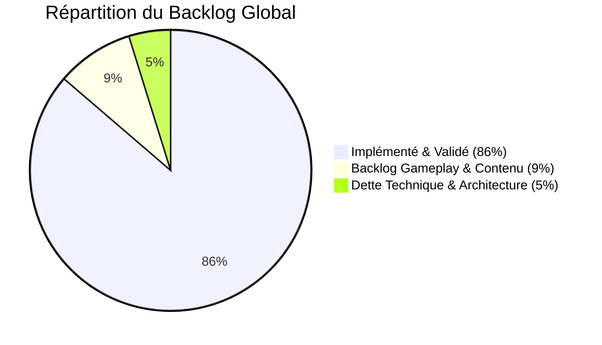
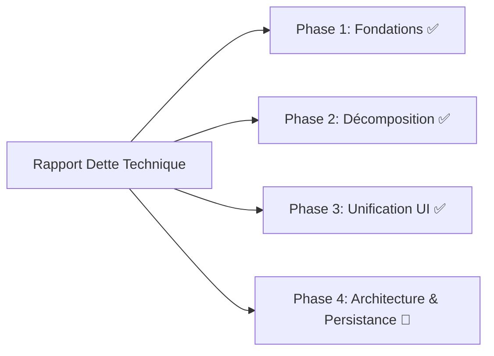
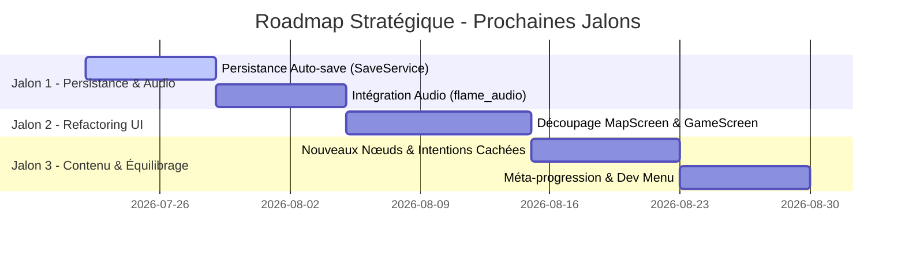

# 📋 Rapport Détaillé — Backlog & Roadmap (Hero's Draft)
**Date** : 22 juillet 2026  
**Version du projet** : v3.1.0 (Forge de Fusion & Forge Data-Driven)

---

## 🎯 Aperçu Général & Taux de Complétion

Le backlog initial du projet comprenait environ **146 idées d'améliorations et demandes de fonctionnalités** répertoriées dans `docs/possible_upgrades/upgrade_ideas.md` et les documents d'analyse technique.

### Avancement Global
- **Fonctionnalités & Correctifs Réalisés** : **~126 items (~86%)**
- **Items Restants (Gameplay / UX / Système)** : **~20 items (~14%)**
- **Chantiers Majeurs de Dette Technique** : **4 grands axes** (Persistance I/O, Audio, Refactoring God Classes, Couverture Tests)

---

## 🎮 1. Backlog Gameplay & Mécaniques

Les fonctionnalités de jeu planifiées qui ne sont **pas encore implémentées** ou nécessitent un approfondissement :

### 👁️ Intentions Ennemies Cachées (`cacher_intentions`)
- **Concept** : En late-game (Acte 3+) ou sous certains effets de statut (ex: *Cécité*, *Brouillard*, ou contre des Boss spécifiques), dissimuler l'icône et la valeur d'intention de l'ennemi (`?` à la place de l'attaque/défense).
- **Objectif** : Augmenter la tension stratégique et forcer la prise de risque défensive.
- **État** : Non commencé (`upgrade_ideas.md` line 98).

### ⚔️ Diversification des Intentions & Attaques Ennemies
- **Concept** : Ajouter de nouveaux motifs d'attaque aux monstres :
  - Compétences à retardement (lancement sur 2 tours avec avertissement visuel)
  - Vol de mana / Drainage de ressources
  - Invocations de sbires en cours de combat
  - Malédictions appliquées directement au deck du joueur (cartes de statut éphémères)
- **État** : Non commencé (`upgrade_ideas.md` line 139).

### 🛡️ Scaling de la Statistique `Mastery` (Maîtrise)
- **Concept** : Refondre l'échelonnement et la formule de calcul de la statistique de *Maîtrise d'Armure* (`armorMastery`) selon la classe du héros choisi (ex: Paladin scalant différemment du Berserker).
- **État** : Non commencé (`upgrade_ideas.md` line 138).

### 🚫 Restrictions de Cartes par Classe
- **Concept** : Interdire l'utilisation de certaines cartes globales par certaines classes (ex: le Berserker ne peut pas ajouter de cartes de pure défense ou d'armure magique à son deck).
- **Objectif** : Renforcer l'identité asymétrique de chaque classe de héros.
- **État** : Backlog documenté dans `progress.md`.

### ⚡ Coût de Merge Dynamique (+1 Mana)
- **Concept** : Actuellement, la fusion 3→1 augmente les statistiques sans pénalité de ressource. L'idée est d'augmenter de +1 le coût en mana de la carte fusionnée par niveau/tier de rareté supérieur pour équilibrer la puissance.
- **État** : Backlog documenté.

### 📜 Limite de Taille de Deck (15 Cartes Max)
- **Concept** : Imposer un plafond de 15 cartes au *Master Deck*, extensible uniquement via des reliques légendaires ou des récompenses de boss uniques.
- **Objectif** : Éviter les decks "fourre-tout" et inciter à la suppression/purge stratégique de cartes en boutique ou au feu de camp.
- **État** : Backlog documenté.

---

## 🎨 2. Backlog Contenu & Variété

| Domaine | Fonctionnalité | Description | Priorité |
|:---|:---|:---|:---:|
| 🗺️ **Carte** | Nœuds Trésor 💎 & Mystère ❓ | Ajouter de nouveaux types de nœuds sur le DAG procédural (Trésors d'or/reliques directes, Événements mystères aléatoires). | **Moyenne** |
| 📖 **UI** | Onglet Reliques dans le Dictionnaire | Étendre `DictionaryScreen` pour inclure la grille de toutes les 24 reliques du jeu avec leurs descriptions bilingues et raretés. | **Moyenne** |
| 🎴 **Rendu** | Icônes de type de dégâts | Intégrer les icônes vectorielles de type d'élément (🔥 Feu, ❄️ Glace, 🧪 Poison, ⚔️ Physique) directement dans le texte de description des cartes. | **Basse** |
| 👹 **Combats** | Boss Multi-phases | Proposer des boss finaux changeant de forme, de deck d'intentions et d'apparence lorsque leurs HP atteignent 50%. | **Haute** |

---

## 🏛️ 3. Backlog Méta-Progression & Hors-Run

Ces éléments concernent la rejouabilité globale en dehors d'une session de jeu individuelle :

1. **🪙 Monnaie Persistante Inter-Runs** :
   - Gain d'une monnaie méta (ex: *Fragments d'Éther*) à la fin de chaque run (défaite ou victoire), proportionnel aux étages franchis.
   - Permet d'acheter des améliorations passives permanentes dans le menu principal (+5 HP de départ, +10 Or initial, etc.).
2. **🎨 Skins & Usages de Héros Débloquables** :
   - Déverrouillage d'apparences visuelles ou de variations de compétences de départ pour les héros (Guerrier, Paladin, Mage).
3. **🏆 Système d'Achievements / Trophées** :
   - Succès intégrés (ex: *"Vaincre un Boss sans subir de dégâts"*, *"Posséder 500 Or"*, *"Fusionner 5 cartes"*).
4. **🛠️ Menu de Debug / Console d'Administration** :
   - Un overlay de développement accessible via un raccourci clavier (ex: `F12` ou combo spécifique) permettant d'exécuter des commandes : `add_gold`, `heal`, `spawn_relic`, `kill_enemies`, `jump_to_floor`. (`upgrade_ideas.md` line 100).

---

## 🏗️ 4. Backlog Dette Technique & Architecture

Basé sur les rapports d'analyse (`technical_debt_report_Opus4.6.md`) et la roadmap de refactoring :

### 🔴 Chantier A — Persistance I/O (Sauvegarde & Reprise)
- **Problème** : L'état du jeu vit exclusivement en mémoire vive (RAM). Fermer l'application détruit la run en cours.
- **Solution requise** : Implémenter un `SaveService` basé sur `shared_preferences` ou une base SQLite locale pour :
  - Auto-sauvegarder l'état de la run à chaque transition de nœud ou fin de combat.
  - Proposer un bouton **« Reprendre la partie »** sur l'écran d'accueil (`HomeScreen`).

### 🔊 Chantier B — Système Audio & Musique
- **Problème** : Aucun son n'est émis. Le code contient des dizaines de commentaires `// TODO: Audio Hook`.
- **Solution requise** :
  - Ajouter la dépendance `flame_audio` à `pubspec.yaml`.
  - Créer un `AudioService` centralisé gérant les musiques de fond (Menu, Carte, Combat, Boss) et les bruitages contextuels (jouer une carte, impact, défaite, clic).

### ✂️ Chantier C — Décomposition des Fichiers UI « God Classes »
Deux fichiers UI volumineux subsistent et doivent être modulés :
1. `lib/ui/screens/map_screen.dart` (**2 471 lignes**) → Extraire `MapPainter`, `MapNodeWidget`, `MapLegend`, `MapController`.
2. `lib/ui/screens/game_screen.dart` (**1 667 lignes**) → Extraire `PauseOverlay`, `RewardOverlay`, `DeathOverlay`, `HudPanel`.

### 🧪 Chantier D — Couverture de Tests & Sérialisation
- **Couverture de code** : Actuellement à ~23%, l'objectif est d'atteindre ≥50% en ajoutant des tests de widgets Flutter et des tests d'intégration complets.
- **Sérialisation JSON** : Compléter `fromJson`/`toJson` et `==`/`hashCode` sur les modèles `CardInstance`, `EventState`, `InventoryState`, `ShopState`, et `SkillState`.

---

## ⚖️ 5. Analyse des Problèmes d'Équilibrage Identifiés

Issue de l'étude `docs/analysis_reports/6_analyse_game_balance.md` :

| Problème | Diagnostic | Action Corrective Recommandée |
|:---|:---|:---|
| **Économie de Mana permissive** | Le héros a 5 à 15 mana alors que les cartes coûtent 0 à 3 mana, rendant le mana rarement contraignant. | Standardiser à 3-4 mana de base par tour OU multiplier les HP des ennemis par 2.5×. |
| **Paladin sur-défensif** | 20 armure de base au Paladin neutralise la menace des premiers étages. | Remplacer l'armure brute par un passif évolutif (+2 armure/tour). |
| **HP des ennemis normaux** | Le Squelette (22 HP) meurt en 1 à 2 tours. | Réajuster les HP des sbires normaux (+50% à +80%). |
| **Carte `Attaque Rapide`** | 0 mana pour 3 dégâts + 1 pioche offre un avantage de carte sans coût. | Supprimer la pioche OU ajouter un coût de 1 mana. |
| **Soin répétable** | `Potion de Soin` (2 mana, 8 HP) réduit la tension d'attrition. | Conserver le tag Épuisement (`isExhaust: true`) systématique sur le soin. |

---

## 🗺️ Roadmap de Développement Proposée (Prochaines Étapes)

### 🎯 Jalon 1 (Immédiat) — Persistance & Audio
- **P1.1** : Implémenter l'auto-sauvegarde de run et la reprise de partie.
- **P1.2** : Câbler `flame_audio` et ajouter les effets sonores / musiques.

### 🎯 Jalon 2 (Court Terme) — Découpage UI & Couverture Tests
- **P2.1** : Refactoriser `map_screen.dart` et `game_screen.dart`.
- **P2.2** : Augmenter la couverture de tests unitaire/widget à 40%+.

### 🎯 Jalon 3 (Moyen Terme) — Contenu & Gameplay
- **P3.1** : Implémenter les intentions cachées et les boss multi-phases.
- **P3.2** : Ajouter la monnaie persistant inter-runs et le menu de debug.
