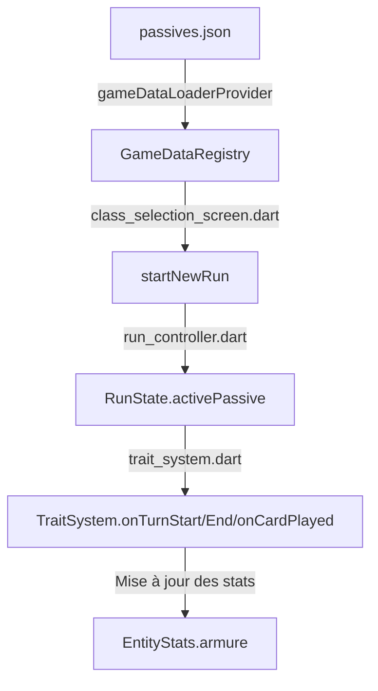

# Guide Technique - Système de Passifs d'Armure Data-Driven

Ce guide documente l'architecture, la structure de données et les modalités d'extension du **système de passifs d'armure de classe** introduit dans le projet Hero's Draft. 

Auparavant codés en dur à l'aide de structures conditionnelles statiques, les passifs d'armure sont désormais **100 % dynamiques et pilotés par les données (Data-Driven)**.

---

## 1. Architecture Générale

Le système s'articule autour de trois couches distinctes :
1. **Couche de Données (JSON)** : Les passifs sont déclarés de manière autonome dans `assets/data/passives.json`.
2. **Couche de State (Riverpod)** : Lors du démarrage d'une run, le passif résolu depuis l'asset est chargé dans le `RunState.activePassive` via le contrôleur global `RunController`.
3. **Couche Moteur (Système de Combat)** : Le fichier `TraitSystem` intercepte les événements de combat (début de tour, fin de tour, cartes jouées) et applique dynamiquement les modificateurs d'état en fonction des propriétés du passif actif.



---

## 2. Structure des Données (JSON Schema)

Chaque passif déclaré dans `assets/data/passives.json` doit respecter la structure suivante :

```json
{
  "id": "String (Identifiant unique, ex: regenArmor)",
  "name": "String (Nom affiché à l'utilisateur)",
  "description": "String (Explications textuelles de l'effet)",
  "trigger": "String (Déclencheur d'activation de la relique/passif)",
  "effectType": "String (Code de l'effet à exécuter)",
  "value": "Int (Valeur numérique servant de multiplicateur ou bonus de base)"
}
```

### Déclencheurs valides (`trigger`)
Le système réutilise l'énumération unifiée `RelicTrigger` :
* `startOfRun` : Au lancement de la partie.
* `startOfCombat` : Au chargement d'une arène de combat.
* `startOfTurn` : Au début du tour du joueur.
* `endOfTurn` : À la fin du tour du joueur.
* `onCardPlayed` : Lorsqu'une carte est jouée avec succès.
* `onEnemyKilled` : À la mort d'un monstre.

### Types d'effet de base (`effectType`)
* `gain_armor` : Ajoute directement la valeur (`value`) à l'armure du joueur (s'ajoute au bonus de statistique `armorMastery`).
* `berserker_armor` : Calcule un gain proportionnel à la perte de vie actuelle (`missingHp ~/ 10 * value`).
* `spell_armor` : Octroie de l'armure à chaque fois qu'une carte de type `CardType.skill` est jouée.

---

## 3. Guide de création et d'extensibilité (Tutoriel Développeur)

### Cas 1 : Créer un passif réutilisant les effets de base (ZÉRO LIGNE DE CODE)
Si votre passif consiste à octroyer des ressources standard (armure, etc.) à un moment prédéfini (ex: gagner 4 d'Armure au début du combat) :

1. **Ouvrez** `assets/data/passives.json` et ajoutez votre bloc de données :
   ```json
   {
     "id": "combatShield",
     "name": "Bouclier de Bataille",
     "description": "Gagne 4 points d'Armure (+ Maîtrise) au début de chaque combat.",
     "trigger": "startOfCombat",
     "effectType": "gain_armor",
     "value": 4
   }
   ```
2. **Ouvrez** `assets/data/heroes.json` et associez-le au héros de votre choix :
   ```json
   "passiveTrait": "combatShield"
   ```
*C'est tout ! Le jeu charge automatiquement le passif, l'affiche sur l'UI avec ses textes propres, et applique l'effet au début du combat.*

---

### Cas 2 : Créer un passif avec un comportement unique (Ajout de logique)
Si vous voulez implémenter un effet unique, par exemple *"Gagne 1 Attaque temporaire chaque fois que vous jouez une compétence"* :

1. **Déclarez le passif dans `passives.json`** en inventant un `effectType` unique :
   ```json
   {
     "id": "spellRage",
     "name": "Rage Magique",
     "description": "Gagne +1 Attaque pour 3 tours chaque fois que vous jouez une carte Compétence.",
     "trigger": "onCardPlayed",
     "effectType": "gain_strength_on_skill",
     "value": 1
   }
   ```
2. **Associez-le à un héros dans `heroes.json`** via son ID `"spellRage"`.
3. **Ouvrez** `lib/game/systems/trait_system.dart` et implémentez la logique spécifique dans la méthode interceptant le trigger (ici `onCardPlayed`) :
   ```dart
   // Dans TraitSystem.onCardPlayed
   if (passive.trigger == RelicTrigger.onCardPlayed) {
     if (passive.effectType == 'gain_strength_on_skill') {
       if (card.data.type == CardType.skill) {
         // Appliquer l'effet de combat (statut temporaire)
         controller.addStatus(StatusEffect(
           id: 'strength',
           name: 'Attaque',
           type: StatusType.buff,
           value: passive.value,
           duration: 3,
         ));
       }
     }
   }
   ```

---

## 4. Sécurité et Rétrocompatibilité

Pour éviter de casser les tests unitaires et de widgets préexistants (qui n'instancient pas de registre JSON ou de mock complet Riverpod), le système s'appuie sur une méthode de repli :
`PassiveData.fallback(String id)`.

Si l'état global `activePassive` est nul ou indisponible lors de l'appel d'un test, la méthode `fallback` renvoie instantanément la configuration standard attendue pour les classes Paladin (`regenArmor`), Berserker (`berserkerArmor`) et Mage (`spellArmor`), préservant une **compatibilité absolue avec 100 % de la suite d'intégration**.
