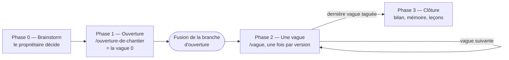
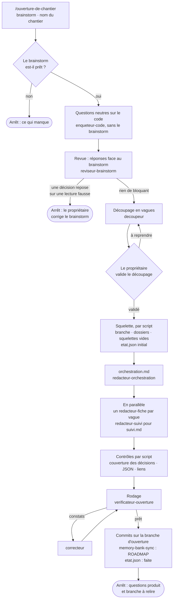
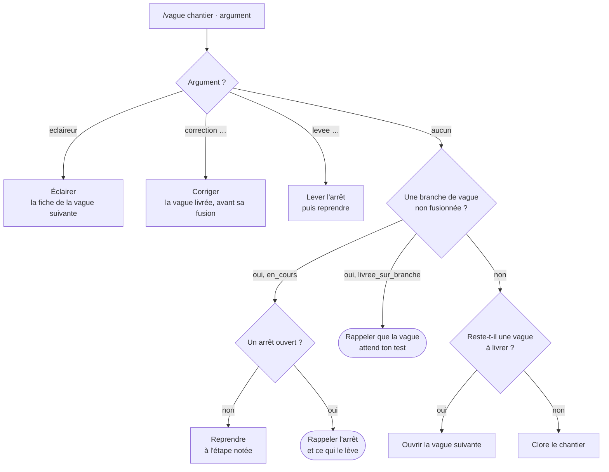
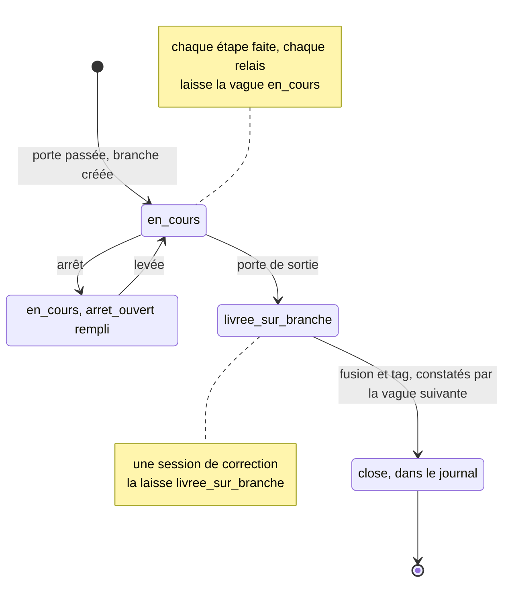
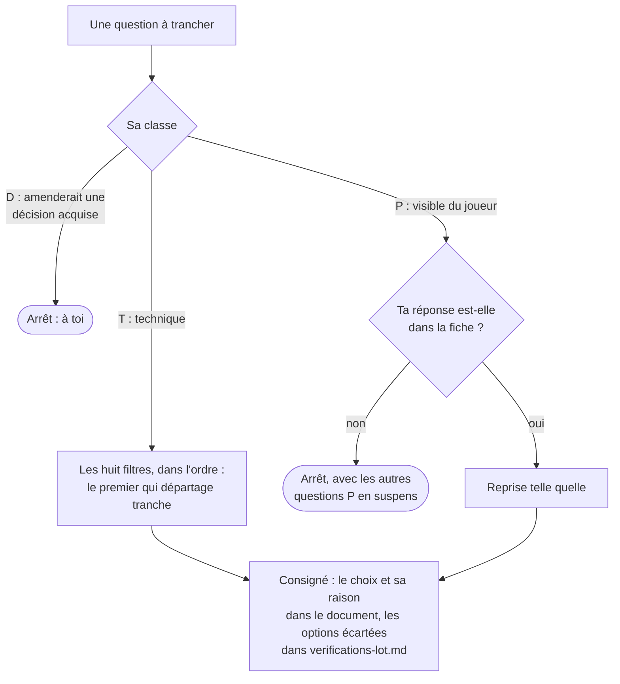

# Guide — le workflow par vagues, pas à pas

**Date** : 07/10/2026, à la demande du propriétaire. **Condensé le 08/10** : même numérotation, mêmes graphes, moins de récit.
**Rôle** : expliquer comment fonctionne le workflow par vagues : phases, fichiers, agents, scripts, hooks, portes, arrêts. **Qui le lit** : le propriétaire, pour comprendre et pour écrire les skills à l'adoption. Aucun agent de vague n'a à le charger : le `SKILL.md` de `vague` en sera la version exécutable.

| Document | Ce qu'il dit |
|:---|:---|
| Ce guide | **Comment** tout fonctionne |
| [Le modèle](05-10-2026_modele_orchestration_par_vagues.md) | **Ce qui s'installe ou se copie** : squelettes, `SKILL.md`, agents, scripts, hooks, migration |
| [L'audit](05-10-2026_audit_workflow_ia_et_orchestration_par_vagues.md) | **Pourquoi** : mesures, comparaison, R1 à R31 et leur statut |

**Statut** : proposition. Rien n'est installé ; le chantier en cours reste conduit par son [fichier d'orchestration](01-10-2026_orchestration_chantier_economie_et_catalogue_Fable5.md). §16 donne l'état de chaque pièce. ★Rn renvoie à l'audit.

| § | Contenu |
|:---|:---|
| 1 | Le workflow en une page |
| 2 | Le vocabulaire |
| 3 | Tout ce qui existe, couche par couche |
| 4 | Les acteurs |
| 5 | Les fichiers |
| 6 à 8 | Phase 0, phase 1, phase 2 |
| 9, 10 | La boucle de vérification ; arbitrer |
| 11 à 13 | La clôture ; les garde-fous ; les arrêts |
| 14 à 16 | Mesurer ; ta liste ; ce que le guide précise, état des pièces |
| A, B | Du cycle actuel aux étapes ; les recommandations étape par étape |

---

## 1. Le workflow en une page

**« La méthode », c'est le workflow lui-même** ★R23 : les étapes, qui fait chacune, les portes, les arrêts. Elle s'oppose au **chantier** (ce qu'on construit) et au code.



| Phase | Qui la lance | Lit | Produit | Tes gestes |
|:---|:---|:---|:---|:---|
| **0 — Brainstorm** (§6) | toi | le jeu, tes idées, la ROADMAP | un brainstorm à décisions numérotées | tout |
| **1 — Ouverture** (§7) | `/ouverture-de-chantier <brainstorm> <chantier>` | le brainstorm, le code | `docs/chantiers/<chantier>/` rempli, sur `docs/ouverture-<chantier>` | valider le découpage ; relire, fusionner ; répondre aux questions P |
| **2 — Une vague** (§8) | `/vague <chantier>`, par version et par plan | `etat.json`, la fiche | une version du jeu, sur sa branche | relancer ; répondre à l'éclaireur ; tester ; PR, fusion, tag |
| **3 — Clôture** (§11) | `/vague <chantier>` après le dernier tag | tout le chantier | bilan, mémoire, leçons | relire, fusionner ; trancher les amendements |

**Sept principes** :
1. **Une vague, une version, une branche, un test.** Elle n'entre dans `main` que par ta fusion, ne devient version que par ton tag.
2. **Tu gardes ce qui t'appartient** : le quoi, le découpage, les questions P et D, le test, la fusion, le tag, la méthode. Le reste est délégué.
3. **L'orchestrateur garde le fil, les agents font le travail.** Il ne rédige, ne vérifie, n'implémente rien.
4. **Le squelette d'abord, puis un agent par fichier.** Jamais deux agents sur un même fichier ; seul l'orchestrateur commite.
5. **Ce qui se calcule : un script ; ce qui se juge : un agent neuf** qui prouve chaque constat.
6. **Chaque session ne lit que ce qui la concerne** : `etat.json`, `orchestration.md`, sa fiche.
7. **Tout s'arrête proprement** : la session écrit pourquoi, te prévient, une session neuve reprend là.

---

## 2. Le vocabulaire

| Terme | Sens | Où |
|:---|:---|:---|
| **Chantier** | Un programme livré en plusieurs versions | `docs/chantiers/<chantier>/` |
| **Vague** | Une étape qui livre une version ; la vague 0 est l'ouverture ; la clôture n'a pas de version | `vagues/<NN>-v<x.y.z>-<nom>/` |
| **Lot, partie** | L'unité qui reçoit un plan (et une conception s'il est lourd) ; une partie est une tranche d'un lot lourd, un plan chacune | la fiche |
| **Cérémonie** | léger · standard · lourd — décide des documents et de la vérification ★R11 ★R31 | la fiche |
| **Décision acquise / proposée** | `D<n>` du brainstorm, tranchée par toi ou seulement avancée | le brainstorm |
| **Valeur mesurée** | Fixée sur la foi de l'oracle ; ne change qu'avec une nouvelle mesure | le brainstorm |
| **Oracle** | Simulation déterministe diffée contre une référence suivie par git | `tool/simulations/` |
| **Fiche** | Le cahier des charges d'une vague | `fiche.md` |
| **Conception** | Lot lourd seulement : le *comment* du lot avant ses plans | `conception-<lot>.md` |
| **Plan, Review Focus, tâche à risque** | Ce que SDD exécute ; en tête, cinq modes d'échec au plus confiés à une tâche ; une tâche dont le plan écrit le code entier ★R1 | `plan-<lot>….md` |
| **Orchestrateur, agent** | La session principale lancée par ta commande ; un sous-agent au contexte neuf défini dans `.claude/agents/` | §4 |
| **SDD, rulings** | `superpowers:subagent-driven-development` ; ses décisions, à recopier avant qu'il supprime `.superpowers/sdd/<plan>/` | `compte-rendu.md` §2 |
| **Étape** | Un moment nommé (`plan`, `sdd`…) que `etat.json` note | `etat.json › etape` |
| **Constat, gravité, tour** | Ce que rend un vérificateur ; bloquant · moyen · mineur · rédaction ; une vérification, complète puis différentielle ★R2 | §9 |
| **Classe T · P · D** | Technique (orchestrateur) ; produit, visible du joueur (toi) ; amende une décision acquise (toi, arrêt) ★R3 | §10 |
| **Autonomie** | `strict` ou `continu` après trois tours sans convergence ★R3 | la fiche, `etat.json` |
| **Relais, passation** | Fin de session à chaque fin de plan, dix lignes pour la suivante ★R17 | `compte-rendu.md` §2 |
| **Éclaireur** | Remet la fiche N+1 à jour pendant ton test de N ★R8 | `fiche.md` |
| **Convergence** | Les décisions écrites face au code livré ★R13 | §8.12 |
| **Porteurs de version** | `pubspec.yaml`, `assets/data/patch_notes.json`, `site/_site/versions.json` | `verify_version.sh` |

---

## 3. Tout ce qui existe, couche par couche

```
.claude/
├── skills/ouverture-de-chantier/SKILL.md  # phase 1
├── skills/vague/SKILL.md + references/    # phases 2 et 3
├── skills/patch-notes-writer/, memory-bank-sync/   # existent
├── agents/<rôle>.md                       # un fichier par rôle (§4.3)
├── hooks/garde_vague.sh, prevenir.sh, etat_chantiers.sh
└── settings.json                          # enregistre les hooks (modèle §7.8)
tool/
├── chantiers/squelette.sh                 # phase 1
├── vagues/porte_entree.sh, verifier_references, mesure_session
└── simulations/                           # existe : l'oracle
docs/
├── possible_upgrades/                     # brainstorm, revue, rapport de l'oracle
├── chantiers/_modele/ et <chantier>/      # §5.1
├── ROADMAP.md, INDEX.md                   # une ligne par chantier
.obsidian_vault/                           # la mémoire
pubspec.yaml · assets/data/patch_notes.json · site/_site/versions.json   # porteurs de version
.github/                                   # CI, release au tag, verify_version.sh
.superpowers/                              # ignoré par git : fichiers de travail (§5.6)
```

---

## 4. Les acteurs

### 4.1. Toi

| Ce qui t'appartient | Quand | Comment |
|:---|:---|:---|
| Le brainstorm et ses décisions | phase 0 | en conversation, commit dans `main` |
| Valider le découpage | phase 1, étape 4 | la session t'attend |
| Relire et fusionner la branche d'ouverture | fin de phase 1 | PR, fusion, pas de tag |
| Répondre aux questions P, fixer l'autonomie | avant la vague | dernière colonne de « À arbitrer », ligne « Autonomie » de la fiche |
| Lancer et relancer une vague | phase 2 | `/vague <chantier>` |
| Lever un arrêt | phase 2 | corriger, puis `/vague <chantier> levee <…>` |
| Lancer l'éclaireur ; tester ; demander une correction | pendant et après ton test | `/vague <chantier> eclaireur` ; `tests-manuels.md` ; `/vague <chantier> correction <…>` |
| PR, fusion par commit de fusion, tag | après un test bon | git, GitHub |
| Trancher les leçons et les amendements ; monter l'outillage | chaque vague, clôture ; entre deux chantiers | `orchestration.md` §6 ; un ADR par amendement ★R14 |

Tu peux toujours reprendre la main : une session neuve repart de l'état écrit. **Le workflow suppose des sessions locales** : la branche d'une vague vit sur ta machine et c'est toi qui la pousses. Une session cloud devrait pousser sa branche, ce que `garde_vague` interdit ; il lui faudrait une exception au §3 de `orchestration.md`.

### 4.2. L'orchestrateur

- La session principale lancée par `/ouverture-de-chantier` ou `/vague`. Seule elle peut lancer des sous-agents et SDD.
- **Il fait** : lit l'état, passe les portes par script, lance les agents avec la partie variable de leur mission, ne garde que leurs conclusions, tranche les questions T (§10), tient `etat.json`, le journal et `verifications-<lot>.md`, vérifie par `git status` que chaque agent n'a écrit que son fichier, commite, s'arrête quand une règle le demande.
- **Il ne fait jamais** : rédiger un document confié à un agent ; implémenter ; tenir pour vérifié ce qu'aucun vérificateur neuf n'a relu ; pousser, PR, fusion, tag ; enfreindre un garde-fou (§12).
- **Il lit à l'ouverture** : `CLAUDE.md`, `etat.json`, `orchestration.md`, sa fiche, les « Leçons » et « Pour la file » du compte rendu précédent. Pas le brainstorm entier.
- **Il vit une session par plan** ★R17 : passation, fin de session, tu relances.

### 4.3. Les agents

**Règles communes** : contexte neuf, tout par chemin de fichier ; partie fixe dans `.claude/agents/<rôle>.md`, partie variable dans le message ; un vérificateur n'est jamais le rédacteur et n'a pas d'outil d'édition ; un constat se prouve par commande ou citation ; un agent n'écrit que son fichier et ne commite jamais (l'éclaireur excepté, pour sa seule fiche). Modèles : « le plus capable » ou « intermédiaire », à remplacer par les valeurs de `model:` à l'adoption.

**Phase 1** :

| Agent | Étape | Mission | Lit | Écrit | Rend | Outils · modèle | Fichier |
|:---|:---|:---|:---|:---|:---|:---|:---|
| `enqueteur-code` | revue | Questions neutres sur le code, sans le brainstorm | `lib/`, `assets/data/`, `test/`, `tool/` | rien | réponses, symboles, tests ; « non établi » | lecture, Bash · intermédiaire | écrit (modèle A.2) |
| `reviseur-brainstorm` | revue | Confronter les réponses au brainstorm | brainstorm, réponses | la revue | table de constats | lecture, Bash, écriture · capable | à écrire |
| `decoupeur` | découpage | Proposer les vagues | brainstorm, revue, ROADMAP, `pubspec.yaml` | rien | table, « pourquoi cet ordre », vague de chaque D, JSON | lecture, Bash · capable | écrit |
| `redacteur-orchestration` | orchestration | Écrire `orchestration.md` | brainstorm, revue, découpage | `orchestration.md` | le chemin | lecture, Bash, édition · capable | à écrire |
| `redacteur-fiche` (un par vague) | fiches | Écrire une fiche | `CLAUDE.md`, ses décisions, sa ligne §1, le code | sa `fiche.md` | chemin, questions P | lecture, Bash, édition · capable | écrit |
| `redacteur-suivi` | fiches | L'en-tête de `suivi.md` | modèle du suivi, brainstorm, découpage | `suivi.md` | le chemin | lecture, édition · intermédiaire | à écrire |
| `verificateur-ouverture` | rodage | Porte de la vague 1 à blanc ; fiches et `orchestration.md` | chantier, brainstorm, code | rien | table, « prêt » / « à corriger » | lecture, Bash · capable | écrit |
| `correcteur` | rodage | Corriger les constats, contester avec preuve | document, constats | les fichiers visés | constats traités | lecture, Bash, édition · capable | à écrire (gabarit actuel §4.6) |

**Phase 2** :

| Agent | Étape | Mission | Lit | Écrit | Rend | Outils · modèle | Fichier |
|:---|:---|:---|:---|:---|:---|:---|:---|
| `eclaireur` ★R8 | ton test | Fiche N+1 à jour sur le code de N | `orchestration.md`, fiche N+1, branche N | la fiche N+1, un commit | prémisses corrigées, questions P | lecture, Bash, édition · capable | gabarit, modèle §6.4 |
| `redacteur-conception` ★R31 | conception (lourd) | Le *comment* du lot, ses parties | fiche, brainstorm cité, code | `conception-<lot>.md` | chemin, arbitrages | lecture, Bash, édition · capable | à écrire (gabarit actuel §4.1) |
| `verificateur-conception` ★R2 | conception | Vérifier contre fiche, brainstorm, code | conception, fiche ; en différentiel, `verifications-<lot>.md` | rien | constats, « pour le Review Focus », verdict | lecture, Bash · capable | gabarit, modèle §6.1 |
| consolidateur | panel | Fusionner les tables, ne relever une gravité qu'avec preuve | les tables | rien | une table | lecture, Bash · capable | consigne, modèle §6.1 |
| `redacteur-plan` ★R1 | plan | Le plan avec `superpowers:writing-plans` | fiche, conception, base de tests, tâches à risque, trous de test, plan de référence | `plan-<lot>….md` | chemin, carte des fichiers, rapport de longueur | lecture, Bash, édition · capable | gabarit, modèle §6.2 |
| `verificateur-plan` ★R1 | plan | Vérifier contre fiche, conception, code | plan, fiche, conception, base | rien (clone jetable) | constats, verdict | lecture, Bash · capable | gabarit, modèle §6.3 |
| `correcteur` | conception, plan | Comme en phase 1 | | | | | |
| implémenteur, relecteurs | sdd | Ceux de SDD | la tâche | code et tests | | intermédiaire pour l'implémenteur | Superpowers |
| `verificateur-convergence` ★R13 | convergence | Chaque décision livrée ? | décisions, critères, diff | rien | « livré · partiel · absent », code sans décision | lecture, Bash · capable | gabarit, modèle §6.5 |
| `redacteur-tests-manuels` ★R22 | documents | Les tests que tu joueras | plans, diff | `tests-manuels.md` | tests par risque | lecture, Bash, édition · intermédiaire | à écrire |
| `redacteur-compte-rendu` | documents | Le compte rendu sauf §7 | journal, vérifications, rulings, passations, convergence | `compte-rendu.md` | le chemin | lecture, Bash, édition · capable | à écrire |
| `redacteur-suivi` | documents | La section de la vague | fiche, plans, diff | sa section de `suivi.md` | le chemin | lecture, édition · intermédiaire | à écrire |
| agent de `patch-notes-writer` | skills | Invoquer le skill, version imposée | fiche, plans | note, porteurs, site | version, fichiers | ceux du skill | gabarit actuel §4.5 |
| agent de `memory-bank-sync` | skills ; phase 1 ; clôture | Invoquer le skill | fiche, diff | vault, ROADMAP | fichiers écrits | ceux du skill | gabarit actuel §4.5 |
| `game-designer` ★R25 | au besoin | Retenu ; usage à fixer (§16.1) | | | | | à écrire |

Le correcteur peut être le rédacteur repris avec son contexte ; s'il conteste, il ne corrige pas, l'orchestrateur tranche. Les deux skills de fin sont délégués à un agent chacun : le contexte de l'orchestrateur ne grossit pas.

### 4.4. Les skills

| Skill | Lancé par | Fait | État |
|:---|:---|:---|:---|
| `ouverture-de-chantier` | toi | ouvre un chantier (§7) | écrit, modèle A ; non installé |
| `vague` | toi, `[eclaireur \| correction <…> \| levee <…>]` | trouve le mode, puis ouvre, reprend, lève, corrige, éclaire, clôt | squelette, modèle B |
| `superpowers:brainstorming` / `writing-plans` / `subagent-driven-development` | toi / `redacteur-plan` / l'orchestrateur | phase 0 / `plan` / `sdd` | installés |
| `superpowers:finishing-a-development-branch` | **personne** | SDD y enchaîne seul : rien n'est à l'orchestrateur | — |
| `patch-notes-writer`, `memory-bank-sync` | un agent | `skills`, `correction` ; phase 1 et clôture pour le second | installés ; [adaptation proposée](06-10-2026_memory_bank_sync_adapte_aux_vagues.md) |

Les deux skills de méthode portent `disable-model-invocation: true`.

### 4.5. Les scripts

| Script | Qui | Quand | Rend | État |
|:---|:---|:---|:---|:---|
| `tool/chantiers/squelette.sh <chantier> <découpage>` | l'orchestrateur | phase 1 | le dossier et `etat.json` ; refuse un chantier existant | esquisse testée (A.3) |
| `tool/vagues/porte_entree.sh <chantier> <branche>` | l'orchestrateur ; `verificateur-ouverture` à blanc | `porte` | 0 ou les échecs | esquisse (§7.3) |
| `tool/vagues/verifier_references <document>` | chaque vérificateur | chaque tour | chemins et symboles absents | à écrire |
| `tool/vagues/mesure_session` | l'orchestrateur | `sortie`, `correction` | §7 du compte rendu, ligne du tableau de bord | à écrire |
| l'oracle | l'orchestrateur, en arrière-plan | `oracle` | sa sortie, à diffier | existe |
| `.github/scripts/verify_version.sh`, `test_scripts.sh` | `porte` ; après `patch-notes-writer` | | 0 si concordant ; tests des scripts | existent |
| `tool/sync_assets.dart` | un implémenteur | dossier neuf sous `assets/` | `pubspec.yaml` | existe |
| `tool/vault_valeurs.dart` | `memory-bank-sync` adapté | `skills` | blocs de valeurs du vault | proposé |

### 4.6. Les hooks

| Hook | Événement | Fait | Se tait | État |
|:---|:---|:---|:---|:---|
| `garde_vague.sh` ★R4 | `PreToolUse` Bash | Bloque (sortie 2) `git push`, `git add -A/./--all`, `dart format`, `gh pr create/merge`, `gh release`, `git reset --hard`, `git worktree add`, `git clean` sur `feat/v*`, `docs/ouverture-*`, `docs/cloture-*` | hors de ces branches ; ne voit pas ton terminal | esquisse testée |
| `prevenir.sh` ★R18 | `Stop` | Lit chaque `etat.json` ouvert, envoie arrêt / relais / livraison par un webhook dédié, une fois par événement | sans `ALERTE_URL` ; message déjà parti | esquisse (§7.6) |
| `etat_chantiers.sh` | `SessionStart` | Une ligne par chantier ouvert | aucun chantier | esquisse, facultatif |

Enregistrés dans `.claude/settings.json` (modèle §7.8). L'URL du webhook reste dans ton environnement.

### 4.7. GitHub

`main` protégé (PR obligatoire, CI verte) ★R4, à poser par toi. `ci.yml` : `dart analyze --fatal-infos`, `flutter test`, `node --test`. `release.yml` : part du tag, revérifie, construit, publie, annonce sur Discord.

---

## 5. Les fichiers

### 5.1. L'arborescence d'un chantier

```
docs/chantiers/<chantier>/
├── orchestration.md · etat.json · suivi.md
└── vagues/
    ├── 01-v0.6.1-<nom>/     fiche.md · plan-<lot>.md · verifications-<lot>.md · tests-manuels.md · compte-rendu.md
    ├── 02-v0.6.2-<nom>/     fiche.md · conception-<lot>.md · plan-<lot>-partie-1.md · plan-<lot>-partie-2.md · verifications-<lot>.md · tests-manuels.md · compte-rendu.md
    └── cloture/fiche.md
```

Nommage : modèle §2.

### 5.2. Qui écrit quoi, et quand

| Fichier | Créé | Écrit ensuite par | Figé |
|:---|:---|:---|:---|
| `orchestration.md` | phase 1 | `redacteur-orchestration` ; l'orchestrateur : journal à `branche`, `sortie`, correction, arrêt, levée ; tableau de bord et leçons à `sortie` | clôture |
| `etat.json` | phase 1 | l'orchestrateur, à chaque étape, dans le commit de l'étape | clôture |
| `suivi.md` | phase 1 | `redacteur-suivi` : en-tête, section par vague, bilan | clôture |
| `fiche.md` | phase 1 | `redacteur-fiche` ; l'éclaireur ; toi (réponses P, autonomie) | ouverture de sa vague |
| `conception-<lot>.md`, `plan-<lot>….md` | `conception`, `plan` | rédacteur, correcteur ; une correction pour un arbitrage renversé | tag |
| `verifications-<lot>.md` | `branche`, vide | l'orchestrateur, à chaque tour | tag |
| `compte-rendu.md` | `branche`, vide | l'orchestrateur (rulings, passations) ; `redacteur-compte-rendu` ; `mesure_session` ; une section par correction | tag |
| `tests-manuels.md` | `branche`, vide | `redacteur-tests-manuels` ; toi ; une correction (« Corrigé par ») | tag |

Une vague se rouvre en place tant qu'elle n'est pas taguée ; après, c'est de l'histoire.

### 5.3. Les fichiers du chantier

- **`orchestration.md`** — le déroulé : en-tête (statut, méthode et version, périmètre, sources, `sha` vérifié) ; §0 ce que fait la session ; §1 table des vagues et « pourquoi cet ordre » ; §2 journal, arrêts, tableau de bord ; §3 ce que le chantier précise de la méthode ; §4 cohérence ; §5 points ouverts ; §6 leçons. 150 à 250 lignes ; le journal ne bouge qu'aux jalons, une ligne par cellule ; aucune décision de conception. Lu par chaque orchestrateur, `porte_entree.sh`, `verificateur-ouverture`, l'éclaireur, toi. Squelette : modèle §4.1.
- **`etat.json`** — l'état pour les machines et la reprise : `chantier`, `methode`, `chantier_clos`, `vague`, `dossier`, `branche`, `version_du_jeu` (à la sortie de la vague courante), `etat` (`en_cours` · `livree_sur_branche` · `faite`), `etape` (`"<portée> · <étape> · <fait | en cours>"`), `base_tests`, `total_tests`, `autonomie`, `arret_ouvert`, `outillage` ★R14, `maj`. Seul l'orchestrateur l'écrit ; on ne retire jamais un champ ; validé par `jq empty`. **Il vit sur la branche** ; sur `main`, il dit l'état de la dernière vague fusionnée. Squelette : modèle §4.2.
- **`suivi.md`** — le récit non technique : en-tête avec « Avancement », deux paragraphes par vague (pourquoi, ce qu'elle apporte), bilan à la clôture. Règles du modèle du suivi.

### 5.4. Les fichiers d'une vague

- **`fiche.md`** — le cahier des charges, seul document de cadrage lu en entier : en-tête (cérémonie, tâches à risque, autonomie, mesurée le, éclairée le) ; par lot : fichiers, décisions avec réserves, à lire, **état mesuré par symbole** ★R10, ce que le lot doit fixer, **critères de sortie** avec preuve, table **« À arbitrer »** (question, classe, options, recommandation, ta réponse), ne pas absorber, transitions, oracle, pour `memory-bank-sync`, ce que le joueur voit. Squelette : modèle §4.3.
- **`conception-<lot>.md`** — lot lourd : 200 à 300 lignes, le choix et sa raison par arbitrage, données (`_fr`, `_en`), interfaces, textes joueur, critères, parties et l'invariant de leur ordre. Aucun code, aucune option écartée ★R15.
- **`plan-<lot>….md`** — but, architecture, contraintes ; **décisions de conception** (lot léger ou standard) ★R31 ; **Review Focus** ; carte des fichiers ; tâches `### Task N:` avec fichiers, signatures, valeurs, tests nommés et assertion, commande et résultat, total attendu ★R1 ; la vérification finale en dernier. Pas de code hors tâches à risque ou algorithme imposé ; ni branche, ni commit sur `main`, ni livraison.
- **`verifications-<lot>.md`** ★R15 — options écartées par arbitrage ; par tour : numéro, mode, constats par gravité, corrigé, contesté et tranché. Écrit par l'orchestrateur ; lu en différentiel, par le rédacteur du compte rendu, par toi.
- **`compte-rendu.md`** — §0 **une page pour toi** ★R16 ; §1 la branche, ses chiffres, l'outillage ; §2 arbitrages (conception, plans, rulings ; ceux faits en `continu` à part ; passations) ; §3 renvoi aux tests manuels et résultats ; §4 oracle ; §5 périmé et pour la file ; §6 leçons ★R9 ; §7 statistiques par `mesure_session` ; une section par correction. Squelette : modèle §4.4.
- **`tests-manuels.md`** ★R22 — en-tête (date, `sha`, plateforme, résultat) ; « À tester d'abord » ; par test : atteindre la situation (en jouant ou par les onglets existants du menu de debug), faire, attendu, ne doit pas changer, résultat ; table des défauts avec « Corrigé par ». Tes ❌ ouvrent une correction et remplissent la colonne « Défauts » du tableau de bord. Squelette : modèle §4.6.

### 5.5. Hors du dossier d'un chantier

Brainstorm, revue, rapport de l'oracle : `docs/possible_upgrades/`. Script de l'oracle et référence : `tool/simulations/`. Note de version et porteurs : `patch-notes-writer` seul. Vault : `memory-bank-sync` seul. ROADMAP : une ligne par chantier, ouverte en phase 1, close à la clôture. INDEX : une ligne par chantier. `CLAUDE.md` : la « Documentation Map » renvoie à `docs/chantiers/`, « Tooling » nomme les scripts.

### 5.6. Les fichiers de travail, ignorés par git

`.superpowers/` : `decoupage-<chantier>.json` (phase 1, lu par `squelette.sh`) ; `sdd/<plan>/` (supprimé par SDD, rulings recopiés avant) ; `<oracle>_vague_<N>.md` (supprimé avant chaque lancement) ; `dernier_message_<chantier>` (`prevenir.sh`). Rien de durable n'y vit.

---

## 6. Phase 0 — le brainstorm

- **C'est ta phase**, en conversation ; `superpowers:brainstorming` s'y prête. Rien ne s'écrit dans `docs/chantiers/`.
- **Elle produit** le brainstorm, `docs/possible_upgrades/<JJ-MM-AAAA>_brainstorm_<sujet>.md`, **commité dans `main`** ; et, si des valeurs se décident sur mesure, l'oracle : script sous `tool/simulations/`, rapport, sortie de référence suivie par git.
- **L'ancienne « vérification et recherches »** se partage : la recherche reste en phase 0 ; la vérification contre le code passe en phase 1, à l'aveugle ★R12 ; la spec disparaît ★R31.
- **Le brainstorm est prêt** s'il a : des décisions numérotées, acquises ou proposées (les fiches les citent, les contredire est un arrêt) ; un périmètre écrit (nourrit « Ne pas absorber ») ; aucune question bloquante ; un ordre ou des contraintes d'ordre ; le rapport de l'oracle et sa référence si des valeurs sont mesurées.
- **L'oracle reste en phase 0** : ce qu'il mesure change des décisions, qui t'appartiennent. Ensuite il ne sert qu'à vérifier qu'aucune vague ne dérange la mesure (§8.11).

---

## 7. Phase 1 — l'ouverture d'un chantier

`/ouverture-de-chantier <brainstorm> <nom-du-chantier>`, depuis `main`, arbre propre. Produit `docs/chantiers/<chantier>/` rempli et vérifié sur `docs/ouverture-<chantier>` : la vague 0, sans code ni version. `SKILL.md` et agents : modèle, annexe A.



### 7.1. Étape par étape

1. **Préconditions** (par commande) : arbre propre, sur `main`, à jour (`git rev-list --left-right --count main...origin/main` → `0 0`) ; brainstorm existant ; `docs/chantiers/_modele/` existant ; nom conforme ; dossier du chantier absent. **Reprise** : si `docs/ouverture-<chantier>` existe avec un `etat.json` `en_cours`, bascule et reprend à l'étape qui suit `etape`. S'arrête au premier échec, rien n'est créé.
2. **Le brainstorm est-il prêt ?** Liste du §6. Sinon, liste de ce qui manque ; tu complètes, commites, relances.
3. **Revue à l'aveugle** ★R12 : l'orchestrateur écrit une ou deux questions neutres par système, sans conclusion du brainstorm ; `enqueteur-code` répond par le code seul ; `reviseur-brainstorm` confronte et écrit `docs/possible_upgrades/<JJ-MM-AAAA>_revue_<brainstorm>.md`. **Arrêt** si une décision repose sur une lecture fausse. La revue part dans le premier commit de la branche.
4. **Découpage** : `decoupeur` rend table, « pourquoi cet ordre », vague de chaque `D<n>`, JSON (modèle A.3) ; contrôle par commande que chaque `D<n>` a une vague ; **l'orchestrateur te présente la table et t'attend** — seule décision de la phase qui t'appartient ; JSON validé dans `.superpowers/decoupage-<chantier>.json`. Une vague bien découpée livre une version jouable et ne lit rien d'une vague plus tardive.
5. **Squelette** : `git switch -c docs/ouverture-<chantier>` ; `bash tool/chantiers/squelette.sh <chantier> <découpage>` — dossier, `orchestration.md` et `suivi.md` copiés, un dossier par vague avec sa fiche vide, `etat.json` initial (`"ouverture · squelette · fait"`). **Commit 1**, avec la revue.
6. **`orchestration.md`** : `redacteur-orchestration`, seul, car tout en dépend. **Commit 2**, `"ouverture · orchestration · fait"`.
7. **Fiches et suivi, en parallèle** : un `redacteur-fiche` par vague (état mesuré par symbole, questions classées T/P/D avec options et recommandation), un `redacteur-suivi` (en-tête). **Commit 3**, `"ouverture · fiches · fait"`.
8. **Contrôles, puis rodage** : `jq empty` ; chaque `D<n>` dans une fiche ou sur la ligne « après le chantier » ; liens relatifs résolus. `verificateur-ouverture` (porte de la vague 1 à blanc, fiches, `orchestration.md`) ; `correcteur` puis vérificateur neuf si bloquant ou moyen, **deux tours au plus**. **Commit 4**, `"ouverture · rodage · fait"`. Arrêt si un constat survit.
9. **Fin** : un agent invoque `memory-bank-sync` (ligne dans la ROADMAP) ; une ligne dans `docs/INDEX.md` ; `etat.json` à `faite`, `"ouverture · fait"`. **Commit 5**, arrêt. `prevenir` se tait.

### 7.2. Les règles de la phase

Les agents parallèles écrivent, l'orchestrateur commite ; elle ne touche ni au code ni au brainstorm ; elle ne pousse rien.

### 7.3. Ce que tu reçois, et ce que tu fais

Tu reçois la branche, **toutes les questions P** vague par vague avec options et recommandation, le résumé de la revue et du rodage. Tu relis la table des vagues, les critères, les « À arbitrer » ; tu réponds aux questions P et fixes l'autonomie (sur la branche d'ouverture ou plus tard, l'éclaireur te les reposera ; une question P sans réponse arrête sa vague) ; tu pousses, PR, fusion, pas de tag ; `/vague <chantier>`.

---

## 8. Phase 2 — une vague

Le squelette d'abord, puis un agent par fichier. `SKILL.md` : modèle, annexe B ; correspondance avec le cycle actuel : annexe A.

### 8.1. La commande et ses modes



| Commande | Trouve | Mode | § |
|:---|:---|:---|:---|
| `/vague <chantier>` | aucune branche ouverte, précédente fusionnée et taguée | **ouvrir** | 8.3 à 8.15 |
| idem | branche `en_cours`, sans arrêt | **reprendre** | 8.18 |
| idem | branche avec arrêt | rappeler l'arrêt | 13 |
| idem | branche `livree_sur_branche` | rappeler qu'elle attend ton test | 8.16 |
| `… levee <…>` | branche avec arrêt | **lever** puis reprendre | 8.18 |
| `… correction <…>` | `livree_sur_branche` | **corriger** | 8.17 |
| `… eclaireur` | `livree_sur_branche` | **éclairer** | 8.16 |
| `/vague <chantier>` | dernière vague taguée | **clore** | 11 |

### 8.2. Les états d'une vague



« Close » n'est pas une valeur de `etat.json` : c'est une ligne du journal, écrite par la vague suivante.

### 8.3. Le déroulé


| Étape | Portée | Session |
|:---|:---|:---|
| `porte`, `branche` | vague | ouverture |
| `conception` (lourd), `plan`, `sdd` | lot ou partie | ouverture, ou après un relais ; `sdd` finit la session |
| `oracle`, `convergence`, `documents`, `skills`, `sortie` | fin | fin de vague |
| `correction` | fin | une session par correction |

Tout se déroule en série : le document suivant s'écrit sur le code que le précédent a laissé.

### 8.4. `porte` — la porte d'entrée

`tool/vagues/porte_entree.sh docs/chantiers/<chantier> <branche>`. Basculer sur `main` et `git pull --ff-only` n'est pas un commit sur `main`. Un seul échec arrête ; rien ne s'écrit.

| # | Contrôle | Comment | Attendu |
|:---:|:---|:---|:---|
| 1 | `etat.json` lisible | `jq empty` | sinon arrêt immédiat |
| 2 | Vague précédente fusionnée | `etat.json` de `main` | `livree_sur_branche` ou `faite` |
| 3 | La branche figure au §1 | `orchestration.md` | présente |
| 4 | Arbre propre | `git status --porcelain` | vide ; les fichiers générés que ton test régénère sont restaurés |
| 5 | `main` à jour | `git rev-list --left-right --count main...origin/main` | `0 0` |
| 6 | Branche absente | `git branch -a --list '*<branche>'` | vide, sinon reprise |
| 7 | Version précédente taguée dans `main` | `git merge-base --is-ancestor v<version> main` | en vague 1, le tag de départ |
| 8 | CI et release vertes | `gh run list`, `gh release view` | `success` ; un run en cours s'attend ; si `gh` ne joint pas l'API, tu confirmes et le journal le note |
| 9 | Porteurs concordants | `verify_version.sh <version>` | tous à la version précédente |
| 10 | `main` sain | `dart analyze` ; `flutter test` | propre ; vert — **le total devient la base de tests** |

Elle affiche sans arrêter : l'outillage du jour face à `etat.json › outillage` ★R14 ; les questions P sans réponse.

### 8.5. `branche`

La branche depuis `main`, dans le checkout principal ; les squelettes de `compte-rendu.md`, `tests-manuels.md`, un `verifications-<lot>.md` par lot ; `etat.json` (`en_cours`, `"<premier lot> · branche · fait"`, base de tests, autonomie recopiée, `arret_ouvert` null) ; le journal (vague « en cours », précédente « close » avec la date constatée, colonne « Défauts » de la précédente remplie depuis ses ❌). Un commit.

### 8.6. La cérémonie du lot ★R31

| Cérémonie | Documents | Vérification |
|:---|:---|:---|
| **léger** | `plan-<lot>.md` : quelques décisions, puis les tâches | un tour, un vérificateur |
| **standard** | `plan-<lot>.md` : décisions de conception complètes (arbitrages, données, interfaces, textes `_fr` `_en`, critères, Review Focus), puis les tâches | la boucle §9 |
| **lourd** | `conception-<lot>.md`, puis un plan par partie, écrit après l'implémentation de la précédente | la boucle §9 pour la conception (premier tour en panel possible), puis par plan |

`decoupeur` la propose, tu la valides, la fiche la porte ; l'éclaireur peut proposer d'en changer. Un lot léger qui garde un constat bloquant après sa correction passe en standard. **Il n'y a plus de spec.**

### 8.7. `conception` — lot lourd

`redacteur-conception` lit la fiche, le brainstorm cité, le code ; écrit `conception-<lot>.md` (§5.4) avec le découpage en parties et l'invariant de leur ordre ; propose un choix pour chaque question T, l'orchestrateur tranche. Boucle §9 avec `verificateur-conception` ; premier tour en panel possible (un angle par vérificateur, un consolidateur), les suivants un seul vérificateur différentiel. Les trous de test vont à « Pour le Review Focus du plan ». Commit : conception, `verifications-<lot>.md`, `etat.json` `"<lot> · conception · fait"`.

### 8.8. `plan`

1. L'orchestrateur relève la base de tests sur la branche (base de la vague, ou total laissé par le plan précédent).
2. `redacteur-plan` écrit avec `superpowers:writing-plans` : décisions, pas de code ★R1 ; décisions de conception en tête pour un lot léger ou standard ; **le plan de référence doit lui-même être un plan de décisions** (celui de P-49 transcrit : 3 627 lignes, 249 blocs ; le premier bon plan selon ce guide devient la référence) ; avant de rendre, compte les blocs hors tâches à risque (aucun) et, lot lourd, compare au triple de la conception.
3. Boucle §9 avec `verificateur-plan` : rejoue dans un clone **les seules tâches à risque** ; vérifie signatures, tests nommés, décompte, Review Focus confié à une tâche ; les décisions de conception avec la grille du vérificateur de conception.
4. Commit : plan, vérifications, `etat.json` `"<lot>[ partie k] · plan · fait"`.

### 8.9. `sdd` — l'implémentation

1. `superpowers:subagent-driven-development` sur la branche. **À partir du second plan, la base de la revue d'ensemble est le commit où le plan commence**, pas `git merge-base main HEAD`.
2. **Contraintes à chaque implémenteur** (celles qu'aucun hook ne garantit) : `dart analyze` propre et `flutter test` vert à la fin de chaque tâche ; aucun skill de livraison ni de synchronisation ; Write ou Edit plutôt qu'un heredoc ; fichiers régénérés par `flutter` (`macos/Flutter/GeneratedPluginRegistrant.swift`, `linux/flutter/` et `windows/flutter/` `generated_plugin_registrant.*`, `generated_plugins.cmake`) ajoutés par chemin ou restaurés ; `flutter gen-l10n` après tout ARB, les trois `app_localizations*.dart` commités ; supprimer `build/unit_test_assets` après un déplacement sous `assets/` avant de croire un `real_bundle_load_test` rouge ; `_fr` et `_en`, id = nom de fichier, `dart run tool/sync_assets.dart` pour un dossier neuf ; trois couches, pas de code mort ; commits `type(portee): message` en français sans accents ni apostrophes, avec `Co-Authored-By` ; ne toucher ni `patch_notes.json`, ni `version:`, ni `site/`. Le hook `garde_vague` garantit le reste.
3. **Arrêt** : un test rouge ou `dart analyze` sale qui survit à deux tentatives sur une même tâche. SDD suit ses propres tours pour ses revues.
4. **Ne pas invoquer `finishing-a-development-branch`.**
5. **Avant que SDD supprime son espace**, recopier ses rulings au §2 du compte rendu ; relever `flutter test`.
6. Commit : compte rendu, `etat.json` `"<lot>[ partie k] · sdd · fait"`, `total_tests`.

### 8.10. Le relais ★R17

À chaque fin de plan : passation de dix lignes au §2 du compte rendu (fait jusqu'à quel commit, total de tests, ce qui reste, étape suivante, ce que les fichiers ne disent pas), même commit que `sdd` ; fin de session ; `prevenir` envoie « Relais » ; tu relances `/vague <chantier>`, la session neuve reprend (§8.18). Un prompt de plus par plan, tant que R27 n'automatise pas.

### 8.11. `oracle` — quand la fiche le demande

Chantier en cours : `dart run tool/simulations/d26_economy_sim.dart --out <fichier>`, 7 à 10 minutes. Une vague qui change ce que l'oracle lit le réaligne dans une tâche de plan ; l'orchestrateur le relance en arrière-plan, code terminé et vert. Sortie dans `.superpowers/<oracle>_vague_<N>.md`, **supprimé avant le lancement** ; attendre `écrit : <chemin>` ; `git diff --no-index <référence> <sortie>`. Pendant qu'il tourne : ni changement de branche, ni écriture sous `assets/data/` (`skills` attend). **Deux temps** : le réalignement seul, diff vide hors la ligne des fichiers lus ; puis chaque changement voulu, un commit, une relance, l'écart expliqué, **la référence recommitée**. Arrêt sur écart inexpliqué. Le diff vide prouve que l'oracle n'a pas bougé, pas que les données sont bonnes. `etat.json` `"fin · oracle · fait"`.

### 8.12. `convergence` ★R13

`verificateur-convergence`, neuf, lit les décisions (`conception-*.md`, « Décisions de conception » des plans), les critères des fiches, le diff depuis le premier commit ; rend « livré · partiel · absent » avec preuve, et le code sans décision. Un partiel ou absent devient une tâche de correction (implémenteur, revue) ; une décision fausse devient une question classée (P ou D : arrêt) ; un code sans décision est justifié par un ruling ou retiré. Commit, `"fin · convergence · fait"` ; la table va au §2 du compte rendu.

### 8.13. `documents` — trois agents en parallèle

`redacteur-tests-manuels` (`tests-manuels.md`, depuis plans et diff) ; `redacteur-compte-rendu` (§0 à §6, depuis journal, vérifications, rulings, passations, convergence) ; `redacteur-suivi` (section de la vague et « Avancement », depuis « Ce que le joueur voit », « pourquoi cet ordre », ce qui est livré). `git status` : chacun son fichier. Commit, `"fin · documents · fait"`.

### 8.14. `skills` — la note de version, puis la mémoire

1. Un agent invoque `patch-notes-writer` avec **la version imposée** par `orchestration.md` §1. L'orchestrateur vérifie : `verify_version.sh <version>` ; `grep -rn '<version précédente>' site/*.html` vide ; `node --test` depuis `site/` et `test_scripts.sh`. Commit, `"fin · skills · en cours"`.
2. Un agent invoque `memory-bank-sync` : `activeContext.md`, `progress.md` re-mesurés ; ADR et fiches nommées par la fiche, **un minimum** ; ROADMAP seulement si une ligne se clôt ; « livrée sur la branche, en attente », jamais « fusionnée » ; la clôture de la vague précédente notée. Commit, `"fin · skills · fait"`. La [proposition du 06/10](06-10-2026_memory_bank_sync_adapte_aux_vagues.md) change ce que le skill écrit, pas sa place.

### 8.15. `sortie` — la porte de sortie

`mesure_session` → §7 du compte rendu et ligne du tableau de bord (sauf « Défauts ») ; les leçons retenues passent au §6 de `orchestration.md` avec leur amendement et ta case ; journal « livrée sur branche » ; `etat.json` `livree_sur_branche`, `"fin · sortie · fait"` ; commit ; message court (chemins, résumé du §0) ; arrêt ; `prevenir` envoie « Livrée ». Rien n'est poussé.

### 8.16. Après la sortie : ton test, l'éclaireur, la fusion, le tag

1. Lis le §0 du compte rendu.
2. `/vague <chantier> eclaireur` ★R8 dans une autre session : il re-mesure la fiche N+1 par symbole, liste les prémisses fausses et si elles changent le périmètre, classe les questions et rédige options, effet joueur et recommandation pour chaque P, remplit « éclairée le ». Un seul commit, cette fiche seule, sur la branche livrée.
3. Teste en suivant `tests-manuels.md`, remplis-le, commite-le.
4. Un défaut ou un arbitrage renversé : `/vague <chantier> correction <…>` (§8.17), puis reteste.
5. Réponds aux questions P de la fiche suivante, fixe son autonomie, commite.
6. Pousse, PR, CI verte, **fusion par commit de fusion**, **tag `v<version>` sur ce commit**, poussé.
7. `/vague <chantier>`.

### 8.17. `correction`

Sur une vague `livree_sur_branche`, avant la fusion : arbre propre, `dart analyze`, `flutter test` ; lit compte rendu et `tests-manuels.md` ; corrige par délégation sous les contraintes de §8.9 ; un arbitrage renversé amende la section « Décisions » du plan ou de la conception, sans devenir décision acquise ; rouvre en place `patch-notes-writer` (reprendre l'entrée de la version, par exception) et `memory-bank-sync` si besoin ; relance l'oracle comme un changement voulu si une donnée lue a changé ; complète le compte rendu (« Corrections du <date> » avec ses statistiques), `tests-manuels.md` (« Corrigé par »), `suivi.md` si besoin, le journal (date de correction). Commit, `"fin · correction · fait"`, arrêt, nouveau message « Livrée ».

### 8.18. La reprise, et la levée d'un arrêt

**Reprise** (`/vague <chantier>` sur `en_cours` sans arrêt, et après chaque relais) : bascule, lit **son** `etat.json` ; **ne détruit rien** (`git stash push -u` noté dans la passation, un commit rouge se corrige par un commit) ; `dart analyze` propre, tests verts ; une étape « fait » passe à la suivante, une étape « en cours » se refait depuis son début.

**Levée** (`/vague <chantier> levee <…>`) : lit l'arrêt, vérifie que ce que tu dis est vrai (brainstorm amendé, réponse dans la fiche, correctif fusionné), écrit la cellule « Levée », remet `arret_ouvert` à `null`, commite, reprend. Sans `levee`, la commande ne fait que rappeler l'arrêt.

---

## 9. La boucle de vérification

Pour chaque conception et chaque plan ★R2 ★R3.


### 9.1. Pas à pas

1. **Scripts d'abord** : `verifier_references <document>` et, pour un plan, le décompte des tests par tâche. Le vérificateur reporte ce qu'ils rendent.
2. **Vérificateur neuf**, sans outil d'édition ; mode **complet** au premier tour, **différentiel** ensuite (corrections du tour précédent et ce qu'elles touchent, arbitrages déjà tranchés, qu'il ne rouvre pas sans preuve neuve ; seul mode où il lit `verifications-<lot>.md`).
3. **Il rend** une table (numéro, où, constat, preuve, gravité, classe, correction) et « prête » / « à corriger » ; pour une conception, « Pour le Review Focus du plan ».
4. **L'orchestrateur consigne le tour** dans `verifications-<lot>.md`.
5. **Bloquant ou moyen** → le correcteur corrige ces constats seuls ; mineur et rédaction se corrigent au passage.
6. **Un constat contesté avec preuve**, ou une question que le document tranche sans que la fiche l'ait posée : tranché par §10 avant le tour suivant, devient un arbitrage consigné.
7. **Après le troisième tour**, la classe des constats restants décide : **D** arrêt ; **P** arrêt avec toutes les questions P groupées ; **T seulement** → `strict` arrêt, `continu` applique les corrections recommandées, les consigne à part, lance un dernier tour différentiel (« prête » termine ; sinon arrêt).
8. **« Prêt »** : commit du document, de `verifications-<lot>.md`, de `etat.json`.

### 9.2. La grille de gravité

| Gravité | Critère | Suite |
|:---|:---|:---|
| **bloquant** | contredit une décision acquise, ou rend l'implémentation impossible telle qu'écrite | un tour de plus |
| **moyen** | produirait un comportement faux ou un test rouge que l'étape suivante n'aurait aucune raison de voir | un tour de plus |
| **mineur** | imprécis, mais l'étape suivante le résoudra sans risque | au passage |
| **rédaction** | la forme | au passage |

Un test qui manque n'est pas un constat de conception (→ Review Focus) ; dans un plan, c'en est un si le Review Focus ne le confie à aucune tâche. Une préférence n'est pas un constat. Le consolidateur d'un panel ne relève une gravité qu'avec une preuve reproduite par commande, qu'il écrit.

### 9.3. Ce que le vérificateur vérifie

**Conception, ou décisions de conception d'un plan** : (1) chaque décision du lot couverte, aucune contredite ; (2) « Le lot doit fixer » fixé, chaque critère de sortie avec sa preuve ; (3) chaque « À arbitrer » tranchée avec options, classe, motif, tes réponses P reprises telles quelles, aucune décision acquise ni valeur mesurée touchée ; (4) rien de « Ne pas absorber », transitions traitées ; (5) règles du dépôt (trois couches, bilingue, id = fichier, un fait un endroit, pas de code sans lecteur) ; (6) le point propre au lot. **Plan, en plus** : tâches à risque rejouées, signatures existantes ou créées avant, tests nommés qui gardent les décisions, décompte, Review Focus confié. Un lot léger n'a qu'un tour.

---

## 10. Arbitrer



### 10.1. Les trois classes ★R3

| Classe | Ce que c'est | Qui | Quand |
|:---|:---|:---|:---|
| **T** | Invisible du joueur : structure, nom, ordre, découpage | l'orchestrateur, par les huit filtres | sur le moment |
| **P** | Visible du joueur : valeur, texte, effet, règle lue | toi | avant la vague, dans la fiche ; sans réponse, le document se termine autour d'elle et l'arrêt vient quand il ne reste qu'elle et ses semblables, posées en une fois |
| **D** | Ne se tranche qu'en amendant une décision acquise | toi | arrêt immédiat |

Qui classe : la fiche (rédacteur, puis éclaireur) ; le rédacteur du document pour celles qui naissent en l'écrivant, l'orchestrateur confirme. **Dans le doute entre T et P, c'est P ; entre P et D, c'est D.**

### 10.2. Les huit filtres

Pour une question T, les options passent dans l'ordre ; le premier filtre qui départage tranche. 1 **Une décision acquise** (si toutes les options en contredisent une, c'est une question D). 2 **Une valeur mesurée** (en changer une sans relancer l'oracle est écarté ; une valeur non mesurée se remplace par un changement voulu, §8.11). 3 **Les principes du brainstorm** (`orchestration.md` §3). 4 **Le mécanisme plutôt que le cas** (une règle en donnée plutôt qu'un cas en Dart). 5 **L'architecture du dépôt**. 6 **Ce que le joueur lit** sans règle cachée. 7 **Le périmètre**. 8 **À égalité, la plus simple à défaire.**

### 10.3. Consigner

Trois traces : dans le document, le choix, le filtre, la raison ; dans `verifications-<lot>.md`, les options écartées ; dans le compte rendu §2, une ligne, le §0 signalant ce que le joueur verra et ce qui a été fait sans toi. Un arbitrage que tu renverses se corrige avant la fusion (§8.17).

---

## 11. Phase 3 — la clôture

`/vague <chantier>` après le dernier tag. La porte (mêmes contrôles) ; la branche `docs/cloture-<chantier>`, journal (dernière vague « close »), `etat.json` sur la clôture, lecture de `vagues/cloture/fiche.md` ; le bilan en parallèle (`redacteur-suivi` : « Bilan du chantier » ; l'orchestrateur : ligne de total au tableau de bord, leçons en attente au §6) ; `memory-bank-sync` (ROADMAP close, `activeContext`, `progress`, mentions d'état retirées des fiches — proposition du 06/10, étape 5) ; `etat.json` `chantier_clos: true`, `faite`, `"cloture · fait"` ; commit, arrêt : une PR, pas de tag. Tu relis, fusionnes, tranches les amendements (un ADR et un changement de skill, d'agent ou de `CLAUDE.md` chacun ; la méthode change de version), montes l'outillage ★R14.

---

## 12. Les garde-fous

**Mécaniques** ★R4 :

| Garde-fou | Empêche | Comment |
|:---|:---|:---|
| `main` protégé | un commit sur `main` sans PR ni CI | GitHub |
| `garde_vague` | poussée, PR, fusion, release, `git add -A`, `dart format`, `reset --hard`, worktree, `git clean` sur une branche de chantier | `PreToolUse`, sortie 2 |
| Vérificateurs sans outil d'édition | corriger ce qu'on vérifie | `tools:` ; Bash reste, un hook propre fermerait ce reste si besoin |
| `disable-model-invocation: true` | une vague lancée d'elle-même | frontmatter des skills |
| La porte d'entrée ; `squelette.sh` ; `verify_version.sh` | une base malade ; un chantier écrasé ; des porteurs discordants | scripts |

`allowed-tools` du skill d'ouverture n'est pas un garde-fou : il liste ce qui tourne sans te demander.

**De jugement**, portés en texte par le skill `vague` : n'amender aucune décision acquise, aucune valeur mesurée sans oracle ; ne pas élargir le périmètre ; jamais `patch_notes.json` à la main ni une version hors `patch-notes-writer` ; jamais `finishing-a-development-branch` ; jamais deux agents sur un fichier ni un agent qui commite (éclaireur excepté) ; ne pas détruire pour ranger ; ne pas dire clos ce qui ne l'est pas ; pas de compatibilité des sauvegardes avant la `1.0.0`. Une fois les garde-fous mécaniques en place, leur texte sort des gabarits.

---

## 13. Les arrêts, et comment les lever

Une session qui s'arrête sur une branche écrit : une ligne au tableau « Arrêts » (vague, date, étape, classe, motif), `etat.json › arret_ouvert`, le récit et les recommandations au compte rendu ; commite ; `prevenir` envoie « Arrêt ». Sans branche (porte d'entrée, phase 1 avant squelette), rien ne s'écrit : le motif est dans le message.

| Arrêt | Où | Lever |
|:---|:---|:---|
| Précondition de la phase 1 ; brainstorm pas prêt ; décision sur lecture fausse | phase 1, étapes 1 à 3 | corriger, relancer |
| Le découpage attend ta validation | phase 1, étape 4 | répondre |
| Rodage non convergé en deux tours | phase 1, étape 8 | trancher ou corriger, relancer |
| La porte ne passe pas | `porte` | corriger, relancer |
| Version à décaler (correctif intercalé) | `porte` | amender brainstorm et §1, `git mv` du dossier par PR, relancer |
| Trois tours, constat D / P / T en `strict` | `conception`, `plan` | amender la décision ou contourner / répondre dans la fiche / trancher ou passer en `continu` ; `levee` |
| Question P sans réponse | `conception`, `plan`, `convergence` | répondre dans la fiche ; `levee` |
| Test rouge ou `dart analyze` sale après deux tentatives | `sdd`, `correction` | corriger ou donner la piste ; `levee` |
| Prémisse fausse qui change le périmètre | `conception`, `plan` | redire le périmètre ; `levee` |
| Écart d'oracle inexpliqué | `oracle` | expliquer ou corriger ; `levee` |

---

## 14. Mesurer et apprendre

- **`mesure_session`** ★R5, depuis les transcriptions, définitions fixes : temps par étape (heures des commits), agents par rôle et modèle, jetons comptés une fois par message, coût au tarif API du jour converti en euros au taux BCE (pas ta facture d'abonnement).
- **Le tableau de bord** ★R9 (`orchestration.md` §2) : coût, durée, agents, tours, arrêts, lignes de plan / lignes de code, défauts à ton test, leçon principale. C'est lui qui dit si la méthode dérive.
- **Les leçons** : §6 du compte rendu (cinq au plus, preuve, amendement) → §6 de `orchestration.md` (non évidentes, durables, qui changent quelque chose) → ta décision. Un amendement retenu : un ADR, un changement de skill, d'agent ou de `CLAUDE.md`, la méthode change de version, ses graphes dans le même commit. En principe entre deux chantiers seulement.
- **L'outillage** ★R14 relevé à l'ouverture, affiché par chaque porte, noté dans chaque compte rendu.
- **Ce qui ne se fait pas** : estimer un coût à l'avance (R24). R23 et R30 restent des idées.

---

## 15. Ta liste, phase par phase

**À l'adoption** : protéger `main` ; installer skills, agents, hooks, scripts par tâches de plan avec tests, créer `docs/chantiers/_modele/` ; définir `ALERTE_URL` et `ALERTE_FORMAT`.
**Phase 0** : décisions numérotées, périmètre, aucune question bloquante, ordre ; oracle et référence si valeurs mesurées ; brainstorm commité dans `main`.
**Phase 1** : la commande ; valider le découpage ; relire, répondre aux P, fixer l'autonomie ; pousser, PR, fusion.
**Chaque vague** : `/vague <chantier>`, puis à chaque « Relais » ; à chaque « Arrêt », lever puis `levee` ; à « Livrée », lire §0, lancer l'éclaireur, tester avec `tests-manuels.md`, le remplir, commiter ; `correction` au besoin ; répondre aux P de la fiche suivante ; pousser, PR, CI verte, fusion par commit de fusion, tag poussé ; trancher les leçons.
**Phase 3** : la commande après le dernier tag ; relire, pousser, fusionner sans tag ; trancher les amendements ; monter l'outillage.

---

## 16. Ce que ce guide précise, et l'état de chaque pièce

### 16.1. Ce que ce guide précise

1. Les étapes portent un nom (`porte` … `correction`) que `etat.json › etape` cite ; annexe A fait la correspondance avec 3.1 à 3.10.
2. Un mode `levee`.
3. L'autonomie se fixe dans la fiche avant la fusion précédente, recopiée à `branche`.
4. La phase 1 se reprend après son squelette.
5. La revue part dans le premier commit de la branche d'ouverture.
6. `garde_vague` couvre `docs/ouverture-*`.
7. `prevenir` annonce les relais ; une relivraison après correction produit un nouveau message.
8. `_modele/vagues/` porte les squelettes de `tests-manuels.md` et `verifications-<lot>.md`.
9. « Défauts au test du propriétaire » se remplit à `branche` de la vague suivante.
10. Un lot léger non convergé passe en standard.
11. Le premier tour d'une conception lourde peut être un panel.
12. Longueur du plan sans spec : aucun bloc hors tâches à risque ; lot lourd, pas plus du triple de la conception.
13. Doute T/P → P ; P/D → D.
14. Les statistiques se mesurent en dernier, à `sortie`.
15. `game-designer` ★R25 : proposition, consulté pour la recommandation d'une question P et la relecture des textes joueur ; aujourd'hui un rôle par prompt (`.agents/skills/game_designer.md`).
16. L'enregistrement des hooks : modèle §7.8.
17. Les gabarits parlent de conception et de plan, plus de spec ★R31.

### 16.2. L'état de chaque pièce, au 07/10

| Pièce | État | Où |
|:---|:---|:---|
| Skill `ouverture-de-chantier` | écrit, non installé | modèle A.1 |
| Agents de la phase 1 | quatre écrits, quatre à écrire | modèle A.2 |
| `squelette.sh` | esquisse testée | modèle A.3 |
| `docs/chantiers/_modele/` | à créer | modèle §4 |
| Skill `vague` ; agents de la phase 2 | squelette ; cinq gabarits écrits | modèle B ; §6 |
| Hooks `garde_vague`, `prevenir`, `etat_chantiers` ; enregistrement | esquisses, la première testée | modèle §7.2, §7.5, §7.6, §7.8 |
| `porte_entree.sh` ; `verifier_references`, `mesure_session` | esquisse ; à écrire | modèle §7.3, §7.4 |
| Protection de `main` | à poser | GitHub |
| `memory-bank-sync` adapté (R20) | proposition | [06/10](06-10-2026_memory_bank_sync_adapte_aux_vagues.md) |
| `game-designer` (R25) ; outillage figé (R14) | retenus, à écrire | audit |
| Essai vague 4 ; R31 aux vagues 6 et 7 ; migration à la clôture | à décider ; retenu ; recommandée | modèle §8 |

---

## Annexe A — Du cycle actuel aux étapes du guide

| Fichier actuel | Guide |
|:---|:---|
| §0 lecture et reprise | §4.2 ; §8.1 ; §8.18 |
| §1 vagues et versions ; §2 journal | `orchestration.md` §1 (phase 1) ; §2 et `etat.json` |
| 3.1 porte ; 3.2 branche | `porte` §8.4 ; `branche` §8.5 |
| 3.3 spec | `conception` §8.7 (lourd) ; décisions de conception du plan §8.8 |
| 3.4 plan ; 3.5 implémentation | `plan` §8.8 ; `sdd` §8.9, relais §8.10 |
| 3.6 simulation ; — | `oracle` §8.11 ; `convergence` §8.12 |
| 3.7 skills ; 3.8 compte rendu, suivi, journal | `skills` §8.14, après `documents` §8.13 ; `sortie` §8.15 |
| 3.9 porte de sortie ; 3.10 correction | §8.15, §8.16 ; `correction` §8.17 |
| §4 gabarits ; §5 arbre ; §6 garde-fous et arrêts | §4.3 et modèle §6 ; §10 ; §12, §13 |
| §7 cohérence ; §8 fiches ; §8.0 vague 0 ; §8.8 clôture | `orchestration.md` §4 ; `fiche.md` ; phase 1 §7 ; phase 3 §11 |

## Annexe B — Les recommandations de l'audit, étape par étape

| R | En bref | Où | Statut au 07/10 |
|:---:|:---|:---|:---|
| R1, R2, R3 | Plans de décisions ; vérification qui converge ; classes T · P · D et autonomie | §8.8 ; §9 ; §9, §10 | dans le workflow ; essai vague 4 à décider |
| R4 à R13 | Garde-fous ; scripts ; couches ; `etat.json` ; éclaireur ; leçons ; symboles ; cérémonie ; revue à l'aveugle ; convergence | §12, §4.6 ; §4.5 ; §3 ; §5.3 ; §8.16 ; §14 ; §5.4 ; §8.6 ; §7 ét. 3 ; §8.12 | dans le workflow |
| R14 à R18 | Outillage figé ; historique hors du document ; page pour toi ; relais ; alerte | §8.4, §14 ; §5.4 ; §5.4 ; §8.10 ; §4.6 | retenus |
| R19 | Dérive documentaire en CI | — | vagues 4 à 7, à décider |
| R20 | Vault qui renvoie au code | §8.14 | proposition du 06/10 |
| R21, R24 | Décisions → tests ; mesurer l'amont | — | écartés |
| R22 | Tests manuels en fichier | §5.4 | retenu |
| R23 | Banc d'essai de la méthode | §1, §14 | idée |
| R25 | `game-designer` | §4.3, §16.1 | retenu |
| R26 à R30 | LSP, enchaînement, tests ciblés, tag par CI, budget | — | plus tard |
| R31 | Plus de spec pour léger ou standard | §8.6 à §8.8 | retenu, vagues 6 et 7 |
