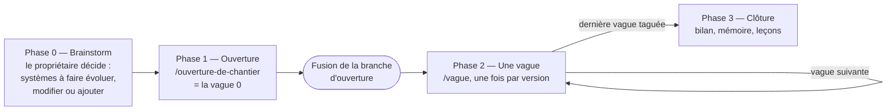
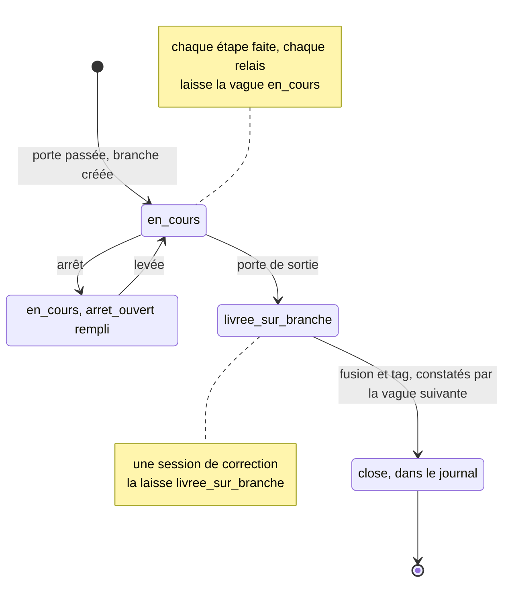
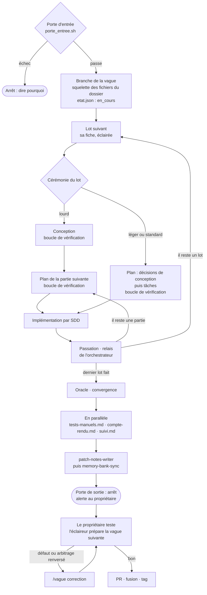
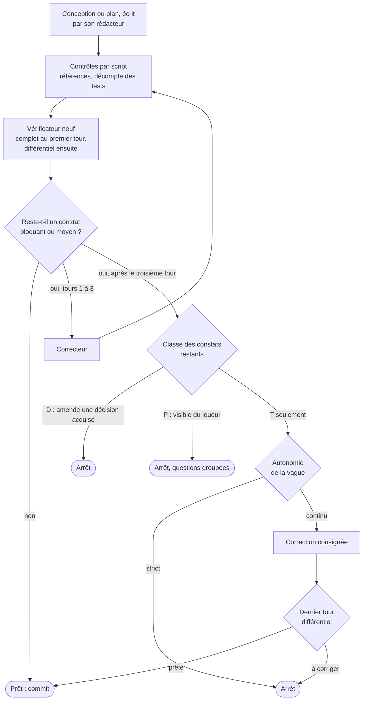

# Guide — le workflow par vagues, pas à pas

**Date** : 07/10/2026, à la demande du propriétaire.
**Rôle** : expliquer, étape par étape, comment fonctionne le workflow de développement par vagues : ses phases, ses fichiers et leur utilité, ses agents, ses scripts et ses hooks, ses portes et ses arrêts. Il se lit de bout en bout ; à chaque instant, il dit qui fait quoi, avec quoi, et ce qui en sort.
**Les trois documents du workflow** — un sujet, un seul endroit :

| Document | Ce qu'il dit |
|:---|:---|
| Ce guide | **Comment** tout fonctionne, pas à pas |
| [Le modèle](05-10-2026_modele_orchestration_par_vagues.md) | **Ce qui s'installe ou se copie** : les squelettes de fichiers, les `SKILL.md`, les fichiers d'agents et leurs gabarits, les scripts, les hooks — et la migration du chantier en cours |
| [L'audit](05-10-2026_audit_workflow_ia_et_orchestration_par_vagues.md) | **Pourquoi** : les mesures, la comparaison avec ce que font les autres, les recommandations R1 à R31 et leur statut |

**Statut** : proposition. **Rien n'est installé** — ni skill de méthode, ni agent, ni hook, ni script de vague, ni `docs/chantiers/`. Le chantier en cours reste conduit par son [fichier d'orchestration](01-10-2026_orchestration_chantier_economie_et_catalogue_Fable5.md). Ce guide décrit le workflow tel qu'il tournera une fois adopté ; le §16 dit l'état de chaque pièce, et ce que le guide précise par rapport au modèle. **★Rn** renvoie à la recommandation n de l'audit.

**Comment le lire** :

| § | Contenu |
|:---|:---|
| 1 | Le workflow en une page |
| 2 | Le vocabulaire |
| 3 | Tout ce qui existe, couche par couche |
| 4 | Les acteurs : toi, l'orchestrateur, les agents, les skills, les scripts, les hooks, GitHub |
| 5 | Les fichiers : à quoi sert chacun, qui l'écrit, quand, qui le lit |
| 6 | Phase 0 — le brainstorm |
| 7 | Phase 1 — l'ouverture d'un chantier |
| 8 | Phase 2 — une vague, étape par étape |
| 9 | La boucle de vérification |
| 10 | Arbitrer : les classes T, P, D et l'arbre à huit filtres |
| 11 | Phase 3 — la clôture |
| 12 | Les garde-fous |
| 13 | Les arrêts, et comment les lever |
| 14 | Mesurer et apprendre |
| 15 | Ta liste, phase par phase |
| 16 | Ce que ce guide précise, et l'état de chaque pièce |
| A | Du cycle actuel aux étapes du guide |
| B | Les recommandations de l'audit, étape par étape |

---

## 1. Le workflow en une page

**« La méthode », c'est le workflow lui-même** ★R23, vu de haut : les étapes, qui fait chacune, les portes qui les séparent, et les cas où tout s'arrête. Le détail — les prompts des agents, les commandes, les grilles — en fait partie, mais les graphes de ce guide la résument. Elle s'oppose au **chantier**, qui est ce qu'on construit (ses vagues, ses décisions, ses fiches), et au code.

**Les phases, de l'idée à la clôture** :



| Phase | Qui la lance | Ce qu'elle lit | Ce qu'elle produit | Tes gestes |
|:---|:---|:---|:---|:---|
| **0 — Le brainstorm** (§6) | toi, en conversation | le jeu, tes idées, la ROADMAP | un brainstorm : les systèmes à faire évoluer, à modifier ou à ajouter, et tes décisions numérotées | tout : c'est ta phase |
| **1 — L'ouverture** (§7) | `/ouverture-de-chantier <brainstorm> <chantier>` | le brainstorm, le code | le dossier du chantier, rempli, sur la branche `docs/ouverture-<chantier>` — c'est la vague 0 | valider le découpage ; relire et fusionner la branche ; répondre aux questions de classe P |
| **2 — Une vague** (§8) | `/vague <chantier>`, une fois par version, et une fois par plan | `etat.json`, la fiche de la vague | une version du jeu, sur sa branche | lancer et relancer ; répondre aux questions de l'éclaireur ; tester ; pousser, PR, fusion, tag |
| **3 — La clôture** (§11) | `/vague <chantier>`, après le dernier tag | tout le chantier | le bilan, la mémoire à jour, les leçons | relire et fusionner ; trancher les amendements de méthode |

**Sept principes** expliquent presque tout le reste :

1. **Une vague, une version, une branche, un test.** Chaque vague livre une version jouable du jeu, sur sa propre branche. Elle n'entre dans `main` qu'après ton test, par ta fusion, et ne devient une version publiée que par ton tag.
2. **Tu gardes ce qui t'appartient** : le *quoi* (le brainstorm et ses décisions), le découpage en vagues, les questions visibles du joueur (classe P), toute remise en cause d'une décision acquise (classe D), le test, la fusion, le tag, et les changements de méthode. Tout le reste est délégué.
3. **L'orchestrateur garde le fil, les agents font le travail.** La session que ta commande lance ne rédige, ne vérifie et n'implémente rien elle-même. Elle lance des agents, lit leurs conclusions, tranche les questions techniques, tient l'état et commite.
4. **Le squelette d'abord, puis un agent par fichier.** Un script ou l'orchestrateur crée les fichiers vides ; chaque fichier a ensuite un seul agent qui l'écrit. Des agents qui travaillent en parallèle n'écrivent jamais le même fichier, et seul l'orchestrateur commite.
5. **Ce qui se calcule se fait par script, ce qui se juge par un agent neuf.** Une porte, un décompte de tests, une référence citée : un script. Une conception, un plan, une convergence : un vérificateur qui n'a pas écrit ce qu'il vérifie, et qui prouve chaque constat par une commande ou une citation.
6. **Chaque session ne lit que ce qui la concerne.** L'état dans `etat.json`, le déroulé dans `orchestration.md`, la vague dans sa fiche. Le reste ne se lit que si une étape le demande.
7. **Tout s'arrête proprement.** Une porte qui ne passe pas, une boucle qui ne converge pas, une question qui t'appartient : la session s'arrête, écrit pourquoi, te prévient. Une session neuve reprend exactement là, une fois l'arrêt levé.

---

## 2. Le vocabulaire

| Terme | Sens | Où le trouver |
|:---|:---|:---|
| **Chantier** | Un programme de travail livré en plusieurs versions, de la sortie du brainstorm à la clôture | `docs/chantiers/<chantier>/` |
| **Vague** | Une étape du chantier, qui livre une version du jeu. La vague 0 est l'ouverture du chantier (phase 1) ; la clôture n'a pas de version | `vagues/<NN>-v<x.y.z>-<nom>/` |
| **Lot** | Une unité de travail d'une vague, qui reçoit son propre plan — et une conception, s'il est lourd. Les lots d'une vague se traitent en série | la fiche ; `orchestration.md` §1 |
| **Partie** | Une tranche d'un lot lourd : un plan par partie, écrit après l'implémentation de la précédente | `plan-<lot>-partie-<k>.md` |
| **Cérémonie** | La classe d'un lot — léger, standard, lourd —, qui décide de ses documents et de sa vérification ★R11 ★R31 | la fiche |
| **Brainstorm** | Ton document de décisions : le *quoi* | `docs/possible_upgrades/` |
| **Décision acquise, proposée** | Une décision numérotée du brainstorm (`D<n>`), que tu as tranchée (acquise) ou seulement avancée (proposée). Une décision acquise ne s'amende que par toi | le brainstorm |
| **Valeur mesurée** | Une valeur de jeu fixée sur la foi de l'oracle : elle ne change qu'avec une nouvelle mesure | le brainstorm ; le rapport de l'oracle |
| **Oracle** | Une simulation déterministe dont la sortie se compare à une référence suivie par git — aujourd'hui `tool/simulations/d26_economy_sim.dart` | `tool/simulations/` |
| **Revue** | La confrontation du brainstorm au code, faite à l'aveugle en phase 1 ★R12 | `docs/possible_upgrades/` |
| **Découpage** | La table des vagues, proposée par `decoupeur` et validée par toi | `orchestration.md` §1 |
| **Fiche** | Le cahier des charges d'une vague : décisions, état mesuré, critères de sortie, questions à arbitrer | `fiche.md` |
| **Conception** | Pour un lot lourd seulement, le document court qui tranche le *comment* du lot entier avant ses plans | `conception-<lot>.md` |
| **Plan** | Ce que SDD exécute : les décisions de conception en tête (lot léger ou standard), le *Review Focus*, la carte des fichiers, les tâches | `plan-<lot>….md` |
| **Review Focus** | En tête d'un plan, au plus cinq modes d'échec qu'aucun test ne garde encore, chacun confié à la tâche qui écrira ce test | le plan |
| **Tâche à risque** | Une tâche dont le plan écrit le code entier, et que le vérificateur rejoue dans un clone ★R1 | la fiche ; le plan |
| **Orchestrateur** | La session principale de Claude Code, lancée par ta commande, qui déroule une phase | §4.2 |
| **Agent** | Un sous-agent lancé par l'orchestrateur, au contexte neuf, défini par un fichier de `.claude/agents/` | §4.3 |
| **Skill** | Une procédure que Claude Code charge sur ta commande (`/vague`) ou à la demande d'un agent (`patch-notes-writer`) | `.claude/skills/` |
| **Hook** | Un script que Claude Code lance à un événement : avant une commande, à la fin d'un tour, à l'ouverture d'une session | `.claude/hooks/` |
| **SDD** | `superpowers:subagent-driven-development` : un implémenteur neuf par tâche, une revue après chacune, une revue d'ensemble à la fin | Superpowers |
| **Registre de SDD, *rulings*** | Les décisions que SDD prend en exécutant un plan. Il les tient dans `.superpowers/sdd/<plan>/`, les recopie sous « *Rulings I made* », puis supprime son espace de travail : elles sont à recopier avant | `compte-rendu.md` §2 |
| **Porte d'entrée, porte de sortie** | Les contrôles qui ouvrent une vague ; l'arrêt qui la termine | §8.4 ; §8.15 |
| **Étape** | Un moment nommé du déroulé (`plan`, `sdd`, `documents`…), que `etat.json` note pour la reprise | `etat.json › etape` |
| **Constat** | Ce que rend un vérificateur : où, quoi, la preuve, la gravité, la classe, la correction proposée | `verifications-<lot>.md` |
| **Gravité** | Bloquant, moyen, mineur, rédaction : la grille fixe du §9 | §9 |
| **Tour** | Une vérification. Le premier est complet ; les suivants sont différentiels : ils ne relisent que les corrections et ce qu'elles touchent ★R2 | §9 |
| **Classe T · P · D** | Le propriétaire d'une question : T, technique, l'orchestrateur ; P, visible du joueur, toi ; D, qui amenderait une décision acquise, toi, et c'est un arrêt ★R3 | la fiche ; §10 |
| **Arbitrage** | Une question tranchée, consignée avec ses options et le filtre qui a décidé | le plan ou la conception ; `verifications-<lot>.md` ; le compte rendu |
| **Autonomie** | `strict` ou `continu` : ce que fait l'orchestrateur après trois tours sans convergence, quand il ne reste que des constats de classe T ★R3 | la fiche ; `etat.json` |
| **Arrêt, levée** | Une session qui s'arrête et rend la main ; ce qui l'a débloquée | `orchestration.md` §2 ; `etat.json › arret_ouvert` |
| **Relais, passation** | À chaque fin de plan, l'orchestrateur écrit dix lignes de passation et termine sa session ; la suivante reprend ★R17 | `compte-rendu.md` §2 |
| **Éclaireur** | L'agent qui, pendant ton test de la vague N, remet la fiche N+1 à jour sur le code livré ★R8 | `fiche.md` |
| **Convergence** | La passe qui compare, en fin de vague, les décisions écrites au code livré ★R13 | §8.12 |
| **Porteurs de version** | Les trois fichiers qui portent le numéro de version et doivent concorder : `pubspec.yaml`, `assets/data/patch_notes.json`, `site/_site/versions.json` | `.github/scripts/verify_version.sh` |
| **Session de correction** | Une session ouverte sur une vague livrée, avant sa fusion, pour corriger ce que ton test a trouvé | §8.17 |
| **Clôture** | La session qui constate la fin du chantier, écrit son bilan et rassemble ses leçons | §11 |
| **Leçon, amendement de méthode** | Ce qu'une vague a appris, et ce qu'elle propose de changer à la méthode ; tu tranches | `orchestration.md` §6 |
| **Outillage** | Les versions de Superpowers et de Claude Code, figées pour la durée d'un chantier ★R14 | `etat.json › outillage` |

---

## 3. Tout ce qui existe, couche par couche

Le modèle (§1) explique pourquoi ces cinq couches — agents, méthode, outillage, chantier, vague. Voici leur inventaire complet ; chaque ligne dit à quoi sert la pièce, et le §16.2 dit où elle en est.

```
.claude/
├── skills/
│   ├── ouverture-de-chantier/SKILL.md     # phase 1 : ouvre un chantier depuis un brainstorm
│   ├── vague/SKILL.md                     # phases 2 et 3 : ouvre, reprend, lève, corrige, éclaire, clôt
│   │   └── references/                    # la grille de gravité, la forme du compte rendu
│   ├── patch-notes-writer/                # existe : la note de version et les porteurs de version
│   └── memory-bank-sync/                  # existe : le vault — adaptation proposée le 06/10
├── agents/<rôle>.md                       # un fichier par rôle (§4.3)
├── hooks/
│   ├── garde_vague.sh                     # PreToolUse : bloque les gestes de livraison sur une branche de chantier
│   ├── prevenir.sh                        # Stop : te prévient d'un arrêt, d'un relais, d'une livraison
│   └── etat_chantiers.sh                  # SessionStart, facultatif : affiche l'état des chantiers ouverts
└── settings.json                          # enregistre les trois hooks (modèle §7.8)
tool/
├── chantiers/squelette.sh                 # phase 1 : crée le dossier d'un chantier depuis le modèle
├── vagues/porte_entree.sh                 # phase 2 : la porte d'entrée — rend 0, ou la liste des échecs
├── vagues/verifier_references             # chaque chemin et chaque symbole cité par un document existe
├── vagues/mesure_session                  # les statistiques d'une session, aux mêmes définitions à chaque vague
└── simulations/                           # existe : l'oracle et sa sortie de référence
docs/
├── possible_upgrades/                     # le brainstorm, sa revue, le rapport de l'oracle
├── chantiers/
│   ├── _modele/                           # ce que copient squelette.sh et l'étape « branche »
│   └── <chantier>/                        # un dossier par chantier (§5.1)
├── ROADMAP.md                             # une ligne par chantier, qui renvoie à son dossier
└── INDEX.md                               # une ligne par chantier
.obsidian_vault/                           # la mémoire : _memory_bank, _adr, _rules, _patterns
pubspec.yaml · assets/data/patch_notes.json · site/_site/versions.json   # les porteurs de version
.github/                                   # la CI, la release au tag, verify_version.sh
.superpowers/                              # ignoré par git : les fichiers de travail (§5.6)
```

---

## 4. Les acteurs

### 4.1. Toi

| Ce qui t'appartient | Quand | Comment |
|:---|:---|:---|
| Écrire le brainstorm, trancher ses décisions | phase 0 | en conversation, puis un commit dans `main` |
| Valider le découpage en vagues | phase 1, étape 4 | en répondant à la session, qui t'attend |
| Relire et fusionner la branche d'ouverture | fin de phase 1 | pousser, PR, fusion — c'est la vague 0 |
| Répondre aux questions de classe P, fixer l'autonomie d'une vague | avant que la vague s'ouvre | dans sa fiche : la dernière colonne de « À arbitrer », la ligne « Autonomie » de l'en-tête |
| Lancer une vague, la relancer après chaque relais | phase 2 | `/vague <chantier>` |
| Lever un arrêt | phase 2 | corriger ce qui l'a causé, puis `/vague <chantier> levee <ce qui le lève>` |
| Lancer l'éclaireur | pendant ton test | `/vague <chantier> eclaireur` |
| Tester une vague | après sa porte de sortie | en suivant et en remplissant `tests-manuels.md` |
| Demander une correction | après ton test, avant la fusion | `/vague <chantier> correction <ce que tu as trouvé>` |
| Pousser, ouvrir la PR, fusionner par un commit de fusion, poser le tag | après un test bon | git et GitHub |
| Trancher les leçons et les amendements de méthode | à chaque vague, et à la clôture | `orchestration.md` §6 ; un ADR pour chaque amendement retenu |
| Monter de version l'outillage | entre deux chantiers | ★R14 |

**Tu peux toujours reprendre la main** : interrompre une session, éditer un fichier, commiter. Une session neuve repart de l'état écrit — `etat.json`, le journal, les fichiers —, jamais de ce qu'une session précédente avait en tête.

**Le workflow suppose des sessions locales**, sur ta machine : la branche d'une vague y vit, et c'est toi qui la pousses. Une session dans le cloud devrait pousser sa branche pour te la rendre, ce que le hook `garde_vague` lui interdit ; il lui faudrait une exception, écrite au §3 de `orchestration.md`.

### 4.2. L'orchestrateur

- **Qui c'est** : la session principale de Claude Code, celle que lance ta commande `/ouverture-de-chantier` ou `/vague`. Le skill chargé lui donne sa procédure.
- **Pourquoi la session principale** : dans Claude Code, un sous-agent ne peut pas lancer d'autre sous-agent. Seule la session principale peut lancer les rédacteurs et les vérificateurs, et faire tourner SDD, qui lance ses implémenteurs depuis cette même session.
- **Ce qu'il fait** :
  - il lit l'état, et passe les portes par script ;
  - il lance les agents, en leur donnant dans son message la partie variable de leur mission : le lot, les chemins, les décisions, le mode ;
  - il ne garde de chaque agent que sa conclusion ;
  - il tranche les questions de classe T par l'arbre du §10 ;
  - il tient `etat.json`, le journal de `orchestration.md` et `verifications-<lot>.md` ;
  - avant chaque commit, il vérifie par `git status` que chaque agent n'a écrit que son fichier ;
  - il commite, et il s'arrête quand une règle le demande.
- **Ce qu'il ne fait jamais** : rédiger un document dont un agent a la charge ; implémenter ; tenir pour vérifié ce qu'aucun vérificateur neuf n'a relu ; pousser, ouvrir une PR, fusionner, poser un tag ; enfreindre un garde-fou de jugement (§12).
- **Ce qu'il lit à l'ouverture** : `CLAUDE.md`, `etat.json`, `orchestration.md`, la fiche de sa vague, et les sections « Leçons » et « Pour la file » du compte rendu précédent. Ni les autres fiches, ni le brainstorm en entier : seulement les sections que la fiche cite.
- **Combien de temps il vit** : une session par plan ★R17. À la fin de chaque plan exécuté, il écrit sa passation et s'arrête ; tu relances `/vague <chantier>`, et la session suivante reprend à l'étape notée. La phase 1, la fin de vague et la clôture tiennent chacune dans une session.

### 4.3. Les agents

**Les règles communes** :
- un agent part d'un contexte neuf : il ne voit pas la conversation de l'orchestrateur, et reçoit tout ce qu'il lui faut par chemin de fichier ;
- sa partie fixe — mission, méthode, grille, format de sortie — vit dans son fichier, `.claude/agents/<rôle>.md` ; sa partie variable arrive par le message de l'orchestrateur ;
- un vérificateur n'est jamais le rédacteur de ce qu'il vérifie, et n'a pas d'outil d'édition ;
- un constat se prouve par une commande ou une citation, jamais de mémoire ;
- un agent n'écrit que le fichier qu'on lui confie, et ne commite jamais — l'éclaireur seul fait exception, et ne commite que sa fiche ;
- l'orchestrateur ne garde de chaque agent que sa conclusion.

Les modèles s'écrivent « le plus capable » et « intermédiaire » : on les remplace, le jour de l'adoption, par les valeurs que le champ `model:` de Claude Code accepte.

**Les agents de la phase 1** :

| Agent | Étape | Mission | Lit | Écrit | Rend | Outils · modèle | Fichier |
|:---|:---|:---|:---|:---|:---|:---|:---|
| `enqueteur-code` | revue | Répondre à des questions neutres sur le code, sans lire le brainstorm | `lib/`, `assets/data/`, `test/`, `tool/` — aucun document | rien | ses réponses, avec les symboles et les tests qui les portent ; « non établi » faute de preuve | lecture, Bash · intermédiaire | écrit (modèle A.2) |
| `reviseur-brainstorm` | revue | Confronter ces réponses aux affirmations du brainstorm | le brainstorm, les réponses | la revue, à côté du brainstorm | sa table de constats, dont les décisions fondées sur une lecture fausse du code | lecture, Bash, écriture · le plus capable | à écrire |
| `decoupeur` | découpage | Proposer les vagues | le brainstorm, la revue, la ROADMAP, `pubspec.yaml` | rien | la table des vagues, « pourquoi cet ordre », la vague de chaque décision, le JSON | lecture, Bash · le plus capable | écrit |
| `redacteur-orchestration` | orchestration | Écrire `orchestration.md` | le brainstorm, la revue, le découpage validé | `orchestration.md` | le chemin | lecture, Bash, édition · le plus capable | à écrire |
| `redacteur-fiche` — un par vague | fiches | Écrire la fiche d'une vague | `CLAUDE.md`, les décisions de sa vague, sa ligne du §1 et ses transitions, le code | sa `fiche.md` | le chemin, ses questions de classe P | lecture, Bash, édition · le plus capable | écrit |
| `redacteur-suivi` | fiches | Écrire l'en-tête de `suivi.md` | le modèle du suivi, le brainstorm, le découpage | `suivi.md` | le chemin | lecture, édition · intermédiaire | à écrire |
| `verificateur-ouverture` | rodage | Rejouer à blanc la porte de la vague 1 ; vérifier les fiches et `orchestration.md` | le chantier, le brainstorm, le code | rien | une table de constats, « prêt » ou « à corriger » | lecture, Bash · le plus capable | écrit |
| `correcteur` | rodage | Corriger les constats, et rien d'autre ; contester, preuve à l'appui, ceux qu'il juge faux | le document, les constats | les fichiers que les constats visent | les constats traités, un par un | lecture, Bash, édition · le plus capable | à écrire, depuis le gabarit actuel §4.6 |

**Les agents de la phase 2** :

| Agent | Étape | Mission | Lit | Écrit | Rend | Outils · modèle | Fichier |
|:---|:---|:---|:---|:---|:---|:---|:---|
| `eclaireur` ★R8 | pendant ton test | Remettre la fiche N+1 à jour sur le code de la vague N | `orchestration.md`, la fiche N+1, la branche N | la fiche N+1, en un commit | les prémisses corrigées, les questions de classe P | lecture, Bash, édition de la seule fiche · le plus capable | gabarit, modèle §6.4 |
| `redacteur-conception` ★R31 | conception (lot lourd) | Trancher le *comment* du lot entier, et proposer ses parties | la fiche, les sections citées du brainstorm, le code | `conception-<lot>.md` | le chemin, la table des arbitrages | lecture, Bash, édition · le plus capable | à écrire, depuis le gabarit actuel §4.1 |
| `verificateur-conception` ★R2 | conception | Vérifier la conception contre la fiche, le brainstorm et le code | la conception, la fiche ; en différentiel, les corrections et `verifications-<lot>.md` | rien | les constats ; « pour le Review Focus du plan » ; « prête » ou « à corriger » | lecture, Bash · le plus capable | gabarit, modèle §6.1 |
| consolidateur | conception, lot lourd à panel | Fusionner les tables de plusieurs vérificateurs ; ne relever une gravité qu'avec une preuve reproduite | les tables | rien | une table | lecture, Bash · le plus capable | une consigne, modèle §6.1 |
| `redacteur-plan` ★R1 | plan | Écrire le plan avec `superpowers:writing-plans` | la fiche, la conception (lot lourd), la base de tests, les tâches à risque, les trous de test remontés, le plan de référence | `plan-<lot>….md` | le chemin, la carte des fichiers, le rapport de longueur | lecture, Bash, édition · le plus capable | gabarit, modèle §6.2 |
| `verificateur-plan` ★R1 | plan | Vérifier le plan contre la fiche, la conception et le code | le plan, la fiche, la conception, la base de tests | rien — il rejoue dans un clone jetable | les constats, « prêt » ou « à corriger » | lecture, Bash · le plus capable | gabarit, modèle §6.3 |
| `correcteur` | conception, plan | Comme en phase 1 | | | | | |
| implémenteur, relecteur, relecteur d'ensemble | sdd | Ceux de SDD | la fiche de tâche de SDD | le code et ses tests | ceux de SDD | ceux de SDD · intermédiaire pour l'implémenteur | Superpowers |
| `verificateur-convergence` ★R13 | convergence | Dire, pour chaque décision et chaque critère de sortie, si le code le livre | les décisions de la vague, les critères de la fiche, le diff | rien | la table « livré · partiel · absent », et le code qu'aucune décision ne demande | lecture, Bash · le plus capable | gabarit, modèle §6.5 |
| `redacteur-tests-manuels` ★R22 | documents | Écrire les tests d'interface que tu joueras | les plans, le diff | `tests-manuels.md` | les tests, classés par risque | lecture, Bash, édition · intermédiaire | à écrire |
| `redacteur-compte-rendu` | documents | Écrire le compte rendu, hors statistiques | le journal, `verifications-<lot>.md`, les décisions de SDD et les passations déjà recopiées | `compte-rendu.md`, sauf son §7 | le chemin | lecture, Bash, édition · le plus capable | à écrire |
| `redacteur-suivi` | documents | Écrire la section de la vague | la fiche, les plans, le diff | sa section de `suivi.md` | le chemin | lecture, édition · intermédiaire | à écrire |
| agent de `patch-notes-writer` | skills | Invoquer le skill, version imposée | la ligne « Ce que le joueur voit » de la fiche, les plans | la note, les porteurs de version, les liens du site | la version écrite, les fichiers touchés | ceux du skill | gabarit actuel §4.5 |
| agent de `memory-bank-sync` | skills ; fin de phase 1 ; clôture | Invoquer le skill | la fiche, le diff de la branche | le vault, la ROADMAP | les fichiers écrits | ceux du skill | gabarit actuel §4.5 |
| `game-designer` ★R25 | au besoin | Retenu le 06/10 ; son usage se fixe en écrivant son fichier (§16.1) | | | | | à écrire |

**Trois précisions** :
- **Le correcteur** peut être le rédacteur repris avec son contexte, si l'outil le permet ; sinon un agent neuf. S'il conteste un constat, il ne le corrige pas : il le dit, avec sa preuve, et l'orchestrateur tranche (§9).
- **SDD** vient de Superpowers : ses implémenteurs et ses relecteurs n'ont pas de fichier dans `.claude/agents/`. Les contraintes que l'orchestrateur leur transmet sont au §8.9.
- **Les deux skills de fin** sont délégués chacun à un agent qui l'invoque : le contexte de l'orchestrateur ne grossit pas de leurs lectures.

### 4.4. Les skills

| Skill | Lancé par | Où | Ce qu'il fait | État |
|:---|:---|:---|:---|:---|
| `ouverture-de-chantier` | toi : `/ouverture-de-chantier <brainstorm> <chantier>` | phase 1 | ouvre un chantier (§7) | `SKILL.md` écrit, modèle Annexe A ; non installé |
| `vague` | toi : `/vague <chantier> [eclaireur \| correction <…> \| levee <…>]` | phases 2 et 3 | trouve le mode, puis ouvre, reprend, lève, corrige, éclaire ou clôt (§8, §11) | squelette, modèle Annexe B |
| `superpowers:brainstorming` | toi, si tu veux | phase 0 | conduit un brainstorm | installé |
| `superpowers:writing-plans` | `redacteur-plan` | `plan` | la forme d'un plan | installé |
| `superpowers:subagent-driven-development` | l'orchestrateur | `sdd` | exécute un plan, tâche par tâche | installé |
| `superpowers:finishing-a-development-branch` | **personne** | — | SDD y enchaîne de lui-même, et propose de fusionner, de pousser ou d'ouvrir une PR : rien de cela n'est à l'orchestrateur | — |
| `patch-notes-writer` | un agent | `skills` ; `correction` | la note de version, les trois porteurs, les liens du site | installé |
| `memory-bank-sync` | un agent | fin de phase 1 ; `skills` ; `correction` ; clôture | le vault, la ROADMAP | installé ; [adaptation proposée le 06/10](06-10-2026_memory_bank_sync_adapte_aux_vagues.md) |

Les deux skills de méthode portent `disable-model-invocation: true` : Claude ne les lance jamais de lui-même, seule ta commande le fait.

### 4.5. Les scripts

| Script | Qui le lance | Quand | Ce qu'il rend | État |
|:---|:---|:---|:---|:---|
| `tool/chantiers/squelette.sh <chantier> <découpage>` | l'orchestrateur | phase 1, `squelette` | le dossier du chantier et `etat.json` initial ; refuse un chantier qui existe déjà | esquisse, testée le 07/10 (modèle A.3) |
| `tool/vagues/porte_entree.sh <chantier> <branche>` | l'orchestrateur ; `verificateur-ouverture`, à blanc | `porte` | 0, ou la liste de ce qui échoue | esquisse (modèle §7.3) |
| `tool/vagues/verifier_references <document>` | chaque vérificateur, avant de lire | chaque tour | les chemins et les symboles cités qui n'existent pas | à écrire |
| `tool/vagues/mesure_session` | l'orchestrateur | `sortie` ; `correction` | le §7 du compte rendu, la ligne du tableau de bord | à écrire |
| l'oracle, `tool/simulations/…` | l'orchestrateur, en arrière-plan | `oracle` ; `correction` | sa sortie complète, à comparer à la référence | existe |
| `.github/scripts/verify_version.sh <version>` | `porte` ; l'orchestrateur après `patch-notes-writer` | | 0 si les trois porteurs concordent | existe |
| `.github/scripts/test_scripts.sh` | l'orchestrateur après `patch-notes-writer` | | les tests des scripts de release | existe |
| `tool/sync_assets.dart` | un implémenteur | après un dossier neuf sous `assets/` | `pubspec.yaml` réaligné | existe |
| `tool/vault_valeurs.dart` | `memory-bank-sync` adapté | `skills` | les blocs de valeurs du vault, générés depuis la donnée | proposé le 06/10 |

Les scripts de `tool/vagues/` passent `dart analyze` s'ils sont en Dart, et la section « Tooling » de `CLAUDE.md` les nomme.

### 4.6. Les hooks

| Hook | Événement | Ce qu'il fait | Quand il se tait | État |
|:---|:---|:---|:---|:---|
| `garde_vague.sh` ★R4 | `PreToolUse`, sur Bash | Bloque, en sortant en 2 : `git push`, `git add -A`, `git add .`, `git add --all`, `dart format`, `gh pr create`, `gh pr merge`, `gh release`, `git reset --hard`, `git worktree add`, `git clean` — sur une branche `feat/v*`, `docs/ouverture-*` ou `docs/cloture-*`. Claude reçoit le motif et choisit un autre geste | Hors de ces branches. Il ne voit que les commandes de Claude, jamais celles que tu tapes dans ton terminal | esquisse testée le 05/10 ; `docs/ouverture-*` ajouté le 07/10 |
| `prevenir.sh` ★R18 | `Stop`, à chaque fin de tour | Lit chaque `etat.json` ouvert, et t'envoie un message par un webhook dédié pour un arrêt, un relais, une livraison — une seule fois par événement | Si `ALERTE_URL` n'est pas définie ; si ce message est déjà parti | esquisse (modèle §7.6) |
| `etat_chantiers.sh` | `SessionStart` | Affiche une ligne par chantier ouvert : vague, version, état, étape, branche | Aucun chantier ouvert | esquisse, facultatif (modèle §7.5) |

Ils s'enregistrent dans `.claude/settings.json` (modèle §7.8). Le webhook d'alerte est **distinct de celui des releases** : les alertes de travail ne se mêlent pas aux annonces publiques. Son URL est un secret, qui reste dans ton environnement local.

### 4.7. GitHub

- **`main` protégé** : PR obligatoire, CI verte. C'est le vrai verrou de « jamais sur `main` » ★R4 — à poser par toi, dans les réglages du dépôt.
- **La CI** (`ci.yml`) tourne sur chaque PR : `dart analyze --fatal-infos`, `flutter test`, les tests du site par `node --test`.
- **La release** (`release.yml`) part de ton tag `v<version>` : elle revérifie la version et les tests, construit le jeu et le publie, puis l'annonce par le webhook Discord des releases.

---

## 5. Les fichiers

### 5.1. L'arborescence d'un chantier

```
docs/chantiers/<chantier>/
├── orchestration.md                      # comment et quand : vagues, ordre, journal, cohérence, leçons
├── etat.json                             # où en est le chantier, pour les machines et pour la reprise
├── suivi.md                              # ce que chaque vague apporte au jeu, sans technique
└── vagues/
    ├── 01-v0.6.1-<nom>/                  # un lot standard
    │   ├── fiche.md
    │   ├── plan-<lot>.md
    │   ├── verifications-<lot>.md
    │   ├── tests-manuels.md
    │   └── compte-rendu.md
    ├── 02-v0.6.2-<nom>/                  # un lot lourd en deux parties
    │   ├── fiche.md
    │   ├── conception-<lot>.md
    │   ├── plan-<lot>-partie-1.md
    │   ├── plan-<lot>-partie-2.md
    │   ├── verifications-<lot>.md
    │   ├── tests-manuels.md
    │   └── compte-rendu.md
    ├── …
    └── cloture/
        └── fiche.md
```

Les règles de nommage sont au modèle, §2.

### 5.2. Qui écrit quoi, et quand

| Fichier | Créé | Écrit ensuite par | Figé |
|:---|:---|:---|:---|
| `orchestration.md` | phase 1, `squelette` | `redacteur-orchestration` (phase 1) ; l'orchestrateur : le journal à `branche`, à `sortie` et à chaque correction, une ligne à chaque arrêt et à chaque levée, le tableau de bord et les leçons à `sortie` | à la clôture |
| `etat.json` | phase 1, `squelette` | l'orchestrateur, à chaque étape, dans le commit de l'étape | à la clôture (`chantier_clos`) |
| `suivi.md` | phase 1, `squelette` | `redacteur-suivi` : l'en-tête (phase 1), la section de chaque vague (`documents`, et `correction` si ce que la vague apporte change), le bilan (clôture) | à la clôture |
| `fiche.md` | phase 1, `squelette` | `redacteur-fiche` (phase 1) ; l'`eclaireur`, pendant le test de la vague précédente ; toi, pour les réponses P et l'autonomie | à l'ouverture de sa vague |
| `conception-<lot>.md` | `conception` | `redacteur-conception`, puis `correcteur` ; une correction, pour un arbitrage renversé | au tag |
| `plan-<lot>….md` | `plan` | `redacteur-plan`, puis `correcteur` ; une correction, pour un arbitrage renversé | au tag |
| `verifications-<lot>.md` | `branche`, vide | l'orchestrateur, à chaque tour de vérification | au tag |
| `compte-rendu.md` | `branche`, vide | l'orchestrateur : les décisions de SDD et la passation à chaque fin de plan ; `redacteur-compte-rendu` à `documents` ; `mesure_session` à `sortie` ; une section par correction | au tag |
| `tests-manuels.md` | `branche`, vide | `redacteur-tests-manuels` à `documents` ; toi, pendant ton test ; une correction, pour la colonne « Corrigé par » | au tag |

**« Figé » veut dire** : plus personne n'y touche. Une vague se rouvre en place tant qu'elle n'est pas taguée ; après son tag, ce qu'elle a écrit est de l'histoire.

### 5.3. Les fichiers du chantier

#### `orchestration.md`

- **À quoi il sert** : le déroulé du chantier. L'ordre des vagues et sa raison, ce que livre chacune et sa version, le journal des jalons, les arrêts, le tableau de bord, ce que le chantier précise de la méthode, la cohérence entre les lots, les leçons. Il fait foi pour le *comment* et le *quand* ; le brainstorm fait foi pour le *quoi*.
- **Ce qu'il contient** :
  - un en-tête : statut, méthode et sa version, périmètre, sources, et le `sha` de `main` contre lequel il a été vérifié ;
  - §0, ce que fait la session qui l'ouvre, et les commandes ;
  - §1, la table des vagues : numéro, version, dossier, lots, cérémonie, ce que le joueur voit, dépendances, branche, critère de sortie ; puis « pourquoi cet ordre » ;
  - §2, le journal, les arrêts, le tableau de bord ;
  - §3, ce que le chantier précise de la méthode : ses décisions acquises, ses valeurs mesurées, ses principes, son oracle, ses contraintes, ses exceptions aux garde-fous ;
  - §4, la cohérence : chaque décision a sa vague ; les transitions entre lots ; ce que l'oracle impose ;
  - §5, les points ouverts ; §6, les leçons et les amendements proposés.
- **Qui le lit** : chaque orchestrateur, à l'ouverture ; `porte_entree.sh`, qui y cherche la branche de la vague ; `verificateur-ouverture` ; l'éclaireur ; toi.
- **Ses règles** : 150 à 250 lignes. Le journal ne bouge qu'aux jalons — l'ouverture d'une vague, sa livraison, une correction — et chaque cellule tient en une ligne de texte : le récit va dans le compte rendu. Aucune décision de conception n'y est écrite. Chaque mise à jour se commite avec le document qu'elle accompagne, sur la branche de la vague.
- **Son squelette** : modèle, §4.1.

#### `etat.json`

- **À quoi il sert** : dire où en est le chantier, aux scripts, aux hooks, et à toute session qui l'ouvre — c'est lui qui permet la reprise.
- **Ce qu'il contient** :

  | Champ | Sens |
  |:---|:---|
  | `chantier`, `methode` | Le nom du chantier ; la méthode et sa version, `orchestration-par-vagues@<n>` |
  | `chantier_clos` | `true` une fois la clôture faite, et seulement par elle |
  | `vague`, `dossier`, `branche` | La vague courante, son dossier, sa branche |
  | `version_du_jeu` | La version du jeu à la sortie de la vague courante — celle d'avant pour une vague sans version |
  | `etat` | `en_cours` · `livree_sur_branche` · `faite` (vague 0, clôture) |
  | `etape` | `"<portée> · <étape> · <fait \| en cours>"` — la portée est le lot (avec sa partie) ou `fin` ; les étapes sont celles du §8. Par exemple `"p43-e3 partie 2 · sdd · fait"`, `"fin · documents · en cours"`, `"ouverture · fiches · fait"` |
  | `base_tests`, `total_tests` | Le total de `flutter test` à l'ouverture de la vague, et le dernier relevé |
  | `autonomie` | `strict` · `continu`, recopiée de la fiche à l'ouverture de la vague |
  | `arret_ouvert` | `null`, ou `"<JJ/MM> · <étape> · <classe> · <motif en une ligne>"` |
  | `outillage` | Les versions de Superpowers et de Claude Code, relevées à l'ouverture du chantier ★R14 |
  | `maj` | La date de la dernière écriture |

- **Qui le lit** : `porte_entree.sh`, `prevenir.sh`, `etat_chantiers.sh`, le skill `vague` pour trouver son mode, l'orchestrateur à chaque reprise.
- **Ses règles** : seul l'orchestrateur l'écrit, à chaque étape, dans le commit du document que l'étape produit. On ne retire jamais un champ. La porte d'entrée le valide (`jq empty`) avant tout le reste. **Il vit sur la branche** : tant qu'une branche de vague est ouverte, c'est le sien qui fait foi ; sur `main`, on lit l'état de la dernière vague fusionnée.
- **Son squelette** : modèle, §4.2.

#### `suivi.md`

- **À quoi il sert** : le récit non technique du chantier — ce que chaque vague apporte au jeu, pour quelqu'un qui y joue et ne lit pas le code.
- **Ce qu'il contient** : un en-tête, avec la ligne « Avancement » ; une section par vague livrée — deux paragraphes courts, **pourquoi cette vague** et **ce qu'elle apporte au jeu** ; à la clôture, le bilan du chantier.
- **Qui l'écrit** : `redacteur-suivi`, toujours.
- **Ses règles** : celles du modèle du suivi, aujourd'hui `docs/suivi_vagues_chantier/_modele_suivi.md`, demain `docs/chantiers/_modele/suivi.md`. On écrit ce que la vague a livré, pas ce qui était prévu ; un identifiant se traduit par le nom que le jeu affiche.

### 5.4. Les fichiers d'une vague

#### `fiche.md`

- **À quoi elle sert** : le cahier des charges de la vague. Elle découpe le brainstorm pour chacun de ses lots, et dit ce que tu as déjà tranché pour elle. C'est le seul document de cadrage que l'orchestrateur lit en entier.
- **Ce qu'elle contient** : un en-tête — cérémonie, tâches à risque, autonomie, date de mesure et date d'éclairage. Puis, pour chaque lot :
  - les fichiers que le lot produira, et ses décisions (`D<n>`) avec leurs réserves ;
  - ce qu'il faut lire ;
  - l'**état mesuré**, cité par symbole (`chemin › Classe.membre`) et non par ligne ★R10 ;
  - ce que le lot doit fixer, et ses **critères de sortie**, chacun avec sa preuve ;
  - la table **« À arbitrer »** : chaque question avec sa classe, ses options, la recommandation, et ta réponse pour une question de classe P ;
  - « Ne pas absorber », les transitions, l'oracle, ce que `memory-bank-sync` aura à faire, ce que le joueur verra.
- **Qui l'écrit** : `redacteur-fiche` en phase 1 ; l'éclaireur avant que la vague s'ouvre ; toi, pour tes réponses. Ensuite, personne : ce que la vague a fait est dans son compte rendu.
- **Son squelette** : modèle, §4.3.

#### `conception-<lot>.md` — lot lourd seulement

- **À quoi elle sert** : trancher le *comment* d'un lot trop gros pour un seul plan, avant que le premier plan s'écrive. Les plans de ses parties s'écrivent un à un, chacun sur le code que la partie précédente a laissé ; il faut donc que les décisions du lot soient fixées avant.
- **Ce qu'elle contient** : en 200 à 300 lignes, les décisions du lot — pour chaque arbitrage, le choix retenu et sa raison, en un paragraphe —, les données (fichiers et champs, en `_fr` et `_en`), les interfaces, les textes que le joueur lira, les critères de sortie, le découpage en parties et l'invariant qui justifie leur ordre. Aucun code.
- **Ce qu'elle ne contient pas** : les options écartées et le journal des tours, qui vont dans `verifications-<lot>.md` ★R15.

#### `plan-<lot>.md` et `plan-<lot>-partie-<k>.md`

- **À quoi il sert** : dire à SDD quoi faire, tâche par tâche, et dire au vérificateur ce qu'il doit tenir pour vrai.
- **Ce qu'il contient**, dans cet ordre :
  1. le but, l'architecture, les contraintes globales ;
  2. **pour un lot léger ou standard**, les décisions de conception : les arbitrages (le choix et sa raison), les données, les interfaces, les textes joueur en `_fr` et `_en`, les critères de sortie ★R31 ;
  3. le **Review Focus** : au plus cinq modes d'échec, chacun confié à une tâche ;
  4. la carte des fichiers ;
  5. les tâches, `### Task N: …`, chacune avec ses fichiers, ses signatures exactes, les valeurs imposées, ses tests nommés et leur assertion clé, sa commande de vérification et ce qu'elle doit rendre, et le total de tests attendu ★R1 ;
  6. la dernière tâche : la vérification finale.
- **Ce qu'il ne contient pas** : le code des tâches ordinaires — il n'est écrit en entier que pour les tâches à risque, ou pour un algorithme imposé ligne à ligne. Ni création de branche, ni commit sur `main`, ni poussée, ni PR, ni skill de livraison ou de synchronisation.

#### `verifications-<lot>.md` ★R15

- **À quoi il sert** : garder l'histoire de la conception et des plans du lot, pour qu'ils ne portent que leurs décisions.
- **Ce qu'il contient** : pour chaque arbitrage, les options écartées et le filtre qui a tranché ; pour chaque tour de vérification, son numéro, son mode, ses constats par gravité, ce qui a été corrigé, ce qui a été contesté et tranché.
- **Qui l'écrit** : l'orchestrateur, à chaque tour. **Qui le lit** : un vérificateur en mode différentiel ; le rédacteur du compte rendu ; toi, si tu veux savoir pourquoi une option a été écartée.

#### `compte-rendu.md`

- **À quoi il sert** : ce que la vague a décidé, livré, coûté, et ce qu'elle a appris. C'est le fichier que lit une session de correction, et la source de la ligne du tableau de bord.
- **Ce qu'il contient** :
  - §0, **une page pour toi** ★R16 : trente lignes au plus — ce qu'il faut tester d'abord, les arbitrages que le joueur verra, ceux faits sans toi, les risques connus, les trois commandes qui rejouent l'essentiel ;
  - §1, la branche et ses chiffres, avec l'outillage ;
  - §2, la table des arbitrages : par conception, par plan, puis les décisions de SDD plan après plan ; les arbitrages faits en autonomie `continu`, à part ; les passations des relais ;
  - §3, le renvoi à `tests-manuels.md`, et ses résultats une fois ton test fait ;
  - §4, l'oracle ; §5, ce qui a été trouvé périmé, et ce qui mérite d'entrer dans la file ;
  - §6, les leçons ★R9 : cinq au plus, chacune avec sa preuve et l'amendement qu'elle propose ;
  - §7, les statistiques de la session, produites par `mesure_session` ;
  - puis une section par session de correction.
- **Son squelette** : modèle, §4.4.

#### `tests-manuels.md` ★R22

- **À quoi il sert** : te dire quoi jouer pour voir chaque changement, et garder ce que tu as trouvé.
- **Ce qu'il contient** : l'en-tête (date, `sha`, plateforme, résultat) ; « À tester d'abord », du plus risqué au moins risqué ; un bloc par test — atteindre la situation, faire, attendu (chiffres compris), ce qui ne doit pas changer, résultat ; la table des défauts trouvés, avec la colonne « Corrigé par ».
- **Ses règles** : le menu de debug ne change pas ; un test dit seulement quels onglets existants utiliser, et avec quelles valeurs. Tes ❌ ouvrent une session de correction, et leur nombre remplit la colonne « Défauts au test du propriétaire » du tableau de bord.
- **Son squelette** : modèle, §4.6.

### 5.5. Hors du dossier d'un chantier

| Fichier | Où | Qui l'écrit | Son rôle dans le workflow |
|:---|:---|:---|:---|
| Le brainstorm | `docs/possible_upgrades/` | toi, en phase 0 | Le *quoi* ; la source des décisions `D<n>` |
| Sa revue | `docs/possible_upgrades/` | `reviseur-brainstorm`, en phase 1 | Ce que le code confirme ou contredit dans le brainstorm |
| Le rapport de l'oracle | `docs/possible_upgrades/` | phase 0 | Les mesures derrière les valeurs mesurées |
| Le script de l'oracle et sa sortie de référence | `tool/simulations/` | phase 0 ; un plan qui le réaligne ; l'étape `oracle` qui recommite la référence | La non-régression des valeurs |
| La note de version, les porteurs de version, les liens du site | `assets/data/patch_notes.json`, `pubspec.yaml`, `site/` | `patch-notes-writer`, seul | Ce que le joueur lit ; la version |
| Le vault | `.obsidian_vault/` | `memory-bank-sync`, seul | La mémoire durable : contexte, progrès, ADR, règles, patterns |
| La ROADMAP | `docs/ROADMAP.md` | `memory-bank-sync` | Une ligne par chantier, ouverte en phase 1, close à la clôture |
| L'index | `docs/INDEX.md` | l'orchestrateur, en phase 1 | Une ligne par chantier, vers son dossier — plus une ligne par document |
| `CLAUDE.md` | racine | toi, à l'adoption | Sa « Documentation Map » renvoie à `docs/chantiers/` ; sa section « Tooling » nomme les scripts |

### 5.6. Les fichiers de travail, ignorés par git

`.superpowers/` est ignoré par git. Rien de durable n'y vit : ce qui doit survivre part dans un fichier suivi avant que le fichier de travail disparaisse.

| Fichier | Écrit par | Lu par | Vie |
|:---|:---|:---|:---|
| `decoupage-<chantier>.json` | l'orchestrateur, phase 1, étape 4 | `squelette.sh` | Inutile une fois le squelette créé : la table du §1 de `orchestration.md` fait foi |
| `sdd/<plan>/` | SDD | SDD | Supprimé par SDD à la fin du plan : ses décisions sont recopiées dans le compte rendu avant |
| `<oracle>_vague_<N>.md` | l'oracle | l'orchestrateur, pour le diff | Supprimé avant chaque lancement, pour qu'une sortie périmée ne se compare jamais à sa place |
| `dernier_message_<chantier>` | `prevenir.sh` | `prevenir.sh` | Le dernier message envoyé, pour ne pas l'envoyer deux fois |

---

## 6. Phase 0 — le brainstorm

### 6.1. Ce que c'est

C'est ta phase. Tu y apportes les précisions et les décisions sur les systèmes à faire évoluer, à modifier ou à ajouter, en conversation avec Claude. `superpowers:brainstorming` s'y prête, sans obligation. Aucun skill de méthode ne tourne : rien ne s'écrit dans `docs/chantiers/`.

### 6.2. Ce qu'elle produit

- **Le brainstorm**, `docs/possible_upgrades/<JJ-MM-AAAA>_brainstorm_<sujet>.md` — comme `22-09-2026_brainstorm_heros_et_cartes_v3_Fable5.md` —, **commité dans `main`** : la phase 1 démarre sur un arbre propre, sur `main`.
- **Si des valeurs de jeu se décident sur mesure, l'oracle** : un script sous `tool/simulations/`, son rapport dans `docs/possible_upgrades/`, et sa sortie complète suivie par git, qui devient la référence. C'est ce qu'a fait le chantier en cours avec `d26_economy_sim.dart`.

### 6.3. Ce que devient l'ancienne « phase de vérification et de recherches »

Elle se partage en trois :
- **la recherche** — ce que font d'autres jeux, les options, les mesures — reste en phase 0. Elle nourrit tes décisions, qui t'appartiennent ;
- **la vérification contre le code** passe en phase 1, à l'aveugle ★R12 (§7, étape 3). Un agent répond à des questions neutres sans lire le brainstorm, un second confronte ses réponses au brainstorm. Si une décision repose sur une lecture fausse du code, la phase 1 s'arrête ;
- **la spec disparaît** ★R31. Le brainstorm dit le *quoi*, la fiche le découpe pour chaque lot, et le plan — ou la conception d'un lot lourd — tranche le *comment*.

### 6.4. Quand le brainstorm est-il « prêt » ?

La phase 1 vérifie cinq points avant de créer quoi que ce soit. Chacun sert plus loin :

| Le brainstorm a… | Parce que… |
|:---|:---|
| des décisions numérotées (`D1`…), chacune marquée **acquise** ou **proposée** | les fiches, les plans et les arbitrages les citent par numéro ; une décision acquise est le premier filtre de l'arbre (§10), et la contredire est un arrêt |
| un périmètre écrit : ce qui entre, ce qui reste dehors | il nourrit « Ne pas absorber » dans chaque fiche, et le filtre du périmètre |
| aucune question marquée bloquante | une question bloquante est une décision qui manque : aucune vague ne pourrait la trancher à ta place |
| un ordre, ou les contraintes d'ordre entre les systèmes | le découpage en dépend : ce qui doit exister avant quoi |
| si des valeurs sont décidées sur mesure : le rapport de l'oracle et sa sortie de référence | le filtre des valeurs mesurées, et l'étape `oracle` de chaque vague, s'appuient sur eux |

### 6.5. Pourquoi l'oracle reste en phase 0

Ce qu'il mesure change des décisions, et ces décisions t'appartiennent. Une fois le chantier ouvert, l'oracle ne sert plus qu'à vérifier qu'aucune vague ne dérange ce qui a été mesuré (§8.11).

---

## 7. Phase 1 — l'ouverture d'un chantier

**La commande** : `/ouverture-de-chantier <chemin du brainstorm> <nom-du-chantier>`, depuis `main`, sur un arbre propre. Le nom du chantier s'écrit en minuscules, sans accent, ses mots séparés par des tirets : `economie-et-catalogue`.

**Ce qu'elle produit** : le dossier `docs/chantiers/<chantier>/`, entièrement rempli et vérifié, sur une branche `docs/ouverture-<chantier>`. Cette branche est la vague 0 : elle n'a ni code ni version. Le `SKILL.md` et les agents prêts à installer sont dans le modèle, Annexe A.


### 7.1. Étape par étape

#### Étape 1 — Les préconditions

- **Qui** : l'orchestrateur, par commande.
- **Il vérifie** : l'arbre est propre, sur `main`, à jour (`git fetch`, puis `git rev-list --left-right --count main...origin/main` rend `0 0`) ; le brainstorm existe ; `docs/chantiers/_modele/` existe ; le nom du chantier respecte la règle ; `docs/chantiers/<chantier>/` n'existe pas.
- **La reprise** : si la branche `docs/ouverture-<chantier>` existe déjà, avec un `etat.json` `en_cours`, la phase a été interrompue après son squelette. L'orchestrateur bascule dessus et reprend à l'étape qui suit la dernière notée dans `etape`. Interrompue avant le squelette, la phase se relance simplement de zéro.
- **S'arrête si** : une précondition échoue. Il dit laquelle, et rien n'est créé.

#### Étape 2 — Le brainstorm est-il prêt ?

- **Qui** : l'orchestrateur. **Lit** : le brainstorm en entier.
- **Fait** : il le passe à la liste du §6.4.
- **S'arrête si** : un point manque. Il te rend la liste de ce qui manque, point par point ; rien n'est créé. Tu complètes le brainstorm, tu le commites, tu relances.

#### Étape 3 — La revue contre le code, en deux temps ★R12

1. **L'orchestrateur écrit des questions neutres**, une ou deux par système que le brainstorm touche : « comment le jeu fait-il X aujourd'hui ? où vit Y ? qui lit Z ? ». Aucune question ne contient une conclusion du brainstorm : c'est ce qui protège la revue du biais de confirmation.
2. **`enqueteur-code` y répond par le code**, sans avoir lu le brainstorm ni aucun document : pour chaque question, la réponse, les symboles qui la portent, le test qui la garde, et ce qu'il n'a pas pu établir.
3. **`reviseur-brainstorm` confronte** ces réponses aux affirmations du brainstorm. Il écrit la revue à côté du brainstorm, `docs/possible_upgrades/<JJ-MM-AAAA>_revue_<nom du brainstorm>.md`, et rend sa table de constats.
4. **S'arrête si** une décision repose sur une lecture fausse du code : l'orchestrateur cite le constat et la décision. Tu corriges le brainstorm, puis tu relances. Les autres constats restent dans la revue, et les rédacteurs de fiches les liront.

La revue n'est pas encore commitée : la branche n'existe pas. Elle partira dans le premier commit de la branche, à l'étape 5.

#### Étape 4 — Le découpage, que tu valides

1. **`decoupeur` propose les vagues**, à partir du brainstorm, de la revue, de la ROADMAP et de la version de départ (`pubspec.yaml`). Il rend :
   - une table : numéro, version, nom, lots, cérémonie, ce que le joueur voit, dépendances, critère de sortie ;
   - « pourquoi cet ordre » : une phrase par dépendance, ce que la vague N+1 lit de la vague N ;
   - la vague de chaque décision `D<n>`, ou « après le chantier » ;
   - le même découpage en JSON, au format que lit `squelette.sh` (modèle A.3), avec la méthode, la version de départ et l'outillage relevé.
2. **Un contrôle par commande** : chaque `D<n>` du brainstorm figure dans le JSON, ou sur la ligne « après le chantier ».
3. **L'orchestrateur te présente la table, et t'attend.** Si tu la modifies, il relance `decoupeur` avec tes remarques. C'est **la seule décision de la phase 1 qui t'appartient**, et rien n'est créé avant ton accord explicite.
4. Le JSON validé s'écrit dans `.superpowers/decoupage-<chantier>.json`, que git ignore.

**Une vague est bien découpée** quand elle livre une version jouable, et qu'elle ne lit rien de ce qu'une vague plus tardive crée. Un lot qui demande plusieurs parties est un lot lourd. Une décision qui ne se range nulle part est une question pour toi, pas un choix à faire à ta place.

#### Étape 5 — Le squelette, par script

```bash
git switch -c docs/ouverture-<chantier>
bash tool/chantiers/squelette.sh <chantier> .superpowers/decoupage-<chantier>.json
```

- **Le script crée** `docs/chantiers/<chantier>/`, avec `orchestration.md` et `suivi.md` copiés du modèle, un dossier par vague contenant le squelette de sa fiche, et `etat.json` initial : vague 0, branche d'ouverture, version de départ, `en_cours`, `"ouverture · squelette · fait"`, autonomie `strict`, l'outillage relevé.
- **Il refuse** de toucher à un chantier qui existe déjà, ou de lire un découpage vide.
- **Il n'écrit aucun contenu** : les fichiers n'ont que leurs titres et leurs repères.
- **Commit 1** : le squelette et la revue de l'étape 3.

#### Étape 6 — `orchestration.md`

- **Qui** : `redacteur-orchestration`, **seul**, parce que tout le reste en dépend : les fiches lisent leur ligne du §1 et leurs transitions du §4.2.
- **Lit** : le brainstorm, la revue, le découpage validé.
- **Écrit** : l'en-tête ; la table des vagues et « pourquoi cet ordre » ; le journal, encore vide ; ce que le chantier précise de la méthode — ses décisions acquises, ses valeurs mesurées, ses principes, son oracle, ses contraintes ; la cohérence — chaque décision a sa vague, les transitions entre lots, ce que l'oracle impose.
- **Commit 2**, après un `git status` qui montre qu'il n'a écrit que ce fichier ; `etape` passe à `"ouverture · orchestration · fait"`.

#### Étape 7 — Les fiches et le suivi, en parallèle

- **Qui** : dans un même message, un `redacteur-fiche` par dossier de vague, chacun avec son seul dossier ; et un `redacteur-suivi`.
- **Chaque `redacteur-fiche`** lit `CLAUDE.md`, les décisions de sa vague, sa ligne du §1 et ses transitions, puis le code que sa vague touchera. Il remplit chaque rubrique de la fiche, en re-mesurant l'état du code par commande et en le citant par symbole. Il classe chaque question à arbitrer — T, P ou D —, avec ses options et sa recommandation. Il rend le chemin et ses questions de classe P.
- **`redacteur-suivi`** écrit l'en-tête de `suivi.md` : le chantier en clair, pourquoi il existe, ce que le joueur aura à la fin.
- **Commit 3**, quand tous ont rendu, après un `git status` qui montre que chacun n'a écrit que son fichier ; `etape` passe à `"ouverture · fiches · fait"`. L'orchestrateur garde la liste des questions de classe P.

#### Étape 8 — Les contrôles, puis le rodage

1. **Par commande** : `jq empty etat.json` ; chaque `D<n>` du brainstorm apparaît dans une fiche, ou sur la ligne « après le chantier » de `orchestration.md` ; chaque lien relatif des fichiers du chantier se résout.
2. **`verificateur-ouverture`**, neuf et sans outil d'édition :
   - il rejoue à blanc la porte d'entrée de la vague 1, et dit ce qui échouerait aujourd'hui ;
   - il vérifie chaque fiche contre le brainstorm et le code : mêmes décisions, sans contradiction ; un état mesuré vrai ; des critères de sortie vérifiables ;
   - il vérifie `orchestration.md` : aucune vague ne lit ce qu'une vague plus tardive crée ; chaque décision a sa vague.
   Il rend une table de constats, avec leur gravité.
3. **S'il reste un constat bloquant ou moyen**, `correcteur` corrige, puis un `verificateur-ouverture` neuf revérifie. **Deux tours au plus.**
- **Commit 4**, s'il y a eu des corrections ; `etape` passe à `"ouverture · rodage · fait"`.
- **S'arrête si** un constat bloquant ou moyen survit au second tour : la table t'est rendue.

#### Étape 9 — La fin

1. Un agent invoque `memory-bank-sync` : la ligne du chantier dans `docs/ROADMAP.md`, qui renvoie à `docs/chantiers/<chantier>/`.
2. L'orchestrateur ajoute **une seule ligne** dans `docs/INDEX.md`, vers `orchestration.md` du chantier.
3. `etat.json` : `"etat": "faite"`, `"etape": "ouverture · fait"`.
4. **Commit 5**, puis l'arrêt. Le hook `prevenir` ne dit rien : l'ouverture n'est ni un arrêt ni une livraison de vague, et tu es là pour valider le découpage.

### 7.2. Les règles de la phase

- **Les agents parallèles écrivent, l'orchestrateur commite.** Claude Code n'arbitre pas deux agents qui écriraient en même temps dans le même dépôt : chacun a son fichier, et les commits viennent après, un par étape.
- **La phase 1 ne touche ni au code ni au brainstorm** : elle signale, tu corriges.
- **Elle ne pousse rien** : la branche attend ta relecture et ta fusion.

### 7.3. Ce que tu reçois, et ce que tu fais

**Tu reçois** : la branche `docs/ouverture-<chantier>` ; **toutes les questions de classe P**, vague par vague, avec leurs options et la recommandation de la fiche ; le résumé de la revue et du rodage.

**Tu fais** :
1. **Tu relis** la table des vagues, les critères de sortie, et la table « À arbitrer » de chaque fiche.
2. **Tu réponds aux questions de classe P** dans la dernière colonne de chaque table, et tu fixes l'autonomie de chaque vague dans l'en-tête de sa fiche — `strict` par défaut. Tu peux le faire sur la branche d'ouverture, ou plus tard, sur la branche de la vague qui précède : l'éclaireur te les reposera. Une question P encore sans réponse quand sa vague l'atteint arrête cette vague.
3. **Tu pousses la branche, tu ouvres la PR, tu fusionnes.** C'est la vague 0. Pas de tag : elle n'a pas de version.
4. Tu lances la vague 1 : `/vague <chantier>`.

---

## 8. Phase 2 — une vague

Le skill `vague` reprend le cycle du fichier d'orchestration actuel, organisé comme la phase 1 : **le squelette d'abord, puis un agent par fichier**. Son squelette de `SKILL.md` est dans le modèle, Annexe B ; l'Annexe A de ce guide fait la correspondance entre les étapes d'aujourd'hui et celles-ci.

### 8.1. La commande et ses modes

Une seule commande, `/vague <chantier>`, avec un argument facultatif. Le skill trouve seul ce qu'il a à faire, en lisant `etat.json` et les branches :


| Commande | Ce que le skill trouve | Mode | Où |
|:---|:---|:---|:---|
| `/vague <chantier>` | aucune branche de vague ouverte ; la précédente fusionnée et taguée | **ouvrir** la vague suivante | §8.3 à §8.15 |
| `/vague <chantier>` | une branche ouverte, `en_cours`, sans arrêt | **reprendre** à l'étape notée | §8.18 |
| `/vague <chantier>` | une branche ouverte, avec un arrêt | rappeler l'arrêt et ce qui le lève — rien d'autre | §13 |
| `/vague <chantier>` | une branche `livree_sur_branche` | rappeler que la vague attend ton test, et les commandes possibles | §8.16 |
| `/vague <chantier> levee <ce qui lève l'arrêt>` | une branche avec un arrêt | **lever** l'arrêt, puis reprendre | §8.18 |
| `/vague <chantier> correction <ce que tu as trouvé>` | une branche `livree_sur_branche` | **corriger** | §8.17 |
| `/vague <chantier> eclaireur` | une branche `livree_sur_branche` | **éclairer** la fiche de la vague suivante | §8.16 |
| `/vague <chantier>` | la dernière vague à version fusionnée et taguée | **clore** le chantier | §11 |

### 8.2. Les états d'une vague



« Close » n'est pas une valeur de `etat.json` : c'est une ligne du journal, écrite par la vague suivante quand sa porte d'entrée constate la fusion et le tag. À ce moment, `etat.json` pointe déjà sur la nouvelle vague.

### 8.3. Le déroulé

La boucle se répète pour chaque lot, en série, et pour chaque partie d'un lot lourd. La cérémonie du lot décide de ses documents (§8.6).



**Les étapes, dans l'ordre**, avec le nom que `etat.json` leur donne :

| Étape | Portée | Ce qui s'y passe | Session |
|:---|:---|:---|:---|
| `porte` | vague | La porte d'entrée, par script ; rien ne s'écrit | ouverture |
| `branche` | vague | La branche, les squelettes, `etat.json`, le journal | ouverture |
| `conception` | lot lourd | La conception, dans sa boucle de vérification | ouverture, ou après un relais |
| `plan` | lot ou partie | Le plan, dans sa boucle de vérification | idem |
| `sdd` | lot ou partie | L'implémentation, puis la passation et le relais | idem, puis fin de session |
| `oracle` | fin | La relance comparée de l'oracle, si la fiche la demande | fin de vague |
| `convergence` | fin | Les décisions face au code | fin de vague |
| `documents` | fin | Tests manuels, compte rendu, suivi, en parallèle | fin de vague |
| `skills` | fin | `patch-notes-writer`, puis `memory-bank-sync` | fin de vague |
| `sortie` | fin | Les statistiques, le journal, l'arrêt | fin de vague |
| `correction` | fin | Une session de correction | une session par correction |

**Dans une vague, tout se déroule en série** : un lot après l'autre, une partie après l'autre. Le document suivant s'écrit sur le code que le précédent a laissé sur la branche, jamais sur une prévision.

### 8.4. `porte` — la porte d'entrée

- **Qui** : `tool/vagues/porte_entree.sh docs/chantiers/<chantier> <branche de la vague>`, lancé par l'orchestrateur. Basculer sur `main` et le tirer en avance rapide (`git switch main`, `git pull --ff-only`) n'est pas un commit sur `main` : après une fusion faite sur GitHub, le `main` local est en retard, et c'est à l'orchestrateur de le rattraper.
- **Ce qu'elle vérifie** — un seul échec arrête la session :

  | # | Contrôle | Comment | Attendu |
  |:---:|:---|:---|:---|
  | 1 | `etat.json` est lisible | `jq empty` | Sinon, arrêt immédiat : la suite le lit |
  | 2 | La vague précédente est fusionnée | l'`etat.json` de `main` | `livree_sur_branche` ou `faite` : c'est l'état que la branche fusionnée y a apporté |
  | 3 | La branche de la vague figure dans la table des vagues | `orchestration.md` §1 | Présente |
  | 4 | L'arbre est propre | `git status --porcelain` | Vide. Seuls les fichiers générés que ton test régénère sont tolérés : la porte les restaure (`git restore`) et continue |
  | 5 | `main` est à jour | `git fetch` ; `git rev-list --left-right --count main...origin/main` | `0 0` |
  | 6 | La branche n'existe pas encore | `git branch -a --list '*<branche>'` | Vide — sinon c'est une reprise |
  | 7 | La version précédente est taguée, sur un commit de `main` | `git merge-base --is-ancestor v<version> main` | En vague 1, c'est le tag de la version de départ |
  | 8 | Sa CI et sa release sont vertes | `gh run list --branch main --limit 1` ; `gh run list --workflow release.yml` ; `gh release view v<version>` | Le run CI du commit de tête de `main` est `success`, la release existe. Un run en file ou en cours s'attend, il n'arrête rien ; un run annulé, remplacé par un plus récent, ne compte pas. Si `gh` ne joint pas l'API, tu confirmes, et le journal note que c'est toi qui l'as dit |
  | 9 | Les trois porteurs de version concordent | `bash .github/scripts/verify_version.sh <version>` | Tous à la version précédente |
  | 10 | `main` est sain | `dart analyze` ; `flutter test` | `No issues found!` ; tout vert — **le total devient la base de tests de la vague** |

- **Ce qu'elle affiche, sans arrêter** : l'outillage du jour, face à `etat.json › outillage` ★R14 ; les questions de classe P de la fiche encore sans réponse — elles arrêteront la vague quand elle les atteindra.
- **S'arrête si** : un contrôle échoue. Aucune branche n'existe encore : rien ne s'écrit, le motif t'est dit dans le message d'arrêt.

### 8.5. `branche`

1. **La branche**, créée depuis `main` dans le checkout principal — jamais de worktree. Tous les commits de la vague y vont : `main` ne bouge que par ta fusion.
2. **Les squelettes**, copiés de `docs/chantiers/_modele/vagues/` : `compte-rendu.md`, `tests-manuels.md`, et un `verifications-<lot>.md` par lot. Les conceptions et les plans n'en ont pas : leurs rédacteurs les créent.
3. **`etat.json`** : la nouvelle vague, son dossier, sa branche et sa version ; `en_cours` ; `"<premier lot> · branche · fait"` ; la base de tests ; l'autonomie recopiée de la fiche ; `arret_ouvert` à `null`.
4. **Le journal** : la vague passe à « en cours », avec sa base de tests ; la précédente à « close », avec la date que la porte vient de constater. Sur la ligne de la précédente au tableau de bord, la colonne « Défauts au test du propriétaire » reçoit le nombre de ❌ de son `tests-manuels.md`.
5. **Un commit** : le premier de la branche.

### 8.6. La cérémonie du lot ★R31

| Cérémonie | Documents du lot | Vérification |
|:---|:---|:---|
| **léger** | `plan-<lot>.md` : quelques décisions de conception, puis les tâches | un seul tour, un vérificateur |
| **standard** | `plan-<lot>.md` : les décisions de conception (arbitrages, données, interfaces, textes joueur en `_fr` et `_en`, critères de sortie, *Review Focus*), puis les tâches | la boucle du §9 |
| **lourd** | `conception-<lot>.md`, 200 à 300 lignes, pour le lot entier ; puis un `plan-<lot>-partie-<k>.md` par partie, chacun écrit après l'implémentation de la précédente | la boucle du §9 pour la conception — son premier tour peut être un panel —, puis pour chaque plan |

- **Qui la fixe** : `decoupeur` la propose, tu la valides avec le découpage, et la fiche la porte. L'éclaireur peut proposer d'en changer ; c'est toi qui décides.
- **Un lot léger qui ne l'était pas** : s'il reste un constat bloquant après son unique correction, le lot passe en standard, et la boucle complète reprend, en mode différentiel.
- **Il n'y a plus de spec.** Le brainstorm dit le *quoi*, cité par numéro de décision ; la fiche le découpe pour le lot ; le plan, ou la conception d'un lot lourd, tranche le *comment*.

### 8.7. `conception` — lot lourd seulement

1. **`redacteur-conception`** lit la fiche, les sections du brainstorm qu'elle cite, et le code. Il écrit `conception-<lot>.md` (§5.4) : les décisions du lot, les données, les interfaces, les textes joueur, les critères de sortie, et **le découpage en parties, avec l'invariant qui justifie leur ordre**. Pour chaque question de « À arbitrer » de classe T, il propose un choix ; l'orchestrateur tranche (§10). Il rend le chemin et la table des arbitrages.
2. **La boucle de vérification** (§9), avec `verificateur-conception`. Le premier tour d'un lot lourd peut être un **panel** : plusieurs vérificateurs neufs, chacun sur un angle que la fiche donne — les décisions, les données, le code touché —, puis un consolidateur qui fusionne leurs tables. Les tours suivants reviennent à un seul vérificateur, différentiel.
3. **Les trous de test** que la vérification relève ne sont pas des constats de conception : ils partent dans la liste « Pour le Review Focus du plan », que le rédacteur du premier plan reçoit.
4. **Le commit** : la conception, `verifications-<lot>.md`, et `etat.json` à `"<lot> · conception · fait"`.

### 8.8. `plan`

1. **La base de tests du plan** : l'orchestrateur relève le total de `flutter test` sur la branche avant de déléguer — la base de la vague pour le premier plan, le total que le plan précédent a laissé pour les suivants.
2. **`redacteur-plan`** écrit le plan avec `superpowers:writing-plans` (§5.4), à partir de la fiche, de la conception pour un lot lourd, de la base de tests, des tâches à risque, des trous de test remontés et du plan de référence.
   - **Il consigne des décisions, il ne transcrit pas le code** ★R1 : fichiers, signatures, valeurs, tests nommés et leur assertion, commande de vérification, total attendu. Le code n'est écrit en entier que pour les tâches à risque de la fiche, et pour un algorithme imposé ligne à ligne.
   - **Pour un lot léger ou standard**, il écrit d'abord les décisions de conception. Les questions de classe T qu'elles posent, l'orchestrateur les tranche (§10).
   - **Le plan de référence compte autant que la consigne** : celui qu'on cite comme modèle de forme doit lui-même consigner des décisions. Le plan de P-49 transcrit le code (3 627 lignes, 249 blocs) ; le premier plan écrit selon ce guide et jugé bon devient la référence des suivants.
   - **Avant de rendre**, il compte les blocs de code hors des tâches à risque — il n'en reste aucun, sauf un algorithme imposé — et, pour un lot lourd, compare la longueur du plan à celle de la conception : au-delà du triple, c'est une transcription.
   - Il rend le chemin, la carte des fichiers et son rapport de longueur.
3. **La boucle de vérification** (§9), avec `verificateur-plan`. Il rejoue dans un clone jetable **les seules tâches à risque** ; pour les autres, il vérifie que les signatures existent ou sont créées par une tâche antérieure, que les tests nommés gardent ce que les décisions demandent, et que le décompte des tests tombe juste. Il vérifie que chaque mode d'échec du *Review Focus* est confié à une tâche. Pour un lot léger ou standard, il vérifie aussi les décisions de conception, avec la grille du vérificateur de conception.
4. **Le commit** : le plan, `verifications-<lot>.md`, et `etat.json` à `"<lot>[ partie k] · plan · fait"`.

### 8.9. `sdd` — l'implémentation

1. **L'orchestrateur exécute le plan avec `superpowers:subagent-driven-development`** : un implémenteur neuf par tâche, une revue après chacune, une revue d'ensemble à la fin, sur la branche de la vague. **À partir du second plan d'une vague, la base de la revue d'ensemble est le commit où le plan commence** — et non `git merge-base main HEAD`, que SDD propose par défaut : les lots déjà revus n'y reviennent pas.
2. **Les contraintes transmises à chaque implémenteur** — celles qu'aucun hook ne garantit :
   - `dart analyze` rend `No issues found!` et `flutter test` est entièrement vert **à la fin de chaque tâche** ;
   - n'invoquer aucun skill de livraison ou de synchronisation : ni `finishing-a-development-branch`, ni `patch-notes-writer`, ni `memory-bank-sync` ;
   - Write ou Edit plutôt qu'un heredoc pour écrire du code ;
   - les fichiers que `flutter` régénère sont suivis par git (`macos/Flutter/GeneratedPluginRegistrant.swift`, et sous `linux/flutter/` et `windows/flutter/` les `generated_plugin_registrant.*` et `generated_plugins.cmake`) : `git add` par chemin, et `git restore` s'ils apparaissent modifiés ;
   - après toute retouche d'un fichier ARB, `flutter gen-l10n`, et les trois `lib/l10n/app_localizations*.dart` régénérés entrent dans le commit ;
   - après une suppression ou un déplacement sous `assets/`, supprimer `build/unit_test_assets` avant de croire un `real_bundle_load_test` rouge ;
   - tout texte joueur d'un JSON porte `_fr` et `_en` ; un id est le nom de son fichier, en `snake_case` ; un dossier neuf sous `assets/` demande `dart run tool/sync_assets.dart` ;
   - les trois couches de `CLAUDE.md` ne se mélangent pas ; pas de code sans lecteur, pas de code mort ;
   - commits en français, `type(portee): message`, sans accents ni apostrophes, avec la ligne `Co-Authored-By` que la session fournit ;
   - ne toucher ni à `assets/data/patch_notes.json`, ni au champ `version:` de `pubspec.yaml`, ni à `site/`.
   Le hook `garde_vague` garantit le reste : ni poussée, ni PR, ni `git add -A`, ni `dart format`, ni worktree, ni `reset --hard`, ni `git clean`.
3. **Deux règles d'arrêt, chacune son domaine.** Un test rouge ou un `dart analyze` sale qui survit à deux tentatives de correction d'une même tâche arrête la vague : cette règle prime. Pour les constats de ses revues, SDD suit ses propres tours.
4. **À la fin de SDD, ne pas invoquer `finishing-a-development-branch`**, vers lequel SDD enchaîne de lui-même. La branche reste en l'état.
5. **Avant que SDD supprime son espace de travail**, l'orchestrateur recopie ses décisions (« *Rulings I made* ») dans le §2 du compte rendu : après cette suppression, elles n'existent plus que dans sa conversation, qu'une compaction ou un relais efface. Il relève le total de `flutter test`.
6. **Le commit** : le compte rendu, et `etat.json` à `"<lot>[ partie k] · sdd · fait"`, avec `total_tests`.

### 8.10. Le relais ★R17

À chaque fin de plan exécuté, l'orchestrateur ne continue pas : son contexte grandirait à chaque appel. À la place :

1. **Il écrit une passation de dix lignes** dans le §2 du compte rendu, dans le même commit que l'étape `sdd` : ce qui est fait et jusqu'à quel commit ; le total de tests ; ce qui reste ouvert ; l'étape suivante ; ce que la session suivante doit savoir et que les fichiers ne disent pas.
2. **Il termine sa session.** Le hook `prevenir` t'envoie « Relais — … : relance `/vague <chantier>` ».
3. **Tu relances `/vague <chantier>`.** La session neuve trouve la branche `en_cours`, lit `etat.json`, et reprend à l'étape suivante (§8.18) : le plan de la partie suivante, le lot suivant, ou la fin de vague.

Un prompt de plus par plan est le prix de ce relais, tant que rien ne l'automatise (R27, reporté).

### 8.11. `oracle` — quand la fiche le demande

L'oracle vérifie qu'aucune vague ne dérange ce qui a été mesuré. Le chantier en cours lance `dart run tool/simulations/d26_economy_sim.dart --out <fichier>`, 7 à 10 minutes.

- **Qui fait quoi** : l'oracle lit `assets/data/`. Une vague qui change un schéma ou un dossier qu'il lit le **réaligne dans une tâche de son plan**. C'est l'orchestrateur qui le relance, en arrière-plan, une fois le code de la vague terminé et vert.
- **La commande** : la sortie va hors de l'arbre suivi, dans `.superpowers/<oracle>_vague_<N>.md`, **supprimé avant le lancement** — l'oracle n'écrit qu'à la toute fin, et s'il plante, une sortie restée d'un lancement précédent se comparerait à sa place. L'orchestrateur attend la ligne `écrit : <chemin>`, puis `git diff --no-index <référence> <sortie>`.
- **Tant qu'il tourne** : ni changement de branche, ni écriture sous `assets/data/` — chaque lot de runs relit les données. L'étape `skills`, qui écrit `patch_notes.json`, attend donc sa fin.
- **Le critère, en deux temps** — l'oracle tire tout d'un seul générateur : une liste plus longue d'un élément décale tous les tirages qui suivent, et un réalignement mêlé à un changement voulu donnerait un écart qu'on ne peut plus attribuer.
  1. **Le réalignement seul** : chaque fichier neuf prend la place exacte de son entrée en dur, sans rien changer aux valeurs. Le diff doit être vide, à une exception écrite d'avance : la ligne qui compte les fichiers lus.
  2. **Chaque changement voulu**, s'il y en a : un commit, une relance, l'écart expliqué dans le compte rendu, et **la référence recommitée**. La vague suivante se compare à celle-ci.
- **S'arrête si** : un écart reste inexpliqué. Au premier temps, tout écart hors de la ligne des fichiers lus est inexpliqué.
- **Ce que le diff vide prouve** : que l'oracle n'a pas bougé. C'est un test de non-régression des valeurs mesurées, pas une validation des données de la vague.
- `etat.json` passe à `"fin · oracle · fait"` dans le dernier commit de l'étape.

### 8.12. `convergence` ★R13

- **Pourquoi** : la revue d'ensemble de SDD compare le code au plan ; aucune étape ne le compare aux décisions. La convergence le fait.
- **Qui** : `verificateur-convergence`, neuf, sans outil d'édition.
- **Lit** : les décisions de la vague — `conception-*.md`, et la section « Décisions de conception » de chaque plan —, les critères de sortie des fiches, le diff de la branche depuis son premier commit.
- **Rend** : pour chaque décision et chaque critère, « livré », « partiel » ou « absent », avec sa preuve ; puis le code neuf qu'aucune décision ne demande.
- **Ce qu'en fait l'orchestrateur** :
  - un « partiel » ou un « absent » dans le périmètre devient une tâche de correction, exécutée comme en SDD — un implémenteur, une revue ;
  - une décision qui se révèle fausse ou impossible devient une question, avec sa classe (§10) : une question de classe P ou D arrête la vague ;
  - un code sans décision est justifié par une décision de SDD déjà consignée, ou retiré par une tâche.
- **Le commit** : ce que l'étape a changé, et `etat.json` à `"fin · convergence · fait"`. La table va au §2 du compte rendu, par le rédacteur de l'étape suivante.

### 8.13. `documents` — trois agents en parallèle

Dans un même message, l'orchestrateur lance :

| Agent | Écrit | À partir de |
|:---|:---|:---|
| `redacteur-tests-manuels` | `tests-manuels.md` : les tests d'interface, du plus risqué au moins risqué ; pour chacun, atteindre la situation — en jouant, ou par les onglets existants du menu de debug —, faire, attendu, ce qui ne doit pas changer | les plans, le diff |
| `redacteur-compte-rendu` | `compte-rendu.md`, §0 à §6 : la page pour toi, les chiffres, la table des arbitrages complète, le renvoi aux tests manuels, l'oracle, ce qui est périmé et pour la file, les leçons | le journal, `verifications-<lot>.md`, les décisions de SDD et les passations déjà recopiées, la table de convergence |
| `redacteur-suivi` | la section de la vague dans `suivi.md`, et la ligne « Avancement » de son en-tête | la ligne « Ce que le joueur voit » de la fiche, le « pourquoi cet ordre », et ce que la vague a réellement livré |

Quand les trois ont rendu, `git status` doit montrer que chacun n'a écrit que son fichier. **Le commit** : les trois fichiers, et `etat.json` à `"fin · documents · fait"`.

### 8.14. `skills` — la note de version, puis la mémoire

1. **Un agent invoque `patch-notes-writer`**, avec **la version de la vague, imposée** par `orchestration.md` §1 — elle prime sur la règle du skill qui choisit entre `MINOR` et `PATCH`. Le skill préfixe l'entrée de `assets/data/patch_notes.json`, en français seulement ; aligne `pubspec.yaml` et `site/_site/versions.json` ; rafraîchit les liens de repli et le libellé de version de `site/index.html` et `site/versions.html`. L'orchestrateur vérifie ensuite :
   - `bash .github/scripts/verify_version.sh <version de la vague>` ;
   - `grep -rn '<version précédente>' site/*.html` ne rend rien ;
   - ce que la CI lancera sur la PR, puisque `site/` a bougé : `node --test` depuis `site/`, et `bash .github/scripts/test_scripts.sh`.
   **Commit**, `etat.json` à `"fin · skills · en cours"`.
2. **Un agent invoque `memory-bank-sync`** :
   - `activeContext.md` et `progress.md`, avec des chiffres re-mesurés ;
   - les ADR et les fiches `_rules` et `_patterns` que la fiche nomme — **un minimum** : il corrige toute fiche que le diff de la branche périme. Amender un ADR, c'est en ouvrir un nouveau qui porte l'amendement ; l'ancien ne change que de statut ;
   - `docs/ROADMAP.md` ne bouge que lorsqu'une de ses lignes se clôt ;
   - la livraison se note « livrée sur la branche `<branche>`, en attente du test, de la PR, de la fusion et du tag du propriétaire » — jamais « fusionnée » ni « publiée ». Le numéro de version ne se recopie pas dans le vault, hors de l'historique des releases ;
   - il note aussi la clôture de la vague précédente, que la porte d'entrée a constatée.
   **Commit**, `etat.json` à `"fin · skills · fait"`.

La [proposition du 06/10](06-10-2026_memory_bank_sync_adapte_aux_vagues.md) changerait ce que le skill écrit — des fiches qui pointent vers leurs porteurs et leurs tests, des valeurs générées, aucun état de branche —, pas sa place dans le déroulé.

### 8.15. `sortie` — la porte de sortie

1. **`mesure_session`** produit le §7 du compte rendu — temps, agents, jetons, coût au tarif de l'API, aux mêmes définitions à chaque vague — et la ligne de la vague au tableau de bord de `orchestration.md`, sauf la colonne des défauts, qui attend ton test. Il mesure la session de fin de vague et celles qui l'ont précédée sur la branche, depuis les transcriptions de Claude Code.
2. **Les leçons** que la vague retient — non évidentes, durables, qui changent quelque chose — passent du §6 du compte rendu au §6 de `orchestration.md`, avec l'amendement qu'elles proposent et la case de ta décision.
3. **Le journal** : la vague passe à « livrée sur branche », avec la date et le total de tests.
4. **`etat.json`** : `livree_sur_branche`, `"fin · sortie · fait"`, `total_tests`.
5. **Un commit**, puis un message court : les chemins du compte rendu, des tests manuels et du suivi, et le résumé du §0 du compte rendu.
6. **L'arrêt.** Le hook `prevenir` t'envoie « Livrée — … : à toi de tester ». L'orchestrateur ne pousse rien, n'ouvre pas de PR, ne fusionne pas, ne pose pas de tag.

### 8.16. Après la sortie : ton test, l'éclaireur, la fusion, le tag

1. **Lis la page du §0 du compte rendu** : ce qu'il faut tester d'abord, les arbitrages que le joueur verra, ceux faits sans toi.
2. **Lance l'éclaireur**, dans une autre session : `/vague <chantier> eclaireur` ★R8. Pendant que tu testes, il re-mesure la fiche de la vague suivante sur le code que tu as sous les yeux :
   - il corrige chaque ligne de l'état mesuré qui a bougé, citée par symbole ;
   - il liste les prémisses que la vague livrée rend fausses, et dit si elles changent le périmètre du lot ;
   - il classe chaque question à arbitrer, et, pour chaque question de classe P, écrit les options, ce que le joueur verrait avec chacune, et sa recommandation ;
   - il remplit la ligne « éclairée le » de l'en-tête.
   Il ne modifie que cette fiche, en un seul commit sur la branche livrée : elle partira dans `main` avec la vague, sans PR de plus. Il ne touche ni au code, ni à `etat.json`, ni au journal.
3. **Teste en suivant `tests-manuels.md`**, et remplis-le : la date, le `sha`, la plateforme, un ✅ ou un ❌ par test, ce que tu as vu. Commite-le sur la branche.
4. **Un défaut, ou un arbitrage que tu renverses** : `/vague <chantier> correction <ce que tu as trouvé ; les arbitrages renversés>` (§8.17), puis tu reprends ton test.
5. **Réponds aux questions de classe P** de la fiche suivante, dans sa dernière colonne, et fixe son autonomie. Commite sur la branche.
6. **Pousse la branche, ouvre la PR**, attends la CI verte, **fusionne par un commit de fusion**, puis **pose le tag `v<version>` sur ce commit de fusion** et pousse-le. C'est le tag qui déclenche la release.
7. **Lance la vague suivante** : `/vague <chantier>`. Sa porte d'entrée constatera la fusion, le tag, la CI et la release.

### 8.17. `correction` — la session de correction

- **Quand** : après ton test, avant la fusion, sur une vague `livree_sur_branche`.
- **La commande** : `/vague <chantier> correction <ce que le test a trouvé ; les arbitrages renversés>`.
- **Le déroulé** :
  1. Sur la branche de la vague : arbre propre, `dart analyze`, `flutter test`. Il lit le compte rendu et `tests-manuels.md`.
  2. **Il corrige par délégation** — un implémenteur, une revue —, sous les contraintes du §8.9. **Un arbitrage renversé** : le plan ou la conception amende sa section « Décisions » en disant que tu as tranché, et le code suit. L'arbitrage ne devient pas pour autant une décision acquise du brainstorm.
  3. **Tant que la vague n'est pas taguée, ses documents se rouvrent en place.** Il relance `patch-notes-writer` en lui demandant de **reprendre l'entrée de la version de la vague**, sans en créer une neuve — par exception à la règle du skill, qui protège les notes publiées —, et `memory-bank-sync` si un fait du vault a changé. Si la correction touche une donnée que l'oracle lit, il relance l'oracle comme un changement voulu, et recommite la référence.
  4. **Il complète** : le compte rendu, d'une section « Corrections du <JJ/MM/AAAA> » qui finit par ses propres statistiques ; `tests-manuels.md`, colonne « Corrigé par » ; `suivi.md`, si ce que la vague apporte au jeu a changé ; le journal, qui reste à « livrée sur branche », avec la date de la correction.
  5. **Le commit**, `etat.json` à `"fin · correction · fait"`, puis l'arrêt. Le hook `prevenir` t'envoie un nouveau message « Livrée ».

### 8.18. La reprise, et la levée d'un arrêt

**La reprise** — `/vague <chantier>` sur une branche `en_cours`, sans arrêt ouvert ; c'est aussi ce qui suit chaque relais :
1. L'orchestrateur bascule sur la branche et lit **son** `etat.json`.
2. **Une reprise ne détruit rien.** Un arbre sale se range par `git stash push -u`, noté dans la passation ; un commit rouge se corrige par un commit. Puis `dart analyze` propre et tests verts.
3. Il reprend : une étape notée « fait » passe à la suivante ; une étape notée « en cours » se refait depuis son début — son rédacteur réécrit le document entier.

**La levée** — `/vague <chantier> levee <ce qui lève l'arrêt>` :
1. L'orchestrateur lit l'arrêt dans `etat.json` et dans le journal, et vérifie que ce que tu dis est vrai : le brainstorm amendé, la réponse dans la fiche, le correctif fusionné.
2. Il écrit la cellule « Levée » de la ligne d'arrêt, remet `arret_ouvert` à `null`, et commite.
3. Il reprend comme ci-dessus.

Sans `levee`, `/vague <chantier>` sur une vague arrêtée ne fait que rappeler l'arrêt et ce qui le lèverait (§13).

---

## 9. La boucle de vérification

Elle s'applique à chaque conception et à chaque plan. C'est elle qui décide de la plupart des arrêts (★R2, ★R3).



### 9.1. Pas à pas

1. **Les contrôles par script**, avant toute lecture : `tool/vagues/verifier_references <document>` — chaque chemin, chaque `chemin:ligne` et chaque symbole cité existe sur la branche — et, pour un plan, le décompte des tests attendus, tâche par tâche. Le vérificateur reporte ce qu'ils rendent.
2. **Un vérificateur neuf**, qui n'a écrit ni le document ni ses corrections, et n'a pas d'outil d'édition. Il reçoit le document, la fiche, les décisions du lot avec leurs réserves, et son mode :
   - **complet**, au premier tour : tout le document ;
   - **différentiel**, ensuite : seulement les corrections du tour précédent et ce qu'elles touchent, avec les arbitrages que l'orchestrateur a déjà tranchés. Il ne les rouvre pas sans preuve neuve. C'est seulement dans ce mode qu'il lit `verifications-<lot>.md`.
3. **Il rend une table** : numéro, où, constat, preuve, gravité, classe, correction proposée ; puis « prête » ou « à corriger ». Un vérificateur de conception y ajoute la liste « Pour le Review Focus du plan ».
4. **L'orchestrateur consigne le tour** dans `verifications-<lot>.md` : son numéro, son mode, ses constats par gravité.
5. **S'il reste un constat bloquant ou moyen**, le correcteur corrige ces constats, et rien d'autre. Les constats mineurs et de rédaction se corrigent au passage, sans nouveau tour.
6. **Un constat que le correcteur conteste**, preuve à l'appui, ou une question que le document tranche sans que la fiche l'ait posée : l'orchestrateur le tranche par le §10 avant le tour suivant. Cela devient un arbitrage consigné ; le vérificateur suivant le reçoit avec ce choix, et ce n'est plus un constat ouvert.
7. **Un tour, c'est une vérification.** Après le troisième, s'il reste un constat bloquant ou moyen, la classe des constats restants décide :
   - **D** — un constat qui amende une décision acquise : arrêt ;
   - **P** — un constat visible du joueur : arrêt, avec toutes les questions de classe P en suspens, groupées ;
   - **T seulement** : l'autonomie de la vague décide. En `strict`, arrêt. En `continu`, si chaque constat a une correction recommandée, l'orchestrateur l'applique, la consigne dans le compte rendu, à part, parmi les arbitrages faits sans toi, puis lance un dernier tour différentiel : « prête », la boucle se termine ; sinon, arrêt.
8. **« Prêt »** : l'orchestrateur commite le document, `verifications-<lot>.md` et `etat.json`.

### 9.2. La grille de gravité

Elle est fixe, et rien d'autre ne décide de la gravité :

| Gravité | Critère | Suite |
|:---|:---|:---|
| **bloquant** | contredit une décision acquise, ou rend l'implémentation impossible telle qu'écrite | un tour de plus |
| **moyen** | produirait un comportement faux, ou un test rouge, que l'étape suivante n'aurait aucune raison de voir | un tour de plus |
| **mineur** | imprécis, mais l'étape suivante le résoudra sans risque | corrigé au passage |
| **rédaction** | la forme seulement | corrigé au passage |

- **Un test qui manque n'est pas un constat de conception** : il part sous « Pour le Review Focus du plan ». Dans un plan, c'est un constat, si le *Review Focus* ne le confie à aucune tâche.
- **Une préférence n'est pas un constat** : seul compte ce qui touche la correction du document ou les exigences du lot.
- **Le consolidateur d'un panel** ne relève la gravité d'un constat qu'avec une preuve qu'il a lui-même reproduite par une commande, et il écrit laquelle.

### 9.3. Ce que le vérificateur vérifie

- **Une conception**, ou les décisions de conception d'un plan :
  1. chaque décision du lot est couverte, dans la part que la fiche lui donne, et aucune n'est contredite ;
  2. ce que le lot doit fixer est fixé, et chaque critère de sortie a sa preuve prévue ;
  3. chaque question de « À arbitrer » est tranchée, avec ses options, sa classe et son motif ; tes réponses aux questions P sont reprises telles quelles ; aucun arbitrage n'amende une décision acquise ni ne change une valeur mesurée ;
  4. rien de « Ne pas absorber » n'y est entré, et les transitions avec les lots voisins sont traitées ;
  5. les règles du dépôt tiennent : trois couches, donnée bilingue, id = nom de fichier, un fait à un seul endroit, pas de code sans lecteur ;
  6. le point propre au lot, que la fiche donne.
- **Un plan**, en plus : les tâches à risque, rejouées dans un clone ; les signatures, qui existent ou sont créées par une tâche antérieure ; les tests nommés, qui gardent ce que les décisions demandent ; le décompte des tests ; le *Review Focus*, dont chaque mode d'échec est confié à une tâche.

**Un lot léger** n'a qu'un tour (§8.6).

---

## 10. Arbitrer

Une question à arbitrer naît dans la fiche, en phase 1 ou chez l'éclaireur, ou en écrivant une conception ou un plan. Avant toute chose, elle reçoit sa **classe**, qui dit à qui elle appartient ★R3.


### 10.1. Les trois classes

| Classe | Ce que c'est | Qui tranche | Quand |
|:---|:---|:---|:---|
| **T** — technique | Invisible du joueur : une structure, un nom, un ordre d'exécution, un découpage de tâches | l'orchestrateur, par les huit filtres | sur le moment |
| **P** — produit | Visible du joueur : une valeur, un texte, un effet, une règle qu'il lira | toi | avant la vague, dans la fiche — l'éclaireur la pose pendant ton test de la vague précédente. Sans réponse quand la vague l'atteint, elle ne l'arrête pas sur-le-champ : le document se termine et se vérifie autour d'elle, et l'arrêt vient quand il ne reste qu'elle et ses semblables, posées en une fois |
| **D** — décision | Ne se tranche qu'en amendant une décision acquise du brainstorm | toi | arrêt immédiat |

**Qui classe** : la fiche, pour les questions prévues — son rédacteur, puis l'éclaireur ; le rédacteur du document, pour celles qui naissent en l'écrivant, et l'orchestrateur confirme. **Dans le doute entre T et P, la question est P ; entre P et D, elle est D** : l'erreur coûte moins cher dans ce sens.

### 10.2. Les huit filtres

Pour une question de classe T, l'orchestrateur écrit les options, puis les passe dans l'ordre ; **le premier filtre qui départage tranche**. Les rédacteurs de fiches et l'éclaireur s'en servent aussi pour écrire leur recommandation aux questions de classe P.

1. **Une décision acquise.** Une option qui en contredit une est écartée. Si toutes en contredisent une, ce n'est plus un arbitrage : c'est une question de classe D.
2. **Une valeur mesurée.** Une option qui change une valeur mesurée sans relancer l'oracle est écartée. Une valeur que le brainstorm fixe sans mesure peut se remplacer, mais c'est un changement voulu : une relance à part, l'écart expliqué, la référence recommitée (§8.11).
3. **Les principes du brainstorm**, que `orchestration.md` §3 rappelle.
4. **Le mécanisme plutôt que le cas.** Entre une règle en donnée, réutilisable, et un cas écrit en Dart pour une carte ou une rune, la règle en donnée. Si les options sont les valeurs d'un même mécanisme, livrer le mécanisme, et choisir la valeur.
5. **L'architecture du dépôt.** Les trois couches de `CLAUDE.md` ; le répertoire porte l'appartenance ; un seul prédicat par question ; aucun champ que le répertoire impose.
6. **Ce que le joueur lit.** L'option dont l'effet se lit sur la carte, sur le HUD ou dans la description, sans règle cachée.
7. **Le périmètre.** L'option qui n'élargit pas la vague et n'avale pas un lot voisin.
8. **À égalité**, la plus simple à défaire.

`orchestration.md` §3 précise, pour chaque chantier, ce que les filtres 1 à 3 visent : quelles décisions sont acquises, quelles valeurs sont mesurées, quels principes valent.

### 10.3. Consigner

Chaque arbitrage laisse trois traces, sans répétition :
- **dans le document** — la conception, ou les décisions de conception du plan : la question, le choix, le filtre qui a tranché, la raison, en un paragraphe ;
- **dans `verifications-<lot>.md`** : les options écartées ;
- **dans le compte rendu**, §2 : une ligne par arbitrage. Son §0 te signale ceux que le joueur verra, et ceux faits sans toi en autonomie `continu`.

Tu les lis au moment de ton test. Un arbitrage que tu renverses se corrige sur la branche, avant la fusion (§8.17).

---

## 11. Phase 3 — la clôture

- **La commande** : `/vague <chantier>`, après le tag de la dernière version. Le skill constate qu'il ne reste aucune vague à livrer : c'est la clôture.
- **Le déroulé** :
  1. **La porte** : les mêmes contrôles qu'à l'ouverture d'une vague, pour la dernière version — fusionnée, taguée, CI et release vertes, porteurs concordants, `dart analyze` propre, tests verts.
  2. **La branche** `docs/cloture-<chantier>`. Le journal passe la dernière vague à « close » ; `etat.json` pointe sur la clôture. L'orchestrateur lit `vagues/cloture/fiche.md`, écrite en phase 1 : ce que la clôture doit constater et noter.
  3. **Le bilan**, en parallèle :
     - `redacteur-suivi` écrit le « Bilan du chantier » de `suivi.md` : ce que le jeu a gagné, de la première à la dernière version, sans technique ;
     - l'orchestrateur ajoute au tableau de bord sa ligne de total, et rassemble au §6 de `orchestration.md` toutes les leçons encore en attente, avec leurs amendements de méthode.
  4. **La mémoire** : un agent invoque `memory-bank-sync`. La ligne du chantier se clôt dans la ROADMAP ; `activeContext.md` et `progress.md` disent le chantier clos ; la clôture de la dernière vague est notée ; les mentions d'état de branche sont retirées des fiches du vault (proposition du 06/10, étape 5).
  5. **`etat.json`** : `"chantier_clos": true`, `"etat": "faite"`, `"etape": "cloture · fait"`.
  6. **Un commit**, puis l'arrêt : une PR à fusionner, pas de tag — la clôture n'a pas de version.
- **Ce que tu fais** : tu relis, tu pousses, tu fusionnes. Puis tu tranches les amendements de méthode : chacun que tu retiens devient un ADR et un changement du skill, d'un agent ou de `CLAUDE.md`, et la méthode change de version. C'est aussi le moment de monter de version l'outillage, avant le chantier suivant ★R14.

---

## 12. Les garde-fous

**Les garde-fous mécaniques** — un outil les tient, quoi que dise une consigne ★R4 :

| Garde-fou | Ce qu'il empêche | Comment |
|:---|:---|:---|
| `main` protégé sur GitHub | un commit sur `main` sans PR ni CI verte | les règles de protection de branche du dépôt |
| Le hook `garde_vague` | poussée, PR, fusion, release, `git add -A`, `dart format`, `reset --hard`, worktree, `git clean` sur une branche de chantier | `PreToolUse`, sortie en 2 (§4.6) |
| Les vérificateurs sans outil d'édition | un vérificateur qui corrige ce qu'il vérifie | le champ `tools:` de leur fichier. Ils gardent Bash, nécessaire à leurs preuves, et Bash peut écrire : une règle de permission ou un hook propre à l'agent fermerait ce reste, si l'expérience montre qu'il le faut |
| `disable-model-invocation: true` | un chantier qui s'ouvre, ou une vague qui se lance, d'elle-même | le frontmatter des deux skills de méthode |
| La porte d'entrée | une vague ouverte sur une base malade | `porte_entree.sh` |
| `squelette.sh` | un chantier écrasé par un autre | il refuse un dossier qui existe |
| `verify_version.sh` | des porteurs de version discordants | à la porte, après `patch-notes-writer`, et dans la release |

Le champ `allowed-tools` du skill d'ouverture n'est pas un garde-fou : il liste les commandes que la phase lance sans te demander la permission. Les autres te la demandent.

**Les garde-fous de jugement** — aucun outil ne les vérifie, le skill `vague` les porte en texte :
- n'amender aucune décision acquise ; ne changer aucune valeur mesurée sans relancer l'oracle ;
- ne pas élargir le périmètre : rien de ce que la fiche dit « ne pas absorber » ;
- ne jamais éditer `patch_notes.json` à la main, ni changer une version autrement que par `patch-notes-writer` ;
- ne jamais invoquer `finishing-a-development-branch` ;
- ne jamais laisser deux agents écrire le même fichier, ni un agent commiter — l'éclaireur et sa fiche mis à part ;
- ne pas détruire pour ranger : un arbre sale se range par `git stash push -u`, un commit rouge se corrige par un commit, aucun commit ne se réécrit ;
- ne pas dire clos ce qui ne l'est pas : une vague reste « livrée sur branche » jusqu'à ce qu'une porte d'entrée constate sa fusion et son tag, et le chantier ne se dit clos que par sa clôture ;
- dans ce dépôt, ne pas faire de la compatibilité des sauvegardes un sujet : avant la `1.0.0`, elles ne se transfèrent pas d'une version à l'autre.

Une fois les garde-fous mécaniques en place, leur texte sort des gabarits des agents : moins de consignes, mieux suivies.

---

## 13. Les arrêts, et comment les lever

**Quand une session s'arrête** sur une branche, elle écrit l'arrêt avant de rendre la main : une ligne au tableau « Arrêts » du journal — vague, date, étape, classe, motif, en une ligne ; `etat.json › arret_ouvert` ; et, dans le compte rendu, ouvert s'il ne l'est pas encore, le récit, les constats ouverts et ses recommandations. Elle commite, et le hook `prevenir` t'envoie « Arrêt — … ». **Quand aucune branche n'existe encore** — la porte d'entrée, la phase 1 avant son squelette —, rien ne s'écrit : le motif est dans le message d'arrêt.

| Arrêt | Où | Pour le lever |
|:---|:---|:---|
| Une précondition de la phase 1 échoue | phase 1, étape 1 | La corriger, relancer la commande |
| Le brainstorm n'est pas prêt | phase 1, étape 2 | Compléter le brainstorm, le commiter dans `main`, relancer |
| Une décision repose sur une lecture fausse du code | phase 1, étape 3 | Corriger le brainstorm, relancer |
| Le découpage attend ta validation | phase 1, étape 4 | Répondre : la session t'attend |
| Le rodage ne converge pas en deux tours | phase 1, étape 8 | Trancher ou corriger les constats restants, relancer : la phase reprend |
| La porte d'entrée ne passe pas | `porte` | Corriger ce qu'elle signale, relancer `/vague <chantier>` |
| Un numéro de version est à décaler : un correctif s'est intercalé entre deux vagues | `porte` | Amender la décision de version du brainstorm et la table de `orchestration.md` §1, renommer le dossier de la vague par `git mv`, par une PR ; relancer |
| Trois tours sans convergence, un constat de classe D | `conception`, `plan` | Décider : amender la décision dans le brainstorm, sur la branche, ou dire comment la contourner ; puis `levee` |
| Trois tours sans convergence, des constats de classe P | `conception`, `plan` | Répondre dans la fiche ; `levee` |
| Trois tours sans convergence, des constats de classe T, en `strict` | `conception`, `plan` | Trancher les constats restants, ou passer la vague en `continu` ; `levee` |
| Une question ne se tranche qu'en amendant une décision acquise | toute étape | Comme une classe D |
| Une question P sans réponse | `conception`, `plan`, `convergence` | Répondre dans la fiche ; `levee` |
| Un test rouge, ou `dart analyze` sale, après deux tentatives sur une même tâche | `sdd`, `correction` | Corriger toi-même, ou donner la piste dans la commande ; `levee` |
| Le code contredit une prémisse de la fiche au point de changer le périmètre du lot | `conception`, `plan` | Redire le périmètre dans la fiche ; `levee` |
| L'oracle montre un écart inexpliqué | `oracle` | L'expliquer, ou faire corriger ce qui le cause ; `levee` |

`levee` s'écrit `/vague <chantier> levee <ce qui lève l'arrêt>` (§8.18). Sans `levee`, la commande ne fait que rappeler l'arrêt.

---

## 14. Mesurer et apprendre

- **Les statistiques** de chaque session — `mesure_session` ★R5 — viennent des transcriptions de Claude Code, et suivent des définitions fixes, pour que les vagues se comparent :
  - le temps : début, fin, durée de chaque étape d'après les heures des commits, temps actif de l'orchestrateur et des agents ;
  - les agents : leur nombre, par rôle et par modèle ;
  - les jetons, comptés une fois par message ;
  - le coût au tarif de l'API, lu le jour même sur la page des tarifs, converti en euros au taux de référence de la BCE. C'est le coût qu'aurait la session facturée à l'API, pas la facture de ton abonnement.
- **Le tableau de bord** de `orchestration.md` §2 ★R9 : une ligne par vague — coût, durée, agents, tours de conception, tours de plan, arrêts, lignes de plan rapportées aux lignes de code, défauts trouvés à ton test, leçon principale. C'est lui qui dit si la méthode dérive.
- **Les leçons** remontent en trois temps : le §6 du compte rendu (cinq au plus, chacune avec sa preuve et l'amendement qu'elle propose) ; le §6 de `orchestration.md`, pour celles qui sont non évidentes, durables et qui changent quelque chose ; ta décision, sur la même ligne.
- **Un amendement de méthode retenu** devient un ADR, et un changement du skill, d'un agent ou de `CLAUDE.md` ; la méthode change de version, et ses graphes changent dans le même commit qu'elle. En cours de chantier, c'est l'exception : la méthode et l'outillage ne bougent, en principe, qu'entre deux chantiers.
- **L'outillage** ★R14 : les versions de Superpowers et de Claude Code sont relevées à l'ouverture du chantier, affichées par chaque porte, notées dans chaque compte rendu. La méthode s'appuie sur le comportement interne de SDD, qui a changé trois fois en six mois.
- **Ce qui ne se fait pas** : aucune estimation de coût à l'avance ; elle consommerait des jetons sans servir une décision (R24, écarté). Le banc d'essai de la méthode (R23) et le budget par vague (R30) restent des idées.

---

## 15. Ta liste, phase par phase

**Une fois, à l'adoption** :
- [ ] protéger `main` sur GitHub : PR obligatoire, CI verte ;
- [ ] installer les skills, les agents, les hooks et les scripts, chacun par une tâche de plan avec ses tests (modèle §7, Annexes A et B), et créer `docs/chantiers/_modele/` ;
- [ ] définir `ALERTE_URL` et `ALERTE_FORMAT` dans ton environnement local, avec un webhook dédié aux alertes.

**Phase 0** :
- [ ] des décisions numérotées, acquises ou proposées ; un périmètre ; aucune question bloquante ; un ordre ;
- [ ] l'oracle et sa référence, si des valeurs se décident sur mesure ;
- [ ] le brainstorm commité dans `main`.

**Phase 1** :
- [ ] `/ouverture-de-chantier <brainstorm> <chantier>` ;
- [ ] valider le découpage ;
- [ ] relire la branche ; répondre aux questions P ; fixer l'autonomie des vagues ;
- [ ] pousser, PR, fusion.

**À chaque vague** :
- [ ] `/vague <chantier>`, puis à chaque alerte « Relais » ;
- [ ] à chaque alerte « Arrêt » : lever l'arrêt, puis `levee` ;
- [ ] à l'alerte « Livrée » : lire le §0 du compte rendu ; lancer `/vague <chantier> eclaireur` ; tester avec `tests-manuels.md`, le remplir et le commiter ;
- [ ] au besoin, `/vague <chantier> correction <…>`, et retester ;
- [ ] répondre aux questions P de la fiche suivante, fixer son autonomie ;
- [ ] pousser, PR, CI verte, fusion par commit de fusion, tag `v<version>` sur ce commit, poussé ;
- [ ] trancher les leçons du §6 de `orchestration.md`.

**Phase 3** :
- [ ] `/vague <chantier>` après le dernier tag ;
- [ ] relire, pousser, fusionner — sans tag ;
- [ ] trancher les amendements de méthode ; monter l'outillage s'il le faut, avant le chantier suivant.

---

## 16. Ce que ce guide précise, et l'état de chaque pièce

### 16.1. Ce que ce guide précise

En écrivant le déroulé pas à pas, des trous sont apparus. Ce guide les comble ainsi, et le modèle a été aligné dans le même commit :

1. **Les étapes portent un nom** — `porte`, `branche`, `conception`, `plan`, `sdd`, `oracle`, `convergence`, `documents`, `skills`, `sortie`, `correction` — et `etat.json › etape` les cite, au lieu des numéros du cycle actuel (3.1 à 3.10). Dans le nouvel ordre, les documents de fin précèdent les skills, et les numéros ne suivraient plus. L'Annexe A fait la correspondance.
2. **Un mode `levee`** : rien ne disait comment une session reprend après un arrêt.
3. **L'autonomie se fixe dans la fiche**, avant la fusion de la vague précédente, et l'étape `branche` la recopie dans `etat.json`. Avec `main` protégé, tu ne pourrais plus l'écrire dans l'`etat.json` de `main`.
4. **La phase 1 se reprend après son squelette** : chaque commit note son étape dans `etape`.
5. **La revue part dans le premier commit** de la branche d'ouverture : elle s'écrit avant que la branche existe.
6. **`garde_vague` couvre aussi `docs/ouverture-*`** : la phase 1 ne pousse rien, elle non plus.
7. **`prevenir` annonce aussi les relais**, et une vague relivrée après une correction produit un nouveau message.
8. **`_modele/vagues/` porte aussi les squelettes** de `tests-manuels.md` et de `verifications-<lot>.md`, que l'étape `branche` copie.
9. **La colonne « Défauts au test du propriétaire »** se remplit à l'étape `branche` de la vague suivante, depuis `tests-manuels.md`.
10. **Un lot léger** qui garde un constat bloquant après sa correction passe en standard.
11. **Le premier tour d'une conception lourde peut être un panel** ; les suivants reviennent à un seul vérificateur.
12. **La règle de longueur du plan, sans spec** : aucun bloc de code hors des tâches à risque ; pour un lot lourd, pas plus du triple de la conception.
13. **Dans le doute entre T et P, une question est P ; entre P et D, elle est D.**
14. **Les statistiques se mesurent en dernier**, à `sortie`, pour compter les skills de fin.
15. **`game-designer`** ★R25 : son usage reste à fixer en écrivant son fichier. La proposition de ce guide : l'orchestrateur le consulte pour la recommandation d'une question de classe P, et pour relire les textes joueur `_fr` et `_en` d'une conception ou d'un plan. Aujourd'hui, c'est un rôle que les rédacteurs endossent par leur prompt (`.agents/skills/game_designer.md`).
16. **L'enregistrement des hooks** dans `.claude/settings.json` est esquissé au modèle, §7.8.
17. **Les gabarits du modèle parlent de conception et de plan**, plus de spec (★R31) : la fiche, le compte rendu, les vérificateurs, le rédacteur de plan, l'exemple de fichier d'agent.

### 16.2. L'état de chaque pièce, au 07/10

| Pièce | État | Où |
|:---|:---|:---|
| Skill `ouverture-de-chantier` | `SKILL.md` écrit, non installé | modèle, A.1 |
| Agents de la phase 1 | quatre écrits, quatre à écrire | modèle, A.2 |
| `tool/chantiers/squelette.sh` | esquisse testée le 07/10 | modèle, A.3 |
| `docs/chantiers/_modele/` | à créer depuis les squelettes | modèle, §4 |
| Skill `vague` | squelette à compléter | modèle, Annexe B |
| Agents de la phase 2 | cinq gabarits écrits ; les autres à tirer des gabarits du fichier actuel, ou à écrire | modèle, §6 |
| Hook `garde_vague` | esquisse testée le 05/10 ; motif étendu et retesté le 07/10 | modèle, §7.2 |
| `tool/vagues/porte_entree.sh` | esquisse | modèle, §7.3 |
| `verifier_references`, `mesure_session` | à écrire | modèle, §7.4 |
| Hook `etat_chantiers` | esquisse, facultatif | modèle, §7.5 |
| Hook `prevenir` | esquisse | modèle, §7.6 |
| L'enregistrement des hooks | esquisse | modèle, §7.8 |
| La protection de `main` | à poser sur GitHub | — |
| `memory-bank-sync` adapté (R20) | proposition | [proposition du 06/10](06-10-2026_memory_bank_sync_adapte_aux_vagues.md) |
| Agent `game-designer` (R25) | retenu, à écrire | audit, R25 |
| Outillage figé (R14) | retenu ; la marketplace de projet épinglée reste une proposition | audit, R14 |
| L'essai sur la vague 4 | à décider | modèle, §8.1 |
| R31, sans spec pour un lot léger ou standard | retenu ; à essayer aux vagues 6 et 7 | modèle, §8.1 |
| La migration du chantier en cours | recommandée à sa clôture | modèle, §8.2 |

---

## Annexe A — Du cycle actuel aux étapes du guide

| Le fichier d'orchestration actuel | Ce guide |
|:---|:---|
| §0, la lecture d'ouverture et la reprise | §4.2, ce que lit l'orchestrateur ; §8.1, les modes ; §8.18, la reprise |
| §1, les vagues et les versions | `orchestration.md` §1, écrit en phase 1 (§7, étapes 4 et 6) |
| §2, le journal | `orchestration.md` §2 pour les jalons ; `etat.json` pour l'étape fine |
| 3.1, la porte d'entrée | `porte`, §8.4 |
| 3.2, la branche | `branche`, §8.5 |
| 3.3, la spec | `conception` pour un lot lourd, §8.7 ; les décisions de conception du plan pour un lot léger ou standard, §8.8 |
| 3.4, le plan | `plan`, §8.8 |
| 3.5, l'implémentation | `sdd`, §8.9 ; puis le relais, §8.10 |
| 3.6, la simulation | `oracle`, §8.11 |
| — | `convergence`, §8.12 |
| 3.7, les deux skills | `skills`, §8.14 — désormais après les documents |
| 3.8, le compte rendu, le suivi et le journal | `documents`, §8.13 ; `sortie`, §8.15 |
| 3.9, la porte de sortie | `sortie`, §8.15 ; puis §8.16 |
| 3.10, la session de correction | `correction`, §8.17 |
| §4, les gabarits | les fichiers d'agents, §4.3 ; leurs gabarits au modèle, §6 |
| §5, l'arbre de décision | §10, précédé des classes T, P, D |
| §6, les garde-fous et les arrêts | §12 ; §13 |
| §7, la cohérence des lots | `orchestration.md` §4, écrit en phase 1 |
| §8, les fiches de vague | un `fiche.md` par vague |
| §8.0, la vague 0 | la phase 1, §7 |
| §8.8, la clôture | la phase 3, §11 |

## Annexe B — Les recommandations de l'audit, étape par étape

| R | En bref | Où elle agit | Statut au 07/10 |
|:---:|:---|:---|:---|
| R1 | Des plans qui consignent des décisions | `plan`, §8.8 | dans le workflow ; essai sur la vague 4 à décider |
| R2 | Une vérification qui converge | §9 | idem |
| R3 | Les classes T, P, D et l'autonomie | §9, §10 | idem |
| R4 | Des garde-fous mécaniques | §12 ; `garde_vague`, §4.6 | dans le workflow |
| R5 | Des scripts pour ce qui se calcule | §4.5 | dans le workflow |
| R6 | Les couches séparées | §3 | dans le workflow |
| R7 | Un état lisible par machine | `etat.json`, §5.3 | dans le workflow |
| R8 | L'éclaireur | §8.16 | dans le workflow |
| R9 | Les leçons et le tableau de bord | §14 ; `sortie`, §8.15 | dans le workflow |
| R10 | Des références par symbole | la fiche, §5.4 | dans le workflow |
| R11 | La cérémonie proportionnée | §8.6 | dans le workflow |
| R12 | La revue à l'aveugle | phase 1, étape 3 | dans le workflow |
| R13 | La convergence | `convergence`, §8.12 | dans le workflow |
| R14 | L'outillage figé | `porte`, §8.4 ; §14 | retenu |
| R15 | L'historique hors du document | `verifications-<lot>.md`, §5.4 | retenu |
| R16 | Une page pour toi | le compte rendu, §0 | retenu |
| R17 | Le relais de l'orchestrateur | §8.10 | retenu |
| R18 | L'alerte | `prevenir`, §4.6 | retenu, par un webhook dédié |
| R19 | La dérive documentaire contrôlée en CI | — | prévue pendant les vagues 4 à 7, à décider |
| R20 | Un vault qui renvoie au code | `skills`, §8.14 | proposition du 06/10 |
| R21 | Relier chaque décision à ses tests | — | écarté |
| R22 | Les tests manuels en fichier | `tests-manuels.md`, §5.4 | retenu, sans toucher au menu de debug |
| R23 | Le banc d'essai de la méthode | §1, §14 | précisé : la méthode est le workflow ; le banc reste une idée |
| R24 | Mesurer l'amont | — | écarté, avec toute estimation à l'avance |
| R25 | L'agent `game-designer` | §4.3 ; §16.1 | retenu |
| R26 à R30 | Le LSP Dart, l'enchaînement automatique, les tests ciblés, le tag par la CI, le budget par vague | — | pour plus tard |
| R31 | Plus de spec pour un lot léger ou standard | §8.6 à §8.8 | retenu ; à essayer aux vagues 6 et 7 |
