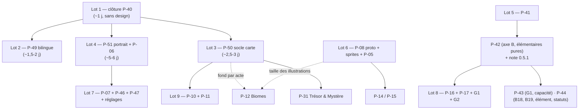

# Revue du répertoire `possible_upgrades/` — état réel au 11/09, croisements, fraîcheur de la roadmap et de l'index, lots proposés

**Date** : 10/09/2026, complétée le 11/09/2026 sur l'ensemble du répertoire.
**Périmètre** : les **24 documents** de `docs/possible_upgrades/` — 9 brainstorms actifs, le vivier `upgrade_ideas.md`, et les 14 documents de `_archives/` — croisés entre eux, avec `docs/ROADMAP.md`, `docs/INDEX.md`, le memory bank et le code.
**Méthode** : chaque constat cité ici a été **re-vérifié contre le code** de la branche (`main` à `cdb8238`, 2026-09-05) et porte le `fichier:ligne` ou la commande qui l'établit. Les archives sont en lecture seule et ne sont pas une source fiable sur l'état du code (`INDEX.md`) : elles n'ont été lues que pour en extraire les **idées** et vérifier une à une lesquelles sont livrées, reprises, périmées ou orphelines.
**Statut** : Revue et proposition de regroupement. **Rien n'est tranché** : les identifiants `P-49` à `P-52` sont des *propositions*, `docs/ROADMAP.md` reste la seule source du reste à faire et n'a pas été modifié par cette passe. Les décisions attendues sont listées en §11.

---

## 1. En six lignes

1. **Le répertoire est sain dans sa forme** : les 24 documents sont tous indexés, les 14 archivés le sont comme tels, et un seul est en double (le brainstorm héros & cartes, §7).
2. **Les trois brainstorms d'août tiennent encore presque intégralement** : sur ~55 constats vérifiables, 4 sont livrés, 2 sont tombés, le reste est intact dans le code. **Deux des trois n'ont pas de destination** dans la roadmap.
3. **Les archives sont à 85 % livrées ou reprises**, mais elles portent encore **19 idées orphelines** — ni livrées, ni dans la roadmap — dont trois mécaniques (étourdissement, épines, armure de base ennemie), deux axes de deck que le graphe de la roadmap dessine sans fiche, et une ligne du vivier barrée à tort (les cartes élémentaires « pures »).
4. **Quatre trous nouveaux** apparaissent en croisant documents et code : l'infobulle du boss annonce « x2 » quand la légende dit « x3 » ; **129 littéraux bilingues dans 22 fichiers** contredisent `progress.md` ; le Tier E porte deux chantiers déjà livrés (P-35, P-37) ; et **le zoom de la carte a été proposé trois fois** (mai, 05/08, 11/08) sans jamais être tranché.
5. **La racine du verdict responsive est dans une archive de mai** : le facteur d'échelle actuel a été conçu comme « hauteur seule » par `4_dynamic_game_responsiveness_analysis.md`, qui prévoyait une clause portrait jamais implémentée.
6. **Neuf lots** absorbent tout ce qui est ouvert sans créer de chantier isolé ; les orphelins qui sont des *idées* retournent au vivier, ceux qui sont des *constats vérifiés* rejoignent un lot.

---

## 2. Inventaire du répertoire

### 2.1. Les dix documents actifs

| # | Document | Date | Destination | Ce qu'il en reste au 11/09 |
|:---:|:---|:---:|:---|:---|
| 1 | [Audit animations & juice](25-07-2026_animations_juice_analysis_Opus5.md) | 25/07 | P-03 ✅, P-06, P-07, P-29 | P0 (12 actions) et P1 (9) entiers. **P-29 ne nomme que 3 des 8 actions P2** (signature des uniques, différenciation élémentaire) ; `SlashEffect` paramétré, rareté survivant à l'animation, unification de l'élément, télégraphe d'intention, `VfxBudget` + réglages sont implicites (§6). J10 (victoire/défaite mise en scène) n'a de destination que sonore (P-47) |
| 2 | [Biomes, finale, historique](27-07-2026_biomes_finale_sequence_historique_runs_Sonnet5.md) | 27/07 | P-10, P-11, P-12 | Intégralement repris. Ouvert : le fond de **combat** par biome (« scope 2 ») que P-12 laisse hors V1 ; la spec du Boss de Cycle |
| 3 | [Ennemis par tier](27-07-2026_nouveaux_ennemis_par_tier_Sonnet5.md) | 27/07 | P-05, P-14, P-15 | Intégralement repris. Le doc utilise déjà `vulnerable` et `weakness` côté ennemis (Harpie, Aberration) — croisement C6 |
| 4 | [Cadre modulaire par tier](28-07-2026_cadre_ennemi_modulaire_par_tier_Sonnet5.md) | 28/07 | P-08 option A | Ouvert : la décision. Son point « migration des 4 assets legacy » rejoint la taille des sprites (C10) |
| 5 | [Cadre procédural](28-07-2026_cadre_ennemi_procedural_Sonnet5.md) | 28/07 | P-08 option B | Ouvert : la décision, le budget de perf, le 5ᵉ emplacement (blason du Boss de Cycle) |
| 6 | [Roster tier 1 & `onHitEffect`](28-07-2026_roster_tier1_mecaniques_onhit_Sonnet5.md) | 28/07 | P-05 | Prêt pour spec. Sa §3.1 (pondération par magnitude) est explicitement différée |
| 7 | [Audit responsive](05-08-2026_audit_responsive_mobile_tablette_Opus5.md) | 05/08 | **aucune** | 13 points sur 16 intacts (§3.2) |
| 8 | [Brainstorm héros & cartes](05-08-2026_brainstorm_heros_et_cartes_Opus5.md) | 05/08 | P-40 → P-44 | Axe C livré ; G1 et G2 **orphelins** (§3.1). **Copie identique** dans `analysis_reports/` (§7) |
| 9 | [Carte : nœuds & identité visuelle](11-08-2026_systeme_carte_visuel_et_noeuds_Opus5.md) | 11/08 | prérequis anonyme de P-31 | 17 constats intacts ; son socle est à **rebaser sur P-48** (C4) ; il bloque aussi P-10 (C5) |
| 10 | [`upgrade_ideas.md`](upgrade_ideas.md) — le vivier | vivant | — | **12 lignes non cochées**, toutes rattachées : P-19, P-30, P-20→P-41, P-05/P-15, P-34, P-38, P-36, P-32, §7 (à rayer), P-40, P-16, §7. **Une ligne cochée à tort** : les cartes élémentaires « pures » n'existent pas (§4.2) |

### 2.2. Les quatorze documents archivés

| # | Document | Époque | État vérifié | Reste vivant |
|:---:|:---|:---:|:---|:---|
| 11 | `1_proto_futures_evols.md` | prototype (mai) | Deckbuilding, intentions, statuts, carte, reliques, sprites, juice de base, audio, tooltips, barres de vie, data-driven, persistance : **tout est livré** | **Étourdissement** (statut « passe son tour ») ; archétypes **Tank qui protège / Healer** ; Event Bus → P-27 ; respiration des sprites → P-07 |
| 12 | `1_analyse_techniques_evols.md` | prototype | Pendant technique du n°11, même bilan | `hive`/`isar` comme échappatoire → déjà noté par P-11 |
| 13 | `2_proto_futures_evols.md` | prototype 2 | Buffs/debuffs, pouvoirs, reliques, carte, événements, boutique, audio, i18n, dictionnaire, tests : livrés | **Épine** (renvoi de dégâts) ; **glossaire** de mots-clés cliquables ; **bestiaire** dans l'encyclopédie ; transitions d'écran ; Combat Log → P-32 ; déblocages par classe → P-13 ; succès → P-33 ; malédictions → P-44 |
| 14 | `2_analyse_techniques_evols.md` | prototype 2 | Pendant technique du n°13 | Combat Log → P-32 |
| 15 | `3_ui_responsiveness_analysis.md` | mai | Positionnements absolus décrits : en partie corrigés (grilles, HUD partiel) | Proposait un facteur d'échelle **sur les deux axes** (`min(x/1920, y/1080)`) — jamais retenu, voir C15 |
| 16 | `4_dynamic_game_responsiveness_analysis.md` | mai | **C'est la conception du `scaleFactor` actuel** (`size.y / 1080` → `size.y / 800`) | Sa clause « portrait : échelle × 0,8 et resserrement » n'a **jamais été implémentée** ; sa batterie de tests (rotation à chaud, fenêtre carrée, 4K) non plus — C15 |
| 17 | `5_analyse_world_map_improvements.md` | 15/05 | Chokepoints, repos avant boss, anti-répétition, pointillés animés, pion, surbrillance : livrés | **Zoom** (1ʳᵉ proposition) ; brouillard de guerre / information payante ; consommables et nœuds verrouillés ; chemin « sûr » vs « risqué » garanti ; tracker d'étage ; Boutique/Repos en overlay ; chemin parcouru doré → 11/08 6.4 ; fond texturé → 11/08 6.6 |
| 18 | `6_analyse_game_balance.md` | mai | **Presque entièrement périmé** : mana 10/5/15 (→ 3), Paladin 20 armure (faux), Attaque Rapide à 0 (faux), valeurs de cartes d'avant refonte ; ses trois recommandations structurelles sont livrées (mana standardisé, passif au lieu d'armure de base, soins épuisables) | P-17 #3 (PV des sbires) ; P-17 #5 (« soin répétable ») est **probablement moot** — §4.2 |
| 19 | `idees_regroupees.md` | juin | 8 sections ; tout est livré sauf ci-contre | **Armure de base progressive des ennemis** (1B) ; cartes élémentaires **pures** (2A) ; contrepartie de fusion → P-43 ; intentions cachées → P-19 ; HUD responsive → §3.2 |
| 20 | `analysis_reports_idee_regroupee_ideas_10-06-2026.md` | 10/06 | 20 items : 18 cochés, #98 → P-19, #100 → P-30 | Rien |
| 21 | `analysis_reports_idee_regroupee_ideas_after_implementations.md` | juin | Matrice d'état, remplacée par le vivier et la roadmap | Ses trois recommandations : `baseArmor` (orphelin), cartes pures (orphelin), patch notes (livré) |
| 22 | `dette_technique_non_documentee_24-07-2026.md` | 24/07 | **5 constats sur 6 clos** : logique de draft (`b5ca823`), tests de `RewardController` (`ec719af`), cast de `rest_screen.dart:57` (`as CardInstance?`), les 8 écrans ont leur test widget, `home_screen.dart` n'a plus d'`AlertDialog` | Le 6ᵉ (blocs `catch`) est **P-25**, re-mesuré à 1 muet + 8 silencieux en release |
| 23 | `30-07-2026_ci_cd_pipeline_github_actions_Sonnet5.md` | 30/07 | P-04 livré ; les deux points périmés (symlink `latest`, `build-web`) sont signalés par l'index ; `workflow_dispatch` conservé (`release.yml:6`) | Notification Discord sur succès partiel ; cibles Android/iOS → décision D4 |
| 24 | `31-07-2026_systeme_pioche_assainissement_Opus5.md` | 31/07 | P-02 livré (ADR-078) ; notification de remélange livrée (`game_screen.dart:411-413`) ; le débordement de main est devenu un « arrêt net », donc sa notification est sans objet | **Mots-clés de deck** et **effets interactifs** (§8.1-8.2, nœuds B18/B19 du graphe de la roadmap, **sans fiche**) ; **consultation du contenu des piles** (§8, 6ᵉ axe) ; retour *visuel* du remélange |

---

## 3. État des trois brainstorms d'août, constat par constat

### 3.1. Héros & cartes (05/08) → programme P-40 → P-44

| Axe | Constat du brainstorm | Destination | État vérifié |
|:---|:---|:---|:---|
| **C** | Supprimer la chaîne `skills.json` | P-40 bloc 1 | ✅ **Livré** (`ced306e`, ADR-084) |
| **G3** | `'enduring:1'` codé en dur | P-40 bloc 2 | ⛔ `lib/game/controllers/deck_controller.dart:254` |
| **G3** | Duplication des cartes `unique` par trois voies | P-40 bloc 2 | ⛔ Le filtre ne couvre que la branche `doubleXp` — `reward_controller.dart:190` ; les deux voies Miroir (`shop_controller.dart:352`, level-up) restent à re-vérifier au moment du correctif |
| **G3** | Capacité de forge 1 ↔ 10 | P-40 bloc 2 | ⛔ Formule en **7 occurrences dans 6 fichiers** (`deck_screen.dart:175,226`, `rest_card_selection_screen.dart:32`, `card_rune_sockets.dart:19`, `forge_upgrade_dialog.dart:52`, `deck_controller.dart:299,316`) ; `_rules/03-8:8` dit toujours « limite fixe de 5 » |
| **B** | 3 statuts orphelins (`vulnerable`, `weakness`, `strength_regen`) | *aucune ligne propre* — P-41 M2 couvre `vulnerable` | ⛔ `grep -rl "vulnerable\|weakness\|strength_regen" assets/data/` → vide ; `weakness` et `strength_regen` n'apparaissent ni dans la spec P-41 ni dans la roadmap |
| **D** | Stats de classe réelles, écran qui ment | P-41 §7 | ⛔ `baseDamage` 5/15/10 dans les trois `classes/<id>/class.json:10` ; `TraitSystem` toujours une chaîne `if/else` (`trait_system.dart:13-53`) |
| **A** | Pools de cartes par classe | P-42 | ⛔ `starter_deck_draft_screen.dart:56` filtre `category == global` ; catalogue 17 + 6 |
| **E** | Récompense de carte post-combat | P-43 | ⛔ Rien |
| **F1-F3** | Coût 3, cartes `status`, `scaleWith` | P-44 | ⛔ Aucun fichier à `"cost": 3`, aucun `"type": "status"`, aucun `scaleWith` |
| **G1** | Monotonie stricte des paliers de rareté | **aucune** *(le brainstorm renvoie à P-16, dont le texte ne le porte pas)* | ⛔ **Orphelin** — `grep -n "monoton\|arrondi" docs/ROADMAP.md` → vide |
| **G2** | Geler `draw` et `gain_mana` sur la rareté | **aucune** | ⛔ **Orphelin** — le multiplicateur s'applique à tous les effets, `effect_resolver.dart:217` |
| — | Dix dérives documentaires | P-40 bloc 3 | 🟠 4 sur 10 encore ouvertes (§8) |
| — | `applyLifestealBuff` à conserver pour P-41 | P-40 ⚠️ / P-41 B2 | ✅ Façade `run_controller.dart:438`, implémentation `player_stats_manager.dart:475` |

**Ce que le brainstorm ne pouvait pas savoir** : P-48 a éclaté les catalogues. Les cartes de P-42 s'écrivent dans `assets/data/classes/<id>/cards/`, sans champ `heroClass` (ADR-086). La séparation `unique` / `heroClass` de l'axe A est **à moitié structurelle** : le répertoire porte l'appartenance, `unique` ne reste que le marqueur des deux cartes de signature. La spec de P-42 devra le dire.

### 3.2. Audit responsive (05/08) → **aucun `P-xx`**

| # | Point du plan de remédiation | État vérifié |
|:---:|:---|:---|
| 1 | `scaleFactor` aveugle à la largeur | ⛔ `heros_draft_game.dart:48` — `(size.y / 800).clamp(0.85, 2.5)` ; éventail `layout_system.dart:13` — `game.size.y * 1.5`. **Origine : archive n°16** (C15) |
| 2 | Panneaux HUD superposés (2 × 250 px) | ⛔ `status_effects_panel.dart:15`, `enemy_intents_panel.dart:17` ; `turn_control_panel.dart:36,71,105,127` — 170 fixe. *(Les PR #28/#31 ont réglé le débordement **interne** par `Flexible`, pas le chevauchement.)* |
| 3 | Ancrages hors `SafeArea` | ⛔ `combat_tooltip_overlay.dart:23` — `bottom: 270` |
| 4 | Boutique : `Row` 3/1 sans repli, enfants de 130 px | ⛔ `shop_screen.dart:325,376,379,529` |
| 5 | AppBar carte `leadingWidth: 430` | ⛔ `map_screen.dart:187` |
| 6 | Zoom coupé | ⛔ `map_screen.dart:223` — `scaleEnabled: false`. **Troisième proposition** après l'archive n°17 (mai) et le 11/08 |
| 7 | `Column` non défilables | 🟠 **Accueil corrigé** (`home_screen.dart:109-117`, commentaire citant l'audit). ⛔ Carrousel en hauteur fixe 350 + espaceurs 48 (`relic_carousel/relic_carousel_screen.dart:223-245`) ; choix d'événement hors zone défilable (`event_screen.dart:437`) |
| 8 | Helper de breakpoints | ⛔ `width < 600` dupliqué dans 4 fichiers ; pas de `app_breakpoints.dart` |
| 9-11 | Cibles tactiles, surbrillance au toucher, décalage du glisser | ⛔ Inchangés |
| 12 | Sprites 1696 × 2528 | ⛔ Les 7 sprites d'entités sont à cette taille, désormais sous `assets/data/enemies/<id>/sprite.png` et `classes/<id>/icon.png` |
| 13-14 | Fond étiré, `<meta name="viewport">` | ⛔ `grep viewport web/index.html` → vide ; `bg_dungeon.png` rendu `size: size` (`heros_draft_game.dart:156`) |
| 15 | Aucun test à largeur téléphone | 🟠 **Un** existe : `test/widget/combat_top_bar_test.dart:93` à `Size(360, 800)` (`708f34d`). Les 16 autres surfaces restent ≥ 1200 px. La batterie de l'archive n°16 (rotation, carré, 4K) n'existe pas non plus |
| 16 | ADR-030 et `progress.md` en avance sur le code | ⛔ ADR-030:31 « Lisibilité universelle […] sans clipping » ; `progress.md` « HUD de combat responsive — clamps anti-clipping » |
| Annexe | `deck_screen` en français dur, `forge_fusion` en ternaires | ⛔ `deck_screen.dart:280,341,353` ; `forge_fusion_screen.dart` 8 ternaires — **et 22 fichiers au total**, voir C9 |

### 3.3. Carte du monde (11/08) → prérequis anonyme de P-31

| # | Constat | État vérifié |
|:---:|:---|:---|
| 3.1 | Identité visuelle écrite quatre fois | ⛔ Deux `switch` (`map_node_widget.dart:35,81`) ; légende en dur (`map_legend.dart`, 22 littéraux `Icons.`/`Colors.`) ; `tutorial_map_widget.dart` et `tutorial_node_types_widget.dart` en dur |
| 3.1 | `legendBossXp` défini et jamais référencé | ⛔ Présent dans les deux ARB, aucune référence hors `lib/l10n/` |
| 3.2 | `isFr ? …` dans les widgets de carte | ⛔ `map_node_widget.dart:47-67`, `map_legend.dart` |
| 3.3 | `+80.0` recopié cinq fois | ⛔ `player_pawn.dart:15`, `map_connection_painter.dart:51,54`, `map_node_widget.dart:131`, `map_screen.dart:348` |
| 3.4 | `firstWhere` par liaison et par frame | ⛔ `map_connection_painter.dart:17` (`repaint: animation`) et `:44` |
| 3.5 | `bossEnemyId` mort | ⛔ Déclaré `map_node_generator.dart:42`, jamais assigné, lu à `null` par `game_screen.dart:235` |
| 3.6 | `MapNode.position` en `Vector2` | ⛔ `map_node.dart:12` — porté par P-26 |
| 4.1-4.9 | Silhouette unique, combat en `white70`, liaisons indifférenciées, coche verte, pion générique, fond identique, espacement, zoom, légende statique | ⛔ Tous inchangés (`map_node_widget.dart:205`, `player_pawn.dart:32`) |
| 5.2 | Le point « anti-répétition / quotas » de `ROADMAP.md` §7 est couvert par des tests | ✅ `test/unit/map_generator_test.dart:91,133,167`. **À rayer** |
| 6.1 | Socle `assets/data/map_nodes.json` | ⛔ Rien — et **la forme est à rebaser sur P-48** (C4) |

> [!IMPORTANT]
> **Preuve du constat 3.1, apparue après le brainstorm.** P-45 a aligné la légende du boss XP sur `reward_controller.dart:90,100` (`totalXp *= 3`, `totalGold *= 3`). Le correctif a atteint `map_legend.dart:131` (« Boss (XP & Or x3) ») **mais pas l'infobulle** : `map_node_widget.dart:67` affiche toujours `"Boss (XP & Or x2)"`. Deux des quatre copies ont divergé dès la première retouche.

---

## 4. Ce que les archives portent encore

### 4.1. Les dix-neuf idées orphelines — ni livrées, ni dans la roadmap

Vérifiées une à une contre le code. La colonne « Où la rattacher » applique la règle proposée en §11 (D12) : **un constat vérifié va à la roadmap, une idée non tranchée va au vivier**.

| # | Idée | Source | Vérification | Nature | Où la rattacher |
|:---:|:---|:---|:---|:---|:---|
| 1 | **Étourdissement** — statut « passe son tour » | n°11 | `grep -rn -i stun lib/ assets/data/` → vide | Mécanique | P-44 (statuts) ou P-14 (affixes) — D10 |
| 2 | **Épine** — renvoi de dégâts à l'attaquant | n°13 | `grep -rn -i thorns lib/` → vide | Mécanique | P-44, ou une relique — D10 |
| 3 | **Armure de base progressive des ennemis** (`baseArmor` par acte et par type de nœud) | n°19 §1B, n°21 | `grep -n baseArmor lib/models/data/enemy_data.dart` → vide ; aucun `enemy.json` ne le porte | Mécanique + donnée | P-05 (le champ) et P-15 (les valeurs) — D11 |
| 4 | **Mots-clés de deck** — rétention, innée, éphémère, coût variable | n°24 §8.1 = nœud **B18** du graphe | Aucune fiche `P-xx` ; `grep -rn -i "retain\|innate\|ethereal" lib/` → vide | Mécanique | **P-44**, à écrire dans son texte |
| 5 | **Effets interactifs** — « défausse une carte pour… », entrée utilisateur dans `EffectStrategy` | n°24 §8.2 = nœud **B19** | Aucune fiche ; le doc le nomme « le vrai verrou architectural de la profondeur » | Architecture | **P-44**, en prérequis nommé |
| 6 | **Cartes élémentaires « pures »** (effet seul, plus fort, sans dégâts) | n°19 §2A, n°21, vivier | Les 4 élémentaires sont hybrides (`ice_bolt` 4 + gel, `fireball` 6 + brûlure, `poison_stab` 3 + poison, `thunder_clap` 4 + choc) ; aucune carte ciblant un ennemi sans `damage` | Contenu | **P-42** (pools de classe — le Mage en est le porteur naturel). **Décocher la ligne du vivier** |
| 7 | **Archétypes Tank (protège les autres) et Healer** | n°11 | Aucune interaction ennemi → ennemi (roadmap P-15 le confirme pour le Chaman) | Mécanique | P-15 — le Healer y est déjà (Chaman Orc), le Tank non |
| 8 | **Zoom de la carte** | n°17 (mai), n°7 #6, n°9 4.8 | `map_screen.dart:223` — proposé trois fois | Constat | **Lot 3** (P-50) |
| 9 | **Brouillard de guerre** — radar à 2 étages, ou révélation payante | n°17 §2B | `grep -rn -i "fog\|reveal" lib/services/map lib/ui/widgets/map` → vide | Design | Vivier |
| 10 | **Consommables de carte et nœuds verrouillés** (clé, longue-vue, accès contre PV/or) | n°17 §2C | Rien | Design | Vivier |
| 11 | **Chemin « sûr » et chemin « risqué » garantis** par la génération | n°17 §2A | `MapValidator` ne porte que quotas et anti-répétition | Design | Vivier, avec la variété topologique du 11/08 §5.1 |
| 12 | **Tracker d'étage** (« Étage 4 / 10 ») sur la carte | n°17 §3B | `grep -n -i "étage\|floor" lib/ui/screens/map_screen.dart` → un commentaire | Polish | Cavalier du Lot 3, ou P-52 |
| 13 | **Boutique et Repos en overlay** plutôt qu'en `Navigator.push` | n°17 §3C, n°9 §7 | 15 `Navigator.push` (P-24) ; décision jamais prise | Décision | **P-24** (routage) — D9 |
| 14 | **Glossaire** — mot-clé cliquable dans une infobulle | n°13 Axe C.3 | `grep -rn -i glossar lib/` → vide | Polish | **P-52** proposé (Tier E) |
| 15 | **Bestiaire** — les ennemis dans l'encyclopédie | n°13 Axe D.2 | `card_dictionary_screen.dart` : onglets Cartes et Reliques seulement | Polish | **P-52** proposé, extension naturelle de P-35 |
| 16 | **Consultation du contenu des piles** en combat | n°24 §8, 6ᵉ axe | `combat_side_panels.dart` n'affiche que des compteurs ; aucun visualiseur | UX | Cavalier du **Lot 4** (le HUD est réécrit), ou P-36 |
| 17 | **Retour visuel du remélange** (la défausse repart vers la pioche) | n°24 §7 | Seule une notification existe (`game_screen.dart:411-413`) | Juice | **P-07** |
| 18 | **Transitions d'écran** unifiées | n°13 Axe C.2 | 3 fichiers seulement utilisent un `PageRouteBuilder`/`FadeTransition` | Polish | **P-24** |
| 19 | **Notification Discord sur succès partiel** de la release | n°23 §4 | `notify-discord` exige les deux jobs parents | Infra | Vivier, ou P-47 « seconde passe » de la chaîne |

### 4.2. Idées périmées, fausses ou cochées à tort — à ne pas rouvrir

| # | Affirmation | Source | Réalité |
|:---:|:---|:---|:---|
| 1 | Mana des héros 10 / 5 / 15 ; Paladin à 20 armure de base ; `Attaque Rapide` gratuite | n°18 | `maxMana: 3` partout ; aucune armure dans `class.json` ; `"cost": 1` — les deux derniers sont les constats faux de P-17 |
| 2 | `Frappe Lourde` 14, `Mur de Fer` 12, `Potion de Soin` 2 mana / 8 PV | n°18 | 12, 10, et 1 mana / 3 PV épuisable |
| 3 | « Soin répétable en combat » (P-17 #5) | n°18, roadmap P-17 | **Probablement moot** : les deux seules cartes de soin s'épuisent (`heal_potion.json` et `holy_shield.json`, `isExhaust: true`) ; ne reste que la relique `regen_ring` (+2 PV en fin de tour). À re-mesurer avant d'ouvrir P-17, pas à traiter |
| 4 | Viewport fixe 1920 × 1080 avec bandes noires | n°15, n°16 | Le jeu est en `scaleFactor` relatif depuis mai ; seul le choix « hauteur seule » subsiste (C15) |
| 5 | `map_screen.dart` à 2 471 lignes, `game_screen.dart` à 1 667 | n°22 (pour mémoire) | 418 et 524 — clos le 24/07 |
| 6 | 7 blocs `catch` silencieux | n°22 | Re-mesuré par la roadmap : 1 muet, 8 sous `kDebugMode` (P-25) |
| 7 | 8 écrans majeurs sans test | n°22 | Les 8 ont un test dans `test/widget/` |
| 8 | Symlink nginx `latest`, job `build-web` | n°23 | Périmés et signalés par l'index — ne pas implémenter depuis ce document |
| 9 | Débordement de main à notifier | n°24 §7 | ADR-078 a retenu l'**arrêt net** : rien n'est défaussé, il n'y a rien à notifier |
| 10 | Le vivier coche « cartes élémentaires pures » | n°10 | Non livré — §4.1 #6 |
| 11 | « Sprite sheets / atlas pour réduire les draw calls » | n°13 Axe E.2 | Sans objet : rendu procédural, 8 PNG statiques |
| 12 | Auto-affichage du tutoriel au premier lancement (`hasSeenTutorial`) | n°19 §8A | Remplacé par le badge « NEW » de `TutorialProgressService` — clos autrement |

### 4.3. Ce que les archives ont fait livrer, pour mémoire

Deckbuilding, intentions, 9 statuts, carte DAG avec chokepoints et anti-répétition, reliques à triggers, événements, boutique, forge à runes, fusion 3→1, tutoriel, patch notes, dictionnaire, badge « Mon Deck » (`map_toolbar.dart:12-71`), contrepartie de l'événement Gobelin (`goblin_merchant.json`, −15 PV), audit des triggers de reliques (`energy_stone` conservé en `startOfTurn` — il alimente désormais P-16, C16), sauvegarde, CI/CD, assainissement de la pioche. Les documents 11 à 14 et 17 à 21 n'ont plus rien à faire ouvrir.

---

## 5. Croisements — ce qui touche les mêmes fichiers ou les mêmes décisions

| # | Croisement | Sources | Pourquoi ensemble |
|:---:|:---|:---|:---|
| **C1** | **`scaleFactor` à 800 px de haut** est la racine du débordement de la main (responsive P0-1), de l'échelle absolue de la zone d'annulation (animations E2 = P-06 #2) et du `ShieldDome` en unités absolues (A6) | n°7 §2 · n°1 E2, A6 | Mêmes fichiers : `heros_draft_game.dart`, `layout_system.dart`, `card_interaction_handler.dart`, `card_animator.dart` |
| **C2** | Le **helper de test multi-tailles** (responsive #15) et le **test des clés `animation`** (P-06 #12) sont la même passe d'infrastructure | n°7 §7 · n°1 E9/C3 · n°16 | Un fichier d'aide, une PR de tests |
| **C3** | **Tout ce qui ouvre `map_screen.dart` et ses widgets** : zoom (responsive #6 = carte 4.8 = archive n°17), `leadingWidth` (#5), surbrillance au toucher (#10) contre régimes de liaison (carte 6.4), légende statique (4.9) contre légende en dur (3.1) | n°7 §4.2, §5 · n°9 · n°17 | Quatre fichiers ouverts une fois ; le painter précalculé (3.4) porte à la fois les régimes (6.4) et la surbrillance |
| **C4** | Le **socle de données des nœuds** (carte 6.1) a été pensé **avant P-48** comme un `map_nodes.json` plat | n°9 §6.1 · ADR-085, ADR-086, `_patterns/17-00` | Un catalogue plat violerait la règle de partage catalogue / configuration. Forme conforme : `assets/data/map_nodes/<variante>.json` — 10 variantes (7 types + 3 boss) — via un `EntitySource('map_nodes/*.json')`. La spec P-41 a subi ce rebase le 05/09 |
| **C5** | Le socle des nœuds bloque **P-31**, **P-12** — déjà dit — **et P-10** : le Portail Final est une variante de boss ou un `MapNodeType` neuf, donc quatre fichiers à synchroniser | n°9 §10 · n°2 §2.5 · roadmap §1 | La dépendance P-10 → socle n'est **pas** dans le graphe. Elle emporte les deux widgets de tutoriel (fidélité P-45) |
| **C6** | **Les statuts orphelins traversent cinq documents** : axe B (cartes), P-41 M2 (`vulnerable`), Harpie et Aberration (`vulnerable`, `weakness` — n°3), P-14, P-44 ; s'y ajoutent **étourdissement et épine** des prototypes (§4.1 #1-2) | n°8 §4 · n°3 · n°6 · n°11, n°13 · spec P-41 | L'axe B n'est **pas un lot** : première tranche de contenu de P-42 (`weakness` → Paladin, `strength_regen` → Berserker) et de P-05 (ennemis). Les deux statuts des prototypes se tranchent avec P-44 |
| **C7** | **G2** (geler `draw`/`gain_mana`) et **P-16** ; **G1** (monotonie) et **P-43** | n°8 §9 · roadmap | Deux lignes de code chacun, **une seule campagne de playtest** |
| **C8** | Capacité de forge 1 ↔ 10 (P-40 bloc 2) et l'idée du propriétaire « slots des uniques par niveau ou XP » | n°8 G3 · notes du propriétaire · P-43 | Correctif **minimal** maintenant, refonte dans P-43 |
| **C9** | **La règle bilingue est violée dans 22 fichiers** : `grep -rnE "(isFr\|== 'fr')\s*\?\s*['\"]" lib/` hors `l10n/` et `models/` → **129 littéraux** (`card_component.dart` 26, `forge_slot_row.dart` 16, `ui_card_helpers.dart` 13, `relic_exchange_screen.dart` 9, `forge_fusion_screen.dart` 8, `card_text_renderer.dart` 8, …) ; `progress.md:127` affirme « Zéro chaîne codée en dur » | n°7 annexe · n°9 §3.2 · `CLAUDE.md` · `progress.md` | Un chantier de conformité avec test de garde. **Exception** : les libellés de nœuds, que le socle (C4) déplace dans les données |
| **C10** | **La résolution des sprites** (responsive #12, ~120 Mo de textures) est une décision de **pipeline d'assets**, la même que P-08 — et elle précède les 5 sprites de P-05, les 15 illustrations de P-12 et la migration des 4 assets legacy (n°4 §8) | n°7 §6.1 · n°4, n°5 · P-05, P-08, P-12 | Produire un asset avant d'avoir fixé la taille cible, c'est le refaire |
| **C11** | **L'écran de Réglages existe depuis P-03** : curseur Musique inerte (P-46), et c'est l'endroit des réglages « vitesse / effets réduits » (animations J11, D5) que l'audit responsive appelle comme soupape mobile | P-46, P-47 · n°1 J11, D5 · n°7 §8 | Une passe sur `settings_screen.dart`, dans la campagne de P-07 |
| **C12** | **Deux détecteurs d'élément par mots-clés** : `card_component.dart` (Flame, B5) **et** `ui_card_helpers.dart:30` (Flutter, alimente P-37) | n°1 B5, P-29 #27 · code | Unifier vers un champ JSON dans P-44, pas deux fois |
| **C13** | **L'espace du HUD en portrait** (responsive P0-2) conditionne P-36 (panneau d'ennemi « même widget »), P-32 (historique) **et le visualiseur de piles** (§4.1 #16) | n°7 §3 · P-32, P-36 · n°24 §8 | Décider une fois la disposition portrait avant d'y loger trois panneaux |
| **C14** | **Deux ADR figés contredits** : ADR-030 (« lisibilité universelle ») par l'audit responsive, ADR-051 (« pool de 15 communes ») par le pool du draft post-boss | n°7 §7.1 · état des lieux III.C.10 · `memory-bank-sync` Garantie 5 | Seule action possible : changer le `### Statut` vers le successeur |
| **C15** | **La conception de mai explique le verdict d'août.** L'archive n°15 proposait un facteur sur **deux axes** ; l'archive n°16 a tranché pour la **hauteur seule** (`size.y / 1080`) *avec* une clause « portrait : × 0,8 et resserrement ». Le code a pris la hauteur seule (`size.y / 800`) **sans la clause**. L'audit du 05/08 redécouvre donc le choix de mai | n°15 §2B · n°16 §2A, §2C · n°7 §2 | Le Lot 4 ne « corrige » pas un oubli : il **revient à la première proposition**. À écrire dans l'ADR successeur d'ADR-030 |
| **C16** | **`energy_stone`** (+1 mana en `startOfTurn`, `energy_stone.json`) a été audité en juin et conservé ; c'est l'un des mécanismes qui rendent « le mana plus rare » | n°19 §3A · n°21 · P-16 | À re-mesurer dans P-16 (Lot 8), pas à rouvrir seul |
| **C17** | **Le graphe §1 de la roadmap dessine trois chantiers sans fiche** — B18, B19, B20 — issus du n°24 §8 ; B20 ≈ P-44 « malédictions », B18 et B19 n'existent nulle part ailleurs | roadmap §1 · n°24 | Les écrire dans P-44 (§4.1 #4-5) |
| **C18** | **Boutique/Repos en overlay** (n°17) et **P-24** (routage centralisé, 15 `Navigator.push`) sont la même décision de navigation ; les transitions d'écran (n°13) aussi | n°17 §3C · n°9 §7 · n°13 · P-24 | Une décision, prise une fois, dans P-24 — D9 |
| **C19** | **Combat Log** (n°13, n°14) est **P-32** sous un autre nom | n°13 Axe C.3 · P-32 | Rien à ouvrir |
| **C20** | **Bestiaire et glossaire** (n°13) prolongent P-35 et P-37, tous deux livrés | n°13 Axe C.3, D.2 · P-35, P-37 | Un seul petit chantier Tier E — **P-52** proposé |

---

## 6. Fraîcheur de `docs/ROADMAP.md`

Le document est **fiable sur ce qui est livré** (P-01 à P-04, P-45, P-48, P-40 bloc 1 cochés avec preuves). Ses écarts sont ceux qu'il annonce lui-même — tiers A, B, C, E jamais re-vérifiés — plus ce que les brainstorms d'août et les archives ont laissé dehors.

| # | Écart | Preuve | Correction proposée |
|:---:|:---|:---|:---|
| 1 | Aucun chantier ne porte l'**audit responsive** | `INDEX.md` §8 le signale depuis le 05/08 | **P-51** (Lot 4), ou trancher « desktop et tablette seulement » (D4) |
| 2 | Le **socle de la carte** n'est qu'un prérequis anonyme de P-31 | §7 encadré P-31 | **P-50** (Lot 3), amont de P-31, P-12 **et P-10** dans le graphe |
| 3 | **G1 et G2** n'ont aucune ligne | `grep -n "monoton\|arrondi\|gain_mana" docs/ROADMAP.md` → vide | G2 dans P-16, G1 dans P-43 (C7) |
| 4 | La **conformité bilingue** n'a aucune ligne, pour 129 littéraux dans 22 fichiers | C9 | **P-49** (Lot 2) |
| 5 | Le graphe §1 dessine **B18, B19, B20 sans fiche** | `ROADMAP.md:58-60` | Écrire B18 et B19 dans P-44 ; renvoyer B20 à P-44 (C17) |
| 6 | §7 « vérifier la règle anti-répétition et les quotas » est couvert par trois tests | `map_generator_test.dart:91,133,167` | Rayer |
| 7 | **P-35** (onglet Reliques) est **livré** | `card_dictionary_screen.dart:47,62,146` | Cocher |
| 8 | **P-37** (icônes de type de dégâts) est **livré en substance** | `ui_card_helpers.dart:365-376`, badges vectoriels ; lignes barrées du vivier | Cocher, ou re-spécifier si l'attente était autre |
| 9 | **P-29** ne nomme que 3 des 8 actions P2 de l'audit animations | `ROADMAP.md:506` | Expliciter les 5 autres ou les renvoyer (unification de l'élément → P-44, `VfxBudget` + réglages → Lot 7) |
| 10 | **P-17 #5** (« soin répétable ») est probablement moot | §4.2 #3 | Re-mesurer à l'ouverture de P-17, ne pas l'ouvrir pour ça |
| 11 | `bossEnemyId` mort, painter par frame, visualiseur de piles, retour visuel du remélange : aucune ligne | n°9 §3.4-3.5 · n°24 §7-8 | Lots 3, 4 et 7 |
| 12 | P-40 bloc 2 dit « 6 sites » pour la formule de capacité | 7 occurrences dans 6 fichiers | Nit |
| 13 | En-tête : « v3.5.1 (ADR-073) », « 8 brainstorms » | 9 actifs + le vivier + 1 doublon | Cosmétique, à la prochaine re-priorisation |
| 14 | Camembert §1 et Gantt §9 antérieurs à P-40→P-44 ; graphe §1 sans P-45 à P-48 | Avertissement présent | Recalculer **une fois**, après arbitrage des lots |
| 15 | Tier C : les constats restants de P-17 non re-mesurés | Encadré P-17 | À l'ouverture du Lot 8 |
| 16 | §8 point 7 (numérotation de `systemPatterns.md`) ouvert, fichier à **122 lignes pour un plafond de 120** | `wc -l` | Arbitrage déjà demandé par `activeContext.md` |

**Cohérent, rien à faire** : P-46 (`assets/audio/music/` vide), P-05 à P-15, P-19, P-30, P-32, P-34, P-36, P-38 (aucune trace dans `lib/`), P-41 rebasée, P-18/P-20 redistribués, P-26 réduit, P-24 (15 `Navigator.push` re-comptés), P-25 (re-mesuré), les 12 lignes ouvertes du vivier toutes rattachées.

---

## 7. Fraîcheur de `docs/INDEX.md`

| # | Écart | Correction proposée |
|:---:|:---|:---|
| 1 | **Doublon** : `possible_upgrades/05-08-2026_brainstorm_heros_et_cartes_Opus5.md` (`5a3d086`, 25/08) est **identique** à `analysis_reports/05082026_brainstorm_heros_et_cartes_Opus5.md` (`f78de5d`, 05/08). L'index, la roadmap et la spec P-41 pointent `analysis_reports/` ; `activeContext.md` et la spec P-48 pointent `possible_upgrades/`. La légende de l'index place un 🔍 dans `possible_upgrades/` | Garder **une** copie et repointer les trois autres références (D1) |
| 2 | Sept plans quotidiens de mai (`implementation_plans/2026-05-2x_implementation.md`) et `avancé_implementation.md` ne sont pas indexés | Une ligne 🗄️, ou déplacement vers `implementation_plans/done/` |
| 3 | `docs/formation-heros-draft/` (26 fichiers) n'est pas indexé | Porté par P-40 point 4 — D8 |
| 4 | §8 signale l'absence de `P-xx` pour l'audit responsive | Exact ; résolu par P-51 |
| 5 | Les 14 archives de `possible_upgrades/_archives/` | ✅ Toutes indexées (§5, §6, §8, §10, §11, §15) — rien à faire |
| 6 | Le présent document | Ajouté aux §1, §6, §8 et §12 |

---

## 8. Dérives documentaires encore ouvertes

Sur les dix dérives de l'[état des lieux](../analysis_reports/05082026_etat_des_lieux_heros_et_cartes_Opus5.md) Partie III.C, six sont closes. **Quatre restent, plus quatre nouvelles.**

| # | Affirmation | Fichier | Réalité |
|:---:|:---|:---|:---|
| 1 | « `heal_potion` : Coût 1, **Soin 4** » | `_rules/02-3-catalogue-de-cartes.md:17` | Soin **3** |
| 2 | « Cartes uniques : limite fixe de **5** améliorations » | `_rules/03-8-systeme-de-forge-forge-de-fusion.md:8` | **10** dans le code — à trancher avec P-40 bloc 2 |
| 3 | « Les runes `enduring` sont **exclues de la fusion** » | `_rules/03-8:43` | Aucune exclusion (`forge_fusion_screen.dart`, `deck_controller.dart:237-247`) |
| 4 | « Coût des cartes : **0 à 3** cristaux » | `_rules/03-1-gestion-du-mana.md:6` | 0 à 2 |
| 5 | **Nouveau** — « UI 100 % localisée — **Zéro chaîne codée en dur** » | `progress.md:127` | 129 littéraux bilingues dans 22 fichiers, plus 3 chaînes monolingues (`deck_screen.dart:280,341,353`) |
| 6 | **Nouveau** — « HUD de combat responsive — clamps anti-clipping » ; ADR-030 « lisibilité universelle » | `progress.md` §Rendu · `ADR-030:31` | Contredit par l'audit, toujours vrai le 11/09 |
| 7 | **Nouveau** — l'infobulle du boss annonce « x2 » | `map_node_widget.dart:67` | ×3 — code, pas doc, mais visible par le joueur |
| 8 | **Nouveau** — le vivier coche les cartes élémentaires « pures » | `upgrade_ideas.md` | Non livré (§4.1 #6) |

---

## 9. Les lots proposés

**Principe** : un lot rassemble ce qui **ouvre les mêmes fichiers** ou **se valide par la même campagne** (matrice d'appareils, écoute, playtest). Un lot ne mélange jamais un chantier sans décision de design avec un chantier qui en demande une. Les efforts reprennent l'échelle de la roadmap ; `P-49` à `P-52` sont des propositions. Les orphelins de §4.1 sont rattachés là où le fichier est déjà ouvert — jamais dans un lot à part.

### Lot 1 — Clôturer P-40 (blocs 2 et 3, élargis) · ~1 j · aucune décision sauf D2

| Volet | Contenu |
|:---|:---|
| **Code** | `'enduring:1'` → `startsWith('enduring')` (`deck_controller.dart:254`) · filtre `unique` sur la branche `cards` et re-vérification des deux Miroirs · capacité de forge alignée **a minima** (D2, refonte dans P-43) · infobulle boss « x2 » → « x3 » (`map_node_widget.dart:67`, le ternaire disparaît au Lot 3) · *cavalier* : le seul `catch (_) {}` muet (P-25, 0,1 j) |
| **Vault** | Les 4 dérives de §8 (1-4) · `### Statut` d'ADR-051 → P-40 et d'ADR-030 → « invalidé par l'audit du 05/08 » (Garantie 5) · `progress.md:127` et la ligne « HUD responsive » réécrites |
| **Roadmap / index / vivier** | Rayer §7 anti-répétition · cocher P-35 et P-37 · corriger « 6 sites » · dédoublonner (D1) · indexer les 8 plans de mai · corpus de formation (D8) · compléter le graphe §1 (P-45 à P-48) · G1 dans P-43, G2 dans P-16 · B18/B19 dans P-44 · **décocher** la ligne « élémentaires pures » du vivier et y inscrire les idées de §4.1 marquées « vivier » |

**Validation** : `dart analyze`, `flutter test`, aucun playtest.
**Ne pas y mettre** : la conformité bilingue (Lot 2), l'axe B (Lot 5).

### Lot 2 — Conformité bilingue de l'UI · **P-49** proposé · ~1,5-2 j · aucune décision

- Les **129 ternaires littéraux** de 22 fichiers en clés ARB, en commençant par les six plus lourds (80 des 129), plus les 3 chaînes de `deck_screen.dart`.
- **Exclure** `map_node_widget.dart` et `map_legend.dart` : le Lot 3 déplace ces libellés dans les données (C9).
- Un **test de garde** sur le motif `grep` de C9, figé à zéro — même mécanisme que `entity_id_convention_test.dart`.
- Restaurer `progress.md:127` comme une affirmation vraie.

**Pourquoi séparé du Lot 1** : le volume, et `card_component.dart` / `card_text_renderer.dart` sont le rendu Flame des cartes — une revue distincte. Fusionnable si une seule PR est préférée (D5).

### Lot 3 — Socle de la carte du monde · **P-50** proposé · ~2,5-3 j · décisions D3, D6

| Série | Contenu | Absorbe |
|:---|:---|:---|
| **3a — socle, rendu identique** | Catalogue `assets/data/map_nodes/<variante>.json` (10 variantes), `MapNodeData`, `EntitySource`, registre `const` d'icônes (C4) · suppression des **quatre** duplications · légende générée depuis le catalogue et **filtrée par l'acte** · libellés bilingues par construction · `+80.0` → une constante · segments du painter précalculés · `bossEnemyId` supprimé ou câblé (D3) · `MapNode.position` découplé de `Vector2` (moitié de P-26) | Prérequis de P-31 · moitié de P-26 · carte 3.1-3.6, 4.9 |
| **3b — comportement, même branche** | Trois régimes de liaison (6.4) · zoom `scaleEnabled: true` avec molette et pincement unifiés — la proposition de **mai** enfin tranchée (§4.1 #8) · `leadingWidth` conditionnel et barre d'outils repliée sous 600 px · surbrillance au toucher · cibles de `MapToolbar` ≥ 44 · *cavalier* : tracker d'étage (§4.1 #12) | Responsive #5, #6, #9, #10 · carte 4.3, 4.8 · archive n°17 |

**Ne pas y mettre** : cartouche gravé, pion héros, sceau, texture (D6) ; les nœuds Trésor et Mystère (P-31, décision de design) ; la variété topologique et les idées de carte du vivier (§4.1 #9-11).
**Débloque** : P-31 (deux fichiers JSON), P-10 (variante `boss_finale`), le crochet de fond de P-12, la conformité des deux widgets de tutoriel.
**Validation** : les 11 tests du générateur inchangés, les 5 tests widget, un test « la légende est le catalogue », et pour 3a une comparaison de rendu avant/après.

### Lot 4 — Combat jouable en portrait + fondations VFX · **P-51** proposé + **P-06** · ~5-6 j · décision D4

| Série | Contenu |
|:---|:---|
| **4a — responsive, d'abord** | `scaleFactor` sur les deux axes et éventail dérivé de la largeur — **retour à la proposition de l'archive n°15** (C15) · panneaux HUD empilés ou repliés sous 600 px, fin de tour ancrée bas-centre (C13) · ancrages sous `SafeArea` · boutique en `Column` sous 600 px · `SingleChildScrollView` sur carrousel, choix d'événement et repos · `app_breakpoints.dart` · cibles ≥ 44 · carte décalée au-dessus du doigt · fond en `BoxFit.cover` · `<meta name="viewport">` · **helper de test multi-tailles** à 360×740, 393×852, 852×393, 820×1180, plus rotation à chaud et fenêtre carrée (archive n°16) · ADR successeur d'ADR-030 · *cavalier* : visualiseur de piles dans le HUD réécrit (§4.1 #16) |
| **4b — P-06 tel que chiffré** | Les 12 actions : `vfx_tokens.dart`, E2 (même famille que P0-1), priorités z, mort d'ennemi unique, dérive shake/reposition, 4 correctifs de perf, `spawnImpactParticles`, test des clés `animation`, doc `card_animations_system.md` |

**Pourquoi ensemble** : C1 et C2 ; et P-07 devra régler hit-stop et screenshake sur la géométrie finale.
**Ne pas y mettre** : la réduction des sprites (Lot 6), les réglages joueur (Lot 7), P-07.
**Validation** : une seule matrice d'appareils, et le budget de frame en AoE à 6 ennemis pendant le ciblage. **Visible par le joueur** — une note de version à part entière.

### Lot 5 — Programme identité de classe, P-41 → P-42 → P-43 / P-44 · inchangé, avec cinq absorptions

1. **L'axe B est la première tranche de P-42** (C6) : `weakness` → Paladin, `strength_regen` → Berserker ; `vulnerable` par P-41 M2.
2. **Les cartes élémentaires « pures » (§4.1 #6) sont la deuxième tranche de P-42**, le Mage en étant le porteur naturel — la ligne du vivier est à décocher.
3. **La spec de P-42 se rebase sur P-48** : répertoire = classe, pas de `heroClass`, `unique` = signature. Elle porte la publication de `0.5.1`.
4. **P-43 absorbe G1** et la refonte de la capacité des uniques (C8).
5. **P-44 absorbe B18 (mots-clés), B19 (effets interactifs — son prérequis architectural), l'unification de l'élément (C12) et la décision sur étourdissement / épine (D10).**

Efforts inchangés : P-41 5-7 j, les trois autres à chiffrer en spec — P-44 grossit de deux axes nommés, il faudra le dire dans son chiffrage.

### Lot 6 — Pipeline d'assets et roster tier 1 · P-08 (proto) + résolution + P-05 · ~0,5 + 0,5 + 2-3 j (+ 5 sprites)

1. **Une décision** : cadre PNG ou procédural (P-08), **taille cible** (~512 × 768, C10), convention de cadrage, sort des 4 assets legacy (n°4 §8).
2. Réduire les 7 sprites existants et le fond.
3. Puis P-05 — dont le champ **`baseArmor`** si D11 le retient (§4.1 #3), les sprites produits à la bonne taille.

**Ne pas y mettre** : P-14, P-15 (réutilisent le socle ; le Tank et le Healer de §4.1 #7 y attendent).

### Lot 7 — Feel et écoute · P-07 + P-46 + P-47 + réglages joueur · ~6-9 j (+ 4 pistes, ~10 bruitages)

Après le Lot 4. Une campagne d'écoute et de ressenti. S'y ajoutent **une passe sur `settings_screen.dart`** (C11 : Musique réel, vitesse d'animation, effets réduits, `VfxBudget`), le **retour visuel du remélange** (§4.1 #17) et la **mise en scène de victoire/défaite** (animations J10, avec les sons de fin de partie de P-47).

### Lot 8 — Calibration · P-16 + P-17 + G1 + G2 · ~2-3 j + playtests

**Après P-42** (C7). Re-mesurer d'abord les constats de P-17 — le #5 est probablement moot (§4.2 #3) — et `energy_stone` (C16). Le code de G1 et G2 tient en deux lignes ; c'est le playtest qui coûte.

### Lot 9 — Structure · P-10 + P-11 · inchangé, mais **après le Lot 3**

Le Portail Final devient une variante JSON du boss (C5). Le `VictoryScreen` est aussi le bon endroit de la mise en scène de J10 (Lot 7) côté fin de run.

### Tier E — un nouveau petit chantier : **P-52** proposé

**Reliquat des prototypes** (C20) : bestiaire dans l'encyclopédie, glossaire de mots-clés dans les infobulles, éventuellement le tracker d'étage s'il n'a pas pris le cavalier du Lot 3. ~1 j, ★☆☆☆☆, 🔥. À piocher opportunément, comme le reste du Tier E.

### Reste en dette intercalable, inchangé

P-26 (réduit au registre en `Map`), P-22, P-27, **P-24** (qui hérite de D9 : overlays et transitions), P-23, P-28.

---

## 10. Séquencement et parallélisme

**Trois files indépendantes**, qui n'ouvrent pas les mêmes fichiers :

| File | Lots | Fichiers pivots |
|:---|:---|:---|
| Données et logique | Lot 1 → Lot 5 (P-41, P-42) → Lot 8 | `controllers/`, `systems/trait_system.dart`, `assets/data/`, `class_selection_screen.dart` |
| Rendu et géométrie | Lot 4 → Lot 7 ; Lot 6 | `heros_draft_game.dart`, `layout_system.dart`, `components/`, HUD, `settings_screen.dart`, `enemy_card.dart` |
| Carte | Lot 3 → Lot 9, P-31 | `map_screen.dart`, `widgets/map/`, `services/map/`, `models/map_node.dart` |

Le Lot 2 touche `card_component.dart` et `card_text_renderer.dart`, que le Lot 4 ouvre aussi : **avant** le Lot 4, ou fusionné, pas en parallèle.

**Ordre recommandé si une seule file** : Lot 1 → Lot 2 → Lot 3 → Lot 4 → P-41 → P-42 (avec `0.5.1`) → Lot 6 → Lot 7 → Lot 8 → P-43/P-44 → Lot 9. Les lots 1 à 3 sont sans décision de design lourde : ~5 j qui referment P-40, la moitié de P-26, le prérequis de P-31, quatre dérives du vault et le mensonge de l'infobulle, sans rien changer à la boucle de jeu.

---

## 11. Les décisions à prendre

| # | Décision | Lot | Recommandation |
|:---:|:---|:---:|:---|
| **D1** | Quelle copie du brainstorm héros & cartes est canonique ? | 1 | `possible_upgrades/`, par cohérence avec la légende de l'index ; repointer `INDEX.md` §1, `ROADMAP.md` §4 et la spec P-41 |
| **D2** | Capacité de forge des uniques en attendant P-43 : 5 (fiche) ou 10 (code) ? | 1 | **5** — c'est l'intention documentée |
| **D3** | `bossEnemyId` : supprimer ou câbler ? | 3 | **Supprimer** ; les boss nommés reviendront par le catalogue de nœuds |
| **D4** | Le téléphone est-il une cible ? | 4 | **Oui → P-51 en Tier A**. **Non → l'option à 0,1 j** : paysage seul (`setPreferredOrientations`) + `<meta name="viewport">`, et différer le reste. Décide aussi du sort des cibles Android/iOS de l'archive n°23 |
| **D5** | Lot 2 seul ou fusionné dans le Lot 1 ? | 1-2 | Séparé |
| **D6** | Identité visuelle de la carte (cartouche, pion, sceau, texture) : avec le Lot 3, après, ou avec P-12 ? | 3 | Après le Lot 3 |
| **D7** | Lot 8 après P-42 (C7) ou maintenant ? | 8 | **Après P-42** |
| **D8** | `docs/formation-heros-draft/` : instantané daté ou mise à jour ? | 1 | Instantané daté et indexé 🗄️ |
| **D9** | Boutique et Repos en overlay, et transitions d'écran : trancher dans P-24 ? | P-24 | **Oui** — une décision de navigation, prise une fois (C18) ; jamais dans le Lot 3 |
| **D10** | Étourdissement et épine (prototypes de mai) : adopter dans P-44, ou abandonner ? | 5 | Adopter l'**épine** comme relique ou passif (elle s'appuie sur `onDamageTaken` que P-41 crée) ; **différer l'étourdissement**, qui casse le télégraphe d'intention |
| **D11** | Armure de base progressive des ennemis : champ `baseArmor` dans P-05, ou abandon ? | 6 | Champ dans P-05, valeurs dans P-15 — le roster tier 1 est le bon moment pour poser le champ |
| **D12** | Règle de tri des orphelins : **un constat vérifié va à la roadmap, une idée non tranchée va au vivier** ? | 1 | **Oui** — c'est ce qui permet de fermer les 14 archives sans rien perdre et sans gonfler la roadmap |

---

## 12. Ce que ce document ne fait pas

- Il **ne modifie ni `ROADMAP.md`, ni le vault, ni le vivier** : ces trois-là sont des arbitrages du propriétaire, ou maintenus par `memory-bank-sync`. Il liste ce qu'une seule passe devra écrire (§6, §7, §8, §9 Lot 1).
- Il **ne chiffre aucune valeur d'équilibrage** et ne rouvre aucune décision prise (P-41 d'abord, note `0.5.1` avec P-42, publication différée, arrêt net de la main).
- Il **ne re-vérifie pas les brainstorms de juillet** constat par constat — seulement leurs points de contact (§5). Les tiers A, B, C et E de la roadmap restent, hors P-35 et P-37, à re-mesurer avant ouverture.
- Il **ne propose pas de supprimer une archive** : elles sont en lecture seule, et cette revue est précisément ce qui permet de ne plus avoir à les rouvrir.
