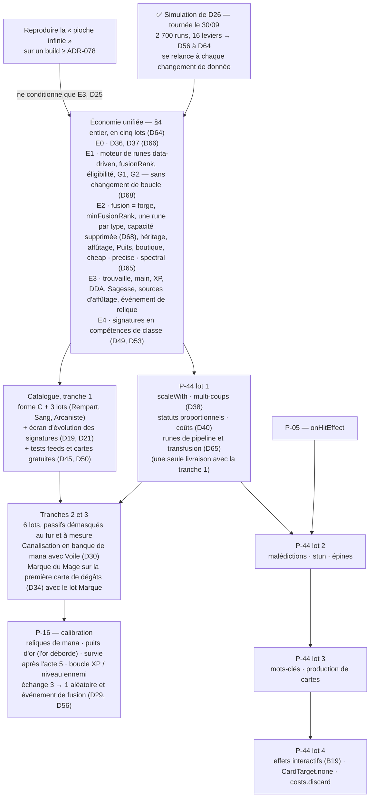

# Brainstorm v3 — Héros, Cartes et Économie de Deck, après les décisions du 22/09

**Date** : 22/09/2026
**Remplace** : le brainstorm du 05/08 (`analysis_reports/05082026_brainstorm_heros_et_cartes_Opus5.md` et sa copie dans ce dossier), et la v2 du même jour, absorbée ici.
**Vérifié contre** : `main` à `3b8c66f` (2026-09-21), 1187 tests au vert *(re-mesuré le 29/09)*. Chaque constat porte le `fichier:ligne` qui l'établit.
**Statut** : Brainstorm, **complété le 28/09, révisé les 29 et 30/09**, puis **seconde passe de cohérence le 30/09** après D36-D49 (D50-D55 ; revue : [`29-09-2026_revue_brainstorm_v3_heros_et_cartes_Fable5.md`](29-09-2026_revue_brainstorm_v3_heros_et_cartes_Fable5.md), §11), puis **la simulation de D26, le 30/09** (D56-D64 ; rapport : [`30-09-2026_simulation_D26_economie_Fable5.md`](30-09-2026_simulation_D26_economie_Fable5.md)), puis **une troisième passe de cohérence le 30/09** après D56-D64 (D65-D67 ; revue, §12 — la simulation relancée à k = 2, rapport §7), puis **une quatrième passe le 30/09** après D65-D67 (D68 ; revue, §13), puis **la méthode par vagues le 01/10** (D69 ; [orchestration](01-10-2026_orchestration_chantier_economie_et_catalogue_Fable5.md), qui fait foi pour le déroulé), puis **une cinquième passe le 01/10**, sur le fichier d'orchestration lui-même (D70, D71 ; revue, §14), puis **une sixième passe le 01/10**, sur l'orchestration corrigée, avant de lancer la vague 1 (D72 à D74 ; revue, §15), puis **un contrôle ciblé le 01/10**, sur le texte de la sixième passe (D75 ; revue, §16). Les décisions du propriétaire des 22/09, 28/09, 29/09, 30/09 et 01/10 (§1) sont **acquises** et ne sont pas rouvertes ; tout le reste est proposition.

**Vocabulaire** — trois sortes de cartes, à ne pas confondre :
- une **neutre** : `cards/<id>.json`, jouable par toutes les classes, jamais bloquée ;
- une **carte de lot** : `cards/<passif>/<id>.json`, propre à un passif donc à une classe, rareté `common`, fusionnable — *« carte unique par passif »* dans les échanges, mais *unique* était la rareté des signatures jusqu'à D49, on dit **carte de lot** ;
- une **signature** : **plus une carte** depuis le 30/09 (D49) — une **compétence de classe** hors du deck, `classes/<id>/skills/<id>.json`, deux par classe, coût en mana et temps de recharge, disponible dès le tour 1, évolue avec le niveau du héros (§4.4). Le mot reste *signature* : « Compétence » désigne déjà le type de carte `skill`. Les valeurs de cartes sont des ordres de grandeur, jamais des chiffres de spec.
**Convention** : les chantiers `P-xx` renvoient à `docs/ROADMAP.md`, source unique du reste à faire. Le programme P-42 → P-44 y est à **redécouper** (§11) : ses périmètres d'août ne correspondent plus *(redécoupé le 01/10, par la vague 0 du fichier d'orchestration)*.

---

## 0. Ce qui a bougé depuis le 05/08

Le brainstorm d'août a été écrit sur un jeu qui n'existe plus. Sur ses sept axes, deux sont livrés, un aux deux tiers, et le point d'architecture à trancher « avant la première carte » l'est déjà.

| Axe d'août | État au 21/09 | Preuve |
|:---|:---|:---|
| **A** — pools par classe | ⛔ Ouvert, mais la séparation `unique` / appartenance est **faite** : le répertoire porte la classe, `unique` ne marque que les 2 signatures, un prédicat unique filtre boutique et bonus de boss. Reste le draft de départ. *D49 (30/09) : les signatures quittent les cartes, `unique` disparaît avec elles* | ADR-086, ADR-094, ADR-101 · `card_data.dart` `isOfferableTo` · `starter_deck_draft_screen.dart:57` |
| **B** — statuts orphelins | 🟠 `vulnerable` posé par *Marque du Mage* (dans le code, `MageMarkPassive`, pas dans la donnée) ; `strength_regen` renommé `might_regen` (commit `ad56024`). **Deux orphelins restent** : **`weakness`** (la cible inflige −25 % de dégâts, `damage_pipeline.dart:15-18` — aucune carte, aucun passif, aucune relique ne le pose) et **`might_regen`** (+Puissance au début de chaque tour, lu par `status_effect_processor.dart:23` — posé par rien non plus). §7 leur donne un lot chacun : `weakness` à Sanctifié (§7.1), `might_regen` à Sang (*Transe*, §7.2) | `passive_strategies.dart:85` · `grep -rln "weakness\|might_regen" assets/data/` → vide |
| **C** — `skills.json` | ✅ Livré | ADR-084 |
| **D** — stats réelles | ✅ Livré par P-41 : `baseDamage` supprimé, Berserker `critChance` 10, Paladin `mastery` 1 | `classes/*/class.json` · ADR-099 |
| **E** — récompense de carte | ⛔ Seul le boss offre des cartes | `reward_controller.dart:168-195` |
| **F1-F3** | ⛔ Aucun `"cost": 3`, aucun `status`, aucun `scaleWith` | — |
| **G1**, **G2** | ⛔ Orphelins (monotonie des paliers, multiplicateur sur `draw`/`gain_mana`) | `card_instance.dart:35-50` · `effect_resolver.dart:224` |
| **G3** | ✅ Livré par P-40 | ADR-094 |

**Et ce que le moteur porte désormais, que les cartes doivent nourrir** : la conversion d'armure du Berserker (`statRules`), l'orientation de la Puissance par classe (`mightTargets` — Berserker : Attaques ; Mage : Compétences et altérations ; Paladin : tout), neuf passifs à déclencheur, les récompenses de niveau en donnée (`level_up_rewards/`, `effect` ∈ {`stat`, `cloneCard`}), et l'éditeur de contenu. **Trois statuts sont lus comme des booléens** — `weakness` (`damage_pipeline.dart:15`), `vulnerable` (`:46`), `freeze` (`turn_phase_manager.dart:107` pour la durée ; l'effet réel, l'intention × 0,5, vit dans `enemy_instance.dart:28-29`) : leur `value` n'est jamais lue, seuls `burn`, `poison`, `shock` scalent. La Puissance « altération » est morte sur la moitié des statuts.

---

## 1. Les décisions du 22/09 au 01/10 — acquises

| # | Sujet | Décision |
|:---|:---|:---|
| **D1** | Trouvaille de carte | Après chaque combat, ~~**une chance** de trouver une carte : 33 % combat normal, 50 % élite~~ *(chances amendées par D31 le 29/09 : une carte garantie, puis des jets pour les suivantes)* ; le boss garde sa récompense. Tirage **uniforme** dans le pool accessible à la run, **signatures exclues**, toujours en rareté `common`. **La carte ne se refuse pas** : elle entre dans le deck. Le principe « pas de contenu sans décision » vaut pour nous, pas pour le joueur |
| **D2** | Plafond | **Plus de plafond de deck.** La seule limite est la **main** (`maxHandSize`), que toute pioche doit respecter — le testeur a observé une main au-delà du maximum, à reproduire (§2) — et qui reste augmentable par relique ou récompense. ~~La dilution d'un deck sans plafond est traitée par l'oubli, l'échange 3 → 1 et l'événement de fusion (D29)~~ *(mesuré le 30/09, D56 : la dilution est traitée par la fusion elle-même — 35 cartes à l'acte 15 ; l'oubli, l'échange et D29 sont des choix de variété)* |
| **D3** | Fusion = forge | La rune ne s'obtient plus au feu de camp : **à chaque fusion 3→1**, la carte monte de rareté **et** le joueur choisit **1 rune parmi 3**, dont le palier dépend du rang de fusion. **Une seule rune de chaque type par carte.** ~~Le système d'héritage par cumul de runes identiques disparaît~~ *(phrase amendée par **D13** le 28/09 : l'héritage est conservé, les runes de même id s'additionnent — revue du 29/09, I1)* |
| **D4** | Runes à niveau | Une rune n'a plus de rareté mais un **niveau**, montable « à l'infini » contre de l'or au feu de camp. Il faudra **plus de runes**, dont des runes qui changent le **mécanisme** de la carte *(« à l'infini » : borné rune par rune depuis D27 ; « au feu de camp » : plus la seule source depuis D42)* |
| **D5** | Feu de camp | Garde repos et oubli ; la forge devient **« améliorer une rune »** (+1 niveau contre de l'or) |
| **D6** | Nœud Forge de Fusion | Devient le **Puits d'échange** : remplacer une rune par une autre, toutes les options proposées, coût en or croissant avec le niveau de la rune |
| **D7** | Signatures | Ne reçoivent plus de rune. Elles **évoluent avec le niveau du héros**, avec des améliorations **propres à chaque signature** |
| **D8** | Catalogue | **On repart de zéro**, en gardant les ids existants ; certaines cartes actuelles peuvent survivre telles quelles |
| **D9** | Passifs | **Fixés à leur classe** : trois par classe, exclusifs. La méta-progression (P-13) débloquera ces mêmes passifs. Le partage entre classes de P-49 est retiré |
| **D10** | Passif = archétype = lot | Chaque passif vient avec **son lot de cartes**. Les dossiers de classe ne gardent que les signatures ; tout le reste vit dans `assets/data/cards/`, avec un lien vers le passif — forme à brainstormer (§6) |
| **D11** | Mana | `maxMana` reste 3. **Pas de déluge de cartes à 0** pour le Mage. La récompense de niveau *Sagesse* (`maxMana`) est **reléguée en légendaire ou mythique** |
| **D12** | Profondeur | Tous les mécanismes de P-44 sont retenus, **plusieurs cartes par mécanisme**, et des **coûts combinés** |
| — | Plus tard | Nœuds ou événements d'**échange de cartes** (3 cartes → 1 carte aléatoire de rareté supérieure), ou une option du feu de camp *(moment tranché par D52, puis D56 : P-16 — avec l'événement de fusion de D29, qui a quitté E le 30/09 ; la forme reste ouverte, Q4)* |
| **D13** *(28/09)* | Héritage à la fusion | **Amende la dernière phrase de D3.** Les runes des trois ingrédients sont **conservées** ; deux runes de même id **fusionnent en une, niveaux additionnés** ; puis la rune neuve, tirée hors des runes déjà portées. **Aucun plafond de runes par carte** : le joueur choisit entre *s'étaler* (beaucoup de runes) et *concentrer* (peu de runes, hauts niveaux) — voir §4.2 pour l'or |
| **D14** *(28/09)* | Affûtage | Au feu de camp, **une seule rune monte d'un seul niveau** par visite |
| **D15** *(28/09)* | Données | **Forme C** retenue : un sous-dossier par passif, `cards/<passif>/<id>.json`, neutres à la racine (§6) |
| **D16** *(28/09)* | Lots | **5 à 6 cartes par passif**, neuf lots — donc, par extension, trois lots par classe. Les cartes doivent aussi couvrir les mécanismes de P-44 |
| **D17** *(28/09)* | Neutres | **Aucune neutre n'est bloquée** : c'est l'intérêt d'une neutre |
| **D18** *(28/09)* | Runes | **Une rune par mécanisme** de P-44, proposable à la fusion |
| **D19** *(28/09)* | Signatures | **Tous les 5 niveaux du héros, toutes les signatures gagnent un niveau.** À chaque niveau de signature, **3 améliorations tirées au hasard** parmi celles de la signature, le joueur en choisit une, sur **un écran propre**, semblable au carrousel de montée de niveau |
| **D20** *(28/09)* | Or de l'affûtage | **Le coût scale avec le niveau de la rune**, pas avec le rang de la carte — voir le calcul et le pari de §4.2 |
| **D21** *(28/09)* | Paliers de signature | Comme les runes, **pas de plafond d'évolutions**, mais deux paliers : **mineure tous les 5 niveaux, majeure tous les 10** — nv. 5 mineure, nv. 10 majeure, nv. 15 mineure, nv. 20 majeure, et ainsi de suite |
| **D22** *(29/09)* | Puits | **Un Puits garanti tous les 3 actes** — actes 3, 6, 9, 12… — placé sur un nœud des étages 3-7 comme le `forgeFusion` d'aujourd'hui (revue, E1). À mettre en regard de l'Autel d'échange de reliques : acte ≥ 5, garanti tous les 5 actes, 10 % sinon (`map_content_placer.dart:10`) |
| **D23** *(29/09)* | Échange de relique | Un **événement** neuf permet d'échanger une relique contre des PV, de l'or, ou les deux — forme à trancher en spec (§13, Q15) |
| **D24** *(29/09)* | Courbe d'XP | **Aplatie et en donnée** : gain **linéaire par acte**, calé pour qu'un héros gagne **au moins 2 niveaux par acte** (revue, E2). Les paliers de D19 et D21 restent tels quels — ils deviennent atteignables *(forme tranchée par D58 : une table par acte ; le palier constant diverge)* |
| **D25** *(29/09)* | Main | `maxHandSize` devient une **stat de run** (§4.1) : **ADR-078 D3 est amendé** — sa prémisse « 10 est inatteignable » est contredite par l'observation du testeur (§2) ; l'ADR est à corriger une fois le bug reproduit (revue, E3) |
| **D26** *(29/09)* | Simulation | **Au moins 15 actes**, toutes les variables : trouvaille, fusion, affûtage (or et visites), Puits, Autel et événement de relique, boutique, XP et niveaux, évolutions de signature, DDA (revue, E4). **Par classe et par lot** *(30/09)* : Rage veut des PV manquants, le Berserker Sang n'a rien à soigner au feu et affûte à chaque visite — le taux d'affûtage n'est pas un chiffre unique (revue §8 idée 14). **Tournée le 30/09** : 2 700 runs de référence, 16 leviers, [rapport](30-09-2026_simulation_D26_economie_Fable5.md) ; ses conclusions sont D56 à D64 |
| **D27** *(29/09)* | Runes à niveau unique | **`eco` et `quick` ne prennent pas de niveau** : `maxLevel: 1` — au-delà, mana et pioche infinis. Chaque rune déclare son `maxLevel` ; la liste proposée est en §8. Q2 est tranchée *(une exception, rare : D42(c), bornée par D51)* |
| **D28** *(29/09)* | Révisions de la revue | `forgeSlotBonus` → `fusionRank`, capacité supprimée, cartes pré-forgées bornées (§4.2) *(le renommage en E1, le reste en E2 — D68)* ; les évolutions de signature ne sont pas des runes (§4.4) ; `magic_missile` devient une Compétence ; `focus` supprimée ; règle des deux cartes à 0 (§5) ; sort de chaque carte : revue, annexe B.4 |
| **D29** *(29/09)* | Événement de fusion | La fusion **de trois copies identiques** reste la règle : c'est le concept hérité des autobattlers (Teamfight Tactics), acquis. La « fusion par lot » du designer (revue, §7 idée 2.1) ne la remplace pas ; elle devient un **événement** : contre des PV **et** de l'or, le joueur choisit trois cartes de même rareté, l'une monte de rareté, les deux autres sont sacrifiées, les runes héritées selon D13. Qui monte — choix du joueur ou hasard — et le coût : Q18 |
| **D30** *(29/09)* | Canalisation | Le passif du Mage devient une **banque de mana** : le mana non dépensé est conservé (plafond `maxMana`, +1 par point de Maîtrise) et le tour suivant commence à `maxMana + réserve`. **Mage uniquement** — l'armure et la Puissance des autres classes ne changent pas. Modifie un passif livré par P-41 : `channeling.json` change d'`effectType`, `startTurn` lit la réserve (revue, §7 idée 2.5) |
| **D31** *(29/09)* | Trouvaille — amende D1 | **Une carte garantie après chaque combat normal** ; en élite, **une garantie et 25 % pour une seconde**. Trois reliques modulent : l'une monte la chance de seconde carte en élite ; une **épique** ajoute +1 % *(cumulatif par relique)* de seconde carte en combat normal et de troisième en élite ; une autre ajoute **une carte garantie de plus** en combat normal. Tirage uniforme, `common`, sans refus : inchangés. Plus de cartes, avec une part de hasard qui fait plaisir au joueur *(reliques amendées par D57 : B supprimée, A et C restent)* |
| **D32** *(29/09)* | Affûtage | **Pas de taxe de fusion** : le prix du pari « affûter avant de fusionner » est le temps — trois cartes à affûter, trois fois les visites de feu de camp — et D20 reste (revue, §7 idée 2.3) |
| **D33** *(29/09)* | Runes en pourcentage | `sharp`, `hardened`, `spectral`, `lifesteal` et `piercing` passent en **pourcentage de la valeur de base** de la carte, au moins +1 par niveau sur la carte (règle G1) : la rune grandit avec la fusion et ne multiplie plus par le nombre de coups. `burning`, `shocking`, `freezing` restent en piles. Ordre : `sharp` et `hardened` d'abord (revue, §7 idée 2.4) |
| **D34** *(29/09)* | Marque et tranche 1 | *Marque du Mage* se déclenche sur la **première carte de dégâts** du tour, Attaque ou Compétence : le passif partage le verbe de la classe, et Marque comme Arcaniste se distinguent par le payoff. **La tranche 1 du Mage est Arcaniste**, pas Marque — le premier lot livré doit lire la Puissance du Mage (revue, §7 idée 2.6) |
| **D35** *(29/09)* | Vampire | Le vol de vie soigne **par carte**, pas par coup : Vampire devient le lot des **Attaques à 1 qui piochent** ; les multi-coups vont à Marque et Croisé. La rune `lifesteal` est un **soin propre à la carte** (D33, en pourcentage des dégâts), jamais le statut du passif, non cumulable (revue, §7 idée 2.8) |
| **D36** *(30/09)* | Puissance par source | **Un statut `might` par source** : `StatusEffect` porte l'id de ce qui l'a posé — carte, passif ou règle de classe — et `addStatus` ne fusionne que même statut *et* même source. Un +3 pendant 1 tour et un +2 pendant 2 tours restent deux effets ; la même carte rejouée s'additionne comme aujourd'hui. `effectiveMight` somme déjà toutes les entrées et `tickStatuses` les vieillit séparément ; le HUD affiche la somme. **Bug d'aujourd'hui** — `demon_form` puis `iron_wall` = Puissance 12 pendant 4 tours (`entity_stats.dart:134-139`, `status_effect.dart`) — à corriger **hors de la spec** (revue, §8 idée 2) |
| **D37** *(30/09)* | `ratio` sur `statRules` | La conversion d'armure du Berserker passe de 1:1 à **0,5:1, arrondi à l'entier supérieur** : 6 armure → 3 Puissance, 5 → 3, 1 → 1. Le champ `ratio` (défaut 1) s'ajoute à la règle de classe (`stat_rule.dart`), `StatGains._convert` l'applique : un garde-fou de classe, pas un nerf de carte (revue, §8 idée 3) |
| **D38** *(30/09)* | `mightRatio` par effet | Tout effet `damage` porte un **`mightRatio`** (défaut 1) : la part de Puissance que chaque coup reçoit. Les multi-coups le déclarent < 1 ; un test de données impose **Σ `hits` × `mightRatio` ≤ coût en mana + 1** sur toute carte du catalogue, neutres comprises. Sur les autres cartes, le champ reste à 1 et le test garde le budget (revue, §8 idée 4) |
| **D39** *(30/09)* | Puits et niveau | La rune reçue entre aux **deux tiers du niveau** de la rune donnée — arrondi au plus proche, au moins 1 — puis est **bornée par son `maxLevel`** (D27) : une `sharp` 9 troquée en `eco` donne `eco` 1. Le coût en or reste `base × niveau` de la rune donnée (D6). Amende la ligne « même niveau » de §4.3 (revue, §8 idée 8) |
| **D40** *(30/09)* | Coûts combinés | Trois règles pour §9.1 : `canPlayCard` exige PV **>** coût en PV, jamais létal ; la rareté ne multiplie jamais `costs` ; **chaque rune ne rembourse qu'une ressource** — `eco` et `cheap` le mana, une nouvelle rune (`transfusion`, nom provisoire, §8) les PV. Le validateur de §7.4 (`costs.armor` dans un lot du Berserker → erreur) reste et **ne s'étend pas** à `costs.hp` dans un lot qui soigne (revue, §8 idée 15) |
| **D41** *(30/09)* | Signatures dès le tour 1 | Les deux signatures sont **disponibles dès le premier tour de chaque combat**, sans dépendre de la pioche : sous D31 un deck de 100 cartes à l'acte 15 sort une signature donnée un combat sur dix, et les évolutions de D19 restent invisibles *(le deck mesuré fait 35 cartes, D56 — une signature en main d'ouverture un combat sur sept : le motif s'atténue, la décision tient pour la lisibilité des évolutions)*. Leur forme est ouverte — **Q20** : en main en plus des 5 cartes (une main de 7), ou hors du deck comme **compétences de classe à temps de recharge**. `HeroData.skills` les liste déjà à part (revue, §8 idée 1) |
| **D42** *(30/09)* | Sources d'affûtage | Le feu garde D14 (une fois par visite) mais n'est plus la seule source. Trois s'ajoutent : **(a)** la récompense de boss « XP » (`BossRewardType.doubleXp` : ×3 XP, ×3 or) **ne donne plus de carte** — à sa place, **une rune tirée dans tout le deck monte d'un niveau** ; une **relique légendaire** porte ce nombre au-delà de 1 ; **(b)** une issue d'événement affûte ; **(c)** une récompense de niveau **mythique** monte de 1 le **`maxLevel`** d'une rune — pas son niveau — et ouvre `eco` 2 ou `quick` 2 environ **une run sur neuf** *(mesuré le 30/09, D62 : chaque mythique a son propre jet de 0,5 % par niveau — 11 % des runs à l'acte 15)*. À surveiller : `eco` 2 sur une carte à 1 rend ce qu'elle coûte, c'est le moteur que D27 fermait, rendu rare et non inoffensif. Ni pool `draft`, ni boutique, ni quatrième type de boss (revue, §8 idée 5) |
| **D43** *(30/09)* | Seuils en donnée, plancher | La tranche de Bénédiction (5, constante `BlessingPassive._armorPerTranche`) devient `threshold` en donnée, comme Flux de Mana ; le bloc `mastery` gagne un **`floor`** que la Maîtrise ne franchit pas — **2** sur les deux passifs. Ferme R5 : Affinité +2 ramenait Flux à 1, plancher codé en dur dans `ManaFluxPassive`. Le designer propose Bénédiction à `threshold: 3` avec la Maîtrise sur le seuil — valeurs pour la simulation *(mesurées le 30/09 : moins bien ; D60 garde la tranche de 5 et la Maîtrise sur la valeur)*. La variante « armure conservée » attend le lot Sanctifié (revue, §8 idée 7) |
| **D44** *(30/09)* | Éligibilité des runes en donnée | Toute règle d'éligibilité d'une rune est un champ de son fichier, dans la forme d'`eligibleCardTypes` et `requiresExhaust` : `requiresMinCost` (`eco`), `excludesRunes` (`cheap` refuse `eco` — *un seul nom, celui de D51 ; troisième passe — et l'exclusion est **symétrique par moteur** pour toute paire, D61 en quatrième passe*), `requiresCost` (`transfusion`, D40), et **`excludesEffects: ["gain_mana", "draw"]` sur `enduring`** — une carte qui rend du mana ou pioche sans s'épuiser est un moteur infini. Aucun `case` par rune dans l'offre (revue, §8 idée 9) |
| **D45** *(30/09)* | `feeds` et un test | Chaque passif déclare **`feeds`**, ce dont il se nourrit (Ferveur : `["armor", "attack"]`). Un test de données, sur le modèle d'`entity_id_convention_test`, refuse toute carte de `cards/<passif>/` dont aucun effet ni type ne touche la liste : P2 est vérifiée à l'écriture des ~45 cartes (revue, §8 idée 10) |
| **D46** *(30/09)* | Boutique : la copie du deck | La boutique montre **une quatrième carte, stylisée à part** : la copie d'une carte **tirée dans tout le deck du joueur**, au **même rang de fusion**, **sans ses runes**. C'est le clonage du Miroir magique (`cloneCard`, qui recopie les runes et se choisit parmi 3) rendu permanent, tiré et non choisi, à un prix par rareté : la source de doublon *ciblée* de la fusion, contre de l'or. Les trois autres cartes viennent toujours du pool offrable (revue, §8 idée 11, reformulée) |
| **D47** *(30/09)* | DDA : la qualité, pas la taille | `PlayerPower` ne lit plus `playerCardsCount × 2` (`encounter_system.dart:101`) mais la **somme des `fusionRank` du deck**, coefficient fixé par la simulation (D26 — **k = 2**, D59). Un deck gonflé par D31 ne monte plus le budget ennemi (revue, §8 idée 12) |
| **D48** *(30/09)* | `minFusionRank` d'`eco` et `quick` | **2**, la rare, et non 3 : ~~sous D31 neuf copies d'une même carte n'arrivent que vers l'acte 23 par la trouvaille seule, atteindre la rare est déjà un effort~~ *(motif contredit par la mesure : la rare arrive à l'acte 4 — mais la valeur tient, au rang 3 les deux runes sortent presque du jeu : une carte sur 35 à l'acte 15 contre cinq, rapport §3.13)*. Q19 est tranchée *(lot : E2, D68)* |
| **D49** *(30/09)* | Signatures = compétences de classe | **Les signatures ne sont plus des cartes.** Deux **compétences de classe** par héros, hors du deck, listées par `HeroData.skills` comme aujourd'hui, disponibles dès le premier tour (D41), avec leur **coût en mana** et un **temps de recharge en tours**. Ni piochées, ni défaussées, ni offertes, ni clonées ; leur modèle d'évolution (§4.4, D7, D19, D21) ne change pas. Conséquences : la rareté `unique` et `CardCategory.characterSpecific` disparaissent ; `classes/<id>/cards/` devient `classes/<id>/skills/` ; une barre de compétences au HUD ; le tutoriel, le draft de départ et la sauvegarde à revoir ; §5 ne les compte plus dans le deck accessible. Q20 est tranchée. Vocabulaire : on dit toujours **signature**, « Compétence » est le type de carte `skill` |
| **D50** *(30/09, seconde passe)* | Cartes gratuites | La règle de §5 compte le **coût total**, `costs` compris : une carte à 0 mana qui coûte des PV ou de l'armure n'est pas gratuite — *Sang versé* (0 mana, 4 PV, §7.2) n'entre pas dans le compte et n'a pas à épuiser. Le test lit `count(coût total == 0) ≤ 2 && isExhaust` |
| **D51** *(30/09, seconde passe)* | Éligibilité, suite de D44 | `cheap` exige un coût ≥ 1 comme `eco` (`requiresMinCost: 1` — sur une carte à 0 elle ne ferait rien) ; `enduring` porte en plus **`excludesRunes: ["eco", "quick"]`** : D42(c) rouvre `eco` 2, et `eco` 2 + `quick` 1 + `enduring` sur une carte à 1 est un moteur que D44 ne voyait pas (elle n'exclut que des *effets*). D42(c) est gardée ; ~~sa chance est **une run sur 25-30**, pas sur sept~~ *(faux — chaque mythique a son propre jet : **une run sur neuf**, mesuré, D62)* |
| **D52** *(30/09, seconde passe)* | Un puits de dilution dans E | ~~L'**événement de fusion (D29) entre dans le chantier « Économie unifiée »** : sous D31 le deck atteint ~100 cartes à l'acte 15 et l'oubli ne suit pas — E ne se livre pas sans un puits.~~ *(prémisse contredite par la simulation : 35 cartes à l'acte 15 ; amendée par **D56**, D29 rejoint P-16)* L'échange 3 → 1 aléatoire reste en P-16 ; Q4 garde sa forme ouverte, son moment est tranché |
| **D53** *(30/09, seconde passe)* | D49 dans E | La forme « compétence de classe » — barre au HUD, recharge, sortie du `masterDeck`, tutoriel, draft de départ, sauvegarde, suppression d'`unique` et `characterSpecific` — est le **dernier lot de E** : c'est D31, dans E, qui rend les signatures-cartes invisibles, et E se teste alors sur les 17 neutres actuelles. L'**écran d'évolution** (D19, D21) reste avec la tranche 1 du catalogue |
| **D54** *(30/09, seconde passe)* | *Célérité* | L'évolution de recharge est une **majeure**, unique : sur une recharge de 2, une mineure reprenable n'aurait qu'un niveau utile. Les recharges de base ne bougent pas |
| **D55** *(30/09, seconde passe)* | *Prière* | Différenciée de `heal_potion`, qu'elle dominait (1, soigne 3, non épuisable contre 1, soigne 3, épuise) : un soin **dans le temps**, §7.1 |
| **D56** *(30/09, simulation)* | Le puits, c'est la fusion | **Amende D2 et D52.** Le deck fait **35 cartes (30–41) à l'acte 15**, pas ~100 : chaque fusion retire deux cartes, 45 fusions en absorbent 90 ; l'oubli sert une fois par run (rapport §2.3). L'événement de fusion (D29) sert une fois par run, l'échange 3 → 1 deux fois en événement, zéro au feu (§3.5). **D29 sort du chantier E** et rejoint P-16 avec l'échange 3 → 1 — elle reste acquise comme événement, elle cesse d'être un préalable |
| **D57** *(30/09, simulation)* | Reliques de trouvaille | **Amende D31.** La relique **B** (+1 % cumulatif) est **supprimée** — invisible à +1 comme à +2 % (86 cartes trouvées, comme sans). **A** reste (+25 % de seconde carte en élite, rare — 15, 25 et 50 % sont indiscernables). **C** (+1 carte garantie en combat normal) est **rare au moins** : tenue dès l'acte 1 elle donne 57 cartes de plus, et deux garanties partout feraient +55 % de fusions (§3.1, §3.3). Le curseur d'élite, 25 %, est libre |
| **D58** *(30/09, simulation)* | Courbe d'XP : une table par acte | **Q17 tranchée.** L'XP par niveau est une **table par acte**, ~~valeurs de départ 115 · 200 · 310 · 485 · 620 · 800 · 985 · 1170 · 1060 · 1245 · 1455 · 1410 · 1395 · 1465 · 1120~~ *(calées à k = 5 ; recalées à k = 2 par D67)* — 2 niveaux par acte, niveau 30 et 12 évolutions à l'acte 15. Le palier constant **diverge** (niveau 999 avant l'acte 10) : le niveau ennemi suit celui du héros (`encounter_system.dart:136-148`) et rapporte +10 % d'XP par niveau (`reward_controller.dart:86`). La table se recale à chaque changement de budget ennemi — contrainte à noter pour P-16 (§3.9) |
| **D59** *(30/09, simulation)* | DDA : k = 2 | **Précise D47.** `PlayerPower` lit **2 × Σ `fusionRank`** : c'est le coefficient qui reproduit la courbe d'aujourd'hui (budget 773 à l'acte 15 dans les deux cas ; à la relance de D67, 786 contre 783 — rapport §7). k = 5 monte le budget de 7 %, k = 10 de 20 % et les quasi-morts de 237 à 287 (§3.10) *(chiffres de la première passe ; ceux de la relance sont en rapport §7.3, la conclusion tient)* |
| **D60** *(30/09, simulation)* | Bénédiction : tranche de 5 | **Amende D43.** `threshold` passe en donnée mais **reste à 5**, et la Maîtrise porte sur la **valeur** par tranche, comme aujourd'hui. Le seuil 3 avec plancher 2 fait moins bien (PV 43 % contre 51 % à l'acte 5, 450 quasi-morts contre 426 — *première passe ; à la relance, 36 contre 49 % et 416 contre 388, rapport §7.3 : la conclusion tient*) : dès que l'Affinité monte, le seuil bute sur son plancher alors que la valeur aurait continué de monter (§3.16). Le `floor: 2` ne vaut que pour Flux de Mana, et ferme R5 |
| **D61** *(30/09, simulation)* | Éligibilité par effet | `sharp` et `hardened` sont éligibles **par effet** — `eligibleEffects: ["damage"]` et `["armor"]` — et plus par type de carte : sans quoi aucune Compétence de dégâts d'Arcaniste ne prend de rune de dégâts, et la Puissance du Mage frappe sans rune. Même forme que D44. L'exclusion `enduring` ↔ `eco` / `quick` de D51 est **symétrique** : une carte qui porte `enduring` ne se voit pas proposer `eco`, et l'inverse *(généralisé en quatrième passe, revue §13 IV4 : **`excludesRunes` est symétrique par moteur pour toute paire** — dès que l'un des deux exclut l'autre, aucun n'est proposé sur une carte qui porte l'autre, `cheap` ↔ `eco` en hérite sans donnée nouvelle — et `requiresMinCost` lit le **coût courant**, après `cheap`)* |
| **D62** *(30/09, simulation)* | D51 corrigée | Chaque mythique a **son propre jet** de 0,5 % par niveau (`level_up_reward_service.dart:127-145` — ce que §5 dit déjà pour *Sagesse*) : D42(c) sort dans **11 à 12 % des runs, une sur huit à neuf**, à l'acte 15 (relance à k = 2 : rapport §7). « Une run sur 25-30 » supposait un tirage « pool puis récompense » qui n'existe pas (3 %). Rien d'autre ne change : `excludesRunes` sur `enduring` reste (§3.11) |
| **D63** *(30/09, simulation)* | Valeurs de spec, non mesurées | Les défauts du script validés pour la simulation deviennent des **valeurs de spec**, pas des décisions acquises — le rapport (§5) dit qu'elles ne sont pas mesurées : **Q9** draft de départ 2 cartes du lot + 3 neutres ; **Q15** échange de relique : la plus faible contre 40 or × (rareté + 1), ou 20 % des PV sous 50 % des PV ; **Q18** événement de fusion : 10 % des PV max + 30 or × rang visé, gagnante tirée ; les runes neuves de §8 : poids 50, `minFusionRank` 1 ; `b` = 50 (de 25 à 150, 4 à 5 affûtages — l'or ne contraint pas) |
| **D64** *(30/09, simulation)* | Découpage de E | **E0 à E4** (§11) : D36 ~~seule~~ *(et D37 — D66)* ; moteur de runes data-driven ; fusion = forge ; trouvaille et progression ; signatures en compétences. Une spec, un plan, une implémentation par lot, ~~chacun dans sa session ; le lot précédent fusionné avant d'ouvrir le suivant~~ *(méthode amendée par D69 : une vague par version, une session par vague)* *(les runes de §8 sont réparties entre E2 et P-44 par D65 ; la frontière E1 / E2 est fixée par D68 : E1 applique, E2 obtient)* |
| **D65** *(30/09, troisième passe)* | Les runes de §8 ont un lot | **Aucune n'était assignée** (revue §12, T3). `cheap`, `precise` et `spectral` — moteur nul ou une ligne — entrent en **E2** avec la fusion ; `piercing`, `lifesteal`, `splash`, `echo` et `transfusion` — `DamagePipeline`, stratégies, `costs.hp` — avec **P-44 lot 1**, dont elles partagent les fichiers et la livraison (D18 : une rune par mécanisme) ; `retain` avec **P-44 lot 3** (mots-clés). Pas de lot E5 : E4 reste le dernier de E (D53). Conséquence pour E2 : avec 11 runes et une par type par carte, une Compétence n'a pas toujours 3 runes éligibles — `mergeCards` **en propose moins, jamais aucune tant qu'une existe** |
| **D66** *(30/09, troisième passe)* | Six décisions trouvent leur lot | **Amende D64.** **D37** (`ratio` 0,5) rejoint **E0** à côté de D36 — même famille, un garde-fou de Puissance, quelques lignes sur `stat_rule.dart` ; **D38** et **D40** vont à **P-44 lot 1** ; **D45** et **D50** — deux tests de données du catalogue — à la **tranche 1** ; **D30** (banque de mana) à la **tranche 2**, avec le lot Voile (revue §12, T4) |
| **D67** *(30/09, troisième passe)* | Table d'XP recalée à k = 2 | **Amende D58.** La table de D58 avait été calée avec le défaut du script, k = 5 ; sous D59 (k = 2) elle donnait 28 (24–33) à l'acte 15 — 1,9 niveau par acte, sous D24 (revue §12, T1). Relancée à k = 2 : **115 · 200 · 310 · 480 · 590 · 775 · 955 · 1100 · 1040 · 1185 · 1370 · 1370 · 1300 · 1375 · 1015** — niveau 10 (8–12) à l'acte 5, 30 (25–35) à l'acte 15, 12 évolutions. **Au-delà de la dernière entrée, la dernière valeur est répétée** (convention du script, `xpTable[min(act, length) − 1]`) — à re-caler si la run cible dépasse 15 actes (P-10, P-12). Le défaut du script est désormais k = 2 ; la relance ne change aucune conclusion de D56 à D63 — les écarts sont en rapport §7 |
| **D68** *(30/09, quatrième passe)* | E1 applique, E2 obtient | **Amende D64 et la table de §11.** E1 ne change pas la boucle : il livre ce qui change l'*application* des runes — le renommage `fusionRank` (lu par la capacité en attendant), l'applicateur de deltas, `valuePercentPerLevel` (D33), `maxLevel` (D27 — ~~lu dès E1 par `ForgeRuneRules.consolidate`, ce qui ferme aussitôt l'`eco:3` de la Forge de Fusion~~ *(mécanisme faux : `consolidate` ne sert que la fusion de cartes ; amendé par D72 — lu dès E1 partout où un niveau s'écrit)*), l'éligibilité en donnée (D44, D51, D61), G1, G2 — et garde **en lecture** `pools`, `stackable` et la capacité, dont les seuls lecteurs sont la forge du feu et le nœud Forge de Fusion, qu'E2 réécrit. Passent en **E2**, avec ces deux écrans : `minFusionRank` (D48), « une rune par type par carte » (D3), « capacité supprimée, pré-forgées bornées par `fusionRank` » (D28), la suppression de `pools` et `stackable`. Motif : avec `minFusionRank` pour seul filtre, une commune n'avait plus aucune rune à la forge du feu (`forge_upgrade_dialog.dart:86`, `sharp` est à 1), et « une rune par type » tuait le nœud Forge de Fusion (`forge_rune_rules.dart:69`) pendant tout un lot (revue §13, IV3) |
| **D69** *(01/10, méthode)* | Un chantier par vagues | **Amende D64 pour la méthode, pas pour le découpage.** Le chantier se livre **par vagues : une vague par version du jeu, une session par vague, un orchestrateur par session**, de `0.5.2` à `0.6.0` — E0 et E1 (`0.5.3`), E2 (`0.5.4`), E3 (`0.5.5`), E4 (`0.5.6`), la tranche 1 avec P-44 lot 1 (`0.5.7`), la tranche 2 (`0.5.8`), la tranche 3 (`0.6.0`, chantier clos). Une vague ouvre sa branche, y écrit la spec puis le plan — chacun vérifié par un agent indépendant, corrigé et revérifié jusqu'à convergence —, implémente par délégation à des agents, lance `patch-notes-writer` à la version de la vague puis `memory-bank-sync`, et **s'arrête** : le propriétaire teste à la main, ouvre la PR, ~~pose le tag et fusionne~~ *(D70 : fusionne, puis pose le tag)*, et la vague suivante n'ouvre qu'une fois la CI/CD verte. L'orchestrateur **arbitre lui-même** les questions de spec, par un arbre de décision qui retient l'option la plus cohérente avec le jeu, sans jamais amender une décision acquise ni changer une valeur mesurée. **Périmètre : ce qui a été brainstormé** — P-43, P-42 et P-44 lot 1 ; les lots 2 à 4 de P-44 et P-16 viennent après `0.6.0`. Le déroulé fait foi dans le [fichier d'orchestration](01-10-2026_orchestration_chantier_economie_et_catalogue_Fable5.md) ; ce document reste la source des décisions *(l'ordre des gestes de sortie est amendé par D70 : la fusion, puis le tag ; le cycle gagne le suivi des vagues, D71, la relance de la simulation en deux temps, D73, et une session de clôture après la dernière vague, D74)* |
| **D70** *(01/10, cinquième passe)* | Sortie de vague : la fusion, puis le tag | **Amende D69 pour l'ordre des gestes du propriétaire.** Il teste à la main, ouvre la PR, **la fusionne dans `main` par un commit de fusion, puis pose le tag `v<version>` sur ce commit** — et non « pose le tag et fusionne » : c'est la pratique de `v0.5.0`, `v0.5.1` et `v0.5.2`, la release ne sort pas avant la fusion, et la porte d'entrée de la vague suivante vérifie que le tag est dans `main`. Deux précisions de méthode viennent avec, sans autre amendement : la relance de la simulation se compare à **une sortie de référence suivie par git** (`tool/simulations/d26_reference_output.md`, produite le 01/10) et non aux chiffres du rapport, dont les §2 à §4 sont à k = 5 ; et le déclencheur de D34 **reste en vague 7** — en `0.5.6`, `magic_missile` devenue Compétence ne déclenche plus *Marque du Mage*, c'est voulu et la note le dit (revue §14, V16, V20, V21) |
| **D71** *(01/10, méthode)* | Le suivi des vagues | **Complète D69.** Un chantier livré par vagues a son **fichier de suivi**, dans le répertoire dédié `docs/suivi_vagues_chantier/` — un fichier par chantier, tous écrits selon le modèle du répertoire ([`_modele_suivi.md`](../suivi_vagues_chantier/_modele_suivi.md) : l'en-tête, l'organisation, ce qui s'écrit et de quelle manière). Chaque vague y écrit, avant de s'arrêter, sa section : **un bref résumé non technique de ce qu'elle apporte au jeu, et pourquoi cette vague** — pour quelqu'un qui joue et ne lit pas le code. Celui de ce chantier est [`economie_unifiee_et_catalogue.md`](../suivi_vagues_chantier/economie_unifiee_et_catalogue.md), l'exemple de référence. Le journal du fichier d'orchestration reste le suivi technique ; les notes de version restent ce que le joueur lit en jeu |
| **D72** *(01/10, sixième passe)* | `maxLevel` partout où un niveau s'écrit | **Amende D68 sur le mécanisme, pas sur l'intention.** D68 fermait l'`eco:3` de la Forge de Fusion par `ForgeRuneRules.consolidate` ; or `consolidate` ne sert que la fusion de cartes 3 → 1 (`deck_controller.dart:315`, `deck_screen.dart:226`). Dès E1, `maxLevel` borne **les quatre endroits qui écrivent un niveau de rune** : `consolidate` ; `fusionOptionsFor`, dont le nœud Forge de Fusion écrit la somme (`forge_rune_rules.dart:60-78`, `forge_fusion_screen.dart:55`) ; et les deux tirages de niveau — la forge du feu (`forge_upgrade_dialog.dart:176-185`) et les pré-forgées de la boutique (`shop_controller.dart:144-153`). Une seule fonction, quatre lecteurs ; aucun écran ne change de déroulé — E1 ne change toujours pas la boucle. `eco` et `quick` ne dépassent plus le niveau 1 nulle part dès `0.5.3` : D27 à la lettre *(et dans l'effet : un plafond atteint ne se repropose pas — D75)* (revue §15, W1, A4) |
| **D73** *(01/10, sixième passe, méthode)* | La simulation se relance en deux temps | **Précise D70.** Chaque run tire tout — carte, combats, récompenses, événements — d'un seul générateur (`d26_economy_sim.dart:3298`) : une liste plus longue d'un élément décale toute la suite, et un réalignement mêlé à un changement voulu donne un écart qu'on ne peut plus attribuer. Une vague qui touche ce que le script lit procède donc en **deux temps** : (1) **le réalignement seul**, valeurs en dur inchangées, chaque fichier neuf prenant la place exacte de son entrée en dur — **diff vide** contre la référence, hors la ligne « Données lues », qui compte les fichiers ; (2) **chaque changement voulu** — une valeur remplacée par arbitrage, une entrée retirée — relancé à part, l'écart attribué, la référence recommitée. Le diff vide est un test de non-régression du script, pas une validation des données de la vague. La vague 1 relance elle aussi : la réserve se prouve, elle ne se suppose pas (revue §15, W12 à W18, A6) |
| **D74** *(01/10, sixième passe, méthode)* | La session de clôture | **Complète D69.** Une vague passe à « close » dans le premier commit de la suivante ; après la dernière, c'est **une session de clôture** qui le fait — le même prompt, collé une fois de plus après le tag de `0.6.0`. Elle passe la porte d'entrée, ouvre une branche de documentation, passe la dernière vague à « close », met la mémoire et la ROADMAP au niveau du chantier, écrit le bilan du suivi, et s'arrête : une PR à fusionner, pas de tag. Rien n'est dit clos avant de l'être, et l'orchestrateur ne commite jamais sur `main` (revue §15, W19, A5) |
| **D75** *(01/10, contrôle ciblé)* | Un plafond atteint ne se repropose pas | **Précise D72.** `maxLevel` borne le niveau d'une rune ; mais jusqu'à E2, qui livre « une rune par type par carte » (D3, D68), le feu peut poser sur une carte un second exemplaire d'une rune qu'elle porte déjà — `addForgeUpgrade` ajoute sans regarder l'id (`deck_controller.dart:344-349`) — et le moteur additionne les exemplaires (`effect_resolver.dart:136-154`) : deux `eco:1` rendent 2, et la Forge de Fusion, bornée, les réunirait en `eco:1` contre 80 or. Dès E1, **le prédicat d'éligibilité ne propose plus une rune dont le plafond est déjà atteint sur la carte, exemplaires additionnés** — une condition lue sur `maxLevel`, qui touche au feu `eco`, `quick`, `freezing` et `enduring` ; la boutique écarte déjà les ids que la carte porte (`shop_controller.dart:138`). « Une rune par type » pour les autres runes reste en E2, et aucun écran ne change de déroulé. D27 tient dans l'effet, pas seulement sur l'étiquette (revue §16, X3, A7) |

---

## 2. Le diagnostic, en trois lignes

1. *Les classes jouent différemment, mais elles ne draftent toujours pas différemment* — et P-41 a créé une demande que le catalogue ne sert pas (zéro Compétence de dégâts pour la Puissance du Mage, aucune carte conçue comme batterie de Puissance pour le Berserker, rien qui fasse survivre l'armure pour *Bénédiction*).
2. *Le deck ne grossit pas* : 7 cartes au départ, rien avant un boss.
3. *Personne ne fusionne* : trois copies forgées séparément valent mieux qu'une fusionnée, et `quick`/`eco` au feu de camp rendent la pioche et le mana illimités — le remélange à sec (ADR-078) rejoue le deck entier plusieurs fois par tour. **Ce troisième point est le nouveau**, et il commande l'ordre du reste.

> **Sur la « pioche infinie ».** Dans le code courant, les trois chemins de pioche s'arrêtent à `maxHandSize = 10` : la carte `draw` (`strategies.dart:147`), la rune `quick` (`effect_resolver.dart:168`) et le tour (`turn_phase_manager.dart:40,56`) passent tous par `_drawInto`, qui casse à la limite (`deck_controller.dart:200`). Ce que le testeur a observé est à **reproduire sur un build ≥ ADR-078** (06/08) : si la main dépasse 10, c'est un bug à corriger avant tout ; si elle n'y arrive pas, ce qu'il a vu est le **cyclage** — sans limite, et c'est exactement ce que D3, D27 et D48 corrigent en rendant `quick` et `eco` rares et à niveau unique.

---

## 3. Les trois principes

**P1 — Ne pas ajouter de contenu tant que le contenu existant ne porte pas de décision.** *(Pour nous, à la conception. Ne contraint pas le joueur — D1.)*

**P2 — Chaque carte d'un lot nourrit le passif de ce lot.** *(Resserré par D10 : « un des trois leviers » devient « le passif ».)* Une carte qui ne nourrit pas son passif est une neutre, et va dans le noyau.

**P3 — La fusion est le moteur de progression du deck.** *(Nouveau, de D1 à D6.)* La trouvaille apporte la largeur, la fusion apporte la profondeur, la rune vient de la fusion, le feu de camp affine la rune. Tout ce qui court-circuite cette chaîne — une rune achetée sans fusion, une carte forte sans doublon — la casse.

---

## 4. L'économie unifiée — trouvaille, fusion, runes, feu de camp, puits

**C'est le chantier qui précède le catalogue** : il fixe combien de runes une carte porte à chaque rang, à quel rythme les doublons arrivent, et donc combien de cartes il faut dans un pool. Il se teste sur les 17 neutres actuelles — les 6 signatures passent en compétences de classe dans son dernier lot (D53) —, comme P-41 s'est testé sans P-42.

### 4.1. La trouvaille (D1, D2)

**Mécanisme** (D31) : dans `RewardController.handleVictory`, une **table de tirages par type de nœud** — des cartes garanties, puis des jets successifs pour des cartes supplémentaires — que les reliques modifient par `applyRunRuleModifier`, comme `cardsPerTurn` ; chaque carte est tirée uniformément dans le **pool accessible** et ajoutée au `masterDeck` en `common`. Le pool accessible est celui d'`isOfferableTo` (statut exclu, `unique` exclu — jusqu'à D49 —, appartenance vérifiée) — **un seul prédicat, déjà là** (ADR-101), qu'il faudra étendre au lien passif (§6).

```jsonc
// Où vit la table ? Proposition : sur le nœud, pas dans le code —
// assets/data/map_nodes/<variante>.json quand le socle de la carte (P-50 proposé) existera ;
// d'ici là, une constante nommée par type de nœud dans GameConstants.
{ "cardDrops": { "combat": { "guaranteed": 1, "extra": [] },
                 "elite":  { "guaranteed": 1, "extra": [0.25] } } }
// Reliques (D31, D57), par `applyRunRuleModifier` : A, +25 % sur l'« extra » d'élite (rare) ;
// C, +1 « guaranteed » en combat (rare au moins). B (+1 %) est supprimée : invisible (rapport §3.3).
```

**Le plafond de main** (D25) : `GameConstants.maxHandSize` (`game_constants.dart:36`) migre dans `RunState` — ce qui **amende ADR-078 D3**, qui l'avait voulue constante parce que « 10 est inatteignable » ; l'observation du testeur (§2) contredit cette prémisse, et l'ADR est à corriger une fois le bug reproduit — sur le modèle exact de `cardsPerTurn`, que `scholars_satchel` modifie déjà par `applyRunRuleModifier` (`player_stats_manager.dart:102`). Une relique « +2 en main » est alors un fichier JSON.

**Ce que la trouvaille fait au deck, chiffré** — le calcul du 29/09, et ce que la simulation du 30/09 a mesuré ([rapport](30-09-2026_simulation_D26_economie_Fable5.md), §2 et §6) :

| Donnée | Calcul | Mesure |
|:---|:---|:---|
| Nœuds par acte, sur un chemin | 10 étages : étage 0 combat, étage 5 élite, étage 8 repos, étage 9 boss, et 6 étages libres à 60 % combat / 5 % élite / 10 % repos → ~4,6 combats, ~1,3 élite, ~1,6 feu de camp, 1 boss (`_rules/02-1:17-29`) | **3,7 combats, 1,4 élite, 1,3 feu, 1,7 événement, 0,4 boutique** — sous la politique du script (événement d'abord, Puits toujours) ; le chiffre dépend du chemin |
| Cartes trouvées par acte | 4,6 × 1 + 1,3 × 1,25 ≈ 6,2, avant reliques | **86 sur 15 actes, ~5,7 par acte** |
| Pool accessible d'une run | ~10 neutres + le lot du passif (5-6, D16) ≈ 15-16 | 9 neutres + 6 de lot = **15** (script) |
| Trouvailles pour 3 copies d'une carte **donnée** | ~48 → ~8 actes ; 9 copies ~23 actes | **Sans objet** : c'est une carte *quelconque* qui fusionne — 1re fusion à l'acte 1, 1re rare à l'acte 4 (100 %), 1re épique à l'acte 10 (94 %), légendaire dans 19 % des runs |
| Communes pour une légendaire | 3⁴ = 81 (`CardRarity.next`) | 45 fusions à l'acte 15 ; meilleur rang 3 (3–4) |

**Conséquence de D31, mesurée** *(D56)* : ~6 cartes par acte entrent, mais **chaque fusion en retire deux** — ce que le calcul du 29/09 oubliait. Le deck fait 9 cartes à l'acte 1, 20 à l'acte 5, **35 (30–41) à l'acte 15** ; 45 fusions absorbent 90 cartes, l'oubli sert une fois par run. Le deck se régule seul : l'événement de fusion (D29) et l'échange 3 → 1 (§1, ligne « Plus tard ») sont des **choix de variété**, pas des puits nécessaires — tous deux en P-16. La DDA ne lit plus la taille du deck mais sa qualité, 2 × Σ `fusionRank` (D47, D59 — `encounter_system.dart:101`, +2 de puissance joueur par carte aujourd'hui, que le deck stable rendait presque neutre).

**La trouvaille seule fusionne** — plus vite que le compte par carte donnée ne le disait : 1re fusion à l'acte 2, 1re rare à l'acte 8 (100 %), l'épique dans 6 % des runs seulement (rapport §3.2). Elle est la source de *largeur* et du rang 2 ; les sources de *profondeur* — celles qui donnent des doublons — font le rang 3 :

| Source de doublon | Aujourd'hui | Levier |
|:---|:---|:---|
| **Miroir** (récompense de niveau, `cloneCard`) | 1 clone parmi 3 cartes du deck, pool mythique | **Reste mythique** — Q3 tranchée par la mesure : en `draft` il triple les clones et avance l'épique de trois actes (A7), mais coûte 27 % des dégâts à l'acte 15, chaque clone prenant la place d'une stat (rapport §3.4) |
| **Boss « cartes »** (`BossRewardType.cards`) | 5 clones du deck proposés | Inchangé, c'est déjà la meilleure source : 22 clones sur 15 actes |
| **Miroir magique** (boutique) | Clone payant, choisi parmi 3, runes comprises, ouvert par la récompense de niveau | Inchangé ; s'y ajoute **la copie du deck** (D46) : une quatrième carte permanente, tirée dans le deck, même rang, sans runes — 4 achats sur 15 actes |
| **Échange 3 → 1** (P-16, D56) | — | Convertit trois cartes *quelconques* en une carte de rareté supérieure *aléatoire* : 2 usages par run en événement, 0 au feu de camp (rapport §3.5) — un choix de variété, la forme reste ouverte (Q4) |

**La simulation a tourné** (D26, 30/09) : 2 700 runs de référence, 16 leviers, chacun varié le reste fixé, sur les mêmes graines. Relancée le soir même à k = 2, après D59 (rapport §7, D67) : aucune conclusion ne bouge, et le défaut du script est désormais k = 2 — les chiffres de référence cités ici sont ceux de la relance. Ses valeurs recommandées (rapport §4) sont reprises en D56 à D63 ; les leviers qui ne bougent rien — chance d'élite, valeur de A, `b`, rythme du Puits et de l'Autel, table `maxLevel` — restent aux valeurs écrites. Elle se relance (`dart run tool/simulations/d26_economy_sim.dart`, 7 à 10 minutes) à chaque changement de donnée, et elle **ne dit pas si le héros survit** : dans son modèle, la première quasi-mort arrive à l'acte 5 dans 100 % des runs (rapport §5) — un constat pour P-16, hors de ce chantier.

### 4.2. Fusion = forge (D3, D4)

**Le rang de fusion remplace la capacité** *(tranché le 29/09)*. `CardRarity.forgeSlotBonus` (0 / 1 / 2 / 3 / 4 de `common` à `legendary`, `unique` 0 — `card_data.dart:33-39`) est **renommé `fusionRank`** : le nombre de fusions qu'il a fallu pour atteindre la rareté, ce que `minFusionRank` compare ci-dessous. `forgeCapacityAt`, `CardInstance.forgeCapacity` et `baseMaxForgeUpgrades` sont **supprimés** : sous D13 il n'y a plus de plafond, une carte porte ce qu'elle a hérité plus une rune par fusion, et ses fentes se comptent sur `forgeUpgrades.length` — aucune fente vide. Les **cartes pré-forgées de la boutique** restent, **bornées par `fusionRank`** : une carte de l'étal porte au plus autant de runes que si elle avait été fusionnée jusqu'à sa rareté. Lecteurs touchés : revue du 29/09, §2.1. **Livré en E2**, avec les deux écrans qui lisent la capacité ; E1 ne fait que le renommage (D68).

**Le modèle de rune change de forme** :

```jsonc
// assets/data/forge_upgrades/sharp.json — aujourd'hui                // demain
{ "pools": ["common", "uncommon", "rare"],                             { "minFusionRank": 1,          // proposable dès la 1re fusion (→ uncommon)
  "valueMultiplier": 2,                                                  "valuePercentPerLevel": 15,  // +15 % de la base par niveau, au moins +1 (D33)
  "eligibleCardTypes": ["attack"],                                       "eligibleEffects": ["damage"], // par effet, plus par type (D61)
  "stackable": true (implicite),                                         "maxLevel": null,            // aucun pour sharp ; chaque rune déclare le sien (D27, §8)
  "weight": 100 }                                                        "weight": 100 }
```

- **`minFusionRank`** remplace `pools` : il gère la promesse de D3 (« passer de commune à peu commune ne donne que des runes de base ») sans réintroduire une rareté sur la rune. `eco` et `quick` à `minFusionRank: 2` (→ rare, D48) : le mana et la pioche gratuits ne se voient plus avant la deuxième fusion d'une même carte. Lu par la fusion seule, donc **livré en E2** ; E1 garde `pools` pour la forge du feu (D68).
- **`stackable` disparaît** : une rune par type par carte, toutes (D3) — **en E2** (D68), puisque c'est l'entrée du nœud Forge de Fusion d'aujourd'hui. `enduring` reste binaire — `valuePerLevel` absent, `maxLevel: 1`.
- **Le format `id:tier` de `CardInstance.forgeUpgrades`** survit tel quel : le tier *est* le niveau. Aucune migration de sauvegarde — et de toute façon les sauvegardes ne se transfèrent pas avant la 1.0.

**Le geste de fusion** : `DeckNotifier.mergeCards` tire 3 runes éligibles (`eligibleCardTypes` ou `eligibleEffects` — D61 —, `minFusionRank ≤ rang atteint`, **id absent de la carte**, et les règles en donnée de D44 et D51), le joueur en choisit une, elle entre au niveau 1 ; s'il y a moins de 3 runes éligibles, il en propose moins, jamais aucune tant qu'une existe (D65). L'écran est le `ForgeUpgradeDialog` actuel, appelé depuis l'écran de deck au lieu du feu de camp — la persistance anti-reroll (`forgeSlots`, `forgeTargetCardId`) sert telle quelle.

**Ce que deviennent les runes des trois ingrédients — tranché (D13).** Trois `uncommon` fusionnent ; chacune porte une rune de niveau ≥ 1, parfois la même, parfois montée au feu de camp. Les runes distinctes sont toutes conservées ; deux runes de même id fusionnent en une au niveau **somme** — c'est l'ancienne règle de la Forge de Fusion, `ForgeRuneRules.consolidate`, qui a donc un nouvel emploi ; puis la rune neuve entre au niveau 1. **Pas de plafond** : une carte porte ce qu'elle a hérité plus une rune par fusion, et le nombre reste borné par la profondeur de l'arbre. Le choix *s'étaler ou concentrer* est celui du joueur — trois ingrédients runés différemment donnent une carte à 4 runes de niveau 1 ; trois ingrédients runés pareil donnent une carte à 2 runes, dont une de niveau 3.

```
Trois Morsure peu communes :  sharp:3  ·  sharp:1  ·  burning:1
                        ⟹    Morsure rare :  sharp:4  ·  burning:1  ·  + une rune neuve (hors sharp, burning)
```

**Le problème d'or que D13 ouvre, calculé.** Additionner les niveaux rend l'ordre des opérations rentable ou non selon la courbe de coût de l'affûtage. Soit `c(n)` le prix pour passer une rune du niveau `n` à `n+1`. Objectif : une carte rare avec `sharp:9`.

| Courbe | Affûter les trois ingrédients à 3, **puis** fusionner (3+3+3) | Fusionner d'abord (1+1+1 = 3), **puis** affûter de 3 à 9 | Verdict |
|:---|:---|:---|:---|
| Linéaire `c(n) = b·n` | 3 × (1 + 2) b = **9 b** | (3+4+5+6+7+8) b = **33 b** | Affûter avant est **3,7 × moins cher** — exploit |
| Géométrique `c(n) = b·2ⁿ⁻¹` | 3 × (1 + 2) b = **9 b** | (4+8+16+32+64+128) b = **252 b** | Exploit massif |
| **Plate `c(n) = b`** | 6 b | 6 b | **Neutre par construction** : un niveau coûte le même prix où qu'on l'achète |

`b` est le **coût de base** — **50 or** (D63 : de 25 à 150, 4 à 5 affûtages, l'or ne contraint pas) ; seuls les rapports entre colonnes comptent. Toute courbe croissante avec le niveau rend l'affûtage *avant* fusion moins cher en or — c'est mathématique, pas un réglage. **Le propriétaire a retenu la courbe croissante (D20)** et **pas de taxe de fusion (D32)** : le prix du pari est le temps, trois cartes à affûter sont trois fois les visites. Le Puits (D6) est indexé sur le niveau de la rune comme l'affûtage : un échange n'accumule rien.

**Ce que la simulation en a fait** *(30/09, rapport §2.3, §3.8, §3.15)* — la question est close, et pour une raison que le calcul ne voyait pas :

- **Ni l'or ni la visite ne contraignent l'affûtage : c'est le repos.** 20 visites de feu sur 15 actes (1,3 par acte), dont **14 repos, 5 affûtages, 1 oubli** — pas ~24 niveaux d'affûtage. Seul le Berserker Sang, qui ne se repose jamais, affûte 16 fois. Et 5 596 or (2 907–7 763) dorment à l'acte 15 (rapport §7) : `b` de 25 à 150 ne change pas le nombre d'affûtages, seule la réserve du Sang le sent (3 824 → 1 056 à `b` = 150).
- **Les hauts niveaux viennent de D13, pas du feu** : 73 niveaux de rune à l'acte 15, dont ~8 par le feu, le boss « XP » et l'événement ; la rune la plus haute (9, jusqu'à 24) est faite de niveaux additionnés à la fusion.
- **« Affûter avant de fusionner » n'a pas d'enjeu** : un affûtage de moins, niveau max 7 contre 9, ~450 or de moins sur une réserve qui n'en manque pas. Le pari existe en or ; l'or ne manquant jamais, il ne se joue pas.

Deux réserves : ces chiffres sont mesurés sur un héros que le jeu aurait tué dès l'acte 5 (§4.1, dernier paragraphe) — si la survie change, le repos rend des visites à l'affûtage ; et **l'or qui déborde est un constat pour P-16**, qui aura un puits d'or à créer.

### 4.3. Le feu de camp (D5) et le Puits (D6)

| Nœud | Option | Mécanisme | Coût |
|:---|:---|:---|:---|
| **Feu de camp** | Repos | inchangé (30 % PV) | — |
| | Oubli | inchangé | — |
| | **Affûter** *(remplace Forge)* | choisir une carte, choisir une de ses runes, **+1 niveau — une seule fois par visite** (D14) ; le feu n'est plus la seule source — boss « XP », événement, `maxLevel` en mythique (D42) | `b × niveau de la rune` (D20) — le pari « affûter avant de fusionner » est analysé en §4.2 |
| **Puits d'échange** *(remplace Forge de Fusion)* | Échanger | choisir une rune d'une carte ; **toutes** les runes éligibles à cette carte — au sens de §4.2, le prédicat de `mergeCards` au rang de la carte — sont proposées ; la nouvelle entre aux **deux tiers du niveau** de l'ancienne — arrondi au plus proche, au moins 1 — bornés par son `maxLevel` (D39) : l'échange coûte un tiers des niveaux, assez pour qu'affûter `sharp` puis troquer ne domine pas | `base × niveau` de la rune donnée, comme D6 |

Le nœud `forgeFusion` garde son id et son placement (un nœud des étages 3-7), **pas sa fréquence** : aujourd'hui 25 % de chance *par carte* qu'un seul nœud existe (ADR-074, `map_content_placer.dart:24-36`), donc rarement sur le chemin du joueur ; demain **un Puits garanti tous les 3 actes** (D22). Seuls son écran et son libellé changent par ailleurs. `ForgeFusionScreen` se réécrit ; `ForgeRuneRules.consolidate` sert à l'héritage (§4.2), `fusionOptionsFor` n'a plus d'emploi.

**Le puits d'or ne suffit pas** *(mesuré le 30/09)* : l'affûtage remplace la forge côté économie et le Puits ajoute un second consommateur, mais l'or déborde quand même — 5 596 en réserve à l'acte 15, et le Puits dépense ≈ 3 300 quel que soit son rythme (rapport §2.3, §3.6). **P-16 a un puits d'or à créer**, à calibrer avec la boutique (§11).

### 4.4. Les signatures — des compétences de classe qui évoluent avec le niveau (D7, D49)

**Les signatures ne sont plus des cartes** *(tranché le 30/09, D49)* : deux **compétences de classe** par héros, hors du deck, listées par `HeroData.skills` comme aujourd'hui. Elles ne sont ni piochées, ni défaussées, ni offertes, ni clonées — donc plus de rune de fusion ni de `baseMaxForgeUpgrades: 5`, et la rareté `unique` disparaît des cartes. Chacune a un **coût en mana** et un **temps de recharge en tours** (`cooldown`), est **disponible dès le premier tour de chaque combat** (D41) et se joue depuis une **barre de compétences** au HUD. Le moteur la résout comme une carte — `EffectResolver.resolveCard` prend une instance, pas une pile — puis la met en recharge au lieu de la défausser : l'état de combat porte la recharge restante par signature, remise à zéro au début de chaque combat. À revoir : le tutoriel (`tutorial_engine.dart:175` lit `hero.skills` comme des cartes), le draft de départ (`tutorial_starter_deck_widget.dart:41`), la sauvegarde (elles sortent du `masterDeck`), le dictionnaire (un onglet à elles). Leur progression (D7, D19) : **tous les 5 niveaux du héros, chaque signature gagne un niveau**, et à chaque niveau de signature le joueur choisit **une amélioration parmi 3 tirées au hasard** dans celles qu'elle déclare, sur un écran propre semblable au carrousel de montée de niveau.

**La forme de données qui en découle — un modèle d'évolution propre, distinct des runes** *(tranché le 29/09 : les évolutions n'ont rien à voir avec les runes ; les deux systèmes d'amélioration sont différenciés)*. Trois choix tirés parmi une liste, cumulables d'un palier à l'autre (*Zèle* au niveau 5, *Sentence* au niveau 10, *Rayonnement* au niveau 20) : c'est **combinatoire**, donc une amélioration doit être un **delta**, pas une réécriture de la signature. Chaque signature déclare son pool d'évolutions dans son fichier :

```jsonc
// assets/data/classes/paladin/skills/smite.json — esquisse (D49 : une compétence de classe, plus une carte)
{
  "id": "smite", "cost": 1, "cooldown": 2, "type": "attack",   // plus de rarity ; type reste lu par la Puissance (mightTargets)
  "effects": [ { "type": "damage", "value": 6 }, { "type": "armor", "value": 4 } ],
  "evolutions": [                              // le pool privé, en deux paliers (D21)
    // mineures — un chiffre, reprenables : reprise, la même monte de niveau (zeal:1 → zeal:2)
    { "id": "zeal",      "tier": "minor", "name_fr": "Zèle",     "name_en": "Zeal",
      "description_fr": "+{val} dégâts", "description_en": "…", "bonusPerLevel": { "damage": 2 } },
    { "id": "bulwark",   "tier": "minor", "name_fr": "Rempart",  "name_en": "Bulwark",
      "description_fr": "+{val} Armure", "description_en": "…", "bonusPerLevel": { "armor": 2 } },
    { "id": "fervent",   "tier": "minor", "name_fr": "Fervent",  "name_en": "Fervent",
      "description_fr": "+{val} % de critique", "description_en": "…", "bonusPerLevel": { "critChance": 5 } },
    // majeures — un verbe, uniques : prise une fois, elle sort du tirage
    { "id": "haste",     "tier": "major", "name_fr": "Célérité", "name_en": "Haste",
      "description_fr": "−1 tour de recharge", "description_en": "…", "cooldown": -1 },  // plancher 1 ; majeure (D54) : sur une recharge de 2, une mineure reprenable n'aurait qu'un niveau utile
    { "id": "sentence",  "tier": "major", "name_fr": "Sentence", "name_en": "Sentence",   // pas « Jugement » : c'est déjà une carte de Croisé (§7.1)
      "description_fr": "Applique Faiblesse 1 tour", "description_en": "…",
      "addEffect": { "type": "apply_status", "statusId": "weakness", "value": 1, "duration": 1 } },
    { "id": "radiance",  "tier": "major", "name_fr": "Rayonnement", "name_en": "Radiance",
      "description_fr": "Touche tous les ennemis", "description_en": "…", "target": "allEnemies" },
    { "id": "devotion",  "tier": "major", "name_fr": "Dévotion", "name_en": "Devotion",
      "description_fr": "Coûte 0", "description_en": "…", "cost": 0 },
    { "id": "echo",      "tier": "major", "…": "…", "hits": 2 }
  ]
}
```

- **Stockage** : un champ propre sur l'instance de signature — `SignatureInstance.evolutions`, plus `CardInstance` depuis D49 — au format `id:niveau` (`sentence:1`). La recharge restante, elle, vit dans l'état de combat (ci-dessus) et n'est jamais sauvegardée — `SaveService` n'est pas appelé mid-combat. Une signature ne porte jamais de rune : ni fusion, ni affûtage, ni Puits — **aucun échange d'évolutions**. C'est l'un des seuls aspects que le joueur ne modifie pas après coup : ce sont des choix. Sauvegarde et dictionnaire lisent le champ ; l'affichage est le sien — un badge de niveau et les icônes d'évolution — pas les fentes de rune.
- **Deux paliers** (D21). Au niveau 5, 15, 25… : 3 **mineures** tirées — un chiffre, **reprenables** : reprise, la même monte de niveau (`zeal:1` → `zeal:2`). Au niveau 10, 20, 30… : 3 **majeures** tirées — un verbe, **uniques** : prise une fois, elle sort du tirage. Le pool ne se vide donc jamais : 3-4 mineures suffisent à l'infini, et 4-5 majeures couvrent les niveaux 10 à 50. **Pas de plafond d'évolutions** — une signature de niveau 40 porte quatre majeures et quatre niveaux de mineures. *(Avec la courbe d'XP de D24 — au moins 2 niveaux par acte — le niveau 10 arrive vers l'acte 5 et le 30 vers l'acte 15 : sur l'horizon de D26, une signature voit 3 mineures et 3 majeures — **mesuré le 30/09** avec la table par acte de D58, recalée par D67 : niveau 10 (8–12) à l'acte 5, 30 (25–35) à l'acte 15, 12 évolutions. Sous la courbe actuelle, `100 × 1,5^(n−1)`, le niveau plafonne à 12 et 4 évolutions — revue du 29/09, E2 ; rapport §3.9.)*
- **Quand les majeures sont épuisées** (au-delà du niveau 50, ou si une signature n'en déclare que 3) : le palier majeur tire des mineures. Une ligne de repli, pas un cas d'erreur.
- **L'écran** : le carrousel de montée de niveau (`DraftCardReel`, `DraftScreen`) avec 3 rouleaux, un par amélioration, **une fois par signature** — deux écrans successifs au niveau 5, un par signature. Déclenché par `pendingDrafts` comme la montée de niveau l'est déjà (`_rules/03-10`, « Level Up différé sur la carte »).
- **Le prérequis moteur** : une évolution est un delta lu dans sa donnée (`bonusPerLevel`, `addEffect`, `target`, `cost`, `hits`…) et appliqué à la signature — un **applicateur de deltas** que le moteur de runes data-driven de §8 peut partager *en code*, sans que les deux systèmes se confondent : données, stockage et affichage restent séparés. Aujourd'hui l'effet d'une rune est un `switch` codé en dur sur son id (`effect_resolver.dart:143-161` : `sharp`, `hardened`, `quick`, `eco`, `burning`…) ; le rendre data-driven est le lot E1 du chantier « économie unifiée » (§11), et les évolutions s'y greffent avec leur propre modèle (`SignatureEvolutionData`).
- **`magic_missile` passe au type `skill`** *(tranché le 29/09)* : la Puissance du Mage frappe par ses Compétences (`mightTargets`), et sa signature offensive doit la lire dès le premier combat. Sous D49 le `type` reste sur la signature *(confirmé le 30/09)* : une signature fonctionne comme une carte sans en être une, et la Puissance lit son type — avec le lot Arcaniste (§7.3), ce sont les premières sources de dégâts de type `skill` du jeu.

### 4.5. G1 et G2, absorbés

- **G1** — monotonie stricte des paliers (`v = max(round(base × mult), v_précédent + 1)`, `card_instance.dart:35`) : une fusion doit toujours changer un chiffre, surtout maintenant qu'elle est *le* moteur.
- **G2** — le multiplicateur de rareté sur `draw` et `gain_mana` (`effect_resolver.dart:224`) : à geler **dans ce chantier**, pas dans P-16. Avec fusion = forge, une `concentration` épique avec `quick:1` piocherait 4 (2 × 1,6 → 3, plus 1) — la fusion aggraverait ce que la forge faisait.

---

## 5. Le mana (D11)

- `maxMana` reste 3, `luck` reste 0. La différenciation passe par la **courbe de coûts de chaque lot** (§7), pas par une stat.
- **Règle de conception** *(reformulée le 29/09)* : *dans le deck accessible d'une classe — noyau neutre, lot du passif actif — au plus **deux** cartes **gratuites**, toutes deux à épuisement.* Gratuite : **coût total nul**, `costs` compris (D50) — une carte à 0 mana qui coûte des PV ou de l'armure n'est pas gratuite, *Sang versé* (§7.2) n'entre pas dans le compte. Le noyau en porte une (`concentration`) ; la seconde est une carte de lot, au plus. **Les signatures sont hors du compte depuis D49** *(30/09)* : `mana_surge` reste à 0 mana, son temps de recharge est sa limite. Conséquences : un lot de chaque classe peut porter une carte à 0, **au plus une, et probablement aucune** *(30/09)* — le Mage y gagne la place que `mana_surge` occupait, *Méditation* reste à 1 (§7.3) et la place reste libre ; `focus` disparaît (§7.4). La règle se vérifie par un test de données, par classe et par passif : `count(coût total == 0) ≤ 2` et toutes `isExhaust`, signatures exclues. Le Mage joue « plus de cartes » par des Compétences à 1, pas par des cartes gratuites.
- **`wisdom.json`** : `"pool": "mythic"` — son propre jet, comme le Trèfle et le Miroir, une ligne de JSON. L'alternative « rester en `draft` avec le seul palier `legendary` » demande de vérifier que `values` accepte un palier manquant pour le pool `draft` (`level_up_reward_data.dart:277`) — probablement non.
- **Les reliques de mana** restent le sujet de P-16 : `energy_stone` (+1 par tour), `mana_crystal`, `phoenix_feather`, `spirit_essence`, `crown_kings`. Cinq sur vingt-cinq. Avec `eco` reléguée au rang 2 (D48), elles deviennent la source principale de mana hors courbe — à re-mesurer.

---

## 6. L'organisation des données — le lien carte ↔ passif (D10)

La contrainte : les passifs sont fixés à une classe (D9), donc **une carte liée à un passif est liée à une classe sans avoir à le dire**. Le prédicat d'offre dérive la classe du passif ; aucun champ `heroClass` sur ces cartes.

**Forme C retenue le 28/09 (D15).** Les trois autres restent ci-dessous pour mémoire de ce qui a été écarté et pourquoi.

| Forme | Écriture | Pour | Contre |
|:---|:---|:---|:---|
| **A — une clé sur la carte** *(proposée par le propriétaire)* | `cards/holy_bulwark.json` : `"passive": "fervor"` | Un champ, validé par référence comme `skills` (`referential_integrity_test`) ; la carte reste au même endroit que les neutres | Contredit **ADR-086** — le répertoire porte l'appartenance, et une carte qui « prétend » appartenir à quelque chose est exactement ce que la règle refuse. Un `passive: "fervor"` sur une carte qu'on déplace n'est vérifié par rien d'autre que le test |
| **B — une liste sur la carte** | `"passives": ["fervor", "blessing"]` | Une carte peut nourrir **deux passifs de la même classe** : c'est le levier de variété de §7.4 (cartes-pont) | Même contre qu'A ; et une carte à deux passifs de deux classes différentes serait une faute de donnée à détecter |
| **C — un sous-dossier par passif** *(retenue, avec B pour les ponts si on en veut)* | `cards/<passive>/<id>.json` ; les neutres restent à la racine `cards/<id>.json` | Fidèle à ADR-086 et au motif P-48 : `EntitySource('cards/*/*.json')` injecte `passive` depuis le segment capturé, comme `classes/*/cards/*.json` injecte `heroClass` ; le nombre de segments sépare les deux sources ; **le répertoire dit la vérité**. Une carte-pont déclare en plus `"passives": [...]` pour ses passifs *secondaires*, validés comme même classe | Une carte-pont a un dossier « principal » — acceptable : c'est là qu'elle est conçue |
| **D — le passif liste ses cartes** | `passives/fervor.json` : `"cards": [...]` | Le fichier de carte reste pur ; c'est le modèle de `skills` sur `class.json` | Ajouter une carte modifie le passif ; deux passifs peuvent revendiquer la même carte sans que rien ne le voie ; et la spec P-41 a écarté « chaque classe liste ses passifs » pour la même raison (§11) |

**Ce que la forme C entraîne** :
- `EntitySource('cards/*/*.json')` à côté de `cards/*.json` : le segment capturé devient `passive`, validé par référence vers `passives/` ; un `passive` écrit dans le fichier fait échouer le chargement, comme `heroClass` aujourd'hui (ADR-086). `dart run tool/sync_assets.dart` par nouveau dossier.
- `isOfferableTo` gagne une condition : `passive == null || passive == run.activePassive`. Une seule ligne, au seul endroit (ADR-101).
- `CardCategory.characterSpecific` ne désigne plus rien sous D49 : les signatures sortent des cartes, la catégorie **disparaît** avec `unique`. Une carte de lot est `global` avec un `passive` — ou une seconde valeur `lot`, à trancher en spec.
- `PassiveData.classes` reste une liste (P-49) mais **doit valoir exactement une classe** : garder le champ, ajouter la contrainte au validateur — plus simple que le retirer, et P-13 n'y touche pas.

**Deux questions restent** : une carte peut-elle appartenir à **plusieurs lots de la même classe** (pont, forme B en complément — *je dis oui, c'est le levier de variété le moins cher, mais D16 n'en a pas besoin pour tenir*) ; et le **draft de départ** propose-t-il le lot du passif choisi (*oui, sinon le premier acte se joue tout en neutres — juste après que l'écran de sélection a fait choisir le passif*).

---

## 7. Neuf lots — un passif, un archétype, ses cartes

Un lot n'est pas un thème : c'est **ce qui nourrit le passif** (P2), avec sa courbe de coûts, ses sous-thèmes pour la variété, et le mécanisme de P-44 qui l'attend. Les cartes d'exemple sont écrites avec **le vocabulaire du moteur d'aujourd'hui** ; celles marquées *P-44* attendent leur mécanisme. Valeurs indicatives, calées sur 6 dégâts ou 5 armure par mana.

### 7.1. Paladin — Puissance sur tout · Maîtrise 1 · 100 PV

| Passif | Lot | Ce qu'il nourrit | Sous-thèmes | Cartes d'exemple | P-44 |
|:---|:---|:---|:---|:---|:---|
| *Régénération* (`endOfTurn`, +2 armure) | **Rempart** | De l'armure en quantité, et des cartes qui la lisent | Gros blocs ; armure qui frappe ; dépenser l'armure ; épines | *Muraille* — 2, Compétence : 12 armure *(re-valuée le 29/09 : à 9 elle était dominée par `iron_wall`)* · *Bastion* — 3, Pouvoir : `armor_regen` 3 pendant 4 tours · *Rempart brisé* — 1, Attaque : dégâts = armure *(P-44, `scaleWith: armor`)* · *Percée* — 0 mana, coût 4 armure : 10 dégâts *(P-44, coût en armure — venue de Croisé le 29/09 : Ferveur veut une armure frappée, pas dépensée)* | `scaleWith: armor`, `costs.armor`, épines |
| *Ferveur* (`onDamageTaken`, armure qui encaisse → Puissance) | **Croisé** | Encaisser puis frapper dans le même tour : armure **et** Attaques | Armure + dégâts ; armure frappée ; multi-coups portés par la Puissance | *Riposte* — 1, Attaque : 3 + 5 armure *(le 29/09 : penchée vers l'armure pour ne pas doubler `smite`, 6 + 4)* · *Jugement* — 3, Attaque, tous : 5 + 6 armure · *Marteau sacré* — 2, Attaque : 3 × 3 *(P-44, multi-coups)* | multi-coups |
| *Bénédiction* (`startOfTurn`, armure survivante → PV) | **Sanctifié** | De l'armure qui **survit** — donc des ennemis qui frappent moins : c'est ici que **`weakness` trouve sa classe** — et des PV comme ressource | Faiblesse ; armure de début de tour ; soins dans le temps | *Sommation* — 1, Compétence, ennemi : `weakness` 2 tours · *Édit* — 2, Compétence, tous : `weakness` 1 tour · ~~*Vigile* — 1, Pouvoir : `armor_regen` 2 pendant 3 tours~~ *(retirée le 30/09 : elle dominait `metallicize` — même lot, même coût, un tour de plus ; revue §12, T6)* · *Prière* — 2, Pouvoir : `hp_regen` 2 pendant 3 tours (+2 PV au début des trois prochains tours — un soin **dans le temps**, ce que `heal_potion` n'a pas, au tempo de Bénédiction ; statut sur le modèle de `might_regen`, comme `mana_regen` en §7.3 — *différenciée le 30/09, D55 : à 1, soigne 3, non épuisable, elle dominait `heal_potion`*) | statuts proportionnels (`weakness` par stack) |

> `metallicize` (2 armure/tour, 2 tours) survit telle quelle dans **Sanctifié** ; `heal_potion` reste neutre.

### 7.2. Berserker — Puissance sur les Attaques · Crit 10 · 80 PV · armure → Puissance 1 tour, à 0,5:1 arrondi au supérieur (D37)

| Passif | Lot | Ce qu'il nourrit | Sous-thèmes | Cartes d'exemple | P-44 |
|:---|:---|:---|:---|:---|:---|
| *Rage* (`startOfTurn`, +1 Puissance, +1 par 10 PV manquants) | **Sang** | Les PV manquants — et, tant que P-44 n'est pas là, **l'armure comme batterie** : chez lui « 6 armure » se lit « +3 Puissance ce tour » (D37), et la description doit le dire | Batteries ; Puissance qui dure ; coût en PV ; dégâts par PV manquants | `awakening` (neutre, 4 armure + pioche 1 : chez lui +2 Puissance et un cantrip — *Garde brisée*, qui en était la copie à +2, est retirée le 29/09) · *Transe* — 2, Pouvoir : `might_regen` 1 pendant 3 tours (**le second orphelin d'août**) · *Sang versé* — coût 4 PV, 0 mana : 8 dégâts *(P-44)* · *Dernier souffle* — 2, Attaque : 4 + 0,2 × PV manquants *(P-44)* | `costs.hp`, `scaleWith: missingHp` |
| *Soif de Sang* (`onAttackPlayed`, Vol de vie 2 tours) | **Vampire** | **Beaucoup** d'Attaques par tour : le vol de vie soigne **par carte** (`_payLifesteal`, `strategies.dart:69`), pas par coup — donc des Attaques à 1 qui piochent ; les multi-coups vont à Marque et Croisé (D35) | Attaques bon marché ; Attaques qui piochent ; enchaîner | *Morsure* — 1, Attaque : 4 + pioche 1 *(le 29/09 : à 4 dégâts secs elle était dominée par `strike_basic`)* · *Lacération* — 0, Attaque, épuise : 4 (**la** carte à 0 du lot, §5) · *Curée* — 2, Attaque : 8 + pioche 1 · *Frénésie sanglante* — 3, Attaque : 4, +2 par Attaque jouée ce tour *(P-44, `scaleWith: cardsPlayedThisTurn`)* | `scaleWith: cardsPlayedThisTurn` |
| *Frénésie* (`onEnemyKilled`, +2 Puissance, pioche 1) | **Carnage** | Des morts : AoE et exécutions, avec le plafond de 5 ennemis actifs (`_rules/02-6`) comme terrain | AoE ; exécution ; enchaînement | *Moulinet* — 2, Attaque, tous : 6 · *Tourbillon* — 1, Attaque, tous : 2 + pioche 1 · *Coup de grâce* — 3, Attaque, tous : 9 · *Exécution* — 1, Attaque : 4, ×2 si la cible a moins de 30 % PV *(P-44, `scaleWith: targetMissingHp`)* | `scaleWith`, production de cartes (*Forge de guerre*) |

> `demon_form` (2 Puissance, 4 tours) survit dans **Sang** (« Puissance qui dure ») et `warcry` (4 à tous + 4 armure → +2 Puissance) dans **Carnage** (AoE) — *tranché le 29/09*. `iron_wall` et `awakening` restent neutres — chez lui c'est « +5 Puissance ce tour » et « +2 Puissance et une carte » (D37), et c'est bien.

### 7.3. Mage — Puissance sur les Compétences et les altérations · 60 PV

| Passif | Lot | Ce qu'il nourrit | Sous-thèmes | Cartes d'exemple | P-44 |
|:---|:---|:---|:---|:---|:---|
| *Canalisation* (`endOfTurn`, mana non dépensé → **réserve de mana**, D30) | **Voile** | Jouer **peu** pour jouer **gros** ensuite : le mana non dépensé est mis en réserve (plafond `maxMana`, +1 par point de Maîtrise) et le tour suivant commence à `maxMana + réserve` — des tours à 5-6 mana, qui donnent un sens aux cartes à 3 (D12) sans carte à 0 (D11) | Pouvoirs durables ; Compétences à 3 ; un tour sur deux | *Barrière* — 2, Pouvoir : `armor_regen` 3 pendant 3 tours *(re-valuée le 30/09 : à 2 pendant 3 tours elle payait 2 mana ce que `metallicize` donne presque pour 1 ; revue §12, T6)* · *Méditation* — 1, Compétence, épuise : `mana_regen` 1 pendant 2 tours (+1 mana au début des deux prochains tours — *redéfinie le 29/09* : à 0 mana et pioche 2 elle était `concentration` ; moteur : un statut `mana_regen` sur le modèle de `might_regen`, `status_effect_processor.dart:23`) · *Sceau* — 3, Pouvoir : `might_regen` 1 pendant 4 tours | `retain` |
| *Marque du Mage* (`onDamagingCardPlayed`, 1re **carte de dégâts** du tour → `vulnerable` — D34 : le passif partage le verbe de la classe) | **Marque** | Des cartes de dégâts — les quatre élémentaires (Attaques) comme `magic_missile` (Compétence) — puis ce qui exploite `vulnerable` | Élémentaires hybrides ; frapper une cible vulnérable ; multi-coups | `fireball`, `ice_bolt`, `thunder_clap`, `poison_stab` (survivent) · *Exploitation* — 2, Attaque : 4, ×2 si la cible est vulnérable *(P-44)* · *Salve* — 1, Attaque : 2 × 2 *(P-44)* | `scaleWith: targetStatus`, statuts proportionnels (`vulnerable`, `freeze`) |
| *Flux de Mana* (`onSkillPlayed`, 3 Compétences → +1 mana) | **Arcaniste** | Des **Compétences de dégâts** — les premières du jeu, avec `magic_missile` (§4.4) — à 1 mana, et l'altération pure | Compétences de dégâts ; altérations sans dégâts ; Compétences à 3 | *Éclat* — 1, Compétence, ennemi : 5 · *Onde* — 2, Compétence, tous : 4 · *Embrasement* — 1, Compétence : `burn` 4 pendant 3 tours, sans dégâts · *Décharge* — 3, Compétence : 12 + `vulnerable` 1 tour | multi-coups × `shock` — *une Compétence multi-coups à écrire en tranche 1 (§7.4 ; aucun exemple ci-contre ne la porte)* |

> **Une tension levée, une gardée.** *Marque* et *Flux* partagent désormais le verbe de la classe (D34) et se distinguent par le payoff : rafale sur une cible vulnérable contre volume de Compétences. Reste **le double bonus de Puissance** (`effect_resolver.dart:182` et `strategies.dart:166`) sur une carte qui pose `burn` *et* porte une rune `burning` : les runes élémentaires ne s'appliquent qu'aux Attaques (`eligibleCardTypes`), donc les Compétences d'Arcaniste y échappent, mais `fireball` + `burning` cumule. À trancher : synergie assumée, ou un bonus par carte.

### 7.4. Rendre les lots variés — quatre leviers

Le risque de D10 : un lot de 5-6 cartes (D16), c'est la même main à chaque run Paladin-Ferveur. Quatre leviers, du moins cher au plus cher :

1. **Les sous-thèmes** : chaque lot en porte 2-3 (colonne ci-dessus), et le tirage uniforme de D1 les mélange — deux runs Carnage n'ont pas la même proportion d'AoE et d'exécutions.
2. **Les runes de mécanisme** (D4, D18) : à la fusion, le joueur choisit ce que sa carte *devient*. La même *Morsure* rare est autre chose avec `echo` qu'avec `piercing`. C'est le levier que la forge au feu de camp ne donnait pas : la rune était un chiffre, elle devient un verbe.
3. **Les évolutions de signature** (§4.4, D19) : deux Paladins au niveau 10 n'ont pas le même *Smite*.
4. **Les cartes-pont** (§6, forme B en complément), *optionnelles* : une carte d'un lot est aussi proposée dans un lot voisin de la même classe. *Riposte* (armure + dégâts) sert Croisé *et* Rempart. Un lot de 6 en offre 8 sans rien écrire de plus — à garder sous la main si le playtest trouve les lots trop étroits.

**Budget (D16).** Trois classes × trois lots × 5-6 cartes = **45-54 cartes de lot**, dont 7 survivantes (les quatre élémentaires, `metallicize`, `demon_form`, `warcry`), plus ~10 neutres (dont 9 survivent : `strike_basic`, `defend_basic`, `quick_attack`, `heavy_strike`, `sweep`, `iron_wall`, `awakening`, `concentration`, `heal_potion` ; **`focus` est supprimée** — tranché le 29/09 : c'est le prototype de la carte à 0 qui rend du mana, D11 et G2). Les 6 signatures sont hors catalogue depuis D49. **~40-47 cartes neuves.** C'est trois fois août — et c'est le prix de D10, à assumer comme tel. Le tutoriel garde ses trois ids (`tutorial_fixtures.dart:17-19`) ; il bouge pour D49 et la fusion (§4.4, §11), pas pour le catalogue. **Chaque lot doit en outre porter au moins une carte de chaque mécanisme de P-44 qui lui est assigné** (colonne « P-44 » ci-dessus) : ces cartes s'écrivent dans la tranche où le mécanisme arrive, pas avant.

**Ce qui est bloqué par classe — tranché (D17) : rien.** Avec des lots par passif, le blocage est **implicite** — un lot d'une autre classe n'est pas accessible — et **aucune neutre n'est jamais bloquée** : la classe *lit* la neutre autrement (`iron_wall` chez le Berserker = +5 Puissance ce tour, par `statRules` et D37), ce qui est plus riche qu'une exclusion. Deux conséquences de conception :

- **Une neutre ne porte jamais de coût autre que du mana.** Une neutre à coût en armure (§9.1) serait injouable par le Berserker, donc bloquée de fait. Les coûts combinés vivent dans les lots.
- **Le blocage dérivé** reste utile pour les lots : une carte de lot dont la classe ne peut pas payer le coût n'a pas de sens, et le validateur peut le dire à l'écriture (`costs.armor` dans un lot Berserker → erreur de donnée), plutôt que le prédicat d'offre à l'exécution.

Les formes écartées — `statRules` mode `block` (n'existe pas, `RuleMode { convert }`, écarté « sans lecteur » par la spec P-41), liste d'exclusion par carte (une donnée qui peut mentir) — ne sont pas à rouvrir.

---

## 8. Les runes — plus nombreuses, dont des runes de mécanisme (D4)

Les huit runes actuelles sont des **chiffres** (`sharp`, `hardened`, `quick`, `eco`, `burning`, `freezing`, `shocking`) ou un **interrupteur** (`enduring`). Avec une rune par type par carte et un choix parmi trois à chaque fusion, il faut un catalogue où le choix est un *verbe*. Par coût moteur croissant :

| Rune | Effet | Niveau | Moteur |
|:---|:---|:---|:---|
| `sharp`, `hardened` | **+15 % de la valeur de base** de la carte par niveau, au moins +1 par niveau sur la carte (D33) — grandit avec la fusion, ne multiplie plus par le nombre de coups. Éligibles **par effet** (`eligibleEffects: ["damage"]` / `["armor"]`, D61), plus par type : les Compétences de dégâts d'Arcaniste les prennent | pourcentage | l'applicateur lit `valuePercentPerLevel` |
| `burning`, `freezing`, `shocking` | inchangés | +1 pile par niveau | aucun |
| `quick`, `eco` | inchangés, **`minFusionRank: 2`** (D48), **`maxLevel: 1`** (D27) | niveau unique | aucun |
| `enduring` | retire l'épuisement | binaire | aucun |
| **`cheap`** | −1 coût, minimum 0 | binaire *(un −2 serait une carte à 0 de plus — D11)* | `currentCost` lit déjà la carte ; une ligne |
| **`piercing`** | ignore **N %** de l'armure de la cible (D33) | +25 % par niveau, `maxLevel: 4` | `DamagePipeline` : un paramètre |
| **`lifesteal`** | soigne **N % des dégâts infligés** par la carte — un soin propre à la carte, jamais le statut de Soif de Sang, non cumulable (D33, D35) | +20 % par niveau, `maxLevel: 3` | `_payLifesteal` existe (`strategies.dart:69`), à appeler avec le pourcentage de la rune |
| **`transfusion`** *(nom provisoire)* | rembourse **50 % du coût en PV** de la carte une fois résolue — la rune des PV, comme `eco` est celle du mana (D40) | binaire, `maxLevel: 1` ; éligible aux seules cartes à `costs.hp` (`requiresCost: "hp"`) | `playCard` : un remboursement hors pipeline, symétrique du débit (§9.1) |
| **`precise`** | +N % de critique sur cette carte | +5 par niveau | `DamagePipeline.calculate` reçoit `attackerStats` : un bonus local |
| **`splash`** | une carte `singleEnemy` touche aussi les autres pour N % | +25 % par niveau | `DamageEffectStrategy` : la branche `allEnemies` existe |
| **`echo`** | à N %, la carte se rejoue une fois | +15 % par niveau, plafond | résolution récursive une fois — à borner |
| **`retain`** | reste en main en fin de tour | binaire | P-44 mots-clés |
| **`spectral`** | **+N %** de dégâts, mais la carte s'épuise (D33) | +40 % par niveau | l'inverse d'`enduring` — la rune qui rend une carte *plus forte et plus rare* |

**Le lot de chaque rune (D65).** Les huit runes d'aujourd'hui passent en donnée en E1. Les neuves : `cheap`, `precise`, `spectral` en **E2**, avec la fusion — moteur nul ou une ligne ; `piercing`, `lifesteal`, `splash`, `echo`, `transfusion` avec **P-44 lot 1**, dont elles partagent les fichiers (`DamagePipeline`, `DamageEffectStrategy`, `costs`) ; `retain` avec **P-44 lot 3**. Avec 11 runes en E2, une Compétence d'armure n'a que `hardened` et `cheap` à sa première fusion : `mergeCards` propose moins de 3, jamais aucune tant qu'une existe. La référence de la simulation a joué les neuf runes neuves dès l'acte 1 (D63) ; E2 n'en livre que trois et le pool complet existe à la tranche 1, la livraison suivante — le nombre de runes par carte ne change pas, seul le choix se resserre : pas de relance, §12 vise les valeurs (revue §13, IV11). *(Sous D73, la vague 2 relance quand même, au premier temps : une relance de non-régression du script, pas une mesure ; et la tranche 1 vient trois versions après E2, pas à la livraison suivante — D69 ; revue §16, X15.)*

**Le plafond de niveau, rune par rune (D27).** `eco` et `quick` sont tranchées ; le reste est confirmé par la simulation *(30/09, rapport §3.14 : la table mord peu — sans plafond +5 à +8 % de dégâts, à 5 partout −5 à −7 % de niveaux ; les niveaux sont bornés par les visites et par D13, la rune la plus haute atteint 9)*. Chaque rune déclare son `maxLevel` dans son fichier ; l'affûtage le lit, et le Puits y borne le niveau transféré (D39).

| Rune | `maxLevel` | Pourquoi |
|:---|:---:|:---|
| **`eco`**, **`quick`** | **1** *(D27)* | Au-delà, mana et pioche infinis — une seule porte, rare : D42(c), une run sur neuf (D62), et jamais avec `enduring` (D51, D61). `eco` exige en plus un coût ≥ 1 (`requiresMinCost: 1`) : sur une carte à 0 elle redonnerait `focus` |
| `enduring`, `retain`, `cheap` | 1 | Binaires. `cheap` exige un coût ≥ 1 comme `eco` (`requiresMinCost: 1`, D51 — sur une carte à 0 elle ne ferait rien) et **exclut `eco`** sur la même carte (`excludesRunes: ["eco"]` — un seul nom pour l'exclusion par id, D44 et D51) : une carte à 1 qui coûte 0 et rend 1 est `focus` encore. `enduring` exclut `eco` et `quick` (`excludesRunes`, D51) |
| `freezing` | 1 **tant que `freeze` est booléen** (`enemy_instance.dart:28-29`) | ~~Un niveau 2 ne ferait rien~~ *(motif faux : `freeze` dure autant d'attaques ennemies que le niveau de la rune — `effect_resolver.dart:188`, `turn_phase_manager.dart:117-123` —, un niveau 2 en réduit deux de moitié ; le plafond tient, c'est la valeur que la simulation joue, `d26_economy_sim.dart:1284` — revue §16, X4)* ; sans plafond après « statuts proportionnels » (§9.2 #3) |
| `sharp`, `hardened`, `spectral`, `burning`, `shocking` | aucun | Bornées par les visites (D14) et les sources de D42 ; `burn` et `shock` lisent leur valeur |
| `piercing` | 4 (100 %) | En pourcentage (D33) — au-delà, plus rien à ignorer |
| `lifesteal` | 3 | Au-delà, un soin par carte jouée efface la pression des PV que Rage et Soif de Sang exploitent |
| `transfusion` | 1 | À 100 % le coût en PV disparaît, et Sang perd la pression que Rage exploite (D40) |
| `precise` | 10 (+50 %) | Borne de lisibilité |
| `splash` | 3 (75 %) | À 4 une carte mono-cible *est* une AoE, et Carnage perd sa raison |
| `echo` | 4 (60 %) | Jamais « toujours » |

> Le designer propose une autre sémantique pour `echo` et `splash` — des **charges par combat** plutôt qu'un pourcentage (revue du 29/09, §7 idée 2.4). À examiner en dernier ; elle remplacerait les deux lignes concernées. Pour `eco` et `quick`, la question est close : D27 les tient à niveau unique, et la mesure le confirme (rapport §3.13, §3.14).

Le **Puits** (§4.3) prend tout son sens ici : c'est là qu'on troque `sharp` contre `splash` quand le deck a changé de plan.

**Le prérequis** : aucune de ces runes n'existe sans le **moteur de runes data-driven** de §4.4 — aujourd'hui, `sharp` vaut `+2 × k` parce qu'un `case 'sharp'` le dit (`effect_resolver.dart:143`), et `ForgeUpgradeData.valueMultiplier` n'est lu que par l'affichage. Le même moteur sert les runes de fusion et les runes de mécanisme (D18) : un lot, deux consommateurs. Les évolutions de signature (D19) **ne sont pas des runes** (§4.4, tranché le 29/09) : données, stockage et affichage propres ; seul le code qui applique un delta à une carte peut être commun.

---

## 9. La profondeur (D12)

Les mécanismes de la v2 tiennent ; ce qui change, c'est qu'ils sont **assignés à des lots** (§7) et que le coût devient une **table**.

### 9.1. Les coûts combinés

```jsonc
"costs": { "mana": 1, "hp": 4 }        // Sang
"costs": { "mana": 0, "armor": 5 }     // Rempart — un lot Paladin ; `costs.armor` dans un lot Berserker serait une erreur de donnée (§7.4)
"costs": { "mana": 2, "discard": 1 }   // demande un choix du joueur — B19, dernier
```

`cost` reste le champ des cartes à mana seul ; `costs` le remplace quand il est présent. `canPlayCard` vérifie chaque ressource ; `playCard` débite **hors du pipeline de dégâts** — un coût en PV n'est ni absorbé par l'armure, ni critique, ni volé. Le coût en armure est le plus intéressant : il **consomme** ce que Rempart accumule — d'où *Percée* chez lui —, ce que Ferveur veut voir frappé et ce que Bénédiction veut voir survivre : trois lectures d'un seul mécanisme, dont deux le refusent.

**Trois règles (D40).** `canPlayCard` exige PV **strictement supérieurs** au coût en PV — une carte ne tue jamais son porteur, comme `consumeResource` le fait déjà pour le coût en pourcentage (`player_stats_manager.dart:472`). La rareté, donc le rang de fusion, ne multiplie jamais `costs` : une carte fusionnée frappe plus fort, elle ne coûte ni plus ni moins. **Chaque rune ne rembourse qu'une ressource** : `eco` et `cheap` le mana, `transfusion` (§8) les PV ; aucune rune ne touche à l'armure dépensée, c'est le prix de Rempart. Le validateur de §7.4 (`costs.armor` dans un lot du Berserker → erreur de donnée) reste, et ne s'étend pas à `costs.hp` dans un lot qui soigne : ce serait une faute de conception, pas de donnée.

**Le budget de Puissance et les cartes à 0 mana** *(30/09, seconde passe)*. La revue lisait D38 comme interdisant à un *Sang versé* à 0 mana de recevoir la Puissance entière ; la formule retenue l'autorise — 1 coup × ratio 1 ≤ 0 + 1. Sur un seul coup ce n'est pas la faille des multi-coups que D38 ferme, mais c'est 8 + Puissance pour 4 PV et zéro mana. *Mesuré le 30/09 (Q21, rapport §3.12)* : borner ces cartes à la moitié retire 2 à 5 % des dégâts d'un tour (2 à 11 % à la relance, selon l'acte et le lot, dans le bruit des P10–P90 — rapport §7) — D38 reste telle qu'écrite.

### 9.2. Le reste, par ratio décision / coût

| # | Mécanisme | Lots servis | Moteur | Verdict |
|:---:|:---|:---|:---|:---|
| 1 | **`scaleWith`** (`armor`, `missingHp`, `targetStatus:<id>`, `targetMissingHp`, `cardsPlayedThisTurn`, `enemiesAlive`) | Rempart, Sang, Vampire, Carnage, Marque | un champ sur `CardEffect`, résolu dans `EffectResolver` avant la stratégie (ADR-061 respecté). **La rareté ne multiplie que `value`, jamais le terme `scaleWith`** — comme le bonus des runes s'ajoute aujourd'hui après le multiplicateur (`effect_resolver.dart:222-228`) ; sinon une épique `scaleWith: armor` serait quadratique (revue, §8 idée 13) | **Premier** |
| 2 | **Multi-coups** (`hits`) | Croisé, Marque, Arcaniste (D35) | une boucle dans `DamageEffectStrategy` ; chaque coup passe par le pipeline — **`shock` par coup**, crit par coup, Puissance × `mightRatio` par coup (D38) | Même lot |
| 3 | **Statuts proportionnels** | Sanctifié, Marque | trois lectures dans `damage_pipeline.dart` / `turn_phase_manager.dart` ; recalibrer *Marque du Mage* | Même lot, même fichier |
| 4 | **Coûts combinés** (hp, armor) | Sang, Rempart | `costs`, `canPlayCard`, prédicat d'offre | Même lot |
| 5 | **Étourdissement**, **Épines** | Rempart ; ennemis | deux statuts, une lecture chacun | Avec P-05 / P-14 |
| 6 | **Mots-clés** (`retain`, `innate`, `ethereal`) | Voile | `DeckNotifier` : trois règles de fin de tour | Troisième |
| 7 | **Malédictions** (`CardType.status`) | ennemis | `canPlayCard` les bloque déjà (`effect_resolver.dart:104`), `addCardToDiscardPile` existe ; il manque **une intention ennemie qui injecte** — `IntentType` ne connaît que `attack`, `defend`, `buff` (`enemy_intent.dart:1`) | Avec P-05 (`onHitEffect`) |
| 8 | **Production de cartes** (`create_card`) | Carnage, Arcaniste | `addCardToHand` n'existe pas ; provenance hors `masterDeck`, épuisement de fin de combat | Après 7 |
| 9 | **Effets interactifs** (B19 : défausse choisie, piles) | — | `EffectStrategy.resolve` est synchrone et sans UI | **Dernier**, lot propre |

**`CardTarget.none`** : sans objet tant que 9 n'existe pas — `power_rules.dart:31` l'aligne sur `self`, aucune stratégie ne le teste, aucune carte ne l'emploie. À écrire dans `_rules/02-3`.

---

## 10. Si tu ne fais que trois choses

| # | Chantier | Coût | Ce que ça change |
|:---:|:---|:---|:---|
| 1 | **L'économie unifiée** (§4 entier — découpée en **E0 à E4**, §11, D64, D65, D66, D68) : D36 et D37 (E0), puis **le moteur de runes data-driven** (§4.4), puis fusion = forge, affûtage, Puits, boutique et trois runes neuves, puis trouvaille, XP, DDA, main, *Sagesse*, sources d'affûtage et événement de relique, et en dernier lot les signatures en compétences de classe (D53) — **testée sur les 17 neutres actuelles**, la simulation ayant tourné | ~5-6 j chiffrés en août sur un périmètre plus petit — à chiffrer lot par lot en spec | La fusion devient le moteur de progression ; `quick`/`eco` cessent de casser le jeu |
| 2 | **Le catalogue par lots** (§6, §7) : forme de données, puis **un lot par classe d'abord** (Rempart, Sang, Arcaniste — D34) avec l'écran d'évolution des signatures (D19, D21) — les six autres passifs restent **masqués par `availablePassivesFor`** jusqu'à ce que leur lot existe, ce qui est exactement le seam que P-49 a posé pour P-13 | ~50 cartes, en trois tranches | Le deckbuilding et les classes existent en même temps, et chaque tranche est jouable |
| 3 | **P-44 lot 1** (§9) : `scaleWith`, multi-coups, statuts proportionnels, coûts combinés, `mightRatio` (D38) et les règles de coût (D40) — un même fichier — et les runes `piercing`, `lifesteal`, `splash`, `echo`, `transfusion` (D65) | ~3 j de moteur | Sang existe, la Puissance « altération » vit entière, les lots gagnent leur mécanisme |

---

## 11. Séquencement — et ce que ça fait à la roadmap



*(Seconde passe du 30/09 : le graphe ordonnait `E → SIM`, alors que §4.1, §12 et la ligne de clôture disent que la simulation précède la spec — réaligné, puis la simulation a tourné le même jour. D36 est E0 : un correctif indépendant, livré avant le reste. Troisième passe du 30/09 : D37 rejoint E0, les runes de §8 sont réparties, D30, D38, D40, D45 et D50 trouvent leur nœud — D65, D66 ; la table d'XP est recalée à k = 2 — D67. Quatrième passe du 30/09 : la frontière E1 / E2 — D68 ; `P44a → P44b`. 01/10, trois oublis comblés : le nœud des tranches porte le déclencheur de D34, `P44d` est ajouté, Arcaniste attend sa carte multi-coups.)*

**Les cinq lots de E** (D64). Chacun est une spec, un plan et une implémentation. *(Méthode amendée le 01/10 par D69 : le chantier se livre par vagues, une par version, de `0.5.3` à `0.6.0` — E0 et E1 partagent la première ; le déroulé est dans le [fichier d'orchestration](01-10-2026_orchestration_chantier_economie_et_catalogue_Fable5.md).)*

| Lot | Contenu | Décisions | Pourquoi ce découpage |
|:---|:---|:---|:---|
| **E0** | **Un statut `might` par source** : `StatusEffect` porte l'id de sa source, `addStatus` ne fusionne que même statut *et* même source ; **et le `ratio` 0,5 du Berserker** — un champ `ratio` sur `stat_rule.dart`, appliqué par `StatGains._convert` (D66) | D36, D37 | Un bug d'aujourd'hui (`demon_form` + `iron_wall` = Puissance 12 pendant 4 tours) et un garde-fou de la même famille (`iron_wall` chez le Berserker : +10 → +5), indépendants, quelques lignes chacun : une PR seule, avant tout |
| **E1** | **Moteur de runes data-driven** : `forgeSlotBonus` renommé `fusionRank` — lu par la capacité en attendant E2, qui la supprime (D68) ; applicateur de deltas à la place du `switch` (`effect_resolver.dart:143-161`) ; `valuePercentPerLevel` (D33), `maxLevel` (D27 — lu dès E1 ~~par `ForgeRuneRules.consolidate`~~ *partout où un niveau s'écrit : `consolidate`, `fusionOptionsFor`, les tirages du feu et de la boutique — D72 ; un plafond atteint sur la carte ne se repropose pas — D75*), éligibilité en donnée (D44, D51, D61 — symétrie par moteur, coût courant) ; G1, G2 (§4.5) ; `pools`, `stackable` et la capacité restent **en lecture** pour la forge du feu et le nœud Forge de Fusion (D68) | D27, D33, D44, D51, D61, D68 | Le prérequis de tout le reste (§12) ; se teste sur les 17 neutres sans changer la boucle du jeu — le seul lot sans changement de boucle, c'est voulu, et D68 le garantit : D33 se voit à la forge du feu (+15 % de la base au lieu de +2 par niveau) ; s'y ajoutent l'offre de runes filtrée par l'éligibilité en donnée (D44, D51, D61), le plafond de `maxLevel` (D27, D72), G1 et G2 — des effets visibles, aucun changement de déroulé *(précisé le 01/10 : « le seul effet visible » oubliait ce que le lot livre par ailleurs ; revue §14, V6 — et le plafond ne tient pas par `consolidate` seul ; revue §15, W1)* |
| **E2** | **Fusion = forge** : `mergeCards` propose 3 runes — moins si moins sont éligibles, D65 — et le joueur en choisit une (D3) ; une rune par type par carte, `minFusionRank` à la place de `pools` (D48), `stackable` et la capacité supprimés, pré-forgées bornées par `fusionRank` (D28, D68) ; `cheap`, `precise` et `spectral` s'ajoutant aux huit d'aujourd'hui (D65), héritage additionné par `consolidate` (D13) ; le feu affûte une rune d'un niveau, `b × niveau`, `b` = 50 (D5, D14, D20, D63) ; le Puits d'échange tous les 3 actes, aux deux tiers du niveau, au prédicat de la fusion (D6, D22, D39) ; la boutique : copie du deck (D46) ; le tutoriel (`tutorial_engine.dart:451` : sa fusion propose désormais une rune) | D3, D5, D6, D13, D14, D20, D22, D28, D32, D39, D46, D48, D63, D65, D68 | Le cœur de P3, un seul changement de boucle, cohérent et jouable seul ; `ForgeFusionScreen` se réécrit, `ForgeUpgradeDialog` change d'appelant, `RestScreen` change d'option |
| **E3** | **Trouvaille et progression** : table `cardDrops` et reliques A, C (D31, D57) ; `maxHandSize` en stat de run (D25) ; XP en table par acte (D24, D58, D67) ; DDA 2 × Σ `fusionRank` (D47, D59) ; *Sagesse* en mythique (D11) ; sources d'affûtage — boss « XP », événement, mythique `maxLevel` (D42) ; événement d'échange de relique (D23) ; Bénédiction et Flux en donnée (D43, D60) | D11, D23, D24, D25, D31, D42, D43, D47, D57-D60, D67 | Tout ce qui alimente E2 ; après E2 pour que les cartes trouvées aient leur puits — la fusion |
| **E4** | **Signatures en compétences de classe** : barre au HUD, coût et recharge, hors `masterDeck`, résolues comme une carte puis mises en recharge ; tutoriel, draft de départ, sauvegarde, dictionnaire ; `unique` et `characterSpecific` supprimés | D41, D49, D53 | Le dernier lot de E par D53 ; l'écran d'évolution (D19, D21, D54) reste avec la tranche 1 du catalogue |

**Pourquoi l'économie avant le catalogue** : elle décide combien de runes une carte porte à chaque rang, à quel rythme les doublons arrivent, et donc combien de cartes un lot peut contenir sans que la fusion devienne inatteignable. Écrire 50 cartes avant de le savoir, c'est les réécrire. Et elle se teste seule, sur le catalogue actuel, comme P-41 s'est testé sans P-42.

**La roadmap à redécouper.** Le programme P-42 → P-44 d'août ne correspond plus :

| Aujourd'hui | Proposition |
|:---|:---|
| **P-43** « Économie de deck — récompense de carte, limite de taille, rééquilibrage fusion » | Devient **le premier chantier** : « Économie unifiée » (§4 entier, en cinq lots E0-E4 — D64, amendé par D65, D66 et D68 ; D29 en est sortie par D56), sans limite de taille. Touche `RewardController` (trouvaille, boss « XP »), `DeckNotifier` (fusion, héritage), `ForgeUpgradeDialog`, `RestScreen` (affûtage), `ForgeFusionScreen` (Puits), `ForgeUpgradeData` (`minFusionRank`, `maxLevel`, éligibilité), `CardRarity` (`fusionRank`), `ShopController` (copie du deck, pré-forgées), `EncounterSystem` (DDA), `MapContentPlacer` (Puits), `PlayerStatsManager` (XP, main), `EventController` (relique, affûtage), `level_up_rewards/` (*Sagesse*, `maxLevel`), `HeroData.skills`, le HUD et la sauvegarde (D49), le tutoriel (`tutorial_engine.dart:175,451`). D36 et D37 sont E0 (D66) |
| **P-42** « Pools de cartes par classe, ~25-30 cartes » | Devient « Catalogue par lots de passif » : forme de données (§6), ~50 cartes en trois tranches, l'écran d'évolution des signatures (D19, D21 — leur forme de compétence est dans P-43, D53), passifs fixés à leur classe (retrait du partage de P-49) |
| **P-44** « Profondeur » | Inchangé dans l'esprit, **assigné aux lots**, en **quatre** lots *(le quatrième — les effets interactifs, « lot propre » de §9.2 #9 — ajouté au graphe le 01/10)*. **Le premier forme une seule livraison avec la tranche 1** *(tranché le 29/09)* : §7.4 veut que chaque lot porte ses cartes P-44 dans la tranche où le mécanisme arrive, et sans `costs.hp` ni `scaleWith` le lot Sang tombe à deux cartes — *Transe* et `demon_form` —, sous D16. Le chiffrage de §10 (~3 j) se compte donc avec la tranche 1. Le lot 1 reçoit aussi les runes de pipeline et `transfusion` (D65), `mightRatio` et les règles de coût (D38, D40 — D66) ; le lot 3, `retain` |
| **P-18** « Contraintes de deckbuilding » | Déjà **redistribué en entier** sur P-42 et P-43 (`ROADMAP.md:465`). Sa « limite de 15 cartes », reprise par P-43 « limite de taille », est **annulée par D2** ; son « coût de merge +1 mana » l'est par D3. À noter sur la ligne de P-43, pour ne rouvrir ni l'un ni l'autre |
| **P-16** | Hérite : reliques de mana ; **un puits d'or** — 5 596 or dorment à l'acte 15 (rapport §7) ; **la survie après l'acte 5** — quasi-mort dans 100 % des runs, PV sous 10 % dès l'acte 8, pente du code (rapport §5) ; **la boucle XP / niveau ennemi** qui fait diverger tout palier constant (D58) ; l'échange 3 → 1 aléatoire et l'événement de fusion (D29, D56). Trois constats à porter sur sa ligne de la ROADMAP par `memory-bank-sync` *(portés le 01/10 par la vague 0 : cinq constats, `docs/ROADMAP.md` §5)* |

---

## 12. Ce que je ne recommande pas

| Idée | Pourquoi non |
|:---|:---|
| **Changer une valeur de D56-D62 ou D67 sans relancer la simulation** *(D63 sortie de la borne le 01/10 : ses valeurs sont de spec, non mesurées — elles se remplacent, en relançant ; revue §15, W21)* | §4.1 — elle tourne en dix minutes et relit `assets/data/` ; ses leviers sont mesurés les uns contre les autres sur les mêmes graines. Une valeur changée à la main est une valeur non mesurée |
| **Traiter « affûter avant de fusionner » comme un exploit à interdire** | §4.2 — c'est un pari sans enjeu : l'or ne manque jamais (rapport §3.15). Pas de taxe (D32) |
| **Écrire les évolutions de signature comme des réécritures de carte** | §4.4 — trois choix cumulables d'un palier à l'autre sont combinatoires ; seule une forme *delta* tient — un modèle d'évolution propre, distinct des runes |
| **Ajouter une rune ou une évolution avant le moteur de runes data-driven** | §4.4, §8 — l'effet d'une rune est un `switch` en dur (`effect_resolver.dart:143-161`) ; chaque rune serait du Dart |
| **Écrire les 50 cartes avant l'économie** | §11 |
| **Implémenter le coût en PV de Sang comme un soin négatif** | `HealEffectStrategy` passe par `critMultiplier` (`strategies.dart:94`) |
| **Une 4ᵉ classe avant la tranche 2** | Sans ses trois lots elle drafte les neutres ; après, c'est un dossier, trois passifs, trois lots — et un « Joueur de dés » aurait enfin un consommateur pour `luck` |
| **Rouvrir `maxMana` avant P-16** | D11 |

---

## 13. Les questions que les specs devront trancher

Celles que les décisions de §1 laissent ouvertes — les autres y sont tranchées.

**Économie unifiée (§4)**
1. ~~Le pari « affûter avant de fusionner » : la simulation dit-elle qu'une taxe de fusion est nécessaire ?~~ **Tranchée le 29/09 (D32)** : pas de taxe ; la simulation compte l'or et les visites pour information.
2. ~~Le niveau des runes : vraiment sans plafond, ou un `maxLevel` par rune ?~~ **Tranchée le 29/09 (D27)** : chaque rune déclare `maxLevel` ; `eco` et `quick` à 1 ; les autres valeurs de §8 sont à confirmer par la simulation.
3. ~~Le Miroir passe-t-il du pool mythique au pool `draft` ?~~ **Tranchée le 30/09 par la mesure** : mythique — en `draft` l'épique arrive trois actes plus tôt mais les dégâts perdent 27 % (§4.1, rapport §3.4).
4. L'échange 3 → 1 : nœud, événement, ou option du feu de camp — et quand ? **Le moment est tranché** : P-16, avec l'événement de fusion (D52, D56). **La forme reste ouverte** : le feu de camp est écarté par la mesure (0 usage par run), le nœud n'a pas été mesuré ; événement (2 usages) ou nœud se tranche en P-16 (rapport §3.5 ; quatrième passe, IV2).
5. Où vit la table de chances de trouvaille : `GameConstants` maintenant, `map_nodes/` quand P-50 existera ?
6. Les évolutions de signature : combien de mineures et de majeures par signature (3-4 / 4-5 proposés), et le repli « majeur tire des mineures » quand le pool est vide — confirmé ?
7. Deux majeures peuvent-elles se contredire (deux qui changent la cible, par exemple) — un champ `excludes` par entrée, ou des pools conçus sans conflit ?

**Catalogue (§6, §7)**
8. Une carte-pont (forme B en complément de C), oui ou non ; et combien par lot ?
9. Le draft de départ propose-t-il le lot du passif choisi ? *Valeur de spec (D63) : 2 cartes du lot + 3 neutres, ce que la simulation a joué.*
10. Une carte de lot est-elle `category: global` + `passive`, ou une troisième valeur `lot` ?
11. Le double bonus de Puissance sur `fireball` + `burning` : synergie ou un seul bonus ?
12. Le type des quatre élémentaires : elles restent des Attaques (lot Marque) — confirmé ?
13. ~~`characterSpecific` renommé `signature` ?~~ **Sans objet depuis D49** : la catégorie disparaît avec les signatures-cartes ; reste `global`, ou `lot`.
14. ~~L'ordre des tranches : Rempart, Sang, Marque d'abord ?~~ **Tranchée le 29/09 (D34)** : Rempart, Sang, **Arcaniste** — le premier lot du Mage doit lire sa Puissance, et Arcaniste s'écrit sans P-44.

**Ajoutées le 29/09**
15. L'événement d'échange de relique (D23) : contre des PV, de l'or, ou les deux — et à quel taux ? *Valeur de spec (D63) : la plus faible contre 40 or × (rareté + 1), ou 20 % des PV sous 50 % des PV — non mesurée.*
16. ~~L'Autel garde-t-il son rythme (acte ≥ 5, garanti tous les 5 actes, 10 % sinon) à côté du Puits tous les 3 actes (D22) ?~~ **Tranchée le 30/09 par la mesure** : rythme d'aujourd'hui — un usage par run quel que soit le rythme, c'est la règle des trois reliques de même rareté qui le borne (rapport §3.7).
17. ~~La forme de la courbe d'XP en donnée (D24) : un palier constant par niveau, ou une table par acte ?~~ **Tranchée le 30/09 (D58)** : table par acte — le palier constant diverge. Le couplage avec la DDA reste : la table se recale à chaque changement de budget ennemi, et la boucle niveau ennemi / bonus d'XP est un sujet de P-16.
18. L'événement de fusion (D29) : la carte qui monte est-elle **choisie** par le joueur ou **tirée** parmi les trois ? *Valeur de spec (D63) : tirée, 10 % des PV max + 30 or × rang visé — non mesurée ; en P-16 depuis D56.*

**Ajoutées le 30/09**
19. ~~`minFusionRank` d'`eco` et `quick` : 3 (épique) comme écrit, ou 2 (rare) ?~~ **Tranchée le 30/09 (D48)** : 2, la rare — confirmée par la mesure pour un autre motif : au rang 3, `eco` et `quick` sortent presque du jeu (rapport §3.13).
20. ~~La forme des signatures dès le tour 1 (D41) : en main de 7, ou compétences de classe hors du deck ?~~ **Tranchée le 30/09 (D49)** : compétences de classe, plus des cartes — coût en mana, temps de recharge en tours, barre au HUD ; le temps de recharge devient une évolution majeure (*Célérité*, D54).
21. ~~Le budget de Puissance (D38) : le « + 1 » laisse la Puissance entière à une carte à 0 mana d'un seul coup (*Sang versé* : 1 × 1 ≤ 0 + 1) — la revue croyait l'inverse (§9.1). Voulu, ou le budget est-il `≤ coût en mana` avec un plancher ?~~ **Tranchée le 30/09 par la mesure** : D38 tel qu'écrit — borner à 0,5 retire 2 à 5 % des dégâts sur les trois lots concernés, rien de mesurable (rapport §3.12).

**Ce qui reste ouvert** : Q4 (la forme, en P-16), Q5, Q6, Q7, Q8, Q10, Q11, Q12 — toutes des décisions de spec, aucune bloquante ; et Q9, Q15, Q18, ouvertes **avec une valeur par défaut** (D63) que la spec confirme ou remplace.

---

*Brainstorm. Les décisions du §1 sont acquises ; tout le reste est proposition. Les valeurs de cartes sont des ordres de grandeur ; les valeurs d'économie de D56 à D62 et de D67 sont mesurées (simulation du 30/09) — celles de D63 sont des valeurs de spec, et se re-mesurent à chaque changement de donnée. Prochaine étape : la vague 1 du [fichier d'orchestration](01-10-2026_orchestration_chantier_economie_et_catalogue_Fable5.md) — la vague 0 est faite —, puis une vague par version jusqu'à `0.6.0` et une session de clôture (D69 à D74).*
